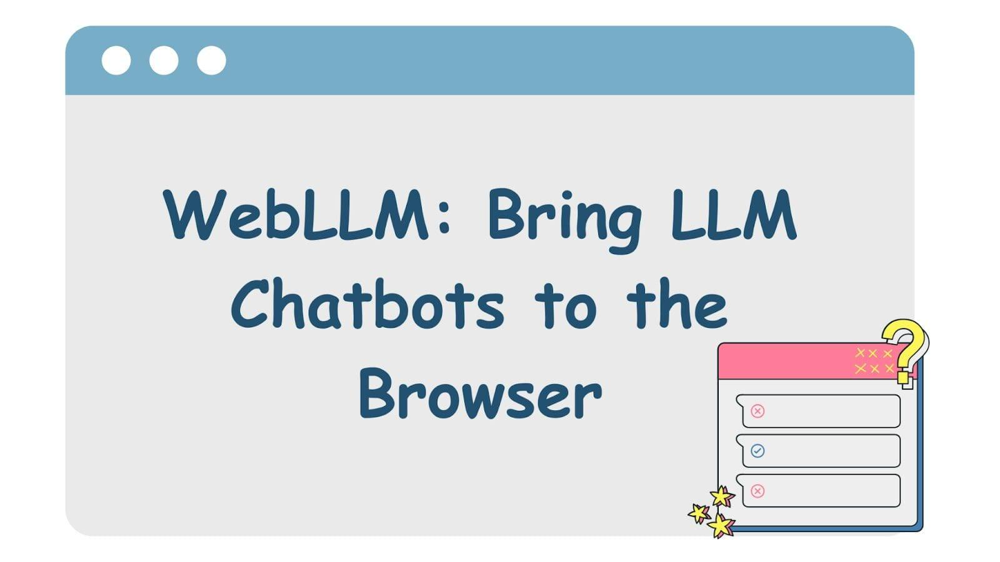

# WebLLM: Chạy Mô Hình Ngôn Ngữ Lớn Trực Tiếp Trong Trình Duyệt Web

## Giới thiệu

WebLLM là một công nghệ tiên tiến cho phép chạy các **Mô hình Ngôn ngữ Lớn (Large Language Models - LLMs)** mạnh mẽ **trực tiếp bên trong trình duyệt web của người dùng**. Điều này có nghĩa là các tác vụ suy luận (inference) của AI diễn ra hoàn toàn trên máy tính cá nhân, loại bỏ sự phụ thuộc vào cơ sở hạ tầng máy chủ đắt đỏ và mang lại nhiều lợi ích về bảo mật, quyền riêng tư và hiệu suất.

WebLLM mở ra cánh cửa cho việc xây dựng các ứng dụng AI thế hệ mới trên nền tảng web, tận dụng sức mạnh xử lý ngay tại thiết bị của người dùng.

## Cách WebLLM Hoạt Động

WebLLM đạt được khả năng này thông qua sự kết hợp của các công nghệ web hiện đại và kỹ thuật tối ưu hóa học máy:

*   **WebAssembly (WASM):** Biên dịch mã tính toán cốt lõi của mô hình LLM thành định dạng WebAssembly hiệu suất cao, cho phép chạy mã gần như tốc độ gốc (near-native speed) trong trình duyệt.
*   **WebGPU:** Tận dụng API đồ họa thế hệ mới (`WebGPU`) để khai thác sức mạnh xử lý song song của **GPU** trên thiết bị người dùng. Điều này tăng tốc đáng kể các phép toán ma trận phức tạp cần thiết cho LLMs.
*   **Trình biên dịch Học máy (ML Compilers):** Sử dụng các framework như `MLC-LLM` và `Apache TVM` để biên dịch và tối ưu hóa các mô hình LLM, tạo ra các kernel WebGPU hiệu quả nhất cho từng kiến trúc phần cứng cụ thể.
*   **Kỹ thuật Tối ưu hóa Tiên tiến:** Tích hợp các kỹ thuật như `PagedAttention` và `FlashAttention` để quản lý bộ nhớ GPU hiệu quả hơn và tăng tốc độ xử lý, đặc biệt là với các chuỗi đầu vào dài.

## Các Mô Hình Được Hỗ Trợ (Ví dụ)

WebLLM có khả năng tương thích và chạy được nhiều mô hình LLM mã nguồn mở phổ biến, bao gồm:

*   Llama 3 (Meta AI)
*   Mistral & Mixtral (Mistral AI)
*   Gemma (Google)
*   Phi-2 (Microsoft)
*   StableLM (Stability AI)
*   Và nhiều mô hình khác trong hệ sinh thái Hugging Face...

## Lợi Ích Chính Của WebLLM

### 1. Bảo Mật và Quyền Riêng Tư Vượt Trội
*   **Dữ liệu không rời khỏi máy người dùng:** Vì toàn bộ quá trình xử lý diễn ra cục bộ, dữ liệu nhạy cảm của người dùng (ví dụ: nội dung chat, tài liệu soạn thảo) không cần phải gửi đến bất kỳ máy chủ bên ngoài nào. Điều này đặc biệt quan trọng đối với các ứng dụng xử lý thông tin cá nhân hoặc bí mật kinh doanh.

### 2. Khả Năng Hoạt Động Ngoại Tuyến (Offline)
*   Sau khi mô hình và ứng dụng web được tải về, WebLLM có thể hoạt động hoàn toàn **không cần kết nối internet**. Điều này cho phép tạo ra các chatbot AI, công cụ hỗ trợ hoạt động ổn định ngay cả trong môi trường mạng không ổn định hoặc không có mạng.

### 3. Giảm Chi Phí Cơ Sở Hạ Tầng Máy Chủ
*   Việc chuyển gánh nặng tính toán từ máy chủ sang thiết bị của người dùng giúp **giảm đáng kể chi phí** liên quan đến việc mua, vận hành và mở rộng quy mô cơ sở hạ tầng máy chủ GPU đắt đỏ, đặc biệt là với các ứng dụng có lượng người dùng lớn.

### 4. Trải Nghiệm Người Dùng Mượt Mà và Nhanh Chóng
*   **Giảm độ trễ:** Phản hồi từ mô hình AI được tạo ra gần như tức thì vì không có độ trễ mạng khi giao tiếp với máy chủ từ xa.
*   Tận dụng trực tiếp phần cứng của người dùng để mang lại hiệu suất tối ưu.

## Ứng Dụng Thực Tế Của WebLLM

*   **Chatbot Tích Hợp Website:** Triển khai chatbot hỗ trợ khách hàng thông minh trực tiếp trên website mà không lo lắng về chi phí API LLM đắt đỏ hoặc vấn đề gửi dữ liệu khách hàng cho bên thứ ba.
*   **Công Cụ Hỗ Trợ Viết Lách Thông Minh:** Xây dựng các trình soạn thảo văn bản, công cụ kiểm tra ngữ pháp, gợi ý nội dung hoạt động hoàn toàn trong trình duyệt, đảm bảo quyền riêng tư cho nội dung của người dùng.
*   **Nền Tảng Học Tập Cá Nhân Hóa:** Tạo ra các trợ lý học tập AI, công cụ giải đáp thắc mắc hoạt động offline, phân tích tiến độ học tập và cung cấp phản hồi tức thì ngay trên trình duyệt.
*   **Phân Tích và Trực Quan Hóa Dữ Liệu Cục Bộ:** Cho phép người dùng tải lên và phân tích dữ liệu của họ bằng AI ngay trên máy tính cá nhân mà không cần gửi dữ liệu nhạy cảm lên đám mây.
*   **Tăng cường Trợ Năng:** Xây dựng các công cụ hỗ trợ người dùng khuyết tật hoạt động ngay lập tức và offline.

## Thách Thức và Hạn Chế

*   **Yêu cầu Phần cứng:** Để có trải nghiệm tốt nhất, đặc biệt với các mô hình lớn, thiết bị người dùng cần có **GPU tương đối mạnh** và đủ **RAM**.
*   **Hỗ trợ Trình duyệt:** Công nghệ `WebGPU` là cốt lõi nhưng vẫn còn tương đối mới và **chưa được hỗ trợ 100%** trên tất cả các trình duyệt và phiên bản cũ.
*   **Kích thước Mô hình và Thời gian Tải:** Việc tải các mô hình LLM (có thể lên tới vài GB) lần đầu tiên có thể **tốn thời gian và băng thông**. Cần có cơ chế caching hiệu quả.
*   **Quản lý Bộ nhớ:** Trình duyệt có những giới hạn về bộ nhớ so với môi trường máy chủ, đòi hỏi các kỹ thuật tối ưu hóa bộ nhớ tinh vi.

## Tương Lai Của WebLLM

WebLLM là một lĩnh vực đang phát triển nhanh chóng. Tương lai hứa hẹn sẽ có:

*   **Tối ưu hóa tốt hơn:** Các kỹ thuật mới để giảm kích thước mô hình (quantization, pruning) và tăng tốc độ suy luận trên trình duyệt.
*   **Hỗ trợ phần cứng rộng rãi hơn:** WebGPU ngày càng được các trình duyệt lớn (Chrome, Edge, Firefox) hỗ trợ tốt hơn.
*   **Mô hình đa phương thức (Multimodal):** Khả năng xử lý không chỉ văn bản mà còn cả hình ảnh, âm thanh trực tiếp trong trình duyệt.
*   **Tích hợp sâu hơn:** Các framework web và công cụ phát triển sẽ tích hợp hỗ trợ WebLLM dễ dàng hơn.

WebLLM đang định hình lại cách chúng ta tương tác với AI trên web, hướng tới một tương lai nơi trí tuệ nhân tạo trở nên riêng tư hơn, dễ tiếp cận hơn và được tích hợp liền mạch vào trải nghiệm trực tuyến hàng ngày.
