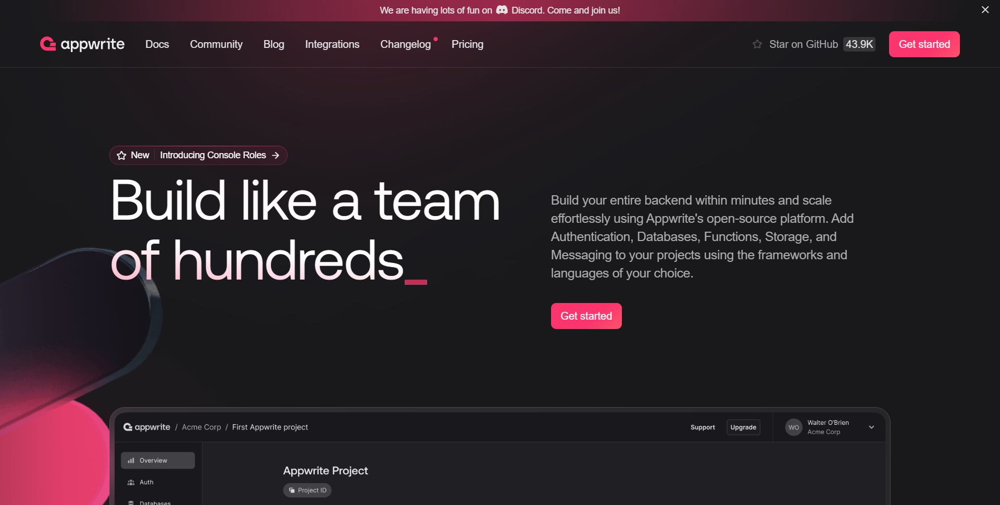

# 1 Tổng Quan về Backend as a Service (BaaS)
Sponsor by https://www.freecodecamp.org/news/backend-as-a-service-beginners-guide/?ref=dailydev

Xây dựng một hệ thống xác thực có thể phức tạp, thường đòi hỏi một máy chủ để lưu trữ dữ liệu người dùng. Đôi khi, bạn cần một giải pháp nhanh hơn, dễ dàng hơn.

Đối với những người mới bắt đầu phát triển hoặc không có chuyên môn kỹ thuật, việc quản lý máy chủ, cơ sở dữ liệu và đăng nhập người dùng có thể quá sức. Đây là lúc Backend as a Service (BaaS) phát huy tác dụng.

Các nền tảng BaaS cung cấp các giải pháp backend sẵn có, giúp việc phát triển ứng dụng trở nên đơn giản hơn. Dù bạn là nhà phát triển hay người không có kinh nghiệm lập trình, BaaS cho phép bạn tập trung vào các tính năng của ứng dụng thay vì xử lý sự phức tạp của backend.

Bài viết này sẽ khám phá về BaaS, các tính năng, giá cả và các công cụ BaaS phổ biến.

## Mục Lục

*   [Backend as a Service (BaaS) là gì?](#backend-as-a-service-baas-là-gì)
*   [Các Tính Năng Chính của BaaS](#các-tính-năng-chính-của-baas)
*   [Tại sao nên sử dụng Backend as a Service (BaaS)?](#tại-sao-nên-sử-dụng-backend-as-a-service-baas)
*   [Khi nào nên sử dụng Backend as a Service (BaaS)?](#khi-nào-nên-sử-dụng-backend-as-a-service-baas)
*   [Các Công Cụ Backend as a Service (BaaS) Phổ Biến là gì?](#các-công-cụ-backend-as-a-service-baas-phổ-biến-là-gì)
*   [Cách Bắt Đầu với BaaS (Ví dụ Nhanh)](#cách-bắt-đầu-với-baas-ví-dụ-nhanh)
*   [Kết Luận](#kết-luận)

## Backend as a Service (BaaS) là gì?

BaaS là một nền tảng đám mây cung cấp cơ sở hạ tầng và dịch vụ backend dựng sẵn. Nó loại bỏ nhu cầu các nhà phát triển phải quản lý máy chủ, cơ sở dữ liệu và các tác vụ backend khác.

*(Hình ảnh: Giao diện đồ họa của BaaS - Nguồn: https://www.cloudflare.com)*

## Các Tính Năng Chính của BaaS

Dưới đây là một số tính năng của BaaS:

*   **Quản lý người dùng:** BaaS giúp dễ dàng tạo và quản lý tài khoản người dùng và đăng nhập mà không cần nhiều code.
*   **Lưu trữ dữ liệu:** Nó cho phép bạn lưu trữ và quản lý dữ liệu, loại bỏ nhu cầu thiết lập cơ sở dữ liệu từ đầu.
*   **API và SDK:** BaaS đi kèm với các công cụ (API và SDK) giúp kết nối ứng dụng của bạn với backend một cách dễ dàng.
*   **Cập nhật thời gian thực:** Nhiều nền tảng BaaS cho phép bạn xem các cập nhật trong thời gian thực, vì vậy ứng dụng của bạn có thể hiển thị dữ liệu trực tiếp cho người dùng.
*   **Lưu trữ tệp:** BaaS cung cấp không gian trên đám mây để lưu trữ tệp và hình ảnh, giúp dễ dàng xử lý việc tải lên của người dùng.
*   **Quản lý máy chủ:** Bạn không cần lo lắng về việc quản lý máy chủ—BaaS sẽ đảm nhiệm việc đó, vì vậy bạn có thể tập trung vào việc xây dựng ứng dụng của mình.
*   **Thông báo đẩy (Push Notifications):** Một số nền tảng BaaS cho phép bạn gửi thông báo cho người dùng về các bản cập nhật hoặc tin nhắn.
*   **Phân tích (Analytics):** BaaS thường cung cấp các công cụ để theo dõi tương tác của người dùng, giúp bạn hiểu điều gì hiệu quả và điều gì không.
*   **Tích hợp bên thứ ba:** Nó cũng giúp dễ dàng tích hợp với các dịch vụ khác như hệ thống thanh toán và mạng xã hội với nỗ lực tối thiểu.
*   **Khả năng mở rộng (Scalability):** Khi ứng dụng của bạn phát triển, BaaS sẽ mở rộng theo, xử lý nhiều người dùng và dữ liệu hơn một cách liền mạch.

## Tại sao nên sử dụng Backend as a Service (BaaS)?

Có một số lý do chính tại sao BaaS là một lựa chọn tuyệt vời cho các nhà phát triển:

*   **Tăng tốc độ phát triển:** Các tính năng dựng sẵn giúp giảm thời gian phát triển, cho phép bạn tập trung vào thiết kế và chức năng thay vì các vấn đề backend.
*   **Giảm thiểu quản lý:** Với BaaS, bạn không phải lo lắng về máy chủ, khả năng mở rộng hoặc cập nhật bảo mật—nhà cung cấp sẽ lo tất cả.
*   **Tính năng cốt lõi:** Hầu hết các nền tảng BaaS cung cấp các tính năng thiết yếu như xác thực người dùng, lưu trữ dữ liệu và cập nhật thời gian thực, giúp bạn xây dựng ứng dụng mà không cần bắt đầu từ đầu.
*   **Khả năng mở rộng:** Khi ứng dụng của bạn có nhiều người dùng hơn, BaaS có thể xử lý! Các dịch vụ này tự điều chỉnh để hỗ trợ nhiều người dùng và dữ liệu hơn, vì vậy bạn có thể tập trung vào việc phát triển ứng dụng của mình.
*   **Tập trung vào trải nghiệm người dùng:** BaaS xử lý cơ sở hạ tầng để bạn không cần tốn thời gian hoặc tiền bạc vào backend. Điều này cho phép bạn tập trung vào thiết kế và tạo ra trải nghiệm người dùng mang lại giá trị cho người dùng của bạn.

## Khi nào nên sử dụng Backend as a Service (BaaS)?

BaaS hoàn hảo để xây dựng một ứng dụng trong thời gian ngắn mà không cần quản lý backend. Dưới đây là các tình huống khi BaaS có ý nghĩa:

*   **Phát triển nhanh (Rapid Development):** BaaS xử lý backend của ứng dụng, cho phép bạn tập trung vào các tính năng của nó. Ví dụ: khi xây dựng ứng dụng danh sách việc cần làm, BaaS giúp dễ dàng quản lý đăng nhập người dùng và dữ liệu tác vụ mà không cần thiết lập máy chủ từ đầu.
*   **Nhóm nhỏ hoặc nhà phát triển đơn lẻ:** Đối với các nhóm nhỏ hoặc nhà phát triển solo, BaaS xử lý backend. Bạn không cần thêm tài nguyên.
*   **Startup và MVP (Minimum Viable Product):** Nếu bạn đang khởi nghiệp, BaaS cho phép bạn phát hành Sản phẩm Khả thi Tối thiểu (MVP) mà không chậm trễ. Nó giúp bạn tăng tốc độ phát triển và cắt giảm chi phí.
*   **Yêu cầu tính năng cụ thể:** Nếu ứng dụng của bạn cần các tính năng như xác thực người dùng, lưu trữ dữ liệu hoặc thông báo đẩy, BaaS cung cấp chúng sẵn có. Ví dụ: khi xây dựng ứng dụng mạng xã hội, BaaS đơn giản hóa việc đăng nhập của người dùng và tải lên tệp, giúp bạn không phải bắt đầu từ đầu.
*   **Nhu cầu mở rộng:** BaaS tự động mở rộng quy mô để hỗ trợ nhiều người dùng hơn, cho phép bạn tập trung vào việc cải thiện ứng dụng của mình. Ví dụ: một trò chơi nhiều người chơi nhỏ có thể bắt đầu với một vài người chơi và khi nó phát triển, BaaS sẽ xử lý hàng nghìn người một cách liền mạch mà không cần nỗ lực backend bổ sung.

## Các Công Cụ Backend as a Service (BaaS) Phổ Biến là gì?

Nếu bạn đang muốn khám phá BaaS, dưới đây là các nền tảng phổ biến bạn có thể sử dụng:

### Clerk

Clerk tập trung vào quản lý người dùng. Nó cung cấp các công cụ để xác thực, hồ sơ người dùng và quản lý quyền. Rất tốt cho các nhà phát triển cần quản lý người dùng đơn giản trong ứng dụng của họ.

*   **Tính năng:**
    *   Xác thực đa yếu tố (MFA)
    *   Đăng nhập không mật khẩu (liên kết ma thuật, OTP)
    *   Đăng nhập mạng xã hội & OAuth (Google, GitHub, v.v.)
    *   SSO doanh nghiệp (SAML, OAuth)
    *   Đăng nhập sinh trắc học (Face ID, Touch ID)
    *   Quản lý hồ sơ người dùng & thuộc tính tùy chỉnh
    *   Vai trò & quyền hạn
    *   Nhóm & tổ chức
    *   Quản lý phiên
    *   Bảo mật: Xác thực dựa trên token (JWT), giới hạn tỷ lệ, nhật ký kiểm toán, tuân thủ GDPR & SOC 2
    *   Hỗ trợ nhà phát triển: Thành phần UI dựng sẵn, SDK cho React, Next.js, Vue, v.v., mẫu email & SMS tùy chỉnh
*   **Giá cả:**
    *   **Free Plan:** Miễn phí lên đến 10.000 Người dùng hoạt động hàng tháng (MAU).
    *   **Pro Plan:** $25/tháng (bao gồm 10.000 MAU đầu tiên).
*   **Tìm hiểu thêm:** [Clerk](https://clerk.com/) | [Giá Clerk](https://clerk.com/pricing)

### Firebase

Firebase là một nền tảng BaaS được Google hỗ trợ. Nó nổi tiếng với cơ sở dữ liệu thời gian thực, xác thực và lưu trữ đám mây. Nó cũng có các công cụ dễ sử dụng cho các ứng dụng web và di động.

*   **Tính năng:**
    *   **Dịch vụ Backend:** Firestore & Realtime Database, Cloud Storage, Serverless Functions, Web Hosting.
    *   **Xác thực:** Đăng nhập bằng email & mật khẩu, đăng nhập mạng xã hội (Google, Facebook, v.v.), xác thực điện thoại, đăng nhập ẩn danh.
    *   **Phân tích & Giám sát:** Google Analytics, theo dõi sự cố (Crashlytics), giám sát hiệu suất, thử nghiệm A/B.
    *   **Công cụ Tương tác:** Thông báo đẩy, cập nhật ứng dụng từ xa, nhắn tin trong ứng dụng.
    *   **Machine Learning:** Nhận dạng văn bản, gắn nhãn hình ảnh.
*   **Giá cả:**
    *   **Spark Plan:** Gói miễn phí với giới hạn sử dụng.
    *   **Blaze Plan:** Trả theo mức sử dụng thực tế.
*   **Tìm hiểu thêm:** [Firebase](https://firebase.google.com/) | [Giá Firebase](https://firebase.google.com/pricing)

!

### Convex

Convex là một nền tảng BaaS serverless. Nó cung cấp đồng bộ hóa dữ liệu thời gian thực và các dịch vụ backend có thể mở rộng. Thiết kế đơn giản hóa điện toán serverless cho các nhà phát triển.

*   **Tính năng:**
    *   **Database:** Lưu trữ dữ liệu thời gian thực.
    *   **Serverless Functions:** Chạy logic backend mà không cần quản lý máy chủ.
    *   **Authentication:** Xác thực người dùng và kiểm soát truy cập tích hợp.
    *   **Caching:** Truy xuất dữ liệu nhanh hơn.
    *   **Webhooks & Crons:** Tự động hóa tác vụ & kích hoạt sự kiện.
*   **Giá cả:**
    *   **Free Plan:** Tài nguyên hạn chế cho các dự án nhỏ.
    *   **Pro Plan:** Trả theo mức sử dụng.
*   **Tìm hiểu thêm:** [Convex](https://www.convex.dev/) | [Giá Convex](https://www.convex.dev/pricing)

### 8base

Một nền tảng low-code cho phép các nhà phát triển xây dựng ứng dụng serverless với thiết lập tối thiểu. Nó cung cấp các công cụ quản lý cơ sở dữ liệu, xác thực và phát triển API.

*   **Tính năng:**
    *   **Backend Builder:** Quản lý cơ sở dữ liệu dễ dàng.
    *   **Serverless Functions:** Chạy logic backend tùy chỉnh.
    *   **GraphQL API:** API tự động tạo cho dữ liệu của bạn.
    *   **Authentication:** Đăng nhập người dùng & kiểm soát truy cập tích hợp.
    *   **File Management:** Lưu trữ và quản lý tệp.
*   **Giá cả:**
    *   **Free Plan:** $0/tháng (1 nhà phát triển, tính năng cơ bản).
    *   **Developer Plan:** $25/tháng cho mỗi nhà phát triển.
    *   **Professional Plan:** $150/tháng (5 nhà phát triển).
    *   **Custom Plan:** Liên hệ 8base cho các giải pháp doanh nghiệp.
*   **Tìm hiểu thêm:** [8base](https://www.8base.com/) | [Giá 8base](https://www.8base.com/pricing)

### Backendless

Backendless là một nền tảng no-code giúp phát triển ứng dụng dễ dàng. Nó cung cấp API, lưu trữ dữ liệu, quản lý người dùng và cập nhật thời gian thực ở một nơi.

*   **Tính năng:**
    *   **UI Builder:** Thiết kế giao diện người dùng ứng dụng trực quan mà không cần code.
    *   **Real-Time Database:** Lưu trữ và đồng bộ hóa dữ liệu theo thời gian thực trên các client.
    *   **User Authentication:** Quản lý đăng ký, đăng nhập và vai trò người dùng.
    *   **Cloud Code:** Thực hiện logic phía máy chủ tùy chỉnh mà không cần quản lý máy chủ.
    *   **Push Notifications:** Gửi cảnh báo thời gian thực cho người dùng trên các thiết bị khác nhau.
*   **Giá cả:**
    *   **Free Plan:** Lý tưởng cho các dự án nhỏ hoặc mục đích học tập.
    *   **Scale Fixed Plan:** Cung cấp hóa đơn hàng tháng có thể dự đoán với giới hạn tài nguyên đã đặt.
    *   **Scale Variable Plan:** Cung cấp tính linh hoạt với hóa đơn dựa trên mức sử dụng, mở rộng quy mô khi ứng dụng của bạn phát triển.
    *   **Backendless Pro:** Giải pháp tự lưu trữ cho các doanh nghiệp yêu cầu khả năng mở rộng và kiểm soát không giới hạn.
*   **Tìm hiểu thêm:** [Backendless](https://backendless.com/) | [Giá Backendless](https://backendless.com/pricing/)

### Appwrite

Appwrite là một BaaS mã nguồn mở cung cấp cơ sở dữ liệu, xác thực, lưu trữ tệp, cập nhật thời gian thực, hàm serverless và quản lý API. Nó hỗ trợ nhiều nền tảng và cung cấp bảo mật và khả năng mở rộng tích hợp cho các ứng dụng hiện đại.

*   **Tính năng:**
    *   **Authentication:** Đăng nhập người dùng an toàn với hơn 30 phương thức, bao gồm email/mật khẩu, OAuth và URL ma thuật.
    *   **Database:** Lưu trữ có thể mở rộng với quyền nâng cao, xác thực dữ liệu tùy chỉnh và hỗ trợ mối quan hệ.
    *   **Functions:** Triển khai các hàm serverless bằng hơn 13 ngôn ngữ, với triển khai GitHub tự động và hỗ trợ tên miền tùy chỉnh.
    *   **Storage:** Quản lý và phân phát tệp với các tính năng bảo mật và quyền riêng tư tích hợp.
    *   **Real-Time:** Đăng ký các sự kiện cơ sở dữ liệu để cập nhật tức thì.
*   **Giá cả:**
    *   **Free:** $0/tháng (5GB băng thông, 2GB dung lượng lưu trữ, 750K lượt chạy hàm).
    *   **Pro:** Bắt đầu từ $15/tháng (thêm dung lượng lưu trữ, băng thông và tính năng).
    *   **Scale:** Bắt đầu từ $599/tháng (cho các dự án quy mô lớn).
*   **Tìm hiểu thêm:** [Appwrite](https://appwrite.io/) | [Giá Appwrite](https://appwrite.io/pricing)

### Nhost

Nhost là một nền tảng backend đầy đủ với API GraphQL, cơ sở dữ liệu, xác thực và lưu trữ. Dễ dàng thiết lập và tuyệt vời cho việc phát triển ứng dụng hiện đại.

*   **Tính năng:**
    *   **Authentication:** Đăng nhập an toàn bằng email, OAuth, v.v.
    *   **Database:** Lưu trữ có thể mở rộng với quyền.
    *   **Serverless Functions:** Chạy mã backend mà không cần máy chủ.
    *   **Storage:** Lưu trữ tệp an toàn.
    *   **Real-Time:** Cập nhật tức thì về thay đổi dữ liệu.
*   **Giá cả:**
    *   **Free:** $0/tháng (tính năng cơ bản cho các dự án nhỏ).
    *   **Pro:** $25/tháng (thêm tài nguyên & hỗ trợ).
    *   **Dedicated Compute:** $50/tháng cho mỗi vCPU/2GB RAM (cho các ứng dụng cần mở rộng).
*   **Tìm hiểu thêm:** [Nhost](https://nhost.io/) | [Giá Nhost](https://nhost.io/pricing)

### Back4app

Back4App là một BaaS mã nguồn mở giúp đơn giản hóa việc phát triển backend. Nó cung cấp một cơ sở hạ tầng hoàn chỉnh để xây dựng, lưu trữ và quản lý các ứng dụng có thể mở rộng. Với các tính năng phía máy chủ tích hợp, các nhà phát triển có thể tập trung vào việc viết mã mà không cần quản lý máy chủ hoặc cơ sở dữ liệu.

*   **Tính năng:**
    *   **Database:** Quản lý dữ liệu bằng API & trình chỉnh sửa trực quan.
    *   **Authentication:** Đăng nhập người dùng an toàn & vai trò.
    *   **Real-Time:** Cập nhật dữ liệu tức thì.
    *   **Push Notifications:** Gửi cảnh báo cho người dùng.
    *   **Cloud Functions:** Chạy mã backend tùy chỉnh.
*   **Giá cả:**
    *   **Free:** 25K yêu cầu, 250MB dung lượng lưu trữ, 1GB chuyển/tháng.
    *   **MVP Plan:** Dành cho việc ra mắt các ứng dụng nhỏ (để kiểm tra và xác thực ý tưởng).
    *   **Dedicated Plan:** Dành cho các ứng dụng sản xuất với nhiều tài nguyên hơn (máy chủ riêng, hiệu suất tốt hơn).
*   **Tìm hiểu thêm:** [Back4app](https://www.back4app.com/) | [Giá Back4app](https://www.back4app.com/pricing)

### AWS Amplify

AWS Amplify là một nền tảng phát triển từ Amazon Web Services (AWS). Nó đơn giản hóa việc xây dựng và triển khai các ứng dụng web và di động. Nó cung cấp các công cụ và dịch vụ cho các nhà phát triển. Họ có thể tích hợp các backend có thể mở rộng, quản lý frontend và thêm các tính năng như xác thực, lưu trữ và API.

*   **Tính năng:**
    *   **Authentication:** Đăng nhập an toàn bằng email, đăng nhập mạng xã hội và xác thực đa yếu tố.
    *   **Database & API:** Xây dựng API thời gian thực với cơ sở dữ liệu AWS.
    *   **Storage:** Quản lý tệp và phương tiện với Amazon S3.
    *   **Hosting:** Triển khai các ứng dụng full-stack với triển khai liên tục.
*   **Giá cả:**
    *   **Free Tier (12 tháng đầu):** 1.000 phút build/tháng, 5GB lưu trữ, 15GB băng thông, 500K yêu cầu API.
    *   **Pay-As-You-Go (Sau Free Tier):** Build & Deploy – $0.01/phút build; Storage – $0.023/GB/tháng; Bandwidth – $0.15/GB; API Requests – $0.30/1 triệu yêu cầu.
*   **Tìm hiểu thêm:** [AWS Amplify](https://aws.amazon.com/amplify/) | [Giá AWS Amplify](https://aws.amazon.com/amplify/pricing/)

### Supabase

Supabase là một giải pháp thay thế mã nguồn mở cho Firebase. Nó sử dụng PostgreSQL cho cơ sở dữ liệu của mình. Nó có các tính năng tích hợp như xác thực, API và đăng ký thời gian thực.

*   **Tính năng:**
    *   **Database:** PostgreSQL với hỗ trợ SQL đầy đủ.
    *   **Authentication:** Đăng nhập an toàn bằng email, mật khẩu và đăng nhập mạng xã hội.
    *   **Storage:** Lưu trữ và phân phát tệp dễ dàng.
    *   **Real-Time:** Nhận cập nhật tức thì khi dữ liệu thay đổi.
    *   **Edge Functions:** Chạy logic backend serverless.
*   **Giá cả:**
    *   **Free:** Tuyệt vời cho các dự án nhỏ (học tập, thử nghiệm).
    *   **Pro:** Bắt đầu từ $25/tháng (bao gồm $10 tín dụng điện toán).
    *   **Team:** Bắt đầu từ $599/tháng (cho các tính năng nâng cao & hỗ trợ).
*   **Tìm hiểu thêm:** [Supabase](https://supabase.io/) | [Giá Supabase](https://supabase.io/pricing)

## Cách Bắt Đầu với BaaS (Ví dụ Nhanh)

Hãy cùng xem qua một ví dụ nhanh để bắt đầu. Trong hướng dẫn này, tôi sẽ sử dụng Firebase làm ví dụ.

1.  **Đăng ký Firebase:** Truy cập trang web Firebase và đăng ký bằng tài khoản Google của bạn.
2.  **Tạo Dự án Mới:** Sau khi đăng nhập, tạo một dự án Firebase mới bằng cách làm theo hướng dẫn trên màn hình.
3.  **Kích hoạt Xác thực:** Đi tới "Authentication" và bật phương thức đăng nhập, như email/mật khẩu hoặc đăng nhập Google.
4.  **Thiết lập Cơ sở dữ liệu:** Trong "Firestore Database", tạo một cơ sở dữ liệu mới cho dữ liệu ứng dụng của bạn.
5.  **Tích hợp SDK:** Cài đặt Firebase SDK trong dự án của bạn và tích hợp xác thực, cơ sở dữ liệu và các dịch vụ Firebase khác vào ứng dụng của bạn.

Để biết hướng dẫn chi tiết hơn về cách thiết lập Firebase, hãy xem bài viết này: [Cách Xác thực Ứng dụng React của bạn bằng Firebase](<link-to-your-article-if-available>) nơi tôi giải thích từng bước một cách chi tiết. *(Lưu ý: Thay thế `<link-to-your-article-if-available>` bằng liên kết thực tế nếu có).*

## Kết Luận

Backend as a Service (BaaS) là lý tưởng cho các nhà phát triển. Nó cung cấp một cách hiệu quả và tiết kiệm chi phí để xử lý các tác vụ phát triển backend. BaaS có thể tăng tốc độ phát triển của bạn. Nó cho phép bạn tránh quản lý máy chủ. Sau đó, bạn có thể tập trung vào việc xây dựng các ứng dụng tốt hơn.