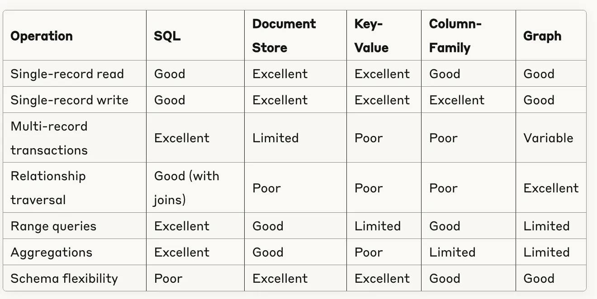
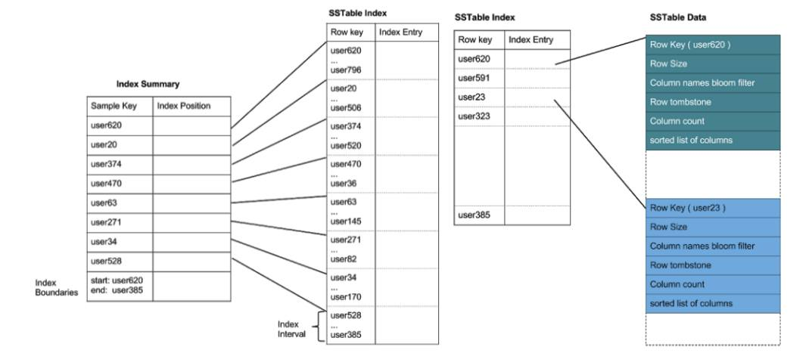
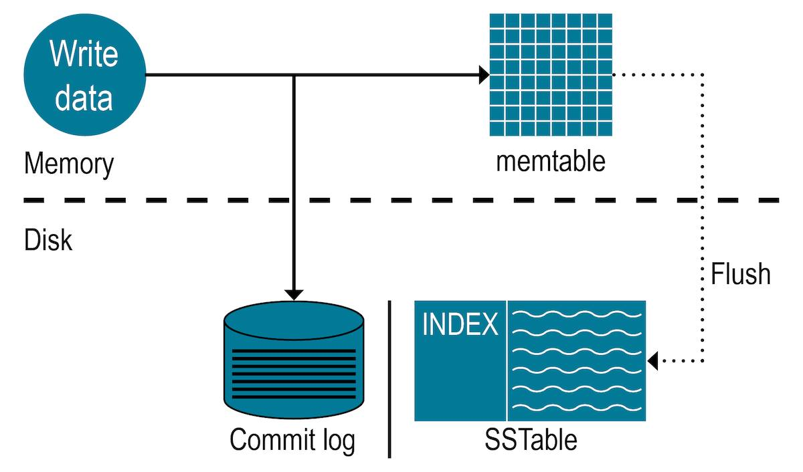
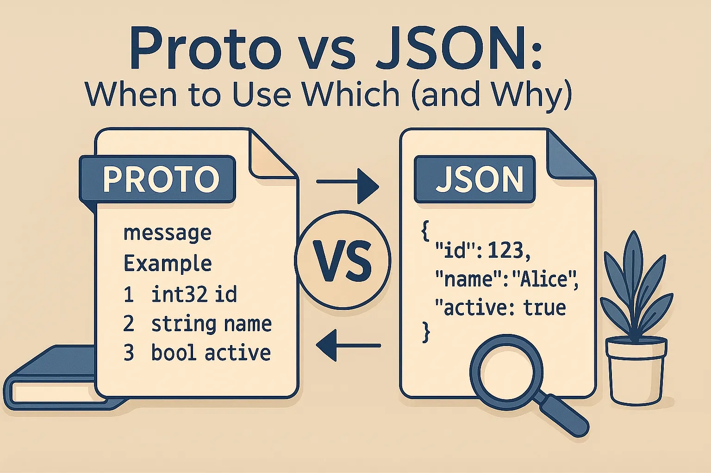
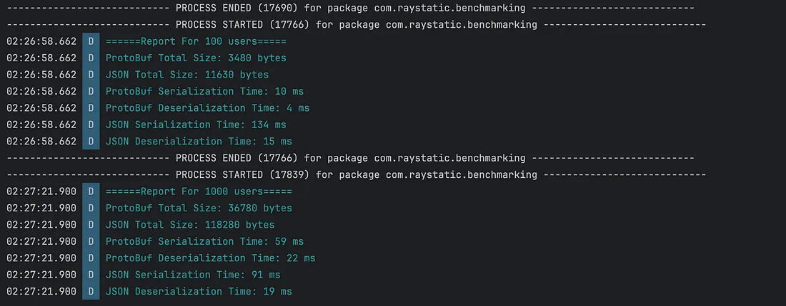
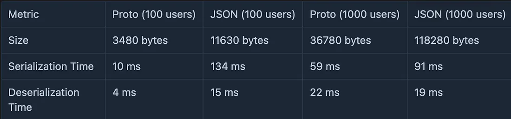

# 1 Hướng dẫn Lựa chọn Cơ sở dữ liệu: SQL vs. NoSQL

## Giới thiệu

Việc lựa chọn đúng loại cơ sở dữ liệu (**SQL** hay **NoSQL**) là một quyết định nền tảng cho bất kỳ ứng dụng nào. Lựa chọn này ảnh hưởng trực tiếp đến hiệu suất, khả năng mở rộng, và quá trình phát triển. Hướng dẫn này cung cấp cái nhìn tổng quan và các yếu tố cần cân nhắc để đưa ra quyết định phù hợp nhất.

## Hiểu về SQL và NoSQL

### Cơ sở dữ liệu SQL (Structured Query Language)

*   **Mô hình:** Dữ liệu được tổ chức trong các bảng (relations) với cấu trúc (schema) được định nghĩa trước.
*   **Đặc điểm:**
    *   Dữ liệu có cấu trúc rõ ràng, schema cố định.
    *   Tuân thủ **ACID** (Atomicity, Consistency, Isolation, Durability) - Đảm bảo tính toàn vẹn giao dịch.
    *   Quan hệ giữa các bảng được định nghĩa qua khóa ngoại.
    *   Mở rộng chủ yếu theo chiều dọc (Vertical Scaling - nâng cấp phần cứng máy chủ).
    *   Ngôn ngữ truy vấn chuẩn hóa (**SQL**).
    *   Mạnh mẽ cho các truy vấn phức tạp, JOIN nhiều bảng.
*   **Ví dụ phổ biến:** `PostgreSQL`, `MySQL`, `SQL Server`, `Oracle`, `MariaDB`.

### Cơ sở dữ liệu NoSQL ("Not Only SQL")

*   **Mục đích:** Giải quyết hạn chế của SQL, đặc biệt với dữ liệu lớn, không/bán cấu trúc và yêu cầu mở rộng cao.
*   **Đặc điểm:**
    *   Schema linh hoạt hoặc không cần schema (schema-less).
    *   Thiết kế cho mở rộng theo chiều ngang (Horizontal Scaling - thêm máy chủ).
    *   Thường ưu tiên Tính sẵn sàng (Availability) và Khả năng chịu lỗi phân vùng (Partition Tolerance) hơn Tính nhất quán (Consistency) mạnh (theo định lý **CAP**).
    *   Tối ưu cho các mô hình dữ liệu cụ thể.
    *   Thường có API truy vấn đơn giản hơn SQL.
*   **Các loại chính:**
    *   **Document:** `MongoDB`, `Couchbase`
    *   **Key-Value:** `Redis`, `Memcached`, `DynamoDB`
    *   **Column-Family (Wide-Column):** `Cassandra`, `HBase`
    *   **Graph:** `Neo4j`, `Amazon Neptune`

## Cây Quyết định: Lựa chọn SQL hay NoSQL?

Xem xét các yếu tố sau để xác định loại cơ sở dữ liệu phù hợp:

**1. Cấu trúc Dữ liệu (Data Structure):**

    Dữ liệu có cấu trúc cao, schema cố định, quan hệ rõ ràng, cần toàn vẹn dữ liệu mạnh?
           ➡️ Chọn SQL
    
    Dữ liệu bán/không cấu trúc, schema linh hoạt, dữ liệu dạng tài liệu (JSON/XML), thuộc tính đa dạng?
           ➡️ Chọn NoSQL

**2. Khả Năng Mở rộng (Scalability):**
    Tăng trưởng dự đoán được, mở rộng dọc (nâng cấp server) là đủ?
           ➡️ Chọn SQL

    Dữ liệu cực lớn, tăng trưởng nhanh/khó đoán, cần mở rộng ngang (thêm server), kiến trúc phân tán?
           ➡️ Chọn NoSQL (Đặc biệt là Key-Value, Column-Family)

**3. Độ phức tạp Truy vấn (Query Complexity):**

    Cần truy vấn phức tạp, JOIN nhiều bảng, tổng hợp, báo cáo, giao dịch ACID?
           ➡️ Chọn SQL

    Truy vấn chủ yếu dựa trên khóa (key lookup), đọc/ghi thông lượng cao, thao tác trên tài liệu đơn lẻ?
           ➡️ Chọn NoSQL

**4. Yêu cầu về Tính nhất quán (Consistency):**

    Cần tính nhất quán mạnh (Strong Consistency) ngay lập tức (VD: tài chính, kho hàng)?
           ➡️ Chọn SQL

    Chấp nhận tính nhất quán cuối cùng (Eventual Consistency) (VD: mạng xã hội, CMS, analytics)?
           ➡️ Chọn NoSQL

**5. Tốc độ Phát triển & Tính linh hoạt (Development Speed & Flexibility):**

    Mô hình dữ liệu ổn định, cần xác thực mạnh, quy trình phát triển có cấu trúc?
           ➡️ Chọn SQL

    Yêu cầu dữ liệu thay đổi nhanh, phát triển lặp (agile), kiến trúc microservices?
           ➡️ Chọn NoSQL

## Lựa chọn Loại Cơ sở dữ liệu NoSQL Phù hợp

Nếu quyết định chọn NoSQL, hãy xem xét loại nào phù hợp nhất:

*   **Document Databases (Cơ sở dữ liệu Tài liệu):**
    *   **Phù hợp:** Lưu trữ dữ liệu dạng tài liệu (JSON, BSON, XML) với cấu trúc linh hoạt. Tốt cho CMS, catalog sản phẩm, hồ sơ người dùng.
    *   **Ví dụ:** `MongoDB`, `Couchbase`.
*   **Key-Value Stores (Cơ sở dữ liệu Khóa-Giá trị):**
    *   **Phù hợp:** Truy cập dữ liệu cực nhanh dựa trên khóa duy nhất. Lý tưởng cho caching, quản lý session, dữ liệu thời gian thực đơn giản.
    *   **Ví dụ:** `Redis`, `Memcached`, `DynamoDB`.
*   **Column-Family Stores (Cơ sở dữ liệu Họ Cột):**
    *   **Phù hợp:** Khối lượng ghi cực lớn, dữ liệu phân tán rộng. Tốt cho dữ liệu chuỗi thời gian (time-series), IoT, logging, analytics lớn.
    *   **Ví dụ:** `Cassandra`, `HBase`.
*   **Graph Databases (Cơ sở dữ liệu Đồ thị):**
    *   **Phù hợp:** Dữ liệu có mối quan hệ phức tạp, cần truy vấn các liên kết hiệu quả. Lý tưởng cho mạng xã hội, hệ thống gợi ý (recommendation), phát hiện gian lận.
    *   **Ví dụ:** `Neo4j`, `ArangoDB`.

## Ví dụ Thực tế

*   **Nền tảng Thương mại điện tử:**
    *   **Yêu cầu:** Danh mục sản phẩm đa dạng (NoSQL - Document), đơn hàng/khách hàng (SQL), kho/thanh toán (SQL - ACID).
    *   **Giải pháp tiềm năng:** Hybrid - `MongoDB` cho sản phẩm, `PostgreSQL` cho giao dịch.
*   **Nền tảng Phân tích IoT:**
    *   **Yêu cầu:** Dữ liệu cảm biến lớn (NoSQL - Column-Family/Time-Series), siêu dữ liệu thiết bị (SQL/NoSQL - Document), thời gian thực.
    *   **Giải pháp tiềm năng:** `Cassandra`/`InfluxDB` cho dữ liệu chuỗi thời gian, `PostgreSQL` cho siêu dữ liệu.
*   **Ứng dụng Mạng xã hội:**
    *   **Yêu cầu:** Hồ sơ người dùng (SQL/NoSQL - Document), Mối quan hệ bạn bè (NoSQL - Graph), Nội dung bài đăng (NoSQL - Document), Đề xuất (NoSQL - Graph).
    *   **Giải pháp tiềm năng:** Hybrid - `Neo4j` cho quan hệ, `MongoDB` cho nội dung, `PostgreSQL` cho thông tin cơ bản user.

## Cân nhắc về Hiệu suất

*   **SQL:** Thường mạnh hơn ở các truy vấn phức tạp, JOIN, đảm bảo ACID.
*   **NoSQL:** Thường nhanh hơn cho các truy vấn đơn giản, thông lượng đọc/ghi cao, khả năng mở rộng ngang tốt hơn, xử lý dữ liệu không/bán cấu trúc.

## Kết luận

Lựa chọn giữa SQL và NoSQL không phải là "một mất một còn". Nó phụ thuộc hoàn toàn vào **yêu cầu cụ thể** của ứng dụng. Xu hướng hiện đại thường sử dụng **kiến trúc hybrid (polyglot persistence)**, kết hợp điểm mạnh của cả hai loại để tối ưu cho từng phần của hệ thống.

Hãy phân tích kỹ lưỡng các yếu tố sau trước khi đưa ra quyết định:
*   Cấu trúc dữ liệu & mối quan hệ.
*   Nhu cầu về khả năng mở rộng.
*   Độ phức tạp của truy vấn.
*   Yêu cầu về tính nhất quán.
*   Tính linh hoạt trong phát triển.

Đầu tư thời gian phân tích ban đầu sẽ giúp tránh chi phí tốn kém và phức tạp khi phải thay đổi cơ sở dữ liệu trong tương lai.



# 2 SSTables: Nền Tảng Lưu Trữ Hiệu Quả Cho Cơ Sở Dữ Liệu Hiện Đại

## SSTables Là Gì?

SSTables (Sorted String Tables) là một cấu trúc lưu trữ trên đĩa quan trọng, đóng vai trò cốt lõi trong nhiều hệ thống cơ sở dữ liệu hiện đại, đặc biệt là những hệ thống dựa trên kiến trúc Log-Structured Merge (LSM) Trees. Khi `Memtables` (bộ nhớ đệm trong RAM) đầy, dữ liệu sẽ được đẩy xuống đĩa dưới dạng SSTables. Các SSTable này là các tệp **bất biến** chứa các cặp khóa-giá trị **đã được sắp xếp** theo khóa.

## Đặc Điểm Chính Của SSTables

### 1. Tính Bất Biến (Immutability)

*   **Chỉ đọc:** Sau khi được tạo ra, nội dung của một SSTable không thể thay đổi.
*   **Xử lý Cập nhật/Xóa:** Các thao tác cập nhật và xóa được thực hiện bằng cách ghi các bản ghi mới vào các SSTable *khác* (hoặc `Memtable`).
*   **Đọc Đồng Thời:** Tính bất biến loại bỏ nhu cầu về cơ chế khóa phức tạp khi đọc dữ liệu, cho phép truy cập đồng thời hiệu quả.

### 2. Sắp Xếp Theo Khóa (Sorted by Key)

*   **Tìm kiếm Hiệu quả:** Dữ liệu được sắp xếp cho phép sử dụng tìm kiếm nhị phân (binary search) nhanh chóng.
*   **Truy vấn Phạm vi (Range Queries):** Hỗ trợ tối ưu cho các truy vấn lấy dữ liệu trong một khoảng khóa nhất định.
*   **Nén và Gộp (Compaction):** Việc sắp xếp tạo điều kiện thuận lợi cho quá trình nén và gộp các SSTable.

### 3. Cấu Trúc Tệp Tối Ưu (Optimized File Structure)

*   **Khối Dữ Liệu Nén:** Thường chứa dữ liệu dưới dạng các khối đã được nén để tiết kiệm không gian và tăng tốc độ đọc tuần tự.
*   **Chỉ Mục và Bộ Lọc Bloom:** Bao gồm các cấu trúc chỉ mục (indexes) và bộ lọc Bloom (Bloom filters) để tăng tốc độ tìm kiếm khóa, giảm thiểu truy cập đĩa không cần thiết.
*   **Đọc Tuần Tự:** Thiết kế tối ưu cho việc đọc dữ liệu tuần tự từ đĩa, vốn nhanh hơn nhiều so với đọc ngẫu nhiên.

## Vòng Đời Của SSTables

### 1. Tạo SSTable (Flushing)

Quá trình này xảy ra khi một `Memtable` đầy:
1.  `Memtable` hiện tại trở thành bất biến, không nhận thêm các bản ghi mới.
2.  Dữ liệu đã được sắp xếp trong `Memtable` này được ghi tuần tự xuống đĩa dưới dạng một tệp SSTable mới.
3.  Các siêu dữ liệu (metadata), chỉ mục, và bộ lọc Bloom được tạo cùng lúc để hỗ trợ truy vấn sau này.

### 2. Quá Trình Nén (Compaction)

Theo thời gian, số lượng SSTables sẽ tăng lên. Quá trình nén là cần thiết để quản lý các tệp này và tối ưu hóa hiệu suất:
*   **Mục đích:**
    *   Loại bỏ dữ liệu trùng lặp (các phiên bản cũ của cùng một khóa).
    *   Loại bỏ các bản ghi đã bị xóa (đánh dấu "tombstone").
    *   Giảm số lượng tệp SSTable cần kiểm tra trong quá trình đọc.
    *   Tối ưu hóa việc sử dụng không gian lưu trữ.
*   **Các loại hình nén phổ biến:**
    *   **Nén Nhỏ (Minor Compaction):** Thường gộp các SSTable nhỏ, mới được tạo thành các SSTable lớn hơn một chút.
    *   **Nén Lớn/Cấp (Major/Leveled Compaction):** Gộp các SSTable từ các cấp (levels) khác nhau trong cây LSM, thường loại bỏ hoàn toàn dữ liệu trùng lặp và đã xóa trong phạm vi gộp.
    *   **Nén Phạm Vi (Range Compaction):** Gộp các SSTable có phạm vi khóa chồng chéo.

## Cách SSTables Hỗ Trợ Các Thao Tác Cơ Sở Dữ Liệu

### Thao Tác Đọc (Read Operations)

Khi một yêu cầu đọc một khóa cụ thể đến:
1.  Hệ thống kiểm tra `Memtable` đang hoạt động.
2.  Kiểm tra các `Memtable` bất biến (đang chờ ghi xuống đĩa).
3.  Sử dụng bộ lọc Bloom để nhanh chóng loại bỏ các SSTable chắc chắn không chứa khóa cần tìm.
4.  Tìm kiếm trong các SSTable còn lại, thường theo thứ tự từ mới nhất đến cũ nhất.
5.  Nếu tìm thấy nhiều phiên bản của khóa (do cập nhật), hệ thống sẽ kết hợp kết quả dựa trên dấu thời gian (timestamp) để trả về giá trị mới nhất (và chưa bị đánh dấu xóa).

### Xử Lý Cập Nhật Và Xóa (Update and Delete Operations)

Do tính bất biến, SSTables không bao giờ được sửa đổi trực tiếp:
*   **Cập nhật (Update):** Một bản ghi mới với cùng khóa nhưng giá trị mới (và dấu thời gian mới hơn) được ghi vào `Memtable` hiện tại.
*   **Xóa (Delete):** Một bản ghi đặc biệt gọi là "tombstone" (bia mộ) được ghi vào `Memtable`. Bản ghi này chỉ ra rằng khóa tương ứng đã bị xóa tại thời điểm đó.
*   **Dọn dẹp:** Các phiên bản cũ của dữ liệu và các bản ghi `tombstone` sẽ bị loại bỏ hoàn toàn trong quá trình nén (Compaction).

## SSTables Trong Các Hệ Thống Cơ Sở Dữ Liệu Phổ Biến

*   **Apache Cassandra:**
    *   SSTables là đơn vị lưu trữ cơ bản trên đĩa cho mỗi bảng.
    *   Mỗi SSTable bao gồm nhiều tệp thành phần (ví dụ: `Data.db`, `Index.db`, `Filter.db`, `Statistics.db`, v.v.).
    *   Cassandra 5.0 giới thiệu Trie-Indexed SSTables để cải thiện hiệu suất đọc và quét phạm vi.
*   **LevelDB và RocksDB:**
    *   Các thư viện cơ sở dữ liệu nhúng phổ biến này tổ chức SSTables theo cấu trúc nhiều cấp (levels).
    *   Mỗi cấp có giới hạn kích thước tổng và chính sách nén riêng (thường là Leveled Compaction).
    *   Tối ưu hóa cho cả hiệu suất ghi (nhờ cấu trúc LSM) và đọc (nhờ compaction và các cấp).
*   **HBase và BigTable:**
    *   Các hệ thống NoSQL lưu trữ dạng cột (column-family stores) sử dụng các biến thể của SSTables (ví dụ: HFile trong HBase).
    *   Dữ liệu được tổ chức theo họ cột trong các SSTable.
    *   Thiết kế để hỗ trợ lưu trữ phân tán trên nhiều máy chủ, thường tích hợp với hệ sinh thái Hadoop (HDFS) hoặc Google Cloud Platform.

## Tối Ưu Hóa Hiệu Suất SSTables

### Chiến Lược Nén (Compaction Strategies)

Việc lựa chọn và cấu hình chiến lược nén ảnh hưởng lớn đến hiệu suất:
*   **Size-Tiered Compaction Strategy (STCS):** Gộp các SSTable có kích thước tương tự. Tối ưu cho khối lượng công việc **ghi nhiều**, nhưng có thể tăng khuếch đại đọc.
*   **Leveled Compaction Strategy (LCS):** Tổ chức SSTables thành các cấp. Tối ưu cho khối lượng công việc **đọc nhiều** và không gian lưu trữ, nhưng có thể tăng khuếch đại ghi.
*   **Time-Windowed Compaction Strategy (TWCS):** Dành cho dữ liệu chuỗi thời gian, gộp các SSTable dựa trên cửa sổ thời gian.
*   **Hybrid Strategies:** Một số hệ thống cho phép kết hợp các chiến lược.

### Tối Ưu Hóa Bộ Lọc Bloom (Bloom Filters)

*   Giúp giảm đáng kể số lần đọc đĩa không cần thiết bằng cách kiểm tra nhanh xem một khóa *có thể* tồn tại trong SSTable hay không.
*   Cần cân bằng giữa kích thước bộ lọc (không gian lưu trữ) và tỷ lệ dương tính giả (false positive rate - ảnh hưởng hiệu suất đọc).
*   Kích thước nên được cấu hình dựa trên số lượng khóa dự kiến trong SSTable.

### Cấu Hình Kích Thước Khối và Thuật Toán Nén

*   **Kích thước Khối (Block Size):** Kích thước của các đơn vị dữ liệu được nén và đọc từ SSTable. Kích thước nhỏ hơn có thể tốt cho tìm kiếm điểm (point lookups), kích thước lớn hơn tốt hơn cho quét (scans).
*   **Thuật Toán Nén (Compression Algorithms):** Lựa chọn thuật toán (ví dụ: `LZ4`, `Snappy`, `ZSTD`) dựa trên sự cân bằng giữa tốc độ nén/giải nén và tỷ lệ nén.
*   **Bộ Nhớ Đệm Khối (Block Cache):** Lưu trữ các khối dữ liệu thường xuyên truy cập trong RAM để giảm I/O đĩa.

## Xu Hướng Mới Trong Thiết Kế SSTables

*   **SSTables trên Bộ Nhớ Không Biến Đổi (NVM - Non-Volatile Memory):**
    *   Công nghệ như Intel Optane làm mờ ranh giới giữa RAM và SSD, cho phép tạo ra các SSTable lớn hơn với độ trễ truy cập thấp hơn.
    *   Có thể giảm bớt tần suất hoặc sự cần thiết của các hoạt động nén tốn kém.
*   **SSTables Phân Tán (Distributed SSTables):**
    *   Trong các hệ thống phân tán, SSTables có thể được phân phối và sao chép thông minh trên nhiều nút.
    *   Tối ưu hóa vị trí dữ liệu (data locality) dựa trên mô hình truy cập.
    *   Hỗ trợ khả năng mở rộng theo chiều ngang.
*   **Cấu Trúc Chỉ Mục Nâng Cao (Advanced Indexing):**
    *   Sử dụng các cấu trúc như Trie (Prefix Trees) để hỗ trợ tìm kiếm tiền tố (prefix searches) hiệu quả hơn.
    *   Chỉ mục đa cấp (multi-level indexes) hoặc chỉ mục thưa thớt (sparse indexes) thích ứng để giảm I/O khi tìm kiếm trong các SSTable lớn.

## Kết Luận

SSTables là một thành phần nền tảng, không thể thiếu trong kiến trúc lưu trữ của nhiều cơ sở dữ liệu NoSQL và một số cơ sở dữ liệu SQL hiện đại. Với cấu trúc **bất biến**, **sắp xếp theo khóa**, và **tối ưu cho đĩa**, chúng cho phép các hệ thống đạt được hiệu suất cao cho cả thao tác ghi (thông qua kiến trúc LSM) và thao tác đọc (thông qua compaction, chỉ mục, bộ lọc Bloom).

Hiểu rõ cách SSTables hoạt động, vòng đời của chúng, và cách chúng tương tác với `Memtable` và quá trình nén là rất quan trọng đối với các nhà phát triển và quản trị viên cơ sở dữ liệu nhằm tối ưu hóa hiệu suất, độ tin cậy và khả năng mở rộng của ứng dụng.


# 3 Memtables: Cấu Trúc Dữ Liệu Trong Bộ Nhớ Mạnh Mẽ Đằng Sau Các Cơ Sở Dữ Liệu Hiện Đại

## Memtables Là Gì?

`Memtables` là cấu trúc dữ liệu trong bộ nhớ (in-memory data structure) đóng vai trò quan trọng trong các hệ thống cơ sở dữ liệu hiện đại, đặc biệt là những hệ thống triển khai Cây Gộp Có Cấu Trúc Nhật Ký (**Log-Structured Merge Trees - LSM Trees**). Chúng hoạt động như một bộ đệm ghi ngược (`write-back cache`), tạm thời lưu trữ các cặp khóa-giá trị trong RAM trước khi được đẩy (flushed) xuống đĩa. Kiến trúc này cải thiện đáng kể hiệu suất ghi bằng cách gộp các thao tác và giảm thiểu các hoạt động I/O đĩa tốn kém.

## Cách Memtables Hoạt Động Trong Hệ Thống Cơ Sở Dữ Liệu

`Memtables` vận hành thông qua một quy trình đơn giản nhưng hiệu quả:

1.  **Tiếp Nhận Dữ Liệu:** Khi một thao tác ghi (write) xảy ra, cơ sở dữ liệu đầu tiên ghi lại nó trong Nhật Ký Ghi Trước (**Write-Ahead Log - WAL**) để đảm bảo độ bền (durability), sau đó chèn dữ liệu (cặp khóa-giá trị) vào `Memtable` hiện hoạt.
2.  **Lưu Trữ Trong Bộ Nhớ:** `Memtable` duy trì dữ liệu theo **thứ tự đã sắp xếp** (thường là theo khóa), sử dụng các cấu trúc dữ liệu hiệu quả như cây tự cân bằng (ví dụ: cây Đỏ-Đen, cây AVL) hoặc skip list. Việc sắp xếp này cho phép tra cứu (lookups) và quét phạm vi (range scans) hiệu quả trực tiếp trên `Memtable`.
3.  **Cơ Chế Đẩy Xuống Đĩa (Flushing):** Khi một `Memtable` đạt đến một ngưỡng dung lượng (kích thước hoặc thời gian tồn tại) được cấu hình trước, nó sẽ trở thành **bất biến** (immutable - chỉ đọc). Đồng thời, một `Memtable` mới được tạo ra để tiếp nhận các thao tác ghi tiếp theo.
4.  **Lưu Trữ Trên Đĩa:** `Memtable` bất biến sau đó được ghi (đẩy) tuần tự xuống đĩa dưới dạng một tệp Bảng Chuỗi Đã Sắp Xếp (**Sorted String Table - SSTable**). Tệp `SSTable` này bảo tồn thứ tự sắp xếp của dữ liệu từ `Memtable`.
5.  **Quá Trình Nén (Compaction):** Theo thời gian, nhiều tệp `SSTable` sẽ được tạo ra. Một quá trình chạy nền gọi là nén (compaction) sẽ định kỳ gộp các `SSTable` này lại với nhau để loại bỏ dữ liệu trùng lặp hoặc đã xóa (tombstones), tối ưu hóa không gian lưu trữ và cải thiện hiệu suất đọc.

## Lợi Ích Của Memtables Trong Kiến Trúc Cơ Sở Dữ Liệu

### Nâng Cao Hiệu Suất Ghi

`Memtables` tăng đáng kể thông lượng ghi bằng cách:
*   **Gộp thao tác (Batching):** Nhiều thao tác ghi nhỏ được gộp lại trong bộ nhớ trước khi ghi xuống đĩa một lần.
*   **I/O Tuần Tự:** Chuyển đổi các thao tác ghi ngẫu nhiên (thường thấy ở các ứng dụng) thành các thao tác ghi tuần tự hiệu quả hơn khi đẩy `Memtable` xuống `SSTable`.
*   **Giảm Độ Trễ:** Ghi vào bộ nhớ RAM nhanh hơn đáng kể so với ghi trực tiếp vào đĩa, giảm độ trễ cho client.

### Tối Ưu Hóa Đường Dẫn Đọc

Khi đọc dữ liệu, cơ sở dữ liệu kiểm tra `Memtable` trước khi truy cập các cấu trúc trên đĩa (`SSTables`):
*   **Dữ Liệu Nóng:** Dữ liệu mới nhất (thường được truy cập nhiều nhất) có thể được phục vụ trực tiếp từ bộ nhớ với độ trễ rất thấp.
*   **Đường Dẫn Dự Đoán:** Quá trình đọc diễn ra theo thứ tự có thể dự đoán: kiểm tra `Memtable` hoạt động -> `Memtable` bất biến -> các `SSTable` từ mới đến cũ.
*   **Truy Vấn Phạm Vi:** Tính chất đã sắp xếp của `Memtables` cho phép thực hiện truy vấn phạm vi (range queries) hiệu quả ngay trong bộ nhớ.

### Lợi Thế Về Khả Năng Mở Rộng

`Memtables` đóng góp vào khả năng mở rộng của cơ sở dữ liệu bằng cách:
*   **Hấp Thụ Đột Biến Ghi:** Hoạt động như một bộ đệm, giúp hệ thống xử lý các đợt ghi tăng đột biến mà không làm quá tải ngay lập tức hệ thống lưu trữ đĩa.
*   **Sử Dụng Tài Nguyên Hiệu Quả:** Cho phép tận dụng tốc độ của RAM cho các thao tác ghi, đặc biệt quan trọng trong các hệ thống phân tán.
*   **Hỗ Trợ Thông Lượng Cao:** Giúp duy trì hiệu suất cao ngay cả dưới khối lượng công việc lớn, với sự suy giảm hiệu suất tối thiểu khi tài nguyên bộ nhớ đủ.

## Memtables Trong Các Hệ Thống Cơ Sở Dữ Liệu Phổ Biến

### Apache Cassandra
Trong **Cassandra**, `Memtables` đóng vai trò trung tâm trong kiến trúc tối ưu hóa cho ghi:
*   Mỗi bảng (column family) thường có một `Memtable` hoạt động để xử lý các thao tác ghi đến.
*   Các ngưỡng đẩy (`memtable_flush_writers`, `memtable_heap_space_in_mb`, `memtable_offheap_space_in_mb`) có thể cấu hình để kiểm soát khi nào dữ liệu được lưu trữ xuống `SSTables`.
*   **Cassandra 5.0** giới thiệu `Memtables` dựa trên cấu trúc Trie để cải thiện hiệu suất sử dụng bộ nhớ và quét phạm vi.

### Các Cơ Sở Dữ Liệu NoSQL Khác
Nhiều cơ sở dữ liệu NoSQL hiện đại tận dụng `Memtables` như một phần của kiến trúc LSM Tree:
*   **ScyllaDB:** Sử dụng `Memtables` trong kiến trúc hiệu năng cao, tương thích với Cassandra.
*   **RocksDB:** Một thư viện lưu trữ nhúng phổ biến, triển khai `Memtables` (thường dùng skip list) làm thành phần cốt lõi của công cụ lưu trữ LSM.
*   **HBase:** Sử dụng khái niệm tương tự gọi là `MemStore` cho mỗi Region để đệm các thao tác ghi trước khi tạo HFiles (tương đương SSTables).

## Tối Ưu Hóa Hiệu Suất Memtable

### Quản Lý Bộ Nhớ
Cấu hình `Memtable` hiệu quả đòi hỏi sự cân bằng:
*   **Kích thước Memtable:** Kích thước lớn hơn giúp gộp nhiều ghi hơn và giảm tần suất đẩy xuống đĩa (giảm I/O), nhưng tiêu tốn nhiều RAM hơn và có thể làm tăng thời gian đẩy. Kích thước nhỏ hơn thì ngược lại.
*   **Phân bổ Bộ nhớ:** Quyết định sử dụng bộ nhớ heap hay off-heap cho `Memtables` để tránh áp lực lên bộ thu gom rác (Garbage Collection - GC) của Java Virtual Machine (JVM) trong các hệ thống như Cassandra/HBase.
*   **Áp lực Bộ đệm Toàn cục:** Đảm bảo tổng kích thước của tất cả `Memtables` không vượt quá giới hạn bộ nhớ của hệ thống hoặc gây áp lực lên các bộ đệm khác (như block cache).

### Điều Chỉnh Ngưỡng Đẩy (Flush Thresholds)
Tối ưu hóa thời điểm `Memtables` đẩy xuống đĩa bao gồm:
*   **Ngưỡng Dựa Trên Kích Thước:** Phổ biến nhất, đẩy khi `Memtable` đạt đến một kích thước nhất định (ví dụ: 128MB, 256MB). Cần điều chỉnh dựa trên mô hình khối lượng công việc (ghi nhiều/ít, kích thước bản ghi).
*   **Ngưỡng Dựa Trên Thời Gian:** Đẩy `Memtable` sau một khoảng thời gian nhất định, ngay cả khi chưa đầy, để đảm bảo dữ liệu không nằm quá lâu trong bộ nhớ (quan trọng cho việc phục hồi nhanh hơn nếu có sự cố).
*   **Cân Bằng:** Tìm điểm cân bằng giữa việc sử dụng bộ nhớ hiệu quả và việc kiểm soát khuếch đại ghi (`write amplification` - dữ liệu được ghi xuống đĩa nhiều lần do quá trình đẩy và nén).

### Mô Hình Truy Cập Đồng Thời (Concurrency Models)
Các triển khai `Memtable` hiện đại thường tối ưu hóa cho truy cập đồng thời cao:
*   **Cấu trúc Dữ liệu Không Khóa (`Lock-Free`):** Sử dụng các cấu trúc dữ liệu như skip list với các thuật toán không khóa hoặc ít khóa để giảm tranh chấp giữa các luồng ghi và đọc.
*   **Đọc Đồng Thời Khi Đẩy:** Cho phép các thao tác đọc tiếp tục truy cập `Memtable` bất biến trong khi nó đang được đẩy xuống đĩa.
*   **Xử lý Hiệu Quả:** Thiết kế để xử lý hiệu quả các khối lượng công việc hỗn hợp (nhiều luồng đọc và ghi cùng lúc) mà không làm giảm đáng kể thông lượng.

## Kết Luận

`Memtables` là một thành phần cơ bản và không thể thiếu trong kiến trúc của nhiều cơ sở dữ liệu hiện đại, đặc biệt là các hệ thống được thiết kế để xử lý khối lượng công việc ghi cường độ cao (write-intensive). Bằng cách cung cấp một bộ đệm hiệu quả trong bộ nhớ cho các thao tác ghi, chúng cải thiện đáng kể hiệu suất và thông lượng của cơ sở dữ liệu, đồng thời vẫn đảm bảo độ bền dữ liệu khi kết hợp với các cơ chế như **Nhật Ký Ghi Trước (WAL)** và việc đẩy dữ liệu xuống các cấu trúc lưu trữ bền vững như `SSTables`.

Hiểu rõ cách `Memtables` hoạt động, các tham số cấu hình liên quan và cách tối ưu hóa chúng là điều cần thiết cho các quản trị viên cơ sở dữ liệu và nhà phát triển ứng dụng muốn khai thác tối đa hiệu năng và độ tin cậy của hệ thống cơ sở dữ liệu của họ.


# 4 Proto vs JSON: Khi nào nên dùng cái nào (và Tại sao)

Khi xây dựng các ứng dụng hiện đại – dù là di động, web hay backend – việc tuần tự hóa (serialisation) dữ liệu quan trọng hơn bạn nghĩ. Hai lựa chọn thường xuất hiện là JSON và Protocol Buffers (Proto).



## JSON vs Proto: Giới thiệu nhanh

*   **JSON (JavaScript Object Notation):**
    *   Giống như chiếc áo phông cũ yêu thích của bạn – thoải mái, dễ dàng, ai cũng biết.
    *   Định dạng dựa trên **văn bản (text-based)**.
    *   **Con người có thể đọc được (human-readable)**.
    *   Phổ biến và dễ tích hợp.
*   **Proto (Protocol Buffers):**
    *   Giống như bộ đồ đua hiệu suất cao – không thoải mái bằng cho việc hàng ngày, nhưng cực kỳ nhanh và hiệu quả khi bạn cần.
    *   Định dạng **nhị phân (binary)**.
    *   **Không thể đọc trực tiếp bởi con người**.
    *   Yêu cầu định nghĩa schema (`.proto` file) và bước biên dịch/tạo mã.

## So sánh Hiệu năng (Dựa trên Benchmark)

Một benchmark so sánh việc tuần tự hóa/giải tuần tự hóa dữ liệu cho 100 và 1000 người dùng cho thấy:



*   **Kích thước (Size):** Proto **nhỏ hơn khoảng 3 lần** so với JSON.
*   **Tốc độ Tuần tự hóa (Serialization):** Proto **nhanh hơn đáng kể (>10 lần)** so với JSON, đặc biệt với dữ liệu nhỏ. Khi dữ liệu lớn hơn, khoảng cách này thu hẹp lại một chút nhưng Proto vẫn nhanh hơn.
*   **Tốc độ Giải tuần tự hóa (Deserialization):** Proto thường **nhanh hơn một chút**, mặc dù sự khác biệt không lớn bằng khi tuần tự hóa.

*(Lưu ý: Kết quả benchmark có thể thay đổi tùy thuộc vào cấu trúc dữ liệu cụ thể, thư viện sử dụng và môi trường thực thi.)*

## Khi nào nên sử dụng JSON

✅ **Public APIs (API công khai):**
*   Khi bạn muốn các nhà phát triển bên ngoài dễ dàng tích hợp và sử dụng API của bạn mà không cần thêm công cụ phức tạp. JSON là tiêu chuẩn thực tế ở đây.

✅ **Giao tiếp Frontend-Backend (Web):**
*   Trình duyệt làm việc rất tốt với JSON. Đây là lựa chọn tự nhiên cho việc gửi và nhận dữ liệu giữa giao diện web và máy chủ.

✅ **Phát triển nhanh & Dự án phụ (Quick Prototypes & Side Projects):**
*   Khi cần tốc độ phát triển và khả năng gỡ lỗi dễ dàng. JSON không yêu cầu bước thiết lập schema hay sinh mã.

✅ **Cấu hình (Configurations):**
*   Đối với các tệp cấu hình hoặc cài đặt mà con người có thể cần xem hoặc chỉnh sửa thủ công, tính dễ đọc của JSON là một lợi thế lớn.

## Khi nào nên sử dụng Protocol Buffers (Proto)

✅ **Giao tiếp giữa các Microservices (Internal Microservices):**
*   Trong kiến trúc backend nơi bạn kiểm soát các thành phần giao tiếp, tốc độ và kích thước nhỏ gọn của Proto là lý tưởng để tối ưu hiệu năng hệ thống.

✅ **Ứng dụng di động hiệu năng cao (High-Performance Mobile Apps):**
*   Trong các ứng dụng như chat, chia sẻ chuyến đi, nơi tốc độ mạng và việc tiết kiệm dung lượng dữ liệu quan trọng, Proto giúp cải thiện trải nghiệm người dùng.

✅ **Hệ thống thời gian thực (Real-time Systems):**
*   Gaming, giao dịch chứng khoán, cập nhật tỷ số trực tiếp – những nơi yêu cầu tốc độ tuần tự hóa/giải tuần tự hóa cực nhanh để giảm độ trễ.

✅ **Thiết bị IoT (IoT Devices):**
*   Với các cảm biến nhỏ gửi dữ liệu qua mạng bị hạn chế, việc giảm thiểu kích thước gói tin là rất quan trọng. Proto là lựa chọn tuyệt vời.

## Kết luận: Không nhất thiết phải chọn một

Bạn không cần phải "cưới" một định dạng duy nhất. Nhiều hệ thống trong thực tế sử dụng kết hợp cả hai:

*   JSON cho các giao tiếp hướng ra bên ngoài hoặc cần con người đọc.
*   Proto cho các giao tiếp nội bộ, yêu cầu hiệu năng cao giữa các máy.

Hãy lựa chọn dựa trên đối tượng sẽ tiêu thụ dữ liệu của bạn và ưu tiên hàng đầu là gì (tốc độ, kích thước, hay tính dễ đọc).

## Quy tắc ngón tay cái (Rule of Thumb)

> **Nếu con người cần đọc/ghi dữ liệu dễ dàng, hãy ưu tiên JSON.**
>
> **Nếu hiệu quả (tốc độ, kích thước) giữa các máy là ưu tiên, hãy ưu tiên Proto.**

# 5 So sánh dbt và Tinybird: Xử lý Dữ liệu Thời gian Thực và API
Sponsor by https://www.tinybird.co/blog-posts/dbt-in-real-time?ref=dailydev

Phần này so sánh dbt và Tinybird, tập trung vào các điểm mạnh của Tinybird trong xử lý dữ liệu thời gian thực và phục vụ API, đồng thời cung cấp hướng dẫn cho người dùng dbt muốn chuyển đổi.

## Được Xây dựng cho Xử lý Thời gian Thực

*   **dbt:** Chủ yếu được thiết kế cho xử lý theo lô (batch processing). Mặc dù có thể chạy các tác vụ thời gian thực nếu cơ sở dữ liệu bên dưới hỗ trợ, nhưng đó không phải là trọng tâm chính của nó.
*   **Tinybird:** Mọi thứ được thiết kế để hoạt động với dữ liệu thời gian thực. Tinybird cũng hỗ trợ xử lý theo lô, nhưng không toàn diện bằng dbt.

## API là Công dân Hạng nhất

*   **dbt:** dbt biến đổi dữ liệu cho các công cụ khác (như công cụ BI) hoặc quy trình khác. Xây dựng API thường đòi hỏi thêm một lớp khác: một dịch vụ Python (Flask/FastAPI), có thể là một bộ nhớ đệm cơ sở dữ liệu khác, tất cả đều truy vấn kho dữ liệu nơi dbt chạy. Điều này làm tăng số lượng thành phần, độ trễ và mã cần quản lý.
*   **Tinybird:** Các "pipe" trong Tinybird chính là API. Bất kỳ truy vấn SQL nào (một node trong pipe) đều có thể được xuất bản dưới dạng một endpoint REST an toàn, có tham số và được giám sát chỉ với một lệnh (`tb deploy`). Điều này giúp đơn giản hóa đáng kể việc xây dựng các ứng dụng hoặc tính năng cần nhiều dữ liệu.

## Đơn giản hóa Kiến trúc (Stack)

*   **dbt:** dbt là bậc thầy của chữ "T" (Transformation) trong ELT. Bạn vẫn cần các công cụ riêng biệt cho việc nhập dữ liệu (E), tải dữ liệu (L), điều phối (Airflow, Dagster, Prefect), phục vụ API và giám sát chuyên biệt. Một kiến trúc dbt điển hình cho dữ liệu tươi phục vụ API nhanh (ví dụ: Kafka -> Flink/Spark -> Kho dữ liệu -> dbt -> API Framework -> Giám sát) rất phức tạp và tốn kém.
*   **Tinybird:** Cung cấp một giải pháp thay thế tiềm năng tinh gọn hơn; nó xử lý việc nhập dữ liệu (Connectors, API), biến đổi thời gian thực (SQL pipes, materialized views), xuất bản API và khả năng quan sát (service data sources) trong một quy trình làm việc duy nhất, được quản lý qua `tb CLI` và `git`. Đối với một số trường hợp sử dụng, điều này giúp đơn giản hóa đáng kể kiến trúc hệ thống.

## Tốc độ Vượt trội

*   **dbt:** Hiệu suất hoàn toàn phụ thuộc vào kho dữ liệu bạn sử dụng (Snowflake, BigQuery, Redshift, v.v.). Đây là những công cụ mạnh mẽ, nhưng thường được tối ưu hóa cho các tác vụ phân tích rộng hơn, không nhất thiết phải là phản hồi API dưới mili giây ở phân vị thứ 99 (p99).
*   **Tinybird:** Được xây dựng trên ClickHouse. ClickHouse rất nhanh đối với các loại truy vấn phân tích (lọc, tổng hợp, chuỗi thời gian) phục vụ dashboard và API, đặc biệt khi dữ liệu được cấu trúc đúng cách (sử dụng sorting keys!).

## Ánh xạ các Khái niệm từ dbt sang Tinybird: Một Cách Tư duy Mới

Di chuyển từ dbt sang Tinybird đòi hỏi một sự thay đổi trong tư duy. Dưới đây là hướng dẫn chuyển đổi khái niệm tương đương:

| Khái niệm của dbt               | Tương đương trong Tinybird                 | Ghi chú                                                                                                |
| :------------------------------ | :---------------------------------------- | :----------------------------------------------------------------------------------------------------- |
| Dự án dbt (dbt Project)         | Dự án dữ liệu Tinybird (Tinybird Data Project) | Thư mục được quản lý bởi Git với các file cấu hình.                                                     |
| `sources.yml`                   | file `.datasource`                        | Định nghĩa schema, ClickHouse engine, partition/sort keys. Quan trọng cho hiệu suất. Có thể bao gồm cấu hình nhập dữ liệu. |
| Mô hình (`.sql` file)           | node trong Pipe (`.pipe` file)            | Một bước biến đổi SQL. Pipe nối các node. Ví dụ: `stg_*.sql` -> `intermediate_*.sql` -> `fct_*.sql` tương ứng với các node trong một hoặc nhiều file `.pipe`. |
| `ref('model_name')`             | `FROM pipe_name`                          | Tham chiếu đến các dependency ở upstream.                                                              |
| `source('src', 'tbl')`          | `FROM datasource_name`                    | Tham chiếu đến một bảng cơ sở được định nghĩa trong thư mục `datasources/`.                          |
| Materialization (`table`, `incremental`)| Materialized view (`TYPE materialized` trong pipe) | Khái niệm cốt lõi. Xử lý dữ liệu tăng dần khi nhập. Thường nhắm mục tiêu AggregatingMergeTree.      |
| Materialization (`view`)        | Node Pipe Tiêu chuẩn                      | Chỉ là định nghĩa truy vấn, chạy khi có yêu cầu.                                                        |
| Materialization (`ephemeral`)   | Node Pipe Trung gian                      | Một node được sử dụng bởi các node khác nhưng không được truy vấn/materialized trực tiếp.                |
| Jinja (`{{ }}`, ``)        | Hàm Template Tinybird (`{{ }}`, ``)  | Cú pháp tương tự, hàm khác nhau. Chủ yếu dùng cho tham số endpoint API, ít dùng cho tạo SQL động như trong dbt. |
| Kiểm thử trong dbt (dbt Tests)  | Kiểm thử trong Tinybird (`tb test`, `.yml` file) | Chủ yếu tập trung vào kiểm thử phản hồi của endpoint API. Chất lượng dữ liệu thường được xây dựng trong pipe. |
| `dbt run`, `dbt build`          | `tb deploy`, materialized views, copy pipes | `tb deploy` đẩy định nghĩa lên Tinybird. MVs tự động cập nhật. Copy pipes (`TYPE COPY`) cho các tác vụ theo lô/snapshot theo lịch. |
| DAG của dbt                     | Ngầm định qua các mệnh đề `FROM` & MVs    | Tinybird quản lý các dependency dựa trên tham chiếu.                                                     |
| Seeds                           | Fixtures (`fixtures/`), `tb datasource append` | Tải dữ liệu tĩnh cục bộ với fixtures, hoặc thêm vào qua CLI/API.                                     |

Thay đổi lớn nhất từ dbt sang Tinybird là tư duy về materialized views cho bất kỳ thứ gì tăng dần hoặc tổng hợp, và thiết kế schema của datasource (đặc biệt là `ENGINE_SORTING_KEY`) ngay từ đầu để tối ưu hiệu suất truy vấn.

## Chiến lược Di chuyển Từng bước

Giả định bạn đã cài đặt và đăng nhập `tb CLI` (`tb login`), và đã khởi tạo một dự án (`tb create --folder my_tb_project && cd my_tb_project`). Hãy đảm bảo bạn đã chạy Tinybird local để kiểm thử: `tb local start`.

### 1. Di chuyển Sources -> file `.datasource`

Đối với mỗi bảng nguồn trong dbt cần thiết, tạo một file `.datasource` tương ứng (ví dụ: `datasources/my_source_table.datasource`).

Một số lưu ý:

*   **Schema:** Chuyển đổi kiểu dữ liệu cẩn thận. Tinybird sử dụng kiểu dữ liệu của ClickHouse (ví dụ: `String` thay vì `VARCHAR`, `DateTime64` thay vì `TIMESTAMP`). Tham khảo [Tinybird Data Types](https://docs.tinybird.co/data-types).
*   **Engine & keys:** Đây là điểm rất quan trọng. `MergeTree` là phổ biến. `ReplacingMergeTree` nếu bạn cần cập nhật dựa trên khóa. `AggregatingMergeTree` cho đích của MV. Chọn `ENGINE_PARTITION_KEY` (thường dựa trên thời gian như `toYYYYMM(timestamp_col)`) và `ENGINE_SORTING_KEY` dựa trên các bộ lọc truy vấn phổ biến. Đừng bỏ qua bước này. Sorting key kém sẽ hủy hoại hiệu suất.
*   **Cấu hình nhập dữ liệu:** Nếu Tinybird sẽ nhập dữ liệu từ nguồn kết nối (ví dụ: qua Kafka), thêm cấu hình connector vào đây. Nếu dữ liệu được điền bởi pipe khác (hoặc qua Events API / Data Sources API), bạn chỉ cần schema và engine.

### 2. Di chuyển Models -> file `.pipe`

Chuyển đổi các file `.sql` của dbt thành các file `.pipe` (ví dụ: `pipes/stg_pageviews.pipe`).

Lưu ý:

*   **Các phép biến đổi cơ bản:** Một mô hình dbt thường trở thành một node trong file `.pipe`. Sử dụng `FROM previous_node`, `FROM datasource_name`, hoặc `FROM other_pipe`.
*   **Cú pháp SQL:** Sẽ có những thay đổi phổ biến, tùy thuộc vào nhà cung cấp cơ sở dữ liệu hiện tại của bạn:
    *   Hàm ngày tháng: `toDate`, `toStartOfDay`, `addMinutes`, v.v.
    *   JSON: `JSONExtractString`, `JSONExtractInt`, v.v.
    *   Các hàm chuỗi có thể khác biệt.
    *   Tham khảo [SQL Reference](https://docs.tinybird.co/sql-reference). Bạn sẽ dành thời gian ở đây.
*   **Materialized views (phép màu tăng dần):** Nếu mô hình dbt của bạn là tăng dần (`incremental`), hãy sử dụng materialized view của Tinybird.
    *   Định nghĩa một file `.datasource` đích (ví dụ: `datasources/user_daily_summary.datasource`) với engine thích hợp (`AggregatingMergeTree` cho tổng/đếm, `ReplacingMergeTree` cho trạng thái mới nhất). Schema nên bao gồm các cột trạng thái tổng hợp (ví dụ: `AggregateFunction(sum)`, `AggregateFunction(uniq)`).
    *   Tạo một file `.pipe` (ví dụ: `materializations/mv_user_daily_summary.pipe`) chứa SQL biến đổi. Sử dụng các hàm trạng thái tổng hợp (`sumState`, `uniqState`, `argMaxState`).
    *   Thêm `TYPE materialized` và `DATASOURCE target_datasource_name` vào node cuối cùng của pipe này.
*   **Copies (Các bản sao):** Nếu bạn sử dụng một bảng đã được tổng hợp trước trong dbt (`materialized='table'`), bạn nên sử dụng copy pipes trong Tinybird.
    *   Định nghĩa một file `.datasource` đích (ví dụ: `datasources/user_daily_summary.datasource`) với engine thích hợp (`MergeTree`, `ReplacingMergeTree`...).
    *   Tạo một file `.pipe` (ví dụ: `copies/daily_summary.pipe`) chứa SQL biến đổi.
    *   Thêm `TYPE copy` và `DATASOURCE target_datasource_name` vào node cuối cùng của pipe này.
    *   Tùy chọn đặt lịch (`schedule`) và chế độ sao chép (`copy_mode`: `append` hoặc `replace`).

### 3. Xuất bản APIs -> `TYPE endpoint`

Đây thường là mục tiêu cuối cùng. Biến node cuối cùng của pipe truy vấn của bạn thành một endpoint:

*   Thêm `TYPE endpoint`.
*   Định nghĩa các tham số URL bằng cách sử dụng `{{ DateType(param_name, default_value) }}`.

Deploy (`tb --cloud deploy`) và API của bạn sẽ hoạt động trực tuyến.

### 4. Di chuyển Tests -> `tb test`

Chuyển đổi các kiểm thử của dbt sang kiểm thử của Tinybird:

*   **Kiểm thử Endpoint (phổ biến nhất):** Nếu Pipe của bạn kết thúc bằng `TYPE endpoint`, sử dụng `tb test create <pipe_name>` để tạo file kiểm thử `.yml` trong thư mục `tests/`. Chạy endpoint với các tham số (ví dụ: qua `curl` hoặc `tb endpoint`) và sử dụng `tb test update <pipe_name>` để ghi lại đầu ra làm kết quả mong đợi. Xem [Test Files](https://docs.tinybird.co/test-files).
*   **Kiểm tra chất lượng dữ liệu:** Thường được tích hợp trực tiếp vào logic pipe. Sử dụng `throwIf(count() > 0)` trong một node, hoặc tạo các node cụ thể để lọc/đánh dấu dữ liệu xấu. Bạn cũng có thể tạo các file `.pipe` riêng để chạy các kiểm tra và khẳng định kết quả trong một kiểm thử.

### 5. Điều phối (Orchestration) -> MVs, copy pipes, deployment

*   **Deployment:** `tb deploy` đẩy các định nghĩa lên Tinybird.
*   **Thời gian thực:** Materialized views xử lý các cập nhật tăng dần tự động. Không cần bộ lập lịch bên ngoài cho luồng liên tục này.
*   **Theo lô theo lịch:** Đối với các tác vụ cần chạy định kỳ (như `dbt run` hoặc snapshot), sử dụng copy pipes. Thêm `TYPE copy` và `COPY_SCHEDULE 'cron syntax'` (ví dụ: `'0 * * * *'` cho chạy hàng giờ) vào một node pipe. Xem [Copy Pipes](https://docs.tinybird.co/copy-pipes).
*   **Kích hoạt bên ngoài:** Cần logic phức tạp hơn? Kích hoạt một tác vụ Tinybird (một copy pipe theo yêu cầu) qua API của nó từ Airflow, GitHub Actions, Trigger.dev, v.v.

## Những Cạm bẫy Tiềm ẩn

*   **Rắc rối cú pháp SQL:** Dành thời gian để dịch các hàm, đặc biệt là logic ngày phức tạp, thao tác mảng/JSON hoặc window functions (ClickHouse hỗ trợ tốt, nhưng cú pháp khác biệt). Kiểm thử kỹ lưỡng.
*   **Tư duy về Materialized View:** Nghĩ theo hướng tăng dần là chìa khóa. Thiết kế schema đích của MV (`AggregatingMergeTree`, các state) và logic biến đổi cần luyện tập. Debug MVs có thể khó hơn các tác vụ theo lô.
*   **Thiết kế Sorting Key:** Quên định nghĩa hoặc chọn `ENGINE_SORTING_KEY` kém trong các file `.datasource` sẽ dẫn đến các truy vấn chậm, đặc biệt khi dữ liệu tăng lên. Đây là vấn đề liên quan đến cơ sở dữ liệu nhiều hơn là framework, nhưng rất quan trọng phải tính đến.
*   **Phức tạp leo thang trong Pipes:** Mặc dù pipes cho phép nối chuỗi các node SQL, nhưng các pipes quá phức tạp, dài hàng trăm dòng trở nên khó debug và quản lý. Hãy chia nhỏ mọi thứ một cách logic.

## Giám sát có chút Khác biệt

Hãy quên việc chỉ kiểm tra xem lệnh `dbt run` có thành công hay không. Trong Tinybird, bạn cần giám sát luồng dữ liệu liên tục:

*   `datasources_ops_log`: Giám sát tốc độ nhập dữ liệu, lỗi cho nguồn API/Kafka.
*   `pipe_stats_rt`: Kiểm tra độ trễ của endpoint (p50, p95, p99), số hàng đã đọc, lỗi. Thiết yếu cho hiệu suất API.
*   `jobs_log`: Giám sát các lần chạy Copy Pipe theo lịch.

Học cách truy vấn các [service data sources](https://docs.tinybird.co/service-data-sources) này (`FROM tinybird.ds_name`) và tạo các endpoint (định dạng Prometheus đặc biệt hữu ích ở đây). Chúng là mắt và tai của bạn.

## Bắt đầu Xây dựng với Tinybird!

Nếu bạn đã đọc đến đây, có lẽ bạn muốn sử dụng Tinybird làm backend phân tích của mình. Bạn có thể bắt đầu ngay với gói miễn phí.

[Đăng ký Tinybird](https://www.tinybird.co/signup)

---

*Phần nội dung này được chuyển đổi và viết lại từ một phần của bài đăng blog "Built for real-time processing..." về so sánh dbt và Tinybird.*

Tuyệt vời! Dưới đây là nội dung được viết lại dưới dạng file `README.md` bằng tiếng Việt, dựa trên thông tin bạn cung cấp.


# 6 Hướng dẫn Xác thực Người dùng với Convex DB và Clerk

Cập nhật lần cuối: 17/01/2024

Hướng dẫn này trình bày cách triển khai xác thực người dùng cho ứng dụng web của bạn sử dụng Convex làm cơ sở dữ liệu backend và Clerk để quản lý quyền xác thực. Chúng ta sẽ tích hợp các công nghệ này vào một dự án Next.js.

## Mục lục

1.  [Giới thiệu](#1-giới-thiệu)
2.  [Các công nghệ sử dụng](#2-các-công-nghệ-sử-dụng)
3.  [Cấu hình Convex](#3-cấu-hình-convex)
4.  [Cấu hình Clerk](#4-cấu-hình-clerk)
5.  [Bắt đầu dự án](#5-bắt-đầu-dự-án)
6.  [Tìm hiểu về Convex](#6-tìm-hiểu-về-convex)
7.  [Tìm hiểu về Clerk](#7-tìm-hiểu-về-clerk)
8.  [Middleware trong Next.js](#8-middleware-trong-nextjs)
9.  [Xử lý trạng thái xác thực người dùng](#9-xử-lý-trạng-thái-xác-thực-người-dùng)
10. [Lưu trữ thông tin người dùng](#10-lưu-trữ-thông-tin-người-dùng)
11. [Kết luận](#11-kết-luận)
12. [Tài liệu tham khảo](#-tài-liệu-tham-khảo)

## 1. Giới thiệu

Xác thực người dùng là một phần quan trọng trong hầu hết các ứng dụng web hiện đại. Với Convex và Clerk, chúng ta có thể dễ dàng triển khai một hệ thống xác thực mạnh mẽ và đáng tin cậy với ít công sức. Hướng dẫn này sẽ giúp bạn xây dựng một ứng dụng xác thực người dùng đơn giản, bắt đầu từ việc cấu hình cho đến triển khai các thành phần cần thiết.

## 2. Các công nghệ sử dụng

*   **Convex:** Cơ sở dữ liệu backend mạnh mẽ, cho phép lưu trữ và truy vấn dữ liệu theo thời gian thực.
*   **Clerk:** Dịch vụ quản lý xác thực và người dùng, xây dựng trên chuẩn JWT, cung cấp các phương thức dễ dùng.
*   **Next.js:** Framework React phổ biến, hỗ trợ Server-Side Rendering (SSR) và giúp xử lý phiên người dùng, yêu cầu máy chủ một cách dễ dàng.

## 3. Cấu hình Convex

Để cấu hình Convex cho dự án của bạn:

1.  **Cài đặt Convex CLI và Client Library:**
    ```bash
    npm install convex
    ```
2.  **Khởi tạo Convex trong dự án:**
    Thực hiện theo hướng dẫn của Convex để khởi tạo backend (thường là `npx convex dev` và chọn tạo dự án mới). Điều này sẽ tạo thư mục `convex/` với các tệp cấu hình ban đầu.
3.  **Cấu hình xác thực với Clerk trong Convex:**
    Bạn cần tạo hoặc chỉnh sửa tệp cấu hình xác thực trong thư mục `convex/` (ví dụ: `convex/auth.config.ts`) để Convex nhận biết Clerk là nhà cung cấp xác thực. Sao chép mã cấu hình cần thiết từ tài liệu chính thức của Convex về tích hợp Clerk.
    Ví dụ cơ bản cho `convex/auth.config.ts`:
    ```typescript
    // convex/auth.config.ts
    export default {
      providers: [
        {
          domain: process.env.CLERK_JWT_ISSUER_DOMAIN, // Lấy từ Clerk Dashboard
          applicationID: "convex",
        },
      ]
    };
    ```
4.  **Lấy biến môi trường từ Clerk:**
    *   Truy cập Clerk Dashboard, tạo một ứng dụng mới.
    *   Lấy các biến môi trường cần thiết như `CLERK_JWT_ISSUER_DOMAIN` (thường có dạng `https://<your-clerk-instance-id>.clerk.accounts.dev`), `NEXT_PUBLIC_CLERK_PUBLISHABLE_KEY` và `CLERK_SECRET_KEY`.
    *   Thêm các biến này vào tệp `.env.local` của dự án Next.js và vào cấu hình biến môi trường của Convex deployment.

## 4. Cấu hình Clerk

Để cấu hình Clerk trong ứng dụng Next.js:

1.  **Cài đặt Clerk SDK cho Next.js:**
    ```bash
    npm install @clerk/nextjs
    ```
    (Lưu ý: Tài liệu gốc đề cập `clerk.next` và `clerk.react`. `@clerk/nextjs` là gói chính thức và hiện đại hơn cho Next.js, đã bao gồm các chức năng cần thiết.)

2.  **Bọc ứng dụng với `ClerkProvider`:**
    Trong tệp `_app.js` (hoặc `_app.tsx` nếu dùng TypeScript) của Next.js, bọc component gốc của bạn bằng `<ClerkProvider>`:
    ```javascript
    // pages/_app.js
    import { ClerkProvider } from '@clerk/nextjs';
    import '../styles/globals.css'; // Hoặc tệp CSS của bạn

    function MyApp({ Component, pageProps }) {
      return (
        <ClerkProvider {...pageProps}>
          <Component {...pageProps} />
        </ClerkProvider>
      );
    }

    export default MyApp;
    ```
3.  **Thêm biến môi trường Clerk vào Next.js:**
    Đảm bảo các biến `NEXT_PUBLIC_CLERK_PUBLISHABLE_KEY` và `CLERK_SECRET_KEY` đã được thêm vào tệp `.env.local`.

4.  **Sử dụng các hook và component của Clerk:**
    Clerk cung cấp các hook như `useUser`, `useAuth` và các component như `<SignInButton>`, `<SignOutButton>`, `<UserProfile>` để dễ dàng quản lý trạng thái đăng nhập, đăng xuất và hiển thị thông tin người dùng.

## 5. Bắt đầu dự án

1.  **Tạo dự án Next.js mới:**
    ```bash
    npx create-next-app@latest my-convex-clerk-auth-app
    cd my-convex-clerk-auth-app
    ```
2.  **Thực hiện các bước cấu hình Convex và Clerk** như đã mô tả ở trên.
3.  **Xây dựng giao diện người dùng (UI):** Tạo các trang và component cần thiết cho việc đăng nhập, đăng ký, hiển thị thông tin người dùng và các trang được bảo vệ.
4.  **Tích hợp Logic:** Sử dụng các hàm (queries, mutations) của Convex để tương tác với DB và các hook/component của Clerk để quản lý xác thực.

## 6. Tìm hiểu về Convex

*   **Convex là gì?** Convex là một platform backend-as-a-service cung cấp cơ sở dữ liệu thời gian thực, hàm serverless (queries, mutations, actions) và nhiều tính năng khác giúp đơn giản hóa việc phát triển backend.
*   **Cài đặt và sử dụng:** Tham khảo tài liệu chính thức của Convex để biết chi tiết về cài đặt CLI, khởi tạo dự án, viết schema, queries và mutations.
*   **Truy vấn và "ảnh chụp" (functions):**
    *   **Queries:** Các hàm chỉ đọc, dùng để lấy dữ liệu từ Convex. Chúng tự động cập nhật UI khi dữ liệu thay đổi.
    *   **Mutations:** Các hàm dùng để ghi hoặc thay đổi dữ liệu trong Convex.
*   **Lưu trữ và truy xuất dữ liệu:** Dữ liệu được định nghĩa trong `schema.ts` và được lưu trữ an toàn trên Convex.

## 7. Tìm hiểu về Clerk

*   **Clerk là gì?** Clerk là một dịch vụ xác thực và quản lý người dùng hoàn chỉnh, giúp bạn dễ dàng thêm các tính năng đăng nhập, đăng ký, quản lý hồ sơ người dùng, xác thực đa yếu tố (MFA) vào ứng dụng của mình.
*   **Cài đặt và sử dụng:** Sử dụng SDK của Clerk (ví dụ: `@clerk/nextjs`) và làm theo tài liệu hướng dẫn để tích hợp vào dự án.
*   **Xác thực người dùng và quản lý tài khoản:** Clerk xử lý toàn bộ quy trình từ UI đăng nhập/đăng ký đến quản lý phiên và token JWT.
*   **Quản lý quyền truy cập:** Clerk cho phép bạn định nghĩa vai trò và quyền hạn, dễ dàng tích hợp với logic ứng dụng của bạn.

## 8. Middleware trong Next.js

*   **Middleware là gì?** Middleware trong Next.js cho phép bạn chạy mã lệnh trước khi một yêu cầu được hoàn thành. Điều này rất hữu ích để bảo vệ các trang, kiểm tra trạng thái xác thực, chuyển hướng người dùng, v.v.
*   **Cách sử dụng:** Tạo một tệp `middleware.js` (hoặc `middleware.ts`) ở thư mục gốc của dự án (hoặc trong `src/` nếu có).
*   **Xử lý yêu cầu và kiểm tra trạng thái người dùng:** Clerk cung cấp `authMiddleware` giúp dễ dàng bảo vệ các route và truy cập thông tin xác thực trong middleware.
    ```javascript
    // middleware.js
    import { authMiddleware } from "@clerk/nextjs";

    export default authMiddleware({
      // Các public route không yêu cầu đăng nhập
      publicRoutes: ["/", "/sign-in", "/sign-up"],
    });

    export const config = {
      matcher: ["/((?!.*\\..*|_next).*)", "/", "/(api|trpc)(.*)"],
    };
    ```

## 9. Xử lý trạng thái xác thực người dùng

*   **Xác thực và cấp quyền:** Clerk xử lý việc xác thực người dùng và cung cấp thông tin (ví dụ qua JWT) để Convex có thể xác minh và cấp quyền truy cập dữ liệu.
*   **Ghi nhớ trạng thái xác thực:** Clerk quản lý phiên làm việc của người dùng thông qua cookies và local storage, đảm bảo trải nghiệm liền mạch.
*   **Đăng ký và đăng nhập:** Sử dụng các component UI dựng sẵn của Clerk (ví dụ: `<SignIn>`, `<SignUp>`) hoặc các hook để tạo luồng đăng nhập/đăng ký tùy chỉnh.
*   **Đăng xuất và hủy phiên:** Sử dụng hook `useClerk().signOut()` hoặc component `<SignOutButton>` để đăng xuất người dùng và hủy phiên làm việc.

## 10. Lưu trữ thông tin người dùng

Sau khi người dùng được xác thực bởi Clerk, bạn có thể muốn lưu trữ hoặc đồng bộ một số thông tin người dùng vào cơ sở dữ liệu Convex của mình (ví dụ: tạo một bản ghi "user profile" liên kết với Clerk User ID).

1.  **Lấy thông tin người dùng từ Clerk:** Sử dụng hook `useUser()` của Clerk ở phía client hoặc `getAuth` từ `@clerk/nextjs/server` ở phía server/API routes để lấy thông tin người dùng đã đăng nhập (ví dụ: ID, email, tên).
2.  **Tạo mutation trong Convex:** Viết một mutation trong Convex để tạo hoặc cập nhật bản ghi người dùng. Mutation này nên được bảo vệ, chỉ cho phép người dùng đã xác thực thực hiện.
    ```typescript
    // convex/users.ts
    import { v } from "convex/values";
    import { mutation, query } from "./_generated/server";

    // Mutation để lưu hoặc cập nhật thông tin người dùng từ Clerk
    export const storeOrUpdateUser = mutation({
      args: { }, // Không cần args nếu lấy từ ctx.auth
      handler: async (ctx) => {
        const identity = await ctx.auth.getUserIdentity();
        if (!identity) {
          throw new Error("User not authenticated.");
        }

        // Kiểm tra xem người dùng đã tồn tại trong DB chưa bằng Clerk User ID (subject)
        const user = await ctx.db
          .query("users") // Giả sử bạn có bảng "users"
          .withIndex("by_clerk_id", (q) => q.eq("clerkId", identity.subject))
          .unique();

        if (user === null) {
          // Nếu người dùng chưa tồn tại, tạo mới
          await ctx.db.insert("users", {
            clerkId: identity.subject,
            name: identity.name,
            email: identity.email,
            // Thêm các trường khác nếu cần
          });
        } else {
          // Nếu người dùng đã tồn tại, có thể cập nhật thông tin nếu cần
          // Ví dụ: await ctx.db.patch(user._id, { name: identity.name });
        }
        return await ctx.db
            .query("users")
            .withIndex("by_clerk_id", (q) => q.eq("clerkId", identity.subject))
            .unique();
      },
    });

    // Query để lấy thông tin người dùng hiện tại (nếu đã lưu)
    export const getCurrentUser = query({
        args: {},
        handler: async (ctx) => {
            const identity = await ctx.auth.getUserIdentity();
            if (!identity) {
              return null;
            }
            return await ctx.db
              .query("users")
              .withIndex("by_clerk_id", (q) => q.eq("clerkId", identity.subject))
              .unique();
        }
    })
    ```
    Bạn cần định nghĩa bảng `users` và index `by_clerk_id` trong `convex/schema.ts`.
3.  **Gọi mutation:** Gọi mutation này từ client (ví dụ, trong một `useEffect` sau khi người dùng đăng nhập thành công) để đảm bảo thông tin người dùng được lưu trữ/cập nhật trong Convex.
4.  **Hiển thị thông tin:** Sử dụng các query của Convex để truy xuất và hiển thị thông tin người dùng đã lưu trên giao diện.

## 11. Kết luận

Bằng cách kết hợp sức mạnh của Convex cho backend và Clerk cho xác thực, bạn có thể xây dựng một hệ thống xác thực người dùng an toàn, mạnh mẽ và dễ bảo trì cho ứng dụng Next.js của mình. Hướng dẫn này cung cấp các bước cơ bản, bạn có thể tùy chỉnh và mở rộng dựa trên nhu cầu cụ thể của dự án.

## 🔗 Tài liệu tham khảo

*   [Tài liệu Convex](https://docs.convex.dev/)
*   [Tài liệu Clerk](https://clerk.com/docs)
*   [Tài liệu Next.js](https://nextjs.org/docs)
*   [Ví dụ tích hợp Convex & Clerk (nếu có trên trang chủ Convex/Clerk)](https://docs.convex.dev/auth/clerk)

---

**Điểm nổi bật:**

*   Sử dụng Convex và Clerk để xây dựng hệ thống xác thực người dùng mạnh mẽ.
*   Hướng dẫn cấu hình chi tiết Convex và Clerk trong dự án Next.js.
*   Cách xử lý trạng thái xác thực và lưu trữ thông tin người dùng vào Convex.
*   Sử dụng Middleware trong Next.js để kiểm tra trạng thái người dùng và bảo vệ route.
*   Hiển thị thông tin người dùng trên giao diện.
```

Hy vọng tệp `README.md` này sẽ hữu ích cho bạn!