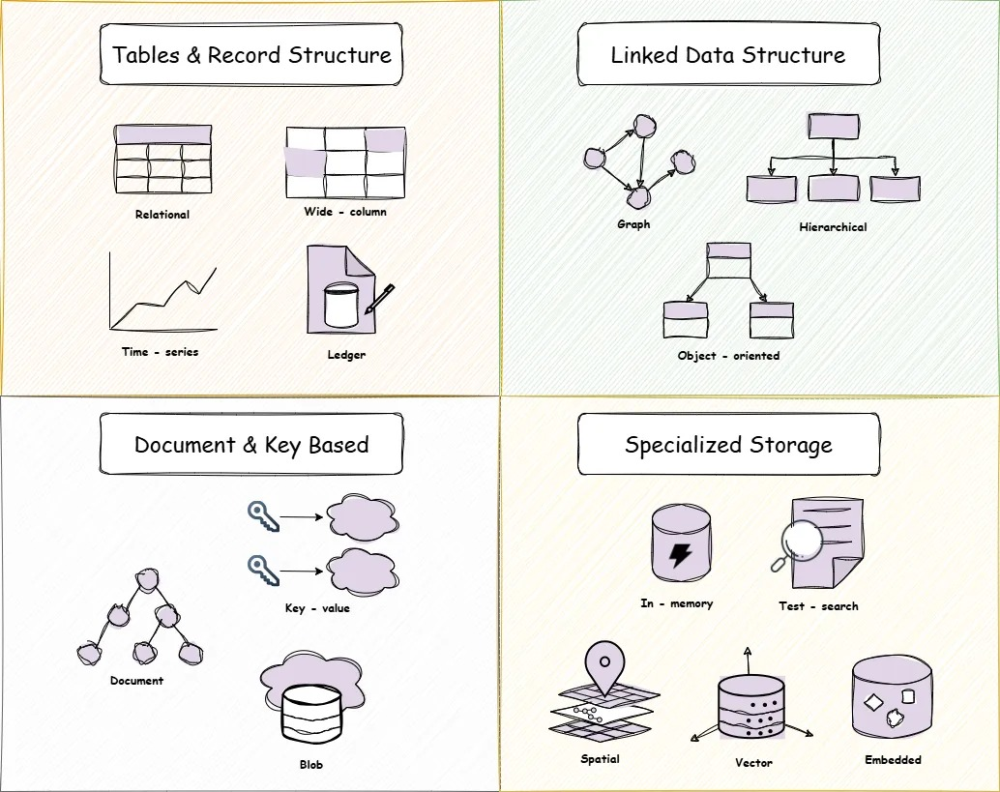

# 15 Loại Cơ Sở Dữ Liệu và Ứng Dụng Thực Tế: Hướng Dẫn Toàn Diện

Trong thế giới phát triển phần mềm hiện đại, việc lựa chọn đúng loại cơ sở dữ liệu (CSDL) là một quyết định nền tảng, ảnh hưởng trực tiếp đến hiệu suất, khả năng mở rộng, và tính năng của ứng dụng. Không có một CSDL nào là hoàn hảo cho mọi trường hợp. Tài liệu này giới thiệu 15 loại CSDL phổ biến, đặc điểm chính và các ứng dụng thực tế điển hình của chúng.

---

## 1. Cơ Sở Dữ Liệu Quan Hệ (Relational Database)

*   **Đặc điểm:** Dữ liệu được tổ chức thành các bảng (tables) gồm các hàng (rows) và cột (columns). Mỗi cột có một kiểu dữ liệu được định nghĩa trước (schema-on-write). Mối quan hệ giữa các bảng được thiết lập thông qua khóa ngoại (foreign keys). Thường tuân thủ các thuộc tính ACID (Atomicity, Consistency, Isolation, Durability) đảm bảo tính toàn vẹn giao dịch.
*   **Ví dụ:** PostgreSQL, MySQL, Oracle, SQL Server, MariaDB, SQLite (cho các ứng dụng nhỏ hơn).
*   **Ứng dụng:** Các hệ thống yêu cầu tính nhất quán dữ liệu cao như: Thương mại điện tử (quản lý đơn hàng, sản phẩm, khách hàng), hệ thống tài chính ngân hàng, quản lý kho, hệ thống kế toán, quản lý nhân sự (HRM), y tế (hồ sơ bệnh án).

## 2. Cơ Sở Dữ Liệu Cột Rộng (Wide Column Database)

*   **Đặc điểm:** Là một loại CSDL NoSQL. Dữ liệu được lưu trữ theo mô hình bảng nhưng linh hoạt hơn CSDL quan hệ. Dữ liệu được tổ chức theo "families" của cột. Tên và định dạng của các cột có thể thay đổi giữa các hàng khác nhau trong cùng một bảng. Tối ưu cho việc đọc/ghi lượng lớn dữ liệu trên các cột cụ thể. Khả năng mở rộng ngang (horizontal scaling) tốt.
*   **Ví dụ:** Apache Cassandra, ScyllaDB, Google Cloud Bigtable, Azure Cosmos DB (với API Cassandra), HBase.
*   **Ứng dụng:** Xử lý dữ liệu lớn (Big Data) và phân tích thời gian thực, hệ thống có tần suất ghi dữ liệu rất cao (ví dụ: logs, metrics, IoT data), lưu trữ lịch sử hoạt động người dùng, các ứng dụng cần độ sẵn sàng cao và khả năng chịu lỗi tốt.

## 3. Cơ Sở Dữ Liệu Chuỗi Thời Gian (Time-Series Database)

*   **Đặc điểm:** Tối ưu hóa đặc biệt cho việc lưu trữ, truy vấn và phân tích dữ liệu được gắn nhãn thời gian (time-stamped data). Hiệu quả cao trong việc xử lý các phép đo, sự kiện hoặc metrics được thu thập theo thời gian. Thường có các chức năng tích hợp sẵn cho việc tổng hợp (aggregation), lấy mẫu (sampling) và quản lý vòng đời dữ liệu theo thời gian.
*   **Ví dụ:** InfluxDB, TimescaleDB (mở rộng của PostgreSQL), Prometheus, Kdb+, OpenTSDB.
*   **Ứng dụng:** Giám sát hệ thống và ứng dụng (APM - Application Performance Monitoring), giám sát cơ sở hạ tầng (servers, networks), dữ liệu cảm biến từ IoT, nền tảng giao dịch tài chính (lưu trữ giá cổ phiếu, tỷ giá), phân tích dữ liệu log theo thời gian.

## 4. Cơ Sở Dữ Liệu Sổ Cái (Ledger Database)

*   **Đặc điểm:** Cung cấp một bản ghi lịch sử các thay đổi dữ liệu **không thể thay đổi (immutable)** và **có thể xác minh bằng mật mã (cryptographically verifiable)**. Mọi thay đổi được ghi lại tuần tự và không thể xóa hay sửa đổi một cách âm thầm. Đảm bảo tính toàn vẹn và minh bạch của lịch sử dữ liệu.
*   **Ví dụ:** Amazon Quantum Ledger Database (QLDB), Hyperledger Fabric (ở một mức độ nào đó).
*   **Ứng dụng:** Các hệ thống yêu cầu kiểm toán chặt chẽ và lịch sử giao dịch minh bạch như: hệ thống tài chính (ghi nhật ký giao dịch), quản lý chuỗi cung ứng (theo dõi nguồn gốc sản phẩm), hệ thống đăng ký và cấp phép, hệ thống bỏ phiếu điện tử, quản lý hồ sơ lý lịch tư pháp.

## 5. Cơ Sở Dữ Liệu Đồ Thị (Graph Database)

*   **Đặc điểm:** Lưu trữ dữ liệu dưới dạng các **nút (nodes)** đại diện cho thực thể và các **cạnh (edges)** đại diện cho mối quan hệ giữa các thực thể. Các nút và cạnh đều có thể có các **thuộc tính (properties)**. Tối ưu cho việc truy vấn và phân tích các mối quan hệ phức tạp và liên kết dữ liệu.
*   **Ví dụ:** Neo4j, ArangoDB (multi-model), Amazon Neptune, JanusGraph, TigerGraph.
*   **Ứng dụng:** Mạng xã hội (quan hệ bạn bè, theo dõi), hệ thống đề xuất sản phẩm/nội dung (recommendation engines), phát hiện gian lận (fraud detection), đồ thị tri thức (knowledge graphs), quản lý mạng lưới (network topology), phân tích chuỗi cung ứng.

## 6. Cơ Sở Dữ Liệu Hướng Đối Tượng (Object-Oriented Database)

*   **Đặc điểm:** Lưu trữ dữ liệu dưới dạng các đối tượng, tương tự như cách các đối tượng được định nghĩa trong các ngôn ngữ lập trình hướng đối tượng (OOP) như Java, C++. Cho phép lưu trữ trực tiếp các đối tượng phức tạp và mối quan hệ kế thừa mà không cần chuyển đổi sang mô hình bảng.
*   **Ví dụ:** ObjectDB, Db4o (đã ngừng phát triển nhưng vẫn còn được sử dụng), ObjectBox.
*   **Ứng dụng:** Các ứng dụng được viết chủ yếu bằng ngôn ngữ OOP và cần lưu trữ cấu trúc đối tượng phức tạp, CSDL đa phương tiện, hệ thống CAD/CAM, các ứng dụng khoa học và kỹ thuật cần mô hình hóa đối tượng phức tạp.

## 7. Cơ Sở Dữ Liệu Phân Cấp (Hierarchical Database)

*   **Đặc điểm:** Tổ chức dữ liệu theo cấu trúc dạng cây (tree-like structure). Mỗi bản ghi (record) có một bản ghi cha (parent) duy nhất và có thể có nhiều bản ghi con (children). Truy cập dữ liệu thường đi từ gốc xuống các nhánh. Mô hình này ít linh hoạt hơn so với CSDL quan hệ.
*   **Ví dụ:** IBM Information Management System (IMS), Windows Registry.
*   **Ứng dụng:** Chủ yếu là các hệ thống cũ (legacy systems), hệ thống tệp tin (file systems), cấu trúc tổ chức, hóa đơn nguyên vật liệu (Bill of Materials - BOM). Ngày nay ít được sử dụng cho các ứng dụng mới.

## 8. Cơ Sở Dữ Liệu Tài Liệu (Document Database)

*   **Đặc điểm:** Là một loại CSDL NoSQL. Lưu trữ và truy vấn dữ liệu dưới dạng các tài liệu (documents), thường là các định dạng bán cấu trúc như JSON hoặc BSON. Mỗi tài liệu có thể có cấu trúc riêng, linh hoạt (schema-on-read). Dễ dàng lưu trữ dữ liệu phức tạp, lồng nhau trong một tài liệu duy nhất.
*   **Ví dụ:** MongoDB, Couchbase, ArangoDB (multi-model), CouchDB, Azure Cosmos DB (với API SQL/MongoDB).
*   **Ứng dụng:** Hệ thống quản lý nội dung (CMS), hồ sơ người dùng (user profiles), danh mục sản phẩm trong thương mại điện tử, lưu trữ logs, ứng dụng di động, các ứng dụng cần lược đồ linh hoạt và phát triển nhanh.

## 9. Cơ Sở Dữ Liệu Khóa-Giá Trị (Key-Value Database)

*   **Đặc điểm:** Là dạng CSDL NoSQL đơn giản nhất. Lưu trữ dữ liệu dưới dạng các cặp khóa (key) và giá trị (value). Khóa là duy nhất và được sử dụng để truy xuất giá trị tương ứng một cách nhanh chóng. Giá trị có thể là bất cứ thứ gì (chuỗi, số, JSON, blob...). Rất dễ mở rộng và có hiệu năng truy cập cao.
*   **Ví dụ:** Redis, Memcached, Couchbase, Amazon DynamoDB, Riak KV.
*   **Ứng dụng:** Bộ nhớ đệm (caching) ở tầng ứng dụng, lưu trữ phiên làm việc (session store), quản lý hồ sơ người dùng đơn giản, hàng đợi thông điệp (message queuing - Redis), bảng xếp hạng thời gian thực.

## 10. Cơ Sở Dữ Liệu Blob (Blob Storage / Object Storage)

*   **Đặc điểm:** Được thiết kế để lưu trữ một lượng lớn dữ liệu phi cấu trúc (unstructured data) dưới dạng các đối tượng nhị phân lớn (Binary Large Objects - Blobs) hoặc đơn giản là các tệp tin. Mỗi đối tượng có một định danh duy nhất (thường là một URL) để truy cập. Không cung cấp khả năng truy vấn nội dung bên trong blob.
*   **Ví dụ:** Amazon S3 (Simple Storage Service), Google Cloud Storage, Azure Blob Storage, MinIO (self-hosted).
*   **Ứng dụng:** Lưu trữ hình ảnh, video, tệp âm thanh, tệp tin sao lưu (backups), tài liệu, dữ liệu lớn cho phân tích (data lakes), phân phối nội dung tĩnh qua Mạng phân phối nội dung (CDN).

## 11. Cơ Sở Dữ Liệu Bộ Nhớ Trong (In-Memory Database - IMDB)

*   **Đặc điểm:** Lưu trữ toàn bộ hoặc phần lớn dữ liệu trong bộ nhớ chính (RAM) thay vì trên đĩa cứng (SSD/HDD). Điều này giúp giảm đáng kể độ trễ truy cập dữ liệu, mang lại hiệu năng cực cao cho cả đọc và ghi. Thường có cơ chế lưu trữ bền vững (persistence) xuống đĩa để tránh mất dữ liệu khi khởi động lại.
*   **Ví dụ:** Redis, Memcached, Apache Ignite, SAP HANA, VoltDB.
*   **Ứng dụng:** Bộ nhớ đệm hiệu năng cao, đấu giá thời gian thực (real-time bidding), phân tích dữ liệu thời gian thực, bảng xếp hạng trò chơi (gaming leaderboards), quản lý phiên (session management), xử lý giao dịch tốc độ cao.

## 12. Cơ Sở Dữ Liệu Tìm Kiếm Văn Bản (Text Search Database / Search Engine)

*   **Đặc điểm:** Chuyên dụng cho việc lập chỉ mục (indexing), tìm kiếm và phân tích khối lượng lớn dữ liệu văn bản một cách hiệu quả. Hỗ trợ các tính năng tìm kiếm phức tạp như tìm kiếm toàn văn (full-text search), xếp hạng kết quả theo độ liên quan (relevance scoring), gợi ý (suggestions), tự động hoàn thành (autocomplete), phân tích ngôn ngữ tự nhiên.
*   **Ví dụ:** Elasticsearch, Apache Solr, OpenSearch (fork của Elasticsearch), MeiliSearch, Typesense.
*   **Ứng dụng:** Tìm kiếm trên trang web, tìm kiếm sản phẩm trong thương mại điện tử, tìm kiếm log và phân tích, hệ thống giám sát, ứng dụng tìm kiếm tài liệu, phân tích dữ liệu phi cấu trúc.

## 13. Cơ Sở Dữ Liệu Không Gian (Spatial Database)

*   **Đặc điểm:** Mở rộng CSDL truyền thống (thường là quan hệ) để hỗ trợ lưu trữ, lập chỉ mục và truy vấn dữ liệu dựa trên vị trí địa lý hoặc hình học không gian. Quản lý các kiểu dữ liệu không gian phức tạp như điểm (points), đường (lines), đa giác (polygons) và thực hiện các phép toán không gian (spatial queries) như tìm kiếm lân cận, tính khoảng cách, kiểm tra giao nhau.
*   **Ví dụ:** PostGIS (mở rộng của PostgreSQL), Oracle Spatial, SQL Server Spatial Types, SpatiaLite (mở rộng của SQLite), ArangoDB (multi-model).
*   **Ứng dụng:** Hệ thống thông tin địa lý (GIS), dịch vụ bản đồ và định vị (LBS - Location-Based Services), logistics và quản lý đội xe, quy hoạch đô thị, phân tích dữ liệu địa lý.

## 14. Cơ Sở Dữ Liệu Vector (Vector Database)

*   **Đặc điểm:** Được thiết kế đặc biệt để lưu trữ, lập chỉ mục và tìm kiếm các **vector nhúng (embedding vectors)** - là các biểu diễn toán học đa chiều của dữ liệu (như văn bản, hình ảnh, âm thanh). Tối ưu cho các truy vấn tìm kiếm tương đồng (similarity search) hoặc tìm kiếm hàng xóm gần nhất (Approximate Nearest Neighbor - ANN).
*   **Ví dụ:** Pinecone, Weaviate, Milvus, Chroma, Qdrant, Elasticsearch (với khả năng tìm kiếm vector).
*   **Ứng dụng:** Tìm kiếm dựa trên hình ảnh/video/âm thanh, hệ thống đề xuất nâng cao, phát hiện bất thường, tìm kiếm ngữ nghĩa (semantic search) trong văn bản, các ứng dụng Trí tuệ nhân tạo (AI) và Học máy (ML) liên quan đến embeddings.

## 15. Cơ Sở Dữ Liệu Nhúng (Embedded Database)

*   **Đặc điểm:** Là một thư viện CSDL được tích hợp trực tiếp vào bên trong ứng dụng phần mềm, chạy trong cùng tiến trình với ứng dụng. Không yêu cầu một tiến trình máy chủ riêng biệt. Dữ liệu thường được lưu trữ trong các tệp cục bộ trên thiết bị của người dùng hoặc máy chủ ứng dụng.
*   **Ví dụ:** SQLite, RocksDB, Berkeley DB, DuckDB (nhúng, hướng phân tích), Realm (cho di động).
*   **Ứng dụng:** Ứng dụng di động (lưu trữ dữ liệu cục bộ), ứng dụng máy tính để bàn (desktop applications), trình duyệt web (IndexedDB), thiết bị IoT, bộ nhớ đệm cục bộ, thử nghiệm đơn vị (unit testing) nhanh cho các ứng dụng cần CSDL.

---

## Kết luận

Việc lựa chọn cơ sở dữ liệu phù hợp đòi hỏi sự hiểu biết về các loại dữ liệu bạn đang xử lý, các mẫu truy cập (access patterns), yêu cầu về hiệu suất, khả năng mở rộng, và tính nhất quán. Trong nhiều hệ thống phức tạp, việc kết hợp nhiều loại CSDL khác nhau (Polyglot Persistence) để tận dụng thế mạnh của từng loại cho các phần khác nhau của ứng dụng là một chiến lược phổ biến và hiệu quả.

---

*Nguồn tham khảo: [15 Databases, 15 Use Cases — The Ultimate Guide No One Asked For (But Everyone Needs)](https://designsystemsweekly.substack.com/p/15-databases-15-use-cases-the-ultimate)*

