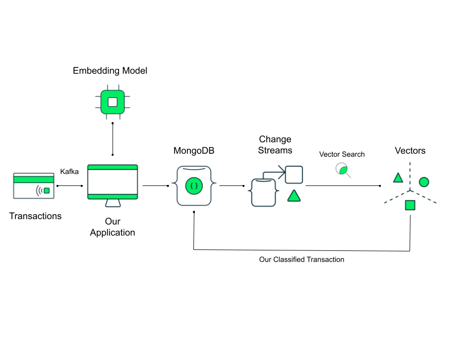
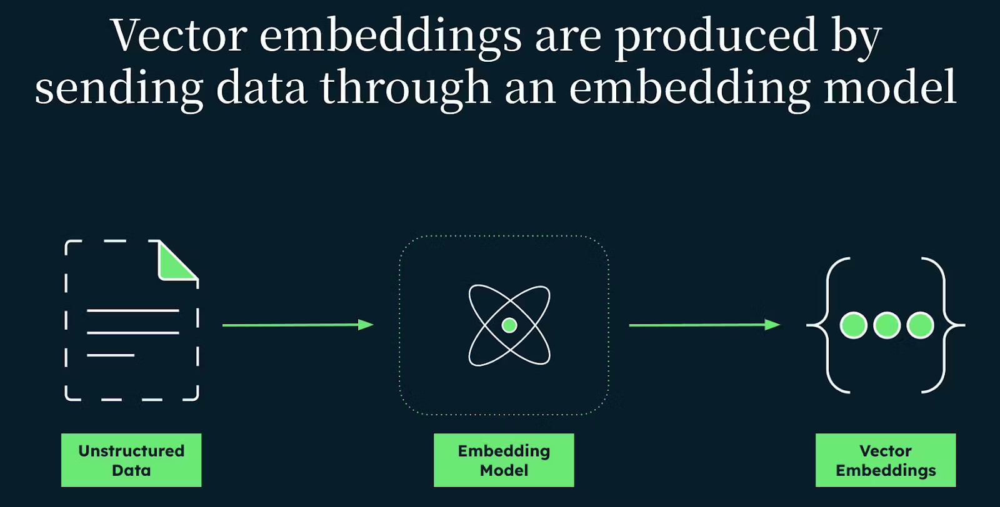

# 1 Xây dựng Hệ thống Phát hiện Gian lận AI Thời gian thực với Spring Kafka và MongoDB
Sponsor by https://foojay.io/today/building-a-real-time-ai-fraud-detection-system-with-spring-kafka-and-mongodb/?ref=dailydev

Đây là mã nguồn ví dụ đi kèm với bài viết "Xây dựng Hệ thống Phát hiện Gian lận AI Thời gian thực với Spring Kafka và MongoDB" ban đầu được xuất bản vào ngày 14 tháng 5 năm 2025.

Trong hướng dẫn này, chúng ta sẽ xây dựng một hệ thống phát hiện gian lận thời gian thực sử dụng MongoDB Atlas Vector Search, Apache Kafka và các embedding được tạo bởi AI. Chúng ta sẽ chứng minh cách sử dụng MongoDB Atlas Vector Search để phát hiện các điểm bất thường trong luồng giao dịch tài chính bằng cách phân tích lịch sử giao dịch của người dùng và xác định hành vi đáng ngờ dựa trên các embedding được tạo bởi LLM.

Giải pháp của chúng ta sẽ giám sát MongoDB Change Streams bằng trình điều khiển Java đồng bộ, kích hoạt các tìm kiếm vector trên mỗi giao dịch mới để phát hiện gian lận tiềm ẩn. Mặc dù cách tiếp cận này hoạt động tốt cho bản demo của chúng ta và cho nhiều trường hợp sử dụng, chúng ta cũng sẽ thảo luận về những hạn chế của nó. Xuyên suốt hướng dẫn, tôi sẽ đề cập đến các chiến lược thay thế để tối ưu hóa hiệu suất, cho dù bạn cần thông lượng giao dịch cao hơn, phát hiện gian lận nhanh hơn hay kiến trúc có khả năng mở rộng tốt hơn.

Mã nguồn hoàn chỉnh cho hướng dẫn này có thể được tìm thấy trên [GitHub repository](https://github.com/your-repo-link-here - Thay thế bằng link thực tế nếu có).

## Mục lục

*   [Chúng ta đang xây dựng gì](#chúng-ta-đang-xây-dựng-gì)
*   [Điều kiện tiên quyết](#điều-kiện-tiên-quyết)
*   [Tạo cơ sở dữ liệu MongoDB của chúng ta](#tạo-cơ-sở-dữ-liệu-mongodb-của-chúng-ta)
*   [Tạo chỉ mục Tìm kiếm Vector](#tạo-chỉ-mục-tìm-kiếm-vector)
*   [Tạo ứng dụng Spring](#tạo-ứng-dụng-spring)
*   [Thiết lập cấu hình](#thiết-lập-cấu-hình)
    *   [Cấu hình MongoDB](#cấu-hình-mongodb)
    *   [Cấu hình Spring AI](#cấu-hình-spring-ai)
    *   [Cấu hình Kafka](#cấu-hình-kafka)
*   [Tạo hồ sơ khách hàng giả định của chúng ta](#tạo-hồ-sơ-khách-hàng-giả-định-của-chúng-ta)
*   [Mô hình khách hàng](#mô-hình-khách-hàng)
*   [Đổ dữ liệu khách hàng](#đổ-dữ-liệu-khách-hàng)
*   [Mô hình giao dịch](#mô-hình-giao-dịch)
*   [Làm thế nào để tạo các Embedding AI của chúng ta?](#làm-thế-nào-để-tạo-các-embedding-ai-của-chúng-ta)
*   [Cách tương tác đơn giản với cơ sở dữ liệu bằng Spring Data MongoDB](#cách-tương-tác-đơn-giản-với-cơ-sở-dữ-liệu-bằng-spring-data-mongodb)
*   [Đổ dữ liệu giao dịch cho khách hàng của chúng ta](#đổ-dữ-liệu-giao-dịch-cho-khách-hàng-của-chúng-ta)
*   [Cách chúng ta sẽ gửi giao dịch bằng Kafka Producer](#cách-chúng-ta-sẽ-gửi-giao-dịch-bằng-kafka-producer)
*   [Đưa giao dịch vào hệ thống](#đưa-giao-dịch-vào-hệ-thống)
*   [Giám sát cơ sở dữ liệu của chúng ta bằng Change Streams](#giám-sát-cơ-sở-dữ-liệu-của-chúng-ta-bằng-change-streams)
*   [Phát hiện gian lận bằng tìm kiếm vector](#phát-hiện-gian-lận-bằng-tìm-kiếm-vector)
*   [Những hạn chế của ứng dụng của chúng ta](#những-hạn-chế-của-ứng-dụng-của-chúng-ta)
    *   [Trigger Atlas để giám sát các giao dịch đến](#trigger-atlas-để-giám-sát-các-giao-dịch-đến)
    *   [Các giải pháp khả thi khác](#các-giải-pháp-khả-thi-khác)
*   [Chạy ứng dụng của chúng ta](#chạy-ứng-dụng-của-chúng-ta)
    *   [Khởi động Apache Kafka](#khởi-động-apache-kafka)
    *   [Chạy ứng dụng Spring của chúng ta](#chạy-ứng-dụng-spring-của-chúng-ta)

---

## Chúng ta đang xây dựng gì

Luồng phát hiện gian lận thời gian thực của chúng ta sẽ hoạt động như sau:

1.  **Tạo hồ sơ khách hàng:** Tạo người dùng tổng hợp với thói quen chi tiêu có thể dự đoán và lưu trữ chúng trong MongoDB.
2.  **Sản xuất giao dịch:** Một Kafka Producer tạo giao dịch, tính toán embedding AI và gửi chúng đến Kafka.
3.  **Tiêu thụ giao dịch:** Một Kafka Consumer đọc giao dịch từ Kafka và ghi chúng vào MongoDB.
4.  **Giám sát thời gian thực:** Ứng dụng lắng nghe MongoDB Change Streams để phát hiện các giao dịch mới khi chúng đến.
5.  **Chạy tìm kiếm vector:** Mỗi giao dịch mới được so sánh với các giao dịch lịch sử của người dùng bằng cách sử dụng tìm kiếm vector.
6.  **Phát hiện gian lận:** Một giao dịch được đánh dấu là gian lận nếu:
    *   Không có giao dịch tương tự nào tồn tại cho người dùng đó.
    *   Bất kỳ giao dịch tương tự nào được trả về đã bị đánh dấu là gian lận.



Luồng này đảm bảo phát hiện điểm bất thường theo thời gian thực bằng cách sử dụng các embedding được hỗ trợ bởi AI và tìm kiếm vector.

## Điều kiện tiên quyết

Để theo dõi hướng dẫn này, bạn sẽ cần:

*   Tài khoản MongoDB Atlas với cụm M0 (hoặc cao hơn) miễn phí trọn đời đã được thiết lập.
*   Kafka 3.5+ (cài đặt cục bộ hoặc Docker).
*   Java 21 đã được thiết lập trên máy của bạn.
*   Khóa API OpenAI (để tạo embedding).
*   Maven 3.9+.

## Tạo cơ sở dữ liệu MongoDB của chúng ta

Đăng nhập vào MongoDB Atlas và tạo một cụm M0 miễn phí trọn đời. Tạo một cơ sở dữ liệu mới có tên là `fraud`. Trong cơ sở dữ liệu này, chúng ta cần tạo hai collection.

*   `customers`
*   `transactions`

Đối với bản demo đơn giản này, chúng ta chỉ tạo các collection cơ bản vì, tại thời điểm viết bài này, các collection time series không hỗ trợ chỉ mục tìm kiếm. Nếu bạn muốn tìm hiểu thêm về cách thiết lập các collection này cho ứng dụng Java của mình, hãy xem hướng dẫn của chúng tôi [Handle Time Series Data with MongoDB](https://www.mongodb.com/developer/languages/java/mongodb-time-series-data-java/).

## Tạo chỉ mục Tìm kiếm Vector

Chúng ta sẽ tạo chỉ mục tìm kiếm vector trên collection `transactions` của mình. Điều này sẽ cho phép chúng ta tìm các document có ngữ nghĩa tương tự, để giúp chúng ta xác định các điểm bất thường trong giao dịch của khách hàng và đánh dấu chúng là gian lận.

Điều này hoạt động như thế nào? Chúng ta tạo các vector embedding (biểu diễn số của dữ liệu của chúng ta) của các giao dịch, để lưu trữ trong kho vector của chúng ta, collection `transactions`. Chúng ta nhận được những embedding này bằng cách gửi thông tin từ các giao dịch của chúng ta đến một mô hình embedding, như `text-embedding-3-small` của OpenAI. Các embedding này trông giống như một mảng các số dấu phẩy động, ví dụ: `[2.0457, -3.1417895, ...]`.


Sau đó, chúng ta sử dụng Atlas Vector Search của MongoDB, sử dụng thuật toán láng giềng gần nhất để quyết định giao dịch nào là tương tự về mặt ngữ nghĩa. Những giao dịch này được trả về, và nếu giao dịch mới không khớp với bất kỳ giao dịch nào trước đây cho người dùng đó, hoặc nếu nó khớp với các giao dịch được đánh dấu là gian lận, đó có thể là một điểm bất thường (gian lận tiềm ẩn).

Bạn có thể tìm hiểu các bước chi tiết để thiết lập chỉ mục Tìm kiếm Vector trong [Atlas Vector Search Quick Start](https://www.mongodb.com/docs/atlas/atlas-vector-search/get-started/), nhưng tóm lại:

1.  Điều hướng đến MongoDB Atlas -> Collections -> Nhấp vào `transactions`.
2.  Chọn -> Atlas Search -> Create Search Index + Vector Search.
3.  Sử dụng JSON sau:

    ```json
    {
      "fields": [
        {
          "type": "vector",
          "path": "embedding",
          "numDimensions": 1536,
          "similarity": "dotProduct"
        }
      ]
    }
    ```
4.  Nhấp vào create index.

Chúng ta sử dụng 1536 cho số chiều vì mô hình embedding mà chúng ta sẽ sử dụng. OpenAI cung cấp `text-embedding-3-small` để tạo embedding (trong số các mô hình khác). Đây là một mô hình đa năng để tạo embedding văn bản, nhưng sử dụng một mô hình chuyên biệt để phát hiện gian lận tài chính, đặc biệt là một mô hình tùy chỉnh được thiết kế và đào tạo trên dữ liệu của bạn, sẽ mang lại kết quả tốt hơn. Cho dù bạn tìm kiếm embedding nhanh hơn hay dự đoán chính xác hơn, bạn có thể kiểm soát điều đó ở đây.

Vì các embedding của OpenAI được tối ưu hóa để sử dụng thuật toán tích vô hướng (dot product), đó là phương pháp tương đồng chúng ta sẽ sử dụng. Điều đáng chú ý là nếu các giao dịch gian lận có xu hướng có tín hiệu mạnh hơn (ví dụ: người bán, danh mục, số tiền rất khác biệt), tích vô hướng giúp nắm bắt được độ lớn đó, cùng với hướng. Về cơ bản, nó tự nhiên nhấn mạnh những tín hiệu mạnh hơn này. Ngược lại, độ tương đồng cosine chuẩn hóa tất cả các vector về độ dài đơn vị, loại bỏ hiệu quả thông tin độ lớn hữu ích này. Điều này có nghĩa là nó sẽ coi một điểm bất thường nhỏ và một điểm bất thường lớn là "khác biệt" như nhau về hướng, điều này có thể làm loãng sức mạnh tín hiệu mà chúng ta quan tâm khi xác định gian lận.

## Tạo ứng dụng Spring

Chúng ta sẽ tạo ứng dụng của mình bằng Spring Initializr. Tại đây, chúng ta cần đặt dự án của mình là Maven, ngôn ngữ là Java và phiên bản Spring Boot là 3.4.2 (bản phát hành ổn định gần đây nhất tại thời điểm viết). Chúng ta cũng sẽ đặt tên ứng dụng của mình - của tôi là `frauddetector` - và đối với packaging, chúng ta sẽ tạo một file `jar`, và phiên bản Java là 21.

Chúng ta cũng sẽ cần một vài package.

*   Spring Web
*   Spring for Apache Kafka
*   Spring Data MongoDB
*   OpenAI

Tải xuống và giải nén ứng dụng Spring của bạn. Mở ứng dụng trong IDE bạn chọn. Mở file `pom.xml` và thêm dependency Jackson cần thiết.

```xml
<dependency>
    <groupId>com.fasterxml.jackson.core</groupId>
    <artifactId>jackson-databind</artifactId>
</dependency>
```

## Thiết lập cấu hình

Bây giờ, mở ứng dụng và truy cập `application.properties`. Tại đây, chúng ta sẽ thêm các chuỗi kết nối, token và cài đặt cấu hình khác nhau cho các dependency của chúng ta.

### Cấu hình MongoDB

Spring Boot sẽ tự động cấu hình MongoDB, vì vậy chúng ta không phải tạo `MongoClient` thủ công.

```properties
spring.application.name=frauddetector
spring.data.mongodb.uri=<YOUR_CONNECTION_STRING>
spring.data.mongodb.database=fraud
```

Chỉ cần thêm chuỗi kết nối và tên cơ sở dữ liệu và chúng ta đã sẵn sàng.

### Cấu hình Spring AI

Chúng ta sử dụng Spring AI với API của OpenAI để tạo text embedding cho việc phát hiện sự tương đồng giao dịch. Chúng ta sẽ sử dụng các embedding này cho tìm kiếm vector, cho phép chúng ta so sánh các giao dịch dựa trên ý nghĩa ngữ nghĩa và các mẫu (tổng thể) của chúng, thay vì dữ liệu thô.

```properties
spring.ai.openai.api-key=<YOUR_OPEN_AI_API_KEY>
spring.ai.openai.embedding.options.model=text-embedding-3-small
```

`text-embedding-3-small` là một mô hình embedding nhẹ được tối ưu hóa cho việc tạo vector độ trễ thấp. Ngoài ra, bạn có thể sử dụng "text-embedding-3-large" để có độ chính xác cao hơn nhưng chi phí và độ trễ tăng lên.

Chúng ta cũng sẽ tạo một package `Config` và thêm một lớp `MongoDBConfig`.

```java
package com.mongodb.frauddetector.config;

import com.mongodb.client.MongoClient;
import com.mongodb.client.MongoCollection;
import com.mongodb.client.MongoDatabase;
import org.bson.Document;
import org.springframework.context.annotation.Bean;
import org.springframework.context.annotation.Configuration;

@Configuration
public class MongoDBConfig {
    private static final String DATABASE_NAME = "fraud";
    private static final String TRANSACTIONS_COLLECTION = "transactions";

    @Bean
    public MongoDatabase fraudDatabase(MongoClient mongoClient) {
        return mongoClient.getDatabase(DATABASE_NAME);
    }

    @Bean
    public MongoCollection<Document> transactionsCollection(MongoDatabase fraudDatabase) {
        return fraudDatabase.getCollection(TRANSACTIONS_COLLECTION);
    }
}
```

Tại đây, chúng ta sẽ thêm một số phương thức để kết nối với cơ sở dữ liệu MongoDB của chúng ta mà chúng ta có thể sử dụng lại trong ứng dụng của mình.

### Cấu hình Kafka

Kafka là một hệ thống nhắn tin phân tán cho phép các producer gửi tin nhắn và các consumer xử lý chúng một cách bất đồng bộ. Trong hệ thống phát hiện gian lận của chúng ta, chúng ta sử dụng Kafka để xử lý việc đưa giao dịch vào hệ thống theo thời gian thực.

Spring Boot cung cấp hỗ trợ Kafka tích hợp sẵn thông qua `spring-kafka`, cho phép chúng ta cấu hình Kafka producer và consumer bằng cách sử dụng các thuộc tính ứng dụng.

```properties
spring.kafka.bootstrap-servers=localhost:9092
spring.kafka.producer.key-serializer=org.apache.kafka.common.serialization.StringSerializer
spring.kafka.producer.value-serializer=org.springframework.kafka.support.serializer.JsonSerializer
spring.kafka.consumer.bootstrap-servers=localhost:9092
spring.kafka.consumer.group-id=fraud-group
spring.kafka.consumer.auto-offset-reset=earliest
spring.kafka.consumer.key-deserializer=org.apache.kafka.common.serialization.StringDeserializer
spring.kafka.consumer.value-deserializer=org.springframework.kafka.support.serializer.JsonDeserializer
spring.kafka.consumer.properties.spring.json.trusted.packages=com.mongodb.frauddetector.model
```

Nếu bạn chưa quen với Apache Kafka, điều này có thể giống như một bức tường chữ tượng hình, vì vậy hãy phân tích từng thuộc tính:

**Kết nối đến Kafka**

*   `spring.kafka.bootstrap-servers=localhost:9092`
    *   Chỉ định địa chỉ broker Kafka (mặc định là localhost:9092 nếu chạy cục bộ).
    *   Producer và consumer sẽ sử dụng điều này để gửi và nhận tin nhắn.

**Cấu hình Kafka Producer**

*   `spring.kafka.producer.key-serializer=org.apache.kafka.common.serialization.StringSerializer`
    *   Chuyển đổi khóa tin nhắn (được sử dụng để phân vùng) thành một chuỗi.
    *   Chúng ta không thiết lập khóa rõ ràng, vì vậy Kafka sẽ tự động tạo chúng.
*   `spring.kafka.producer.value-serializer=org.springframework.kafka.support.serializer.JsonSerializer`
    *   Tuần tự hóa các đối tượng Java (giao dịch) thành JSON trước khi gửi chúng đến Kafka.
    *   Cần thiết vì chúng ta gửi các đối tượng phức tạp như `Transaction`.

**Cấu hình Kafka Consumer**

*   `spring.kafka.consumer.bootstrap-servers=localhost:9092`
    *   Chỉ định broker Kafka mà consumer nên lắng nghe.
*   `spring.kafka.consumer.group-id=fraud-group`
    *   Định nghĩa một nhóm consumer (`fraud-group`).
    *   Nhiều consumer trong nhóm này có thể chia sẻ khối lượng công việc và cân bằng việc tiêu thụ tin nhắn.
    *   Nếu một consumer gặp lỗi, một instance khác trong nhóm sẽ tiếp tục từ nơi nó dừng lại.
*   `spring.kafka.consumer.auto-offset-reset=earliest`
    *   Xác định nơi bắt đầu tiêu thụ tin nhắn nếu không tồn tại offset.
    *   Các tùy chọn:
        *   `earliest`: Bắt đầu từ đầu topic (hữu ích cho việc gỡ lỗi).
        *   `latest`: Chỉ đọc tin nhắn mới (hành vi mặc định).

**Giải tuần tự hóa Kafka Consumer**

*   `spring.kafka.consumer.key-deserializer=org.apache.kafka.common.serialization.StringDeserializer`
    *   Giải tuần tự hóa khóa tin nhắn thành chuỗi.
*   `spring.kafka.consumer.value-deserializer=org.springframework.kafka.support.serializer.JsonDeserializer`
    *   Giải tuần tự hóa tin nhắn Kafka từ JSON thành các đối tượng Java.
    *   Điều này cần thiết vì giao dịch của chúng ta được gửi dưới dạng JSON.
*   `spring.kafka.consumer.properties.spring.json.trusted-packages=com.mongodb.frauddetector.model`
    *   Đảm bảo chỉ các package đáng tin cậy mới được giải tuần tự hóa.
    *   Ngăn chặn các lỗ hổng bảo mật từ việc giải tuần tự hóa không đáng tin cậy.

**Cách tất cả hoạt động cùng nhau:**

1.  Kafka Producer gửi các sự kiện giao dịch dưới dạng JSON đến topic "transactions".
2.  Kafka Broker định tuyến các sự kiện này.
3.  Kafka Consumer đọc các tin nhắn này, giải tuần tự hóa chúng thành các đối tượng `Transaction` và lưu trữ chúng trong MongoDB.
4.  MongoDB Change Streams phát hiện các giao dịch mới và kích hoạt phát hiện gian lận.

## Tạo hồ sơ khách hàng giả định của chúng ta

Để đơn giản hóa, chúng ta sẽ bắt đầu bằng cách thêm một vài enum. Chúng ta sẽ sử dụng chúng khi tạo giao dịch và định nghĩa hành vi "bình thường" cho khách hàng mẫu của chúng ta. Tạo một package `enums` trong ứng dụng Spring để lưu trữ chúng.

Đầu tiên, chúng ta sẽ tạo một enum `Category`.

```java
package com.mongodb.frauddetector.enums;

public enum Category {
    RETAIL, TECH, GROCERY;
}
```

Tiếp theo, một enum `Currency`.

```java
package com.mongodb.frauddetector.enums;

public enum Currency {
    EUR, USD, GBP;
}
```

Và cuối cùng, một enum `Merchant` hơi thú vị hơn.

```java
package com.mongodb.frauddetector.enums;

import java.util.List;
import java.util.Map;
import java.util.Random;

public enum Merchant {
    // Retail Merchants
    AMAZON, WALMART, BEST_BUY, TARGET, COSTCO, ETSY, EBAY, IKEA,

    // Tech Merchants
    APPLE, MICROSOFT, GOOGLE,

    // Grocery Merchants
    DUNNES_STORES, LIDL, TESCO;

    private static final Random RANDOM = new Random();

    private static final Map<Category, List<Merchant>> CATEGORY_MERCHANTS = Map.of(
            Category.RETAIL, List.of(AMAZON, WALMART, BEST_BUY, TARGET, COSTCO, ETSY, EBAY, IKEA),
            Category.TECH, List.of(APPLE, MICROSOFT, GOOGLE),
            Category.GROCERY, List.of(DUNNES_STORES, LIDL, TESCO)
    );

    public static Merchant getRandomMerchant(Category category) {
        List<Merchant> merchants = CATEGORY_MERCHANTS.get(category);
        return merchants.get(RANDOM.nextInt(merchants.size()));
    }
}
```

Tại đây, chúng ta có một chút logic để ánh xạ các người bán hàng của chúng ta đến các danh mục khác nhau, và một hàm để lấy một người bán hàng ngẫu nhiên, để giúp tạo giao dịch sau này (cho mục đích thử nghiệm và demo).

## Mô hình khách hàng

Mô hình khách hàng của chúng ta sẽ phác thảo một số thông tin về khách hàng mẫu của chúng ta sẽ giúp chúng ta định nghĩa thói quen chi tiêu của họ. Vì chúng ta đang xây dựng một hệ thống phát hiện gian lận, chúng ta cần một cách để nhận biết khi người dùng thực hiện một giao dịch mua không phù hợp với hành vi thông thường của họ. Tạo một package `model` và thêm một lớp `Customer`.

```java
package com.mongodb.frauddetector.model;

import com.mongodb.frauddetector.enums.Category;
import com.mongodb.frauddetector.enums.Currency;
import com.mongodb.frauddetector.enums.Merchant;
import org.springframework.data.annotation.Id;
import org.springframework.data.mongodb.core.mapping.Document;

import java.util.List;
import java.util.Random;
import java.util.stream.Collectors; // Import Collectors for toList

@Document(collection = "customers")
public class Customer {
    @Id
    private String id;
    private final String userId;
    private final List<Merchant> merchants; // Trusted merchants
    private final List<Category> categories; // Trusted categories
    private final Double meanSpending;
    private final Double spendingStdDev;
    private final Currency preferredCurrency;

    // Constructor required by Spring Data MongoDB for deserialization
    public Customer() {
        this.userId = null; // Or provide a default value if needed
        this.merchants = null;
        this.categories = null;
        this.meanSpending = null;
        this.spendingStdDev = null;
        this.preferredCurrency = null;
    }


    public Customer(String userId, List<Merchant> merchants, List<Category> categories,
                    Double meanSpending, Double spendingStdDev, Currency preferredCurrency) {
        this.userId = userId;
        this.merchants = merchants;
        this.categories = categories;
        this.meanSpending = meanSpending;
        this.spendingStdDev = spendingStdDev;
        this.preferredCurrency = preferredCurrency;
    }

    public String getId() { return id; }
    public String getUserId() { return userId; }
    public List<Merchant> getMerchants() { return merchants; }
    public List<Category> getCategories() { return categories; }
    public Double getMeanSpending() { return meanSpending; }
    public Double getSpendingStdDev() { return spendingStdDev; }
    public Currency getPreferredCurrency() { return preferredCurrency; }

    // Setter methods for Spring Data MongoDB
    public void setId(String id) { this.id = id; }

    // Helper methods for data generation

    public Category getFrequentCategory() {
        if (categories == null || categories.isEmpty()) {
            // Handle case where categories list is null or empty - perhaps return a default or throw exception
             return Category.RETAIL; // Example: return a default category
        }
        Random random = new Random();
        return categories.get(random.nextInt(categories.size()));
    }

   public Category getUnfrequentCategory() {
        // Get all categories from the enum
        List<Category> allCategories = List.of(Category.values());
        // Filter out frequent categories
        List<Category> infrequentCategories = allCategories.stream()
                .filter(category -> categories == null || !categories.contains(category)) // Handle null categories
                .collect(Collectors.toList()); // Use collect(Collectors.toList()) for mutability if needed, or toList() for Java 16+

        if (infrequentCategories.isEmpty()) {
             // Handle case where there are no infrequent categories (e.g., customer frequents all)
             return getFrequentCategory(); // Example: return a frequent one, or handle differently
        }

        // Pick a random category from the remaining ones
        Random random = new Random();
        return infrequentCategories.get(random.nextInt(infrequentCategories.size()));
    }

   public Currency getRandomSuspiciousCurrency() {
        // Get all currencies from the enum
        List<Currency> allCurrency = List.of(Currency.values());
        // Filter out preferred currency
        List<Currency> infrequentCurrency = allCurrency.stream()
                .filter(currency -> !(preferredCurrency == currency))
                 .collect(Collectors.toList()); // Use collect(Collectors.toList())

        if (infrequentCurrency.isEmpty()) {
             // Handle case where there are no infrequent currencies (e.g., only one currency in enum)
             return preferredCurrency; // Example: return the preferred one
        }

        // Pick a random currency from the remaining ones
        Random random = new Random();
        return infrequentCurrency.get(random.nextInt(infrequentCurrency.size()));
    }
}
```
*Note: Added default constructor, setters for Spring Data, null checks and handling for empty lists in helper methods for robustness.*

Mỗi khách hàng trong hệ thống của chúng ta có:

*   Một ID người dùng duy nhất: Điều này cho phép chúng ta liên kết các giao dịch với một người cụ thể.
*   Người bán hàng đáng tin cậy (`merchants`): Những nơi họ thường xuyên mua sắm.
*   Danh mục đáng tin cậy (`categories`): Các loại giao dịch mua mà họ thường xuyên thực hiện.
*   Thói quen chi tiêu trung bình (`meanSpending`, `spendingStdDev`): Số tiền giao dịch điển hình và độ lệch chuẩn của họ.
*   Tiền tệ ưu tiên (`preferredCurrency`): Loại tiền tệ họ thường giao dịch.

Điều này cho phép chúng ta thiết lập một đường cơ sở cho hành vi chi tiêu của họ. Nếu một giao dịch mới lệch quá nhiều, chúng ta có thể đánh dấu nó là gian lận tiềm ẩn. Chúng ta cần thêm một vài hàm trợ giúp để giúp chúng ta tạo dữ liệu. Chúng ta sẽ tạo phương thức `getFrequentCategory()` để ngẫu nhiên chọn một trong các danh mục ưu tiên của người dùng. Mở lớp `Customer` và thêm phương thức sau (đã có ở trên trong đoạn code cuối cùng).

Chúng ta cũng sẽ thêm phương thức `getUnfrequentCategory()` để chọn một danh mục mà họ thường không chi tiền - điều này có thể là một dấu hiệu đỏ. (Đã có ở trên).

Thay đổi tiền tệ có thể là một chỉ báo mạnh khác về gian lận. Nếu một người dùng luôn giao dịch bằng USD, nhưng đột nhiên thực hiện một giao dịch mua bằng EUR, điều đó có thể báo hiệu hoạt động gian lận. (Đã có ở trên, `getRandomSuspiciousCurrency`).

Phương thức này giúp mô phỏng một kịch bản gian lận thực tế, nơi ai đó có thể đánh cắp thẻ và sử dụng nó ở nước ngoài.

## Đổ dữ liệu khách hàng

Trước khi có thể tạo giao dịch, chúng ta cần một số khách hàng trong cơ sở dữ liệu. Đây không chỉ là những người dùng ngẫu nhiên - chúng ta đang cho họ những thói quen chi tiêu cụ thể, người bán hàng ưu tiên và các mẫu giao dịch phổ biến. Điều này sẽ giúp chúng ta tạo dữ liệu thực tế cho việc phát hiện gian lận. Tạo một package `service` và thêm một lớp `CustomerSeeder`. Sao chép đoạn mã sau vào đó, sau đó chúng ta sẽ phân tích điều gì đang xảy ra.

```java
package com.mongodb.frauddetector.service;

import com.mongodb.frauddetector.enums.Category;
import com.mongodb.frauddetector.enums.Currency;
import com.mongodb.frauddetector.enums.Merchant;
import com.mongodb.frauddetector.model.Customer;
import jakarta.annotation.PostConstruct;
import org.slf4j.Logger;
import org.slf4j.LoggerFactory;
import org.springframework.data.mongodb.core.MongoTemplate;
import org.springframework.stereotype.Service;
import java.util.List;

@Service
public class CustomerSeeder {
    private static final Logger logger = LoggerFactory.getLogger(CustomerSeeder.class);
    private final MongoTemplate mongoTemplate;

    public CustomerSeeder(MongoTemplate mongoTemplate) {
        this.mongoTemplate = mongoTemplate;
    }

    @PostConstruct
    public void seedCustomers() {
        if (mongoTemplate.getCollection("customers").countDocuments() > 0) {
            logger.info("Customers already exist. Skipping seed.");
            return;
        }

        List<Customer> customers = List.of(
                new Customer("user_1", List.of(Merchant.AMAZON, Merchant.BEST_BUY), List.of(Category.TECH, Category.RETAIL), 150.0, 30.0, Currency.USD),
                new Customer("user_2", List.of(Merchant.WALMART, Merchant.TARGET, Merchant.DUNNES_STORES), List.of(Category.RETAIL, Category.GROCERY), 80.0, 20.0, Currency.USD),
                new Customer("user_3", List.of(Merchant.APPLE, Merchant.MICROSOFT), List.of(Category.TECH), 250.0, 50.0, Currency.EUR),
                new Customer("user_4", List.of(Merchant.ETSY, Merchant.BEST_BUY), List.of(Category.RETAIL), 100.0, 25.0, Currency.EUR),
                new Customer("user_5", List.of(Merchant.ETSY, Merchant.EBAY), List.of(Category.RETAIL), 90.0, 20.0, Currency.GBP),
                new Customer("user_6", List.of(Merchant.TESCO, Merchant.DUNNES_STORES), List.of(Category.GROCERY), 40.0, 10.0, Currency.EUR),
                new Customer("user_7", List.of(Merchant.LIDL, Merchant.COSTCO), List.of(Category.GROCERY), 35.0, 8.0, Currency.EUR),
                new Customer("user_8",  List.of(Merchant.GOOGLE, Merchant.MICROSOFT), List.of(Category.TECH), 15.0, 5.0, Currency.USD),
                new Customer("user_9", List.of(Merchant.EBAY, Merchant.ETSY), List.of(Category.RETAIL), 60.0, 15.0, Currency.GBP),
                new Customer("user_10", List.of(Merchant.COSTCO, Merchant.IKEA), List.of(Category.RETAIL), 25.0, 7.0, Currency.GBP)
        );

        mongoTemplate.insertAll(customers);
        logger.info("Customers seeded successfully!");
    }
}
```

Bây giờ, hãy đi qua phần triển khai.

Bạn có thể thắc mắc tại sao chúng ta không sử dụng `MongoRepository` cho việc này. Mặc dù `MongoRepository` rất tốt cho các hoạt động CRUD đơn giản, nhưng nó không cung cấp toàn quyền kiểm soát cách chúng ta đổ dữ liệu vào cơ sở dữ liệu.

Sử dụng `MongoTemplate`, chúng ta có thể trực tiếp kiểm tra xem dữ liệu có tồn tại hay không trước khi chèn (để chúng ta không tạo bản sao).

Chúng ta sử dụng chú thích `@PostConstruct` của Spring để chạy phương thức `seedCustomers()` tự động khi ứng dụng khởi động. Điều này đảm bảo cơ sở dữ liệu của chúng ta được điền dữ liệu trước khi giao dịch bắt đầu chảy.

```java
@PostConstruct
public void seedCustomers() {
    // Logic kiểm tra và chèn
}
```

Nếu dữ liệu khách hàng đã tồn tại trong collection MongoDB, chúng ta bỏ qua việc đổ dữ liệu.
Nếu không, chúng ta tạo 10 khách hàng, mỗi người với:
*   Một ID người dùng.
*   Danh sách người bán hàng đáng tin cậy.
*   Danh sách danh mục thường xuyên.
*   Số tiền chi tiêu trung bình và độ lệch chuẩn.
*   Tiền tệ ưu tiên.

Sau khi dữ liệu được tạo, chúng ta sử dụng:

```java
mongoTemplate.insertAll(customers);
```

Nhờ sự kỳ diệu của Spring và chú thích `@PostContruct` của chúng ta, `mongoTemplate` sẽ chèn hàng loạt mọi thứ vào cơ sở dữ liệu MongoDB của chúng ta chỉ bằng cách chạy ứng dụng.

**Cách các khách hàng mẫu được cấu trúc**

Mỗi khách hàng được thiết kế để hành xử một cách có thể dự đoán được. Vì mục đích của bản demo này, rất có thể dự đoán:

*   Người mua sắm công nghệ: Chi tiêu nhiều hơn trên Amazon, Best Buy và Apple.
*   Người mua sắm tạp hóa: Thường xuyên đến Tesco, Dunnes Stores hoặc Lidl.
*   Người mua sắm bán lẻ chung: Mua sắm tại Etsy, eBay hoặc Walmart.
*   Số tiền chi tiêu khác nhau nhưng theo một mẫu chung.

Với việc đổ dữ liệu khách hàng này:

*   Chúng ta có một tập dữ liệu có cấu trúc để kiểm tra phát hiện gian lận.
*   Khách hàng hành xử theo những cách có thể dự đoán được, giúp việc phát hiện điểm bất thường dễ dàng hơn.

Khi khách hàng đã có trong MongoDB, chúng ta có thể chuyển sang tạo giao dịch.

## Mô hình giao dịch

Mô hình `Transaction` đại diện cho các giao dịch tài chính riêng lẻ trong hệ thống của chúng ta. Các giao dịch này được tạo dựa trên hồ sơ khách hàng giả định của chúng ta và được lưu trữ trong MongoDB. Mô hình này đóng vai trò quan trọng trong việc phát hiện các điểm bất thường bằng cách cho phép chúng ta so sánh từng giao dịch mới với hành vi lịch sử của người dùng.

Tạo một lớp `Transaction` bên trong package `model`:

```java
package com.mongodb.frauddetector.model;

import com.fasterxml.jackson.annotation.JsonIgnoreProperties;
import com.fasterxml.jackson.annotation.JsonProperty;
import com.mongodb.frauddetector.enums.Category;
import com.mongodb.frauddetector.enums.Currency;
import com.mongodb.frauddetector.enums.Merchant;
// import org.bson.BsonDocument; // Not needed
// import org.bson.codecs.configuration.CodecRegistry; // Not needed
// import org.bson.conversions.Bson; // Not needed
import org.springframework.data.annotation.Id;
import org.springframework.data.mongodb.core.mapping.Document;
import java.time.Instant;
import java.util.Random;
import java.util.UUID;
import static com.mongodb.frauddetector.enums.Merchant.getRandomMerchant;
import java.util.Arrays; // Import Arrays

@JsonIgnoreProperties(ignoreUnknown = true)
@Document(collection = "transactions")
public class Transaction {
    @Id
    private String id;
    @JsonProperty("transaction_id")
    private String transactionId;
    private String userId;
    private double amount;
    private Currency currency;
    private Instant timestamp;
    private Merchant merchant;
    private Category category;
    private boolean isFraud;
    private float[] embedding; // Initialize later or in constructor

    // Default constructor for Spring Data MongoDB deserialization
    public Transaction() {
        this.embedding = new float[]{}; // Initialize empty array
    }

    // Constructor for creating new transactions
    public Transaction(String id, String transactionId, String userId, double amount, Currency currency,
                       Instant timestamp, Merchant merchant, Category category, boolean isFraud) {
        this.id = id; // Id can be null for new documents
        this.transactionId = transactionId;
        this.userId = userId;
        this.amount = amount;
        this.currency = currency;
        this.timestamp = timestamp;
        this.merchant = merchant;
        this.category = category;
        this.isFraud = isFraud;
        this.embedding = new float[]{}; // Initialize empty array
    }

    // Getters
    public String getId() { return id; }
    public String getTransactionId() { return transactionId; }
    public String getUserId() { return userId; }
    public double getAmount() { return amount; }
    public Currency getCurrency() { return currency; }
    public Instant getTimestamp() { return timestamp; }
    public Merchant getMerchant() { return merchant; }
    public Category getCategory() { return category; }
    public boolean isFraud() { return isFraud; }
    public float[] getEmbedding() { return embedding; }

    // Setters (needed by Spring Data MongoDB and for setting embedding)
    public void setId(String id) { this.id = id; }
    public void setTransactionId(String transactionId) { this.transactionId = transactionId; }
    public void setUserId(String userId) { this.userId = userId; }
    public void setAmount(double amount) { this.amount = amount; }
    public void setCurrency(Currency currency) { this.currency = currency; }
    public void setTimestamp(Instant timestamp) { this.timestamp = timestamp; }
    public void setMerchant(Merchant merchant) { this.merchant = merchant; }
    public void setCategory(Category category) { this.category = category; }
    public void setFraud(boolean fraud) { isFraud = fraud; }
    public void setEmbedding(float[] embedding) { this.embedding = embedding; }

    // Helper method to generate text for embedding
    public String generateEmbeddingText() {
        // Ensure all components are not null before building the string
        return (userId != null ? userId : "unknown_user") + " "
               + amount + " "
               + (currency != null ? currency.name() : "unknown_currency") + " " // Use currency.name()
               + (merchant != null ? merchant.name() : "unknown_merchant") + " " // Use merchant.name()
               + (category != null ? category.name() : "unknown_category"); // Use category.name()
    }

     // Helper method to generate a random transaction for a given customer
    public static Transaction generateRandom(Customer customer) {
        Random random = new Random();
        // Generate a normal or suspicious transaction
        boolean isSuspicious = random.nextDouble() < 0.1; // 10% chance of fraud

        double amount;
        // Ensure customer.getMeanSpending() is not null before multiplying
        if (customer.getMeanSpending() != null) {
             amount = isSuspicious ? customer.getMeanSpending() * (2 + random.nextDouble()) // Unusually large
                                   : customer.getMeanSpending() * (0.5 + random.nextDouble());
        } else {
             amount = isSuspicious ? 500.0 * (2 + random.nextDouble()) : 100.0 * (0.5 + random.nextDouble()); // Default if meanSpending is null
        }


        Category category = isSuspicious ? customer.getUnfrequentCategory() : customer.getFrequentCategory();
        Merchant merchant = getRandomMerchant(category);
        Currency currency = isSuspicious ? customer.getRandomSuspiciousCurrency()
                                          : customer.getPreferredCurrency();

        // Ensure mandatory fields are not null
        String userId = customer.getUserId() != null ? customer.getUserId() : "default_user";
        Instant timestamp = Instant.now();


        return new Transaction(
                null, // id will be generated by MongoDB
                UUID.randomUUID().toString(), // transactionId
                userId,
                amount,
                currency,
                timestamp,
                merchant,
                category,
                false // isFraud defaults to false
        );
    }

    // Optional: Override toString for logging/debugging
    @Override
    public String toString() {
        return "Transaction{" +
               "id='" + id + '\'' +
               ", transactionId='" + transactionId + '\'' +
               ", userId='" + userId + '\'' +
               ", amount=" + amount +
               ", currency=" + currency +
               ", timestamp=" + timestamp +
               ", merchant=" + merchant +
               ", category=" + category +
               ", isFraud=" + isFraud +
               ", embedding=" + Arrays.toString(embedding) +
               '}';
    }
}
```
*Note: Added null checks and default values in `generateEmbeddingText` and `generateRandom`, added `Arrays.toString` in `toString` for better embedding display, removed unused imports.*

Mỗi giao dịch có:

*   Một ID giao dịch duy nhất (`transactionId`): Được sử dụng để theo dõi và tham chiếu các giao dịch riêng lẻ.
*   Một ID người dùng (`userId`): Liên kết giao dịch với một khách hàng cụ thể.
*   Số tiền (`amount`): Tổng chi phí của giao dịch.
*   Tiền tệ (`currency`): Loại tiền tệ mà giao dịch được thực hiện.
*   Thời gian (`timestamp`): Thời điểm chính xác giao dịch diễn ra.
*   Người bán hàng (`merchant`): Nhà cung cấp nơi giao dịch xảy ra.
*   Danh mục (`category`): Loại giao dịch mua được thực hiện.
*   Cờ gian lận (`isFraud`): Một giá trị boolean cho biết giao dịch có được đánh dấu là gian lận hay không.
*   Embedding (`embedding`): Một biểu diễn số của giao dịch được tạo qua embedding AI, mà chúng ta sẽ sử dụng cho tìm kiếm vector.

Ở đầu lớp, chúng ta chỉ định collection mà chúng ta muốn lưu trữ các giao dịch tài chính của mình, `@Document(collection = "transactions")`. Spring Data MongoDB xử lý việc tuần tự hóa BSON cho chúng ta.

Để phát hiện giao dịch gian lận, chúng ta sẽ sử dụng tìm kiếm vector để so sánh các giao dịch dựa trên ngữ cảnh tổng thể của chúng thay vì khớp chính xác. Phương thức `generateEmbeddingText()` tạo một biểu diễn chuỗi của giao dịch, mà sau này chúng ta sẽ chuyển đổi thành embedding.

```java
public String generateEmbeddingText() {
    // ... implementation ...
}
```

**Tạo giao dịch ngẫu nhiên**

Chúng ta cần mô phỏng dữ liệu giao dịch thực tế cho khách hàng của chúng ta. Phương thức `generateRandom()` tạo các giao dịch tổng hợp của chúng ta, hoặc phù hợp với hoặc lệch khỏi các mẫu chi tiêu thông thường của người dùng.

```java
public static Transaction generateRandom(Customer customer) {
   // ... implementation ...
}
```

Phương thức này ngẫu nhiên quyết định liệu giao dịch có đáng ngờ hay không (10% cơ hội). Hãy thoải mái điều chỉnh tỷ lệ này để phù hợp với trường hợp sử dụng bạn muốn kiểm tra. Sau đó, nó thiết lập số tiền trong một phạm vi bình thường hoặc một giá trị cao bất thường. Tiếp theo, chúng ta chọn một danh mục và người bán hàng dựa trên hành vi chi tiêu điển hình của người dùng (hoặc chọn một danh mục mà họ thường không mua sắm nếu giao dịch đáng ngờ). Cuối cùng, chúng ta chọn một loại tiền tệ, có khả năng chọn một loại tiền tệ bất thường cho các giao dịch đáng ngờ.

Mô hình `Transaction` này là xương sống của luồng phát hiện gian lận của chúng ta. Sau khi được tạo, các giao dịch sẽ được gửi đến Kafka, xử lý và lưu trữ trong MongoDB, nơi chúng ta sẽ sử dụng MongoDB Change Streams và Vector Search để đánh dấu gian lận tiềm ẩn.

## Làm thế nào để tạo các Embedding AI của chúng ta?

Đối với ví dụ này, chúng ta sẽ sử dụng mô hình embedding API của OpenAI chỉ vì nó đơn giản. Nó là mô hình đa năng nên sẽ hoạt động, và Spring AI giúp thiết lập rất dễ dàng. Bây giờ, tôi thực sự khuyên bạn nên xem xét một mô hình embedding chuyên biệt để phát hiện gian lận cho ứng dụng của bạn. Nếu bạn muốn tìm hiểu cách làm điều này, hãy xem hướng dẫn của tôi về cách đào tạo mô hình phát hiện gian lận của riêng bạn trong Java.

Với khóa API và mô hình embedding đã được cấu hình trong `application.properties` từ trước, chúng ta cần tạo một package `config` và thêm một lớp `OpenAIConfig` mới.

Tại đây, chúng ta chỉ cần tạo một lớp cấu hình nhận khóa API và thiết lập mô hình embedding OpenAI bằng cách sử dụng Spring AI.

```java
package com.mongodb.frauddetector.config;

import org.springframework.ai.embedding.EmbeddingModel;
import org.springframework.ai.openai.OpenAiEmbeddingModel;
import org.springframework.ai.openai.api.OpenAiApi;
import org.springframework.beans.factory.annotation.Value;
import org.springframework.context.annotation.Bean;
import org.springframework.context.annotation.Configuration;

@Configuration
public class OpenAIConfig {

    @Value("${spring.ai.openai.api-key}")
    private String apiKey;

    @Bean
    public EmbeddingModel embeddingModel() {
        return new OpenAiEmbeddingModel(new OpenAiApi(apiKey));
    }
}
```

Bây giờ, mô hình embedding của chúng ta đã sẵn sàng được gọi để tạo các vector để lưu trữ cùng với các giao dịch của chúng ta trong MongoDB.

Với mô hình embedding đã được thiết lập, trong package `Service` của chúng ta, chúng ta có thể thêm lớp mới, `EmbeddingGenerator`.

```java
package com.mongodb.frauddetector.service;

import org.springframework.ai.embedding.EmbeddingModel;
import org.springframework.stereotype.Component;

@Component
public class EmbeddingGenerator {
    private final EmbeddingModel embeddingModel;

    public EmbeddingGenerator(EmbeddingModel embeddingModel) {
        this.embeddingModel = embeddingModel;
    }

    public float[] getEmbedding(String textToEmbed) { // Changed parameter name for clarity
        // Note: embed method returns List<Float>, convert to float[]
        java.util.List<Float> embeddingList = this.embeddingModel.embed(textToEmbed);
        float[] embeddingArray = new float[embeddingList.size()];
        for (int i = 0; i < embeddingList.size(); i++) {
            embeddingArray[i] = embeddingList.get(i);
        }
        return embeddingArray;
    }
}
```
*Note: Corrected the return type handling for `embeddingModel.embed` which returns `List<Float>` and converted it to `float[]`.*

Điều này sẽ lấy thông tin chúng ta muốn đưa vào embedding cho mỗi giao dịch và tạo embedding này bằng cách sử dụng mô hình embedding của chúng ta.

Chú thích `@Component` cho phép Spring tự động phát hiện các bean tùy chỉnh của chúng ta. Về cơ bản, nó cho phép chúng ta tạo một instance của lớp và inject bất kỳ dependency được chỉ định nào vào đó, và inject chúng ở bất cứ đâu cần thiết.

## Cách tương tác đơn giản với cơ sở dữ liệu bằng Spring Data MongoDB

Đối với các hoạt động CRUD đơn giản của chúng ta cho khách hàng và giao dịch, chủ yếu là tìm kiếm và chèn, chúng ta có thể sử dụng `MongoRepository` để thực hiện điều này một cách đơn giản và gọn gàng. Tạo một package `repository`.

Đầu tiên, chúng ta sẽ tạo một interface `CustomerRepository`.

```java
package com.mongodb.frauddetector.repository;

import com.mongodb.frauddetector.model.Customer;
import org.springframework.data.mongodb.repository.MongoRepository;

public interface CustomerRepository extends MongoRepository<Customer, String> {
}
```

Tiếp theo, chúng ta sẽ tạo một interface `TransactionRepository`.

```java
package com.mongodb.frauddetector.repository;

import com.mongodb.frauddetector.model.Transaction;
import org.springframework.data.mongodb.repository.MongoRepository;

public interface TransactionRepository extends MongoRepository<Transaction, String> {
}
```

Chúng ta không cần làm gì khác. `MongoRepository` cung cấp cho chúng ta tất cả các hoạt động CRUD cần thiết. Chúng ta không cần tạo bất kỳ triển khai truy vấn tùy chỉnh nào. Nếu bạn muốn tìm hiểu thêm về những gì `MongoRepository` cung cấp và sự khác biệt giữa `MongoRepository` và `MongoTemplate`, hãy xem bài viết của chúng tôi về [getting started with Spring Data MongoDB](https://www.mongodb.com/developer/languages/java/spring-data-mongodb-tutorial/).

## Đổ dữ liệu giao dịch cho khách hàng của chúng ta

Bây giờ chúng ta đã có khách hàng trong cơ sở dữ liệu, chúng ta cần tạo một số giao dịch cho họ. Những giao dịch này sẽ đóng vai trò là dữ liệu cơ sở của chúng ta, cho phép chúng ta so sánh các giao dịch trong tương lai với các mẫu chi tiêu lịch sử.

Tạo một lớp `TransactionSeeder` bên trong package `service` và sao chép đoạn mã sau.

```java
package com.mongodb.frauddetector.service;

import com.mongodb.client.MongoCollection;
import com.mongodb.frauddetector.model.Customer;
import com.mongodb.frauddetector.model.Transaction;
import com.mongodb.frauddetector.repository.CustomerRepository;
import com.mongodb.frauddetector.repository.TransactionRepository;
import jakarta.annotation.PostConstruct;
import org.bson.Document;
import org.slf4j.Logger;
import org.slf4j.LoggerFactory;
import org.springframework.stereotype.Service;
import java.util.ArrayList;
import java.util.List;

@Service
public class TransactionSeeder {
    private static final Logger logger = LoggerFactory.getLogger(TransactionSeeder.class);

    private final CustomerRepository customerRepository;
    private final EmbeddingGenerator embeddingGenerator;
    private final TransactionRepository transactionRepository;
    private final TransactionChangeStreamListener transactionChangeStreamListener;
    private final MongoCollection<Document> transactionsCollection;

    public TransactionSeeder(CustomerRepository customerRepository,
                             EmbeddingGenerator embeddingGenerator,
                             TransactionRepository transactionRepository,
                             TransactionChangeStreamListener transactionChangeStreamListener,
                             MongoCollection<Document> transactionsCollection) {
        this.transactionsCollection = transactionsCollection;
        this.transactionRepository = transactionRepository;
        this.customerRepository = customerRepository;
        this.embeddingGenerator = embeddingGenerator;
        this.transactionChangeStreamListener = transactionChangeStreamListener;
    }

    // Need to inject TransactionVectorSearchService as well if needed for Change Stream
    // Update the constructor to include TransactionVectorSearchService if startListening() in listener requires it
    // In this example, TransactionChangeStreamListener already injects TransactionVectorSearchService, so it's ok.


    @PostConstruct
    public void seedTransactions() {
        if (transactionsCollection.countDocuments() > 0) {
            logger.info("Transactions already seeded.");
            // Start listener even if already seeded, in case it wasn't started properly before
            if (!transactionChangeStreamListener.isListening()) { // Assuming you add isListening() method
                 transactionChangeStreamListener.startListening();
                 logger.info("Change Stream Listener Started after checking existing data.");
            }
            return;
        }

        logger.info("Seeding initial transactions...");
        List<Customer> customers = customerRepository.findAll();
        List<Transaction> transactions = new ArrayList<>();

        if (customers.isEmpty()) {
            logger.error("No customers found. Cannot seed transactions.");
            return;
        }

        for (Customer customer : customers) {
            // Generate more than 10 for better history
            int numTransactionsToSeed = 50; // Let's seed 50 transactions per customer
            for (int i = 0; i < numTransactionsToSeed; i++) {
                Transaction transaction = Transaction.generateRandom(customer);
                String embeddingText = transaction.generateEmbeddingText();
                try {
                   float[] embedding = embeddingGenerator.getEmbedding(embeddingText);
                   transaction.setEmbedding(embedding);
                   transactions.add(transaction);
                } catch (Exception e) {
                   logger.error("Error generating embedding for transaction {}: {}", transaction.getTransactionId(), e.getMessage());
                   // Decide how to handle error - skip transaction, or add without embedding?
                   // For demo, let's skip if embedding fails
                }

            }
        }

        if (!transactions.isEmpty()) {
            transactionRepository.saveAll(transactions);
            logger.info("Seeded {} transactions.", transactions.size());
        } else {
             logger.warn("No transactions were generated or saved.");
        }


        // Start listening *after* seeding is complete
        transactionChangeStreamListener.startListening();
        logger.info("Change Stream Listener Started after seeding.");
    }
}
```
*Note: Added a check for empty customer list, increased seeded transactions per customer for a better history (50 instead of 10), added error handling for embedding generation, improved logging, and added a check to start the listener even if already seeded.*

Service này chịu trách nhiệm tạo giao dịch mẫu cho mỗi khách hàng, tạo embedding, sau đó lưu trữ chúng trong MongoDB.

Nó cũng chịu trách nhiệm bắt đầu trình lắng nghe Change Stream để phát hiện giao dịch thời gian thực sau khi cơ sở dữ liệu đã được đổ dữ liệu. Chúng ta đảm bảo thực hiện điều này sau khi cơ sở dữ liệu đã được đổ dữ liệu. Chúng ta lại truy cập trực tiếp vào trình điều khiển Java của MongoDB để cho phép chúng ta xác minh xem collection đã được đổ dữ liệu hay chưa.

Tiếp theo, chúng ta cần một phương thức post construct, `seedTransactions()`. (Đã có ở trên).

Sau khi service được khởi tạo, phương thức `@PostConstruct` chạy, đảm bảo rằng các giao dịch của chúng ta được tạo trước khi hệ thống bắt đầu xử lý các giao dịch mới. Chúng ta kiểm tra xem collection giao dịch đã chứa dữ liệu chưa. Nếu có, chúng ta bỏ qua quá trình đổ dữ liệu. Ngược lại, chúng ta tạo 50 giao dịch cho mỗi khách hàng.

Chúng ta lấy tất cả khách hàng từ cơ sở dữ liệu. Mỗi khách hàng có một số lượng cố định các giao dịch lịch sử (50 trong ví dụ sửa đổi), và mỗi giao dịch được tạo ngẫu nhiên dựa trên thói quen chi tiêu điển hình của khách hàng.

Cuối cùng, chúng ta chèn hàng loạt các giao dịch của chúng ta, và chúng ta bắt đầu lắng nghe các giao dịch thời gian thực để các giao dịch mới có thể được đánh giá để phát hiện gian lận.

## Cách chúng ta sẽ gửi giao dịch bằng Kafka Producer

Bây giờ chúng ta đã đổ dữ liệu khách hàng và tạo các giao dịch ban đầu, chúng ta cần một cách để liên tục sản xuất giao dịch theo thời gian thực. Chúng ta sẽ sử dụng một Kafka Producer cho việc này. Producer sẽ tạo các giao dịch tổng hợp, tính toán embedding của chúng và gửi chúng đến Kafka để xử lý tiếp.

Kafka tuân theo mô hình publish-subscribe:

*   Producers gửi tin nhắn đến một topic Kafka (trong trường hợp này, "transactions").
*   Consumers đăng ký topic đó và xử lý các tin nhắn đến.
*   Các topic lưu trữ và phân phối tin nhắn cho các consumer, đảm bảo khả năng mở rộng.

Tạo một lớp `TransactionProducer` bên trong package `service` và sao chép đoạn mã sau.

```java
package com.mongodb.frauddetector.service;

import com.mongodb.frauddetector.model.Customer;
import com.mongodb.frauddetector.model.Transaction;
import com.mongodb.frauddetector.repository.CustomerRepository;
import jakarta.annotation.PostConstruct;
import org.slf4j.Logger;
import org.slf4j.LoggerFactory;
import org.springframework.kafka.core.KafkaTemplate;
import org.springframework.scheduling.annotation.Scheduled;
import org.springframework.stereotype.Service;
import java.util.List;
import java.util.Random;

@Service
public class TransactionProducer {
    private static final Logger logger = LoggerFactory.getLogger(TransactionProducer.class);

    private static final String TOPIC = "transactions";
    private final EmbeddingGenerator embeddingGenerator;
    private final KafkaTemplate<String, Transaction> kafkaTemplate;
    private List<Customer> customers; // Cached list of customers
    private final Random random = new Random();
    private final CustomerRepository customerRepository;

    public TransactionProducer(KafkaTemplate<String, Transaction> kafkaTemplate, EmbeddingGenerator embeddingGenerator, CustomerRepository customerRepository) {
        this.kafkaTemplate = kafkaTemplate;
        this.embeddingGenerator = embeddingGenerator;
        this.customerRepository = customerRepository;
    }

    // Need a method to fetch customer data to create transactions
    @PostConstruct
    public void loadCustomers() {
        customers = customerRepository.findAll();
        if (customers.isEmpty()) {
            logger.error("Warning: No customers found! Transactions may fail.");
        } else {
            logger.info("Cached {} customers for transaction generation.", customers.size());
        }
    }

    // Need a method to generate our synthetic transactions
    @Scheduled(fixedRate = 100) // Run every 100ms
    public void generateAndSendTransaction() {
        if (customers == null || customers.isEmpty()) {
            logger.error("No customers available. Skipping transaction generation.");
            return;
        }

        // Select a random customer
        Customer randomCustomer = customers.get(random.nextInt(customers.size()));

        // Generate a transaction for this customer
        Transaction transaction = Transaction.generateRandom(randomCustomer);

        // Generate embedding
        String embeddingText = transaction.generateEmbeddingText();
        try {
           float[] embedding = embeddingGenerator.getEmbedding(embeddingText);
           transaction.setEmbedding(embedding);
        } catch (Exception e) {
           logger.error("Error generating embedding for transaction {}: {}", transaction.getTransactionId(), e.getMessage());
           // Handle error: potentially log and skip, or send without embedding (which might affect fraud detection)
           // For demo, let's just log and continue (embedding might be an empty array)
        }

        // Send the transaction to Kafka
        kafkaTemplate.send(TOPIC, transaction.getTransactionId(), transaction);
        logger.debug("Transaction sent to topic {}: {}", TOPIC, transaction.getTransactionId()); // Use debug for frequent logging
    }
}
```
*Note: Improved logging level for frequent messages, added error handling for embedding generation.*

Mẫu Kafka của Spring được sử dụng để gửi tin nhắn đến một topic Kafka. Tiếp theo, chúng ta cần một phương thức để lấy dữ liệu khách hàng để tạo giao dịch. Tạo một phương thức `@PostConstruct`. (Đã có ở trên).

Chúng ta cache dữ liệu khách hàng trong bộ nhớ khi ứng dụng khởi động. Điều này tránh việc lặp lại các truy vấn cơ sở dữ liệu và tăng tốc độ tạo giao dịch. Bây giờ, chúng ta cần một phương thức để tạo các giao dịch tổng hợp của chúng ta. Chúng ta sẽ sử dụng chú thích `@Scheduled` để tạo một phương thức `generateAndSendTransaction()` chạy cứ sau 100ms. (Đã có ở trên).

Điều này ngẫu nhiên chọn một khách hàng, tạo một giao dịch và tạo embedding. Sau đó, nó gửi giao dịch đến Kafka.

Chúng ta cũng cần thêm `@EnableScheduling` vào lớp `FrauddetectorApplication` của chúng ta để cho phép chúng ta lập lịch các giao dịch này cho bản demo của mình.

```java
package com.mongodb.frauddetector;

import org.springframework.boot.SpringApplication;
import org.springframework.boot.autoconfigure.SpringBootApplication;
import org.springframework.scheduling.annotation.EnableScheduling;

@SpringBootApplication
@EnableScheduling
public class FrauddetectorApplication {

    public static void main(String[] args) {
       SpringApplication.run(FrauddetectorApplication.class, args);
    }
}
```

Bây giờ Kafka Producer của chúng ta đang tạo giao dịch và gửi chúng đến một topic Kafka, chúng ta cần một cách để tiêu thụ chúng và lưu trữ chúng trong MongoDB. Đây là nơi Kafka Consumer xuất hiện.

## Đưa giao dịch vào hệ thống

Bước này khá đơn giản khi sử dụng `spring-kafka`. Trong package `service`, thêm một lớp `TransactionConsumer`. Chúng ta sẽ thiết lập một trình lắng nghe Kafka đơn giản để tự động xử lý các tin nhắn giao dịch đến.

```java
package com.mongodb.frauddetector.service;

import com.mongodb.frauddetector.model.Transaction;
import com.mongodb.frauddetector.repository.TransactionRepository;
import org.slf4j.Logger;
import org.slf4j.LoggerFactory;
import org.springframework.kafka.annotation.KafkaListener;
import org.springframework.stereotype.Service;

@Service
public class TransactionConsumer {

    private static final Logger logger = LoggerFactory.getLogger(TransactionConsumer.class);

    private final TransactionRepository transactionRepository;

    public TransactionConsumer(TransactionRepository transactionRepository) {
        this.transactionRepository = transactionRepository;
    }

    @KafkaListener(topics = "transactions", groupId = "fraud-group", containerFactory = "kafkaListenerContainerFactory") // Specify containerFactory explicitly if needed
    public void consumeTransaction(Transaction transaction) {
        if (transaction == null) {
             logger.warn("Received null transaction message from Kafka.");
             return;
        }
        try {
            // Ensure embedding is present before saving if it's critical
            // If embedding generation failed in producer, it might be null or empty
            if (transaction.getEmbedding() == null || transaction.getEmbedding().length == 0) {
                 logger.warn("Transaction {} received without embedding. Skipping save or handling accordingly.", transaction.getTransactionId());
                 // Optionally process differently or skip saving transactions without embeddings
                 // For this demo, we rely on embedding for vector search, so skipping save might be appropriate
                 return;
            }

            transactionRepository.save(transaction);
            logger.debug("Transaction {} saved to MongoDB.", transaction.getTransactionId()); // Use debug for frequent logging
        } catch (Exception e) {
            logger.error("Error saving transaction {} to MongoDB: {}", transaction.getTransactionId(), e.getMessage(), e);
            // Handle exception - potentially dead-letter queue, retry, etc.
        }
    }
}
```
*Note: Added null check for the transaction and embedding before saving, improved error handling and logging.*

**Cách Kafka Consumers hoạt động**

Kafka tuân theo mô hình publish-subscribe:

*   Producers publish tin nhắn đến một topic (trong trường hợp này, "transactions").
*   Consumers đăng ký topic đó và xử lý các tin nhắn đến.
*   Consumers có thể được nhóm lại thành các nhóm consumer, trong đó mỗi instance đọc một phần của tin nhắn.

Đối với hệ thống của chúng ta:

1.  Kafka Producer của chúng ta tạo giao dịch và publish chúng đến Kafka.
2.  Kafka Consumer của chúng ta lắng nghe topic "transactions".
3.  Mỗi giao dịch được lưu trữ trong MongoDB thông qua `TransactionRepository`.

Với việc giao dịch của chúng ta đang được sản xuất và tiêu thụ, bây giờ chúng ta có thể xem xét cách chúng ta sẽ giám sát các giao dịch đến trên cơ sở dữ liệu MongoDB của chúng ta.

## Giám sát cơ sở dữ liệu của chúng ta bằng Change Streams

Khi giao dịch được lưu trữ trong MongoDB, chúng ta cần một cách để phát hiện các giao dịch mới theo thời gian thực và kích hoạt phát hiện gian lận ngay lập tức. Thay vì lặp đi lặp lại truy vấn cơ sở dữ liệu để tìm dữ liệu mới, chúng ta có thể sử dụng MongoDB Change Streams để lắng nghe các thay đổi một cách hiệu quả.

**Change Stream là gì?**

MongoDB Change Streams cung cấp một luồng dữ liệu thời gian thực cho phép các ứng dụng lắng nghe các thao tác chèn, cập nhật, xóa và thay thế đang diễn ra trong một collection hoặc cơ sở dữ liệu. Nó hoạt động tương tự như một trình lắng nghe sự kiện, kích hoạt một hành động bất cứ khi nào có thay đổi xảy ra.

Thay vì chạy các truy vấn để kiểm tra giao dịch mới, Change Streams đẩy các bản cập nhật đến ứng dụng của chúng ta ngay khi chúng xảy ra, giúp việc phát hiện gian lận hiệu quả hơn và giảm các lệnh gọi cơ sở dữ liệu không cần thiết.

**Tại sao sử dụng Change Streams?**

*   Giám sát thời gian thực: Phát hiện gian lận ngay sau khi giao dịch được chèn.
*   Cập nhật dựa trên push: Loại bỏ nhu cầu thăm dò (polling) hoặc truy vấn thủ công.
*   Hiệu suất tối ưu hóa: Hoạt động hiệu quả, ngay cả với dữ liệu giao dịch có tốc độ cao.
*   Khả năng mở rộng tích hợp sẵn: Hoạt động trên các cụm phân mảnh và tập hợp replica.

Để giám sát giao dịch, chúng ta tạo một service `TransactionChangeStreamListener` trong package `service`.

```java
package com.mongodb.frauddetector.service;

import com.mongodb.client.*;
import com.mongodb.client.model.Aggregates;
import com.mongodb.client.model.Filters;
import com.mongodb.client.model.changestream.ChangeStreamDocument;
import com.mongodb.client.model.changestream.OperationType; // Import OperationType
import org.bson.Document;
import org.bson.conversions.Bson;
import org.slf4j.Logger;
import org.slf4j.LoggerFactory;
import org.springframework.beans.factory.annotation.Autowired; // Use Autowired for constructor
import org.springframework.stereotype.Service;

import java.util.List;
import java.util.concurrent.Executors;
import java.util.concurrent.ExecutorService;
import java.util.concurrent.atomic.AtomicBoolean; // To track listening status

@Service
public class TransactionChangeStreamListener {
    private static final Logger logger = LoggerFactory.getLogger(TransactionChangeStreamListener.class);

    private final TransactionVectorSearchService vectorSearchService;
    private final ExecutorService executorService; // Use a pool for potential concurrency
    private final MongoCollection<Document> transactionsCollection;
    private final AtomicBoolean isListening = new AtomicBoolean(false); // Flag to indicate if listening

    @Autowired // Autowire constructor dependencies
    public TransactionChangeStreamListener(TransactionVectorSearchService vectorSearchService, MongoDatabase fraudDatabase) { // Inject MongoDatabase
        this.transactionsCollection = fraudDatabase.getCollection("transactions"); // Get collection from injected database
        this.vectorSearchService = vectorSearchService;
        // Use a fixed thread pool or cached thread pool depending on expected load
        this.executorService = Executors.newFixedThreadPool(2); // Example: Use 2 threads
        // Using newSingleThreadExecutor() keeps it synchronous per event, but can process multiple events concurrently if available.
        // Using newFixedThreadPool(N) allows N events to be processed concurrently. Choose based on your needs.
    }

    public boolean isListening() {
        return isListening.get();
    }

    public void startListening() {
        if (isListening.compareAndSet(false, true)) { // Atomically set to true if it was false
            logger.info("Starting Change Stream Listener...");
            executorService.submit(() -> {
                // Filter to only listen for INSERT operations
                List<Bson> pipeline = List.of(Aggregates.match(Filters.eq("operationType", OperationType.INSERT.getValue()))); // Use OperationType enum

                try {
                    // Start watching the collection
                    try (MongoCursor<ChangeStreamDocument<Document>> cursor = transactionsCollection.watch(pipeline).iterator()) {
                         logger.info("Change Stream Listener started successfully.");
                        while (cursor.hasNext() && isListening.get()) { // Add check for isListening
                            ChangeStreamDocument<Document> change = cursor.next();
                            Document transactionDoc = change.getFullDocument();

                            if (transactionDoc != null) {
                                String transactionId = transactionDoc.getString("transactionId"); // Get transactionId
                                logger.debug("New transaction detected via Change Stream: {}", transactionId); // Use debug

                                // Extract embedding - it's stored as a List<Double> when retrieved from BSON
                                List<Double> embedding = transactionDoc.getList("embedding", Double.class);

                                if (embedding != null && !embedding.isEmpty()) {
                                    logger.debug("Processing transaction {} with embedding.", transactionId); // Use debug
                                    // Submit processing to the same executor service or another pool
                                    executorService.submit(() -> {
                                         try {
                                            vectorSearchService.evaluateTransactionFraud(transactionDoc);
                                         } catch (Exception e) {
                                             logger.error("Error processing transaction {} for fraud detection: {}", transactionId, e.getMessage(), e);
                                             // Handle processing error
                                         }
                                    });

                                } else {
                                    logger.warn("Transaction {} does not contain a valid embedding field. Skipping vector search.", transactionId); // Use warn
                                    // Decide how to handle transactions without embeddings in fraud detection
                                    // Maybe mark as suspicious by default? Or log for manual review?
                                }
                            } else {
                                // This case might happen for delete/update depending on Change Stream options, but we filtered for INSERT
                                logger.warn("Received Change Stream document with null fullDocument. Operation Type: {}", change.getOperationType()); // Use warn
                            }
                        }
                         logger.info("Change Stream cursor closed. Listener stopping.");
                    }
                } catch (MongoException e) {
                    logger.error("MongoDB Change Stream error: {}", e.getMessage(), e);
                     // Handle exception - connection issues, authentication errors, etc.
                    isListening.set(false); // Mark as not listening
                    // Implement retry logic here if necessary
                } catch (Exception e) {
                    logger.error("Unexpected error in Change Stream Listener: {}", e.getMessage(), e);
                    isListening.set(false); // Mark as not listening
                }
                isListening.set(false); // Ensure state is false when loop exits
                logger.info("Change Stream Listener stopped.");
            });
        } else {
             logger.info("Change Stream Listener is already running.");
        }
    }

    // Optional: Method to stop the listener
    public void stopListening() {
        if (isListening.compareAndSet(true, false)) {
            logger.info("Stopping Change Stream Listener...");
            // The while loop condition will pick up the state change and the cursor will close
            // Consider shutting down the executor service if it's only used by the listener
            // executorService.shutdown();
        } else {
             logger.info("Change Stream Listener is not running.");
        }
    }

    // Optional: Add a destroy method to clean up resources
    // @PreDestroy
    // public void cleanup() {
    //    stopListening();
    //    if (executorService != null && !executorService.isShutdown()) {
    //        executorService.shutdownNow(); // Force shutdown
    //        logger.info("Executor Service shut down.");
    //    }
    // }
}
```
*Note: Added more robust error handling, logging improvements (using debug for frequent messages), atomic flag to track listening status, injected MongoDatabase to get the collection cleanly, used `OperationType` enum, added a check to continue listening while `isListening` is true, added optional `stopListening` and `@PreDestroy` cleanup methods.*

Chúng ta cần tạo một phương thức `startListening()` để bắt đầu giám sát cơ sở dữ liệu của chúng ta. (Đã có ở trên).

Bây giờ, change stream giám sát tất cả các hoạt động trên collection của chúng ta. Chúng ta không quan tâm đến các bản cập nhật hoặc xóa cho trường hợp sử dụng của mình, vì vậy chúng ta sử dụng aggregation pipeline để lọc chỉ các thao tác chèn.

```java
List<Bson> pipeline = List.of(Aggregates.match(Filters.eq("operationType", OperationType.INSERT.getValue())));
```

Với mỗi giao dịch đến, chúng ta trích xuất embedding và sử dụng nó để chạy tìm kiếm vector (chúng ta sẽ triển khai phần này tiếp theo). Nếu điều này trả về các giao dịch tương tự được đánh dấu là gian lận, chúng ta sẽ đánh dấu giao dịch mới này là gian lận. Nếu chúng ta không tìm thấy bất kỳ giao dịch tương tự nào cho khách hàng đó, chúng ta cũng sẽ đánh dấu nó là gian lận. Chúng ta sẽ đi sâu hơn vào việc triển khai logic này trong phần tiếp theo.

## Phát hiện gian lận bằng tìm kiếm vector

Phát hiện gian lận trong hệ thống này dựa vào MongoDB Atlas Vector Search, cho phép chúng ta so sánh các embedding giao dịch với các giao dịch lịch sử để xác định xem một giao dịch mới có đáng ngờ hay không. Tạo một lớp `TransactionVectorSearchService` trong package `service`.

```java
package com.mongodb.frauddetector.service;

import com.mongodb.client.MongoCollection;
import com.mongodb.client.MongoDatabase; // Import MongoDatabase
import com.mongodb.client.model.Aggregates;
import com.mongodb.client.model.Filters;
import com.mongodb.client.model.Updates;
import com.mongodb.client.model.search.VectorSearchOptions;
import com.mongodb.client.result.UpdateResult; // Import UpdateResult
import org.bson.Document;
import org.bson.conversions.Bson;
import org.slf4j.Logger;
import org.slf4j.LoggerFactory;
import org.springframework.beans.factory.annotation.Autowired; // Use Autowired
import org.springframework.stereotype.Service;
import java.util.ArrayList;
import java.util.List;
import java.util.Arrays;
import java.util.stream.Collectors; // Import Collectors
import static com.mongodb.client.model.search.SearchPath.fieldPath;

@Service
public class TransactionVectorSearchService {
    private static final Logger logger = LoggerFactory.getLogger(TransactionVectorSearchService.class);

    private final MongoCollection<Document> transactionCollection;
    private static final String VECTOR_INDEX_NAME = "vector_index"; // Ensure this matches your Atlas index name
    private static final int SEARCH_LIMIT = 5; // Number of similar transactions to retrieve
    private static final int NUM_CANDIDATES = 50; // Number of approximate neighbors to consider

   @Autowired // Autowire constructor dependencies
   public TransactionVectorSearchService(MongoDatabase fraudDatabase) { // Inject MongoDatabase
        this.transactionCollection = fraudDatabase.getCollection("transactions"); // Get collection from injected database
   }

    public void evaluateTransactionFraud(Document transactionDoc) {
        if (transactionDoc == null) {
             logger.warn("Received null transaction document for fraud evaluation.");
             return;
        }

        String transactionId = transactionDoc.getString("transactionId");
        String userId = transactionDoc.getString("userId");
        // Get embedding as List<Double> from BSON document
        List<Double> embeddingList = transactionDoc.getList("embedding", Double.class);

        if (embeddingList == null || embeddingList.isEmpty()) {
            logger.warn("Transaction {} from user {} does not contain a valid embedding. Cannot perform vector search.", transactionId, userId);
            // Decide handling: maybe flag as suspicious due to missing data?
            // markTransactionAsFraud(transactionId); // Example: Mark as fraud if embedding is missing
            return; // Skip vector search if no embedding
        }

        // Convert List<Double> to List<Float> as required by vectorSearch method
        List<Float> embedding = embeddingList.stream().map(Double::floatValue).collect(Collectors.toList());


        // Run vector search to find similar transactions
        List<Document> similarTransactions = findSimilarTransactions(embedding, userId, transactionId); // Pass transactionId to exclude self

        // If no similar transactions exist for this user OR any of them are fraud -> Mark as fraud
        boolean isFraud = similarTransactions.isEmpty() ||
                similarTransactions.stream().anyMatch(doc -> doc.getBoolean("isFraud", false));

        if (isFraud) {
            logger.info("Transaction {} flagged as potential fraud (similarTransactions empty: {}, any similar is fraud: {}).",
                        transactionId, similarTransactions.isEmpty(), isFraud);
            markTransactionAsFraud(transactionId);
        } else {
             logger.debug("Transaction {} evaluated as non-fraudulent.", transactionId); // Use debug for non-fraud
        }
    }

    // Helper method to find similar transactions
    List<Document> findSimilarTransactions(List<Float> embedding, String userId, String currentTransactionId) {
        // Ensure embedding is not null or empty
        if (embedding == null || embedding.isEmpty()) {
             logger.warn("Attempted vector search with null or empty embedding.");
             return new ArrayList<>(); // Return empty list
        }

        // Ensure vector search operates on a float[] or List<Float>
        Bson vectorSearch = Aggregates.vectorSearch(
                fieldPath("embedding"),
                embedding, // Pass the List<Float>
                VECTOR_INDEX_NAME,
                SEARCH_LIMIT,
                VectorSearchOptions.approximateVectorSearchOptions(NUM_CANDIDATES)
        );

        // Match transactions for the same user AND exclude the current transaction itself
        Bson matchUserAndExcludeSelf = Aggregates.match(
            Filters.and(
                Filters.eq("userId", userId),
                Filters.ne("transactionId", currentTransactionId) // Exclude the current transaction
            )
        );

        List<Bson> pipeline = Arrays.asList(vectorSearch, matchUserAndExcludeSelf);


        try {
            logger.debug("Running vector search for transaction {} (user {}). Pipeline: {}", currentTransactionId, userId, pipeline); // Log pipeline
            List<Document> results = transactionCollection.aggregate(pipeline)
                    .into(new ArrayList<>());
            logger.debug("Vector search for transaction {} returned {} results.", currentTransactionId, results.size()); // Log results count
            return results;
        } catch (Exception e) {
             logger.error("Error during vector search for transaction {}: {}", currentTransactionId, e.getMessage(), e);
             return new ArrayList<>(); // Return empty list on error
        }
    }

    // Helper method to mark a transaction as fraud
    private void markTransactionAsFraud(String transactionId) {
        try {
            UpdateResult result = transactionCollection.updateOne(
                    Filters.eq("transactionId", transactionId),
                    Updates.set("isFraud", true)
            );
            if (result.getModifiedCount() > 0) {
                logger.info("Transaction marked as fraud: {}", transactionId);
            } else {
                logger.warn("Transaction {} not found or already marked as fraud during update.", transactionId);
            }
        } catch (Exception e) {
             logger.error("Error marking transaction {} as fraud: {}", transactionId, e.getMessage(), e);
             // Handle update error
        }
    }
}
```
*Note: Injected `MongoDatabase` to get the collection cleanly, handled embedding conversion from `List<Double>` to `List<Float>`, added logic to exclude the current transaction from search results, added more robust logging (including the pipeline for debug), error handling for search and update, and checked `UpdateResult`.*

`TransactionVectorSearchService` chịu trách nhiệm cho:

*   Chạy tìm kiếm vector trên mỗi giao dịch mới.
*   Truy xuất các giao dịch tương tự từ cơ sở dữ liệu.
*   Xác định khả năng xảy ra gian lận dựa trên sự tương đồng.

Bây giờ, phương thức đầu tiên chúng ta sẽ tạo là phương thức chúng ta đang gọi trong trình lắng nghe Change Stream của chúng ta. Tạo phương thức `evaluateTransactionFraud()` sẽ nhận document giao dịch làm tham số. (Đã có ở trên).

Đầu tiên, chúng ta sẽ trích xuất `transactionId`, `UserId`, và `Embedding` của chúng ta. Tiếp theo, chúng ta sẽ gọi một hàm trợ giúp `findSimilarTransactions()`, và truyền vào các embedding của chúng ta và người dùng.

```java
List<Document> findSimilarTransactions(List<Float> embedding, String userId, String currentTransactionId) {
    // ... implementation using Aggregates.vectorSearch and Aggregates.match ...
}
```

Trong `findSimilarTransactions()`, chúng ta tạo một aggregation pipeline. Tại đây, chúng ta thiết lập tìm kiếm vector để trả về năm giao dịch tương tự nhất, và lọc theo người dùng, đồng thời *loại trừ* giao dịch hiện tại đang được kiểm tra. Chúng ta trả về kết quả này cho phương thức `evaluateTransactionFraud()`, nơi chúng ta chạy một số logic phát hiện gian lận.

```java
boolean isFraud = similarTransactions.isEmpty() ||
                similarTransactions.stream().anyMatch(doc -> doc.getBoolean("isFraud", false));
```

Điều này sẽ trả về `isFraud = True` nếu chúng ta không tìm thấy bất kỳ giao dịch tương tự nào cho người dùng đó, hoặc nếu bất kỳ giao dịch nào được trả về được đánh dấu là gian lận. Nếu đúng như vậy, chúng ta gọi phương thức `markTransactionAsFraud()`, và truyền vào `transactionId`.

```java
private void markTransactionAsFraud(String transactionId) {
   // ... update logic ...
}
```

Điều này sẽ cập nhật document trong collection MongoDB của chúng ta.

Bây giờ, logic này hoạt động hoàn hảo cho bản demo nhỏ đơn giản của tôi, nhưng liệu nó có hoạt động cho bạn không? Có thể các giao dịch gian lận trông rất giống nhau trên tất cả khách hàng của bạn. Trong trường hợp này, nên cân nhắc không lọc theo người dùng. Có thể cần trả về số lượng giao dịch lớn hơn để có cái nhìn kỹ lưỡng hơn về lịch sử chi tiêu của người dùng. Cũng có thể hợp lý khi duy trì danh sách các nhà cung cấp có khả năng gian lận để tự động đánh dấu. Trong phần tiếp theo, chúng ta sẽ đi qua một số hạn chế của việc triển khai này và thảo luận về cách bạn có thể điều chỉnh nó cho trường hợp sử dụng của mình.

## Những hạn chế của ứng dụng của chúng ta

Mặc dù tìm kiếm vector là một công cụ mạnh mẽ để phát hiện giao dịch gian lận, có một vài hạn chế đáng chú ý:

*   MongoDB Atlas Vector Search không hỗ trợ xử lý theo lô (batching) nhiều truy vấn. Điều này có nghĩa là mỗi giao dịch phải được đánh giá riêng lẻ, có thể dẫn đến tắc nghẽn hiệu suất trong môi trường có thông lượng cao.
*   Vì mỗi giao dịch phải được truy vấn riêng biệt, cách tiếp cận này có thể trở nên chậm khi xử lý hàng trăm nghìn giao dịch mỗi giây.

### Trigger Atlas để giám sát các giao dịch đến

Để giảm độ trễ và tránh truyền dữ liệu quá mức giữa ứng dụng và MongoDB, hãy tận dụng MongoDB Atlas Triggers. Thay vì chạy tìm kiếm vector từ ứng dụng, chúng ta có thể chuyển logic đó trực tiếp vào MongoDB bằng cách sử dụng Trigger Atlas.

**Lợi ích**

*   Giảm độ trễ. Vì tìm kiếm vector chạy trong MongoDB, chúng ta tránh được chi phí gửi document qua lại giữa cơ sở dữ liệu và ứng dụng.
*   Giảm tải xử lý cho MongoDB. Điều này có nghĩa là ứng dụng không cần xử lý change stream, giải phóng tài nguyên cho các tác vụ khác.
*   Đảm bảo phát hiện gian lận thời gian thực. Ngay sau khi giao dịch được lưu trữ, nó sẽ được phân tích gian lận ngay lập tức bên trong MongoDB.

**Hạn chế**

*   Atlas Triggers có thời gian chờ cứng là 30 giây, có thể gây vấn đề cho khối lượng giao dịch lớn hoặc logic phát hiện gian lận phức tạp.
*   Ít linh hoạt hơn logic phía ứng dụng. Nếu chúng ta cần các quy trình phát hiện gian lận tùy chỉnh, có thể khó sửa đổi hơn so với việc xử lý nó trong ứng dụng của chúng ta.
*   Trigger vẫn cần chạy tìm kiếm vector cho mỗi giao dịch, điều này có nghĩa là xử lý theo lô vẫn là một thách thức.

**Triển khai**

*   MongoDB Atlas hỗ trợ các trigger có thể thực thi logic khi document mới được chèn vào một collection.
*   Thay vì lắng nghe các thay đổi trong ứng dụng, chúng ta có thể thiết lập một trigger trên collection `transactions`.
*   Khi một giao dịch mới được chèn, trigger có thể chạy tìm kiếm vector trong MongoDB và đánh dấu giao dịch là gian lận nếu cần thiết.

| Trường hợp sử dụng                      | Cách tiếp cận tốt nhất                                   |
| :--------------------------------------- | :------------------------------------------------------ |
| Phát hiện gian lận độ trễ thấp           | MongoDB Trigger                                         |
| Cần các quy tắc phát hiện gian lận linh hoạt | Logic phía ứng dụng                                     |
| Khối lượng giao dịch cao (nghìn/giây)    | Trigger (giới hạn 30s) - xem xét xử lý theo lô trong bộ nhớ |
| Muốn tránh các truy vấn ứng dụng quá mức  | MongoDB Trigger                                         |

### Các giải pháp khả thi khác

*   **Duy trì bộ nhớ đệm (Cache)**
    *   Lưu trữ các giao dịch gần đây trong bộ nhớ và kiểm tra với chúng trước khi chạy tìm kiếm vector.
    *   Lợi ích:
        *   Giảm tải truy vấn cơ sở dữ liệu bằng cách tận dụng bộ nhớ cục bộ.
        *   Tăng tốc độ phát hiện gian lận bằng cách tránh các truy vấn không cần thiết.
    *   Triển khai:
        *   Lưu trữ N giao dịch cuối cùng cho mỗi người dùng.
        *   Kiểm tra xem embedding đã có trong cache chưa trước khi truy vấn MongoDB.

*   **Chạy tìm kiếm tương đồng cục bộ**
    *   Sử dụng thuật toán tìm kiếm tương đồng cục bộ (ví dụ: cosine similarity) trước khi truy vấn MongoDB Vector Search.
    *   Lợi ích:
        *   Lọc ra các giao dịch ít có khả năng là gian lận, giảm các tìm kiếm vector không cần thiết.
    *   Triển khai:
        *   Lưu trữ embedding của các giao dịch gian lận gần đây trong bộ nhớ.
        *   Chạy kiểm tra độ tương đồng cosine cục bộ.
        *   Chỉ các giao dịch có độ tương đồng cao mới gửi đến MongoDB Vector Search.

*   **Sử dụng điểm khả năng gian lận**
    *   Gán điểm khả năng gian lận dựa trên metadata giao dịch (ví dụ: số tiền, danh mục, người bán hàng bất thường).
    *   Lợi ích:
        *   Ưu tiên các giao dịch rủi ro cao cho tìm kiếm vector.
        *   Giảm các tìm kiếm vector không cần thiết cho các giao dịch rủi ro thấp.
    *   Triển khai:
        *   Định nghĩa các quy tắc cho giao dịch đáng ngờ (ví dụ: số tiền giao dịch cao hơn 10 lần so với bình thường).
        *   Các giao dịch có điểm gian lận cao được gửi đến MongoDB Vector Search.
        *   Các giao dịch khác bỏ qua tìm kiếm vector và được lưu trữ trực tiếp.

Khi nói đến ứng dụng của bạn, khả năng cao sẽ là một cách tiếp cận kết hợp. Mỗi ứng dụng sẽ có những cân nhắc, nhu cầu và hạn chế riêng. Dù sao đi nữa, một cách tiếp cận kết hợp có thể hiệu quả - sử dụng trigger để đánh dấu giao dịch và ứng dụng để phân tích gian lận sâu hơn.

## Chạy ứng dụng của chúng ta

Vậy là với luồng phát hiện gian lận đã được thiết lập, đã đến lúc chạy ứng dụng của chúng ta. Đầu tiên, chúng ta cần khởi động Kafka.

### Khởi động Apache Kafka

Trước khi khởi động Kafka lần đầu tiên, chúng ta cần định dạng thư mục log metadata của nó. Điều này chỉ cần làm một lần.

```bash
export KAFKA_CLUSTER_ID="$(bin/kafka-storage.sh random-uuid)"
bin/kafka-storage.sh format --standalone -t $KAFKA_CLUSTER_ID -c config/server.properties
```

Lệnh này khởi tạo metadata quorum nội bộ và thiết lập thư mục lưu trữ KRaft của Kafka. Bây giờ, chúng ta khởi động Kafka broker, sử dụng cấu hình của chúng ta.

```bash
bin/kafka-server-start.sh config/server.properties
```

Broker xử lý tất cả việc nhắn tin: lưu trữ, chuyển tiếp và phân phối tin nhắn giữa producer và consumer. Vì chúng ta đang chạy Kafka ở chế độ standalone, broker duy nhất này chịu trách nhiệm cho mọi thứ. Nếu mọi thứ bắt đầu thành công, bạn sẽ thấy các log Kafka cho biết broker đã hoạt động.

Cuối cùng, chúng ta cần mở một terminal và tạo topic giao dịch của chúng ta.

```bash
bin/kafka-topics.sh --create \
  --topic transactions \
  --bootstrap-server localhost:9092 \
  --partitions 1 \
  --replication-factor 1
```

Lệnh này tạo một topic có tên `transactions`. Nó sử dụng một phân vùng (partition) để đơn giản, nhưng trong môi trường production, bạn có thể muốn nhiều hơn để có khả năng mở rộng. Nó cũng đặt hệ số sao chép (replication factor) là 1, vì chúng ta chỉ chạy một broker duy nhất.

### Chạy ứng dụng Spring của chúng ta

Bây giờ chúng ta đã có Kafka hoạt động, đã đến lúc chạy ứng dụng của chúng ta.

```bash
mvn clean spring-boot:run
```

Sẽ có một khoảng thời gian khởi động, khoảng 100 giây (hoặc hơn tùy thuộc vào tốc độ API OpenAI và mạng), để tạo dữ liệu mẫu và điền vào cơ sở dữ liệu. Nếu mọi thứ hoạt động, bạn sẽ thấy các log cho biết:

*   Khách hàng đã được đổ dữ liệu.
*   Giao dịch đang được tạo và gửi đến Kafka.
*   Kafka Consumer đang lưu giao dịch trong MongoDB.
*   Change Stream đang giám sát các giao dịch mới.
*   Tìm kiếm Vector đang phát hiện gian lận theo thời gian thực.

```
```
```

Hy vọng bản dịch này hữu ích! Hãy nhớ thay thế link GitHub repository nếu bạn có mã nguồn project được host ở đó.
```