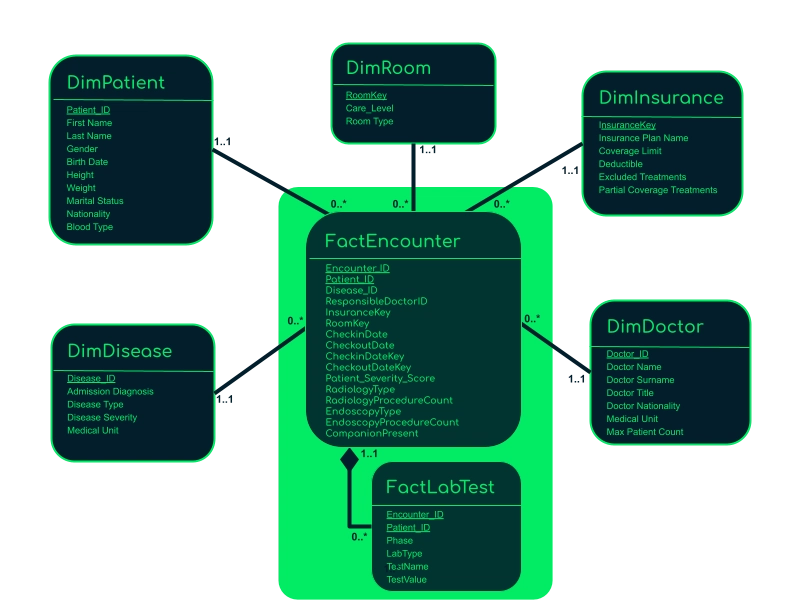

# 1 HTAP Sử dụng Truy vấn Star Schema trên MongoDB Atlas Search Index
Sponsor by https://dev.to/mongodb/htap-using-a-star-query-on-mongodb-atlas-search-index-17p5
## Giới thiệu

MongoDB được sử dụng phổ biến nhờ sức mạnh trong việc quản lý xử lý giao dịch trực tuyến (OLTP) với mô hình tài liệu (document model) phù hợp tự nhiên với các giao dịch đặc thù theo miền và mô hình truy cập của chúng. Ngoài các khả năng này, MongoDB còn hỗ trợ các kỹ thuật tìm kiếm nâng cao thông qua Atlas Search index, dựa trên Apache Lucene. Tính năng này có thể được sử dụng cho phân tích gần thời gian thực (near-real-time analytics) và khi kết hợp với aggregation pipeline, nó bổ sung một số khả năng xử lý phân tích trực tuyến (OLAP). Nhờ mô hình tài liệu, khả năng phân tích này không yêu cầu cấu trúc dữ liệu khác biệt và cho phép MongoDB thực thi hiệu quả khối lượng công việc lai giữa giao dịch và phân tích (HTAP), như được minh họa trong bài viết này với một ví dụ từ lĩnh vực y tế.

Các hệ quản trị cơ sở dữ liệu quan hệ truyền thống sử dụng phương pháp tối ưu hóa truy vấn phức tạp được gọi là "star transformation" và dựa vào nhiều index trên một cột (single-column indexes), cùng với các phép toán bitmap, để thực hiện các truy vấn ad-hoc hiệu quả. Điều này yêu cầu một schema chiều (dimensional schema) hay star schema, khác với schema chuẩn hóa (normalized schema) được cập nhật bởi các giao dịch. Ngược lại, MongoDB có thể được truy vấn với chiến lược tương tự bằng cách sử dụng schema tài liệu của nó cho các trường hợp sử dụng nghiệp vụ (operational use cases), chỉ đơn giản yêu cầu thêm một Atlas Search index trên collection lưu trữ fact của giao dịch.

Để minh họa cách một index duy nhất trên collection fact cho phép các truy vấn hiệu quả ngay cả khi các bộ lọc được áp dụng cho các collection chiều khác, tôi sử dụng bộ dữ liệu MedSynora DW, tương tự như star schema với các chiều và fact. Bộ dữ liệu này, được xuất bản bởi M. Ebrar Küçük trên Kaggle, là dữ liệu kho tổng hợp về bệnh viện bao gồm các lần khám (patient encounters), điều trị (treatments) và xét nghiệm (lab tests), tuân thủ các tiêu chuẩn về quyền riêng tư cho khoa học dữ liệu và học máy y tế.

## Nhập bộ dữ liệu

Bộ dữ liệu có sẵn trên Kaggle dưới dạng một thư mục các file CSV (comma-separated values) cho các chiều và fact, được nén trong một file zip 730MB. Bảng fact lớn nhất mà tôi sẽ sử dụng chứa 10 triệu bản ghi.

Tôi tải các file CSV và giải nén chúng:

```bash
curl -L -o medsynora-dw.zip "https://www.kaggle.com/api/v1/datasets/download/mebrar21/medsynora-dw"
unzip medsynora-dw.zip
```

Tôi nhập từng file vào một collection, sử dụng `mongoimport` từ MongoDB Database Tools:

```bash
for i in "MedSynora DW"/*.csv
do
 mongoimport -d "MedSynoraDW" --file="$i"  --type=csv --headerline -c "$(basename "$i" .csv)" -j 8
done
```

Đối với demo này, tôi quan tâm đến hai bảng fact: `FactEncounter` và `FactLabTest`. Dưới đây là các trường được mô tả trong tiêu đề file:

```bash
head -1 "MedSynora DW"/Fact{Encounter,LabTests}.csv
```

```
==> MedSynora DW/FactEncounter.csv <==
Encounter_ID,Patient_ID,Disease_ID,ResponsibleDoctorID,InsuranceKey,RoomKey,CheckinDate,CheckoutDate,CheckinDateKey,CheckoutDateKey,Patient_Severity_Score,RadiologyType,RadiologyProcedureCount,EndoscopyType,EndoscopyProcedureCount,CompanionPresent

==> MedSynora DW/FactLabTests.csv <==
Encounter_ID,Patient_ID,Phase,LabType,TestName,TestValue
```

Các bảng fact tham chiếu đến các chiều sau:

```bash
head -1 "MedSynora DW"/Dim{Disease,Doctor,Insurance,Patient,Room}.csv
```

```
==> MedSynora DW/DimDisease.csv <==
Disease_ID,Admission Diagnosis,Disease Type,Disease Severity,Medical Unit

==> MedSynora DW/DimDoctor.csv <==
Doctor_ID,Doctor Name,Doctor Surname,Doctor Title,Doctor Nationality,Medical Unit,Max Patient Count

==> MedSynora DW/DimInsurance.csv <==
InsuranceKey,Insurance Plan Name,Coverage Limit,Deductible,Excluded Treatments,Partial Coverage Treatments

==> MedSynora DW/DimPatient.csv <==
Patient_ID,First Name,Last Name,Gender,Birth Date,Height,Weight,Marital Status,Nationality,Blood Type

==> MedSynora DW/DimRoom.csv <==
RoomKey,Care_Level,Room Type
```

Dưới đây là mô hình chiều (dimensional model), thường được gọi là "star schema" vì các bảng fact nằm ở trung tâm, tham chiếu đến các chiều. Do chuẩn hóa, khi fact chứa cấu trúc một-nhiều, nó được mô tả trong hai file CSV để phù hợp với hai bảng SQL; tuy nhiên, trong MongoDB, nó có thể nằm trên một collection duy nhất. Nó chứa các số đo fact và khóa chiều, tham chiếu đến khóa của các collection chiều.

Star schema with facts and dimensions

*Star schema với facts và dimensions. Các fact được lưu trữ trong hai bảng trong file CSV hoặc cơ sở dữ liệu SQL, nhưng trên một collection duy nhất trong MongoDB. Nó chứa các số đo fact và khóa chiều, tham chiếu đến khóa của các collection chiều.*

MongoDB cho phép lưu trữ cấu trúc một-nhiều, chẳng hạn như Encounters và LabTests, trong một collection duy nhất. Bằng cách nhúng LabTests dưới dạng một mảng trong các tài liệu Encounter, mô hình thiết kế này thúc đẩy việc gom dữ liệu (data colocation) để giảm truy cập đĩa và tăng khả năng cache locality, giảm thiểu trùng lặp để cải thiện hiệu quả lưu trữ, duy trì tính toàn vẹn dữ liệu mà không yêu cầu xử lý khóa ngoại bổ sung, và cho phép nhiều khả năng lập chỉ mục hơn. Mô hình tài liệu cũng khắc phục vấn đề phổ biến trong các truy vấn phân tích SQL, nơi việc join trước aggregation có thể tạo ra kết quả không chính xác do lặp lại giá trị của phần tử cha trong mối quan hệ một-nhiều.

Vì đây sẽ là mô hình dữ liệu phù hợp cho một cơ sở dữ liệu nghiệp vụ với dữ liệu như vậy, tôi tạo một collection mới, sử dụng aggregation pipeline, mà tôi sẽ sử dụng thay vì hai collection đã được nhập từ CSV đã chuẩn hóa:

```javascript
db.FactLabTests.createIndex({ Encounter_ID: 1, Patient_ID: 1 });

db.FactEncounter.aggregate([
  {
    $lookup: {
      from: "FactLabTests",
      localField: "Encounter_ID",
      foreignField: "Encounter_ID",
      as: "LabTests"
    }
  },
  {
    $addFields: {
      LabTests: {
        $map: {
          input: "$LabTests",
          as: "test",
          in: {
            Phase: "$$test.Phase",
            LabType: "$$test.LabType",
            TestName: "$$test.TestName",
            TestValue: "$$test.TestValue"
          }
        }
      }
    }
  },
  {
    $out: "FactEncounterLabTests"
  }
]);
```

Dưới đây là cách một tài liệu trông như thế nào:

```javascript
AtlasLocalDev atlas [direct: primary] MedSynoraDW>
db.FactEncounterLabTests.find().limit(1)
```

```
[
  {
    _id: ObjectId('67fc3d2f40d2b3c843949c97'),
    Encounter_ID: 2158,
    Patient_ID: 'TR479',
    Disease_ID: 1632,
    ResponsibleDoctorID: 905,
    InsuranceKey: 82,
    RoomKey: 203,
    CheckinDate: '2024-01-23 11:09:00',
    CheckoutDate: '2024-03-29 17:00:00',
    CheckinDateKey: 20240123,
    CheckoutDateKey: 20240329,
    Patient_Severity_Score: 63.2,
    RadiologyType: 'None',
    RadiologyProcedureCount: 0,
    EndoscopyType: 'None',
    EndoscopyProcedureCount: 0,
    CompanionPresent: 'True',
    LabTests: [
      {
        Phase: 'Admission',
        LabType: 'CBC',
        TestName: 'Lymphocytes_abs (10^3/µl)',
        TestValue: 1.34
      },
      {
        Phase: 'Admission',
        LabType: 'Chem',
        TestName: 'ALT (U/l)',
        TestValue: 20.5
      },
      {
        Phase: 'Admission',
        LabType: 'Lipids',
        TestName: 'Triglycerides (mg/dl)',
        TestValue: 129.1
      },
      {
        Phase: 'Discharge',
        LabType: 'CBC',
        TestName: 'RBC (10^6/µl)',
        TestValue: 4.08
      },
... // Một số LabTests khác
    ]
  }
]
```

Trong MongoDB, mô hình tài liệu sử dụng các mẫu thiết kế nhúng (embedding) và tham chiếu (reference), giống như star schema với một collection fact chính và các tham chiếu đến các collection chiều khác nhau. Điều quan trọng là đảm bảo các tham chiếu chiều được lập chỉ mục đúng cách trước khi truy vấn các collection này.

## Atlas Search index

Search index khác biệt với các index thông thường, vốn chỉ dựa trên một composite key duy nhất, bởi vì chúng có thể lập chỉ mục nhiều trường mà không yêu cầu một thứ tự cụ thể để thiết lập key. Tính năng này làm cho chúng hoàn hảo cho các truy vấn ad-hoc, nơi các chiều lọc không được xác định trước.

Tôi tạo một Atlas Search index duy nhất bao gồm tất cả các chiều hoặc số đo mà tôi có thể sử dụng trong các điều kiện lọc (predicates), bao gồm cả những trường nằm trong tài liệu nhúng:

```javascript
db.FactEncounterLabTests.createSearchIndex(
  "SearchFactEncounterLabTests", {
    mappings: {
      dynamic: false,
      fields: {
        "Encounter_ID":        { "type": "number"  },
        "Patient_ID":          { "type": "token"  }, // Dùng token vì là ID dạng string
        "Disease_ID":          { "type": "number"  },
        "InsuranceKey":        { "type": "number"  },
        "RoomKey":             { "type": "number"  },
        "ResponsibleDoctorID": { "type": "number" },
        "CheckinDate":         { "type": "token"  }, // Hoặc date nếu cần range query
        "CheckoutDate":        { "type": "token"  }, // Hoặc date nếu cần range query
        "LabTests":            {
          "type": "document" , fields: {
            "Phase":           { "type": "token"  },
            "LabType":         { "type": "token"  },
            "TestName":        { "type": "token"  },
            "TestValue":       { "type": "number" }
          }
        }
      }
    }
  }
);
```

Vì tôi không cần tìm kiếm văn bản bổ sung trên các key, tôi chỉ định các chuỗi ký tự là `token`. Tôi gắn nhãn các key số nguyên là `number`. Nói chung, các key được sử dụng cho các điều kiện bằng nhau (equality predicates). Tuy nhiên, một số có thể được sử dụng cho các phạm vi khi định dạng cho phép, chẳng hạn như ngày check-in và check-out được định dạng là YYYY-MM-DD (trong trường hợp đó có thể dùng `date` type).

Trong cơ sở dữ liệu quan hệ, phương pháp star schema nhấn mạnh tầm quan trọng của việc giới hạn số lượng cột trong các bảng fact, vì chúng thường chứa số lượng hàng lớn. Các bảng chiều nhỏ hơn có thể chứa nhiều cột hơn và thường được denormalized trong cơ sở dữ liệu SQL (ưu tiên star schema hơn snowflake schema). Tương tự, trong mô hình tài liệu, việc đưa tất cả các trường chiều vào sẽ làm tăng kích thước tài liệu trong collection fact một cách không cần thiết, khiến việc tham chiếu đến collection chiều trở nên đơn giản hơn. Các nguyên tắc chung về mô hình hóa dữ liệu trong MongoDB cho phép truy vấn nó như một star schema mà không cần cân nhắc thêm, vì cơ sở dữ liệu MongoDB được thiết kế cho các mô hình truy cập ứng dụng.

## Truy vấn Star Schema (Star Query)

Star schema cho phép xử lý các truy vấn lọc các trường trong các collection chiều qua nhiều giai đoạn:

1.  **Giai đoạn 1:** Các bộ lọc được áp dụng cho các collection chiều để trích xuất tất cả các khóa chiều. Các khóa này thường không yêu cầu index bổ sung, vì các chiều thường có kích thước nhỏ.
2.  **Giai đoạn 2:** Một tìm kiếm (search) được thực hiện sử dụng tất cả các khóa chiều đã thu được ở giai đoạn trước trên collection fact. Quá trình này sử dụng search index được xây dựng trên các key đó, cho phép truy cập nhanh chóng đến các tài liệu cần thiết.
3.  **Giai đoạn 3:** Có thể truy xuất thêm các chiều để thu thập các trường cần thiết cho aggregation hoặc projection. Quá trình đa giai đoạn này đảm bảo rằng bộ lọc được áp dụng làm giảm đáng kể tập dữ liệu từ collection fact lớn trước khi bất kỳ hoạt động nào khác được thực hiện.

Đối với một truy vấn ví dụ, tôi muốn phân tích các bản ghi xét nghiệm (lab test) cho bệnh nhân nữ cao hơn 170 cm, đã thực hiện xét nghiệm lab loại lipids, có bảo hiểm với giới hạn bảo hiểm (coverage limit) trên 80%, và được điều trị bởi các bác sĩ Nhật Bản trong phòng deluxe cho các tình trạng bệnh về huyết học.

### Pipeline Aggregation với Search

Để tối ưu hóa quá trình xử lý collection fact và áp dụng tất cả các bộ lọc, tôi sẽ bắt đầu với một pipeline aggregation đơn giản bắt đầu bằng một search trên search index. Điều này cho phép áp dụng các bộ lọc trực tiếp lên các trường của collection fact, trong khi các bộ lọc bổ sung sẽ được tích hợp trong giai đoạn một của star query. Tôi sử dụng một biến cục bộ với toán tử `compound` để dễ dàng thêm các bộ lọc cho mỗi chiều trong giai đoạn một của star query.

Trước khi đi qua các giai đoạn star query để thêm bộ lọc trên các chiều, truy vấn của tôi có một bộ lọc trên loại xét nghiệm lab, nằm trong collection fact và đã được index.

```javascript
const search =  {
    "$search": {
      "index": "SearchFactEncounterLabTests",
      "compound": {
        "must": [
          { "in":    { "path": "LabTests.LabType" , "value": "Lipids"   } },
        ]
      },
      "sort": { CheckoutDate: -1 } // Sắp xếp kết quả theo ngày checkout
    }
  }
```

Tôi đã thêm một toán tử "sort" để sắp xếp kết quả theo ngày check-out giảm dần. Điều này minh họa lợi thế của việc sắp xếp trong quá trình tìm kiếm index thay vì ở các bước sau của pipeline aggregation, đặc biệt khi áp dụng "limit".

Tôi sẽ sử dụng biến cục bộ này để thêm nhiều bộ lọc hơn trong Giai đoạn 1 của star query, để nó có thể được thực thi cho Giai đoạn 2, và thu thập các tài liệu cho Giai đoạn 3.

### Giai đoạn 1: Truy vấn các collection chiều

Trong giai đoạn đầu tiên của star query, tôi thu thập các khóa chiều từ các collection chiều. Đối với mỗi chiều có bộ lọc, lấy các khóa chiều, bằng cách sử dụng `find()` trên chiều, và thêm điều kiện "must" vào "compound" của search index trên fact.

Đoạn code sau thêm các điều kiện trên Patient (bệnh nhân nữ cao hơn 170 cm):

```javascript
search["$search"]["compound"]["must"].push( { in: {
 path: "Patient_ID",                         // Khóa ngoại trong Fact
 value: db.DimPatient.find(                  // Collection Chiều
  {Gender: "Female", Height: { "$gt": 170 }} // Bộ lọc trên Chiều
 ).map(doc => doc["Patient_ID"]).toArray() } // Khóa chính trong Chiều (lấy mảng ID)
})
```

Đoạn code sau thêm các điều kiện trên Doctor (quốc tịch Nhật Bản):

```javascript
search["$search"]["compound"]["must"].push( { in: {
 path: "ResponsibleDoctorID",               // Khóa ngoại trong Fact
 value: db.DimDoctor.find(                  // Collection Chiều
  {"Doctor Nationality": "Japanese" }       // Bộ lọc trên Chiều
 ).map(doc => doc["Doctor_ID"]).toArray() } // Khóa chính trong Chiều (lấy mảng ID)
})
```

Đoạn code sau thêm điều kiện trên Room (loại Deluxe):

```javascript
search["$search"]["compound"]["must"].push( { in: {
 path: "RoomKey",                         // Khóa ngoại trong Fact
 value: db.DimRoom.find(                  // Collection Chiều
  {"Room Type": "Deluxe" }                // Bộ lọc trên Chiều
 ).map(doc => doc["RoomKey"]).toArray() } // Khóa chính trong Chiều (lấy mảng Key)
})
```

Đoạn code sau thêm điều kiện trên Disease (loại Hematology):

```javascript
search["$search"]["compound"]["must"].push( { in: {
 path: "Disease_ID",                         // Khóa ngoại trong Fact
 value: db.DimDisease.find(                  // Collection Chiều
  {"Disease Type": "Hematology" } // Bộ lọc trên Chiều
 ).map(doc => doc["Disease_ID"]).toArray() } // Khóa chính trong Chiều (lấy mảng ID)
})
```

Cuối cùng, điều kiện về giới hạn bảo hiểm (lớn hơn 80%):

```javascript
search["$search"]["compound"]["must"].push( { in: {
 path: "InsuranceKey",                         // Khóa ngoại trong Fact
 value: db.DimInsurance.find(                  // Collection Chiều
  {"Coverage Limit": { "$gt": 0.8 } }          // Bộ lọc trên Chiều
 ).map(doc => doc["InsuranceKey"]).toArray() } // Khóa chính trong Chiều (lấy mảng Key)
})
```

Tất cả các tiêu chí tìm kiếm này có cùng cấu trúc: một `find()` trên collection chiều, với các bộ lọc từ truy vấn, tạo ra một mảng các khóa chiều (giống như khóa chính trong bảng chiều) được sử dụng để tìm kiếm trong các tài liệu fact bằng cách sử dụng nó như một tham chiếu (giống như khóa ngoại trong bảng fact).

Mỗi bước này đã truy vấn collection chiều để thu được một mảng đơn giản các khóa chiều, được thêm vào pipeline aggregation. Thay vì join các bảng như trong cơ sở dữ liệu quan hệ, các tiêu chí trên các chiều được đẩy xuống truy vấn trên các bảng fact.

### Giai đoạn 2: Truy vấn search index trên fact

Với các truy vấn ngắn trên các chiều, tôi đã xây dựng bước search trong pipeline sau:

```javascript
AtlasLocalDev atlas [direct: primary] MedSynoraDW> print(search)
{
  '$search': {
    index: 'SearchFactEncounterLabTests',
    compound: {
      must: [
        { in: { path: 'LabTests.LabType', value: 'Lipids' } },
        {
          in: {
            path: 'Patient_ID',
            value: [
              'TR551',    'TR751',    'TR897',    'TRGT201',  'TRJB261',
              'TRQG448',  'TRSQ510',  'TRTP535',  'TRUC548',  'TRVT591',
              'TRABU748', 'TRADD783', 'TRAZG358', 'TRBCI438', 'TRBTY896',
              'TRBUH905', 'TRBXU996', 'TRCAJ063', 'TRCIM274', 'TRCXU672',
              'TRDAB731', 'TRDFZ885', 'TRDGE890', 'TRDJK974', 'TRDKN003',
              'TRE004',   'TRMN351',  'TRRY492',  'TRTI528',  'TRAKA962',
              'TRANM052', 'TRAOY090', 'TRARY168', 'TRASU190', 'TRBAG384',
              'TRBYT021', 'TRBZO042', 'TRCAS072', 'TRCBF085', 'TRCOB419',
              'TRDMD045', 'TRDPE124', 'TRDWV323', 'TREUA926', 'TREZX079',
              'TR663',    'TR808',    'TR849',    'TRKA286',  'TRLC314',
              'TRMG344',  'TRPT435',  'TRVZ597',  'TRXC626',  'TRACT773',
              'TRAHG890', 'TRAKW984', 'TRAMX037', 'TRAQR135', 'TRARX167',
              'TRARZ169', 'TRASW192', 'TRAZN365', 'TRBDW478', 'TRBFG514',
              'TRBOU762', 'TRBSA846', 'TRBXR993', 'TRCRL507', 'TRDKA990',
              'TRDKD993', 'TRDTO238', 'TRDSO212', 'TRDXA328', 'TRDYU374',
              'TRDZS398', 'TREEB511', 'TREVT971', 'TREWZ003', 'TREXW026',
              'TRFVL639', 'TRFWE658', 'TRGIZ991', 'TRGVK314', 'TRGWY354',
              'HHV637', 'HNS790', 'IMV443', 'IQR543', 'ISL589',
              'IWQ698', 'IWL693', 'JDT883', 'JHH975', 'JHT987',
              'JIM006', 'FVZ653', 'FYQ722', 'FZY756', 'GNZ121',
              ... 6184 more items // Mảng Patient_ID có thể rất dài
            ]
          }
        },
        {
          in: {
            path: 'ResponsibleDoctorID',
            value: [ 830, 844, 862, 921 ] // Mảng Doctor_ID
          }
        },
        { in: { path: 'RoomKey', value: [ 203 ] } }, // Mảng RoomKey
        {
          in: {
            path: 'Disease_ID',
            value: [
              1519, 1506, 1504, 1510,
              1515, 1507, 1503, 1502,
              1518, 1517, 1508, 1513,
              1509, 1512, 1516, 1511,
              1505, 1514
            ] // Mảng Disease_ID
          }
        },
        { in: { path: 'InsuranceKey', value: [ 83, 84 ] } } // Mảng InsuranceKey
      ]
    },
    sort: { CheckoutDate: -1 }
  }
}
```

MongoDB Atlas Search indexes, được xây dựng trên Apache Lucene, xử lý hiệu quả các truy vấn phức tạp với nhiều điều kiện và quản lý các mảng giá trị dài. Trong ví dụ này, một toán tử search tích hợp toán tử `compound` với mệnh đề `must` để áp dụng các bộ lọc trên nhiều thuộc tính. Khả năng này đơn giản hóa việc thiết kế truy vấn sau khi giải quyết các bộ lọc phức tạp thành danh sách các khóa chiều.

Với toán tử "search" được tạo ở trên, tôi có thể chạy một pipeline aggregation để lấy các tài liệu mà tôi quan tâm:

```javascript
db.FactEncounterLabTests.aggregate([
 search,
])
```

Với ví dụ của tôi, chín tài liệu được trả về trong 50 mili giây.

### Ước tính số lượng (Estimate the count)

Phương pháp này lý tưởng cho các truy vấn có bộ lọc trên nhiều điều kiện, trong đó không có điều kiện nào quá chọn lọc một mình, nhưng sự kết hợp lại rất chọn lọc. Sử dụng truy vấn trên các chiều và search index trên fact giúp tránh đọc nhiều tài liệu hơn mức cần thiết. Tuy nhiên, tùy thuộc vào các hoạt động bạn sẽ thêm vào pipeline aggregation, việc ước tính số lượng bản ghi được trả về bởi search index là một ý tưởng tốt để tránh các truy vấn chạy quá lâu (runaway queries).

Thông thường, một ứng dụng cho phép người dùng thực thi các truy vấn đa tiêu chí có thể định nghĩa một ngưỡng và trả về lỗi hoặc cảnh báo khi số lượng tài liệu ước tính vượt quá ngưỡng đó, nhắc nhở người dùng thêm nhiều bộ lọc hơn. Đối với các trường hợp như vậy, bạn có thể chạy một `$searchMeta` trên index trước toán tử `$search`. Ví dụ, đoạn code sau kiểm tra xem số lượng tài liệu được trả về bởi bộ lọc có nhỏ hơn 10,000 hay không:

```javascript
MedSynoraDW> db.FactEncounterLabTests.aggregate([
  { "$searchMeta": {
     index: search["$search"].index,
     compound: search["$search"].compound,
     count: { "type": "lowerBound" , threshold: 10000 }
     }
  }
])
```

```
[ { count: { lowerBound: Long('9') } } ]
```

Trong trường hợp của tôi, với chín tài liệu, tôi có thể thêm nhiều hoạt động hơn vào pipeline aggregation mà không lo về thời gian phản hồi kéo dài. Nếu có nhiều tài liệu hơn dự kiến, các bước bổ sung trong pipeline aggregation có thể mất nhiều thời gian hơn. Nếu hàng chục hoặc hàng trăm nghìn tài liệu được dự kiến làm đầu vào cho một pipeline aggregation phức tạp, ứng dụng có thể cảnh báo người dùng rằng việc thực thi truy vấn sẽ không tức thời, và có thể cung cấp tùy chọn chạy nó như một công việc nền (background job) với thông báo khi hoàn thành. Với cảnh báo như vậy, người dùng có thể quyết định thêm nhiều bộ lọc hơn, hoặc một giới hạn (`limit`) để làm việc với kết quả Top-n, điều này sẽ được thêm vào pipeline aggregation sau một search đã được sắp xếp.

### Giai đoạn 3: Join lại với các chiều để chiếu (projection)

Bước đầu tiên của pipeline aggregation phải tìm nạp tất cả các tài liệu cần thiết cho kết quả, và chỉ những tài liệu đó, với quyền truy cập hiệu quả thông qua search index. Sau khi lọc đã xảy ra, tập hợp nhỏ các tài liệu có thể được sử dụng để áp dụng aggregation hoặc projection, với các bước bổ sung trong pipeline aggregation.

Trong giai đoạn thứ ba của star query, nó có thể tra cứu (lookup) các chiều để truy xuất thêm các thuộc tính cần thiết cho aggregation hoặc projection. Nó có thể xem xét lại một số collection đã sử dụng để lọc, điều này không phải là vấn đề vì các chiều vẫn nhỏ. Đối với các chiều lớn hơn, giai đoạn ban đầu có thể đã lưu thông tin này vào một mảng tạm thời để ngăn việc tra cứu lại, mặc dù điều này thường không cần thiết.

Ví dụ, tôi muốn hiển thị thông tin bổ sung về bệnh nhân và bác sĩ. Do đó, tôi thêm hai bước `$lookup` vào pipeline aggregation của mình:

```javascript
 {
    "$lookup": {
      "from": "DimDoctor", // Tra cứu từ collection bác sĩ
      "localField": "ResponsibleDoctorID", // Trường khóa ngoại trong FactEncounterLabTests
      "foreignField": "Doctor_ID", // Trường khóa chính trong DimDoctor
      "as": "ResponsibleDoctor" // Lưu kết quả vào trường ResponsibleDoctor
    }
  },
  {
    "$lookup": {
      "from": "DimPatient", // Tra cứu từ collection bệnh nhân
      "localField": "Patient_ID", // Trường khóa ngoại trong FactEncounterLabTests
      "foreignField": "Patient_ID", // Trường khóa chính trong DimPatient
      "as": "Patient" // Lưu kết quả vào trường Patient
    }
  },
```

Để đơn giản cho demo này, tôi đã nhập các chiều trực tiếp từ file CSV. Trong một cơ sở dữ liệu được thiết kế tốt, khóa chính cho các chiều nên là trường `_id` của tài liệu, và collection nên được thiết lập như một clustered collection. Thiết kế này đảm bảo các phép join từ các tài liệu fact hiệu quả. Hầu hết các chiều đều nhỏ gọn và nằm trong bộ nhớ.

Tôi thêm một `$project` cuối cùng để chỉ lấy các trường tôi cần. Pipeline aggregation đầy đủ, sử dụng search đã định nghĩa ở trên với các bộ lọc và mảng các khóa chiều, là:

```javascript
db.FactEncounterLabTests.aggregate([
  search, // Sử dụng biến search đã tạo với tất cả bộ lọc
  {
    "$lookup": {
      "from": "DimDoctor",
      "localField": "ResponsibleDoctorID",
      "foreignField": "Doctor_ID",
      "as": "ResponsibleDoctor"
    }
  },
  {
    "$lookup": {
      "from": "DimPatient",
      "localField": "Patient_ID",
      "foreignField": "Patient_ID",
      "as": "Patient"
    }
  },
  {
    "$project": {
      "Patient_Severity_Score": 1,
      "CheckinDate": 1,
      "CheckoutDate": 1,
      "Patient.name": {
        "$concat": [
          { "$arrayElemAt": ["$Patient.First Name", 0] }, // Lấy First Name từ mảng Patient (do lookup)
          " ",
          { "$arrayElemAt": ["$Patient.Last Name", 0] } // Lấy Last Name từ mảng Patient
        ]
      },
      "ResponsibleDoctor.name": {
        "$concat": [
          { "$arrayElemAt": ["$ResponsibleDoctor.Doctor Name", 0] }, // Lấy Doctor Name từ mảng ResponsibleDoctor
          " ",
          { "$arrayElemAt": ["$ResponsibleDoctor.Doctor Surname", 0] } // Lấy Doctor Surname từ mảng ResponsibleDoctor
        ]
      }
    }
  }
])
```

Trên một instance nhỏ, nó trả về kết quả sau trong 50 mili giây:

```
[
  {
    _id: ObjectId('67fc3d2f40d2b3c843949a97'),
    CheckinDate: '2024-02-12 17:00:00',
    CheckoutDate: '2024-03-30 13:04:00',
    Patient_Severity_Score: 61.4,
    ResponsibleDoctor: [ { name: 'Sayuri Shan Kou' } ], // Kết quả lookup là mảng
    Patient: [ { name: 'Niina Johanson' } ] // Kết quả lookup là mảng
  },
  {
    _id: ObjectId('67fc3d2f40d2b3c843949f5c'),
    CheckinDate: '2024-04-29 06:44:00',
    CheckoutDate: '2024-05-30 19:53:00',
    Patient_Severity_Score: 57.7,
    ResponsibleDoctor: [ { name: 'Sayuri Shan Kou' } ],
    Patient: [ { name: 'Cindy Wibisono' } ]
  },
  ... // Các tài liệu khác
  {
    _id: ObjectId('67fc3d3140d2b3c843969226'),
    CheckinDate: '2024-04-06 11:36:00',
    CheckoutDate: '2024-04-26 07:02:00',
    Patient_Severity_Score: 62.9,
    ResponsibleDoctor: [ { name: 'Sayuri Shan Kou' } ],
    Patient: [ { name: 'Stanislava Beranova' } ]
  }
]
```
Phương pháp star query tập trung hoàn toàn vào việc lọc để thu được đầu vào cho việc xử lý tiếp theo, đồng thời giữ nguyên sức mạnh đầy đủ của aggregation pipelines.

### Aggregation bổ sung sau khi lọc

Khi tôi đã có tập hợp các tài liệu được lọc hiệu quả ngay từ đầu, tôi có thể áp dụng một số phép aggregation trước phép projection. Ví dụ, đoạn code sau nhóm theo bác sĩ và đếm số lượng bệnh nhân cũng như phạm vi điểm mức độ nghiêm trọng (severity score):

```javascript
db.FactEncounterLabTests.aggregate([
  search, // Bắt đầu với search đã lọc
  {
    "$lookup": {
      "from": "DimDoctor",
      "localField": "ResponsibleDoctorID",
      "foreignField": "Doctor_ID",
      "as": "ResponsibleDoctor"
    }
  },
  {
    "$unwind": "$ResponsibleDoctor" // Mở mảng ResponsibleDoctor (lookup trả về mảng)
  },
  {
    "$group": {
      "_id": {
        "doctor_id": "$ResponsibleDoctor.Doctor_ID",
        "doctor_name": { "$concat": [ "$ResponsibleDoctor.Doctor Name", " ", "$ResponsibleDoctor.Doctor Surname" ] }
      },
      "min_severity_score": { "$min": "$Patient_Severity_Score" }, // Tính min severity score
      "max_severity_score": { "$max": "$Patient_Severity_Score" }, // Tính max severity score
      "patient_count": { "$sum": 1 }  // Đếm số lượng bệnh nhân
    }
  },
  {
    "$project": {
      "doctor_name": "$_id.doctor_name",
      "min_severity_score": 1,
      "max_severity_score": 1,
      "patient_count": 1,
      "_id": 0 // Loại bỏ trường _id mặc định
    }
  }
])
```

Các bộ lọc của tôi chỉ lấy được tài liệu từ một bác sĩ và chín bệnh nhân:

```
[
  {
    doctor_name: 'Sayuri Shan Kou',
    min_severity_score: 47.6,
    max_severity_score: 66,
    patient_count: 9
  }
]
```

Sử dụng mô hình tài liệu MongoDB, phương pháp này cho phép các truy vấn phân tích trực tiếp trên cơ sở dữ liệu nghiệp vụ, loại bỏ sự cần thiết của một cơ sở dữ liệu phân tích riêng biệt. Search index đóng vai trò là công cụ phân tích cho cơ sở dữ liệu nghiệp vụ, tận dụng khả năng mạnh mẽ của MongoDB aggregation pipeline. Vì search index chạy trên tiến trình riêng, nó có thể chạy trên một search node chuyên dụng để phân bổ tài nguyên tốt hơn. Khi chạy phân tích trên cơ sở dữ liệu nghiệp vụ, điều quan trọng là các truy vấn không ảnh hưởng đến khối lượng công việc giao dịch (operational workload).

## Kết luận

Mô hình tài liệu linh hoạt của MongoDB, cùng với Atlas Search indexes, cung cấp một cách hiệu quả để quản lý và truy vấn dữ liệu trong star schema. Bằng cách sử dụng một search index duy nhất trên bảng fact và truy vấn các collection chiều để lấy tiêu chí lọc, người dùng có thể thực hiện các truy vấn ad-hoc hiệu quả, và tránh việc phải sao chép dữ liệu từ một row store nghiệp vụ sang một schema phân tích chuyên dụng trong một columnar row store, như với các cơ sở dữ liệu quan hệ truyền thống.

Kỹ thuật này tuân theo phương pháp được sử dụng với cơ sở dữ liệu SQL, nơi một star schema, được sử dụng để lưu trữ một data mart đặc thù theo miền, khác biệt với cơ sở dữ liệu chuẩn hóa tập trung, được làm mới từ cơ sở dữ liệu nghiệp vụ. Trong MongoDB, mô hình tài liệu, sử dụng các mẫu thiết kế nhúng và tham chiếu, giống star schema trong khi vẫn được tối ưu hóa cho các giao dịch nghiệp vụ của miền đó. Với search index, kỹ thuật tương tự được sử dụng mà không cần stream dữ liệu sang cơ sở dữ liệu khác.

Phương pháp này, được triển khai trong một star query ba giai đoạn, rất dễ tích hợp vào ngôn ngữ client, tối ưu hóa hiệu suất truy vấn và cho phép phân tích gần thời gian thực trên các bộ dữ liệu phức tạp. Nó minh họa cách MongoDB có thể cung cấp một giải pháp thay thế có khả năng mở rộng và hiệu suất cao cho các cơ sở dữ liệu quan hệ truyền thống đối với khối lượng công việc HTAP.
