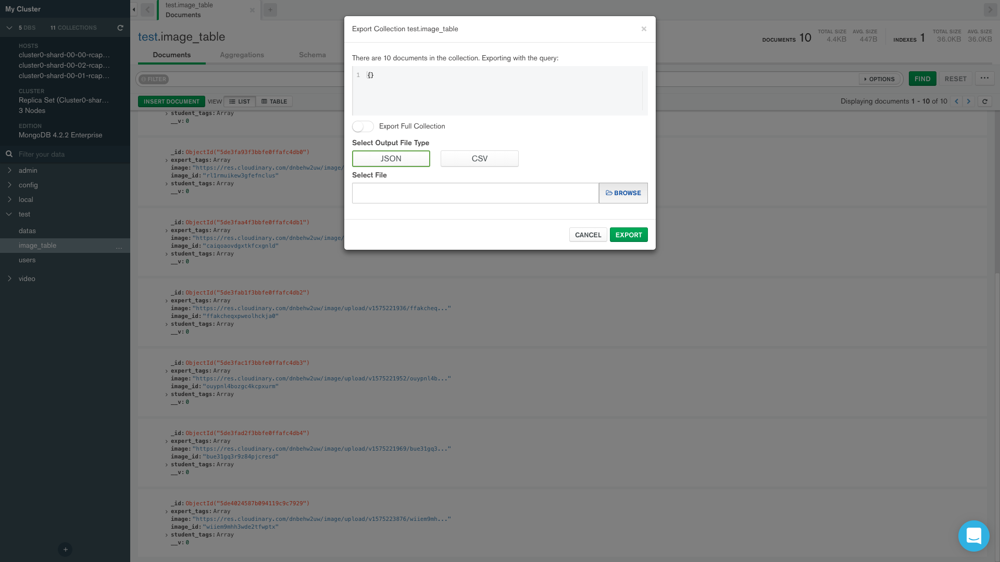

# 1 How to export data in mongoDB atlas
Just install mongo compass connect to your atlas remote DB: get the hostname like "cluster0-shard-00-00-rcapo.mongodb.net XXXXX" from your remote altas cluster then connect to the database.

then you can download each document as JSON or CSV format.

