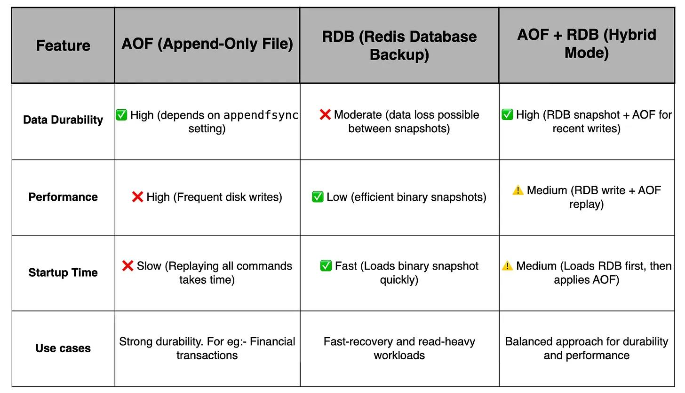

# 1  Tìm hiểu sâu về Redis Persistence: Cân bằng giữa Hiệu năng và Tính bền vững của Dữ liệu

## Giới thiệu

Redis nổi tiếng là một kho lưu trữ dữ liệu key-value trong bộ nhớ (in-memory), mang lại hiệu năng truy cập cực nhanh. Tuy nhiên, bản chất "in-memory" cũng đặt ra câu hỏi: **Điều gì xảy ra với dữ liệu nếu tiến trình Redis bị dừng đột ngột (crash) hoặc khởi động lại?**

Nếu không có cơ chế bảo vệ, toàn bộ dữ liệu trong RAM sẽ bị mất. Điều này có thể gây ra các vấn đề nghiêm trọng:

*   **Tăng tải đột ngột cho cơ sở dữ liệu chính:** Khi cache mất, mọi yêu cầu sẽ dồn về database (hiện tượng "thundering herd").
*   **Tăng độ trễ:** Truy vấn database từ đĩa chậm hơn nhiều so với truy cập RAM.
*   **Giảm tính sẵn sàng:** Các yêu cầu chậm có thể bị timeout, ảnh hưởng đến trải nghiệm người dùng.

May mắn thay, Redis cung cấp các cơ chế **Persistence** (duy trì dữ liệu) để lưu trữ dữ liệu xuống đĩa, cho phép khôi phục trạng thái sau sự cố. Bài viết này sẽ đi sâu vào các cơ chế đó, phân tích ưu/nhược điểm và giúp bạn lựa chọn chiến lược phù hợp.

## Tại sao Redis cần Cơ chế Duy trì Dữ liệu?

Như đã đề cập, Redis lưu trữ dữ liệu chính trong RAM - một bộ nhớ tạm thời (volatile). Khi máy chủ gặp sự cố hoặc khởi động lại, dữ liệu RAM sẽ mất. Cơ chế persistence giúp giải quyết vấn đề này bằng cách lưu trữ một bản sao hoặc nhật ký dữ liệu xuống bộ nhớ bền vững (đĩa cứng, SSD).

## Các Chiến lược Persistence trong Redis

Redis cung cấp hai cơ chế chính và một phương pháp kết hợp:

### 1. Append-Only File (AOF)

*   **Cách hoạt động:** Redis ghi lại **mọi lệnh ghi** (write command) làm thay đổi dữ liệu (ví dụ: `SET`, `INCR`, `LPUSH`) vào một tệp tin chỉ cho phép ghi nối tiếp (append-only file). Khi Redis khởi động lại, nó sẽ đọc tệp AOF này và thực thi lại tuần tự các lệnh để khôi phục trạng thái dữ liệu như trước khi dừng.
*   **Tại sao ghi lệnh *sau* khi thực thi?** Để đảm bảo chỉ ghi lại các lệnh thành công và không làm tắc nghẽn luồng chính nếu việc ghi log gặp lỗi trước khi lệnh thực sự thay đổi dữ liệu trong bộ nhớ.

*   **Ưu điểm:**
    *   **Độ bền cao:** Có thể cấu hình để giảm thiểu tối đa việc mất dữ liệu (thậm chí có thể là 0% nếu cấu hình `fsync` phù hợp).
*   **Nhược điểm:**
    *   **Hiệu năng:** Việc ghi vào đĩa sau mỗi lệnh (hoặc định kỳ ngắn) có thể làm tăng độ trễ I/O và ảnh hưởng đến thông lượng của Redis.
    *   **Kích thước tệp:** Tệp AOF có thể trở nên rất lớn theo thời gian vì nó chứa mọi lệnh ghi.
    *   **Thời gian khởi động:** Việc thực thi lại toàn bộ lệnh trong tệp AOF lớn có thể mất nhiều thời gian.

*   **Tùy chọn cấu hình (`appendfsync`):**
    *   `always`: `fsync` (ghi dữ liệu từ bộ đệm hệ điều hành xuống đĩa) sau *mỗi* lệnh ghi. An toàn nhất nhưng chậm nhất.
    *   `everysec` (Mặc định): `fsync` mỗi giây một lần. Cân bằng tốt giữa hiệu năng và độ bền (có thể mất tối đa 1 giây dữ liệu gần nhất nếu crash).
    *   `no`: Để hệ điều hành quyết định khi nào `fsync`. Nhanh nhất nhưng kém an toàn nhất (có thể mất đến 30-60 giây dữ liệu).

### 2. Redis Database (RDB)

*   **Cách hoạt động:** Redis tạo ra một "snapshot" (ảnh chụp nhanh) của toàn bộ dữ liệu trong bộ nhớ tại một thời điểm nhất định và lưu nó vào một tệp nhị phân nén (thường có đuôi `.rdb`). Khi khởi động lại, Redis chỉ cần tải tệp RDB này để khôi phục dữ liệu.
*   **Các lệnh tạo Snapshot:**
    *   `SAVE`: Thực hiện đồng bộ, chặn các lệnh khác cho đến khi snapshot hoàn tất. Không nên dùng trong môi trường production.
    *   `BGSAVE` (Background Save): Redis tạo một tiến trình con (fork) để thực hiện việc lưu snapshot vào đĩa ở chế độ nền. Tiến trình chính vẫn tiếp tục phục vụ các yêu cầu. Đây là cách thường dùng.
*   **Xử lý thay đổi dữ liệu trong khi BGSAVE?** Cơ chế Copy-on-Write (CoW) thường được sử dụng. Khi một dữ liệu sắp được ghi vào snapshot bị thay đổi bởi tiến trình chính, một bản sao sẽ được tạo ra để tiến trình con tiếp tục ghi dữ liệu gốc không đổi vào RDB.

*   **Ưu điểm:**
    *   **Hiệu năng:** `BGSAVE` ít ảnh hưởng đến hiệu năng của tiến trình Redis chính.
    *   **Thời gian khởi động:** Tải tệp RDB nhị phân nhanh hơn nhiều so với thực thi lại các lệnh từ AOF.
    *   **Kích thước tệp:** Tệp RDB thường nhỏ gọn hơn AOF do được nén.
*   **Nhược điểm:**
    *   **Mất dữ liệu:** Bạn sẽ mất toàn bộ dữ liệu thay đổi *kể từ lần snapshot cuối cùng* cho đến khi Redis bị crash. Nếu snapshot được tạo mỗi 5 phút, bạn có thể mất tới 5 phút dữ liệu.
    *   **Chi phí `fork()`:** Với tập dữ liệu rất lớn, việc `fork()` tiến trình con cho `BGSAVE` có thể tốn thời gian và bộ nhớ tạm thời (do CoW), có thể gây ra độ trễ ngắn cho client.

### 3. Hybrid Approach: AOF + RDB

*   **Cách hoạt động:** Redis cho phép kết hợp cả hai phương pháp để tận dụng ưu điểm của từng loại. Khi cơ chế ghi lại AOF (AOF rewrite) được kích hoạt (tự động hoặc thủ công), Redis sẽ tạo một snapshot RDB nền và sau đó chỉ ghi các lệnh mới vào tệp AOF *kể từ thời điểm snapshot đó*. Khi khởi động, Redis sẽ tải tệp RDB trước, sau đó áp dụng các lệnh từ phần AOF còn lại.
*   **Cấu hình:** Bật `aof-use-rdb-preamble yes` (trong Redis 4.0 trở lên).

*   **Ưu điểm:**
    *   **Độ bền tốt hơn RDB:** Giảm thiểu mất dữ liệu nhờ phần AOF ghi lại các thay đổi sau snapshot (mức độ mất mát phụ thuộc vào cấu hình `appendfsync`).
    *   **Thời gian khởi động nhanh hơn AOF thuần túy:** Chỉ cần tải RDB và thực thi một phần AOF nhỏ hơn.
    *   **Quản lý kích thước AOF:** Quá trình rewrite giúp giữ kích thước tệp AOF trong tầm kiểm soát.
*   **Nhược điểm:**
    *   **Độ phức tạp:** Quy trình khởi động phức tạp hơn một chút (tải RDB rồi áp dụng AOF).
    *   **Vẫn có khả năng mất dữ liệu:** Mức độ mất dữ liệu vẫn phụ thuộc vào cấu hình `appendfsync` cho phần AOF.

## So sánh các Phương pháp

| Tiêu chí             | AOF (Append-Only File)          | RDB (Snapshotting)             | AOF + RDB (Hybrid)                  |
| :------------------- | :------------------------------ | :----------------------------- | :---------------------------------- |
| **Độ bền dữ liệu**   | Cao (Có thể đạt 0% mất mát)     | Thấp (Mất dữ liệu giữa các snapshots) | Trung bình (Phụ thuộc `fsync`)      |
| **Hiệu năng (Write)** | Thấp (I/O mỗi lệnh/giây)       | Cao (`BGSAVE` chạy nền)         | Trung bình (Phụ thuộc `fsync`)      |
| **Thời gian khởi động** | Chậm (Thực thi lại mọi lệnh)   | Nhanh (Tải file nhị phân)      | Nhanh hơn AOF, chậm hơn RDB        |
| **Kích thước tệp**   | Lớn (Chứa mọi lệnh)             | Nhỏ (Nén hiệu quả)           | Trung bình (Snapshot + lệnh sau đó) |
| **Độ phức tạp**       | Thấp                            | Thấp                           | Trung bình                         |

## Ứng dụng Thực tế & Lựa chọn

Việc lựa chọn cơ chế persistence phụ thuộc vào yêu cầu cụ thể của ứng dụng về độ bền dữ liệu và hiệu năng:

*   **Khi nào dùng AOF (thường với `appendfsync everysec`):**
    *   Yêu cầu **độ bền dữ liệu cao**, không chấp nhận mất nhiều dữ liệu (ví dụ: dưới 1 giây).
    *   Các hệ thống cần khôi phục trạng thái gần như chính xác: hàng đợi công việc quan trọng, bộ đếm chính xác, dữ liệu giao dịch tạm thời.
    *   *Ví dụ:* Hệ thống quản lý phiên người dùng quan trọng, hàng đợi tác vụ nền.

*   **Khi nào dùng RDB:**
    *   Chấp nhận việc **mất một khoảng dữ liệu** (vài phút) giữa các lần snapshot.
    *   Ưu tiên **hiệu năng ghi** và **thời gian khởi động nhanh**.
    *   Dữ liệu có thể dễ dàng tái tạo từ nguồn khác nếu cần.
    *   *Ví dụ:* Bộ nhớ đệm (cache) cho dữ liệu từ database chính, bảng xếp hạng game (có thể chấp nhận mất vài phút cập nhật cuối), phân tích dữ liệu không yêu cầu độ chính xác tuyệt đối tại mọi thời điểm.

*   **Khi nào dùng AOF + RDB (Hybrid):**
    *   Cần sự **cân bằng** giữa độ bền (tốt hơn RDB) và hiệu năng/thời gian khởi động (tốt hơn AOF).
    *   Đây thường là **lựa chọn mặc định tốt** cho nhiều trường hợp sử dụng không quá cực đoan về một trong hai yếu tố.
    *   *Ví dụ:* Kho sản phẩm e-commerce, hệ thống phân tích thời gian thực, lưu trữ cấu hình động.

*   **Khi nào không cần Persistence:**
    *   Redis chỉ đóng vai trò là **bộ nhớ đệm thuần túy**, dữ liệu có thể mất hoàn toàn và được nạp lại từ nguồn chính mà không ảnh hưởng nghiêm trọng.
    *   *Ví dụ:* Cache kết quả truy vấn database, cache trang HTML tĩnh.

## Kết luận

Redis không chỉ là một bộ nhớ đệm đơn thuần. Với các cơ chế persistence như AOF và RDB, Redis có thể cung cấp các mức độ bền vững dữ liệu khác nhau, đáp ứng nhiều nhu cầu lưu trữ.

*   **AOF** cung cấp độ bền cao nhất nhưng đánh đổi bằng hiệu năng ghi và thời gian khởi động.
*   **RDB** cho hiệu năng ghi và thời gian khởi động tốt nhất nhưng có nguy cơ mất dữ liệu giữa các lần snapshot.
*   **Hybrid (AOF + RDB)** mang lại sự cân bằng hợp lý giữa hai phương pháp trên và thường là lựa chọn tốt cho nhiều ứng dụng.

Hiểu rõ sự đánh đổi giữa hiệu năng và độ bền của từng cơ chế là chìa khóa để lựa chọn và cấu hình Redis persistence một cách hiệu quả, đảm bảo ứng dụng của bạn hoạt động ổn định và đáng tin cậy.

