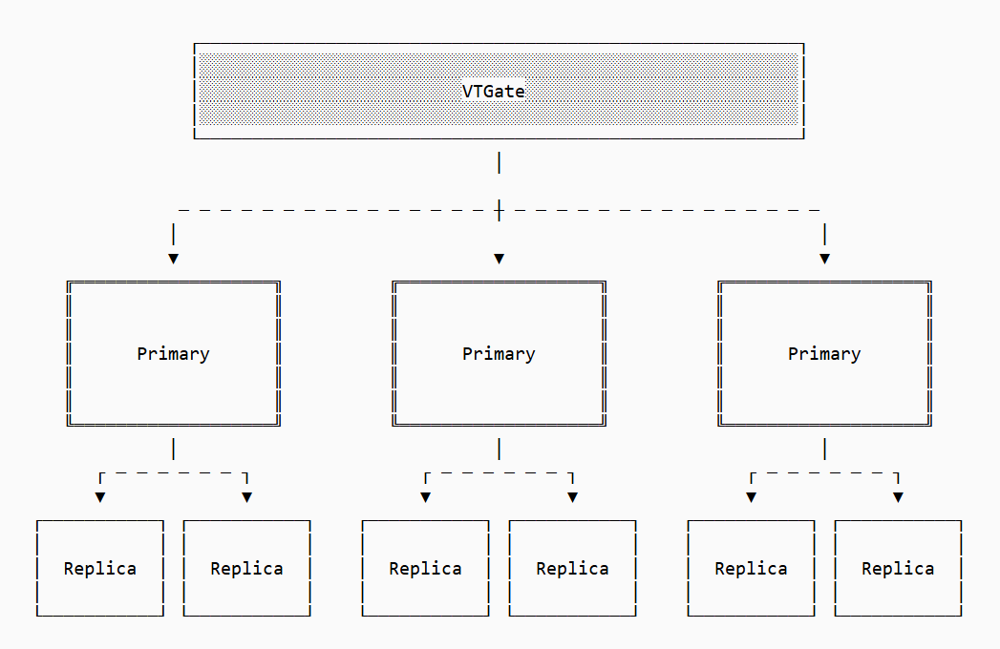

Sponsor by https://planetscale.com/

# PlanetScale: Nền tảng cơ sở dữ liệu đám mây nhanh nhất và có khả năng mở rộng cao nhất

PlanetScale cung cấp các cơ sở dữ liệu đám mây với hiệu suất vượt trội, tốc độ cao và độ tin cậy tuyệt đối. Với sự kết hợp của Postgres và Vitess, PlanetScale giải quyết các thách thức về hiệu suất, khả năng mở rộng và quản lý cơ sở dữ liệu cho mọi quy mô ứng dụng.

## 🚀 Giới thiệu chung

PlanetScale là nền tảng cơ sở dữ liệu đám mây được xây dựng bởi các chuyên gia đứng sau hạ tầng của YouTube, GitHub, Facebook, Twitter, Slack, v.v. Nó được thiết kế để cung cấp:

*   **Tốc độ:** Tận dụng ổ NVMe cực nhanh, mang lại IOPS không giới hạn và độ trễ thấp chưa từng có.
*   **Khả năng mở rộng:** Đặc biệt với Vitess, cho phép mở rộng ngang (horizontal sharding) cho MySQL lên hàng nghìn node và hàng petabyte dữ liệu.
*   **Độ tin cậy:** Đảm bảo uptime cao và khả năng vận hành database online hoàn toàn.
*   **Quản lý dễ dàng:** Cung cấp các tính năng quản lý cơ sở dữ liệu toàn diện, giảm thiểu lỗi do con người và cung cấp thông tin chi tiết về hiệu suất truy vấn.

## ✨ Các dịch vụ chính

PlanetScale hiện hỗ trợ hai loại cơ sở dữ liệu chính:

### 1. Vitess (Dành cho MySQL ở quy mô lớn)

Vitess là một hệ thống proxy cơ sở dữ liệu cho phép các cơ sở dữ liệu MySQL mở rộng theo chiều ngang thông qua kỹ thuật "sharding" tường minh. Nó tạo ra một kiến trúc "shared nothing" phân phối dữ liệu trên hàng nghìn node, tất cả được định tuyến qua một kết nối cơ sở dữ liệu duy nhất.

*   **Nguồn gốc:** Được phát triển tại YouTube bởi những người sáng lập PlanetScale để mở rộng cơ sở dữ liệu MySQL chính của họ lên hàng petabyte dữ liệu trên 70.000 node, trên 20 trung tâm dữ liệu.
*   **Hiện tại:** Được PlanetScale duy trì và quản lý, Vitess đang cung cấp sức mạnh cho các cơ sở dữ liệu của nhiều "ông lớn" trên web như Slack, HubSpot, Blizzard, Etsy, GitHub, Block, Bloomberg, Yelp, v.v.

### 2. Postgres (Mới ra mắt!)

PlanetScale hiện đã mang khả năng và hiệu suất vượt trội của mình đến với Postgres. Đây là một cơ sở dữ liệu đám mây mạnh mẽ, nhanh chóng và đáng tin cậy dành cho những ai yêu thích Postgres.

*   **Trạng thái:** Đang trong giai đoạn "Early Access" (truy cập sớm).

## 📊 Kiến trúc Vitess (Minh họa)


**Giải thích sơ đồ:**

*   **VTGate:** Là một proxy trung gian, xử lý tất cả các yêu cầu truy vấn đến cơ sở dữ liệu. Nó đóng vai trò như một điểm truy cập duy nhất, ẩn đi sự phức tạp của kiến trúc sharding bên dưới.
*   **Primary (Master):** Các node cơ sở dữ liệu chính, nơi dữ liệu được ghi. Mỗi Primary đại diện cho một phần (shard) của dữ liệu tổng thể.
*   **Replica (Slave):** Các bản sao (read-only) của các Primary node tương ứng, được dùng để phục vụ các yêu cầu đọc, tăng cường khả năng chịu tải và độ bền dữ liệu.
*   **Mũi tên và đường đứt nét:** Thể hiện luồng dữ liệu và kết nối, cho thấy VTGate phân phối các yêu cầu đến các shard Primary phù hợp, và mỗi Primary có các Replica riêng. Kiến trúc này cho phép mở rộng quy mô bằng cách thêm nhiều shard (Primary + Replica) khi cần.

## 🌟 Tại sao chọn PlanetScale?

### 1. Hiệu suất vượt trội (PlanetScale Metal)

*   Sử dụng ổ NVMe cực nhanh, mang lại **IOPS (Input/Output Operations Per Second) không giới hạn** và giảm đáng kể độ trễ.
*   Vượt trội hơn các nhà cung cấp đám mây khác như Amazon Aurora và GCP Cloud SQL về hiệu suất.
*   Biểu đồ cho thấy p95 (percentile 95) giảm từ 45ms xuống còn 5-10ms sau khi di chuyển database sang Metal.

### 2. Uptime và độ tin cậy cao

*   **SLA (Service Level Agreement) 99.999%** cho triển khai đa khu vực và **99.99%** cho triển khai một khu vực.
*   Kiến trúc vượt trội và tất cả các hoạt động cơ sở dữ liệu đều được thực hiện **online**:
    *   Triển khai thay đổi schema hoàn toàn online.
    *   Thay đổi schema có thể hoàn tác (revertable) mà **không mất dữ liệu**.
    *   Chuyển hướng traffic đến các bản sao chỉ đọc mới.
    *   Cập nhật phiên bản MySQL và Vitess online.
    *   Thay đổi kích thước và resharding cluster online.

### 3. Chi phí hiệu quả

*   Thường ít tốn kém hơn RDS MySQL và Aurora cho khoảng 85% các workload.
*   Cung cấp tỷ lệ giá/hiệu suất tốt nhất trong số các dịch vụ cơ sở dữ liệu.
*   Các tùy chọn tiết kiệm chi phí với PlanetScale Managed (BYOC - Bring Your Own Cloud) và giảm giá theo cam kết.
*   Có thể mua qua AWS Marketplace hoặc GCP Marketplace.

### 4. Bảo mật cấp độ doanh nghiệp

*   Tuân thủ các tiêu chuẩn bảo mật, tuân thủ và quyền riêng tư cao nhất:
    *   SOC 1 Type 2 & SOC 2 Type 2+
    *   Tuân thủ HIPAA
    *   Tuân thủ PCI DSS 4.0 (Level 1 Service Provider)
*   Cung cấp các thỏa thuận HIPAA Business Associate (BAA) trên tất cả các gói.

### 5. Các tính năng dành cho nhà phát triển

PlanetScale cung cấp một nền tảng quản lý cơ sở dữ liệu đầu cuối, ngăn chặn lỗi do con người và cung cấp cái nhìn sâu sắc về hiệu suất truy vấn:

*   **Branching và Deploy Requests:** Cho phép thay đổi schema mà không downtime và có thể được team xem xét, phê duyệt.
*   **Hỗ trợ Vector:** Lưu trữ dữ liệu vector cùng với dữ liệu MySQL quan hệ.
*   **Rollback thay đổi schema:** Hoàn tác các thay đổi schema xấu mà không downtime và không mất dữ liệu.
*   **Database Observability (Insights):** Cung cấp cái nhìn tổng quan chi tiết về tình trạng cluster.
*   **Tự động mở rộng ngang:** Tự động hóa các quy trình sharding tường minh.
*   **Global Edge Network:** Tự động định tuyến lưu lượng truy vấn đến các node cục bộ.
*   **Tích hợp:** Với Fivetran, Airbyte, Hightouch, Datadog, Vantage, Debezium, v.v.
*   **Hỗ trợ chuyên nghiệp:** Đội ngũ chuyên gia dày dặn kinh nghiệm trong lĩnh vực cơ sở dữ liệu.


```