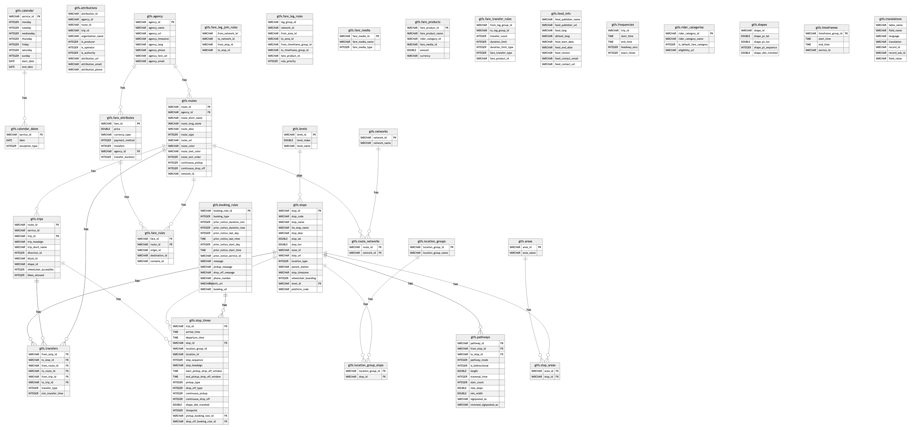

---

# 1  Xử lý dữ liệu GTFS với DuckDB

Sponsor by https://tobilg.com/handling-gtfs-data-with-duckdb?ref=dailydev

Hướng dẫn này trình bày cách sử dụng DuckDB để lưu trữ, quản lý và truy vấn dữ liệu GTFS (General Transit Feed Specification) tĩnh.

## Mục lục
- [Giới thiệu về GTFS](#giới-thiệu-về-gtfs)
- [Tạo cơ sở dữ liệu DuckDB cho dữ liệu GTFS Schedule](#tạo-cơ-sở-dữ-liệu-duckdb-cho-dữ-liệu-gtfs-schedule)
- [Tạo cơ sở dữ liệu GTFS DuckDB từ một bộ dữ liệu ví dụ](#tạo-cơ-sở-dữ-liệu-gtfs-duckdb-từ-một-bộ-dữ-liệu-ví-dụ)
    - [Chuẩn bị](#chuẩn-bị)
    - [Tải xuống bộ dữ liệu](#tải-xuống-bộ-dữ-liệu)
    - [Tải bộ dữ liệu vào cơ sở dữ liệu GTFS mới](#tải-bộ-dữ-liệu-vào-cơ-sở-dữ-liệu-gtfs-mới)
- [Truy vấn cơ sở dữ liệu GTFS mới](#truy-vấn-cơ-sở-dữ-liệu-gtfs-mới)
- [Xuất dữ liệu sang định dạng Parquet](#xuất-dữ-liệu-sang-định-dạng-parquet)
- [Tóm tắt](#tóm-tắt)

## Giới thiệu về GTFS

GTFS (General Transit Feed Specification) là một định dạng dữ liệu mở, chuẩn hóa cho lịch trình và thông tin địa lý của giao thông công cộng. Thực tế, một nguồn cấp dữ liệu GTFS chỉ đơn giản là một kho lưu trữ ZIP chứa các bảng văn bản (CSV) – như `stops.txt`, `routes.txt`, và `trips.txt` – cùng nhau mô tả các tuyến đường, điểm dừng, lịch trình và quy tắc giá vé của một cơ quan vận tải.

Bằng cách tuân theo lược đồ chung này, các cơ quan vận tải có thể xuất bản dữ liệu của họ để bất kỳ ứng dụng tương thích GTFS nào (công cụ lập kế hoạch chuyến đi, công cụ bản đồ hoặc quy trình phân tích) đều có thể sử dụng dễ dàng. Vì GTFS là một tiêu chuẩn mở, nó đã trở thành định dạng phổ biến cho hàng ngàn cơ quan vận tải trên toàn thế giới.

Việc áp dụng rộng rãi này có nghĩa là các nhà phát triển có thể tích hợp nhiều nguồn cấp dữ liệu vào một quy trình duy nhất mà không cần viết các bộ phân tích tùy chỉnh. Ví dụ, nhiều ứng dụng lập kế hoạch hành trình và dịch vụ bản đồ dựa vào các nguồn cấp dữ liệu GTFS để cung cấp thông tin tuyến đường và lịch trình cho người dùng.

Thông số kỹ thuật thậm chí còn tách biệt dữ liệu tĩnh và động: phần Schedule (Lịch trình) cung cấp thời gian biểu đã định (dưới dạng CSV), trong khi tiện ích mở rộng Realtime (sử dụng Protocol Buffers) bổ sung cập nhật chuyến đi trực tiếp, vị trí phương tiện và cảnh báo dịch vụ.

Những lợi ích chính của GTFS là:

*   **Định nghĩa lược đồ nhất quán:** Người dùng/nhà phát triển chỉ cần học một định dạng cho tất cả các cơ quan.
*   **Khả năng tương tác:** Bất kỳ công cụ tuân thủ GTFS nào cũng có thể đọc nguồn cấp dữ liệu từ bất kỳ nhà cung cấp vận tải nào, cho phép tích hợp liền mạch giữa các nền tảng và hệ thống khác nhau.
*   **Văn bản thuần túy và mở:** Định dạng này dựa trên các tệp CSV đơn giản, dễ tạo, nhập (ví dụ qua SQL hoặc pandas) và bảo trì mà không cần phần mềm độc quyền.
*   **Tĩnh + thời gian thực:** GTFS phân biệt lịch trình cố định với các cập nhật trực tiếp. Các tệp GTFS-Schedule tĩnh bao gồm các tuyến đường và thời gian biểu, trong khi GTFS-Realtime (Protocol Buffers) cung cấp cập nhật chuyến đi, vị trí phương tiện và cảnh báo theo thời gian thực.
*   **Hệ sinh thái và công cụ:** Một cộng đồng lớn hỗ trợ GTFS với tài liệu mở và nhiều thư viện/công cụ xác thực (ví dụ: GTFS-kit trong Python), giúp nhà phát triển tận dụng các công cụ hiện có thay vì xây dựng các bộ phân tích tùy chỉnh.

## Tạo cơ sở dữ liệu DuckDB cho dữ liệu GTFS Schedule

Vì tiêu chuẩn GTFS Schedule sử dụng các tệp CSV được nén ZIP, nên không thể trực tiếp phân tích các bộ dữ liệu này bằng hầu hết các công cụ.

Ngoài ra, nhiều bộ dữ liệu GTFS không xuất bản tất cả các tệp dữ liệu, vì một số tệp dữ liệu là tùy chọn, và không phải tất cả các trường trong mỗi tệp đó đều được yêu cầu. Dưới đây là một số tệp chính:

| Tên tệp               | Tồn tại           | Mô tả                                                                                                        |
| :-------------------- | :---------------- | :----------------------------------------------------------------------------------------------------------- |
| `agency.txt`          | Bắt buộc          | Các cơ quan vận tải có dịch vụ được thể hiện trong bộ dữ liệu này.                                              |
| `stops.txt`           | Bắt buộc có điều kiện | Các điểm dừng nơi phương tiện đón hoặc trả hành khách. Cũng định nghĩa các nhà ga và lối vào nhà ga.             |
| `routes.txt`          | Bắt buộc          | Các tuyến đường vận tải. Một tuyến đường là một nhóm các chuyến đi được hiển thị cho hành khách như một dịch vụ duy nhất. |
| `trips.txt`           | Bắt buộc          | Các chuyến đi cho mỗi tuyến đường. Một chuyến đi là một chuỗi gồm hai hoặc nhiều điểm dừng xảy ra trong một khoảng thời gian cụ thể. |
| `stop_times.txt`      | Bắt buộc          | Thời gian phương tiện đến và khởi hành từ các điểm dừng cho mỗi chuyến đi.                                 |
| `calendar.txt`        | Bắt buộc có điều kiện | Các ngày dịch vụ được chỉ định bằng lịch trình hàng tuần với ngày bắt đầu và kết thúc.                        |
| `calendar_dates.txt`  | Bắt buộc có điều kiện | Các ngoại lệ cho các dịch vụ được định nghĩa trong `calendar.txt`.                                          |
| `fare_attributes.txt` | Tùy chọn          | Thông tin giá vé cho các tuyến đường của một cơ quan vận tải.                                              |
| `fare_rules.txt`      | Tùy chọn          | Các quy tắc áp dụng giá vé cho các hành trình.                                                               |
| ...                   | ...               | *(Xem tài liệu chính thức của GTFS để biết danh sách đầy đủ)*                                             |

Xét những điều đó, kế hoạch để có thể sử dụng các bộ dữ liệu GTFS Schedule với DuckDB là: Tạo một cơ sở dữ liệu DuckDB chứa tất cả các bảng với tất cả các cột. DDL cho các bảng sẽ được xây dựng dựa trên trang web tiêu chuẩn chính thức. Chúng ta muốn sử dụng các mối quan hệ khóa ngoại được nêu trong tiêu chuẩn, và do đó cần đảm bảo rằng các bảng được tạo theo đúng thứ tự.

Tập lệnh tạo cơ sở dữ liệu có thể được tìm thấy tại `queries/create_gtfs_database.sql` trong kho lưu trữ đi kèm.

Điều này tạo ra một cơ sở dữ liệu có Sơ đồ Quan hệ Thực thể (ERD) như sau:


*(Hình ảnh ERD minh họa cấu trúc mối quan hệ giữa các bảng GTFS)*

## Tạo cơ sở dữ liệu GTFS DuckDB từ một bộ dữ liệu ví dụ

Để tải một số bộ dữ liệu mẫu, chúng ta cần chọn một trong nhiều nguồn dữ liệu có sẵn. Đối với dữ liệu của Đức, trang web [gtfs.de](https://gtfs.de/) cung cấp một số bộ dữ liệu thú vị.

Có một bộ dữ liệu chứa toàn bộ giao thông tàu hỏa và địa phương cho Đức: `de_full`, và đó là bộ dữ liệu chúng ta sẽ sử dụng. Nó chứa 1.6 triệu chuyến đi, 663 nghìn điểm dừng và hơn 32 triệu thời gian dừng.

Kho lưu trữ GitHub đi kèm [tobilg/duckdb-gtfs](https://github.com/tobilg/duckdb-gtfs) có sẵn các tập lệnh cần thiết. Bạn sẽ cần cài đặt DuckDB CLI cục bộ để có thể thực hiện các bước tiếp theo trên máy của mình.

### Chuẩn bị

Bạn cần clone kho lưu trữ từ GitHub trước:

```bash
git clone git@github.com:tobilg/duckdb-gtfs.git && cd duckdb-gtfs
```
(Nhấp vào biểu tượng sao chép để sao chép lệnh)

### Tải xuống bộ dữ liệu

Để tải xuống bộ dữ liệu ví dụ (218MB nén, khoảng 1.4GB khi giải nén), bạn có thể chạy tập lệnh tải xuống:

```bash
scripts/providers/gtfs-de/full/download_data.sh
```
(Nhấp vào biểu tượng sao chép để sao chép lệnh)

### Tải bộ dữ liệu vào cơ sở dữ liệu GTFS mới

Như đã nêu ở trên, không phải tất cả các nhà cung cấp bộ dữ liệu đều sử dụng đầy đủ các bảng trong bộ dữ liệu của họ, vì vậy chúng ta sẽ phải viết một tập lệnh tạo cơ sở dữ liệu tùy chỉnh cho mỗi nhà cung cấp. Trong trường hợp của chúng ta, SQL cho bộ dữ liệu ví dụ trông như thế này (xem `load_data.sql` trong kho lưu trữ):

```sql
INSERT INTO agency (agency_id,agency_name,agency_url,agency_timezone,agency_lang) 
SELECT * FROM read_csv('source-data/providers/gtfs-de/full/agency.txt', delim = ',', header = true);

INSERT INTO attributions (attribution_id,organization_name,is_producer,attribution_url,attribution_email) 
SELECT * FROM read_csv('source-data/providers/gtfs-de/full/attributions.txt', delim = ',', header = true);

INSERT INTO calendar (monday,tuesday,wednesday,thursday,friday,saturday,sunday,start_date,end_date,service_id) 
SELECT * FROM read_csv('source-data/providers/gtfs-de/full/calendar.txt', delim = ',', header = true, dateformat = '%Y%m%d');

INSERT INTO calendar_dates (service_id,exception_type,"date") 
SELECT * FROM read_csv('source-data/providers/gtfs-de/full/calendar_dates.txt', delim = ',', header = true, columns = {
  'service_id': 'VARCHAR',
  'exception_type': 'INTEGER',
  'date': 'DATE'
}, dateformat = '%Y%m%d', ignore_errors = true);

INSERT INTO feed_info (feed_publisher_name,feed_publisher_url,feed_lang,feed_version,feed_contact_email,feed_contact_url) 
SELECT * FROM read_csv('source-data/providers/gtfs-de/full/feed_info.txt', delim = ',', header = true, dateformat = '%Y%m%d');

INSERT INTO routes (route_long_name,route_short_name,agency_id,route_type,route_id) 
SELECT * FROM read_csv('source-data/providers/gtfs-de/full/routes.txt', delim = ',', header = true);

INSERT INTO trips (route_id,service_id,trip_id) 
SELECT * FROM read_csv('source-data/providers/gtfs-de/full/trips.txt', delim = ',', header = true, ignore_errors = true);

INSERT INTO stops (stop_name,parent_station,stop_id,stop_lat,stop_lon,location_type) 
SELECT * FROM read_csv('source-data/providers/gtfs-de/full/stops.txt', delim = ',', header = true);

INSERT INTO stop_times (trip_id,arrival_time,departure_time,stop_id,stop_sequence,pickup_type,drop_off_type) 
SELECT * FROM read_csv('source-data/providers/gtfs-de/full/stop_times.txt', delim = ',', header = true, ignore_errors = true);
```
(Nhấp vào biểu tượng sao chép để sao chép mã)

Bây giờ, hãy chạy tập lệnh tạo cơ sở dữ liệu (việc này sẽ mất một chút thời gian tùy thuộc vào máy của bạn):

```bash
scripts/providers/gtfs-de/full/create_database.sh
```
(Nhấp vào biểu tượng sao chép để sao chép lệnh)

Tệp cơ sở dữ liệu DuckDB kết quả có thể được tìm thấy tại `exported-data/providers/gtfs-de/full/data.duckdb`.

## Truy vấn cơ sở dữ liệu GTFS mới

Để truy vấn cơ sở dữ liệu GTFS mới, bạn chỉ cần sử dụng tệp cơ sở dữ liệu vừa tạo với DuckDB CLI cục bộ của mình:

```bash
duckdb exported-data/providers/gtfs-de/full/data.duckdb
```
(Nhấp vào biểu tượng sao chép để sao chép lệnh)

Sau khi CLI khởi động, bạn có thể chạy các lệnh sau:

```sql
v1.2.2 7c039464e4
Enter ".help" for usage hints.
D show tables;
┌──────────────────────┐
│         name         │
│       varchar        │
├──────────────────────┤
│ agency               │
│ areas                │
│ attributions         │
│ booking_rules        │
│ calendar             │
│ calendar_dates       │
│ fare_attributes      │
│ fare_leg_join_rules  │
│ fare_leg_rules       │
│ fare_media           │
│ fare_products        │
│ fare_rules           │
│ fare_transfer_rules  │
│ feed_info            │
│ frequencies          │
│ levels               │
│ location_group_stops │
│ location_groups      │
│ networks             │
│ pathways             │
│ rider_categories     │
│ route_networks       │
│ routes               │
│ shapes               │
│ stop_areas           │
│ stop_times           │
│ stops                │
│ timeframes           │
│ transfers            │
│ translations         │
│ trips                │
├──────────────────────┤
│       31 rows        │
└──────────────────────┘
D SELECT count(*) FROM stop_times;
┌─────────────────┐
│  count_star()   │
│      int64      │
├─────────────────┤
│    32228711     │
│ (32.23 million) │
└─────────────────┘
D SELECT count(*) FROM stops;
┌──────────────┐
│ count_star() │
│    int64     │
├──────────────┤
│    678388    │
└──────────────┘
D SELECT count(*) FROM trips;
┌────────────────┐
│  count_star()  │
│     int64      │
├────────────────┤
│    1630671     │
│ (1.63 million) │
└────────────────┘
```
(Nhấp vào biểu tượng sao chép để sao chép mã)

## Xuất dữ liệu sang định dạng Parquet

Nếu bạn muốn xuất dữ liệu sang định dạng tối ưu hóa như Parquet, việc này rất đơn giản với DuckDB (như được minh họa bằng tập lệnh `export_data.sh`):

```bash
duckdb exported-data/providers/gtfs-de/full/data.duckdb -c "EXPORT DATABASE 'exported-data/providers/gtfs-de/full' (FORMAT parquet);"
```
(Nhấp vào biểu tượng sao chép để sao chép lệnh)

Thao tác này sẽ xuất mỗi bảng dưới dạng tệp Parquet vào thư mục `exported-data/providers/gtfs-de/full/`. Chúng ta đã có thể thu nhỏ dữ liệu 1.4GB (khi giải nén) xuống còn 118MB dưới dạng các tệp Parquet đã nén.

## Tóm tắt

Sử dụng DuckDB để lưu trữ và phân tích dữ liệu GTFS Schedule có vẻ là một lựa chọn tuyệt vời. Ví dụ, trình đọc CSV của DuckDB có thể xử lý nhiều kịch bản lỗi khác nhau, điều khá phổ biến với các nhà cung cấp dữ liệu.

Chúng ta đã tạo thành công một cơ sở dữ liệu GTFS Schedule mặc định, có thể được tải bằng dữ liệu từ các nhà cung cấp khác nhau với các tập lệnh tải tùy chỉnh. Những tập lệnh này yêu cầu nỗ lực cụ thể để tạo, nhưng kết quả là một lược đồ cơ sở dữ liệu được chuẩn hóa, nó có thể tạo ra giá trị cho các tổ chức định hướng dữ liệu.

Khả năng xuất dữ liệu sang các định dạng tối ưu hóa lưu trữ một cách sẵn có cũng là một lợi ích lớn của DuckDB.

---