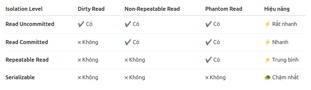
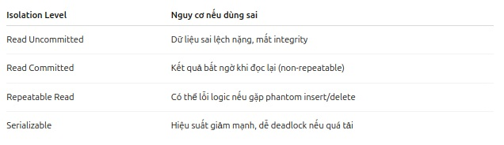
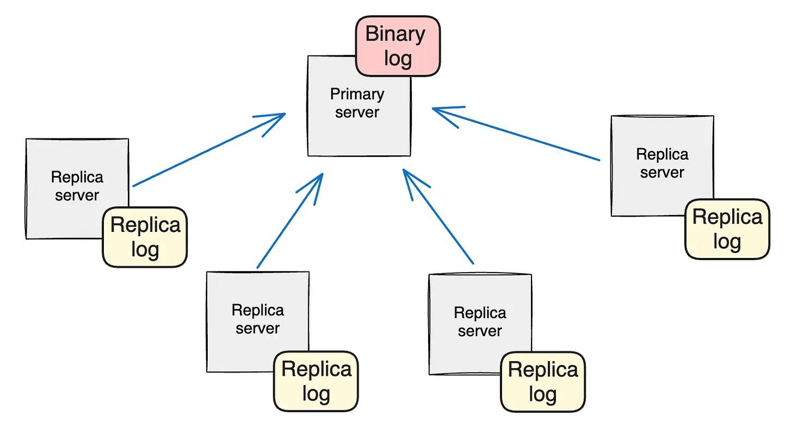

#  1 So Sánh Các Mức Isolation trong Giao Dịch Database

Khi làm việc với giao dịch trong cơ sở dữ liệu, **Isolation Level** xác định mức độ mà các giao dịch có thể nhìn thấy sự thay đổi của nhau. Dưới đây là sự so sánh giữa các mức độ isolation phổ biến, cùng với ứng dụng thực tế và hậu quả khi chọn sai mức độ.

---

## Các Mức Isolation trong Giao Dịch

### 1. **Read Uncommitted**

- **Định nghĩa**: Mọi thứ đều được đọc, kể cả dữ liệu chưa commit (chưa xác nhận).
- **Hậu quả**:
  - **Dirty Read**: Bạn có thể đọc được dữ liệu mà giao dịch khác chưa commit, và nếu giao dịch đó rollback, dữ liệu bạn đã đọc là sai.
- **Ứng dụng**: 
  - **Hiếm khi dùng**. Thường chỉ dùng cho các thống kê không quan trọng hoặc các tình huống không cần tính chính xác cao.
  - **Rất nhanh**, nhưng rất nguy hiểm vì dữ liệu dễ bị sai lệch.
  
---

### 2. **Read Committed** (Mặc định trong SQL Server, PostgreSQL)

- **Định nghĩa**: Chỉ đọc được dữ liệu đã commit.
- **Hậu quả**:
  - **Non-Repeatable Read**: Nếu bạn đọc cùng một bản ghi hai lần trong cùng một giao dịch, dữ liệu có thể thay đổi bởi giao dịch khác.
- **Ứng dụng**: 
  - **Phổ biến nhất** trong các hệ thống OLTP (giao dịch nhanh).
  - Thường được sử dụng trong các tình huống giao dịch cơ bản mà không yêu cầu mức độ cô lập cao.
  
---

### 3. **Repeatable Read** (Mặc định trong MySQL InnoDB)

- **Định nghĩa**: Đảm bảo rằng mỗi lần đọc cùng một bản ghi, dữ liệu sẽ không bị thay đổi (dữ liệu là ổn định).
- **Hậu quả**:
  - **Phantom Read**: Có thể gặp phải hiện tượng khi bạn query cùng điều kiện nhưng số lượng bản ghi khác nhau, vì giao dịch khác đã thêm/xóa bản ghi.
- **Ứng dụng**: 
  - Dành cho các nghiệp vụ cần đảm bảo tính ổn định của dữ liệu trong suốt quá trình giao dịch.
  - Ví dụ: hệ thống quản lý kho, tài chính.

---

### 4. **Serializable**

- **Định nghĩa**: Giao dịch phải hoạt động như thể chúng chạy tuần tự (một giao dịch hoàn thành xong mới đến giao dịch tiếp theo).
- **Hậu quả**: 
  - **Không có Dirty Read, Non-Repeatable Read, Phantom Read**.
  - Chậm nhất vì phải **lock** nhiều tài nguyên.
- **Ứng dụng**:
  - **Cần độ chính xác tuyệt đối** như trong các hệ thống ngân hàng, kiểm toán, và các ứng dụng yêu cầu tính toàn vẹn dữ liệu cao.

---

## Các Loại Lỗi trong Giao Dịch

- **Dirty Read**: Đọc dữ liệu chưa commit từ một giao dịch khác. Nếu giao dịch đó rollback, dữ liệu bạn đã đọc là sai.
- **Non-Repeatable Read**: Khi bạn đọc lại cùng một bản ghi trong cùng một giao dịch nhưng giá trị dữ liệu đã thay đổi do giao dịch khác commit.
- **Phantom Read**: Khi bạn thực hiện query hai lần cùng điều kiện, nhưng số lượng bản ghi trả về khác nhau vì giao dịch khác đã thay đổi (thêm/xóa) dữ liệu.

---

## Hậu Quả Khi Chọn Sai Isolation Level

- **Chọn sai mức độ isolation** có thể dẫn đến các lỗi nghiêm trọng trong ứng dụng như:
  - **Dữ liệu không chính xác**: Ví dụ, bạn có thể đọc dữ liệu sai hoặc không đồng bộ trong các giao dịch.
  - **Hiệu năng bị ảnh hưởng**: Một số mức độ isolation như `Serializable` có thể gây tắc nghẽn tài nguyên và giảm hiệu suất hệ thống.
  - **Khả năng cạnh tranh dữ liệu (Data Conflicts)**: Lỗi khi nhiều giao dịch cùng thao tác trên dữ liệu mà không có sự kiểm soát chính xác.

---

## Kết luận

- **Read Uncommitted**: Thường không được sử dụng trong các ứng dụng thực tế vì nguy cơ dữ liệu sai rất cao.
- **Read Committed**: Dùng cho các hệ thống OLTP nhanh, nhưng có thể gặp phải non-repeatable read.
- **Repeatable Read**: Phù hợp với các nghiệp vụ yêu cầu tính ổn định giữa các lần đọc, nhưng vẫn có thể gặp phải phantom read.
- **Serializable**: Dùng cho các tình huống cần độ chính xác tuyệt đối, nhưng có thể làm chậm hệ thống.

Lựa chọn mức độ isolation phù hợp là rất quan trọng để đảm bảo cả hiệu năng và tính chính xác của hệ thống.

# 2 So Sánh Nhân Bản Dữ Liệu: MySQL vs PostgreSQL

Tài liệu này cung cấp cái nhìn tổng quan và so sánh về cơ chế nhân bản (replication) dữ liệu giữa hai hệ quản trị cơ sở dữ liệu quan hệ phổ biến: MySQL và PostgreSQL.

## Nhân Bản Dữ Liệu Là Gì?

Nhân bản dữ liệu là quá trình sao chép và duy trì các đối tượng cơ sở dữ liệu (như bảng) trên nhiều máy chủ cơ sở dữ liệu khác nhau. Nó là một thành phần quan trọng để xây dựng các hệ thống có khả năng chịu lỗi và hiệu suất cao.

**Lợi ích chính của nhân bản dữ liệu:**

*   **Cải thiện hiệu suất đọc:** Phân tán các truy vấn đọc (read queries) trên nhiều máy chủ bản sao (replicas), giảm tải cho máy chủ chính (primary) và tăng tốc độ phản hồi.
*   **Dự phòng dữ liệu (Data Redundancy):** Tạo các bản sao dữ liệu trên các nút khác nhau, đảm bảo an toàn dữ liệu ngay cả khi một nút gặp sự cố.
*   **Độ sẵn sàng cao (High Availability):** Nếu máy chủ chính bị lỗi, một máy chủ bản sao có thể được nâng cấp thành máy chủ chính (failover), giảm thiểu thời gian ngừng hoạt động của hệ thống.

## Nhân Bản Trong MySQL

MySQL sử dụng cơ chế dựa trên **nhật ký nhị phân (binary log - binlog)** để thực hiện nhân bản. Quá trình này bao gồm các thành phần chính:

1.  **Luồng Ghi Nhật Ký Nhị Phân (Binary Log Dump Thread) - Trên Primary:**
    *   Máy chủ chính (Primary/Master) ghi lại tất cả các thay đổi dữ liệu (INSERT, UPDATE, DELETE, thay đổi cấu trúc bảng) vào một tệp gọi là **Binary Log**.
    *   Binlog chứa các sự kiện mô tả những thay đổi này theo thứ tự chúng xảy ra.
    *   Đây là nguồn dữ liệu gốc cho quá trình nhân bản.

2.  **Luồng Nhận I/O Của Bản Sao (Replica I/O Receiver Thread) - Trên Replica:**
    *   Khi nhân bản được bắt đầu (`START REPLICA`), máy chủ bản sao (Replica/Slave) tạo một luồng I/O.
    *   Luồng này kết nối đến máy chủ chính và yêu cầu gửi các sự kiện từ binlog của nó.
    *   Máy chủ chính sử dụng "Binary Log Dump Thread" để gửi nội dung binlog.
    *   Luồng I/O trên bản sao nhận các sự kiện này và ghi chúng vào một tệp cục bộ gọi là **Nhật ký chuyển tiếp (Relay Log)**.

3.  **Luồng Áp Dụng SQL Của Bản Sao (Replica SQL Applier Thread) - Trên Replica:**
    *   Một luồng SQL khác trên máy chủ bản sao đọc các sự kiện từ Relay Log.
    *   Nó thực thi các sự kiện này theo đúng thứ tự đã xảy ra trên máy chủ chính, áp dụng các thay đổi tương ứng lên dữ liệu của bản sao.

### Định Dạng Nhật Ký Nhị Phân (Binary Log Formats)

MySQL cung cấp các định dạng binlog khác nhau:

*   **Statement-Based Replication (SBR):** Ghi lại chính xác các câu lệnh SQL (ví dụ: `UPDATE mytable SET col=1 WHERE id>10`) đã thực thi trên máy chủ chính.
    *   *Ưu điểm:* Binlog nhỏ gọn.
    *   *Nhược điểm:* Có thể không an toàn với các câu lệnh không xác định (non-deterministic), ví dụ: sử dụng `UUID()` hoặc trigger.
*   **Row-Based Replication (RBR - Mặc định):** Ghi lại sự thay đổi dữ liệu ở cấp độ hàng. Thay vì ghi câu lệnh SQL, nó ghi lại giá trị *trước* và *sau* của các hàng bị ảnh hưởng.
    *   *Ưu điểm:* An toàn và đáng tin cậy hơn cho mọi loại câu lệnh.
    *   *Nhược điểm:* Kích thước binlog có thể lớn hơn đáng kể, đặc biệt với các câu lệnh ảnh hưởng nhiều hàng.
*   **Mixed-Based Replication (MBR):** Kết hợp cả hai. MySQL tự động chọn SBR cho các câu lệnh an toàn và chuyển sang RBR cho các câu lệnh không an toàn.

## Nhân Bản Trong PostgreSQL

PostgreSQL cung cấp hai loại nhân bản chính, dựa trên cách dữ liệu thay đổi được truyền đi:

### 1. Nhân Bản Vật Lý (Physical Replication)

*   **Cơ chế:** Sao chép dữ liệu ở cấp độ byte hoặc khối đĩa (block-level). Nó truyền các bản ghi **Write-Ahead Log (WAL)** từ máy chủ chính đến các máy chủ bản sao. Bản sao áp dụng trực tiếp các thay đổi này lên tệp dữ liệu của nó.
*   **Đặc điểm:**
    *   Bản sao là một bản sao **chính xác** (block-for-block) của máy chủ chính tại một thời điểm nhất định.
    *   Tất cả cơ sở dữ liệu và bảng trên máy chủ chính đều được nhân bản. Không thể chọn lọc chỉ một phần.
    *   Nguyên tắc "tất cả hoặc không có gì".
    *   Bản sao thường ở chế độ chỉ đọc (read-only), hữu ích cho việc cân bằng tải đọc hoặc tạo bản sao dự phòng nóng (hot standby).
    *   Thường sử dụng **Nhân bản Dòng (Streaming Replication)**: Các bản ghi WAL được gửi liên tục từ chính sang bản sao ngay khi chúng được tạo ra, giúp giảm thiểu độ trễ dữ liệu (replication lag).

### 2. Nhân Bản Logic (Logical Replication)

*   **Cơ chế:** Thay vì gửi các thay đổi vật lý (byte), nhân bản logic giải mã các bản ghi WAL thành một định dạng logic (thường giống như các câu lệnh SQL hoặc các sự kiện thay đổi dữ liệu: INSERT, UPDATE, DELETE). Sau đó, nó gửi các thay đổi logic này đến bản sao.
*   **Đặc điểm:**
    *   **Linh hoạt hơn:** Cho phép kiểm soát chi tiết hơn về dữ liệu nào được nhân bản. Bạn có thể chọn nhân bản:
        *   Toàn bộ cơ sở dữ liệu.
        *   Chỉ một số bảng cụ thể.
        *   Thậm chí chỉ một số hàng hoặc cột thỏa mãn điều kiện nào đó (tùy thuộc vào phiên bản và công cụ).
    *   Máy chủ chính và bản sao không cần phải giống hệt nhau về mặt vật lý (ví dụ: có thể có các chỉ mục khác nhau).
    *   Bản sao có thể là một máy chủ PostgreSQL khác, hoặc thậm chí là một hệ thống khác có thể hiểu định dạng thay đổi logic.
    *   Hoạt động theo mô hình **Publisher - Subscriber**:
        *   **Publisher:** Máy chủ chính nơi các thay đổi bắt nguồn. Nó định nghĩa một `PUBLICATION` chỉ định những bảng nào sẽ được nhân bản.
        *   **Subscriber:** Máy chủ bản sao nhận các thay đổi. Nó định nghĩa một `SUBSCRIPTION` để kết nối đến Publisher và áp dụng các thay đổi từ một `PUBLICATION` cụ thể.

## So Sánh và Kết Luận

| Tính năng          | MySQL                                        | PostgreSQL                                        |
| :----------------- | :------------------------------------------- | :------------------------------------------------ |
| **Cơ chế chính**  | Dựa trên Binary Log (Binlog)                 | Dựa trên Write-Ahead Log (WAL)                    |
| **Loại nhân bản** | Statement-Based, Row-Based, Mixed            | Physical Replication, Logical Replication         |
| **Đơn vị nhân bản**| Sự kiện thay đổi (Câu lệnh hoặc Hàng)        | Thay đổi vật lý (WAL records) hoặc Logic (Events) |
| **Độ chi tiết**    | Toàn bộ server hoặc lọc theo DB/Table (tùy cấu hình binlog filter) | Physical: Toàn bộ server. Logical: Server, DB, Table (linh hoạt hơn) |
| **Độ chính xác**   | RBR đảm bảo độ chính xác dữ liệu cao. SBR có thể gặp vấn đề với non-deterministic queries. | Physical: Bản sao chính xác về mặt vật lý. Logical: Đồng bộ dữ liệu logic. |
| **Tính linh hoạt** | Chọn định dạng binlog (SBR/RBR/Mixed).       | Chọn loại nhân bản (Physical/Logical), kiểm soát chi tiết với Logical Replication. |
| **Use case chính** | Cân bằng tải đọc, HA, sao lưu.             | Cân bằng tải đọc, HA, sao lưu (Physical). Nâng cấp không downtime, chia sẻ dữ liệu có chọn lọc, tích hợp hệ thống (Logical). |

**Kết luận:**

*   Cả **MySQL** và **PostgreSQL** đều cung cấp các giải pháp nhân bản mạnh mẽ và đáng tin cậy.
*   **MySQL** tập trung vào các định dạng khác nhau của binlog (statement vs row), cho phép lựa chọn giữa hiệu quả ghi log và độ chính xác tuyệt đối.
*   **PostgreSQL** cung cấp sự phân biệt rõ ràng giữa nhân bản vật lý (tạo bản sao chính xác, đơn giản) và nhân bản logic (linh hoạt cao, cho phép chọn lọc dữ liệu và các kịch bản phức tạp hơn).
*   Lựa chọn giữa MySQL và PostgreSQL cho nhu cầu nhân bản phụ thuộc vào yêu cầu cụ thể của ứng dụng, bao gồm mức độ linh hoạt cần thiết, yêu cầu về hiệu suất, tính nhất quán và các trường hợp sử dụng cụ thể như nâng cấp phiên bản hoặc tích hợp dữ liệu.

---

*Nguồn tham khảo: [MySQL vs PostgreSQL Replication — How Data Replication Works](https://vivekbansal.substack.com/p/mysql-vs-postgresql-replication)*
