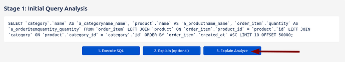
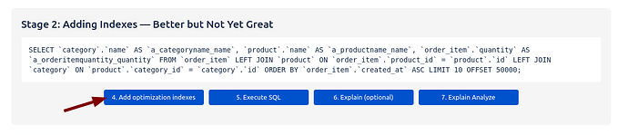
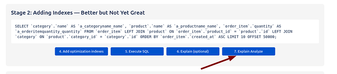
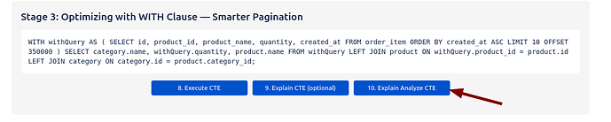
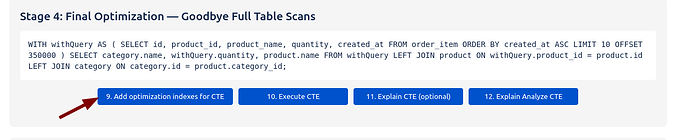
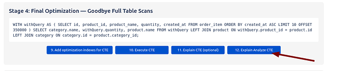

# 1 Tối ưu hóa Forge SQL trên Cơ sở dữ liệu 600K hàng với TiDB EXPLAIN

Bài viết này tóm tắt và dịch lại bài viết "[Optimizing Forge SQL on a 600K database with TiDB EXPLAIN](https://developer.atlassian.com/forge/blog/optimizing-forge-sql-with-explain/)" của Vasyl Zakharchenko, chia sẻ kinh nghiệm thực tế về việc tối ưu hóa hiệu suất truy vấn trong Forge SQL khi làm việc với các tập dữ liệu lớn, vượt qua các giới hạn về thời gian và bộ nhớ của nền tảng.

Forge SQL của Atlassian cung cấp một giải pháp SQL đa người thuê tiện lợi. Tuy nhiên, khi ứng dụng Forge của bạn phát triển và dữ liệu tăng lên hàng trăm nghìn hàng, việc hiểu và tối ưu hóa hiệu suất truy vấn là cực kỳ quan trọng để tránh vượt quá các giới hạn của nền tảng như thời gian thực thi 5 giây hoặc giới hạn bộ nhớ 16MB cho mỗi truy vấn.

Bài viết gốc đã khám phá vấn đề này thông qua thử nghiệm trên một cơ sở dữ liệu chứa hơn 600.000 hàng và chỉ ra cách sử dụng các công cụ `EXPLAIN` và `EXPLAIN ANALYZE` của TiDB để chẩn đoán và khắc phục các vấn đề hiệu suất.

## Công cụ đo lường hiệu suất: EXPLAIN & EXPLAIN ANALYZE

Để phân tích và cải thiện hiệu suất truy vấn trong Forge SQL, chúng ta sẽ sử dụng hai công cụ mạnh mẽ của TiDB:

1.  **`EXPLAIN`**: Cho phép bạn xem kế hoạch thực thi của truy vấn mà *không thực sự chạy nó*. Nó hiển thị trình tự các hoạt động, phương thức quét bảng (scan), chiến lược join, và cách sử dụng index. Hữu ích khi truy vấn gặp lỗi bộ nhớ.
2.  **`EXPLAIN ANALYZE`**: *Thực thi truy vấn* và cung cấp thông tin chi tiết về thời gian thực thi thực tế, lượng bộ nhớ tiêu thụ, hoạt động đĩa, và các metric runtime khác. Cực kỳ hữu ích để chẩn đoán chính xác các nút thắt cổ chai và xác minh hiệu quả của các tối ưu hóa.

*(Lưu ý: Bài viết này dựa trên ví dụ sử dụng Drizzle SQL ORM được thiết kế cho Atlassian Forge, bạn có thể xem mã nguồn tại [https://github.com/vzakharchenko/forge-sql-orm](https://github.com/vzakharchenko/forge-sql-orm)).*

## Thiết lập môi trường & Dữ liệu

Để tái hiện quy trình tối ưu hóa, bạn cần thiết lập một môi trường Forge với cơ sở dữ liệu mẫu.

**Cấu trúc bảng:**

```sql
CREATE TABLE IF NOT EXISTS category (
  id varbinary(16) DEFAULT NULL,
  name varchar(255) NOT NULL,
  created_at timestamp NOT NULL DEFAULT CURRENT_TIMESTAMP
) ENGINE=InnoDB DEFAULT CHARSET=utf8mb4 COLLATE=utf8mb4_bin;

CREATE TABLE IF NOT EXISTS product (
  id varbinary(16) DEFAULT NULL,
  name varchar(255) NOT NULL,
  category_id varbinary(16) NOT NULL,
  category_name varchar(255) NOT NULL,
  created_at timestamp NOT NULL DEFAULT CURRENT_TIMESTAMP
) ENGINE=InnoDB DEFAULT CHARSET=utf8mb4 COLLATE=utf8mb4_bin;

CREATE TABLE IF NOT EXISTS order_item (
  id varbinary(16) DEFAULT NULL,
  product_id varbinary(16) NOT NULL,
  product_name varchar(255) NOT NULL,
  quantity int NOT NULL,
  created_at timestamp NOT NULL DEFAULT CURRENT_TIMESTAMP
) ENGINE=InnoDB DEFAULT CHARSET=utf8mb4 COLLATE=utf8mb4_bin;
```

**Bước thiết lập:**

1.  Đăng ký, triển khai và cài đặt ứng dụng Forge:
    ```bash
    forge register
    forge deploy
    forge install
    ```
2.  Chạy migration schema và điền dữ liệu mẫu (chỉ cần chạy 1 lần):
    ```bash
    forge webtrigger -f runSchemaMigration
    ```
    Script này sẽ tạo bảng và điền dữ liệu:
    *   `category`: 1,100 hàng
    *   `product`: 200,000 hàng
    *   `order_item`: 400,000 hàng

    ⚠️ **Lưu ý:** Bước điền dữ liệu ban đầu có thể mất 10-15 phút. Chờ đến khi bạn thấy log xác nhận:
    `DATABASE INITIALIZED with orderItems=400000, products=200000, catalogs=1100`

## Truy vấn ban đầu (Có vấn đề về hiệu suất)

Đây là truy vấn phân trang điển hình mà chúng ta sẽ phân tích và tối ưu hóa. Truy vấn này tham gia (join) 3 bảng và phân trang ở `OFFSET 50000 LIMIT 10`.

```sql
SELECT
  `category`.`name` AS `a_categoryname_name`,
  `product`.`name` AS `a_productname_name`,
  `order_item`.`quantity` AS `a_orderitemquantity_quantity`
FROM `order_item`
LEFT JOIN `product` ON `order_item`.`product_id` = `product`.`id`
LEFT JOIN `category` ON `product`.`category_id` = `category`.`id`
ORDER BY `order_item`.`created_at` ASC
LIMIT 10 OFFSET 50000;
```

## Quy trình tối ưu hóa từng bước

Chúng ta sẽ đi qua 4 giai đoạn để phân tích và cải thiện truy vấn này.

### Giai đoạn 1: Chẩn đoán vấn đề ban đầu

Chạy truy vấn ban đầu với `EXPLAIN ANALYZE`.


**Kết quả `EXPLAIN ANALYZE` (tóm tắt):**

| Operator          | Actual Rows | Task        | Memory Usage | Disk Usage | Notes                           |
| :---------------- | :---------- | :---------- | :----------- | :--------- | :------------------------------ |
| TableFullScan_44  | 400,000     | cop[tikv]   | 3.83 MB      | N/A        | Full scan on order_item         |
| TableFullScan_46  | 200,000     | cop[tikv]   | 6.58 MB      | N/A        | Full scan on product            |
| TableFullScan_48  | 1,100       | cop[tikv]   | 37.5 KB      | N/A        | Full scan on category           |
| HashJoin_33       | 50,010      | root        | 5.08 MB      | 3.05 MB    | Joins product ← order_item      |
| HashJoin_23       | 50,010      | root        | 116.2 KB     | 54.8 KB    | Joins category ← product        |
| TopN_36           | 50,010      | root        | 6.58 MB      | 0 Bytes    | Sort & applies OFFSET           |
| TopN_18           | 10          | root        | 2.47 MB      | 0 Bytes    | Final LIMIT                     |

**Nhận định & Vấn đề:**

*   Thời gian thực thi: Hơn 750ms.
*   **Vấn đề chính:**
    *   Nhiều **`TableFullScan`** trên các bảng lớn (`order_item` 400K, `product` 200K).
    *   Sử dụng **`HashJoin`** đắt đỏ, tốn nhiều bộ nhớ.
    *   Hoạt động **`TopN`** cho sắp xếp và phân trang (OFFSET) tốn bộ nhớ đáng kể. Khi OFFSET tăng, bộ nhớ và thời gian tăng nhanh chóng, thậm chí gây tràn bộ nhớ tạm ra đĩa (`Disk Usage`).
*   **Kết luận:** Truy vấn không thể mở rộng. Dù chỉ lấy 10 hàng cuối cùng, database phải quét, sắp xếp và join hàng chục nghìn hàng trong bộ nhớ, nhanh chóng vượt quá giới hạn của Forge.

### Giai đoạn 2: Thêm Index để cải thiện

Để giải quyết các hoạt động `TableFullScan` và cải thiện JOIN/ORDER BY, chúng ta thêm các index sau:

```sql
await forgeSQLClient.executeDDL('CREATE INDEX IF NOT EXISTS idx_catalog_id ON category(id)');
await forgeSQLClient.executeDDL('CREATE INDEX IF NOT EXISTS idx_order_id ON order_item(id)');
await forgeSQLClient.executeDDL('CREATE INDEX IF NOT EXISTS idx_order_item_product_id ON order_item(product_id)');
await forgeSQLClient.executeDDL('CREATE INDEX IF NOT EXISTS idx_order_item_created_name_qty ON order_item (created_at ASC, product_id, quantity)');
```

Chạy lại truy vấn ban đầu với `EXPLAIN ANALYZE`.



**Kết quả `EXPLAIN ANALYZE` (tóm tắt):**

| Operator              | Actual Rows | Task      | Memory Usage | Disk Usage | Notes                                         |
| :-------------------- | :---------- | :-------- | :----------- | :--------- | :-------------------------------------------- |
| IndexFullScan_61      | 72,160      | cop[tikv] | N/A          | N/A        | Uses index (created_at, product_id, quantity) |
| HashJoin_45           | 50,010      | root      | 5.04 MB      | 0 Bytes    | order_item → product join                     |
| IndexHashJoin_75      | 50,010      | root      | 1.83 MB      | N/A        | product → category join via index             |
| TopN_83               | 50,010      | root      | 2.46 MB      | 0 Bytes    | Pagination (sort & offset) before final limit |
| Projection_15         | 10          | root      | 968 Bytes    | N/A        | Final projection                              |

**Nhận định & Vấn đề còn lại:**

*   Thời gian thực thi: Giảm đáng kể từ ~750ms xuống ~414ms.

*   Sử dụng **`IndexFullScan`** và **`IndexHashJoin`** hiệu quả hơn.
*   **Vấn đề còn lại:** Bộ nhớ vẫn cao (~5MB+). Khi tăng OFFSET lên 100,000, truy vấn gặp lỗi:
    `Your query has been cancelled due to exceeding the allowed memory limit for a single SQL query.`
*   **Lý do:** Mặc dù có index, database vẫn phải sắp xếp và xử lý hàng chục nghìn hàng trước khi áp dụng LIMIT, gây tốn bộ nhớ với OFFSET lớn.

### Giai đoạn 3: Viết lại truy vấn với CTE (Common Table Expression)

Để tránh chi phí bộ nhớ lớn do OFFSET gây ra, chúng ta sử dụng CTE (`WITH clause`) để lấy *trước* chỉ 10 hàng mong muốn (sau OFFSET) từ bảng `order_item` *rồi mới* join với các bảng khác.

**Truy vấn sử dụng CTE:**

```sql
WITH withQuery AS (
  SELECT id, product_id, product_name, quantity, created_at
  FROM order_item
  ORDER BY created_at ASC
  LIMIT 10 OFFSET 350000
)
SELECT category.name, withQuery.quantity, product.name
FROM withQuery
LEFT JOIN product ON withQuery.product_id = product.id
LEFT JOIN category ON category.id = product.category_id;
```
*(Ví dụ này dùng OFFSET lớn hơn (350000) để kiểm tra khả năng chịu tải).*

Chạy lại truy vấn với CTE sử dụng `EXPLAIN ANALYZE`.



**Kết quả `EXPLAIN ANALYZE` (tóm tắt):**


| Operator            | Actual Rows | Task      | Memory Usage | Disk Usage | Time    | Notes                                           |
| :------------------ | :---------- | :-------- | :----------- | :--------- | :------ | :---------------------------------------------- |
| TopN (CTE subquery) | 10          | root      | 15.7 MB      | 32.5 MB    | 426.7ms | Sorts & applies OFFSET/LIMIT on order_item      |
| TableFullScan (oi)  | 400,000     | cop[tikv] | 8.08 MB      | N/A        | 22.2ms  | Full table scan (trong CTE), nút thắt           |
| HashJoin            | 10          | root      | 1.26 KB      | 1.06 KB    | 441.8ms | Joins order_item (CTE result) → product         |
| TableFullScan (prod)| 200,000     | cop[tikv] | 6.58 MB      | N/A        | 13.6ms  | Full scan on product (trong JOIN), nút thắt     |
| IndexHashJoin       | 10          | root      | 1.89 KB      | N/A        | 442.1ms | Joins product → category via index              |
| Projection          | 10          | root      | 62.0 KB      | N/A        | 442.1ms | Final projection                                |

**Nhận định & Vấn đề còn lại:**

*   **Kết quả tích cực:** Bộ nhớ tiêu thụ *cuối cùng* rất nhỏ (<100 KB), các hoạt động JOIN sau CTE cũng rất hiệu quả về bộ nhớ. Thời gian thực thi vẫn nằm trong giới hạn của Forge ở OFFSET lớn.
*   **Vấn đề còn lại:** Vẫn còn các **`TableFullScan`** tốn kém bên trong logic của CTE và JOIN:
    *   `TableFullScan` trên `order_item` (400K hàng, ~8MB bộ nhớ + ~32MB đĩa cho sắp xếp trong CTE).
    *   `TableFullScan` trên `product` (200K hàng, 6.58MB bộ nhớ trong JOIN).
*   Các full scan này vẫn là rào cản lớn cho khả năng mở rộng.

### Giai đoạn 4: Đạt hiệu suất tối ưu hoàn toàn

Để loại bỏ hoàn toàn các `TableFullScan` còn lại, đặc biệt là trên bảng `product`, chúng ta thêm hai index cuối cùng:

```sql
await forgeSQLClient.executeDDL('CREATE INDEX IF NOT EXISTS idx_product_category_id ON product(category_id)');
await forgeSQLClient.executeDDL('CREATE INDEX IF NOT EXISTS idx_product_id ON product(id)');
```

Chạy lại truy vấn sử dụng CTE một lần nữa với `EXPLAIN ANALYZE`.



**Kết quả `EXPLAIN ANALYZE` cuối cùng (tóm tắt):**

| Operator                     | Actual Rows | Time  | Memory Usage |
| :--------------------------- | :---------- | :---- | :----------- |
| Projection                   | 10          | 16.2ms| 25.0 KB      |
| IndexHashJoin (prod→cat)     | 10          | 16.2ms| 2.23 KB      |
| IndexHashJoin (order_item→prod)| 10          | 16ms  | 37.6 KB      |
| IndexReader & Limit          | 350,496     | 14.7ms| 3.83 MB      |
| IndexFullScan (order_item)   | 373,024     | 14.6ms| N/A          |



**Kết luận cuối cùng:**

*   **Thời gian thực thi:** Giảm mạnh mẽ xuống chỉ còn **16ms**. Đã đạt hiệu suất tối ưu.
*   **Bộ nhớ:** Tiêu thụ bộ nhớ ở các hoạt động JOIN/Projection cuối cùng rất thấp (dưới 100 KB).
*   Tất cả các hoạt động `TableFullScan` trước đó đã được thay thế hoàn toàn bằng các hoạt động dựa trên index hiệu quả (`IndexReader`, `IndexFullScan`).

Chúng ta đã thành công biến một truy vấn chậm, tốn bộ nhớ thành một truy vấn nhanh chóng, hiệu quả, có thể mở rộng trên Forge SQL.

## Mẹo bổ sung khi làm việc với Forge SQL

*   **Sử dụng slow query log:** Kiểm tra log truy vấn chậm để xác định các truy vấn có vấn đề. Dùng `EXPLAIN ANALYZE` để phân tích sâu khi có đủ bộ nhớ, hoặc `EXPLAIN` khi gặp lỗi bộ nhớ (mặc dù `EXPLAIN` thiếu thông tin runtime quan trọng).
*   **Batch Insert lớn:** Forge SQL cho phép insert hàng loạt (batch insert) với số lượng lớn, trong ví dụ là khoảng 6000 hàng mỗi lần insert. Điều này giúp dễ dàng khởi tạo và duy trì dữ liệu lớn.
*   **Strict mode bị tắt:** Chế độ `strict mode` của MySQL bị tắt vĩnh viễn. Các giá trị vượt quá giới hạn độ dài có thể bị cắt cụt mà không báo lỗi (silent truncation). Cần kiểm tra cảnh báo riêng để phát hiện.
*   **Foreign key chỉ là index:** Foreign key trong Forge SQL chỉ hoạt động như index, không enforce tính toàn vẹn tham chiếu (referential integrity). Bạn có thể insert giá trị tùy ý vào các trường foreign key, có thể dẫn đến kết quả JOIN rỗng nếu không khớp.

## Kết luận

Forge SQL cung cấp sức mạnh của cơ sở dữ liệu quan hệ tích hợp trên hạ tầng của Atlassian. Như đã chứng minh, việc xử lý các tập dữ liệu lớn là hoàn toàn khả thi với các chiến lược tối ưu hóa đúng đắn. Phân tích kế hoạch thực thi truy vấn bằng `EXPLAIN` và đặc biệt là `EXPLAIN ANALYZE` là bước không thể thiếu để chẩn đoán và khắc phục các vấn đề hiệu suất, kể cả lỗi bộ nhớ.

---

*Dựa trên bài viết của Vasyl Zakharchenko, Full Stack Developer tại Atlassian.*
*GitHub của tác giả: [https://github.com/vzakharchenko](https://github.com/vzakharchenko)*

*Dự án ví dụ: [https://github.com/vzakharchenko/forge-sql-orm](https://github.com/vzakharchenko/forge-sql-orm)*
```