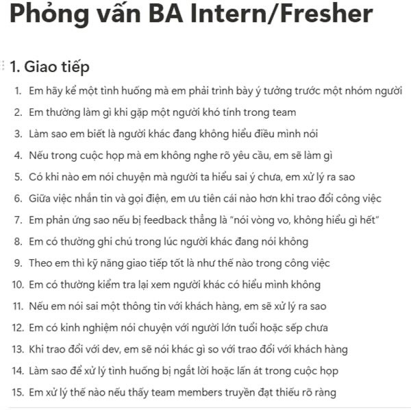
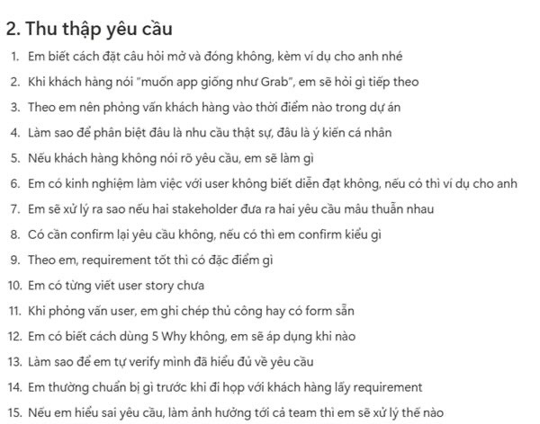
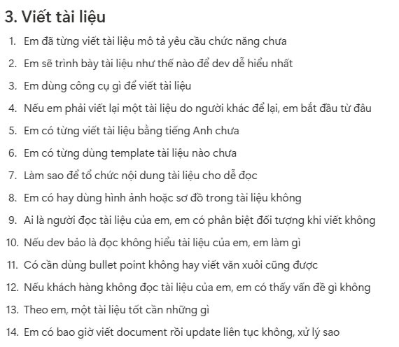
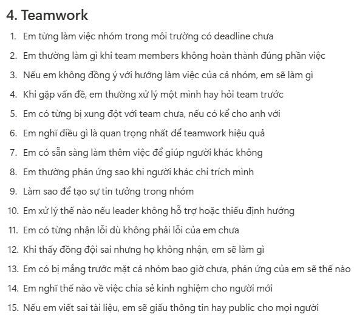
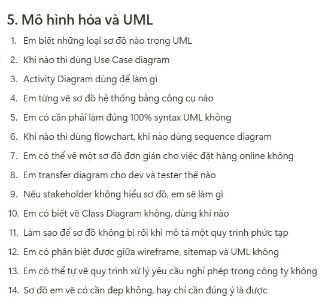

# Kỹ Năng Cần Có cho Vị trí Business Analyst (BA)

### 1. Kỹ năng Giao tiếp (Communication)

*   **Lịch sự và Rõ ràng:** Biết cách giao tiếp lịch sự, trình bày thông tin rõ ràng, trực tiếp, không nói vòng vo.
*   **Trình bày mạch lạc:** Có khả năng trình bày ý tưởng, vấn đề một cách mạch lạc trước nhà tuyển dụng và các thành viên trong nhóm.
*   **Lắng nghe và Ghi nhận:** Biết lắng nghe chủ động và ghi nhận các ý kiến phản hồi (feedback) một cách cầu thị.
*   **Tư duy giao tiếp chuyên nghiệp:**
    *   Hiểu rõ tầm quan trọng của việc truyền đạt thông tin *đúng người, đúng thời điểm và đúng trọng tâm*.
    *   *(Chưa yêu cầu kỹ năng ăn nói quá xuất sắc ngay lập tức, nhưng tư duy chuyên nghiệp là cốt lõi).*

---

### 2. Kỹ năng Thu thập Yêu cầu (Requirement Gathering)

*   **Đặt câu hỏi hiệu quả:** Biết cách đặt câu hỏi mở, truy vấn "tại sao" để hiểu sâu vấn đề, không rập khuôn trong suy nghĩ.
*   **Ghi chép và Tóm tắt:** Có khả năng ghi chép đầy đủ và tóm tắt lại các yêu cầu đúng ý, không sai lệch.
*   **Phân biệt rõ ràng:**
    *   Biết phân biệt được yêu cầu nghiệp vụ thực tế (needs) và ý kiến/mong muốn cá nhân (wants) của người dùng.
    *   Có khả năng làm rõ các yêu cầu, **không nhầm lẫn giữa tính năng (feature) và giải pháp (solution)**.
*   *(Chưa cần kỹ năng tổ chức workshop hay thực hiện deep interview chuyên sâu).*

---

### 3. Kỹ năng Viết Tài liệu (Documentation)

*   **Sử dụng công cụ cơ bản:** Thành thạo việc sử dụng các công cụ văn phòng như Word, Google Docs và có thể làm quen với Confluence.
*   **Trình bày có cấu trúc:** Biết cách trình bày tài liệu khoa học, có cấu trúc (chia section, heading rõ ràng, dễ đọc).
*   **Diễn đạt logic:** Có khả năng diễn đạt văn bản bằng logic, có trình tự, không lộn xộn, giúp người đọc dễ dàng nắm bắt thông tin.
*   **Mục tiêu:**
    *   Viết được tài liệu đủ rõ ràng và dễ hiểu, **có khả năng chuyển giao (transfer) thông tin hiệu quả cho đội ngũ Phát triển (Dev) và Kiểm thử (QA/Tester)**.
    *   *(Không yêu cầu tuân thủ các chuẩn tài liệu quá phức tạp hay bài bản ngay từ đầu).*

---

### 4. Kỹ năng Làm việc Nhóm (Teamwork)

*   **Trao đổi thường xuyên:** Chủ động trao đổi thông tin với các thành viên trong nhóm, không im lặng khi gặp vấn đề hoặc vướng mắc.
*   **Hỗ trợ và hợp tác:** Không làm việc theo kiểu "việc ai người đó làm", sẵn lòng hỗ trợ team đúng lúc khi cần thiết.
*   **Chịu trách nhiệm và Cầu thị:**
    *   Biết nhận lỗi khi mắc sai sót và chủ động xin hỗ trợ từ đồng nghiệp hoặc quản lý khi cần.
    *   Có thái độ cầu thị, luôn mong muốn học hỏi và có trách nhiệm với phần việc mình đảm nhiệm.
*   *(Không yêu cầu kỹ năng lãnh đạo hay quản lý nhóm, nhưng tinh thần trách nhiệm và chủ động là cần thiết).*

---

### 5. Kỹ năng Mô hình hóa và UML (Modeling & UML)

*   **Nắm vững cơ bản:** Biết và hiểu cơ bản về các loại sơ đồ như Use Case Diagram, Activity Diagram, Class Diagram.
*   **Sử dụng công cụ:** Có thể sử dụng các công cụ như draw.io, Lucidchart hoặc đơn giản là vẽ phác thảo trên giấy để thể hiện ý tưởng.
*   **Trình bày đủ ý:**
    *   Vẽ được sơ đồ đủ ý để diễn giải nghiệp vụ/ý tưởng, dù chưa cần tuân thủ nghiêm ngặt cú pháp chuẩn (syntax) của UML.
    *   **Sử dụng sơ đồ để diễn giải ý tưởng/nghiệp vụ cho người khác dễ hiểu.**
*   *(Không yêu cầu vẽ diagram học thuật hay quá phức tạp, mục tiêu là truyền đạt thông tin hiệu quả).*

---