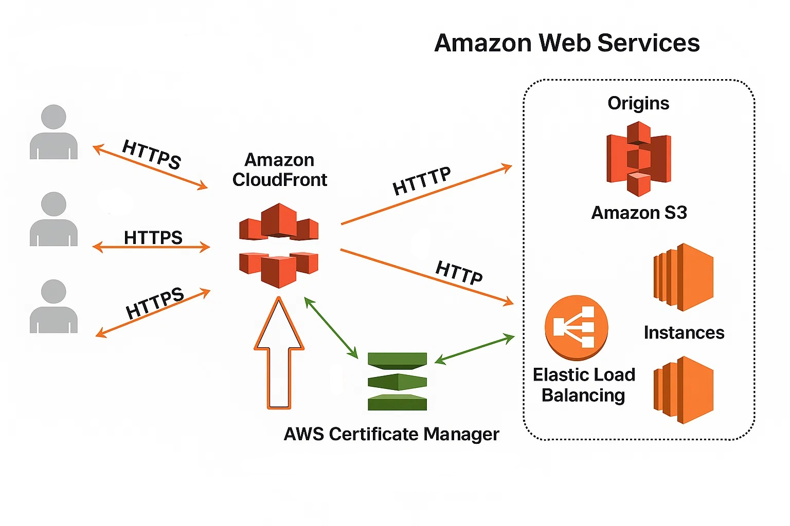

# 1  Kiến Thức Cơ Bản về Đám mây (Cloud Concepts) trên AWS

Hiểu rõ về Cloud Computing là nền tảng quan trọng, chiếm gần một phần ba số câu hỏi trong đề thi AWS CCP (Certified Cloud Practitioner). Phần này sẽ giúp bạn nắm vững các khái niệm cốt lõi.

## 1. Cloud Computing là gì?

Cloud Computing là mô hình cung cấp các tài nguyên công nghệ thông tin (IT) như năng lực tính toán (compute), lưu trữ (storage), mạng (network), v.v... dưới dạng dịch vụ (as-a-service) thông qua Internet.

*   **Ví dụ:** Thay vì mua server vật lý, bạn chỉ trả tiền khi sử dụng máy chủ ảo EC2 hoặc lưu trữ file trên S3.
*   **Các đặc điểm cốt lõi:**
    *   **Self-service (Tự phục vụ):** Bạn có thể tự mình cấp phát (provision) các tài nguyên như máy chủ, không gian lưu trữ (bucket), database một cách dễ dàng thông qua giao diện web (AWS Management Console) hoặc dòng lệnh (CLI), SDK.
    *   **On-demand (Theo yêu cầu):** Sử dụng tài nguyên khi cần và tắt đi khi không còn dùng nữa. Bạn chỉ trả tiền cho những gì bạn thực sự tiêu thụ.
    *   **Pay-as-you-go (Trả theo mức sử dụng):** Thanh toán dựa trên lượng tài nguyên bạn sử dụng (tính theo phút, giờ, GB, số lượng request, v.v.).

## 2. Các đặc điểm kỹ thuật

*   **Ubiquitous Network Access (Truy cập mạng phổ biến):**
    *   Truy cập tài nguyên từ bất cứ đâu chỉ cần có kết nối Internet.
    *   Có thể quản lý thông qua AWS Management Console (trình duyệt), AWS CLI (dòng lệnh), hoặc các AWS SDK trên desktop, laptop, thậm chí cả thiết bị di động.
*   **Resource Pooling (Gộp tài nguyên):**
    *   Các tài nguyên vật lý như server, ổ cứng được chia sẻ và phân bổ động cho nhiều người dùng (multi-tenant).
    *   AWS quản lý việc phân bổ này một cách "ẩn" sau lớp ảo hóa, mang lại hiệu quả sử dụng cao và giảm chi phí.

## 3. Lợi ích kinh tế

*   **Variable Expense (Chi phí biến đổi):**
    *   Chuyển đổi từ Chi phí vốn đầu tư ban đầu (CapEx - Capital Expense: mua server, xây dựng trung tâm dữ liệu) sang Chi phí hoạt động (OpEx - Operational Expense: trả tiền thuê dịch vụ theo sử dụng).
    *   Không tốn chi phí trả trước lớn, chỉ trả tiền cho những gì dùng thực tế.
    *   **Ứng dụng:** Sử dụng **Spot Instances** để tiết kiệm thêm tới 90% chi phí tính toán cho các workload linh hoạt.
*   **Economies of Scale (Quy mô kinh tế):**
    *   AWS vận hành hàng trăm trung tâm dữ liệu (data center) quy mô khổng lồ trên toàn cầu.
    *   Việc mua sắm phần cứng và vận hành ở quy mô lớn giúp AWS đạt được giá thành rất thấp.
    *   Bạn hưởng lợi trực tiếp từ quy mô này: giá lưu trữ trên S3 chỉ khoảng $0.023/GB mỗi tháng, rẻ hơn rất nhiều so với việc bạn tự xây dựng hạ tầng lưu trữ tại chỗ (homelab).
    *   **Lưu ý:** AWS liên tục giảm giá và bạn luôn được hưởng mức giá tốt nhất theo thời gian mà không cần đàm phán.

## 4. Tối ưu và Linh hoạt

*   **Stop Guessing Capacity (Không còn phải đoán nhu cầu):**
    *   Trước đây, bạn phải đoán trước nhu cầu sử dụng để mua đủ server, dẫn đến lãng phí tài nguyên nhàn rỗi (idle) hoặc thiếu hụt khi traffic tăng đột biến.
    *   Cloud Computing cho phép bạn sử dụng đúng lượng tài nguyên cần thiết tại bất kỳ thời điểm nào.
    *   **Auto Scaling:** Dịch vụ tự động thêm (scale up) hoặc bớt (scale down) các EC2 instances hoặc tài nguyên khác dựa trên các chỉ số (metrics) như tải CPU, lưu lượng mạng.
    *   **Ví dụ:** Một ứng dụng xem phim của tôi tăng gấp 5 lần traffic vào giờ cao điểm. Auto Scaling group tự động khởi tạo thêm các instance trong vòng 2 phút.
    *   **Kết quả:** Không bị gián đoạn trải nghiệm người dùng và không lãng phí tài nguyên khi traffic giảm.
*   **Speed & Agility (Tốc độ & Linh hoạt):**
    *   Cấp phát tài nguyên (EC2, RDS, VPC,...) chỉ trong vài phút hoặc giây.
    *   **Ví dụ:** Tôi có thể triển khai một bản demo full-stack (bao gồm VPC, EC2, RDS) chỉ trong khoảng 10 phút.
    *   **Lợi ích:** Tăng tốc độ nghiên cứu và phát triển (R&D), cho phép thử nghiệm các ý tưởng mới và thực hiện A/B testing cực kỳ hiệu quả.

## 5. Hạ tầng Toàn cầu của AWS

*   **Go Global in Minutes (Phủ sóng toàn cầu trong vài phút):**
    *   **Regions:** Các khu vực địa lý độc lập trên thế giới (ví dụ: us-east-1 ở Bắc Virginia, ap-southeast-1 ở Singapore). Mỗi Region bao gồm nhiều Availability Zone.
    *   **Availability Zones (AZs):** Là các trung tâm dữ liệu (data center) độc lập về năng lượng, mạng và hệ thống làm mát, nhưng nằm đủ gần trong cùng một Region để có độ trễ thấp. Việc triển khai ứng dụng qua nhiều AZ trong một Region giúp tăng tính sẵn sàng và chịu lỗi.
    *   **Edge Locations:** Các điểm hiện diện (Point of Presence - PoP) của AWS đặt ở nhiều thành phố trên khắp thế giới, gần với người dùng cuối. Được sử dụng bởi các dịch vụ như CloudFront (mạng phân phối nội dung - CDN) để lưu cache nội dung (ví dụ: video, hình ảnh) và giảm độ trễ khi người dùng truy cập.
    *   Có thể dễ dàng triển khai ứng dụng trên nhiều Region chỉ với vài cú click chuột để giảm độ trễ cho khán giả/người dùng trên toàn cầu.

## 6. Các Mô hình Triển khai (Deployment Models)

*   **Public Cloud:**
    *   Hạ tầng đám mây thuộc sở hữu của bên cung cấp dịch vụ (AWS).
    *   Hạ tầng được chia sẻ cho nhiều khách hàng (multi-tenant).
    *   Ưu điểm: Chi phí thấp, khả năng mở rộng dễ dàng, không cần quản lý hạ tầng vật lý.
*   **Private Cloud:**
    *   Hạ tầng đám mây dành riêng cho một doanh nghiệp.
    *   Có thể đặt tại trung tâm dữ liệu của doanh nghiệp hoặc trên hạ tầng của bên thứ ba nhưng được tách biệt hoàn toàn.
    *   **Ví dụ trên AWS:** AWS Outposts - mang hạ tầng AWS đến trung tâm dữ liệu tại chỗ của bạn.
*   **Hybrid Cloud:**
    *   Kết hợp sử dụng cả hạ tầng tại chỗ (on-premise) và đám mây công cộng (AWS).
    *   Dữ liệu và ứng dụng có thể di chuyển qua lại giữa hai môi trường.
    *   **Ví dụ:** Lưu trữ dữ liệu nhạy cảm trên server riêng tại DC của bạn, nhưng triển khai ứng dụng và xử lý dữ liệu trên AWS để tận dụng khả năng mở rộng và chi phí thấp.

## 7. Các Mô hình Dịch vụ (Service Models)

*   **IaaS (Infrastructure as a Service):**
    *   Nhà cung cấp (AWS) quản lý hạ tầng vật lý (server, storage, network, data center).
    *   Bạn chịu trách nhiệm quản lý hệ điều hành (OS), cài đặt phần mềm, cập nhật bảo mật (patching), và sao lưu (backup).
    *   **Ví dụ:** Amazon EC2, Amazon EBS.
*   **PaaS (Platform as a Service):**
    *   Nhà cung cấp (AWS) quản lý hạ tầng vật lý và cả hệ điều hành, middleware, runtime.
    *   Bạn chỉ cần tập trung vào việc viết và triển khai code ứng dụng.
    *   **Ví dụ:** AWS Elastic Beanstalk, Amazon RDS.
*   **SaaS (Software as a Service):**
    *   Nhà cung cấp (AWS) quản lý hoàn toàn mọi thứ: hạ tầng, nền tảng, ứng dụng.
    *   Bạn chỉ đơn giản là sử dụng ứng dụng cuối cùng thông qua trình duyệt hoặc ứng dụng client.
    *   **Ví dụ:** Amazon WorkMail, Amazon Chime.

## 8. Các Khái niệm Quan trọng Khác

*   **Elasticity (Tính co giãn):**
    *   Khả năng tự động mở rộng (scale up) hoặc thu nhỏ (scale down) tài nguyên một cách tức thì và tự động theo sự thay đổi của workload.
    *   **Ví dụ:** Auto Scaling Group tự động thêm/bớt instance khi CPU load thay đổi.
*   **Scalability (Khả năng mở rộng):**
    *   Khả năng tăng năng lực xử lý của hệ thống để đáp ứng lượng workload tăng lên. Có thể mở rộng theo chiều ngang (Horizontal Scaling: thêm instance) hoặc chiều dọc (Vertical Scaling: tăng kích thước instance).
    *   **Ví dụ:** Một RDS Read Replica là horizontal scaling. Tăng kích thước instance EC2 là vertical scaling.
*   **Measured Service (Dịch vụ được đo lường):**
    *   Mọi việc sử dụng tài nguyên trên AWS đều được đo lường một cách chính xác.
    *   Sử dụng các dịch vụ như Amazon CloudWatch (giám sát) và AWS CloudTrail (ghi nhật ký hoạt động) để theo dõi mức độ sử dụng.
    *   Thông tin sử dụng chi tiết được hiển thị trên bảng điều khiển (dashboard) và báo cáo thanh toán (billing).

## 9. Ví dụ Thực tế từ Dự án

*   **Variable Expense:** Sử dụng Spot Instances cho các tác vụ xử lý video hàng loạt (batch transcoding), giúp tiết kiệm 80% chi phí tính toán so với On-Demand.
*   **Auto Scaling:** Khi đợt phát hành phim mới, số lượng yêu cầu mỗi giây (TPS - Transactions Per Second) tăng gấp 10 lần. Nhờ Auto Scaling, hệ thống server tự động mở rộng và không bị sập.
*   **Global Reach:** Sử dụng Amazon CloudFront kết hợp với S3 để phân phối nội dung phim, giúp người dùng ở Châu Mỹ có thể truy cập với độ trễ rất thấp (<50ms).

## 10. Ôn tập & Lab Đề xuất

Để củng cố kiến thức, hãy thực hành các lab sau:

*   Tạo một S3 bucket, upload một video demo và cấu hình CloudFront để lưu cache và phân phối nội dung từ bucket đó.
*   Triển khai một ứng dụng API viết bằng Node.js lên Amazon EC2, sau đó cấu hình một Auto Scaling Group để tự động quản lý số lượng instance dựa trên tải CPU.