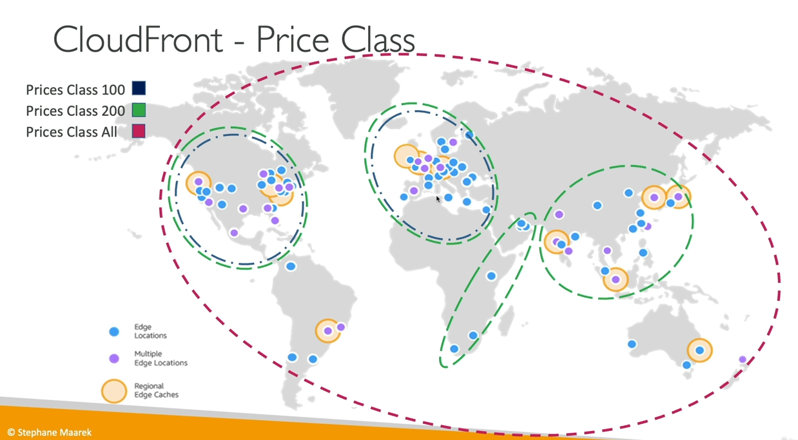
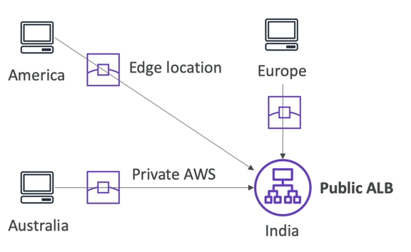

# 1 AWS Cloudfront
Cloudfront là một dịch vụ Content Delivery Network (CDN) của AWS, có nhiệm vụ tăng hiệu suất đọc bằng cách cache content tại các edge location của Amazon.
- Cloudfront có hơn 200 edge location ở toàn thế giới.
- Giúp bảo vệ hệ thống khỏi tấn công DDoS.
- Có thể tích hợp với Shield, AWS Web Application Firewall.

## Cloudfront Origins
Cloudfront có thể hỗ trợ các origin sau:

**S3 Bucket**
- Phân phối file và cache chúng lại ở các edge.
- Tăng cường bảo mật với Cloudfront Origin Access Control (OAC).
- Cloudfront có thể được sử dụng như một ingress (dùng để upload file lên S3).
  - Ingress là thuật ngữ dùng để chỉ lưu lượng vào (incoming traffic) từ bên ngoài vào một hệ thống hoặc mạng cụ thể.

**Custom Origin (HTTP)**
- Application Load Balancer.
- EC2 Instance.
- S3 Website.
- Bất kỳ HTTP backend nào khác.

## Phân biệt Cloudfront vs S3 Cross Region Replication

**Cloudfront**:
- Global Edge network.
- File đc cache trong 1 khoảng thời gian (có thể là 1 ngày).
- **Dùng cho các dữ liệu tĩnh cần phải phân phối đi khắp nơi**

**S3 Cross Region Replication**:
- Cần phải setup cho từng region nếu muốn thực hiện replication.
- File được cập nhật gần như ngay lập tức.
- Chỉ dùng để đọc.
- **Dùng cho các dữ liệu động cần phải đc phân phối đi một vài region với độ trễ thấp**.

## Geo Restriction
Chúng ta có thể giới hạn truy cập đến distribution dựa vào quốc gia của client bằng cách sử dụng:

- Allowlist: Danh sách các quốc gia sẽ được phép truy cập đến distribution.
- Blocklist: Danh sách các quốc gia sẽ bị cấm.

Quốc gia sẽ được xác định bằng Geo-IP database.

## Pricing Class
- Cloudfront Edge Location được trải dài ở khắp nơi trên thế giới.
- Giá cả của mỗi edge location là khác nhau tùy vào vị trí của chúng.
- Chúng ta có thể giảm số lượng edge location để tiết kiệm chi phí.
- Có ba lớp chi phí:
  1. Price Class All: tất cả regions - best performance, nhưng chi phí cao nhất.
  2. Price Class 200: Hầu hết region, ngoại trừ các region có giá đắt nhất.
  3. Price Class 100: Chỉ bao gồm các region có giá rẻ nhất.

## Cache Invalidation
- Khi chúng ta cập nhật lại back-end origin, Cloudfront sẽ không nhận ra sự thay đổi này, do đó dữ liệu được cache tại Cloudfront và dữ liệu mới thay đổi tại back-end sẽ không đồng nhất.
- Tuy có TTL cho các dữ liệu được cache tại Cloudfront để tránh việc chúng sẽ tồn tại vĩnh viễn. 
- Nhưng đôi khi chúng ta vẫn có nhu cầu phải hủy cache ngay lập tức và cập nhật dữ liệu mới.
- Cloudfront hỗ trợ refresh cache ngay lập tức với Cloudfront Invalidation.
- Chúng ta có thể invalidate tất cả các file (\*) hoặc một vài path nhất định (/images/*)

# 2 Global Accelerator
## Global User
Khi chúng ta deploy một application tại một region nào đó, nhưng tập người dùng lại nằm khắp nơi trên thế giới thì sẽ có vấn đề về độ trễ khi người dùng muốn request đến server.

Chúng ta sẽ muốn giảm độ trễ đi nhiều nhất có thể bằng cách khiến traffic đi qua mạng nội bộ của AWS.

## Unicast vs Anycast
Trước khi tìm hiểu Global Accelerator thì cần phải hiểu hai concep này.

- **Unicast**: Là khái niệm chúng ta quen thuộc, một server giữ một IP address.
- **Anycast**: Nhiều server giữ chung một IP address và client sẽ được định hướng đến server gần nhất khi truy cập IP address này.

## AWS Global Accelerator
- Tận dụng mạng nội bộ của AWS để định hướng đến chương trình backend.
- 2 Anycast IP sẽ được tạo cho chương trình backend.
- Anycast IP sẽ gửi traffic trực tiếp đến các Edge Location

- Hỗ trợ **Elastic IP**, **EC2**, **ALB**, **NLB**, **public** hoặc **private**.
- Hiệu suất ổn định
  - Tự động routing đến nơi có độ trễ thấp nhất và failover nhanh.
  - Không gặp vấn đề về client cache vì IP không thay đổi.
  - Mạng nội bộ AWS.
- Health Checks.
  - Thực hiện health check cho application.
- Bảo mật.
  - Chỉ có 2 external IP cần được whitelist.
  - Được bảo vệ khỏi tấn công DDoS nhờ vào AWS Shield.

## AWS Global Accelerator vs CloudFront
- Đều sử dụng  AWS global network và edge location được trải dài toàn cầu.
- Đều tích hợp với AWS Shield để chống DDoS.

**Cloudfront**:
- Tăng hiệu suất cho cacheable content (chẳng hạn như images và videos).
- Phân phối dynamic content.
- **Content được gửi từ edge location**.

**Global Accelerator**:
- Tăng hiệu suất cho nhiều loại ứng dụng khác nhau sử dụng TCP hoặc UDP.
- **Proxy packet tại edge location đến chương trình backend gốc**.