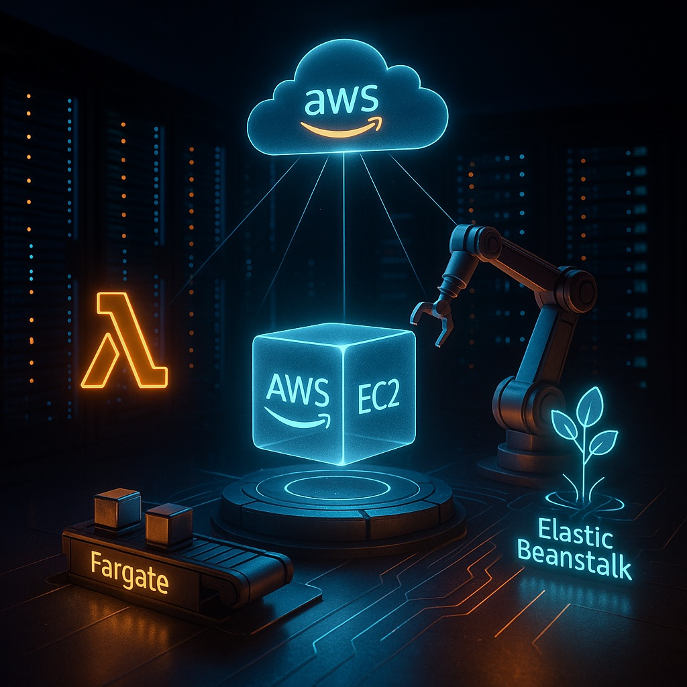

# 1 Hướng dẫn Chọn Dịch vụ Tính toán trên AWS: EC2, Lambda và Elastic Beanstalk

Các dịch vụ tính toán (Compute Services) như EC2, Lambda và Elastic Beanstalk là xương sống của hầu hết các ứng dụng trên AWS và chiếm khoảng 36% nội dung trong đề thi AWS CCP (Certified Cloud Practitioner). Hiểu sâu về từng dịch vụ sẽ giúp bạn lựa chọn công cụ phù hợp và tối ưu hạ tầng cho ứng dụng của mình.

## 1. Amazon EC2 - IaaS cơ bản

*   **Khái niệm:**
    *   EC2 (Elastic Compute Cloud) là dịch vụ cung cấp máy chủ ảo (Virtual Servers) trên đám mây.
    *   Bạn có toàn quyền quản trị hệ điều hành (OS), cài đặt phần mềm và cập nhật bảo mật (patch security) cho instance của mình.

*   **Công nghệ:**
    *   Sử dụng công nghệ ảo hóa, hiện tại phổ biến là Nitro hypervisor, mang lại hiệu năng cao hơn so với Xen trước đây.
    *   **AMI (Amazon Machine Image):** Là một template bao gồm hệ điều hành, phần mềm đã cài đặt và cấu hình. Bạn có thể tạo AMI tùy chỉnh để triển khai nhanh chóng các instance với môi trường đã sẵn sàng.

*   **Các loại Instance (Instance Types) & Trường hợp sử dụng:**
    *   **General Purpose (t3, m5, t4g, m6g):** Cân bằng giữa CPU, RAM và network. Phù hợp cho web server, môi trường phát triển/kiểm thử (dev/test), ứng dụng doanh nghiệp nhỏ.
    *   **Compute Optimized (c5, c6g):** Tối ưu cho các workload đòi hỏi hiệu năng tính toán cao. Phù hợp cho xử lý theo lô (batch processing), server game, web server hiệu năng cao, xử lý video.
    *   **Memory Optimized (r5, r6g, x1):** Tối ưu cho các workload cần lượng lớn RAM. Phù hợp cho database engine hiệu năng cao, bộ nhớ cache trong bộ nhớ (in-memory cache), phân tích dữ liệu lớn.
    *   **Storage Optimized (i3, i3en, d2):** Tối ưu cho các workload cần tốc độ I/O cao và dung lượng lưu trữ lớn trên instance. Phù hợp cho database NoSQL, kho dữ liệu (data warehouse), hệ thống file phân tán.

*   **Mô hình định giá & Lưu trữ (Storage):**
    *   **On-Demand:** Trả phí theo giây hoặc phút sử dụng instance. Mô hình linh hoạt nhất.
    *   **Reserved Instances / Savings Plans:** Cam kết sử dụng instance trong 1 hoặc 3 năm để nhận mức giảm giá đáng kể (30–60%) so với On-Demand.
    *   **Spot Instances:** Sử dụng năng lực EC2 chưa dùng đến. Giá rẻ nhất (giảm tới 90% so với On-Demand) nhưng có thể bị thu hồi khi AWS cần năng lực đó. Phù hợp cho các workload không liên tục hoặc có thể tạm dừng (ví dụ: batch job, xử lý dữ liệu lớn).
    *   **EBS (Elastic Block Store) vs Instance Store:**
        *   **EBS:** Lưu trữ dữ liệu dạng block, bền vững (persistent). Dữ liệu được lưu ngay cả khi stop/terminate instance. Hỗ trợ snapshot để sao lưu. Có thể gắn (attach)/tháo (detach) linh hoạt giữa các instance (cùng AZ).
        *   **Instance Store:** Lưu trữ dữ liệu tạm thời (ephemeral) ngay trên đĩa vật lý gắn với host của instance. Tốc độ I/O rất cao. Dữ liệu sẽ bị MẤT khi instance bị dừng (stopped) hoặc kết thúc (terminated). Chỉ nên dùng cho dữ liệu tạm hoặc cache.

*   **Các tính năng nâng cao:**
    *   **Elastic IP:** Cung cấp địa chỉ IP tĩnh mà bạn có thể giữ và gán cho các instance khác nhau. Giúp giữ nguyên địa chỉ IP public ngay cả khi instance bị stop/start.
    *   **Security Groups:** Hoạt động như tường lửa (firewall stateful) ở cấp độ instance. Bạn xác định các luật cho phép/chặn lưu lượng truy cập vào/ra instance.
    *   **Placement Groups:**
        *   `cluster`: Đặt các instance gần nhau trong cùng một Availability Zone để đạt độ trễ mạng thấp nhất. Phù hợp cho các ứng dụng tính toán hiệu năng cao (HPC).
        *   `spread`: Đặt các instance trên các phần cứng (underlying hardware) riêng biệt để giảm thiểu rủi ro lỗi đồng thời (simultaneous failures). Phù hợp cho các ứng dụng cần độ chịu lỗi cao (fault-tolerant).
    *   **Key Pairs:** Cặp khóa công khai (public key) và khóa riêng (private key) được sử dụng để truy cập SSH an toàn vào instance (đối với Linux/macOS) hoặc kết nối bằng RDP (đối với Windows, với private key được dùng để giải mã mật khẩu admin). Cần lưu trữ khóa riêng một cách cẩn thận.

## 2. AWS Lambda - FaaS, Serverless

*   **Khái niệm:**
    *   Là dịch vụ Hàm như một dịch vụ (Function as a Service - FaaS), hoàn toàn không máy chủ (serverless).
    *   **Event-driven:** Code (function) chỉ chạy khi có một sự kiện (event) xảy ra.
    *   Bạn chỉ cần viết code, AWS quản lý toàn bộ cơ sở hạ tầng máy chủ bên dưới (underlying compute).

*   **Trường hợp sử dụng điển hình:**
    *   Xử lý sự kiện từ các dịch vụ AWS khác (ví dụ: xử lý ảnh khi upload lên S3, phản hồi các API request qua API Gateway, xử lý thay đổi dữ liệu trong DynamoDB Streams, phản ứng với các rule trong CloudWatch Events).
    *   Thực hiện các tác vụ backend ngắn hạn.
    *   Phù hợp cho kiến trúc Microservices.

*   **Khả năng mở rộng (Scaling) & Tối ưu hiệu năng:**
    *   **Automatic Scaling:** Tự động tạo ra hàng nghìn bản sao (parallel invocations) của function để xử lý lượng lớn requests đồng thời.
    *   **Memory & CPU tỷ lệ thuận:** Khi bạn tăng lượng Memory được cấp phát cho function, CPU cũng tăng theo, giúp giảm thời gian thực thi (execution time).
    *   **Cold Start:** Thời gian khởi động ban đầu của function khi nó chưa hoạt động trong một thời gian. Có thể gây độ trễ cho lần invoke đầu tiên. Sử dụng **Provisioned Concurrency** cho các luồng công việc quan trọng (critical path) hoặc các API yêu cầu độ trễ thấp ổn định để giữ cho function luôn sẵn sàng.
    *   **VPC Integration:** Có thể cấu hình Lambda để truy cập tài nguyên trong mạng riêng ảo (VPC), nhưng có thể làm tăng thời gian cold start.

*   **Mô hình định giá & Free Tier:**
    *   **Request Fee:** Tính phí dựa trên số lượng yêu cầu (ví dụ: $0.20 cho mỗi 1 triệu requests).
    *   **Duration Fee:** Tính phí dựa trên thời gian thực thi và lượng Memory (ví dụ: $/GB-second). Công thức tính: (Memory allocated in GB) × (Execution time in seconds).
    *   **Free Tier:** Cung cấp miễn phí 1 triệu requests và 400,000 GB-seconds mỗi tháng.
    *   **Tối ưu chi phí/hiệu năng:** Giảm kích thước file triển khai (deployment package size), chỉ import các module cần thiết trong code để giảm thời gian load function và chi phí.

## 3. Elastic Beanstalk - PaaS cho ứng dụng Web

*   **Khái niệm:**
    *   Là dịch vụ Nền tảng như một dịch vụ (Platform as a Service - PaaS).
    *   AWS tự động cung cấp và quản lý các tài nguyên AWS cần thiết để chạy ứng dụng web của bạn, bao gồm EC2 instances, Elastic Load Balancer (ELB), Auto Scaling group, CloudWatch monitoring, v.v.

*   **Tính năng:**
    *   **Hỗ trợ đa ngôn ngữ và framework:** Java, .NET, PHP, Node.js, Python, Ruby, Go, và các Docker container.
    *   **Các loại môi trường (Environment types):**
        *   `Web Server Environment`: Xử lý các yêu cầu HTTP đến ứng dụng web.
        *   `Worker Environment`: Chạy các tác vụ nền (background job) không đồng bộ, thường xử lý các message từ Amazon SQS.
    *   Giúp triển khai ứng dụng web nhanh chóng mà không cần cấu hình chi tiết từng dịch vụ AWS.

*   **Lợi ích:**
    *   Đơn giản hóa việc triển khai và quản lý ứng dụng web.
    *   Tự động cấu hình các dịch vụ AWS cần thiết cho ứng dụng.
    *   Bạn vẫn có khả năng truy cập và can thiệp vào các tài nguyên cơ sở hạ tầng (như EC2 instance) nếu cần.

## So sánh Tóm tắt

*   **Amazon EC2:** Cung cấp quyền kiểm soát toàn diện nhất (full control) trên máy chủ ảo. Phù hợp cho các workload tùy chỉnh (custom workload) hoặc các tiến trình chạy liên tục (long-running process) mà bạn muốn quản lý chi tiết.
*   **AWS Lambda:** Mô hình serverless, event-driven. Tự động scale theo sự kiện. Phù hợp cho các tác vụ ngắn hạn, phản hồi sự kiện, hoặc kiến trúc microservice nhỏ gọn. Thanh toán theo mức sử dụng thực tế (thời gian chạy và số lượng request).
*   **Elastic Beanstalk:** Là PaaS giúp đơn giản hóa việc triển khai ứng dụng web hoặc worker. Tự động thiết lập hạ tầng (EC2, ELB, Auto Scaling...). Thích hợp khi bạn muốn triển khai nhanh chóng nhưng vẫn muốn có khả năng can thiệp vào hạ tầng bên dưới khi cần.

Chọn dịch vụ tính toán phù hợp giúp bạn tối ưu hóa hiệu năng, chi phí và đơn giản hóa công tác quản lý hạ tầng trên AWS.