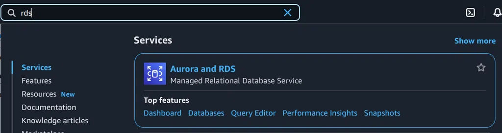

# 1 Hướng dẫn thực hành triển khai và sử dụng Amazon RDS PostgreSQL trên AWS

Hướng dẫn này cung cấp các bước chi tiết để tạo và kết nối tới cơ sở dữ liệu PostgreSQL trên Amazon RDS.

## Giới thiệu

Amazon RDS là dịch vụ cơ sở dữ liệu quan hệ được quản lý (Managed Relational Database Service) trên đám mây của AWS. Nó giúp đơn giản hóa việc thiết lập, vận hành và mở rộng cơ sở dữ liệu quan hệ. Hướng dẫn này sẽ tập trung vào việc tạo một instance PostgreSQL trên RDS và thực hiện các thao tác kết nối cơ bản từ local bằng Golang và công cụ GUI.

*Lưu ý: Hướng dẫn này giả định bạn đã có tài khoản AWS và có kiến thức cơ bản về AWS Console.*

## 1. Tạo RDS Instance trên AWS

Thực hiện theo các bước sau để tạo một instance PostgreSQL trên Amazon RDS:

### 1.1. Truy cập AWS Console

*   Đăng nhập vào [AWS Management Console](https://aws.amazon.com/console/).
*   Trên thanh tìm kiếm, gõ `RDS` và chọn **RDS**.



### 1.2. Bắt đầu tạo database

*   Trong bảng điều khiển RDS, chọn **Create database**.
*   Chọn **Standard create** để tùy chỉnh chi tiết cấu hình.


### 1.3. Cấu hình Engine và Template

*   **Engine options:** Chọn **PostgreSQL** trong danh sách.
*   **Templates:** Chọn **Free tier** (nếu bạn đang học hoặc thử nghiệm để tiết kiệm chi phí) hoặc **Production** tùy theo nhu cầu thực tế của bạn.


### 1.4. Cấu hình cài đặt cơ sở dữ liệu

*   **DB instance identifier:** Đặt tên duy nhất cho instance RDS của bạn (ví dụ: `manh-techmaster-db`).
*   **Master username:** Đặt tên cho tài khoản người dùng chính (admin) của database (ví dụ: `manhdevops`).
*   **Master password:** Đặt mật khẩu mạnh cho tài khoản master user. **Hãy ghi nhớ mật khẩu này!**
*   **DB instance size:** Chọn kích thước instance phù hợp. Đối với Free Tier, chọn `t2.micro` hoặc `t3.micro`.
*   **Storage:** Cấu hình dung lượng lưu trữ. Mặc định 20GB cho Free Tier, có thể tăng nếu cần. Loại storage (ví dụ: General Purpose SSD - gp2) cũng có thể được chọn ở đây.


### 1.5. Cấu hình mạng và bảo mật

*   **VPC:** Sử dụng Default VPC hoặc chọn VPC tùy chỉnh của bạn.
*   **Subnet group:** Chọn hoặc tạo một DB subnet group.
*   **Public access:** Chọn **Yes** nếu bạn muốn instance có thể truy cập công khai từ Internet. **Lưu ý:** Chỉ nên dùng cho mục đích thử nghiệm hoặc phát triển. Đối với production, nên chọn **No** và truy cập thông qua VPC/VPN.
*   **VPC security groups:** Tạo một security group mới hoặc chọn một security group hiện có. **Quan trọng:** Cấu hình security group này để cho phép traffic vào cổng PostgreSQL (mặc định: `5432`) từ các IP nguồn bạn muốn kết nối (ví dụ: IP Public của máy bạn hoặc dải IP của VPC).

### 1.6. Cài đặt bổ sung (Additional configuration)

*   **Database name:** Đặt tên cho cơ sở dữ liệu ban đầu sẽ được tạo trong instance này (ví dụ: `mydb`).
*   **Backup:** Để cấu hình mặc định hoặc tùy chỉnh chính sách sao lưu.
*   **Monitoring:** Bật Enhanced Monitoring nếu bạn cần theo dõi chi tiết hiệu suất của instance.

### 1.7. Triển khai

*   Kiểm tra lại tất cả các cài đặt đã cấu hình.
*   Nhấn **Create database**.
*   Quá trình tạo instance sẽ mất vài phút (thường khoảng 5-10 phút). Chờ cho đến khi trạng thái của instance chuyển sang `Available`.


### 1.8. Lấy Endpoint để kết nối

*   Sau khi instance có trạng thái `Available`, click vào tên instance đó trong danh sách RDS.
*   Trong tab **Connectivity & Security**, tìm và **Copy Endpoint**. Đây là địa chỉ host bạn sẽ sử dụng để kết nối đến database (ví dụ: `mydb-instance.abc123xyz.us-east-1.rds.amazonaws.com`).
*   Ghi nhớ **Port** (mặc định 5432).

## 2. Kết nối đến RDS PostgreSQL bằng Golang từ local

Bạn có thể sử dụng ứng dụng Golang để kết nối tới database RDS.

### 2.1. Chuẩn bị

*   Đảm bảo bạn đã cài đặt [Go](https://golang.org/doc/install) trên máy local.
*   Cài đặt driver PostgreSQL cho Go:
    ```bash
    go get github.com/lib/pq
    ```

### 2.2. Tạo file `main.go`

Tạo một file mới tên là `main.go` và thêm nội dung sau. **Hãy thay thế các giá trị placeholder** trong chuỗi `connStr` bằng thông tin kết nối thực tế của bạn (Endpoint, User, Password, Database Name).

```go
package main

import (
	"database/sql"
	"fmt"
	"log"

	_ "github.com/lib/pq" // Import driver PostgreSQL
)

func main() {
	// Thay thế các thông tin kết nối bằng thông tin RDS của bạn
	// - host: Endpoint của RDS
	// - port: Port của RDS (mặc định 5432)
	// - user: Master username bạn đã tạo (ví dụ: manhdevops)
	// - password: Master password bạn đã tạo
	// - dbname: Database name bạn đã tạo (ví dụ: mydb)
	connStr := "host=YOUR_RDS_ENDPOINT port=5432 user=YOUR_USERNAME password=YOUR_PASSWORD dbname=YOUR_DATABASE_NAME sslmode=disable"

	db, err := sql.Open("postgres", connStr)
	if err != nil {
		log.Fatal("Failed to open DB:", err)
	}
	defer db.Close() // Đảm bảo kết nối được đóng khi chương trình kết thúc

	// Kiểm tra kết nối đến database
	err = db.Ping()
	if err != nil {
		log.Fatal("Failed to connect:", err)
	}

	fmt.Println("✅ Successfully connected to RDS PostgreSQL!")
}
```

### 2.3. Chạy ứng dụng

Mở terminal trong thư mục chứa file `main.go` và thực hiện các lệnh sau:

```bash
go mod init rds-demo # Khởi tạo module Go nếu chưa có
go mod tidy         # Tải các dependency cần thiết
go run main.go      # Chạy chương trình
```

### 2.4. Kết quả dự kiến

Nếu cấu hình kết nối và security group chính xác, bạn sẽ thấy output:

```
✅ Successfully connected to RDS PostgreSQL!
```

## 3. Kết nối với RDS PostgreSQL từ công cụ GUI

Bạn có thể sử dụng các công cụ quản lý cơ sở dữ liệu GUI phổ biến như TablePlus, pgAdmin, DBeaver, DataGrip, v.v., để kết nối và quản lý database một cách trực quan. Các bước chung thường bao gồm:

*   Mở công cụ quản lý database của bạn.
*   Chọn tùy chọn để tạo kết nối mới (New Connection).
*   Chọn **PostgreSQL** làm loại database.
*   Nhập thông tin kết nối:
    *   **Host/Address:** `Endpoint` của RDS (lấy từ bước 1.8).
    *   **Port:** `Port` của RDS (mặc định 5432).
    *   **User:** `Master username` bạn đã tạo (ví dụ: `manhdevops`).
    *   **Password:** `Master password` bạn đã tạo.
    *   **Database:** `Database name` bạn đã tạo (ví dụ: `mydb`).
    *   (Tùy chọn) Các cấu hình khác như SSL (thường là `require` hoặc `verify-full` cho production, `disable` cho thử nghiệm).
*   Nhấn nút để kiểm tra kết nối (`Test Connection`).
*   Nếu kết nối thành công, nhấn **Connect**.


## 4. Thực hiện các truy vấn SQL cơ bản

Sau khi kết nối thành công tới database RDS (bằng code hoặc công cụ GUI), bạn có thể thực hiện các lệnh SQL. Dưới đây là ví dụ đơn giản để tạo bảng, chèn dữ liệu và truy vấn dữ liệu:

### 4.1. Tạo bảng `test`

```sql
CREATE TABLE test (
    id SERIAL PRIMARY KEY,
    name VARCHAR(255) NOT NULL
);
```

### 4.2. Chèn dữ liệu vào bảng `test`

```sql
INSERT INTO test (name) VALUES ('John Doe');
INSERT INTO test (name) VALUES ('Jane Smith');
```

### 4.3. Xem dữ liệu trong bảng `test`

```sql
SELECT * FROM test;
```

Kết quả sẽ hiển thị dữ liệu bạn vừa chèn vào bảng.


## Kết luận

Qua hướng dẫn này, bạn đã biết cách:

*   Tạo một instance RDS PostgreSQL trên AWS với các cấu hình cơ bản.
*   Cấu hình Network và Security Group để cho phép truy cập.
*   Lấy Endpoint và Port của instance RDS.
*   Kết nối thành công đến RDS bằng một ứng dụng Golang local.
*   Kiểm tra kết nối và thực hiện các truy vấn SQL cơ bản bằng công cụ quản lý database GUI.

Việc sử dụng Amazon RDS giúp giảm đáng kể gánh nặng quản lý cơ sở dữ liệu, cho phép bạn tập trung hơn vào việc phát triển ứng dụng. Đây là một bước quan trọng trong việc xây dựng các hệ thống backend có khả năng mở rộng, ổn định và hiệu quả trên AWS.

```