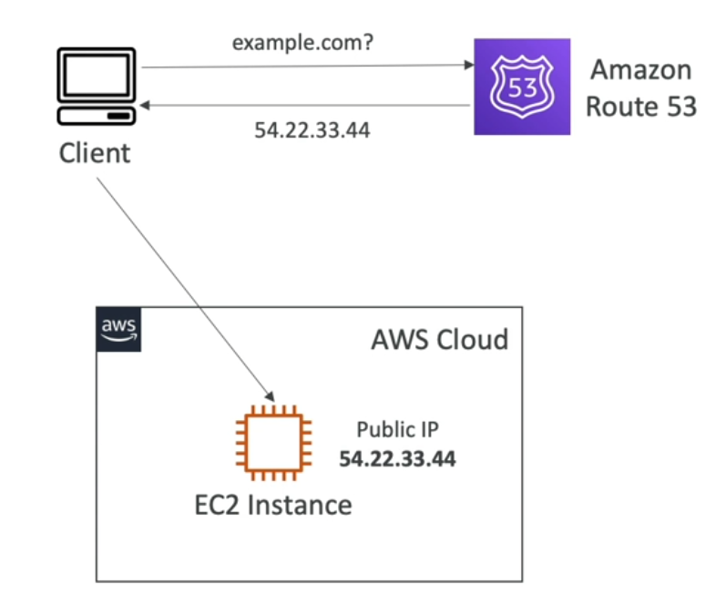
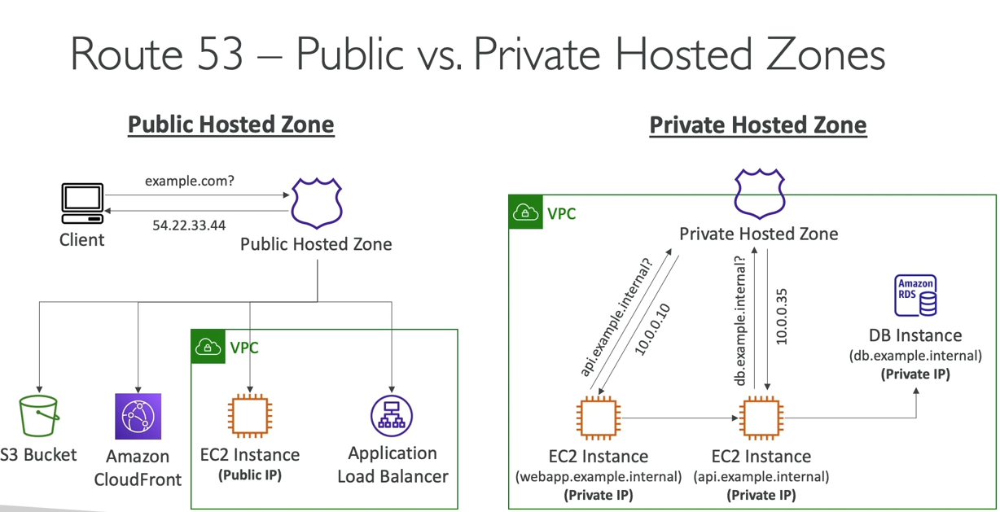
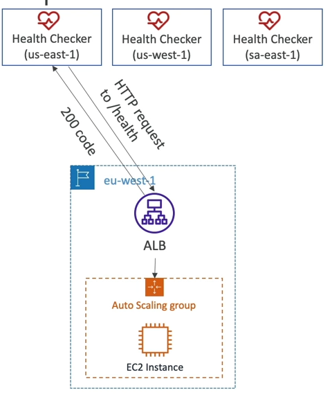
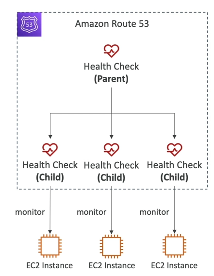
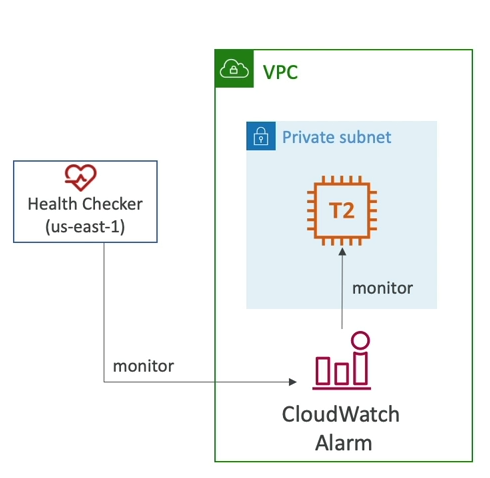

# 1 Route 53
AWS Route 53 là dịch vụ DNS do AWS cung cấp, giúp quản lý các tên miền, định tuyến lưu lượng mạng và kiểm tra sức khỏe hệ thống.

### Cách hoạt động
- Người dùng truy cập vào tên miền (ví dụ: example.com).
- Trình duyệt gửi request đến máy chủ DNS.
- Route 53 trả về địa chỉ IP của server tương ứng.
- Trình duyệt kết nối đến server để lấy dữ liệu.

### Records
Các bản ghi sẽ giúp chúng ta định nghĩa cách để định tuyến traffic đến một tên miền cụ thể nào đó.

Mỗi bản ghi chứa các thông tin sau:
- Domain / Subdomain Name.
- Loại bản ghi.
- Địa chỉ IP.
- Routing Policy - cách mà Route 53 sẽ truy vấn tên miền này.
- TTL - thời gian mà bản ghi sẽ được cache tại DNS Resolver.

Các loại bản ghi:
- (phải biết) A / AAAA / CNAME / NS.
- (nâng cao) CAA / DS / MX / NAPTR / PTR / SOA / TXT / SPF / SRV.

- **A** - map hostname thành IPv4.
- **AAAA** - map hostname thành IPv6.
- **CNAME** - map hostname thành một hostname khác.
  - Hostname đích là loại bản ghi A hoặc AAAA.
  - Không thể tạo CNAME cho DNS namespace đầu tiên (Zone Apex), ví dụ: có thể tạo CNAME cho example.com nhưng không thể tạo CNAME cho www.example.com.
- **NS** - Name server của Hosted Zone.
  - Điều chỉnh cách mà traffic được điều hướng đến một domain.

### Hosted Zone
Là một container chứa các bản ghi khác nhau để định hướng traffic đến một domain và subdomain nào đó.

Có hai loại Hosted Zone:
- **Public Hosted Zone** - chứa các bản ghi sẽ định hướng traffic trên Internet (public domain name).
  - Ví dụ: application1.mypublicdomain.com
- **Private Hosted Zone** - chứa các bản ghi sẽ định hướng traffic bên trong một hoặc nhiều VPCs (private domain name).
  - Ví dụ: application1.company.internal

Về cơ bản, Private Hosted Zone và Public Hosted Zone hoạt động giống hệt nhau, chỉ là một bên sẽ là dành cho các domain public trên internet còn một bên là dành cho các domain private để sử dụng nội bộ.

Chúng ta cần trả 0.5$ mỗi tháng cho mỗi Hosted Zone.

# 2 Route 53 Health Check
Health Check trong Route 53 giúp kiểm tra trạng thái hoạt động của một endpoint (EC2, ALB, website, API, v.v.). Nếu endpoint bị lỗi, Route 53 có thể tự động chuyển hướng traffic đến endpoint khác. HTTP Health Check chỉ có thể hoạt động trên các **public resource**

Health Check chủ yếu có các loại như sau:

1. Health check theo dõi hoạt động của một endpoint cụ thể (chương trình, server hay AWS resource).
2. Health check theo dõi health check khác (Calculated health check).
3. Health check theo dõi CloudWatch Alarm (full control).

### Health Check - Monitor an Endpoint
Có khoảng 15 global health checker sẽ kiểm tra tình trạng của một endpoint.

- Ngưỡng Healthy/Unhealthy mặc định là 3.
- Chu kỳ mặc định là 30 giây.
- Hỗ trợ các giao thức như: HTTP, HTTPS, TCP.
- Nếu >18% health checker cho biết endpoint là healthy, thì Route 53 sẽ xem như endpoint đang hoạt động bình thường. Còn không thì sẽ là Unhealthy.
- Có thể chọn các vị trí Health Checker mà Route 53 sẽ sử dụng.

Health Check được xem là pass nếu như endpoint trả về status code là 2xx hoặc 3xx. Ngoài ra, Health Check còn có thể kiểm tra cả nội dung bên trong 5120 bytes đầu của response nếu cần thiết.

Health Check hoạt động bằng cách request đến endpoint cụ thể để nhận response, thế nên về cơ bản chúng ta cần phải cấu hình tường lửa / router tại endpoint sao cho Healh Checker có request đến chúng.

### Health Check - Calculated Health Checks

Loại Health Check sẽ sử dụng kết quả của nhiều Health Checkers khác, logic pass có thể dùng toán tử **OR**, **AND** hoặc **NOT**.

Có thể theo dõi tối đa kết quả của 256 Health Checker khác nhau

Có thể thiết lập số lượng Health Check cần pass trước khi đưa ra quyết định.

TH sử dụng: thực hiện bảo trì trang web mà không khiến cho toàn bộ health check bị fail.

### Health Check - Private Hosted Zones

Route 53 Health Checker nằm bên ngoài các VPC, chúng không thể truy cập trực tiếp vào các private endpoint của VPC.

Thế nhưng, chúng ta có thể tạo một **CloudWatch Metric** và gắn nó vào **CloudWatch Alarm**, sau đó tạo Health Check dể check tại alarm này.

# 3 Route 53 - Routing Policies

Routing Policy sẽ dùng để định nghĩa cách mà Route 53 phản hồi lại với các yêu cầu truy vấn DNS.

Nên phân biệt được từ "routing" trong Route 53, không giống như Load Balancer, Route 53 không định hướng traffic, mà chỉ phản hồi lại yêu cầu truy vấn DNS.

Hiện tại, Route 53 hỗ trợ các loại policy sau:

- Simple.
- Weighted.
- Failover.
- Latency based.
- Geolocation.
- Multi-value answer.
- Geoproximity.

## Simple Routing

- Route traffic đến một resource nào đó, có thể khai báo nhiều giá trị cho cùng một bản ghi, trong trường hợp này thì phía client sẽ **chọn ngẫu nhiên** một trong số nhiều bản ghi đó.

- **Không thể kết hợp** với Health Check.

## Weighted Routing

- Route traffic đến các resource theo một tỉ lệ hay trọng số (weight) nào đó, các DNS records phải có cùng tên và loại

- Hỗ trợ Health Check.

## Latency-based Routing

Chuyển hướng đến resource có độ trễ ít nhất, hữu ích trong trường hợp muốn ưu tiên độ trễ thấp cho người dùng.

Latency (độ trễ) có thể dựa vào khoảng cách giữa user và AWS region.

Hỗ trợ Health Check.

## Failover Routing (Active - Passive)

Route traffic đến một Resource dự phòng khi resource Primary bị lỗi (failover).

Khi Primary hoạt động lại, traffic sẽ quay trở về nó.

Dựa trên Health Check để hoạt động.

## Geolocation Routing

Khác với Lantency-based, loại Routing này hoạt động dựa trên vị trí của người dùng, cụ thể là vị trí địa lý. Nếu người dùng ở vị trí không được chỉ định thì sẽ được route đến "Default" record.

TH Sử dụng: nội địa hóa cho chương trình, giới hạn phân phối nội dung, cân bằng tải, ...

Có thể kết hợp với Health Check.

## Geoproximity Routing

Giúp điều hướng traffic đến tài nguyên gần nhất dựa trên vị trí địa lý của user. 

Route 53 sử dụng địa lý của user để quyết định hướng traffic đến endpoint gần nhất. Có thể điều chỉnh bias để tăng/giảm vùng phủ của từng endpoint.

- Để mở rộng vùng phủ (1 đến 99) - thêm traffic đến tài nguyên.
- Để thu nhỏ vùng phủ (-1 đến -99) - giảm traffic đến tài nguyên.

Khác với Geolocation Routing, Geoproximity không cố định theo quốc gia mà linh hoạt theo khoảng cách. Về cơ bản là cho phép chúng ta điều chỉnh lại vùng phủ của một region lên một resource.

Tài nguyên đích có thể là:
- AWS Resources.
- Non-AWS Resources.

Cần phải sử dụng Route 53 Traffic Flow (nâng cao) để có thể sử dụng tính năng này.

## IP-based Routing

Route dựa trên địa chỉ IP của client. Chúng ta sẽ cung cấp một danh sách CIDRs và location/resource tương ứng (user-IP-to-endpoint mappings).

## Multi-Value Routing

Cho phép routing traffic đến nhiều resource khác nhau.

Có thể kết Health Check để đảm bảo kết quả trả về là một danh sách các resource đang hoạt động bình thường.