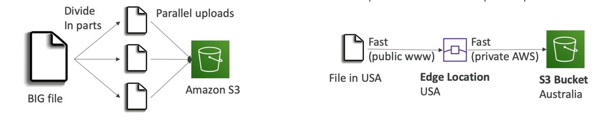
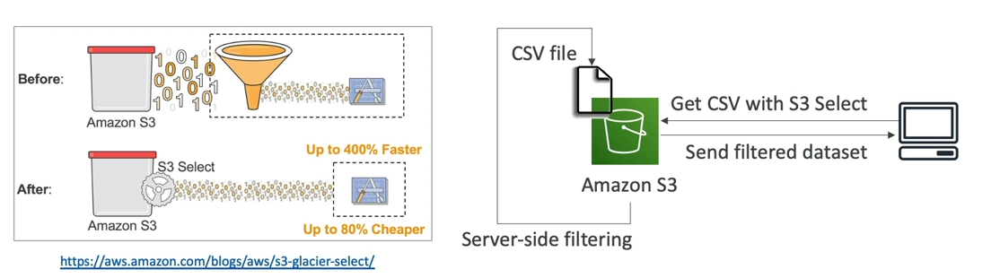
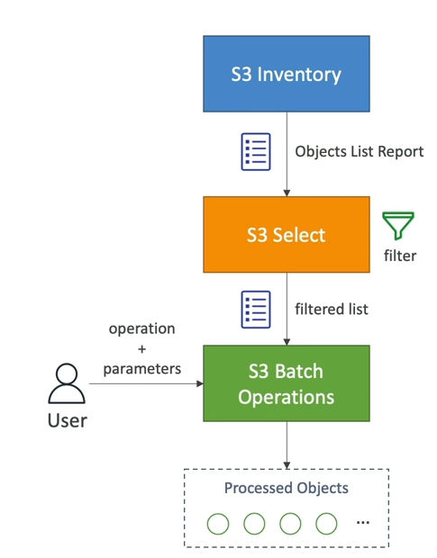
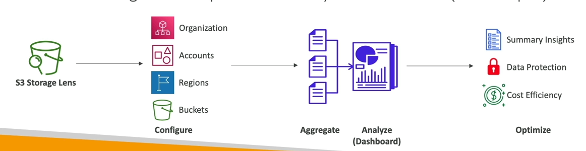
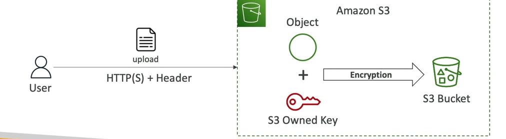
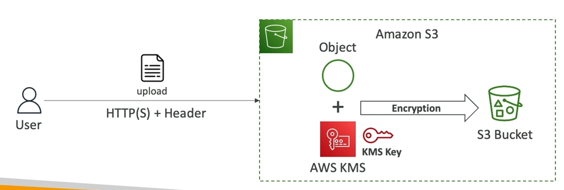
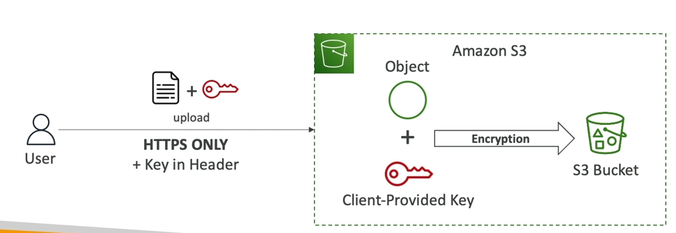
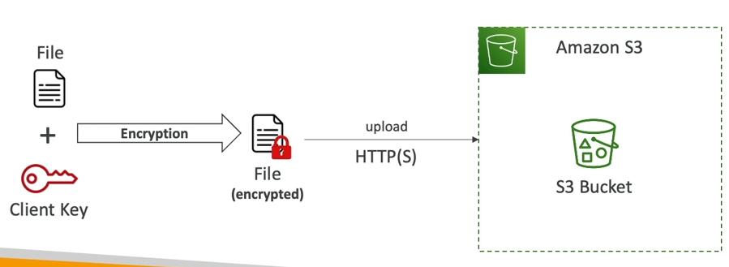
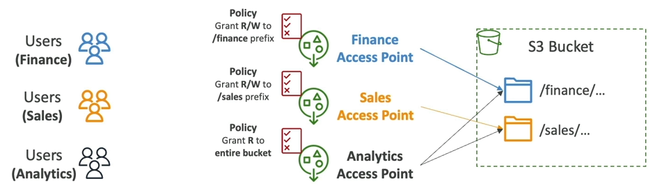
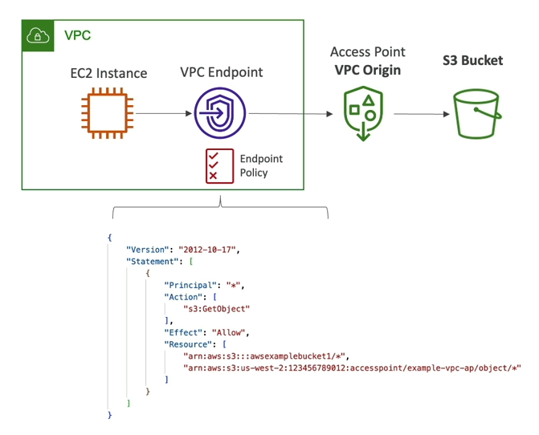

# 1 Introduction S3


## Amazon S3 - Introduction
### Bucket
S3 cho phép người dùng lưu trữ file (object) trong các "bucket". Tên của bucket phải là độc nhất trên phạm vi toàn cầu (trên toàn bộ các region), nhưng phạm vi hoạt động của một bucket thì chỉ là trong một region.
### Object
Object trong S3 là các file sẽ được lưu trữ, mỗi file sẽ có một Key.

Key là đường dẫn tuyệt đối đến tài nguyên đó:
 - s3://my-bucket/my_file.txt
 - s3://my-bucket/my_folder_1/another_folder/my_file.txt

Giá trị của một object là content chứa trong body của file được upload:
- Object size tối đa được upload là 5TB (5000 GB).
- Nếu file upload lớn hơn 5GB, cần phải sử dụng "multi-part upload".

Ngoài ra một Object còn có các thông tin như:
- Metadata (một cặp các key / value do hệ thống hoặc người dùng thiết lập).
- Tags. 
- Version ID (nếu versioning được bật).

## Amazon S3 - Security
Có vài cách để thiết lập bảo mật cho một Amazon S3:
- **User-based**:
  - **IAM Policies** - Cho phép chỉ định một user cụ thể được phép dùng một API call nào đó bằng IAM.
- **Resource-based**:
  - **Bucket Policies** - Một JSON policy gán trực tiếp cho một S3 bucket để kiểm soát quyền truy cập đến bucket và các object bên trong.
  - **Object Access Control List (ACL)** - Kiểm soát quyền truy cập ở cấp độ object.
  - **Bucket Access Control List (ACL)** - Kiểm soát quyền truy cập ở cấp độ bucket. Ít phổ biến hơn.

>**Chú ý**: Một IAM principal có thể truy cập S3 Object nếu:
>- User IAM permisson cho phép HOẶC Resource policy cho phép.
>- VÀ không có DENY cụ thể nào.

- **Encryption**: có thể mã hóa object trong S3 bằng cách sử dụng một encryption key.

### S3 Bucket Policies
Là Policy được viết ở dạng JSON, ví dụ:

```js
{
  "Version": "2012-10-17",
  "Statement": [
    {
      "Sid": "PublicReadGetObject",
      "Effect": "Allow",
      "Principal": "*",
      "Action": "s3:GetObject",
      "Resource": "arn:aws:s3:::my-public-bucket/*"
    }
  ]
}
```
- `Resource:` bucket và object.
- `Effect:` Allow hoặc Deny.
- `Action:` Một tập các API call sẽ bị tác động.
- `Principal:` Tài khoản hoặc người dùng mà policy sẽ tác động đến.

Chúng ta sử dụng Bucket policy khi:
- Cấp public access đến bucket.
- Bắt buộc object cần phải bị mã hóa khi upload.
- Cấp access cho một account khác.

## Amazon S3 - Static Website Hosting
Ngoài việc lưu trữ dữ liệu, S3 còn có thể host các website tĩnh và cho phép chúng ta truy cập chúng trên internet.

## Amazon S3 - Versioning
Chúng ta có thể tạo các phiên bản khác nhau cho các file bên trong S3 bằng cách bật tính năng Versioning.
- Versioning cần phải được bật tại **bucket level**.
- Với Versioning, khi upload một file mới có cùng key, sẽ thay đổi 'version' của file đó.
- Khuyến khích nên bật versioning bởi vì:
  - Bảo vệ file khỏi một số tình huống vô tình xóa. (có thể khôi phục lại với versioning)
  - Dễ dàng rollback một file về version trước đó.

## Amazon S3 - Replication (CRR & SRR)
S3 Bucket có thể có các Replica khác nhau, để làm được điều này:
- Bucket gốc và Bucket Replica đều phải bật tính năng versioning.
- Có hai loại replica: Cross-Region Replication (CRR) và Same-Region Replication (SRR).
- Bucket có thể thuộc về hai AWS account khác nhau.
- Quá trình sao chép dữ liệu là bất đồng bộ.
- Khi bật tính năng Replication, thì chỉ có object mới được upload mới được replica.
- Về quá trình DELETE:
  - **Có thể replica delete markers** từ bucket nguồn đến bucket replica (thiết lập tùy chọn).
  - Thao tác xóa bằng Version ID sẽ không được replica.
- Quá trình replication không thể thực hiện dưới dạng chuỗi:
  - Nếu bucket 1 có replica là bucket 2, bucket 2 có replica là bucket 3.
  - Khi bucket 1 upload file mới, bucket 2 sẽ được replica file mới đó, **nhưng bucket 3 sẽ thì không**.

# 2 S3 - Baseline Performance
- Amazon S3 mặc định hỗ trợ 3,500 PUT/COPY/DELETE hoặc 5,500 GET/HEAD request mỗi giây cho từng prefix bên trong bucket.
- Không có giới hạn về số lượng prefix có trong một bucket.
## Tăng hiệu suất khi upload
- Multi-part upload:
   - Chia file upload thành các file nhỏ hơn sau đó upload song song đến server để tăng hiệu suất.
   - Khuyến khích sử dụng cho các file > 100MB, bắt buộc sử dụng khi file > 5GB. 
- S3 Transfer Accelaration:
  - Tăng tốc độ truyền tải bằng cách di chuyển file đến AWS edge location.
  - Bằng việc đưa file đến edge location, AWS sẽ thực hiện upload file đó đến S3 bằng private traffic của họ => tối ưu hơn so với public traffic.


## Tăng hiệu suất khi đọc
- **S3 Byte-Range Fetches**:
  - Về cơ bản cũng giống Multi-part upload, đọc file theo từng range byte nhỏ hơn nhưng thực hiện song song.

## S3 Select & Glacier Select
Đôi khi chúng ta cần fetch một file trên S3 về, sau đó lại thực hiện truy vấn trên file đấy để filter ra các dataset mình cần sử dụng. Cách tiếp cận này tạo ra sự lãng phí data transfer vì chúng ta chỉ cần một phần dữ liệu trong file đó.

**S3 Select** có thể được sử dụng để truy vấn dữ liệu ngay trên file, sau đó trả kết quả truy vấn về. Cách tiếp cận này sẽ tối ưu hơn rất nhiều nếu như giả sử chúng ta chỉ cần 100 row trong một file CSV có hàng ngàn record.

Bên cạnh S3 Select, AWS cũng hỗ trợ Glacier Select, cho phép ta truy vấn record trong các file đang nằm ở Glacier class.



## S3 Batch Oprations
Chúng ta có thể thực hiện hàng loạt thao tác trên nhiều Object khác nhau trong S3 với một request duy nhất:
- Chỉnh sửa object metadata & properties.
- Sao chép object giữa các bucket khác nhau.
- Mã hóa các object chưa được mã hóa.
- Chỉnh sửa ACLs, tags trên các object.
- Khôi phục object từ S3 Glacier.
- Gọi Lambda Function để thực hiện một thao tác nào đó trên mỗi object.

Một **job** sẽ bao gồm list object sẽ bị tác động, hành động sẽ thực hiện và các tham số kèm theo nếu cần thiết.

S3 Batch Operations sẽ quản lý việc retry, track progress, gửi thông báo hoàn thành, tạo report, ...

Có thể sử dụng S3 Inventory để lấy object list rồi dùng S3 Select để filter các object trong lsit đó.



## S3 - Storage Lens
Dùng để quan sát, phân tích và tối ưu hóa lưu trữ cho toàn bộ AWS Organization.

Phát hiện điểm bất thường, tìm hướng tối ưu hóa chi phí, áp dụng các cơ chế bảo vệ dữ liệu trên toàn bộ AWS Organization (trong phạm vi 30 ngày gần nhất).

Hỗ trợ dashboard, có thể sử dụng dashboard mặc định hoặc tự custom dashboard nếu muốn.

Có thể được thiết lập để export các reports, metrics mỗi ngày vào S3 Bucket.



### Metrics

Có các loại metrics sau trong Storage Lens:
- Summary Metrics:
  - Thông số tổng quan về S3 Storage.
  - StorageBytes, ObjectCount, ...
  - Use case: xác định xu hướng phát triển nhanh (hoặc không đc sử dụng) của một bucket hay prefix nào đó.
- Cost-Optimization Metrics:
  - Cung cấp các thông số có thể được sử dụng để tối ưu hóa chi phí.
  - NonCurrentVersionStorageBytes, IncompleteMultipartUploadStorageBytes, ...
  - Use case: xác định bucket nào có các file chưa được upload hoàn thiện (do cơ chế multipart-upload) trong 7 ngày, xác định xem object nào có thể được chuyển xuống các lớp lưu trữ có giá thấp hơn, ...
- Data-Protection Metrics:
  - Các thông số liên quan đến các tính năng bảo vệ dữ liệu.
  - VersioningEnabledBucketCount MFADeleteEnabledBucketCount, ...
  - Use case: xác định bucket nào đang không tuân theo best practice trong bảo mật dữ liệu.
- Access-management Metrics:
  - Các thông số liên quan đến quyền sở hữu S3 Object.
  - ObjectOwnershipBucketOwnerEnforcedBucketCount, ...
  - Use case: xác định bucket đang sử dụng thiết lập Object Ownership nào.
- Event Metrics:
  - Các thông số liên quan đến Event Notifications.
  - EventNotificationEnabledBucketCount.
  - Use case: xác định bucket nào đang được thiết lập sử dụng S3 Event Notification.
- Performance Metrics:
  - Thông số liên quan đến S3 Transfer Accelaration.
  - TransferAccelarationBucketCount.
  - Use case: xác định bucket nào đang bật transfer accelaration.
- Activity Metrics:
  - Thông số liên quan đến việc storage được request đến như thế nào.
  - AllRequests, GetRequests, PutRequests, ListRequests, BytesDownloaded, ...
- Detailed Status Code Metrics:
  - Thông số liên quan đến HTTP Status Code.
  - 200OKStatusCount, 403ForbiddenErrorCount, 404NotFoundErrorCount, ...

### Free Tier vs Paid Tier
#### Free Metrics
- Tự động có sẵn cho toàn bộ khách hàng.
- Có 28 metrics khả dụng.
- Dữ liệu sẵn sàng để query trong vòng 14 ngày.

#### Advanced Metrics và Recommendations
- Các metrics nâng cao - Activiy, Advanced Cost Optimization, Advanced Data Protection, Status Code, ...
- CloudWatch Publish - Cho phép truy cập metrics trong CloudWatch mà không phải trả thêm phí.
- Prefix Aggregation - Thu thập metrics ở cấp độ prefix.
- Dữ liệu sẵn sàng để query trong vòng 15 tháng.

# 3 Security EC2
# Amazon S3 Security

## I) Encryption object
Trong S3, chúng ta có thể bảo mật object bên trong Bucket bằng cách mã hóa chúng, có thể sử dụng 1 các cách sau:

Server-Side Encryption (SSE):

- Server-side Encryption với Key được quản lý bởi Amazon (SSE-S3) (*Mặc định được bật*)
- Server-side Encryption với Key được lưu trữ tại **AWS KMS** (SSE-KMS)
  - Sử dụng dịch vụ **AWS Key Management Service** (KMS) để tự quản lý các key dùng để mã hóa.
- Server-side Encryption với key do khách hàng cung cấp (SSE-C)
  - Khách hàng tự quản lý key của mình.

### SSE-S3
- Quá trình mã hóa sẽ sử dụng key được quản lý bởi AWS.
- Object được mã hóa bên phía server.
- Chuẩn mã hóa là **AES-256**.
- Khi muốn yêu cầu Amazon S3 mã hóa dùm chúng ta (sử dụng SSE-S3), thì phải thiết lập header request là 
`"x-amz-server-side-encryption":"AES256"`
- Mặc định được bật cho bucket mới & object mới.



### SSE-KMS
- Thay vì dựa vào key được quản lý bởi AWS thì quá trình mã hóa sẽ sử dụng key được người dùng quản lý thông qua AWS KMS.
- Object được mã hóa bên phía server.
- Phải thiết lập header 
`"x-amz-server-side-encryption":"aws:kms"`



- Lợi thế: 
  - Người dùng quản lý key + theo dõi lịch sử sử dụng bằng CloudTrail.
- Bất lợi:
  - Với phương pháp này, khi upload file thì phải gọi đến API **GenerateKey** còn khi download file thì phải gọi đến API khác để giải mã file.
  - Mỗi lời gọi API này sẽ được tính vào tổng request/s được phép gọi đến KMS.
  - Nếu S3 có lượng throughput rất cao, và tất cả object đều đc mã hóa bằng KMS thì cách tiếp cận này không tối ưu.

### SSE-C
- Key được quản lý hoàn toàn bên ngoài AWS.
- Quá trình mã hóa vẫn sử dụng key trên, vì khi request sẽ gửi kèm luôn key để mã hóa.
- AWS S3 sẽ KHÔNG lưu key mã hóa mà khách hàng đã cung cấp.
- Bắt buộc sử dụng giao thức HTTPS.
- Key mã hóa bắt buộc phải gửi kèm vào HTTP header, cho mỗi lời gọi request.



### Client-Side Encryption
- Phía client sử dụng thư viện Amazon S3 nào đó để thực hiện mã hóa.
- Client bắt buộc phải mã hóa dữ liệu trước khi gửi lên S3.
- Client cũng sẽ là phía thực hiện giải mã khi nhận file về từ S3.
- Nghĩa là, Client toàn quyền quản lý quá trình mã hóa cũng như bảo mật key.



## II) Encryption in Transit
- Mã hóa trong quá trình truyền tải còn được gọi là SSL/TLS.
- Amazon S3 cung cấp hai endpoint:
  - HTTP endpoint - không mã hóa
  - HTTPS endpoint - mã hóa khi truyền tải
- Để bắt buộc phải mã hóa trong quá trình truyền tải khi client request, có thể sử dụng Bucket Policy để định nghĩa:

  ```js
    {
        "Version": "2012-10-17",
        "Id": "ForceSSLOnlyAccess",
        "Statement": [
            {
                "Sid": "DenyNonSSLRequests",
                "Effect": "Deny",
                "Principal": "*",
                "Action": "s3:GetObject",
                "Resource": [
                    "arn:aws:s3:::your-bucket-name",
                    "arn:aws:s3:::your-bucket-name/*"
                ],
                "Condition": {
                    "Bool": {
                    "aws:SecureTransport": "false"
                    }
                }
            }
        ]
    }
  ```

## III) CORS

### CORS là gì?

- **CORS (Cross-Origin Resource Sharing)** là một cơ chế bảo mật của trình duyệt web.
- Nó kiểm soát việc một website có thể gửi request đến một server ở một **origin** khác hay không.
- **Origin** là tổ hợp của:
  - **Scheme (protocol)**: HTTP, HTTPS.
  - **Host (domain)**: example.com, api.example.com.
  - **Port**: 80 (HTTP), 443 (HTTPS), hoặc các port tùy chỉnh khác.

### Cách hoạt động của CORS

- Khi một trang web gửi request đến một server **khác origin**, trình duyệt sẽ kiểm tra **CORS policy**.
- Nếu server **cho phép** request từ origin đó, nó sẽ phản hồi với **CORS headers**, ví dụ:
  ```
  Access-Control-Allow-Origin: https://example.com
  ```
- Nếu không có header này hoặc giá trị không khớp, trình duyệt sẽ **chặn request**.

#### Ví dụ về cùng origin & khác origin

- **Cùng origin:**
  - `http://example.com/app1`
  - `http://example.com/app2`
- **Khác origin:**
  - `http://www.example.com` (khác `example.com` do có `www`)
  - `http://other.example.com` (khác do subdomain khác nhau)

### CORS trong Amazon S3

- Khi sử dụng **Amazon S3** để lưu trữ tài nguyên tĩnh (ảnh, video, JSON...), bạn có thể cần **bật CORS** nếu dữ liệu được truy cập từ các website khác.
- Ví dụ, nếu một trang web **https://mywebsite.com** muốn tải ảnh từ **S3 bucket**, thì S3 cần có **CORS policy** cho phép domain đó.
- Một policy mẫu cho phép mọi nguồn truy cập:
  ```xml
  <CORSConfiguration>
    <CORSRule>
      <AllowedOrigin>*</AllowedOrigin>
      <AllowedMethod>GET</AllowedMethod>
      <AllowedHeader>*</AllowedHeader>
    </CORSRule>
  </CORSConfiguration>
  ```
  - `AllowedOrigin`: Cho phép tất cả origin (`*`).
  - `AllowedMethod`: Chỉ cho phép phương thức **GET**.
  - `AllowedHeader`: Chấp nhận tất cả header trong request.

> ⚠ **Lưu ý:** Không nên dùng `*` cho **production** nếu không cần thiết, thay vào đó hãy chỉ định domain cụ thể để bảo mật.

## IV) MFA Delete
MFA (Multi-factor Authentication) - yêu cầu người dùng phải generate một đoạn mã trên thiết bị khác (thường là điện thoại hoặc phần cứng chuyên biệt nào đó) trước khi thực hiện một thao tác quan trọng nào đó trên S3.

MFA sẽ cần thiết khi:
- Xóa vĩnh viễn một object version nào đó.
- Tạm dừng Versioning trên một bucket.

MFA sẽ không cần thiết khi:
- Bật Versioning.
- Liệt kê các object version bị xóa.

Để có thể sử dụng MFA Delete, Versioning phải được bật trên bucket.

Chỉ có chủ bucket (root) mới có thể bật/tắt tính năng MFA Delete.

## V) Access Logs
- Để phục vụ cho việc kiểm kê, chúng ta có thể sẽ muốn log lại toàn bộ truy cập đến S3 bucket.
- Bất kì request nào đến S3, từ bất kì account nào, được cho phép hay từ chối đều sẽ được log tại một S3 bucket khác.
- Các dữ liệu này có thể được sử dụng để phân tích, kiểm kê, ... bằng các tool phân tích dữ liệu khác nhau.
- Bucket logging phải ở cùng region với bucket nguồn.

## VI) Pre-Signed URLs
- Các Pre-signed URLs có thể được tạo ra với S3 Console, AWS CLI hoặc SDK.
- Thời hạn sử dụng URL:
  - S3 Console - 12 giờ.
  - AWS CLI - 168 giờ.
- Với Pre-signed URLs, một user có thể được kế thừa quyền của user khác đã tạo pre-signed URL đó.

## VII) S3 Glacier Vault Lock & Object Lock
### Glacier Vault Lock
- Khi muốn thực thi mô hình WORM (Write Once Read Many).
- Tạo ra một Vault Lock Policy.
- Khóa Policy này lại và ngăn bất kì hành động chỉnh sửa hay xóa đối với policy này.
### Object Lock
- Versioning bắt buộc phải được bật.
- Cũng dùng để thực thi mô hình WORM.
- Chặn hành vi xóa một object version nào đó trong một khoảng thời gian nhất định.
- Có hai dạng retention mode: Compliance và Governance.
#### Compliance
- Object version không thể bị ghi đè hay xóa bởi bất kì ai, kể cả root.
- Retention mode của object không thể bị thay đổi, không thể bị rút ngắn.
#### Governance
- Đa số người dùng sẽ không có quyền ghi đè hay xóa một object version cũng như không thể thay đổi lock settings của nó.
- Một vài user có quyền đặc biệt sẽ có thể thay đổi retention mode hay thậm chí là xóa object.

Bất kể là ở mode nào, đều phải thiết lập **Rention Period** - khoảng thời gian mà object được bảo vệ, có thể được mở rộng ra.

#### Legal Hold
- Dạng lock đặc biệt, bảo vệ object một cách riêng biệt, không chịu ảnh hưởng của Rentention Mode.
- Có thể tự do đặt và xóa trên một object nếu có quyền IAM `s3:PutObjectLegalHold`.

## VIII) S3 Access Point
- Access Point giúp đơn giản hóa quá trình bảo mật cho S3 Bucket.
- Mỗi Access Point sẽ có:
  - DNS name riêng biệt (Internet Origin hoặc VPC Origin).
  - Một Access Point Policy (Tương tự như bucket policy) - quản lý bảo mật ở phạm vi nhất định.



### Access Point - VPC Origin
- Chúng ta có thể khai báo cho một Access Point chỉ có thể được phép truy cập thông qua VPC.
- Cần phải tạo một **VPC Endpoint** để truy cập đến **Access Point** (Gateway hoặc Internet endpoint).
- VPC Endpoint cần phải có Policy cho phép truy cập đến Access Endpoint đích.



## IX) S3 Object Lambda
- Sử dụng AWS Lambda Function để thay đổi object trước khi gửi đến chương trình người gọi.
- Chỉ cần dùng một S3 Bucket, nhưng thay vào đó cần sử dụng thêm **S3 Access Point** và **S3 Object Lambda Access Point**.
- Use case:
  - Thay đổi data format, chẳng hạn thay đổi từ định dạng XML sang JSON.
  - Thay đổi kích thước tài nguyên trước khi gửi đến client.
  - Đính kèm watermark bản quyền lên object.