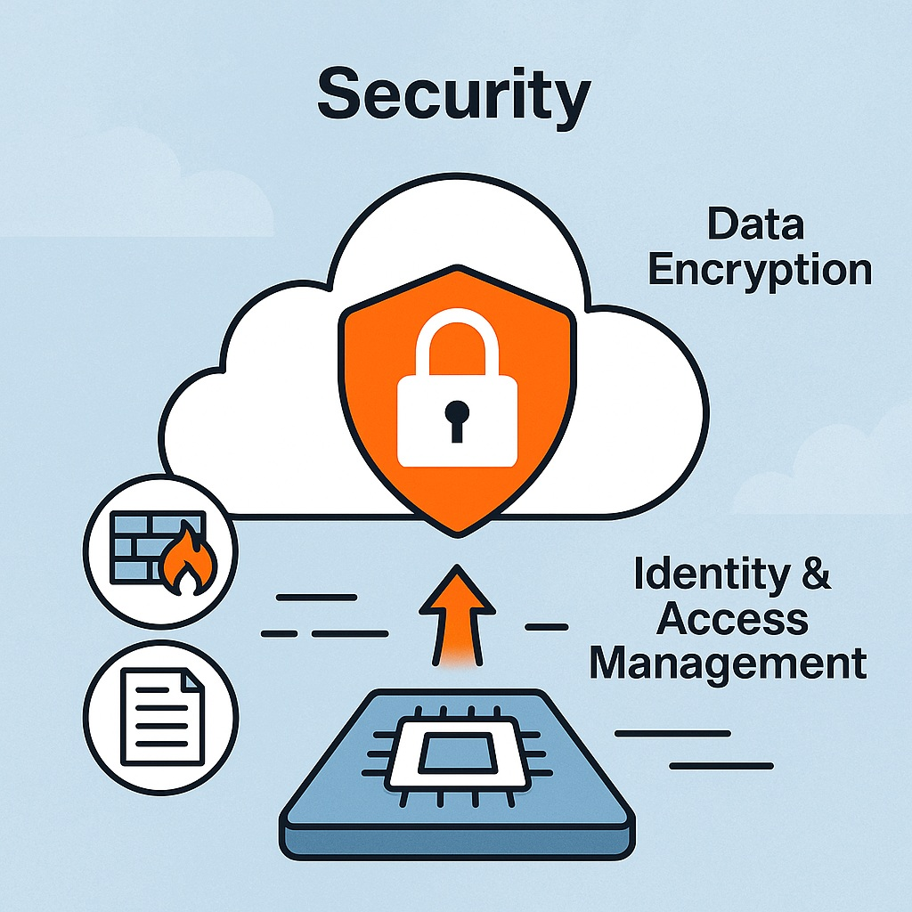

# 1 Hướng dẫn về Bảo mật (Security) trên AWS

Domain Security chiếm khoảng 24% số câu hỏi trong đề thi AWS CCP (Certified Cloud Practitioner). Nắm vững kiến thức về bảo mật không chỉ giúp bạn đạt điểm cao mà còn là nền tảng vững chắc để xây dựng và bảo vệ hạ tầng trên đám mây.

## 1. Mô hình Trách nhiệm Chia sẻ (Shared Responsibility Model)

Đây là khái niệm cốt lõi về bảo mật trên AWS. Nó định nghĩa rõ ràng phần trách nhiệm của AWS và phần trách nhiệm của bạn (khách hàng).

*   **AWS Chịu trách nhiệm về "Security of the Cloud":**
    *   AWS đảm bảo an toàn cho hạ tầng cơ bản cung cấp dịch vụ cloud.
    *   Bao gồm: Bảo trì và bảo mật vật lý các trung tâm dữ liệu (data center), phần cứng server, hạ tầng mạng vật lý.
    *   AWS cũng lo các tác vụ cấp thấp như cập nhật firmware, bảo vệ vật lý (khóa cửa, camera giám sát).
*   **Bạn Chịu trách nhiệm về "Security in the Cloud":**
    *   Bạn chịu trách nhiệm bảo mật CỦA các tài nguyên bạn triển khai và quản lý TRONG đám mây AWS.
    *   Bao gồm:
        *   Cấu hình và bảo trì hệ điều hành (OS) và ứng dụng (ví dụ: cập nhật bản vá lỗi (patch), cấu hình tường lửa trên EC2 instance).
        *   Quản lý dữ liệu của bạn, bao gồm mã hóa (encryption) và sao lưu (backup).
        *   Cấu hình bảo mật mạng ảo (VPC, Security Groups, Network ACLs).
        *   Quản lý quyền truy cập người dùng và dịch vụ bằng IAM (Identity and Access Management).

## 2. IAM - Identity & Access Management

IAM là dịch vụ quản lý danh tính và quyền truy cập trên AWS.

*   **Các Thành phần chính:**
    *   **User:** Đại diện cho người dùng hoặc ứng dụng cần truy cập vào AWS.
    *   **Group:** Gom nhiều User lại với nhau để quản lý quyền dễ dàng hơn (gán Policy cho Group). Ví dụ: Group `Developers`, Group `Operations`.
    *   **Role:** Được gán cho các dịch vụ AWS (như EC2, Lambda) hoặc cho người dùng/ứng dụng cần tạm thời có quyền truy cập vào các tài nguyên AWS khác. Sử dụng **IAM Instance Profile** để gán Role cho EC2 instances. Role không có credentials dài hạn như User.
*   **Policy JSON:**
    *   Được viết bằng định dạng JSON để định nghĩa các quyền (permissions).
    *   Bao gồm các yếu tố:
        *   `Effect`: `Allow` (cho phép) hoặc `Deny` (từ chối). `Deny` luôn ưu tiên hơn `Allow`.
        *   `Action`: Hành động được phép/từ chối (ví dụ: `s3:GetObject`, `ec2:RunInstances`).
        *   `Resource`: Tài nguyên bị ảnh hưởng bởi Action (ví dụ: `arn:aws:s3:::my-bucket/*`, `*`).
    *   Có thể giới hạn phạm vi (scope-down) bằng các điều kiện (`Condition`) dựa trên IP nguồn, yêu cầu xác thực đa yếu tố (MFA), thời gian, v.v...
*   **Các Thực tiễn Tốt nhất (Best Practices):**
    *   Luôn bật **MFA (Multi-Factor Authentication)** cho tài khoản Root và tất cả các user có đặc quyền (privileged users).
    *   Thường xuyên kiểm tra và xóa các Access Keys không còn sử dụng để giảm thiểu bề mặt tấn công (attack surface).
    *   Sử dụng **AWS Organizations** để quản lý nhiều tài khoản AWS của bạn. Áp dụng **SCP (Service Control Policies)** ở cấp độ Organization để đặt ra giới hạn quyền tối đa cho các tài khoản con.

## 3. Mã hóa & Quản lý Khóa (Encryption & Key Management)

Mã hóa là cách bảo vệ dữ liệu cả khi đang lưu trữ (at rest) và khi đang truyền tải (in transit).

*   **SSE-S3 (Server-Side Encryption – S3 Managed Keys):**
    *   Mã hóa dữ liệu ở phía server khi lưu vào S3.
    *   AWS quản lý khóa mã hóa hoàn toàn tự động.
    *   Dễ thiết lập, không có thêm chi phí riêng cho dịch vụ quản lý khóa (KMS).
*   **SSE-KMS (Server-Side Encryption with KMS):**
    *   Mã hóa dữ liệu ở phía server khi lưu vào S3 hoặc các dịch vụ AWS khác (EBS, RDS, Lambda,...).
    *   Sử dụng **CMK (Customer Master Key)** do bạn tạo và quản lý trong AWS KMS (Key Management Service).
    *   Bạn có toàn quyền kiểm soát các Policy cho CMK, cấu hình quay vòng khóa (rotation) tự động hoặc thủ công.
    *   Mọi lần sử dụng CMK (gọi các API như Encrypt, Decrypt) đều được ghi lại chi tiết trong AWS CloudTrail log.
*   **Client-Side Encryption:**
    *   Bạn tự mã hóa dữ liệu TRƯỚC KHI gửi nó đến AWS.
    *   Có thể sử dụng CMK từ KMS hoặc thư viện mã hóa (client library) của riêng bạn.
    *   Thích hợp cho dữ liệu cực kỳ nhạy cảm, nơi bạn muốn kiểm soát toàn bộ quá trình mã hóa/giải mã.

## 4. Bảo mật Mạng (Network Security)

Kiểm soát lưu lượng mạng đến và đi từ tài nguyên của bạn.

*   **Security Groups (SG):**
    *   Hoạt động như tường lửa ảo. Áp dụng trực tiếp (attach) vào EC2 instances hoặc các tài nguyên khác ở cấp độ instance (ví dụ: ENI).
    *   Là tường lửa **stateful**: khi bạn cho phép lưu lượng vào, lưu lượng phản hồi (reply) sẽ tự động được cho phép ra mà không cần cấu hình rule outbound riêng.
    *   **Best Practice:** Chỉ mở các port cần thiết (ví dụ: 80/443 cho web server, 22 cho SSH chỉ từ các địa chỉ IP đáng tin cậy).
    *   Rule outbound mặc định cho phép tất cả lưu lượng ra. Có thể cấu hình lại nếu cần hạn chế outbound.
*   **Network ACLs (NACL):**
    *   Hoạt động như tường lửa stateless. Áp dụng ở cấp độ mạng con (subnet).
    *   Là tường lửa **stateless**: bạn phải cấu hình rule riêng cho cả lưu lượng vào và ra (inbound/outbound).
    *   Xử lý các luật theo thứ tự (order) từ số Rule thấp đến cao.
    *   Có cả luật `ALLOW` và `DENY`. **Rule `DENY` có độ ưu tiên cao hơn `ALLOW`** và được đánh giá trước nếu số thứ tự Rule là như nhau (mặc dù thường các Rule DENY được đặt số thấp hơn).
    *   Dùng như một lớp bảo vệ bổ sung bên ngoài Security Group.
*   **Private/Public Subnet:**
    *   **Public Subnet:** Có Default Gateway ra Internet (qua Internet Gateway - IGW). Phù hợp cho web server, load balancer.
    *   **Private Subnet:** Không có Default Gateway ra Internet. Phù hợp cho các tài nguyên nhạy cảm như database (RDS), cache (ElastiCache), backend servers.
    *   Sử dụng **NAT Gateway** hoặc **NAT Instance** trong Public Subnet để cho phép các tài nguyên trong Private Subnet truy cập Internet (ví dụ: để tải cập nhật phần mềm) nhưng ngăn Internet truy cập trực tiếp vào chúng (egress internet).

## 5. Bảo vệ chống DDoS & Web Application Firewall (WAF)

*   **AWS Shield Standard (Miễn phí):**
    *   Cung cấp bảo vệ cơ bản, tự động chống lại các cuộc tấn công từ chối dịch vụ phân tán (DDoS) phổ biến ở Layer 3 (network) và Layer 4 (transport), như tấn công SYN/UDP floods.
    *   Áp dụng cho các dịch vụ như EC2, ELB, CloudFront, Route 53.
*   **AWS Shield Advanced (Tính phí):**
    *   Cung cấp bảo vệ nâng cao chống lại các cuộc tấn công DDoS phức tạp hơn.
    *   Bao gồm hỗ trợ 24/7 từ Đội ngũ phản hồi DDoS (DDoS Response Team - DRT) của AWS.
    *   Bảo vệ bổ sung cho EC2, ELB, CloudFront, Route 53, Global Accelerator.
*   **AWS WAF (Web Application Firewall):**
    *   Tường lửa cấp ứng dụng web (Layer 7).
    *   Cho phép bạn tạo các luật (rule-based firewall) để chặn các kiểu tấn công phổ biến vào ứng dụng web như SQL Injection (SQLi), Cross-Site Scripting (XSS).
    *   Tích hợp với Amazon CloudFront, Application Load Balancer (ALB) hoặc API Gateway.
    *   Có thể giám sát dựa trên tốc độ requests (rate-based), tạo danh sách đen/trắng các địa chỉ IP (IP blacklist/whitelist).

## 6. Kiểm tra & Giám sát (Audit & Monitoring)

*   **AWS CloudTrail:**
    *   Ghi lại hoạt động của người dùng và API calls trên tài khoản AWS của bạn.
    *   Ghi lại mọi hành động "who, what, when, where" (ai, làm gì, khi nào, ở đâu) thực hiện trên các tài nguyên AWS (ví dụ: `CreateBucket`, `DeleteInstance`, `UpdateSecurityGroup`).
    *   Lưu trữ log trong S3 bucket. Có thể phân tích log bằng Amazon Athena hoặc phân vùng log theo Region để truy vấn hiệu quả hơn.
*   **AWS Config:**
    *   Theo dõi, ghi lại và đánh giá các thay đổi cấu hình của các tài nguyên AWS theo thời gian.
    *   Giúp phát hiện sự sai lệch cấu hình (drift) so với các chính sách hoặc tiêu chuẩn tuân thủ (compliance) của bạn.
    *   Có thể kết hợp với **AWS Config Rules** (Managed Rules do AWS cung cấp hoặc Custom Rules do bạn tự tạo) để tự động kiểm tra và thực thi tuân thủ cấu hình.
*   **Amazon Inspector:**
    *   Là một dịch vụ đánh giá bảo mật tự động.
    *   Quét các lỗ hổng bảo mật trên EC2 instances (ví dụ: các lỗ hổng CVE đã biết, kiểm tra tuân thủ các tiêu chuẩn CIS benchmarks).
    *   Có thể cấu hình để quét tự động theo lịch hoặc theo yêu cầu (on-demand).

**Kết luận:**

Bảo mật trên AWS là trách nhiệm chung. Nắm vững mô hình trách nhiệm chia sẻ và các dịch vụ bảo mật của AWS là yếu tố then chốt để bảo vệ ứng dụng và dữ liệu của bạn hiệu quả, đồng thời giúp bạn tự tin vượt qua phần thi Security trong AWS CCP.