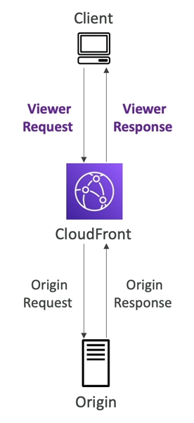

# 1  Tại sao lại dùng AWS Lambda
AWS Lambda mang lại một số lợi thế nhất định khi so với cách sử dụng các EC2 instance truyền thống:
- EC2 Instance:
    - Là máy chủ ảo trong đám mây.
    - Bị giới hạn bởi RAM và CPU.
    - Phải liên tục chạy.
    - Scale đồng nghĩa là phải thêm hoặc bớt số lượng máy chủ.
- Lambda:
    - Là các hàm ảo - không cần quản lý máy chủ.
    - Bị giới hạn thời gian - chủ yếu dùng khi cần xử lý trong thời gian ngắn.
    - Chạy theo yêu cầu.
    - Scale một cách tự động.
## Lợi thế của việc sử dụng AWS Lambda
- Dễ dàng định giá:
    - Trả theo mỗi request và thời gian tính toán.
    - Free tier cho 1,000,000 request và 400,000GBs tính toán.
- Tương thích rất nhiều AWS service khác.
- Hỗ trợ nhiều ngôn ngữ lập trình khác nhau.
- Dễ dàng để theo dõi thông qua AWS CloudWatch.
- Dễ dàng có thêm tài nguyên để chạy hàm (lên tới 10GB RAM).

## Một số dịch vụ tương thích với AWS Lambda.
- API Gateway: Tạo REST API để gọi Lambda Function.
- Kinesis: Sử dụng Lambda để thực hiện một số bước chuyển hóa dữ liệu trong khi truyền tải.
- DynamoDB: Sử dụng Lambda để tạo một số trigger để mà khi có một số thay đổi nào đó trong DB thì lamda function sẽ chạy.
- S3: Trigger Lambda Function khi có một sự kiện nào đó xảy ra.
- Cloudfront: có dịch vụ Lambda@edge.
- CloudWatchEvents / EventBridge: Bất kì thay đổi nào xảy ra trong hệ thống sẽ được ghi nhận và gọi đến Lambda function nếu cần thiết.
- Cloudwatch Logs: Stream các log này đến nơi mà chúng ta cần.
- SNS: Phản ứng lại một thông báo xảy ra trong SNS Topic.
- SQS: Xử lý message từ SQS Queue.
- Cognito: Phản ứng lại hành vi mỗi khi có một user đăng nhập vào DB.

# 2  Một số giới hạn của AWS Lambda
- Về quá trình chạy:
    - Cấp phát bộ nhớ: 128MB - 10GB. (Mỗi lần tăng 1MB)
    - Thời gian chạy tối đa là 900 giây hay 15 phút.
    - 4KB lưu trữ cho biến môi trường.
    - Dung lượng đĩa trong "function container" (cụ thể là ở /tmp) là 512MB - 10GB.
    - 1000 tính toán đồng thời (có thể tăng lên nếu muốn)
- Về việc triển khai:
    - Kích thước để triển khai lambda function khi nén thành file .zip là 50MB.
    - Kích thước để triển khai lambda function khi giải nén là 250MB.
    - Có thể sử dụng thư mục /tmp để tải một số file khác khi khởi động.
    - 4KB cho biến môi trường.
# 3 Lambda Snapstart
- Là tính năng giúp cho việc thực thi hàm nhanh hơn gấp 10 lần với đới Java 11 trở lên.
- Khi tính năng này được bật, hàm được gọi từ trạng thái "được khởi tạo trước" (không cần phải khởi tạo hàm).
- Khi chúng ta xuất bản một phiên bản mới:
    - Lambda khởi tạo hàm.
    - Lưu trữ lại một bản snapshot của hàm, bộ nhớ và trạng thái ổ đĩa.
    - Bản snapshot này được cache để có thể truy cập với độ trễ thấp.
    
# 4  Lambda@Edge & Cloudfront Function
- Nhiều hệ thống hiện đại sẽ có nhu cầu thực hiện một số tác vụ tính toán logic tại các edge trước khi gửi đến chương trình cuối. Đây gọi là các **Edge Function**.
- Edge Function:
    - Là đoạn mã mà chúng ta sẽ viết rồi đính kèm nó vào CloudFront distribution.
    - Mục tiêu viết các hàm logic mà được thực thi ở gần vị trí của người dùng nhất có thể để giảm tối đa độ trễ.
- Cloudfront có hai loại function: **Cloudfront function** và **Lambda@Edge**
- Với việc sử dụng **Edge function**, chúng ta không cần phải quản lý server để chạy nó, cũng như có thể triển khai trên toàn cầu.
- Use case: tùy chỉnh lại nội dung CDN.

## Cloudfront Function
Đầu tiên, chúng ta hãy xem xét luồng request thông thường của Cloudfront diễn ra như thế nào.
- Người dùng gửi request đến Cloudfront (còn gọi là Viewer request).
- Cloudfront tạo một Origin request đến server gốc.
- Server sẽ phản hồi Origin request và trả về Origin Resposne.
- Cloudfront nhận  Origin Response rồi trả về kết quả cho người dùng (còn gọi là viewer resposne).

Trong khi đó, các Cloudfront function:
- Là các lightweight functionn được viết bằng JavaScript.
- Dùng khi cần điều chỉnh CDN để phục vụ các tính năng cần scale cao, nhạy cảm với độ trễ.
- Khởi động chỉ trong vài mili giây và có thể xử lý hàng triệu request mỗi giây.
- Được sử dụng chủ yếu để thay đổi nội dung của Viewer Request và Viewer Response.
- Là tính năng gốc của Cloudfront (nghĩa là việc quản lý code hoàn toàn bên trong Cloufront).

## Lambda@Edge
- Lambda Function được viết bằng NodeJS hoặc Python.
- Có thể hỗ trợ đến hàng ngàn request mỗi giây.
- Dùng để thay đổi Cloudfront request/response:
    - Thay đổi cả Viewer Request và Origin Request.
    - Thay đổi cả Viewer Response và Origin Response.
- Chúng ta viết function tại một AWS region, rồi sau đó Cloudfront sẽ replica function này đến các Cloudfront distribution.

## Trường hợp sử dụng

### Cloudfront Function
- Chuẩn hóa cache key
    - Thực hiện chuyển đổi các thuộc tính của request (header, cookies, query string, URL) để tạo ra được các cache key tối ưu.
- Thay đổi header
    - Thêm/chỉnh sửa/xóa một số HTTP Header trong request hoặc response.
- Viết lại URL hoặc redirect
- Xác thực và phân quyền request.
    - Tạo và xác thực các token (như JWT) để cho phép hoặc từ chối request.

### Lambda@Edge
- Các tác vụ có thời gian thực thi lâu hơn (trong vài ms).
- Các tác vụ có thể cần thay đổi CPU và memory.
- Mã phụ thuộc vào SDK hoặc thư viện bên thứ 3.
- Cần truy cập mạng để sử dụng thêm một số dịch vụ bên ngoài.
- Cần truy cập vào file system hoặc body của HTTP request.