# 1) Top 10 Giải pháp Thay thế Doofinder hàng đầu năm 2025 [Kèm đánh giá từ người dùng thực]
Sponsor by https://www.meilisearch.com/blog/doofinder-alternatives?ref=dailydev

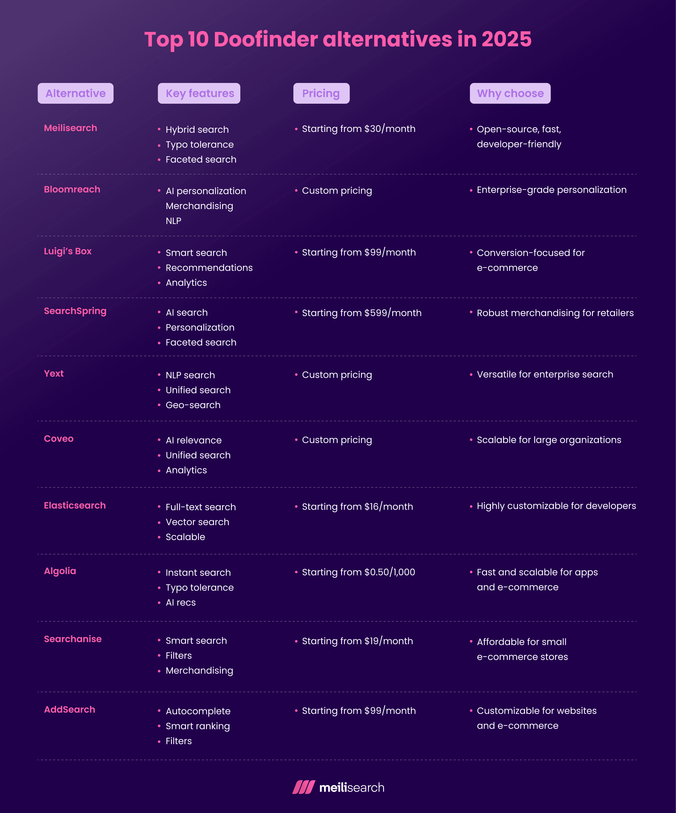

*Bài viết được dịch và biên soạn lại từ bài viết gốc của Ilia Markov trên freestar, với đánh giá từ người dùng thực.*

Doofinder đã tạo dựng được một chỗ đứng vững chắc trong lĩnh vực tìm kiếm cho thương mại điện tử, nhưng nó không phải là lựa chọn hoàn hảo cho tất cả mọi người. Từng là một nhà cung cấp dịch vụ tìm kiếm (search-as-a-service) hàng đầu, ngày càng có nhiều người dùng đang chuyển đi - và có lý do chính đáng. Ví dụ, người dùng trên Trustpilot đã nhiều lần báo cáo rằng dịch vụ khách hàng của họ đang trở nên lỏng lẻo và "lượt tìm kiếm hết quá nhanh."

Ngược lại, các giải pháp thay thế Doofinder thường cung cấp hỗ trợ khách hàng tốt hơn, hiệu suất tìm kiếm vượt trội, giá cả phải chăng hơn, hoặc khả năng tùy chỉnh cao hơn. Một số lựa chọn thay thế Doofinder tốt nhất bao gồm: Meilisearch, Bloomreach, Luigi’s Box, SearchSpring, Yext, Coveo, Elasticsearch, Algolia, Searchanise, và AddSearch.

Để chọn giải pháp thay thế Doofinder tốt nhất, hãy xem xét các yếu tố như giá cả, khả năng mở rộng (scalability), mức độ dễ sử dụng và khả năng tích hợp để phù hợp với nhu cầu thương mại điện tử hoặc ứng dụng của bạn. Dù bạn ưu tiên sự linh hoạt của mã nguồn mở hay các tính năng cấp doanh nghiệp, đều có lựa chọn phù hợp.

*(Lưu ý: Bài viết gốc có bao gồm một bảng so sánh tổng quan. Do hạn chế về định dạng, bảng này không được hiển thị trực tiếp tại đây. Bạn có thể tham khảo hình ảnh trong bài viết gốc để có cái nhìn trực quan.)*

Hãy cùng đi sâu vào lý do người dùng chuyển từ Doofinder và khám phá 10 giải pháp thay thế hàng đầu cho năm 2025, dựa trên thông tin chi tiết từ người dùng thực trên G2.

## Tại sao mọi người chuyển từ Doofinder?

Điểm mạnh của Doofinder nằm ở khả năng cài đặt nhanh chóng (plug-and-play) và tập trung vào thương mại điện tử, nhưng nó không phải là không có khuyết điểm.

Các đánh giá trên G2 làm nổi bật các vấn đề thường gặp, chẳng hạn như chi phí cao, khả năng tùy chỉnh phức tạp và dịch vụ hỗ trợ khách hàng chưa đáp ứng kỳ vọng:

*   **Charles R.** nhận xét: "Giá, với tư cách là một công cụ bổ trợ, quá đắt một cách phi lý. Đây là lý do chúng tôi ngừng sử dụng nó. Nếu giá hợp lý hơn, chúng tôi đã tiếp tục sử dụng Doofinder."
*   Tương tự, một người dùng trong ngành hàng tiêu dùng nhận thấy rằng "Bộ phận Hỗ trợ làm việc chậm và mất thời gian để giải quyết vấn đề." Điều này, cùng với khó khăn của một số người dùng trong việc thiết lập ban đầu, đã khiến nó bị coi là "thiếu thân thiện với khách hàng."

Nhược điểm lớn nhất được báo cáo thường xuyên nhất là giá cả leo thang, đặc biệt đối với các doanh nghiệp nhỏ. Một số người dùng bày tỏ sự thất vọng với việc tùy chỉnh chức năng tìm kiếm, lưu ý rằng nó có một đường cong học tập (learning curve), đặc biệt nếu bạn không am hiểu về công nghệ.

Những vấn đề này thúc đẩy người dùng tìm kiếm các giải pháp thay thế cung cấp giá cả phải chăng hơn, khả năng tùy chỉnh dễ dàng hơn hoặc hỗ trợ khách hàng tốt hơn. Thị trường đầy rẫy các lựa chọn về khả năng mở rộng, tính linh hoạt của mã nguồn mở hoặc các tính năng cấp doanh nghiệp.

Hãy cùng khám phá 10 giải pháp thay thế Doofinder hàng đầu đang tạo nên tiếng vang vào năm 2025.

## Top 10 Giải pháp Thay thế Doofinder năm 2025

### 1. Meilisearch

Meilisearch là một công cụ tìm kiếm mã nguồn mở cực nhanh, cung cấp kết quả trực quan và liên quan với thiết lập tối thiểu. Được xây dựng dành cho các nhà phát triển, nó là lựa chọn yêu thích cho những ai tìm kiếm một giải pháp linh hoạt, lấy người dùng làm trung tâm, dễ dàng tích hợp vào trang web, ứng dụng hoặc nền tảng thương mại điện tử. Nó được trang bị các chức năng tìm kiếm kết hợp (hybrid search) và được hỗ trợ bởi AI, kết hợp khả năng tìm kiếm toàn văn (full-text) và ngữ nghĩa (semantic) để đạt tốc độ và mức độ liên quan tối đa.

*   **Tính năng nổi bật:**
    *   **Hybrid Search:** Kết hợp tìm kiếm toàn văn và ngữ nghĩa cho kết quả rất liên quan.
    *   **Search-as-you-type:** Cung cấp kết quả dưới 50 mili giây.
    *   **Typo Tolerance:** Xử lý lỗi chính tả, đảm bảo kết quả chính xác.
    *   **Faceted Search:** Người dùng có thể lọc kết quả theo thuộc tính (ví dụ: giá, danh mục) dễ dàng.
    *   **Security Management:** Quản lý quyền truy cập API key chi tiết.
*   **Giá:** Có phiên bản mã nguồn mở miễn phí. Meilisearch Cloud cung cấp các gói trả phí từ $30/tháng (Build), $300/tháng (Grow), và gói Enterprise tùy chỉnh. Có bản dùng thử miễn phí 14 ngày.
*   **Tích hợp:** Tích hợp dễ dàng với các ngôn ngữ, framework, nền tảng phổ biến qua REST API và SDKs (JavaScript, Python, Ruby...). Hỗ trợ LangChain cho ứng dụng AI, CMS như WordPress, Shopify (qua thiết lập tùy chỉnh).
*   **Ưu điểm (theo G2):** Tốc độ, hiệu suất, dễ tích hợp (đặc biệt với Laravel), dashboard cloud thân thiện.
*   **Nhược điểm (theo G2):** Dashboard còn cơ bản, phân tích tìm kiếm chưa sâu cho các trường hợp nâng cao.
*   **Phù hợp với:** Nhà phát triển & Startup, doanh nghiệp thương mại điện tử, nền tảng SaaS.
*   **Lý do chọn Meilisearch:** Nổi bật với tính linh hoạt mã nguồn mở, tốc độ cực nhanh, và thiết kế thân thiện với nhà phát triển. Là lựa chọn hàng đầu cho doanh nghiệp muốn giải pháp tìm kiếm hiệu quả chi phí, tùy chỉnh cao mà không chịu giá đắt của Doofinder.

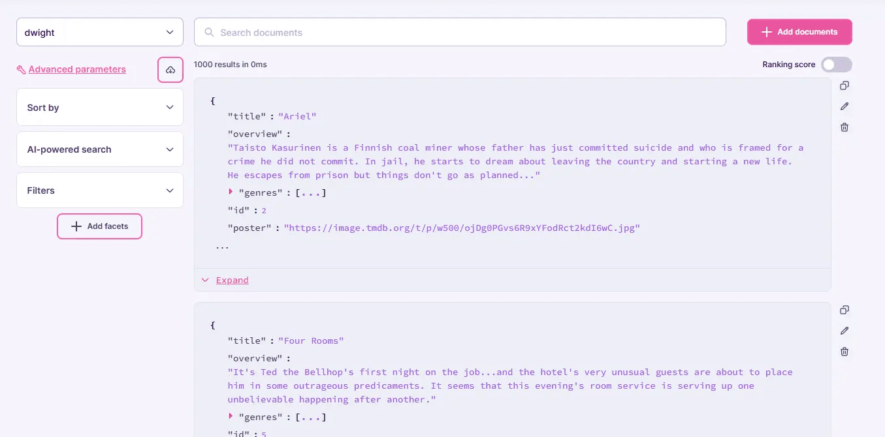

### 2. Bloomreach

Bloomreach là nền tảng dựa trên AI tập trung vào cá nhân hóa thương mại điện tử, kết hợp tìm kiếm, merchandising (trưng bày sản phẩm) và đề xuất để tăng tỷ lệ chuyển đổi. Là một công cụ mạnh mẽ cho nhà bán lẻ muốn tạo trải nghiệm mua sắm tùy chỉnh trên nhiều kênh.

*   **Tính năng nổi bật:**
    *   **Autonomous marketing automation:** Hợp nhất dữ liệu và cá nhân hóa trải nghiệm người dùng.
    *   **GenAI product discovery:** Tự động thúc đẩy tìm kiếm, học hỏi từ hành vi người dùng.
    *   **Agentic AI shopping:** Cải thiện điều hướng người dùng, đưa họ đến đúng thứ họ muốn.
*   **Giá:** Giá tùy chỉnh (gồm phí module và phí sử dụng), liên hệ bán hàng để báo giá. Có bản demo, không quảng cáo dùng thử miễn phí.
*   **Tích hợp:** Phong phú, tích hợp với CRM (Shopify), CMS (Magento), ERP (SAP), công cụ phân tích (Segment.io).
*   **Ưu điểm (theo G2):** Dễ sử dụng (ý kiến trái chiều), nhiều tính năng, hỗ trợ tốt.
*   **Nhược điểm (theo G2):** Chi phí không rõ ràng và có thể cao, phức tạp trong tích hợp ban đầu và một số tính năng.
*   **Phù hợp với:** Nhà bán lẻ lớn (đa kênh), đội ngũ marketing, thương hiệu toàn cầu (hỗ trợ đa ngôn ngữ).
*   **Lý do chọn Bloomreach:** Xuất sắc cho doanh nghiệp lớn cần cá nhân hóa và phân tích phức tạp, dù chi phí và độ phức tạp có thể là rào cản cho doanh nghiệp nhỏ.

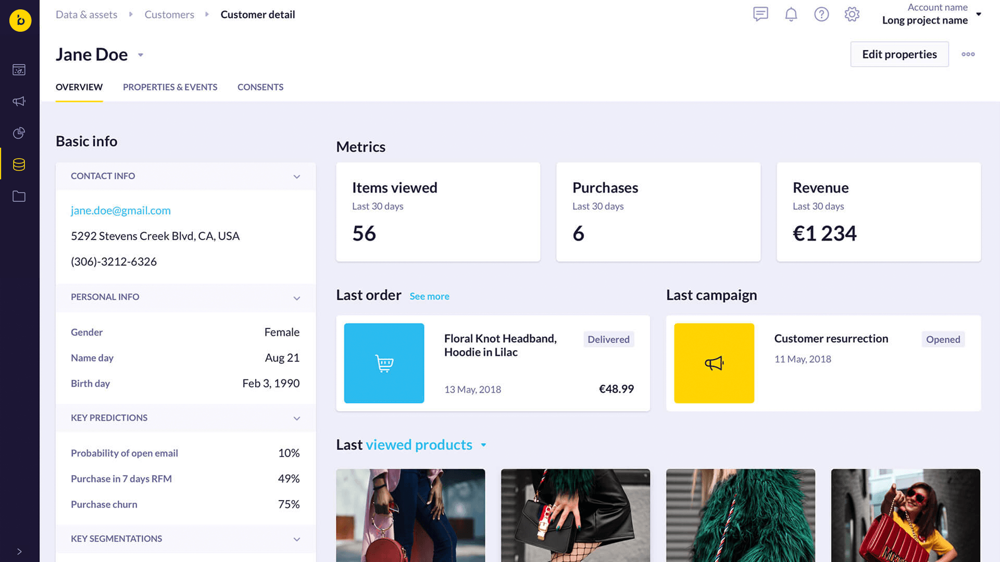

### 3. Luigi’s Box

Luigi’s Box là công cụ tìm kiếm và khám phá sản phẩm dựa trên AI, được xây dựng đặc biệt cho thương mại điện tử. Tập trung vào kết quả cá nhân hóa và khả năng tìm sản phẩm liền mạch, đồng thời ưu tiên sự thân thiện với người dùng và chuyển đổi.

*   **Tính năng nổi bật:**
    *   **Advanced AI-powered search:** Xử lý lỗi chính tả, từ đồng nghĩa để giảm tỷ lệ thoát và tăng chuyển đổi.
    *   **Personalized product recommendations:** Đề xuất sản phẩm liên quan dựa trên hành vi người dùng.
    *   **Analytics dashboard:** Theo dõi hiệu suất tìm kiếm, xu hướng người dùng, đưa ra đề xuất.
    *   **AI merchandising and product listing:** Ưu tiên sản phẩm có lợi nhuận cao, tăng mức độ liên quan kết quả tìm kiếm.
*   **Giá:** Không có giá chính xác và không có phiên bản miễn phí. Gói tự tích hợp có dùng thử 30 ngày. Có giá Enterprise tùy chỉnh.
*   **Tích hợp:** Kết nối với Shopify, WooCommerce, Magento, PrestaShop.
*   **Ưu điểm (theo G2):** Rất dễ sử dụng, khả năng tùy chỉnh cao cho e-commerce, hỗ trợ đáng tin cậy.
*   **Nhược điểm (theo G2):** Thiếu linh hoạt cho các trường hợp không phải bán lẻ, giá cao (không phù hợp doanh nghiệp nhỏ), cài đặt ban đầu phức tạp.
*   **Phù hợp với:** Cửa hàng trực tuyến, nhà bán lẻ SMB, merchandiser.
*   **Lý do chọn Luigi’s Box:** Lựa chọn mạnh mẽ cho doanh nghiệp thương mại điện tử muốn giải pháp tìm kiếm dễ dùng, hướng tới chuyển đổi.

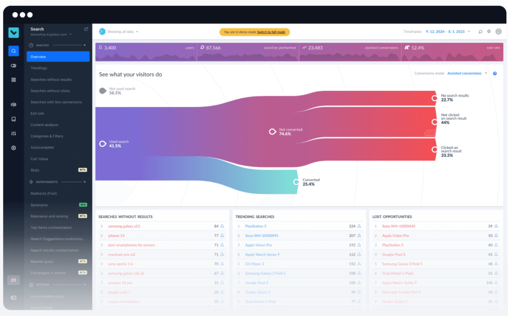

### 4. SearchSpring

SearchSpring là một tên tuổi lớn khác trong lĩnh vực tìm kiếm và merchandising cho thương mại điện tử. Được thiết kế để cung cấp trải nghiệm mua sắm cá nhân hóa, là lựa chọn hàng đầu cho nhà bán lẻ muốn tối ưu hóa việc khám phá sản phẩm.

*   **Tính năng nổi bật:**
    *   **Generative discovery:** Dự đoán và dựa trên ý định người dùng để đưa ra kết quả tìm kiếm.
    *   **Data feed management:** Đảm bảo thông tin sản phẩm hiển thị trên hơn 1400 kênh.
    *   **On-site search:** Kết hợp tìm kiếm ngữ nghĩa và search-as-you-type.
    *   **Marketplace management:** Hợp nhất tồn kho, dữ liệu bán hàng, đồng bộ sản phẩm trên các marketplace bên thứ ba và kênh social commerce.
    *   **Predictive product bundling:** Sử dụng AI để đề xuất các gói sản phẩm (bundle) phù hợp.
*   **Giá:** Giá dựa trên khối lượng, bắt đầu từ $699/tháng cho gói cơ bản nhất. Có thể yêu cầu demo, không có dùng thử.
*   **Tích hợp:** Tích hợp với tất cả các nền tảng thương mại điện tử lớn (Shopify, BigCommerce, Magento, Shopware).
*   **Ưu điểm (theo G2):** Linh hoạt (tùy chỉnh, cá nhân hóa, tích hợp), nhiều tính năng mạnh mẽ (phân tích nâng cao, quản lý tồn kho marketplace, AI search), hỗ trợ tuyệt vời.
*   **Nhược điểm (theo G2):** Đắt đỏ (ngay cả gói cơ bản), phức tạp (đường cong học tập cao, đặc biệt cài đặt ban đầu), hạn chế cho các trường hợp sử dụng khác.
*   **Phù hợp với:** Nhà bán lẻ cỡ vừa (ngân sách trung bình đến cao), đội ngũ merchandising, nền tảng thương mại điện tử.
*   **Lý do chọn SearchSpring:** Lý tưởng cho nhà bán lẻ cần merchandising mạnh mẽ và cá nhân hóa, dù giá có thể là rào cản cho doanh nghiệp nhỏ.

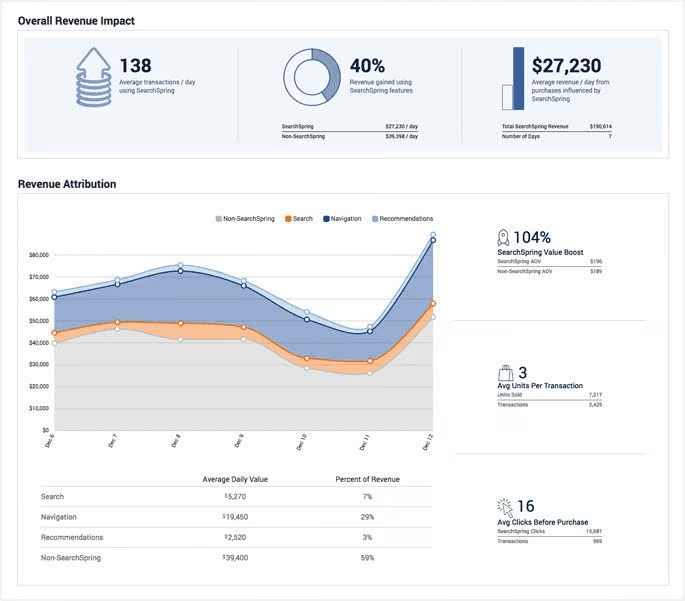

### 5. Yext

Yext là nền tảng hàng đầu về hiện diện kỹ thuật số và trải nghiệm người dùng, với khả năng tìm kiếm mạnh mẽ dựa trên AI. Được xây dựng cho các thương hiệu đa địa điểm trên toàn thế giới, tập trung vào việc cung cấp câu trả lời liên quan cho các truy vấn tìm kiếm trên trang web và ứng dụng.

*   **Tính năng nổi bật:**
    *   **Search merchandiser:** Giao diện kéo thả, click-and-point cho phép tùy chỉnh và xem trước kết quả.
    *   **Search term analysis & clustering:** Phân tích dữ liệu tìm kiếm để phát hiện mẫu, tối ưu trải nghiệm.
    *   **Multi-algorithm strategy:** Sử dụng nhiều thuật toán thay vì chỉ từ khóa để tìm kết quả liên quan nhất.
    *   **Filters, facets, and sorting:** Tinh chỉnh kết quả với bộ lọc, faceting và sắp xếp.
*   **Giá:** Giá tùy chỉnh bí ẩn, liên hệ bán hàng. Có bản demo, không quảng cáo dùng thử miễn phí.
*   **Tích hợp:** Kết nối với Salesforce, HubSpot, Shopify, WordPress, Google Cloud.
*   **Ưu điểm (theo G2):** Linh hoạt (quản lý hiện diện kỹ thuật số và tìm kiếm), đa nền tảng, dễ sử dụng.
*   **Nhược điểm (theo G2):** Hỗ trợ còn yếu, chi phí cao (không rõ ràng ban đầu), khó quản lý (với người chỉ cần tính năng cụ thể).
*   **Phù hợp với:** Doanh nghiệp lớn (ngân sách lớn, nhu cầu tìm kiếm quy mô lớn), thương hiệu đa kênh, đội ngũ hỗ trợ khách hàng.
*   **Lý do chọn Yext:** Lựa chọn cao cấp cho doanh nghiệp lớn cần tìm kiếm dựa trên AI linh hoạt trên các ứng dụng marketing, hỗ trợ, và thương mại điện tử.

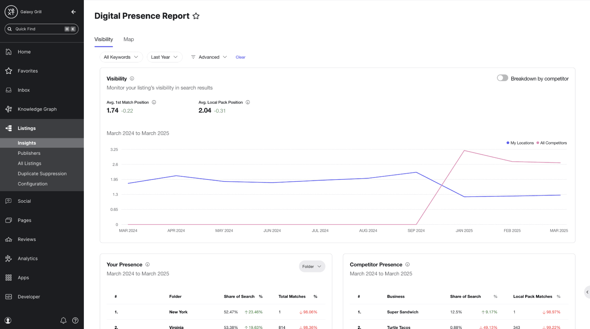

### 6. Coveo

Coveo là nền tảng tìm kiếm cấp doanh nghiệp, sử dụng AI để cung cấp kết quả cá nhân hóa, liên quan trên trang web, mạng nội bộ (intranet) và ứng dụng. Được xây dựng cho các tổ chức lớn với nhu cầu phức tạp.

*   **Tính năng nổi bật:**
    *   **AI Relevance:** Hiểu ý định người dùng, điều chỉnh faceting để cho kết quả liên quan, chính xác.
    *   **Predictive, unified search:** Lập chỉ mục nhiều nguồn nội dung, cung cấp câu trả lời liên quan nhất.
    *   **Constant optimization:** Sử dụng machine learning, tiền xử lý văn bản để liên tục cải thiện tìm kiếm.
    *   **Smart access management:** Quản lý quyền truy cập ở cấp độ index.
*   **Giá:** Giá tùy chỉnh cho 2 gói (Pro, Enterprise). Có bản demo và dùng thử miễn phí 14 ngày.
*   **Tích hợp:** Tích hợp với Salesforce, ServiceNow, Shopify, Slack, Microsoft Dynamics.
*   **Ưu điểm (theo G2):** Khả năng tùy chỉnh cao (mô hình quyền, hiển thị nội dung), dễ sử dụng giao diện quản trị, hỗ trợ tốt.
*   **Nhược điểm (theo G2):** Chi phí cao (không phù hợp doanh nghiệp nhỏ), phức tạp (giao diện admin), lập chỉ mục chậm (có thể mất đến 6 giờ).
*   **Phù hợp với:** Doanh nghiệp lớn (nhu cầu tìm kiếm phức tạp đa nền tảng), đội ngũ dịch vụ khách hàng, tìm kiếm đa nguồn.
*   **Lý do chọn Coveo:** Lựa chọn hàng đầu cho doanh nghiệp lớn cần tìm kiếm dựa trên AI có khả năng mở rộng trên nhiều nguồn và nền tảng.

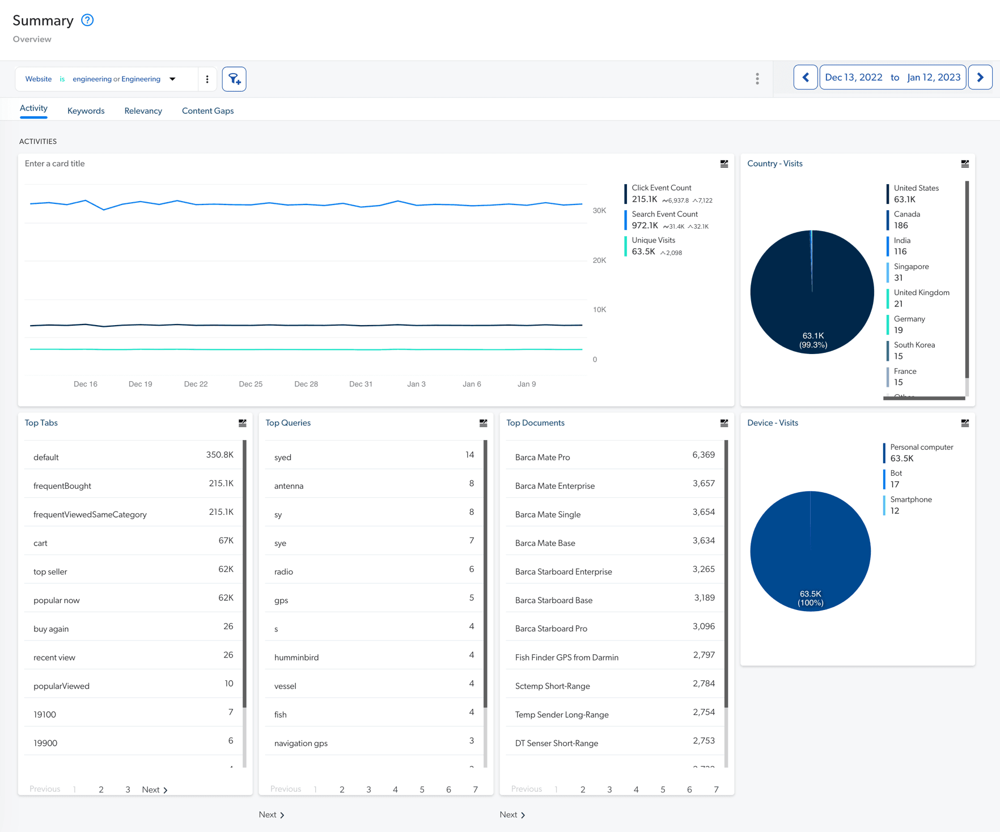

### 7. Elasticsearch

Elasticsearch là công cụ tìm kiếm và phân tích mã nguồn mở mạnh mẽ, được xây dựng trên Apache Lucene. Tự định nghĩa là hơn cả một công cụ tìm kiếm và phân tích, thêm vào "kho dữ liệu và cơ sở dữ liệu vector" cho một giải pháp tìm kiếm toàn diện.

*   **Tính năng nổi bật:**
    *   **AI-powered search relevance:** Tối ưu và cá nhân hóa trải nghiệm tìm kiếm trên tập dữ liệu lớn.
    *   **Natively run ML and vector search:** Đạt hiệu suất tìm kiếm vượt trội với mô hình dự đoán và xử lý ngôn ngữ tự nhiên hiện đại.
    *   **Serverless operations:** Tập trung xây dựng ứng dụng GenAI mà không cần quản lý hạ tầng.
    *   **Data ingestion tools:** Công cụ để trích xuất, kết nối và quản lý dữ liệu.
    *   **Search analytics:** Theo dõi và phân tích tương tác người dùng để cá nhân hóa và cải thiện trải kiếm.
*   **Giá:** Phiên bản mã nguồn mở miễn phí. Elastic Cloud (managed service) từ $95/tháng đến $175/tháng (Enterprise). Dùng thử 14 ngày.
*   **Tích hợp:** Tích hợp với Kibana, Logstash, Cloudflare, Salesforce, AWS.
*   **Ưu điểm (theo G2):** Tốc độ cực nhanh, giá cả phải chăng (hơn các lựa chọn khác), khả năng mở rộng tốt.
*   **Nhược điểm (theo G2):** Cài đặt phức tạp (đòi hỏi kiến thức kỹ thuật), tốn tài nguyên (CPU), đường cong học tập (hiểu cơ chế truy vấn, khắc phục sự cố).
*   **Phù hợp với:** Nhà phát triển & chuyên viên phân tích dữ liệu, giải pháp thương mại điện tử, doanh nghiệp mọi quy mô.
*   **Lý do chọn Elasticsearch:** Hoàn hảo cho những ai cần một công cụ tìm kiếm mã nguồn mở có khả năng tùy chỉnh cao và giá cả phải chăng.

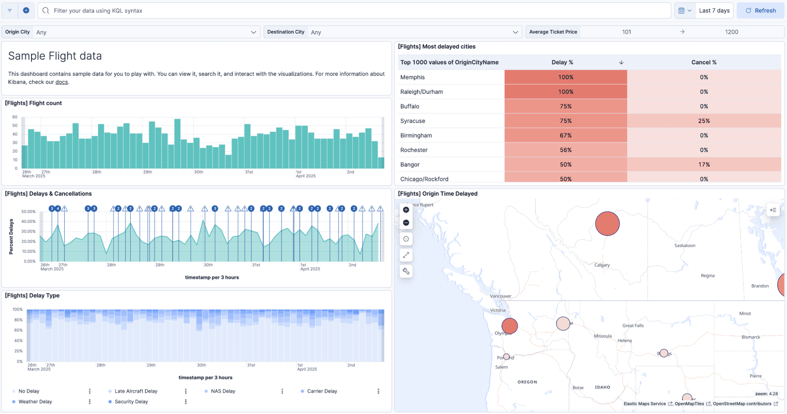

### 8. Algolia

Algolia là nền tảng search-as-a-service nổi tiếng về tốc độ và API thân thiện với nhà phát triển. Được sử dụng rộng rãi cho thương mại điện tử, truyền thông và tìm kiếm trong ứng dụng, xử lý 1.75 nghìn tỷ yêu cầu tìm kiếm mỗi năm.

*   **Tính năng nổi bật:**
    *   **Neural search:** Kết hợp tìm kiếm ngữ nghĩa và từ khóa.
    *   **Query Categorization:** Dự đoán và cung cấp kết quả liên quan nhất dựa trên ý định người dùng.
    *   **AI Ranking:** Tận dụng xu hướng hiện tại để tăng hiển thị nội dung liên quan.
    *   **Crawler:** Lập chỉ mục các trang web để dễ dàng tìm kiếm.
    *   **Instant search:** Kết hợp search-as-you-type, federated search và bộ lọc.
*   **Giá:** Gói Build miễn phí. Gói Grow trả theo mức sử dụng ($0.50/1000 yêu cầu tìm kiếm). Liên hệ bán hàng cho gói Premium và Elevate. Có bản demo cho các gói cao cấp.
*   **Tích hợp:** Tích hợp với nhiều ngôn ngữ (PHP, JavaScript, Ruby), nền tảng (Shopify, WordPress, Salesforce).
*   **Ưu điểm (theo G2):** Hiệu suất (kết quả, phân tích), dễ sử dụng (thiết kế index, trình chỉnh sửa trực quan), khả năng mở rộng tốt.
*   **Nhược điểm (theo G2):** Chi phí cao (không bền vững cho doanh nghiệp nhỏ), phức tạp (không hoàn toàn "no-code"), giới hạn (khó khăn khi cập nhật bản ghi).
*   **Phù hợp với:** Thương mại điện tử (tăng chuyển đổi từ dữ liệu khách hàng), ứng dụng di động, merchandiser.
*   **Lý do chọn Algolia:** Lựa chọn mạnh mẽ cho doanh nghiệp cần tìm kiếm nhanh, có khả năng mở rộng, tập trung vào thương mại điện tử và ứng dụng.

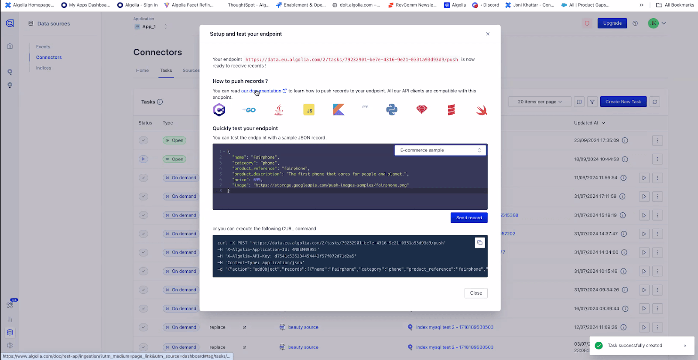

### 9. Searchanise

Searchanise là công cụ tìm kiếm thương mại điện tử được thiết kế để tăng chuyển đổi với kết quả nhanh, liên quan. Có kinh nghiệm hơn một thập kỷ, nó thân thiện với người dùng và được tùy chỉnh cho các cửa hàng trực tuyến với mọi quy mô.

*   **Tính năng nổi bật:**
    *   **Smart search:** Tìm kiếm toàn văn, xử lý lỗi chính tả/từ đồng nghĩa, xếp hạng động.
    *   **Product filters:** Đơn giản hóa việc tinh chỉnh kết quả.
    *   **Merchandising:** Quảng bá sản phẩm cụ thể (lợi nhuận cao, theo xu hướng).
    *   **Analytics:** Theo dõi xu hướng tìm kiếm/chuyển đổi, cá nhân hóa trải nghiệm.
    *   **Upsell & cross-sell:** Các widget động cung cấp công cụ marketing nâng cao.
*   **Giá:** Bắt đầu từ $0/tháng (cho Shopify), tăng theo khối lượng và nền tảng. Dùng thử 14 ngày.
*   **Tích hợp:** Tích hợp với Shopify, WooCommerce, Magento, BigCommerce (tập trung vào e-commerce).
*   **Ưu điểm (theo G2):** Dễ tích hợp (cả người có/không kỹ thuật), tăng chuyển đổi đáng kể, hỗ trợ khách hàng xuất sắc.
*   **Nhược điểm (theo G2):** Khả năng tùy chỉnh còn hạn chế (đặc biệt Shopify Plus), thời gian reindexing chậm.
*   **Phù hợp với:** Nhà bán lẻ nhỏ (giá cả phải chăng), cửa hàng thương mại điện tử, merchandiser.
*   **Lý do chọn Searchanise:** Tuyệt vời cho doanh nghiệp thương mại điện tử nhỏ đến vừa, tìm kiếm một công cụ tìm kiếm giá cả phải chăng, hướng tới chuyển đổi.

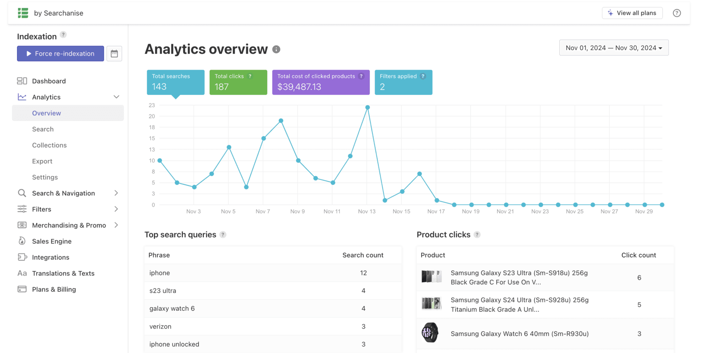

### 10. AddSearch

AddSearch là giải pháp tìm kiếm trang web có thể tùy chỉnh cho các trang web và thương mại điện tử. Cung cấp kết quả cực nhanh, liên quan với các tính năng cấp doanh nghiệp.

*   **Tính năng nổi bật:**
    *   **Custom search design results UI:** Kết hợp search-as-you-type với các trang kết quả tìm kiếm tinh vi.
    *   **Result management:** Ưu tiên nội dung liên quan.
    *   **Site search analytics:** Theo dõi, phân tích hành vi người dùng để hiểu và tùy chỉnh nội dung.
    *   **Security:** Các chứng nhận và giao thức mã hóa đảm bảo bảo mật dữ liệu.
    *   **AI-powered personalization:** Cá nhân hóa kết quả theo sở thích người dùng.
*   **Giá:** Bắt đầu từ $99/tháng (Professional), $499/tháng (Premium). Gói Enterprise tùy chỉnh. Dùng thử 14 ngày và demo cho gói Premium/Enterprise.
*   **Tích hợp:** Tích hợp với Google Analytics, Drupal, Shopify, Joomla, custom APIs, và hơn 30 ngôn ngữ.
*   **Ưu điểm (theo G2):** Thiết lập dễ dàng, nhiều tính năng toàn diện, hỗ trợ tốt.
*   **Nhược điểm (theo G2):** Các gói cao hơn khá đắt, giao diện quản trị cần cải thiện.
*   **Phù hợp với:** Trang web SMB, thương mại điện tử, trang nội dung (blog, tin tức).
*   **Lý do chọn AddSearch:** Lựa chọn vững chắc cho doanh nghiệp cần tìm kiếm tùy chỉnh, đáng tin cậy cho trang web hoặc thương mại điện tử.

## Các giải pháp thay thế Doofinder mã nguồn mở tốt nhất là gì?

Đối với các doanh nghiệp muốn tránh giá cao của Doofinder, các lựa chọn mã nguồn mở tốt nhất là:

*   **Meilisearch:** Tính chất mã nguồn mở, thiết lập nhanh, và hybrid search làm cho nó lý tưởng cho nhà phát triển và nền tảng thương mại điện tử. Cung cấp tìm kiếm tùy chỉnh, hiệu suất cao với tốc độ cực nhanh.
*   **Elasticsearch:** Lựa chọn mạnh mẽ để xử lý dữ liệu quy mô lớn. Hoàn hảo cho nhà phát triển cần phân tích nâng cao và tùy chỉnh. Tuy nhiên, đòi hỏi kiến thức kỹ thuật.
*   **Apache Solr:** Được xây dựng trên Lucene, Solr tuyệt vời cho doanh nghiệp cần tìm kiếm toàn văn có khả năng mở rộng và hỗ trợ cộng đồng mạnh mẽ. Tuy nhiên, cũng đòi hỏi nỗ lực thiết lập.

## Các giải pháp thay thế Doofinder tốt nhất cho thương mại điện tử doanh nghiệp lớn (Enterprise Commerce) là gì?

Các giải pháp thay thế Doofinder tốt nhất cho thương mại điện tử doanh nghiệp lớn cung cấp tìm kiếm dựa trên AI có khả năng mở rộng và tích hợp mạnh mẽ. Một số công cụ tốt nhất cho e-commerce cấp doanh nghiệp là:

*   **Meilisearch:** Khả năng đa thuê bao (multi-tenancy), hiệu suất nhanh và tính linh hoạt mã nguồn mở làm cho nó trở thành lựa chọn hiệu quả chi phí cho doanh nghiệp lớn tùy chỉnh trải nghiệm tìm kiếm.
*   **Coveo:** Xuất sắc trong việc hợp nhất các nguồn nội dung và cung cấp kết quả cá nhân hóa, lý tưởng cho các nhà bán lẻ lớn với nhu cầu phức tạp.
*   **Bloomreach:** Cung cấp cá nhân hóa và merchandising nâng cao, hoàn hảo cho các thương hiệu toàn cầu ưu tiên chuyển đổi.

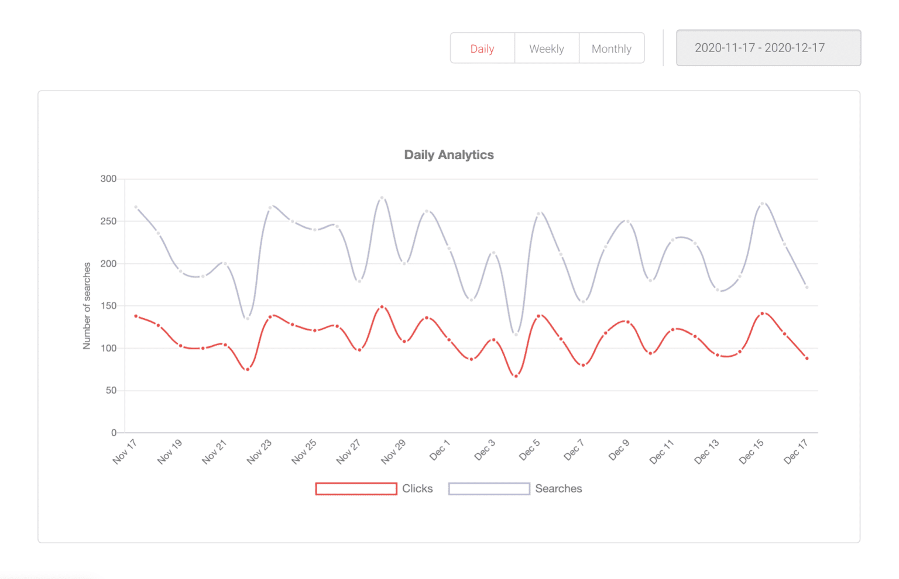

---

*Tham khảo:* Bài viết gốc trên freestar: [https://www.freestar.com/articles/top-10-doofinder-alternatives-in-2025/](https://www.freestar.com/articles/top-10-doofinder-alternatives-in-2025/)
