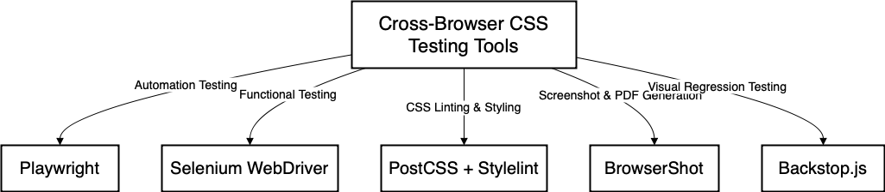
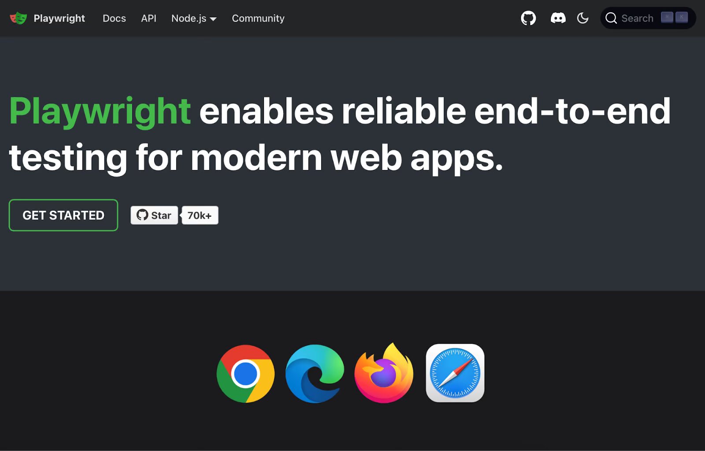
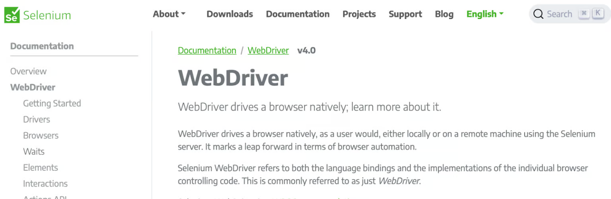
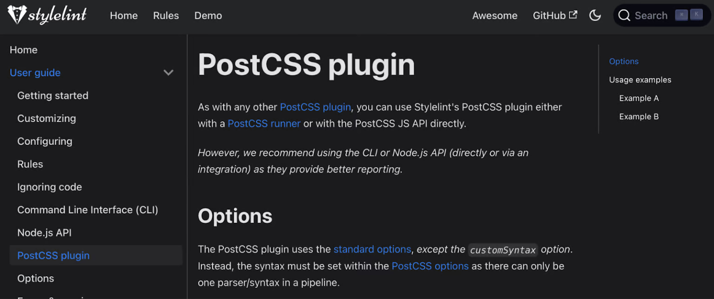
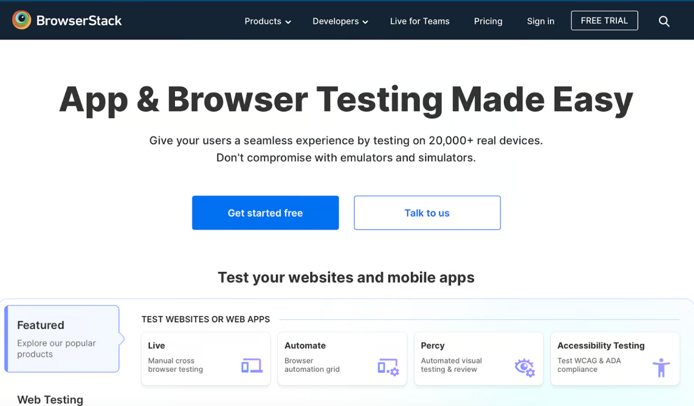
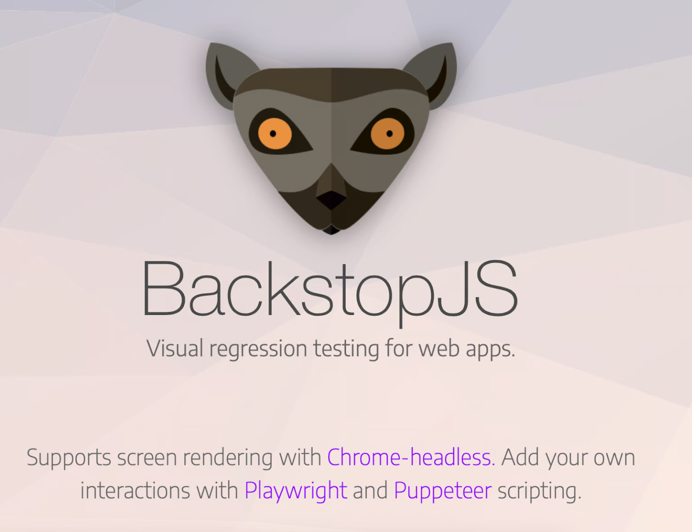

# 1 Thử thách CSS không nhất quán giữa các trình duyệt & Công cụ kiểm thử
Sponsor by https://blog.logrocket.com/5-best-open-source-tools-cross-browser-css-testing/?ref=dailydev
## Vấn đề: Tại sao CSS lại khác biệt?

Bạn đã bao giờ dành hàng giờ để hoàn thiện giao diện trang web, đảm bảo mọi thứ hoàn hảo trên Chrome, chỉ để phát hiện ra khoảng cách bị lệch trên Safari và một hiệu ứng animation quan trọng không hoạt động trên Firefox chưa? Đây là một vấn đề phổ biến và gây khó chịu.



Lý do chính là **các trình duyệt khác nhau (Chrome, Edge, Safari, Firefox) sử dụng các công cụ kết xuất (rendering engines) riêng biệt**. Những công cụ này diễn giải CSS theo những cách hơi khác nhau, dẫn đến sự khác biệt về:

*   Bố cục (Layout)
*   Khoảng cách (Spacing)
*   Hiệu ứng (Animations)
*   Hỗ trợ các tính năng CSS mới nhất
*   Cách xử lý các thuộc tính tiền tố nhà cung cấp (vendor prefixes)

Ngay cả các kỹ thuật đáng tin cậy như Flexbox và CSS Grid đôi khi cũng hoạt động không hoàn toàn giống nhau trên mọi trình duyệt.

## Tại sao Kiểm thử Cross-Browser lại quan trọng?

Việc không kiểm tra trên nhiều trình duyệt có thể dẫn đến trải nghiệm người dùng kém và ấn tượng không tốt. Phát hiện sớm các vấn đề không nhất quán giúp tiết kiệm hàng giờ gỡ lỗi và đảm bảo người dùng có trải nghiệm mượt mà, bất kể họ sử dụng trình duyệt nào.

## 5 Công cụ Mã nguồn mở (và phổ biến) giúp kiểm thử CSS Cross-Browser

May mắn thay, có những công cụ mạnh mẽ có thể giúp tự động hóa và đơn giản hóa quá trình này. Dưới đây là tổng quan về năm công cụ (chủ yếu là mã nguồn mở) được đề cập trong bài viết gốc:

### 1. Playwright



*   **Làm gì:** Framework mã nguồn mở để tự động hóa tương tác trình duyệt trên Chromium (Chrome, Edge), WebKit (Safari), và Firefox. Được xây dựng cho kiểm thử end-to-end.
*   **Hỗ trợ CSS Testing:**
    *   Chụp ảnh màn hình để so sánh trực quan giữa các trình duyệt.
    *   Chạy kiểm thử hồi quy trực quan (visual regression testing) để phát hiện thay đổi giao diện không mong muốn.
    *   Kiểm tra các tương tác CSS (hover, responsive, media queries).
    *   Chạy ở chế độ headless (không giao diện) hoặc headed (có giao diện).
*   **Tính năng chính:** Hỗ trợ đa trình duyệt, headless/headed, kiểm thử UI consistency, giả lập di động, chạy song song.
*   **Cài đặt cơ bản:**
    ```bash
    npm install @playwright/test
    npm init playwright@latest
    ```
*   **Điểm nổi bật:** Kiểm thử đa trình duyệt trong một framework duy nhất, kết hợp kiểm thử trực quan và tương tác, giả lập di động tích hợp.

### 2. Selenium WebDriver



*   **Làm gì:** Framework tự động hóa mã nguồn mở phổ biến để điều khiển trình duyệt theo chương trình cho mục đích kiểm thử (Chrome, Firefox, Edge, Safari, Opera).
*   **Hỗ trợ CSS Testing:** Tự động hóa các tương tác người dùng thực (click, điền form) để kiểm tra cách bố cục và chức năng hiển thị trên các trình duyệt khác nhau.
*   **Tính năng chính:** Hoạt động với nhiều trình duyệt, hỗ trợ nhiều ngôn ngữ lập trình (Java, Python, JS, C#,...), headless testing, đa nền tảng, tích hợp với các framework kiểm thử phổ biến (JUnit, TestNG, PyTest,...).
*   **Cài đặt cơ bản (Ví dụ Python):**
    ```bash
    pip install selenium
    # Cần tải thêm WebDriver tương ứng cho mỗi trình duyệt (ChromeDriver, GeckoDriver,...)
    ```
*   **Điểm nổi bật:** Hỗ trợ trình duyệt rộng rãi (bao gồm cả các trình duyệt cũ hơn), hệ sinh thái lớn, đa ngôn ngữ.

### 3. PostCSS + Stylelint


*   **Làm gì:**
    *   **PostCSS:** Công cụ xử lý CSS bằng các plugin JavaScript. Plugin quan trọng là `autoprefixer` tự động thêm các tiền tố nhà cung cấp (-webkit-, -moz-) cần thiết.
    *   **Stylelint:** Công cụ kiểm tra (linter) CSS hiện đại, giúp phát hiện lỗi, thực thi quy tắc code và đảm bảo tính nhất quán.
*   **Hỗ trợ CSS Testing:** Tập trung vào **chất lượng mã CSS** và **tính tương thích tiềm năng** thay vì chạy kiểm thử trực tiếp trên trình duyệt.
    *   Tự động thêm/xóa tiền tố vendor.
    *   Phát hiện CSS không hợp lệ, trùng lặp hoặc lỗi thời.
    *   Đảm bảo code CSS nhất quán theo quy tắc định sẵn.
*   **Tính năng chính:** Tự động thêm tiền tố, kiểm tra lỗi cú pháp/quy tắc CSS, tích hợp vào quy trình build/CI/CD.
*   **Cài đặt cơ bản:**
    ```bash
    npm install postcss autoprefixer stylelint stylelint-config-standard --save-dev
    # Cần tạo file cấu hình (postcss.config.js, .stylelintrc.json)
    ```
*   **Điểm nổi bật:** Tập trung vào việc *viết* CSS đúng và tương thích ngay từ đầu, tự động hóa việc xử lý tiền tố.

### 4. BrowserStack

*   **Làm gì:** Nền tảng kiểm thử **thương mại** dựa trên đám mây, cho phép kiểm thử trên nhiều trình duyệt và thiết bị **thực**. (Lưu ý: Bài viết gốc có tiêu đề "Open Source" nhưng mô tả BrowserStack là một nền tảng thương mại có bản dùng thử).
*   **Hỗ trợ CSS Testing:**
    *   Cung cấp môi trường để kiểm thử thủ công hoặc tự động trên các trình duyệt/OS/thiết bị thực tế.
    *   Tích hợp với các công cụ tự động hóa (Selenium, Playwright, Cypress) để chạy kiểm thử trên hạ tầng của họ.
    *   Có tính năng kiểm thử trực quan (Percy).
*   **Tính năng chính:** Truy cập vào thiết bị/trình duyệt thực, kiểm thử tự động quy mô lớn, kiểm thử trực quan, kiểm thử khả năng truy cập (accessibility).
*   **Thiết lập:** Đăng ký tài khoản, cài đặt CLI hoặc SDK nếu cần, tích hợp vào quy trình kiểm thử tự động hiện có.
*   **Điểm nổi bật:** Cung cấp quyền truy cập vào môi trường **thực**, đa dạng, giải quyết các vấn đề chỉ xảy ra trên thiết bị/trình duyệt cụ thể.

### 5. BackstopJS

*   **Làm gì:** Công cụ mã nguồn mở chuyên về **kiểm thử hồi quy trực quan (visual regression testing)**.
*   **Hỗ trợ CSS Testing:**
    *   Chụp ảnh màn hình trang web trước và sau khi thay đổi CSS.
    *   So sánh hai bộ ảnh để làm nổi bật sự khác biệt trực quan (layout, màu sắc, khoảng cách).
    *   Giúp phát hiện các thay đổi giao diện không mong muốn một cách tự động.
*   **Tính năng chính:** So sánh ảnh baseline, hỗ trợ trình duyệt headless (Puppeteer, Playwright), tích hợp CI/CD, kiểm thử trên nhiều kích thước viewport.
*   **Cài đặt cơ bản:**
    ```bash
    npm install -g backstopjs
    backstop init
    ```
*   **Điểm nổi bật:** Tập trung hoàn toàn vào việc phát hiện thay đổi *trực quan*, rất hữu ích để đảm bảo CSS không phá vỡ thiết kế.

## Làm thế nào để chọn công cụ phù hợp?

| Tính năng             | Playwright                    | Selenium WebDriver         | PostCSS + Stylelint | BrowserStack                     | BackstopJS                  |
| :-------------------- | :---------------------------- | :------------------------- | :------------------ | :------------------------------- | :-------------------------- |
| **Mục đích chính**    | Tự động hóa E2E              | Kiểm thử chức năng        | Chất lượng mã CSS    | Kiểm thử trên thiết bị/trình duyệt thực | Kiểm thử hồi quy trực quan |
| **Mức độ tự động**    | Cao (Tương tác)             | Cao (Tương tác)          | Phân tích tĩnh     | Thủ công / Tự động             | Cao (So sánh ảnh)         |
| **Hỗ trợ trình duyệt** | Hiện đại (Cr, Ff, Wk)        | Rộng (Cr, Ff, Sf, Ed, IE) | Không trực tiếp     | Rất rộng (Thực)                 | Cr, Ff (qua Puppeteer/PW) |
| **Tốt nhất cho**      | Tự động hóa UI, Perf        | Kiểm thử chức năng đa dạng | Đảm bảo code CSS tốt | Kiểm thử môi trường thực tế   | Phát hiện thay đổi UI     |
| **Tích hợp CI/CD**   | Có                            | Có                         | Có                  | Có                               | Có                          |
| **Chế độ Headless**   | Có                            | Có                         | Không áp dụng       | Không trực tiếp (qua tool khác) | Có                          |

**Hướng dẫn nhanh:**

*   **Cần tự động hóa tương tác (click, form,...) trên nhiều trình duyệt hiện đại?** -> **Playwright** (ưu tiên) hoặc **Selenium WebDriver**.
*   **Cần hỗ trợ trình duyệt cũ hơn hoặc có hệ sinh thái Selenium sẵn có?** -> **Selenium WebDriver**.
*   **Muốn đảm bảo code CSS sạch, đúng chuẩn và tự động thêm tiền tố?** -> **PostCSS + Stylelint**.
*   **Cần kiểm thử trên các thiết bị di động thực hoặc cấu hình trình duyệt/OS rất cụ thể?** -> **BrowserStack** (hoặc các nền tảng tương tự).
*   **Lo lắng về việc thay đổi CSS làm hỏng giao diện một cách không mong muốn?** -> **BackstopJS**.

## Kết luận

Kiểm thử CSS cross-browser là rất quan trọng. Các công cụ như Playwright, Selenium, PostCSS+Stylelint, BrowserStack, và BackstopJS cung cấp các giải pháp mạnh mẽ (đa phần là mã nguồn mở và miễn phí) để giúp bạn đảm bảo trang web của mình trông đẹp và hoạt động tốt trên mọi trình duyệt người dùng có thể sử dụng. Hãy thử nghiệm và xem công cụ nào phù hợp nhất với quy trình làm việc của bạn!