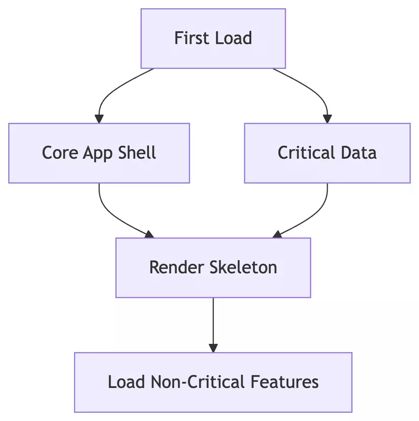

# 1 Từ Zero đến Principal Frontend Engineer

**(Loạt bài viết về các chủ đề cốt lõi để phát triển sự nghiệp Frontend)**

Loạt bài viết này hướng đến các Frontend Developer muốn nâng cao kiến thức và kỹ năng để tiến xa hơn trong sự nghiệp, hướng tới vai trò Principal Engineer. Chúng ta sẽ cùng nhau đi sâu vào các chủ đề quan trọng, từ kiến trúc ứng dụng lớn, cách hoạt động của JavaScript Engine, các kỹ thuật lập trình nâng cao trong TypeScript, đến tư duy thiết kế hệ thống scalable và tối ưu hiệu năng.

Mỗi phần sẽ khám phá một khía cạnh quan trọng, giúp bạn không chỉ biết cách làm mà còn hiểu sâu sắc *tại sao* lại làm như vậy, từ đó đưa ra quyết định kỹ thuật tốt hơn.

## Mục Lục

*   [Phần 1: Kiến Trúc Micro Frontend](#phần-1-kiến-trúc-micro-frontend)
*   [Phần 2: Đào Sâu JavaScript Engine (V8)](#phần-2-đào-sâu-javascript-engine-v8)
*   [Phần 3: TypeScript Nâng Cao](#phần-3-typescript-nâng-cao)
*   [Phần 4: Kiến Trúc Frontend Scalable](#phần-4-kiến-trúc-frontend-scalable)
*   [Phần 5: Tư Duy Tối Ưu Hiệu Năng Frontend](#phần-5-tư-duy-tối-ưu-hiệu-năng-frontend)

---

## Phần 1: Kiến Trúc Micro Frontend

Micro-frontend là một mô hình kiến trúc giúp chia nhỏ ứng dụng frontend monolith thành các phần độc lập, có thể phát triển, kiểm thử và triển khai riêng lẻ. Lấy cảm hứng từ kiến trúc microservices ở backend, micro-frontend giúp các team làm việc tự chủ và linh hoạt hơn.

Hiểu rõ micro-frontend sẽ giúp bạn xây dựng ứng dụng web dễ mở rộng và bảo trì hơn, đặc biệt trong các dự án quy mô lớn với nhiều team tham gia.

### Nguyên tắc Cốt lõi

*   **Đa công nghệ:** Mỗi team có thể chọn stack riêng (React, Vue, Angular, v.v.).
*   **Codebase độc lập:** Mỗi micro-frontend có repository và CI/CD pipeline riêng.
*   **Triển khai độc lập:** Thay đổi ở một phần có thể deploy mà không ảnh hưởng đến phần khác.
*   **Tự chủ team:** Mỗi team quản lý toàn bộ vòng đời của micro-frontend mình phụ trách.
*   **Giao tiếp qua trình duyệt:** Ưu tiên sử dụng các cơ chế gốc của trình duyệt (Web Components, Custom Events) thay vì các giải pháp tùy chỉnh phức tạp.

### Lợi ích

*   **Khả năng mở rộng:** Nhiều team có thể làm việc song song mà không xung đột.
*   **Dễ bảo trì:** Codebase nhỏ hơn, dễ debug và cập nhật.
*   **Release nhanh:** Triển khai độc lập giúp tăng tốc độ release.
*   **Linh hoạt công nghệ:** Không bị khóa vào một framework duy nhất.
*   **Khả năng chịu lỗi:** Lỗi ở một micro-frontend không làm sập toàn bộ ứng dụng.

### Thách thức

*   **Độ phức tạp tăng:** Quản lý nhiều repository, build pipeline, server...
*   **Ảnh hưởng hiệu năng:** Tải nhiều bundle code có thể làm chậm trang.
*   **Xử lý nghiệp vụ chung:** Authentication, theming, state management cần đồng bộ xuyên suốt các micro-frontend.
*   **Rủi ro tích hợp:** Đảm bảo trải nghiệm người dùng mượt mà khi các thành phần độc lập tích hợp lại.

### Các Chiến lược Triển khai Phổ biến

1.  **Tích hợp tại Build Time (NPM Packages):**
    *   Mỗi micro-frontend là một NPM package.
    *   App chính import chúng lúc build.
    *   `+` Đơn giản, hiệu năng tốt (gộp chung bundle).
    *   `-` Liên kết chặt, cần redeploy app chính khi cập nhật micro-frontend.

    ```json
    // package.json của app chính
    {
      "dependencies": {
        "product-list": "1.0.0",
        "shopping-cart": "2.1.0"
      }
    }
    ```

2.  **Tích hợp tại Runtime qua Iframe:**
    *   Mỗi micro-frontend chạy trong một `<iframe>` riêng.
    *   `+` Cách ly tốt, đa công nghệ dễ dàng.
    *   `-` UX kém (khó chia sẻ state/styling), khó SEO, giao tiếp giữa các iframe phức tạp.

    ```html
    <div>
      <iframe src="https://product-list.example.com"></iframe>
      <iframe src="https://cart.example.com"></iframe>
    </div>
    ```

3.  **Tích hợp qua Web Components:**
    *   Micro-frontend được đóng gói thành các custom elements (`<my-component>`).
    *   `+` Hỗ trợ sẵn bởi trình duyệt, không phụ thuộc framework của app chính.
    *   `-` Khó chia sẻ state, cần polyfill cho trình duyệt cũ.

    ```javascript
    // Ví dụ dùng LitElement để tạo Web Component
    // @customElement('product-list')
    // class ProductList extends LitElement { ... }
    ```

    ```html
    <!-- App chính sử dụng Web Component -->
    <product-list></product-list>
    ```

4.  **Tích hợp qua JavaScript Modules (Module Federation - Webpack 5+):**
    *   Cho phép các ứng dụng JavaScript chia sẻ code và dependencies lúc runtime.
    *   `+` Lazy loading, chia sẻ dependencies, linh hoạt.
    *   `-` Cấu hình phức tạp, quản lý dependency giữa các remotes cần cẩn thận.

    ```javascript
    // webpack.config.js (Micro-frontend "productList")
    new ModuleFederationPlugin({
      name: 'productList',
      filename: 'remoteEntry.js',
      exposes: { './ProductList': './src/ProductList' }
    });
    ```

    ```javascript
    // App chính tải động
    // const ProductList = await import('productList/ProductList');
    ```

5.  **Edge Side Includes (ESI) – Tích hợp ở CDN:**
    *   CDN hoặc reverse proxy ghép các fragment HTML từ các nguồn khác nhau.
    *   `+` Tốc độ cao (cache tại CDN), đơn giản cho nội dung tĩnh.
    *   `-` Chỉ phù hợp cho nội dung tĩnh/server-rendered, cần CDN/proxy hỗ trợ.

    ```html
    <esi:include src="https://product-list.example.com" />
    ```

### So sánh Các Chiến lược

| Chiến lược           | Tự chủ Team | Đa công nghệ | Hiệu năng | Độ phức tạp |
| :-------------------- | :---------- | :----------- | :-------- | :---------- |
| Build-Time (NPM)    | Thấp        | Thấp         | Cao       | Thấp        |
| Iframe                | Cao         | Cao          | Thấp      | Thấp        |
| Web Components        | Trung bình  | Trung bình   | Trung bình| Trung bình  |
| Module Federation     | Cao         | Cao          | Trung bình| Cao         |
| ESI (CDN)             | Thấp        | Thấp         | Cao       | Thấp        |

### Kinh nghiệm Thực tế khi Áp dụng

*   Sử dụng **Design System thống nhất** để đảm bảo giao diện đồng bộ.
*   **Chuẩn hóa nghiệp vụ chung:** Authentication, logging, error handling.
*   **Tối ưu hiệu năng:** Lazy loading các micro-frontend, chia sẻ thư viện chung.
*   **Kiểm soát dependencies:** Tránh xung đột phiên bản thư viện.
*   **Test end-to-end:** Đảm bảo sự tích hợp mượt mà giữa các thành phần.

### Kết luận Phần 1

Micro-frontend là một kiến trúc mạnh mẽ cho các ứng dụng lớn, giúp tăng tốc độ phát triển và khả năng mở rộng. Tuy nhiên, việc áp dụng cần cân nhắc kỹ lưỡng về cơ cấu team, hạ tầng và lựa chọn chiến lược tích hợp phù hợp. Module Federation và Web Components là những xu hướng đáng chú ý trong việc triển khai micro-frontend hiện đại.

---

## Phần 2: Đào Sâu JavaScript Engine (V8)

Để trở thành một Frontend Engineer thực thụ, việc hiểu rõ cách JavaScript code của bạn được thực thi là rất quan trọng. Phần này sẽ đi sâu vào V8 Engine (engine của Chrome và Node.js), cách nó biên dịch và tối ưu code, và làm thế nào để viết code hiệu năng cao dựa trên hiểu biết này.

### 1. Kiến trúc V8 Engine - Từ Source Code đến Machine Code

V8 sử dụng quy trình biên dịch nhiều giai đoạn (multi-tier compilation pipeline) để cân bằng giữa thời gian khởi động nhanh và hiệu năng tối ưu cho code chạy lâu.

#### 1.1. Quy trình biên dịch

1.  **Parser (Phân tích cú pháp):**
    *   Phân tích lexical (tokenizer): chia code thành các token.
    *   Phân tích cú pháp: xây dựng Abstract Syntax Tree (AST) biểu diễn cấu trúc code.
    *   *Tốc độ:* Rất nhanh, khoảng 1MB JS/giây. Chiếm khoảng 15-20% thời gian thực thi tổng thể.

2.  **Ignition (Interpreter - Trình thông dịch):**
    *   Biến AST thành bytecode (mã trung gian).
    *   *Bytecode:* Nhỏ gọn (50-75% machine code), tối ưu cho khởi động nhanh.
    *   Chạy bytecode ngay lập tức.

    ```javascript
    function calculateDiscount(price, discount) {
      return price * (1 - discount);
    }
    // Ignition tạo bytecode cho hàm này.
    ```

3.  **TurboFan (Optimizing Compiler):**
    *   Theo dõi cách hàm được gọi (profiling) - ví dụ: kiểu dữ liệu truyền vào.
    *   Nếu một hàm được gọi nhiều lần với các kiểu dữ liệu *nhất quán*, TurboFan sẽ tạo machine code *tối ưu* cho trường hợp đó.
    *   Nếu sau đó hàm được gọi với kiểu dữ liệu *khác* với kỳ vọng, TurboFan sẽ *deoptimize* (hủy bỏ code tối ưu) và quay lại chạy bytecode. **Đây là nguyên nhân gây giảm hiệu năng đột ngột.**

    ```javascript
    calculateDiscount(100, 0.1); // price: number, discount: number -> TurboFan optimize
    calculateDiscount("100", "0.1"); // price: string, discount: string -> TurboFan deoptimize
    ```

### 1.2 Hidden Classes và Inline Caching - Bí mật tốc độ của V8

*   **Hidden Class (Shape):** V8 tạo một "hidden class" (hoặc "shape") cho mỗi cấu trúc object. Khi các object có cùng cấu trúc property và được thêm/xóa property theo cùng thứ tự, chúng sẽ chia sẻ cùng hidden class. Điều này giúp V8 truy cập property hiệu quả hơn.
    ```javascript
    function Product(name, price) {
      this.name = name;  // Bước 1: Add 'name' property
      this.price = price; // Bước 2: Add 'price' property
    }
    const p1 = new Product("Laptop", 1000);
    const p2 = new Product("Phone", 500);
    // p1 và p2 có cùng hidden class vì được tạo theo cùng thứ tự.
    ```
    Tránh thay đổi cấu trúc object sau khi tạo hoặc tạo object với cấu trúc khác nhau cùng một lúc.
*   **Inline Cache (IC):** V8 cache lại kết quả của các operation phổ biến (như truy cập property, gọi hàm) dựa trên hidden class của object. Nếu một operation luôn được thực hiện trên object có cùng hidden class, IC sẽ trở nên rất nhanh (monomorphic). Nếu nó thực hiện trên object với nhiều hidden class khác nhau, IC sẽ chậm hơn (polymorphic/megamorphic).

### 1.3 Garbage Collection: Orinoco

V8 sử dụng cơ chế thu gom rác phức tạp (Generational, Concurrent, Parallel). Điều quan trọng là hiểu mục tiêu: giảm thiểu "pause time" (thời gian dừng thực thi code để thu gom rác) và tối đa hóa "throughput" (tỷ lệ thời gian chạy code hữu ích). GC hoạt động hiệu quả với các object có vòng đời ngắn.

### 2. Các kỹ thuật tối ưu chuyên sâu

Dựa trên hiểu biết về V8, ta có thể áp dụng các kỹ thuật:

*   **Tối ưu Data Structures:**
    *   **Array:** Sử dụng mảng "đầy đủ" (packed) thay vì mảng "rỗng" (holey). Tránh gán vào index rất lớn hoặc xóa phần tử bằng `delete`.
    *   **Object vs Map:** Dùng Object cho cấu trúc cố định, key là string, truy cập tĩnh. Dùng Map cho key động, không phải string, hoặc khi thường xuyên thêm/xóa property.
*   **Tối ưu Function Execution:**
    *   **Optimization Barriers:** Tránh các pattern khiến TurboFan không thể tối ưu (ví dụ: `arguments` object, `try-catch`, `eval`, thay đổi kiểu dữ liệu không nhất quán).
    *   **Function Inlining:** V8 có thể "nhúng" code của hàm nhỏ vào nơi nó được gọi để tránh overhead. Viết các hàm helper nhỏ, đơn giản, được gọi nhiều lần để khuyến khích inlining.
*   **Parallel Programming với Web Workers:** Đẩy các tác vụ nặng (xử lý dữ liệu, tính toán) ra khỏi luồng chính bằng Web Workers để UI không bị đơ. Sử dụng Worker Pool pattern hoặc `SharedArrayBuffer` (khi thực sự cần chia sẻ bộ nhớ phức tạp).

### 3. Công cụ phân tích hiệu năng

Sử dụng các công cụ để đo lường và xác định điểm nóng:

*   **Chrome DevTools:** Performance tab (CPU profiler), Memory tab (Heap snapshot), Console (performance API, console.time/timeEnd).
*   **V8 Internal Flags (cho Node.js/Chrome):** `--trace-opt` (xem hàm nào được optimize), `--trace-deopt` (xem hàm nào bị deoptimize), `--print-opt-code` (in ra machine code được optimize).

### Kết luận Phần 2

Hiểu sâu về cách JavaScript engine hoạt động giúp bạn viết code tận dụng tối đa cơ chế JIT compilation, tránh các "optimization killers", và lựa chọn cấu trúc dữ liệu, pattern phù hợp cho hiệu năng. Đây là nền tảng quan trọng để tối ưu hóa ứng dụng thực sự hiệu quả.

---

## Phần 3: TypeScript Nâng Cao

TypeScript đã trở thành công cụ không thể thiếu cho các dự án Frontend lớn. Ngoài cú pháp cơ bản, việc nắm vững các tính năng nâng cao như Generics, Decorators, và Advanced Types sẽ giúp bạn viết code mạnh mẽ, an toàn kiểu hơn, và dễ bảo trì.

### 1. Generics: "Khuôn" Để Đúc Nhiều Kiểu Dữ Liệu

*   **Bản chất:** Generics cho phép bạn định nghĩa các thành phần (hàm, class, interface) có thể làm việc với *bất kỳ* kiểu dữ liệu nào trong khi vẫn giữ được type safety. Nó giống như một cái khuôn mẫu mà bạn có thể "đổ" các kiểu dữ liệu khác nhau vào.
*   **Khi nào dùng:** Khi bạn cần viết code linh hoạt, tái sử dụng được cho nhiều kiểu dữ liệu, nhưng không muốn mất đi khả năng kiểm tra kiểu của TypeScript.

```typescript
// Ví dụ sử dụng Generic <T>
function getValue<T>(value: T): T {
  return value;
}

const name: string = getValue<string>("Alice"); // T = string
const age: number = getValue<number>(25);      // T = number
// const isValid: boolean = getValue<boolean>(null); // Lỗi nếu strictNullChecks bật

// Ví dụ trong React hook
// function useState<S>(initialState: S | (() => S)): [S, (newState: S | ((prevState: S) => S)) => void];
// Khi dùng useState(''), S sẽ là string. Khi dùng useState(0), S sẽ là number.
```
*   **Lưu ý:** Chỉ dùng khi thực sự cần tính linh hoạt đa kiểu. Đừng lạm dụng Generics nếu chỉ làm việc với một hoặc vài kiểu cụ thể.

### 2. Decorators: "Trang Trí" Code Để Thêm Tính Năng

*   **Bản chất:** Decorator là các hàm đặc biệt được đánh dấu bằng `@` có thể gắn vào Class, Method, Property, Accessor, Parameter để thêm hoặc thay đổi hành vi mà không sửa code gốc. Chúng thường được dùng để tách biệt các "cross-cutting concerns" (logic chung) như logging, validation, caching.
*   **Khi nào dùng:** Khi bạn muốn áp dụng cùng một tính năng cho nhiều thành phần một cách khai báo, tránh lặp code.

```typescript
// Ví dụ Decorator (cần bật experimentalDecorators và emitDecoratorMetadata trong tsconfig)
function logTime(target: any, methodName: string, descriptor: PropertyDescriptor) {
  const originalMethod = descriptor.value; // Lưu trữ hàm gốc

  descriptor.value = function (...args: any[]) { // Ghi đè hàm gốc bằng hàm mới
    console.time(methodName);
    const result = originalMethod.apply(this, args); // Gọi hàm gốc
    console.timeEnd(methodName);
    return result;
  };
}

class Calculator {
  @logTime // Áp dụng decorator vào method sum
  sum(a: number, b: number) {
    // Logic chính của method sum
    // console.log("Calculating sum..."); // Có thể thêm log ở đây
    return a + b;
  }
}

const calc = new Calculator();
calc.sum(1, 2); // Khi gọi, decorator logTime sẽ chạy trước và sau hàm sum
```
*   **Lưu ý:** Decorator chỉ là hàm JavaScript chạy ở runtime. Cẩn thận với hiệu năng nếu decorator quá phức tạp. Cần hiểu cách decorator được áp dụng và thứ tự thực thi của chúng.

### 3. Advanced Types: Kiểu Dữ Liệu "Thông Minh" Hơn

*   **Bản chất:** TypeScript cung cấp nhiều kiểu nâng cao cho phép bạn mô tả cấu trúc dữ liệu một cách chính xác và chặt chẽ hơn, dẫn đến code an toàn hơn, dễ hiểu hơn và cải thiện trải nghiệm developer (autocompletion, refactoring).
*   **Khi nào dùng:** Khi làm việc với dữ liệu có cấu trúc phức tạp, dữ liệu động (API response, user input), hoặc khi cần kiểm soát chặt chẽ các giá trị có thể có của một biến.

```typescript
// Union Types (|): Một biến có thể nhận MỘT trong NHIỀU kiểu
type Status = "success" | "error" | "loading"; // Chỉ chấp nhận 3 string literal này

function handleStatus(status: Status) {
  // TypeScript biết status chỉ có thể là 1 trong 3 giá trị -> autocompletion & kiểm tra lỗi
  if (status === "success") {
    console.log("Thành công!");
  } else if (status === "error") {
    console.log("Lỗi!");
  } else { // status === "loading"
    console.log("Đang tải...");
  }
}

// Intersection Types (&): Kết hợp NHIỀU kiểu thành MỘT kiểu mới
interface HasName { name: string; }
interface HasAge { age: number; }
type Person = HasName & HasAge; // Person phải có cả name VÀ age

const user: Person = { name: "Bob", age: 30 };

// Type Guards: Các kỹ thuật để "thu hẹp" kiểu dữ liệu tại runtime
interface Dog { bark(): void; }
interface Cat { meow(): void; }

function isDog(pet: Dog | Cat): pet is Dog { // Type Guard function
  return (pet as Dog).bark !== undefined;
}

function makeSound(pet: Dog | Cat) {
  if (isDog(pet)) { // Sử dụng Type Guard để kiểm tra
    pet.bark();    // Bên trong if, TypeScript biết pet là Dog
  } else {
    pet.meow();    // Bên trong else, TypeScript biết pet là Cat
  }
}

// Utility Types (Partial, Readonly, Pick, Omit, Exclude, Extract, NonNullable, etc.)
type User = { id: number; name: string; email?: string };

type PartialUser = Partial<User>; // { id?: number; name?: string; email?: string } - Tất cả properties đều optional
type UserWithoutEmail = Omit<User, 'email'>; // { id: number; name: string } - Bỏ đi property email
```
*   **Lưu ý:** Tránh làm kiểu quá phức tạp khó đọc. Cân nhắc dùng `unknown` thay cho `any` khi làm việc với dữ liệu không rõ kiểu để buộc phải kiểm tra kiểu an toàn hơn.

### Kết Luận Phần 3

Generics cho phép viết code linh hoạt đa kiểu, Decorators giúp thêm tính năng một cách khai báo, và Advanced Types giúp mô tả dữ liệu chính xác hơn. Nắm vững các khái niệm này giúp bạn nâng cao đáng kể chất lượng code TypeScript, giảm bug và cải thiện khả năng bảo trì cho các dự án lớn.

---

## Phần 4: Kiến Trúc Frontend Scalable

Xây dựng ứng dụng frontend có thể mở rộng là một kỹ năng then chốt của Principal Engineer. Điều này không chỉ liên quan đến việc chọn framework mà còn là cách tổ chức code, thiết kế các module, và quản lý sự phức tạp khi ứng dụng phát triển.

### 1. Các Mô Hình Kiến Trúc Frontend Scalable

*   **Monolithic vs Modular:**
    *   **Monolithic:** Toàn bộ ứng dụng trong một codebase lớn. Dễ bắt đầu, khó scale khi team và tính năng tăng.
    *   **Modular:** Chia ứng dụng thành các module độc lập, có ranh giới rõ ràng. Dễ mở rộng, từng phần có thể phát triển/deploy riêng. Nên dùng khi team lớn (>5 dev), ứng dụng có nhiều tính năng độc lập.
*   **Micro Frontends:** (Đã thảo luận chi tiết ở Phần 1) Chia ứng dụng thành các "mini-app" độc lập, mỗi app có thể dùng stack riêng và deploy độc lập. Giao tiếp qua Custom Events hoặc Shared State.
*   **Layered Architecture (ví dụ: Onion, Clean Architecture):** Chia code thành các lớp dựa trên trách nhiệm, giảm sự phụ thuộc giữa các lớp.
    *   **UI Layer:** (Presentation) Components, Pages. Xử lý hiển thị và tương tác người dùng.
    *   **Business Logic Layer:** (Domain/Application) Use Cases, Services. Chứa logic nghiệp vụ cốt lõi.
    *   **Data Layer:** (Infrastructure) API calls, Local Storage. Chịu trách nhiệm truy cập và xử lý dữ liệu từ nguồn bên ngoài.
    *   *Mục tiêu:* UI không phụ thuộc trực tiếp vào Data Layer; Business Logic độc lập với cả UI và Data Layer.

    ```javascript
    // ✅ Ví dụ tổ chức theo Layered Architecture (đã tách logic)

    // Lớp Data (Infrastructure)
    class OrderApi {
      static async fetchOrders() { /* Logic gọi API */ }
    }

    // Lớp Business Logic (Domain/Application)
    class OrderService {
      static calculateTotal(orders) {
        return orders.reduce((sum, order) => sum + order.price, 0);
      }
    }

    // Lớp UI (Presentation) - component chỉ gọi các service từ lớp trên
    function OrderPage() {
      const [orders, setOrders] = useState([]); // State cục bộ để UI render

      useEffect(() => {
        // UI gọi service từ lớp Business Logic hoặc Data
        OrderApi.fetchOrders().then(setOrders);
      }, []);

      // UI sử dụng service từ lớp Business Logic
      const total = OrderService.calculateTotal(orders);

      return <div>Total: {total}</div>;
    }
    ```

### 2. Cách Tổ Chức Codebase Cho Dự Án Lớn

*   **Feature-Based Structure (Thay vì Tech-Based):** Tổ chức code theo tính năng thay vì loại file (components, hooks, utils).
    *   ❌ Tech-Based: `/src/components`, `/src/pages`, `/src/hooks` -> Khó tìm logic liên quan đến một tính năng, dễ xung đột file.
    *   ✅ Feature-Based: `/src/features/auth/`, `/src/features/dashboard/`, `/src/shared/` -> Code của một tính năng nằm gọn trong một thư mục, dễ thêm/xóa tính năng, hỗ trợ code splitting.
*   **Atomic Design (Cho UI Scalable):** Một phương pháp tổ chức các component UI từ nhỏ nhất đến phức tạp nhất.
    *   **Atoms:** Thành phần UI cơ bản (Button, Input, Icon).
    *   **Molecules:** Nhóm Atoms lại tạo thành đơn vị phức hợp đơn giản (Search Bar = Input + Button).
    *   **Organisms:** Kết hợp Molecules và/hoặc Atoms thành các phần phức tạp của giao diện (Header = Logo + Search Bar + Navigation).
    *   **Templates:** Bố cục trang (layout) không chứa dữ liệu cụ thể (Header + Sidebar + Main Content Area).
    *   **Pages:** Instances của Templates với dữ liệu cụ thể được đưa vào.
    *   *Mục đích:* Tái sử dụng component, đảm bảo tính nhất quán giao diện, quản lý độ phức tạp của UI.

### 3. Công Cụ & Best Practices Từ Các Công Ty Lớn

*   **Tooling:**
    *   **Monorepo:** Sử dụng các công cụ như Turborepo, Nx để quản lý nhiều dự án/package trong cùng một repository. Giúp chia sẻ code, quản lý dependencies và chạy task hiệu quả hơn.
    *   **Linting/Formatting:** ESLint, Prettier kết hợp với Husky (Git hooks) để tự động kiểm tra và format code trước khi commit/push, đảm bảo code style nhất quán.
    *   **CI/CD:** Thiết lập quy trình tự động kiểm thử, build, deploy (GitHub Actions, CircleCI, GitLab CI) để đảm bảo chất lượng và tốc độ release.
*   **Documentation:**
    *   **Storybook:** Tạo môi trường phát triển và tài liệu hóa riêng cho các UI component.
    *   **Swagger/OpenAPI:** Tài liệu hóa API để frontend và backend làm việc hiệu quả.

### Kết luận Phần 4

Xây dựng kiến trúc frontend scalable đòi hỏi việc lựa chọn mô hình phù hợp (Modular, Micro Frontend, Layered), tổ chức codebase khoa học (Feature-Based, Atomic Design), và sử dụng các công cụ, quy trình hiệu quả (Monorepo, CI/CD, Documentation). Áp dụng các nguyên tắc này giúp bạn xây dựng các ứng dụng lớn mạnh mẽ, dễ mở rộng và bảo trì theo thời gian.

---

## Phần 5: Tư Duy Tối Ưu Hiệu Năng Frontend

Trở thành Principal Frontend Engineer đòi hỏi không chỉ kỹ năng code mà còn là tư duy hệ thống, đặc biệt trong việc tối ưu hiệu năng. Hiệu năng không chỉ là làm cho ứng dụng chạy nhanh hơn mà là đảm bảo trải nghiệm người dùng tốt nhất trong mọi tình huống, cân bằng với chi phí phát triển và khả năng mở rộng.

Bài viết này tập trung vào cách xây dựng tư duy hiệu năng.

### 1. Nguyên Lý Cốt Lõi Về Hiệu Năng Frontend

*   **Quy Luật Nhận Thức Của Người Dùng:** Hiểu các ngưỡng thời gian mà người dùng cảm nhận (100ms phản hồi tức thì, 1s duy trì luồng suy nghĩ, 10s mất kiên nhẫn). Mục tiêu tối ưu là để đạt được các ngưỡng này, giữ chân người dùng.
*   **Nghịch Lý Hiệu Năng:** Tối ưu quá sớm (khi chưa cần) lãng phí tài nguyên; tối ưu quá muộn (khi đã thành vấn đề lớn) tốn chi phí sửa chữa cao. Cần tìm điểm cân bằng: ưu tiên tối ưu khi các metric hiệu năng vượt ngưỡng chấp nhận được của business.

### 2. Tư Duy Giải Quyết Vấn Đề Hiệu Năng

*   **Phương Pháp 5 Whys:** Khi gặp vấn đề hiệu năng, đào sâu nguyên nhân gốc rễ bằng cách hỏi "Tại sao?" lặp đi lặp lại. Giúp đi từ triệu chứng bề mặt đến nguyên nhân sâu xa (ví dụ: Bundle lớn -> Thư viện nặng -> Thiếu review dependency -> Thiếu checklist -> Thiếu văn hóa performance). Giải pháp thường nằm ở nguyên nhân gốc rễ (xây dựng văn hóa performance-aware).
*   **Ma Trận Eisenhower Cho Tối Ưu:** Phân loại các công việc tối ưu vào ma trận 4 ô (Quan trọng/Không Quan trọng x Khẩn cấp/Không Khẩn cấp). Bắt đầu giải quyết các vấn đề *Quan trọng* và *Khẩn cấp* trước (ví dụ: LCP (Largest Contentful Paint) > 5s).

### 3. Kiến Trúc Hệ Thống Hướng Hiệu Năng

*   **Nguyên Tắc Tách Biệt Concerns:**
    *   **Render-critical path:** Code và tài nguyên cần thiết cho lần hiển thị đầu tiên (First Paint, LCP). Cần tải nhanh nhất.
    *   **Non-critical features:** Các tính năng ít dùng hoặc không cần thiết ngay lập tức. Sử dụng lazy loading.
    *   **Background tasks:** Các tác vụ tính toán nặng, xử lý dữ liệu. Đẩy vào Web Worker để không chặn luồng chính (UI).
    *   *Tư duy:* Luôn phân loại các phần của ứng dụng để ưu tiên tài nguyên phù hợp.
*   **Mô Hình RAIL:** Một mô hình giúp cấu trúc suy nghĩ về hiệu năng theo các khía cạnh tương tác người dùng:
    *   **Response:** Xử lý input (click, gõ phím) trong 50ms.
    *   **Animation:** Duy trì tốc độ khung hình (frame rate) 60fps (10ms/frame).
    *   **Idle:** Tận dụng thời gian rảnh rỗi để thực hiện các công việc không khẩn cấp.
    *   **Load:** Hoàn thành tải và hiển thị nội dung chính trong 1s.
    *   *Cách áp dụng:* Luôn đặt câu hỏi "Công việc/Tính năng này ảnh hưởng đến phần nào của RAIL?".

    

### 4. Chiến Lược Tối Ưu Bền Vững

*   **Performance Budget:** Đặt ra các "ngân sách" hiệu năng cụ thể cho các metric quan trọng (ví dụ: bundle size ≤ 200KB, thời gian script bên thứ ba tải ≤ X ms, kích thước response API cho dữ liệu critical ≤ Y KB). Sử dụng CI/CD để enforce budget, ngăn chặn các thay đổi làm giảm hiệu năng.
*   **Observability-Driven Optimization:** Thay vì chỉ đo lường hiệu năng một lần, thiết lập hệ thống đo lường và giám sát liên tục các metric hiệu năng (Instrumentation code, RUM - Real User Monitoring). Phân tích trend theo thời gian để phát hiện sớm vấn đề và đo lường hiệu quả của các giải pháp tối ưu.

### 5. Văn Hóa Hiệu Năng Trong Tổ Chức

Hiệu năng không chỉ là trách nhiệm của một vài người. Xây dựng văn hóa performance-aware trong toàn bộ team:

*   **Performance Onboarding Checklist:** Đảm bảo thành viên mới hiểu performance KPIs, biết dùng Chrome DevTools, và nắm quy trình đo lường/tối ưu của team.
*   **Blameless Postmortem:** Khi xảy ra sự cố hiệu năng, thực hiện phân tích không đổ lỗi để tìm ra nguyên nhân gốc rễ, các lỗ hổng trong hệ thống phát hiện/phòng ngừa, và đưa ra hành động cụ thể để ngăn chặn tái diễn.

### Kết Luận Phần 5

Tư duy tối ưu hiệu năng là sự kết hợp giữa hiểu biết kỹ thuật sâu sắc (như V8), khả năng phân tích vấn đề (5 Whys, Eisenhower), thiết kế hệ thống (tách biệt concerns, RAIL), chiến lược đo lường/ngăn ngừa (Budget, Observability), và xây dựng văn hóa team. Từ việc biết dùng công cụ (Junior), giải quyết vấn đề (Mid-level), dự đoán vấn đề (Senior), đến xây dựng hệ thống ngăn ngừa (Principal) – đây là lộ trình phát triển tư duy hiệu năng.

---

## Tổng Kết Lộ Trình

Hành trình từ Zero đến Principal Frontend Engineer đòi hỏi sự phát triển toàn diện, vượt ra ngoài kiến thức về framework cụ thể. Loạt bài viết này đã khám phá những trụ cột quan trọng:

*   **Micro Frontend (P1):** Cách tổ chức các ứng dụng web lớn để tăng khả năng mở rộng và tự chủ cho team.
*   **JavaScript Engine (P2):** Hiểu cách code chạy ngầm giúp bạn viết code hiệu quả và tránh các bẫy hiệu năng.
*   **TypeScript Nâng Cao (P3):** Sử dụng hệ thống kiểu mạnh mẽ để xây dựng code an toàn, dễ bảo trì và mở rộng.
*   **Kiến Trúc Scalable (P4):** Thiết kế cấu trúc ứng dụng và codebase để xử lý sự phức tạp khi dự án lớn lên.
*   **Tư Duy Tối Ưu Hiệu Năng (P5):** Cách tiếp cận chiến lược và có hệ thống để đảm bảo ứng dụng nhanh và phản hồi tốt.

Để thực sự nắm vững các chủ đề này, hãy kết hợp việc đọc, học với thực hành. Áp dụng các nguyên tắc, công cụ và tư duy này vào các dự án thực tế của bạn. Liên tục đo lường, phân tích và cải tiến.


*(Nội dung được tổng hợp và chỉnh sửa từ loạt bài viết gốc)*