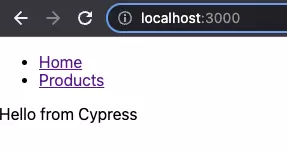
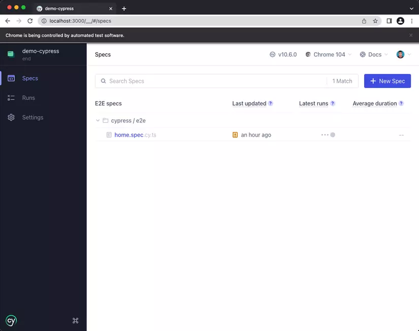
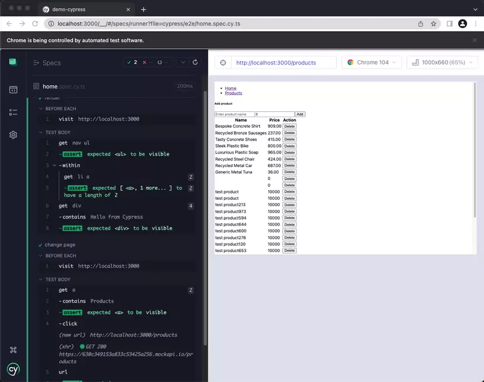
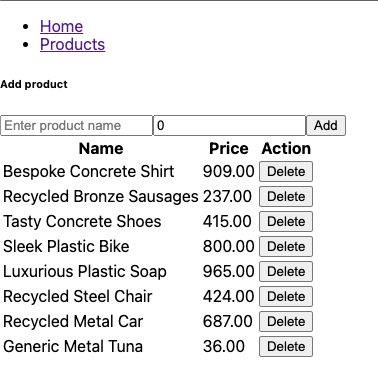

Okay, đây là nội dung bài viết trên Viblo được chuyển thành định dạng README.md, bao gồm cả các liên kết đến hình ảnh từ bài viết gốc.

Lưu ý: Liên kết hình ảnh được lấy trực tiếp từ bài viết trên Viblo. Chúng có thể không hoạt động vĩnh viễn nếu cấu trúc trang Viblo thay đổi hoặc hình ảnh bị xóa.

# E2E Testing cho ứng dụng ReactJS sử dụng Cypress

README này tóm tắt nội dung từ bài viết trên Viblo về cách thực hiện kiểm thử End-to-End (E2E) cho một ứng dụng ReactJS đơn giản bằng Cypress.

**Bài viết gốc:** [https://viblo.asia/p/e2e-testing-cho-ung-dung-reactjs-su-dung-cypress-W13VM71QJY7](https://viblo.asia/p/e2e-testing-cho-ung-dung-reactjs-su-dung-cypress-W13VM71QJY7)
*(Lưu ý: Bài viết gốc đã không được cập nhật trong hơn 2 năm tại thời điểm tạo README này)*

## Giới thiệu

Bài viết này hướng dẫn cách cấu hình và viết các bài test E2E cơ bản cho một ứng dụng ReactJS sử dụng Cypress.

## Ứng dụng Demo

*   Một ứng dụng ReactJS đơn giản gồm 2 trang:
    *   `/home`: Hiển thị lời chào.
    *   `/products`: Hiển thị danh sách sản phẩm, cho phép thêm và xóa sản phẩm.
*   **Repository:** [https://github.com/khuongitptit/demo-cypress](https://github.com/khuongitptit/demo-cypress)
    *   `branch start`: Phiên bản ban đầu của dự án, chưa có test.
    *   `branch end`: Phiên bản dự án đã bao gồm các file test E2E hoàn chỉnh.

## 1. Cấu hình Cypress cho ứng dụng ReactJS

**Yêu cầu:**
*   Node.js
*   `yarn` (hoặc `npm`)

**Các bước cài đặt:**

1.  **Clone repository:**
    ```bash
    git clone https://github.com/khuongitptit/demo-cypress.git
    cd demo-cypress
    # git checkout start # Nếu muốn bắt đầu từ đầu
    # git checkout end   # Nếu muốn xem code hoàn chỉnh với tests
    ```

2.  **Cài đặt dependencies:**
    ```bash
    yarn install
    # hoặc
    # npm install
    ```

3.  **Chạy ứng dụng:**
    ```bash
    yarn dev
    # hoặc
    # npm run dev
    ```
    Ứng dụng sẽ chạy tại `http://localhost:3000`.

4.  **Cài đặt Cypress:**
    ```bash
    yarn add cypress --dev
    # hoặc
    # npm install cypress --save-dev
    ```
    *(Lưu ý: Bài viết gốc dùng `--save`, nhưng `--dev` hoặc `--save-dev` là chuẩn hơn cho testing tools)*

5.  **Mở Cypress Test Runner:**
    ```bash
    npx cypress open
    ```

6.  **Cấu hình E2E Testing (Lần đầu chạy):**
    *   Cửa sổ Cypress sẽ mở lên, chọn **E2E Testing**:
        )
    *   Xem lại các file config sẽ được tạo, chọn **Continue**:
        )
    *   Đợi Cypress generate file config. Sau đó chọn trình duyệt (ví dụ: **Start E2E Testing in Chrome**):
        )

7.  **Tạo file Test (Specs):**
    *   Cửa sổ trình duyệt test của Cypress sẽ mở ra, vào tab **Specs**.
    *   Chọn **Create new empty spec**:
        )
    *   Nhập tên file test cho trang home: `cypress/e2e/home.spec.cy.ts` và chọn **Create Spec**.
    *   File test mẫu sẽ được tạo với nội dung cơ bản.
    *   Chọn **Create another spec** để tạo file test cho trang products: `cypress/e2e/products.spec.cy.ts`.
    *   Sau khi tạo xong, chọn **Okay, run the spec**. File test trống sẽ chạy (và pass mặc định):
        )

Như vậy là bạn đã cấu hình xong Cypress và sẵn sàng viết test.


## 2. Viết Test

### a. Test cho Trang Home (`home.spec.cy.ts`)

Trang Home đơn giản gồm Navbar và dòng chữ "Hello from Cypress".

**Hình ảnh giao diện trang Home:**


**Nội dung file `cypress/e2e/home.spec.cy.ts`:**


// cypress/e2e/home.spec.cy.ts
describe('Home page', () => {
// Hàm này chạy trước mỗi 'it' block
beforeEach(() => {
// Truy cập trang chủ
cy.visit('http://localhost:3000')
})

// Test case 1: Kiểm tra render giao diện
it('render', () => {
// Kiểm tra navbar hiển thị và có đúng 2 link
cy.get("nav ul").should("be.visible").within(() => {
cy.get("li a").should("have.length", 2)
})
// Kiểm tra dòng chữ chào mừng hiển thị
cy.get("div").contains("Hello from Cypress").should("be.visible")
})

// Test case 2: Kiểm tra chuyển trang
it('change page', () => {
// Tìm link "Products"
const linkToProductsPage = cy.get("a").contains("Products")
linkToProductsPage.should("be.visible")
// Click vào link
linkToProductsPage.click()
// Kiểm tra URL đã chuyển sang trang products
cy.url().should("include", "/products")
})
})

**Chạy test:** Trong Cypress Test Runner, click vào `home.spec.cy.ts`.

**Hình ảnh kết quả chạy test `home.spec.cy.ts`:**


Bạn có thể di chuột qua các bước bên trái để xem trạng thái ứng dụng tại thời điểm đó (Time Travel Debugging).

**Hình ảnh minh họa Time Travel Debugging:**
![Time Travel Debugging]

### b. Test cho Trang Products (`products.spec.cy.ts`)

Trang Products hiển thị danh sách, cho phép thêm và xóa sản phẩm.

**Hình ảnh giao diện trang Products:**
![Giao diện trang Products]

**Nội dung file `cypress/e2e/products.spec.cy.ts`:**
IGNORE_WHEN_COPYING_START
content_copy
download
Use code with caution.
IGNORE_WHEN_COPYING_END

// cypress/e2e/products.spec.cy.ts
describe('Product page', () => {

beforeEach(() => {
// Truy cập trang products
cy.visit('http://localhost:3000/products')

// --- Intercept API requests ---
// Chặn và đặt bí danh cho API thêm sản phẩm
cy.intercept({
  method: "POST",
  // Lấy URL API từ biến môi trường của React App
  // Quan trọng: Đảm bảo biến này được định nghĩa và Cypress có thể truy cập
  url: Cypress.env("REACT_APP_BASE_API_URL") + "/products",
}).as("addProductAPI");

// Chặn và đặt bí danh cho API xóa sản phẩm (sử dụng ** để khớp ID động)
cy.intercept({
  method: "DELETE",
  url: Cypress.env("REACT_APP_BASE_API_URL") + "/products/**",
}).as("deleteProductAPI");

// Chặn và đặt bí danh cho API lấy danh sách sản phẩm
cy.intercept({
  method: "GET",
  url: Cypress.env("REACT_APP_BASE_API_URL") + "/products",
}).as("getListProductAPI");

// Đợi một chút để đảm bảo dữ liệu ban đầu được tải (có thể cải thiện bằng cách đợi @getListProductAPI)
cy.wait(1000)
IGNORE_WHEN_COPYING_START
content_copy
download
Use code with caution.
IGNORE_WHEN_COPYING_END

})

// Test case 1: Thêm sản phẩm
it('add product', () => {
// Kiểm tra các thành phần form hiển thị
cy.get("h6").contains("Add product").should("be.visible")
cy.get("input[name='name']").should("be.visible")
cy.get("input[name='price']").should("be.visible")
cy.get("button").contains("Add").should("be.visible")

// Tạo tên sản phẩm độc nhất bằng timestamp để dễ kiểm tra
const testName = "test product " + (Date.now()/1000)

// Nhập liệu và click nút Add
cy.get("input[name='name']").type(testName)
cy.get("input[name='price']").type("10000")
cy.get("button").contains("Add").click()

// Đợi API thêm sản phẩm hoàn tất (@addProductAPI)
cy.wait("@addProductAPI").then(({ response }) => {
  // Kiểm tra status code trả về là 201 (Created)
  expect(response?.statusCode).to.eq(201);

  // Đợi API lấy lại danh sách hoàn tất (@getListProductAPI)
  cy.wait("@getListProductAPI").then(() => {
    cy.wait(1000) // Đợi UI cập nhật (có thể cải thiện)
    // Kiểm tra sản phẩm mới thêm nằm ở cuối bảng
    cy.get("tr").last().within(() => {
      cy.get("td").first().should("contain.text", testName)
    })
  })
});
IGNORE_WHEN_COPYING_START
content_copy
download
Use code with caution.
IGNORE_WHEN_COPYING_END

})

// Test case 2: Xóa sản phẩm
it('delete product', () => {
let productNameToDelete: string; // Khai báo kiểu cho biến

// Lấy tên sản phẩm cuối cùng trong bảng
cy.get("tr").last().within(() => {
  cy.get("td").first().invoke("text").then(text => productNameToDelete = text)
  // Click nút Delete của hàng đó
  cy.get("button").contains("Delete").click()
})

// Đợi API xóa sản phẩm hoàn tất (@deleteProductAPI)
cy.wait("@deleteProductAPI").then(({ response }) => {
  // Kiểm tra status code trả về là 200 (OK)
  expect(response?.statusCode).to.eq(200);

  // Đợi API lấy lại danh sách hoàn tất (@getListProductAPI)
  cy.wait("@getListProductAPI").then(() => {
    // Kiểm tra sản phẩm cuối cùng trong bảng KHÔNG còn là sản phẩm vừa xóa
    cy.get("tr").last().within(() => {
      cy.get("td").first().should("not.contain.text", productNameToDelete)
    })
  })
});
IGNORE_WHEN_COPYING_START
content_copy
download
Use code with caution.
IGNORE_WHEN_COPYING_END

})

})

**Giải thích:**

*   `beforeEach`: Truy cập trang `/products` và sử dụng `cy.intercept()` để "nghe" và đặt bí danh (`.as()`) cho các API calls (POST, DELETE, GET). Điều này cho phép chúng ta đợi (`cy.wait('@alias')`) và kiểm tra các API này trong các test case.
*   `it('add product')`:
    *   Kiểm tra sự hiển thị của form thêm sản phẩm.
    *   Tạo một tên sản phẩm unique bằng `Date.now()` để tránh trùng lặp khi chạy test nhiều lần.
    *   Nhập tên và giá, sau đó click nút "Add".
    *   Đợi API `@addProductAPI` hoàn thành, kiểm tra `statusCode` là `201`.
    *   Đợi API `@getListProductAPI` (để load lại danh sách) hoàn thành.
    *   Kiểm tra xem hàng cuối cùng (`tr:last-child`) trong bảng có chứa tên sản phẩm vừa tạo không.
*   `it('delete product')`:
    *   Lấy tên sản phẩm ở hàng cuối cùng và lưu vào biến `productNameToDelete`.
    *   Click nút "Delete" ở hàng đó.
    *   Đợi API `@deleteProductAPI` hoàn thành, kiểm tra `statusCode` là `200`.
    *   Đợi API `@getListProductAPI` hoàn thành.
    *   Kiểm tra xem tên sản phẩm ở hàng cuối cùng **không phải** là tên sản phẩm đã lưu (`productNameToDelete`), xác nhận việc xóa thành công.
IGNORE_WHEN_COPYING_START
content_copy
download
Use code with caution.
IGNORE_WHEN_COPYING_END

Trong phiên bản này, các khối code được bao bởi ``` (ba dấu backtick) mà không có tên ngôn ngữ (typescript) đi kèm, nên chúng sẽ hiển thị như văn bản thường trong một khối định dạng sẵn (preformatted block), và các thẻ  vẫn nằm đúng vị trí để hiển thị hình ảnh.