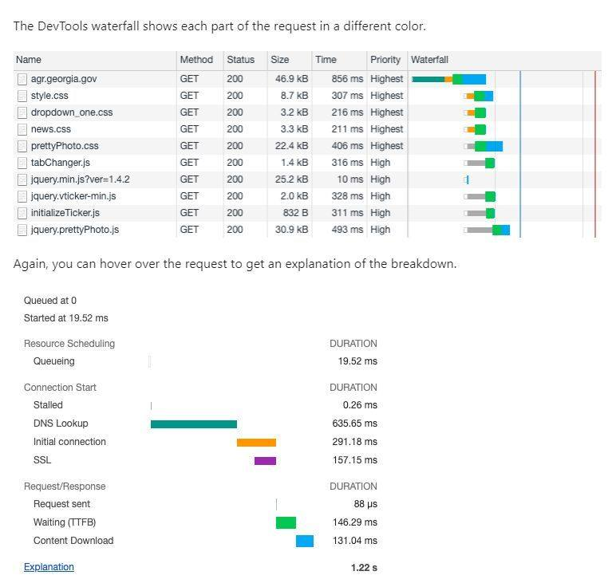

## 1 Khái niệm Reflow, Repaint và Layout Shift

Tối ưu Layout Shift (CLS) là một trong những yếu tố quan trọng trong **Core Web Vitals** của Google. Dưới đây là các khái niệm và phương pháp tối ưu cần nắm rõ:

---

## 1. Reflow (hay Layout)

- **Định nghĩa**: Là quá trình trình duyệt tính toán lại vị trí và kích thước (geometry) của các phần tử trên trang.
- **Khi nào xảy ra**:
  - Thay đổi cấu trúc DOM (thêm/xóa phần tử).
  - Thay đổi các thuộc tính ảnh hưởng đến layout: kích thước, vị trí, font chữ, nội dung text, kích thước cửa sổ,...
- **Tác động**: 
  - Tốn tài nguyên.
  - Có thể ảnh hưởng đến toàn bộ hoặc phần lớn trang.
  - **Thường kéo theo Repaint.**

---

## 2. Repaint (hay Redraw)

- **Định nghĩa**: Là quá trình trình duyệt vẽ lại các điểm ảnh (pixels) của các phần tử mà **không làm thay đổi layout**.
- **Khi nào xảy ra**:
  - Khi giao diện thay đổi mà không ảnh hưởng đến vị trí/kích thước, ví dụ: `background-color`, `visibility`, `outline`, `color`.
- **Tác động**:
  - Ít tốn tài nguyên hơn Reflow.
  - Nếu xảy ra liên tục cũng ảnh hưởng đến hiệu năng.

---

## 3. Layout Shift

- **Định nghĩa**: Là hiện tượng các phần tử **đang hiển thị bị dịch chuyển vị trí một cách bất ngờ**, gây trải nghiệm người dùng kém (ví dụ: bấm nhầm nút do nút bị di chuyển).
- **Đo lường bằng**: Chỉ số **Cumulative Layout Shift (CLS)** trong Core Web Vitals.
  - **CLS càng thấp càng tốt**.

### Nguyên nhân gây Layout Shift:

1. **Hình ảnh, video không có kích thước (width, height)**  
   → Trình duyệt không thể dành trước không gian.

2. **Quảng cáo (Ads), Embeds, Iframes không có kích thước**  
   → Chiếm không gian sau khi tải gây dịch chuyển layout.

3. **Nội dung được chèn động (Dynamic Content)**  
   → Thêm nội dung phía trên nội dung cũ làm đẩy các phần tử khác xuống.

4. **Web Fonts gây FOIT/FOUT**  
   → Tải font làm thay đổi kích thước text.

5. **DOM thay đổi sau phản hồi từ mạng**  
   → Nhận dữ liệu mới và cập nhật layout muộn.

---

## 4. Cách tối ưu để tránh CLS cao

✅ **Chỉ định kích thước cho hình ảnh/video**  
→ Dùng thuộc tính `width`, `height`, hoặc CSS `aspect-ratio`.

✅ **Dành sẵn không gian cho Ads, Embeds, Iframes**  
→ Dùng `div` với kích thước cố định hoặc `placeholder`.

✅ **Tránh chèn quảng cáo lên đầu nội dung đã hiển thị.**

✅ **Quản lý nội dung động hợp lý**  
→ Tránh chèn nội dung mới phía trên trừ khi do người dùng tương tác.  
→ Sử dụng `placeholder` hoặc `skeleton screen`.

✅ **Tối ưu Web Fonts**  
→ Dùng `font-display: optional` hoặc `swap`.  
→ Preload font bằng `<link rel="preload">`.

✅ **Sử dụng Animation/Transition đúng cách**  
→ Ưu tiên dùng các thuộc tính không gây reflow như: `transform: translate()`, `scale()`.  
→ Tránh sử dụng `top`, `left`, `width`, `height` trong animation.

---

**📌 Lưu ý:** Việc tối ưu Layout Shift không chỉ giúp cải thiện điểm số SEO mà còn nâng cao trải nghiệm người dùng đáng kể.

# 2 Các Thông Tin Trong Waterfall (Network Tab) Cần Biết Khi Tối Ưu Frontend

Khi tối ưu hiệu năng frontend, việc hiểu rõ các thành phần trong biểu đồ **Waterfall** của tab **Network** (trình duyệt DevTools) là rất quan trọng. Dưới đây là các mốc thời gian phổ biến bạn cần nắm rõ:

---

## 1. Queueing

- **Là gì**: Thời gian request phải chờ trong hàng đợi (queue) trước khi bắt đầu tiến trình kết nối.
- **Nguyên nhân phổ biến**:
  1. Các request khác có **mức độ ưu tiên cao hơn**.
  2. Trình duyệt đã đạt **giới hạn kết nối TCP song song** (thường là 6 trên mỗi origin đối với HTTP/1.0 và HTTP/1.1).
  3. Trình duyệt đang chờ **bộ nhớ tạm (disk cache)** được giải phóng để xử lý.

---

## 2. Stalled

- **Là gì**: Thời gian bị hoãn **sau khi kết nối đã được mở**, nhưng request vẫn chưa được gửi.
- **Lý do**: Tương tự với Queueing — ưu tiên, giới hạn kết nối, bộ nhớ tạm, v.v.

---

## 3. DNS Lookup

- **Là gì**: Thời gian trình duyệt dùng để phân giải tên miền (domain) thành địa chỉ IP.
- **Tối ưu**: Sử dụng DNS cache, DNS prefetching (`<link rel="dns-prefetch">`).

---

## 4. Initial Connection

- **Là gì**: Thời gian để thiết lập kết nối TCP giữa trình duyệt và server.

---

## 5. SSL (TLS Handshake)

- **Là gì**: Thời gian thực hiện quá trình bắt tay SSL/TLS cho các kết nối HTTPS.

---

## 6. Request Sent

- **Là gì**: Thời gian gửi toàn bộ request (thường rất ngắn nếu không có payload lớn).

---

## 7. Waiting (Time to First Byte - TTFB)

- **Là gì**: Thời gian **từ khi request được gửi** đến khi **trình duyệt nhận byte đầu tiên** từ server.
- **Ý nghĩa**: Cho thấy thời gian xử lý phía backend.

---

## 8. Content Download

- **Là gì**: Thời gian **tải toàn bộ nội dung phản hồi** từ server về trình duyệt.

---

## 📌 Lưu Ý Chung

- Thời gian từng giai đoạn càng **ngắn** thì hiệu năng càng **tốt**.
- Dựa vào biểu đồ waterfall để xác định **điểm nghẽn (bottleneck)** trong quá trình tải tài nguyên:  
  → Kết nối? SSL? Server xử lý chậm? Dữ liệu nặng?

---

**Hiểu rõ các thông tin trên giúp bạn phân tích, debug và tối ưu hiệu quả hiệu năng trang web.**

