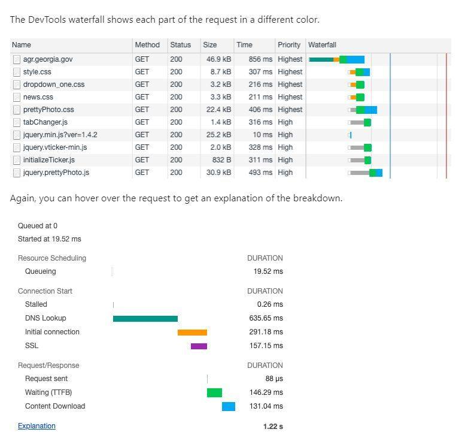
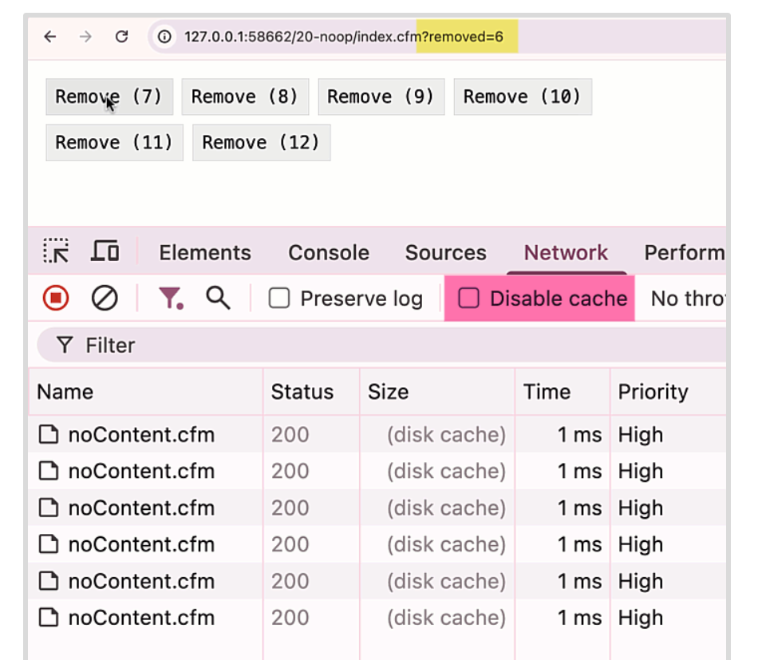
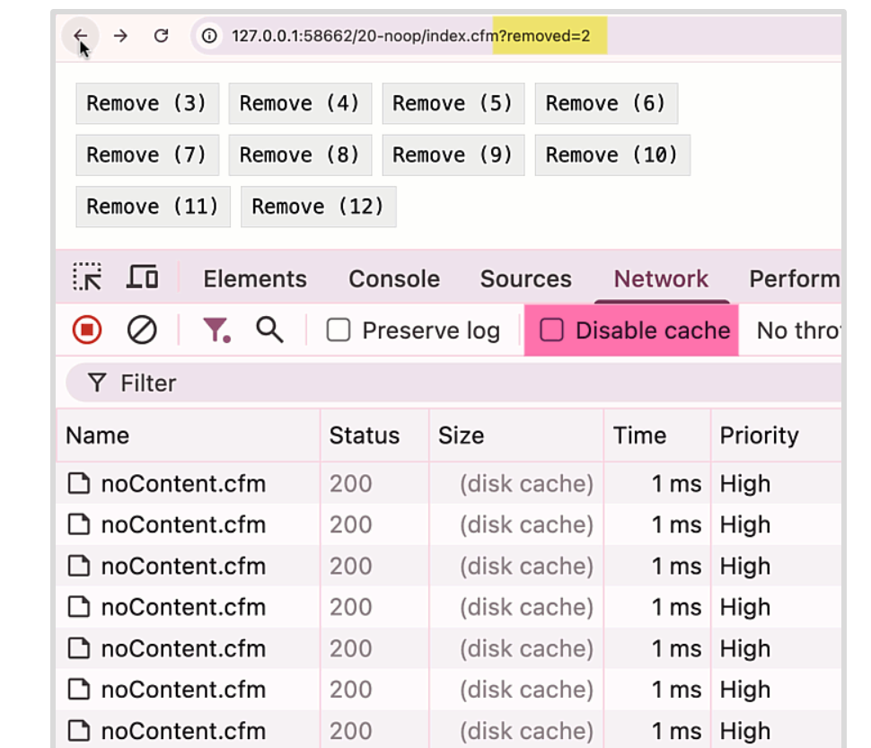

## 1 Khái niệm Reflow, Repaint và Layout Shift

Tối ưu Layout Shift (CLS) là một trong những yếu tố quan trọng trong **Core Web Vitals** của Google. Dưới đây là các khái niệm và phương pháp tối ưu cần nắm rõ:

---

## 1. Reflow (hay Layout)

- **Định nghĩa**: Là quá trình trình duyệt tính toán lại vị trí và kích thước (geometry) của các phần tử trên trang.
- **Khi nào xảy ra**:
  - Thay đổi cấu trúc DOM (thêm/xóa phần tử).
  - Thay đổi các thuộc tính ảnh hưởng đến layout: kích thước, vị trí, font chữ, nội dung text, kích thước cửa sổ,...
- **Tác động**: 
  - Tốn tài nguyên.
  - Có thể ảnh hưởng đến toàn bộ hoặc phần lớn trang.
  - **Thường kéo theo Repaint.**

---

## 2. Repaint (hay Redraw)

- **Định nghĩa**: Là quá trình trình duyệt vẽ lại các điểm ảnh (pixels) của các phần tử mà **không làm thay đổi layout**.
- **Khi nào xảy ra**:
  - Khi giao diện thay đổi mà không ảnh hưởng đến vị trí/kích thước, ví dụ: `background-color`, `visibility`, `outline`, `color`.
- **Tác động**:
  - Ít tốn tài nguyên hơn Reflow.
  - Nếu xảy ra liên tục cũng ảnh hưởng đến hiệu năng.

---

## 3. Layout Shift

- **Định nghĩa**: Là hiện tượng các phần tử **đang hiển thị bị dịch chuyển vị trí một cách bất ngờ**, gây trải nghiệm người dùng kém (ví dụ: bấm nhầm nút do nút bị di chuyển).
- **Đo lường bằng**: Chỉ số **Cumulative Layout Shift (CLS)** trong Core Web Vitals.
  - **CLS càng thấp càng tốt**.

### Nguyên nhân gây Layout Shift:

1. **Hình ảnh, video không có kích thước (width, height)**  
   → Trình duyệt không thể dành trước không gian.

2. **Quảng cáo (Ads), Embeds, Iframes không có kích thước**  
   → Chiếm không gian sau khi tải gây dịch chuyển layout.

3. **Nội dung được chèn động (Dynamic Content)**  
   → Thêm nội dung phía trên nội dung cũ làm đẩy các phần tử khác xuống.

4. **Web Fonts gây FOIT/FOUT**  
   → Tải font làm thay đổi kích thước text.

5. **DOM thay đổi sau phản hồi từ mạng**  
   → Nhận dữ liệu mới và cập nhật layout muộn.

---

## 4. Cách tối ưu để tránh CLS cao

✅ **Chỉ định kích thước cho hình ảnh/video**  
→ Dùng thuộc tính `width`, `height`, hoặc CSS `aspect-ratio`.

✅ **Dành sẵn không gian cho Ads, Embeds, Iframes**  
→ Dùng `div` với kích thước cố định hoặc `placeholder`.

✅ **Tránh chèn quảng cáo lên đầu nội dung đã hiển thị.**

✅ **Quản lý nội dung động hợp lý**  
→ Tránh chèn nội dung mới phía trên trừ khi do người dùng tương tác.  
→ Sử dụng `placeholder` hoặc `skeleton screen`.

✅ **Tối ưu Web Fonts**  
→ Dùng `font-display: optional` hoặc `swap`.  
→ Preload font bằng `<link rel="preload">`.

✅ **Sử dụng Animation/Transition đúng cách**  
→ Ưu tiên dùng các thuộc tính không gây reflow như: `transform: translate()`, `scale()`.  
→ Tránh sử dụng `top`, `left`, `width`, `height` trong animation.

---

**📌 Lưu ý:** Việc tối ưu Layout Shift không chỉ giúp cải thiện điểm số SEO mà còn nâng cao trải nghiệm người dùng đáng kể.

# 2 Các Thông Tin Trong Waterfall (Network Tab) Cần Biết Khi Tối Ưu Frontend
Sponsor by https://www.bennadel.com/blog/4801-using-a-no-content-url-to-help-manage-dom-caching-in-htmx-and-coldfusion.htm?ref=dailydev

Khi tối ưu hiệu năng frontend, việc hiểu rõ các thành phần trong biểu đồ **Waterfall** của tab **Network** (trình duyệt DevTools) là rất quan trọng. Dưới đây là các mốc thời gian phổ biến bạn cần nắm rõ:

---

## 1. Queueing

- **Là gì**: Thời gian request phải chờ trong hàng đợi (queue) trước khi bắt đầu tiến trình kết nối.
- **Nguyên nhân phổ biến**:
  1. Các request khác có **mức độ ưu tiên cao hơn**.
  2. Trình duyệt đã đạt **giới hạn kết nối TCP song song** (thường là 6 trên mỗi origin đối với HTTP/1.0 và HTTP/1.1).
  3. Trình duyệt đang chờ **bộ nhớ tạm (disk cache)** được giải phóng để xử lý.

---

## 2. Stalled

- **Là gì**: Thời gian bị hoãn **sau khi kết nối đã được mở**, nhưng request vẫn chưa được gửi.
- **Lý do**: Tương tự với Queueing — ưu tiên, giới hạn kết nối, bộ nhớ tạm, v.v.

---

## 3. DNS Lookup

- **Là gì**: Thời gian trình duyệt dùng để phân giải tên miền (domain) thành địa chỉ IP.
- **Tối ưu**: Sử dụng DNS cache, DNS prefetching (`<link rel="dns-prefetch">`).

---

## 4. Initial Connection

- **Là gì**: Thời gian để thiết lập kết nối TCP giữa trình duyệt và server.

---

## 5. SSL (TLS Handshake)

- **Là gì**: Thời gian thực hiện quá trình bắt tay SSL/TLS cho các kết nối HTTPS.

---

## 6. Request Sent

- **Là gì**: Thời gian gửi toàn bộ request (thường rất ngắn nếu không có payload lớn).

---

## 7. Waiting (Time to First Byte - TTFB)

- **Là gì**: Thời gian **từ khi request được gửi** đến khi **trình duyệt nhận byte đầu tiên** từ server.
- **Ý nghĩa**: Cho thấy thời gian xử lý phía backend.

---

## 8. Content Download

- **Là gì**: Thời gian **tải toàn bộ nội dung phản hồi** từ server về trình duyệt.

---

## 📌 Lưu Ý Chung

- Thời gian từng giai đoạn càng **ngắn** thì hiệu năng càng **tốt**.
- Dựa vào biểu đồ waterfall để xác định **điểm nghẽn (bottleneck)** trong quá trình tải tài nguyên:  
  → Kết nối? SSL? Server xử lý chậm? Dữ liệu nặng?

---

**Hiểu rõ các thông tin trên giúp bạn phân tích, debug và tối ưu hiệu quả hiệu năng trang web.**





# 2 Sử dụng URL Không Nội dung để Giúp Quản lý Bộ nhớ đệm DOM trong HTMX và ColdFusion

*Bài viết bởi Ben Nadel*
*Xuất bản ngày 14 tháng 5 năm 2025 trong ColdFusion, JavaScript / DHTML*

Khi bạn sử dụng `hx-boost` / AJAX hóa ứng dụng ColdFusion của mình với HTMX, HTMX sẽ lưu trữ trạng thái của DOM (Mô hình Đối tượng Tài liệu) vào bộ nhớ đệm khi bạn điều hướng từ trang này sang trang khác. Bằng cách này, khi bạn nhấn nút quay lại của trình duyệt, HTMX có thể khôi phục trạng thái DOM trước đó, lấy nó từ API LocalStorage. Tuy nhiên, HTMX chỉ làm điều này để phản hồi lại một yêu cầu AJAX. Điều này có nghĩa là, nếu chúng ta muốn lưu trữ trạng thái hiện tại của DOM vào bộ nhớ đệm, chúng ta phải gửi một yêu cầu AJAX và chúng ta phải thay đổi URL.

Tất nhiên, chúng ta không phải lúc nào cũng muốn điều hướng khỏi trang hiện tại để làm điều này. Xem xét ví dụ đóng một cửa sổ modal. Vì đại đa số các cửa sổ modal nên có thể liên kết sâu (deep link) trong các ứng dụng của chúng ta, việc đóng một cửa sổ modal nên cập nhật URL để loại bỏ phần chỉ cửa sổ modal và hiển thị trang chính bên dưới. Và sau đó, nhấn nút quay lại của trình duyệt sẽ hiển thị lại cửa sổ modal đó.

Nhưng, cơ chế nút quay lại này chỉ hoạt động nếu HTMX đã chụp ảnh trạng thái DOM trước khi đóng cửa sổ modal. Và, HTMX sẽ chỉ chụp ảnh trạng thái DOM sau khi một yêu cầu AJAX được gửi đi. Điều này có nghĩa là, để điều này hoạt động một cách tự nhiên nhất có thể (từ góc độ người dùng), việc đóng cửa sổ modal phải được quản lý bởi vòng đời yêu cầu/phản hồi AJAX.

Nghe có vẻ phức tạp; nhưng chúng ta có thể giữ cho nó tương đối đơn giản bằng cách tạo một điểm cuối (end-point) ColdFusion không làm gì cả và có thể được trình duyệt lưu vào bộ nhớ đệm. Đây là trang CFML `noContent.cfm` của tôi. Nó không làm gì cả và có thể được lưu vào bộ nhớ đệm trong một tháng (bao gồm cả khoảng thời gian gia hạn `stale-while-revalidate`):

```cfml
<cfscript>
	HOUR_SECONDS = ( 60 * 60 );
	DAY_SECONDS = ( HOUR_SECONDS * 24 );
	WEEK_SECONDS = ( DAY_SECONDS * 7 );
	MONTH_SECONDS = ( WEEK_SECONDS * 4 );

	// Bất kỳ URL duy nhất nào chúng ta sử dụng cho điểm cuối này, nó sẽ được lưu vào bộ nhớ đệm.
	// Do đó, yêu cầu đầu tiên đến nó có thể mất một ít thời gian; nhưng mọi yêu cầu tiếp theo
	// đến cùng một "signature" URL sẽ được kéo ra từ bộ nhớ đệm của trình duyệt ngay lập tức.
	header
		name = "Cache-Control"
		value = "max-age=#MONTH_SECONDS#, stale-while-revalidate=#MONTH_SECONDS#"
	;

	// ------------------------------------------------------------------------------- //
	// ------------------------------------------------------------------------------- //

	// Những điều này có thể sẽ được xử lý bởi các thuộc tính HX-* trên client; nhưng tôi cho phép
	// các giá trị ghi đè được truyền vào qua URL phòng trường hợp cần thiết.
	param name="url.reSwap" type="string" default="";
	param name="url.reTarget" type="string" default="";
	param name="url.reSelect" type="string" default="";

	if ( url.reSwap.len() ) {
		header
			name = "HX-Reswap"
			value = url.reSwap
		;
	}

	if ( url.reTarget.len() ) {
		header
			name = "HX-Retarget"
			value = url.reTarget
		;
	}

	if ( url.reSelect.len() ) {
		header
			name = "HX-Reselect"
			value = url.reSelect
		;
	}

	// ... trang này không phục vụ nội dung. ... //
</cfscript>
```
*Xem mã nguồn raw `noContent.cfm` trên GitHub*

Trang ColdFusion này không phục vụ nội dung. Nó chỉ tồn tại để cho phép URL được cập nhật thông qua AJAX; và khi được kéo từ bộ nhớ đệm, việc cập nhật này diễn ra ngay lập tức.

Điểm cuối không nội dung này có giá trị bởi vì HTMX cho phép chúng ta ghi đè trải nghiệm tương tác bằng cách sử dụng các thuộc tính `hx-*`. Vì vậy, trong khi chúng ta có thể thực hiện yêu cầu AJAX đến `noContent.cfm` phía sau màn hình, chúng ta có thể sử dụng thuộc tính `hx-push-url` trong HTML để thay đổi URL được đưa vào API lịch sử.

Quay trở lại kịch bản cửa sổ modal của chúng ta, chúng ta có thể thực hiện một yêu cầu đến trang `noContent.cfm`, nhưng sử dụng thuộc tính `hx-push-url` để đơn giản loại bỏ cờ "modal window" liên kết sâu hiện có trong URL. Tôi dự định sẽ đề cập đến kịch bản cụ thể đó trong một bài đăng blog sau; nhưng bây giờ, hãy giữ mọi thứ đơn giản.

Để minh họa sức mạnh của điểm cuối `noContent.cfm`, tôi đã tạo một trang ColdFusion có một số nút. Mỗi nút:

1.  Kích hoạt một yêu cầu AJAX đến trang `noContent.cfm`.
2.  Cung cấp một URL mới, duy nhất để được đưa vào lịch sử trình duyệt thông qua thuộc tính `hx-push-url`.
3.  Sử dụng thuộc tính `hx-swap="outerHTML"` để loại bỏ nút khỏi DOM.

Sự kết hợp của các hành động này có nghĩa là mỗi khi chúng ta loại bỏ một nút khỏi DOM, HTMX sẽ chụp ảnh trạng thái DOM vào API LocalStorage. Và sau đó, sẽ khôi phục trạng thái chụp ảnh DOM đó khi chúng ta sử dụng các thao tác `pop-state` của trình duyệt (nhấn nút Quay lại hoặc Chuyển tiếp).

```html
<cfoutput>
<body>

	<div class="buttons">
		<cfloop index="i" from="1" to="12">

			<!---
				Thuộc tính HX-GET của chúng ta trỏ đến điểm cuối "no-op"
				được lưu vào bộ nhớ đệm trong trình duyệt. Và, thuộc tính
				HX-PUSH-URL của chúng ta yêu cầu HTMX đẩy một URL vào
				API lịch sử để trạng thái hiện tại của DOM được lưu
				vào bộ nhớ đệm trước khi thao tác swap diễn ra.
			--->
			<button
				hx-get="noContent.cfm"
				hx-push-url="#cgi.script_name#?removed=#i#"
				hx-swap="outerHTML">
				Xóa (#i#)
			</button>

		</cfloop>
	</div>

	<script type="text/javascript">
		// Theo mặc định, độ dài lịch sử chụp ảnh DOM là 10. Đối với bản demo này,
		// hãy tăng nó lên vì chúng ta có nhiều nút hơn.
		htmx.config.historyCacheSize = 20;
	</script>

</body>
</cfoutput>
```
*Xem mã nguồn raw `index.cfm` trên GitHub*

Nếu chúng ta tải trang ColdFusion này và nhấp để xóa từng nút, chúng ta có thể thấy rằng nút quay lại của trình duyệt sau đó sẽ khôi phục lại từng nút một:






Như bạn có thể thấy từ hoạt động mạng, hành vi lưu bộ nhớ đệm tự nhiên của trình duyệt đang hoạt động; và mỗi yêu cầu đến điểm cuối `noContent.cfm` được xử lý trong 1ms, được kéo từ bộ nhớ đệm. Đây là, từ góc độ người dùng, một khoảng thời gian tức thì; nhưng nó đủ để HTMX lưu trữ trạng thái DOM. Do đó, khi chúng ta nhấp vào nút quay lại của trình duyệt, HTMX sẽ khôi phục trạng thái DOM trước đó, bao gồm cả nút mà chúng ta vừa xóa.

Trong bản demo này, chúng ta không "deep linking" đến trạng thái của trang mà trong đó một tập hợp các nút nhất định đã bị xóa. Nhưng, hy vọng điều này minh họa cách một điểm cuối "không làm gì" như vậy có thể được sử dụng để áp dụng một cách chính xác trạng thái trang hiện tại vào cơ chế chụp ảnh trạng thái DOM được cung cấp bởi HTMX. Trong một bài đăng tiếp theo, tôi sẽ xem xét kịch bản này trong trường hợp cửa sổ modal mà sẽ làm cho cơ chế này rõ ràng hơn nữa.

---

*Lưu ý: Mã nguồn ví dụ đi kèm có thể được tìm thấy trong [repository GitHub](https://github.com/your-repository-link - Hãy thay thế bằng liên kết thực tế nếu có).*
```