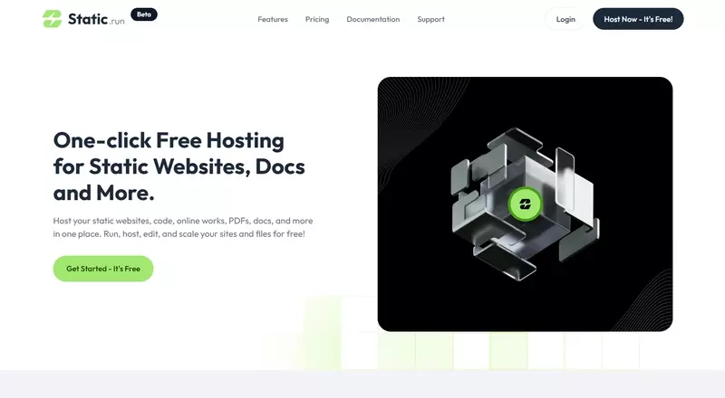
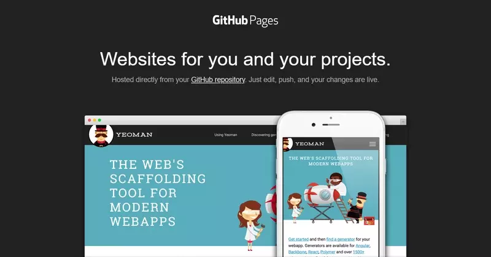
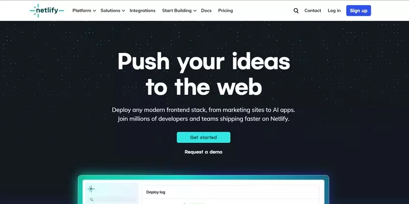
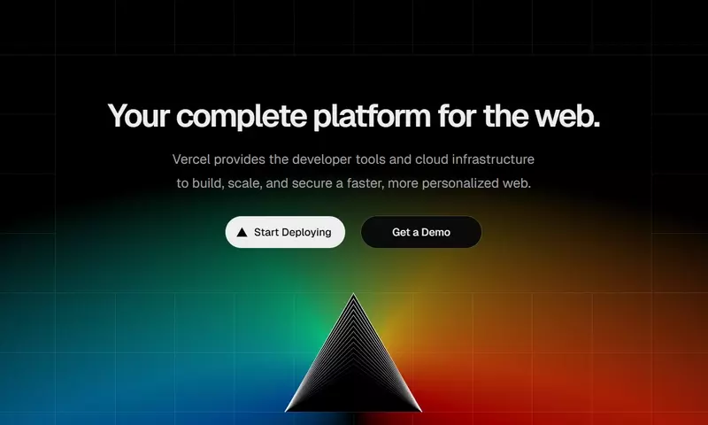
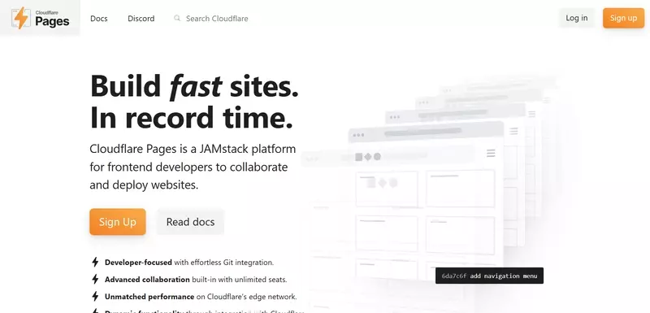
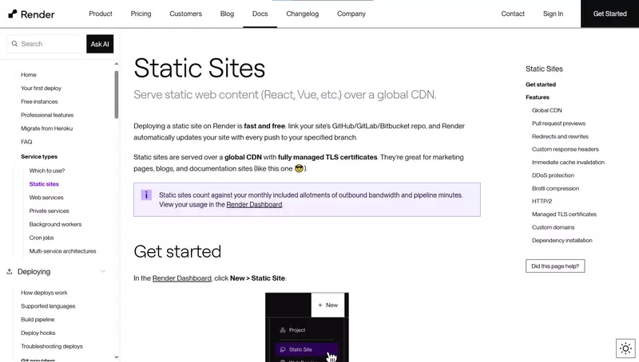
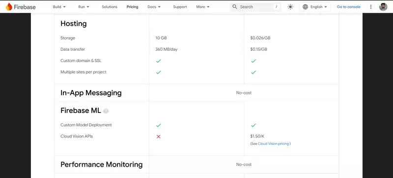
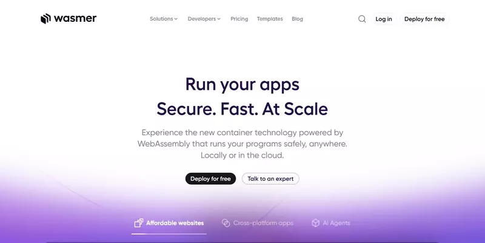
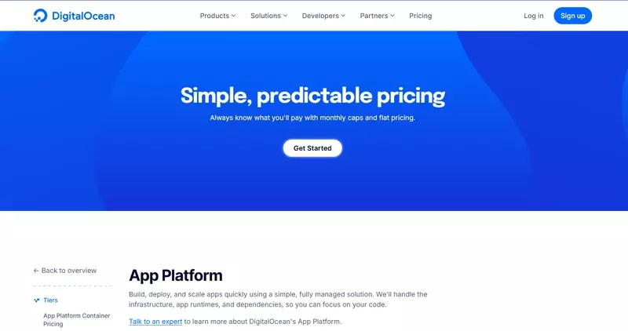

# 1)  9+ Nền tảng Hosting Website tĩnh miễn phí tốt nhất (Không cần thẻ tín dụng)

Bạn cần host một trang web tĩnh miễn phí mà không cần nhập thông tin thẻ tín dụng?

Dù bạn là sinh viên, lập trình viên indie, developer hay chỉ đơn giản là đang làm một dự án nhỏ bên lề — hướng dẫn này dành cho bạn. Bạn không cần phải tốn một xu nào để đưa website lên mạng.

## Website tĩnh là gì?

Website tĩnh bao gồm các file cố định như HTML, CSS, JS, hình ảnh và tài nguyên — không cần backend hoặc cơ sở dữ liệu. Bạn có thể triển khai website tĩnh dễ dàng và siêu nhanh.

Giờ là phần hấp dẫn — có rất nhiều nền tảng host website tĩnh miễn phí cho phép bạn lên sóng chỉ trong vài phút.

Cùng khám phá những cái tên tốt nhất nhé.

---

### 1. **Static.run** (Hosting miễn phí một chạm)

Static.run là cách dễ nhất để host website tĩnh, CV, hình ảnh và tài liệu — không cần đăng nhập hay thẻ tín dụng. Chỉ cần kéo thả là có ngay link chia sẻ. Phù hợp để demo nhanh, trang cá nhân hoặc chia sẻ PDF.

**Tính năng chính:**

*   Upload HTML, hình ảnh, file ZIP, PDF, CV
*   Kéo thả HTML để upload nhanh
*   Hosting hình ảnh và PDF miễn phí
*   Chia sẻ link CV và file ZIP
*   Triển khai tức thì với link chia sẻ
*   Trình soạn mã tích hợp sẵn

**Ưu điểm:**

*   Rất dễ dùng cho người mới
*   Nhanh gọn cho web 1 trang, portfolio
*   Tuyệt vời để prototyping nhanh hoặc chia sẻ tài liệu
*   Host 5 website miễn phí
*   200 MB lưu trữ, tên miền phụ không giới hạn
*   Gắn 1 tên miền tùy chỉnh miễn phí
*   SSL miễn phí
*   10 GB băng thông/tháng

**Nhược điểm:**

*   Không hỗ trợ Git hoặc CI/CD

Bạn có thể truy cập tại: [https://static.run/](https://static.run/)

---

### 2. **GitHub Pages**

GitHub Pages cho phép bạn host website tĩnh trực tiếp từ repo GitHub. Tuyệt vời cho dự án, tài liệu, hoặc site cá nhân.

**Tính năng chính:**

*   Triển khai qua Git
*   Hỗ trợ tên miền tùy chỉnh
*   HTTPS miễn phí
*   Phù hợp với dự án mã nguồn mở

**Nhược điểm:**

*   Cần thiết lập thủ công với người mới
*   Công cụ build giới hạn

Bạn có thể truy cập tại: [https://pages.github.com/](https://pages.github.com/)

---

### 3. **Netlify**

Netlify là nền tảng mạnh mẽ và thân thiện với lập trình viên để triển khai website tĩnh kèm CI/CD, form, function và nhiều hơn nữa.

**Tính năng chính:**

*   Triển khai Git một chạm
*   Tên miền tùy chỉnh & SSL miễn phí
*   CI/CD tích hợp sẵn & xem trước bản deploy

**Ưu điểm:**

*   Dễ sử dụng
*   Gói miễn phí có nhiều tính năng

**Nhược điểm:**

*   Có thể quá “dư” với dự án đơn giản

Bạn có thể truy cập tại: [https://www.netlify.com/](https://www.netlify.com/)

---

### 4. **Vercel**

Được xây dựng bởi nhóm tạo ra Next.js, Vercel mượt mà, nhanh chóng và tối ưu cho framework frontend và site tĩnh.

**Tính năng chính:**

*   Tích hợp GitHub/GitLab
*   CDN toàn cầu cực nhanh
*   Hỗ trợ Next.js, React, v.v.

**Ưu điểm:**

*   Tối ưu cho frontend dev
*   Trải nghiệm dev mượt mà

**Nhược điểm:**

*   Tập trung vào ứng dụng dùng framework

Bạn có thể truy cập tại: [https://vercel.com/](https://vercel.com/)

---

### 5. **Cloudflare Pages**

Cloudflare Pages là nền tảng hosting tĩnh nhanh, bảo mật, mở rộng được, chạy trên mạng biên của Cloudflare.

**Tính năng chính:**

*   Tích hợp Git
*   Tự động build & deploy
*   Bảo vệ DDoS

**Ưu điểm:**

*   Rất nhanh nhờ CDN toàn cầu
*   Bảo mật mặc định

**Nhược điểm:**

*   Không hỗ trợ chức năng động gốc

Bạn có thể truy cập tại: [https://pages.cloudflare.com/](https://pages.cloudflare.com/)

---

### 6. **Render** (Static Sites)

Render cung cấp hosting site tĩnh với tích hợp Git và tự động deploy — lý tưởng cho site tĩnh.

**Tính năng chính:**

*   Tên miền tùy chỉnh miễn phí
*   Auto SSL
*   Hỗ trợ background jobs và cron (trong gói trả phí)

**Ưu điểm:**

*   Thiết lập đơn giản
*   Tài liệu và UI thân thiện

**Nhược điểm:**

*   Có thể hơi khó tiếp cận với người mới

Bạn có thể truy cập tại: [https://render.com/](https://render.com/)

---

### 7. **Firebase Hosting** (Gói miễn phí)

Firebase Hosting của Google cho phép host website tĩnh miễn phí với tốc độ cực nhanh và HTTPS.

**Tính năng chính:**

*   CDN toàn cầu
*   Deploy bằng một lệnh
*   Hỗ trợ tên miền tùy chỉnh

**Ưu điểm:**

*   Rất phù hợp cho ứng dụng một trang (SPA)
*   Tích hợp tốt với hệ sinh thái Firebase

**Nhược điểm:**

*   Cần cài đặt Firebase CLI

Bạn có thể truy cập tại: [https://firebase.google.com/products/hosting](https://firebase.google.com/products/hosting)

---

### 8. **Surge.sh**

Surge.sh là công cụ dòng lệnh đơn giản để publish site tĩnh, phù hợp cho dự án nhanh hoặc portfolio dev.

**Tính năng chính:**

*   Deploy chỉ với 1 lệnh (`surge`)
*   Hỗ trợ tên miền tùy chỉnh
*   Không cần đăng nhập (với dùng cơ bản)

**Ưu điểm:**

*   Triển khai siêu nhanh
*   Không bị làm phiền bởi giao diện

**Nhược điểm:**

*   Chỉ có CLI
*   Không có tính năng nhóm/team

Bạn có thể truy cập tại: [https://surge.sh/](https://surge.sh/)

---

### 9. **Wasmer Edge Apps**

Wasmer.io cung cấp hosting ứng dụng trên mạng biên (edge), hỗ trợ WebAssembly. Cao cấp hơn nhưng rất nhanh cho app tĩnh hoặc WASM.

**Tính năng chính:**

*   Hosting mạng biên
*   Deploy qua GitHub
*   Hiệu suất cao

**Ưu điểm:**

*   Giao hàng siêu nhanh
*   Hỗ trợ ứng dụng WASM

**Nhược điểm:**

*   Không dành cho người mới

Bạn có thể truy cập tại: [https://wasmer.io/](https://wasmer.io/)

---

### 10. **DigitalOcean App Platform** (Gói miễn phí)

DigitalOcean App Platform cung cấp hosting tĩnh với CI/CD và hạ tầng đám mây có thể mở rộng. *Lưu ý: Nền tảng này **yêu cầu thẻ tín dụng** để đăng ký.*

**Tính năng chính:**

*   Deploy qua GitHub
*   Tầng hosting tĩnh miễn phí
*   Tên miền tùy chỉnh + SSL

**Ưu điểm:**

*   Tốt để mở rộng sau này
*   Gói miễn phí cho 3 site tĩnh

**Nhược điểm:**

*   Giao diện có thể nặng với dự án nhỏ
*   Yêu cầu thẻ tín dụng

Bạn có thể truy cập tại: [https://www.digitalocean.com/products/app-platform](https://www.digitalocean.com/products/app-platform)

---