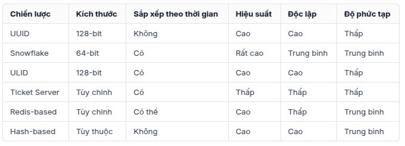

# 1  Cách Tạo ID Độc Nhất Trong Hệ Thống Phân Tán: 6 Chiến Lược Chính

## Giới thiệu

Trong các hệ thống phân tán hiện đại, việc tạo ra định danh (ID) độc nhất là một thách thức cốt lõi nhưng cực kỳ quan trọng. Khi nhiều máy chủ cần tạo ID đồng thời mà không có sự phối hợp trung tâm, việc đảm bảo tính duy nhất, tránh trùng lặp là yêu cầu thiết yếu để duy trì tính nhất quán của hệ thống.

## Tại sao ID Độc Nhất lại Quan Trọng trong Hệ Thống Phân Tán?

*   **Phân biệt đối tượng:** Đảm bảo mỗi dữ liệu, giao dịch, hoặc thực thể có một định danh duy nhất.
*   **Tránh xung đột:** Ngăn chặn việc nhiều node tạo ra cùng một ID cho các đối tượng khác nhau.
*   **Tính nhất quán:** Duy trì sự toàn vẹn dữ liệu trên toàn hệ thống.
*   **Hỗ trợ xử lý:** Cần thiết cho việc xử lý giao dịch, sắp xếp dữ liệu, và phục hồi sau sự cố.

## 6 Chiến Lược Tạo ID Độc Nhất

Dưới đây là 6 chiến lược phổ biến để tạo ID độc nhất trong môi trường phân tán:

### 1. UUID (Universally Unique Identifier)

UUID là một chuẩn tạo ID 128-bit được thiết kế để đảm bảo tính duy nhất trên toàn cầu mà không cần điều phối trung tâm.

*   **Ưu điểm:**
    *   Đảm bảo tính độc nhất toàn cầu rất cao.
    *   Dễ triển khai, không cần điều phối giữa các node.
    *   Hỗ trợ rộng rãi trong nhiều ngôn ngữ và framework.
*   **Nhược điểm:**
    *   Kích thước lớn (128-bit), tốn dung lượng lưu trữ và băng thông mạng.
    *   **Không** sắp xếp được theo thứ tự thời gian tạo.
    *   Dạng chuỗi dài và khó đọc/debug.
*   **Ứng dụng phù hợp:** Hệ thống ưu tiên sự đơn giản triển khai, không yêu cầu ID có thứ tự thời gian, chấp nhận kích thước ID lớn.

### 2. Snowflake ID

Được phát triển bởi Twitter, Snowflake ID là một định dạng ID 64-bit, kết hợp:

*   Dấu thời gian (Timestamp - millisecond precision)
*   ID Máy chủ/Worker (Worker ID)
*   Số tuần tự (Sequence Number - trong cùng một millisecond trên cùng một worker)

*   **Ưu điểm:**
    *   Kích thước nhỏ gọn (64-bit).
    *   **Sắp xếp được theo thứ tự thời gian** (approximately time-sortable).
    *   Hiệu suất tạo ID rất cao.
    *   Không cần phối hợp trung tâm (sau khi worker ID đã được phân phối).
*   **Nhược điểm:**
    *   Yêu cầu **đồng bộ hóa thời gian** (NTP) giữa các máy chủ để đảm bảo thứ tự thời gian chính xác.
    *   Cần một cơ chế để **phân phối và quản lý Worker ID** duy nhất cho mỗi node tạo ID.
*   **Ứng dụng phù hợp:** Mạng xã hội, hệ thống xử lý giao dịch lớn, hệ thống ghi log, nơi thứ tự thời gian và hiệu suất cao là quan trọng.

### 3. ULID (Universally Unique Lexicographically Sortable Identifier)

ULID là định dạng ID 128-bit, kết hợp ưu điểm của UUID (tính duy nhất) và Snowflake (sắp xếp được).

*   **Ưu điểm:**
    *   **Sắp xếp được theo thứ tự từ điển (lexicographically)**, dựa trên thành phần thời gian.
    *   Độc lập với cơ sở hạ tầng (không cần worker ID).
    *   Biểu diễn dạng chuỗi ngắn gọn hơn UUID (26 ký tự, base32).
    *   Tương thích với UUID (cùng độ dài 128-bit).
*   **Nhược điểm:**
    *   Kích thước vẫn là 128-bit, lớn hơn Snowflake.
    *   Ít phổ biến hơn UUID.
*   **Ứng dụng phù hợp:** Hệ thống cần ID có thứ tự thời gian, muốn tránh sự phức tạp của việc quản lý worker ID (như Snowflake), và chấp nhận ID 128-bit.

### 4. Máy chủ Tạo ID Tập Trung (Ticket Server)

Sử dụng một dịch vụ hoặc máy chủ trung tâm duy nhất chịu trách nhiệm cấp phát các ID tuần tự hoặc theo một logic nhất định.

*   **Ưu điểm:**
    *   Đơn giản về mặt khái niệm.
    *   Đảm bảo tính tuần tự tuyệt đối (nếu cần).
    *   Dễ hiểu và triển khai ban đầu.
*   **Nhược điểm:**
    *   **Điểm lỗi đơn (Single Point of Failure):** Nếu máy chủ này gặp sự cố, toàn bộ hệ thống không thể tạo ID mới.
    *   **Nút cổ chai hiệu năng (Bottleneck):** Khả năng tạo ID bị giới hạn bởi năng lực của máy chủ trung tâm.
    *   **Độ trễ mạng:** Mỗi lần cần ID phải có một cuộc gọi mạng đến máy chủ trung tâm.
*   **Ứng dụng phù hợp:** Hệ thống quy mô nhỏ, yêu cầu tính tuần tự nghiêm ngặt, chấp nhận các hạn chế về khả năng mở rộng và chịu lỗi.

### 5. Phương Pháp Dựa trên Redis

Sử dụng các lệnh nguyên tử của Redis (như `INCR` hoặc `INCRBY`) để tạo ra các bộ đếm (counter) duy nhất.

*   **Ưu điểm:**
    *   Hiệu suất cao (Redis là in-memory).
    *   Đảm bảo tính nguyên tử của thao tác tăng số đếm.
    *   Dễ triển khai nếu hệ thống đã sử dụng Redis.
*   **Nhược điểm:**
    *   **Phụ thuộc vào Redis:** Hệ thống phải có Redis hoạt động ổn định.
    *   **Độ bền:** Cần cấu hình Redis persistence (AOF/RDB) cẩn thận để tránh mất ID sau khi khởi động lại nếu cần ID bền vững.
    *   Vẫn có thể trở thành nút cổ chai nếu tải quá lớn tập trung vào một key Redis duy nhất (có thể giảm thiểu bằng cách dùng nhiều key).
*   **Ứng dụng phù hợp:** Hệ thống đã tích hợp Redis, cần tạo ID nhanh chóng, chấp nhận sự phụ thuộc vào Redis.

### 6. ID Dựa trên Hash

Sử dụng các thuật toán băm (như MD5, SHA-1, SHA-256) để tạo ID từ một tập hợp dữ liệu đầu vào có tính xác định (ví dụ: nội dung file, URL, thông tin người dùng).

*   **Ưu điểm:**
    *   ID có thể có ý nghĩa hoặc liên kết với dữ liệu nguồn.
    *   **Stateless:** Không cần lưu trạng thái hoặc điều phối, ID có thể được tạo ở bất kỳ đâu nếu có cùng đầu vào.
    *   Có thể tái tạo ID nếu có cùng dữ liệu đầu vào.
*   **Nhược điểm:**
    *   **Nguy cơ xung đột (collision):** Mặc dù hiếm với các thuật toán hash tốt, nhưng vẫn có khả năng hai đầu vào khác nhau tạo ra cùng một hash.
    *   **Không** sắp xếp được theo thời gian.
    *   Việc chọn dữ liệu đầu vào và thuật toán hash cần cẩn thận.
    *   Có thể tiết lộ thông tin về dữ liệu đầu vào nếu không được thiết kế cẩn thận (ví dụ: dùng hash không salt).
*   **Ứng dụng phù hợp:** Hệ thống cần ID dựa trên nội dung (content-addressable storage), chống trùng lặp dữ liệu, hoặc các trường hợp cần ID có thể tái tạo một cách nhất quán từ dữ liệu nguồn.

## Cách Lựa Chọn Chiến Lược Phù Hợp

Việc chọn chiến lược phụ thuộc vào các yêu cầu cụ thể của hệ thống:

*   **Kích thước ID:** Snowflake (64-bit) nhỏ gọn hơn UUID/ULID (128-bit).
*   **Thứ tự Thời gian:** Snowflake và ULID hỗ trợ sắp xếp theo thời gian, UUID và Hash thì không. Ticket Server/Redis có thể tạo ID tuần tự.
*   **Khả năng Mở rộng & Hiệu suất:** UUID, Snowflake, ULID được thiết kế cho hệ thống phân tán quy mô lớn. Ticket Server và Redis có thể gặp giới hạn.
*   **Độ Phức tạp Triển khai:** UUID đơn giản nhất. Snowflake yêu cầu quản lý worker ID và đồng bộ thời gian. Ticket Server/Redis yêu cầu hạ tầng bổ sung.
*   **Phụ thuộc Hạ tầng:** UUID/ULID/Hash ít phụ thuộc nhất. Snowflake cần NTP và cơ chế phân phối worker ID. Ticket Server/Redis yêu cầu máy chủ/dịch vụ riêng.
*   **Nguy cơ Xung đột:** UUID/ULID/Snowflake được thiết kế để giảm thiểu tối đa xung đột. Hash có nguy cơ (dù thấp). Ticket Server/Redis (nếu triển khai đúng) không có xung đột.

## Kết luận

Tạo ID độc nhất là bài toán quan trọng trong hệ thống phân tán. Mỗi chiến lược (UUID, Snowflake, ULID, Ticket Server, Redis-based, Hash-based) đều có ưu và nhược điểm riêng.

*   **Snowflake** thường là lựa chọn mạnh mẽ cho các hệ thống hiện đại cần hiệu suất cao và ID sắp xếp theo thời gian, nhưng đòi hỏi quản lý worker ID và đồng bộ thời gian.
*   **UUID** là lựa chọn đơn giản, phổ biến khi thứ tự không quan trọng.
*   **ULID** là sự cân bằng tốt giữa UUID và Snowflake.
*   Các giải pháp khác như **Ticket Server**, **Redis**, **Hash** phù hợp cho các trường hợp sử dụng cụ thể hơn.

Hiểu rõ yêu cầu của hệ thống về tính duy nhất, thứ tự, hiệu suất, khả năng mở rộng và độ phức tạp là chìa khóa để lựa chọn chiến lược phù hợp, xây dựng nên một hệ thống phân tán mạnh mẽ và hiệu quả.

# 2  So Sánh Message Queue và Message Broker trong Hệ Thống Phân Tán

## Giới thiệu

Trong các kiến trúc phần mềm hiện đại, đặc biệt là các hệ thống phân tán và microservices, việc giao tiếp hiệu quả và đáng tin cậy giữa các thành phần là cực kỳ quan trọng. Giao tiếp bất đồng bộ (asynchronous communication) thường được sử dụng để tăng khả năng phục hồi và tách rời (decoupling) các dịch vụ. Hai khái niệm cốt lõi trong lĩnh vực này là **Message Queue (Hàng đợi thông điệp)** và **Message Broker (Trung gian thông điệp)**.

Mặc dù thường được sử dụng thay thế cho nhau trong một số ngữ cảnh, chúng có những đặc điểm và mục đích sử dụng khác nhau. Hiểu rõ sự khác biệt này giúp lựa chọn công cụ phù hợp cho nhu vực cụ thể của hệ thống.

## Message Queue (Hàng đợi Thông điệp) là gì?

Message Queue là một thành phần phần mềm hoặc cấu trúc dữ liệu hoạt động như một bộ đệm, lưu trữ các thông điệp được gửi giữa các tiến trình hoặc ứng dụng khác nhau.

*   **Nguyên lý hoạt động:**
    *   **Producer (Nhà sản xuất):** Một thành phần gửi thông điệp vào cuối hàng đợi.
    *   **Consumer (Người tiêu dùng):** Một thành phần khác lấy thông điệp ra từ đầu hàng đợi để xử lý.
    *   Hoạt động theo nguyên tắc **FIFO (First-In, First-Out)**: Thông điệp nào vào trước sẽ được xử lý trước.
*   **Đặc điểm chính:**
    *   Cung cấp cơ chế giao tiếp **một-một (point-to-point)**: Thông điệp thường được gửi từ một producer đến một consumer duy nhất (mặc dù có thể có nhiều consumer cạnh tranh để lấy thông điệp từ cùng một hàng đợi, nhưng mỗi thông điệp cụ thể thường chỉ được xử lý thành công bởi một consumer).
    *   Đảm bảo thứ tự xử lý cơ bản (FIFO).
    *   Tập trung vào việc lưu trữ và phân phối tuần tự.
*   **Ứng dụng điển hình:**
    *   Xử lý các tác vụ nền (background tasks) cần được thực hiện tuần tự.
    *   Đảm bảo mỗi tác vụ (thông điệp) chỉ được xử lý đúng một lần.
    *   Tách rời các thành phần đơn giản trong một quy trình làm việc.

## Message Broker (Trung gian Thông điệp) là gì?

Message Broker là một phần mềm trung gian phức tạp hơn, đóng vai trò là một trung tâm điều phối và định tuyến thông điệp giữa các ứng dụng hoặc dịch vụ khác nhau. Nó không chỉ lưu trữ thông điệp mà còn quản lý luồng thông điệp.

*   **Nguyên lý hoạt động:**
    *   Hoạt động như một "bưu điện" trung tâm: Nhận thông điệp từ nhiều producer.
    *   Định tuyến (route) thông điệp đến một hoặc nhiều consumer dựa trên các quy tắc, chủ đề (topics), hoặc mẫu (patterns) đã được cấu hình.
    *   Có thể thực hiện các chức năng bổ sung như chuyển đổi định dạng thông điệp, lọc thông điệp, đảm bảo giao hàng, xử lý lỗi...
*   **Đặc điểm chính:**
    *   Hỗ trợ nhiều mô hình giao tiếp:
        *   **Point-to-Point (One-to-One):** Tương tự như Message Queue.
        *   **Publish/Subscribe (Pub/Sub - One-to-Many):** Producer gửi thông điệp đến một "chủ đề" (topic), và tất cả các consumer đã đăng ký (subscribed) vào chủ đề đó đều nhận được một bản sao của thông điệp.
        *   Request/Reply, Routing patterns...
    *   Cung cấp khả năng định tuyến thông minh.
    *   Thường có các tính năng quản lý, giám sát, và bảo mật nâng cao.
*   **Ứng dụng điển hình:**
    *   Các hệ thống microservices phức tạp cần giao tiếp linh hoạt.
    *   Phân phối sự kiện (event distribution) đến nhiều hệ thống con quan tâm.
    *   Tích hợp các ứng dụng khác nhau (Application Integration).
    *   Xây dựng các kiến trúc hướng sự kiện (Event-Driven Architectures).

## So Sánh Sự Khác Biệt Chính

| Tính năng             | Message Queue                           | Message Broker                                               |
| :-------------------- | :-------------------------------------- | :----------------------------------------------------------- |
| **Phạm vi chức năng** | Tập trung: Lưu trữ & phân phối (FIFO)   | Rộng: Lưu trữ, Định tuyến, Pub/Sub, Chuyển đổi, Lọc, Giám sát |
| **Mô hình giao tiếp** | Chủ yếu Point-to-Point (One-to-One)     | Point-to-Point, Publish/Subscribe (One-to-Many), và nhiều hơn |
| **Độ phức tạp**       | Thường đơn giản hơn để thiết lập và dùng | Phức tạp hơn, nhiều cấu hình và tính năng hơn                |
| **Khả năng mở rộng**  | Mở rộng tốt cho mô hình P2P đơn giản    | Thiết kế cho hệ thống phức tạp, mở rộng đa dạng, xử lý lưu lượng lớn |
| **Vai trò**           | Bộ đệm FIFO, đảm bảo thứ tự             | Trung tâm điều phối, định tuyến thông điệp thông minh         |

## Các Công Nghệ Phổ Biến

*   **Message Queue (hoặc các Broker được dùng như Queue đơn giản):**
    *   `Amazon SQS (Simple Queue Service)`
    *   `Azure Queue Storage`
    *   `Google Cloud Tasks`
    *   `RabbitMQ` (khi cấu hình cho hàng đợi point-to-point đơn giản)
    *   `Redis` (có thể dùng Lists hoặc Streams làm hàng đợi đơn giản)
    *   `MSMQ (Microsoft Message Queue)` (cũ hơn)

*   **Message Broker:**
    *   `Apache Kafka` (thường được xem là nền tảng streaming sự kiện, nhưng hoạt động như một broker mạnh mẽ)
    *   `RabbitMQ` (hỗ trợ đầy đủ các mô hình AMQP, bao gồm pub/sub, routing...)
    *   `Apache ActiveMQ` / `ActiveMQ Artemis`
    *   `NATS`
    *   `Google Cloud Pub/Sub`
    *   `Azure Service Bus`
    *   `IBM MQ`

*Lưu ý:* Một số công nghệ như `RabbitMQ` có thể hoạt động như cả một Message Queue đơn giản hoặc một Message Broker đầy đủ tính năng tùy thuộc vào cách bạn cấu hình và sử dụng nó.

## Khi Nào Nên Dùng Message Queue?

*   Bạn cần một giải pháp đơn giản để xử lý các tác vụ nền theo thứ tự FIFO.
*   Mô hình giao tiếp chủ yếu là point-to-point (một producer, một consumer hoặc nhiều consumer cạnh tranh).
*   Yêu cầu chính là tách rời producer và consumer và đảm bảo thông điệp được xử lý (ít nhất một lần hoặc đúng một lần tùy cấu hình).
*   Hệ thống không quá phức tạp và không yêu cầu định tuyến thông minh hay mô hình pub/sub.
*   Ưu tiên sự đơn giản trong triển khai và vận hành.

## Khi Nào Nên Dùng Message Broker?

*   Bạn đang xây dựng một hệ thống phân tán phức tạp với nhiều microservices cần giao tiếp với nhau.
*   Cần hỗ trợ mô hình publish/subscribe để thông báo sự kiện đến nhiều người nghe.
*   Yêu cầu định tuyến thông điệp linh hoạt dựa trên nội dung, tiêu đề hoặc các quy tắc kinh doanh.
*   Cần các tính năng nâng cao như đảm bảo giao hàng, xử lý giao dịch, chuyển đổi định dạng, giám sát chi tiết.
*   Hệ thống yêu cầu khả năng mở rộng cao để xử lý lưu lượng lớn thông điệp và nhiều kết nối đồng thời.
*   Xây dựng kiến trúc hướng sự kiện (EDA).

## Kết Luận

Message Queue là một khái niệm cơ bản và thường là một thành phần *trong* một Message Broker. Message Broker cung cấp một tập hợp các chức năng phong phú hơn, bao gồm cả chức năng của một hàng đợi cơ bản, nhưng bổ sung thêm khả năng định tuyến, pub/sub và quản lý phức tạp hơn.

Việc lựa chọn giữa chúng phụ thuộc vào nhu cầu cụ thể:

*   Chọn **Message Queue** (hoặc sử dụng Broker ở chế độ queue đơn giản) cho các nhu cầu giao tiếp point-to-point, xử lý tác vụ tuần tự đơn giản.
*   Chọn **Message Broker** cho các hệ thống phân tán phức tạp, kiến trúc microservices, kiến trúc hướng sự kiện cần sự linh hoạt trong định tuyến và mô hình pub/sub.

Hiểu rõ sự khác biệt này giúp các kỹ sư đưa ra quyết định kiến trúc đúng đắn, xây dựng các hệ thống phân tán hiệu quả, linh hoạt và có khả năng mở rộng tốt.