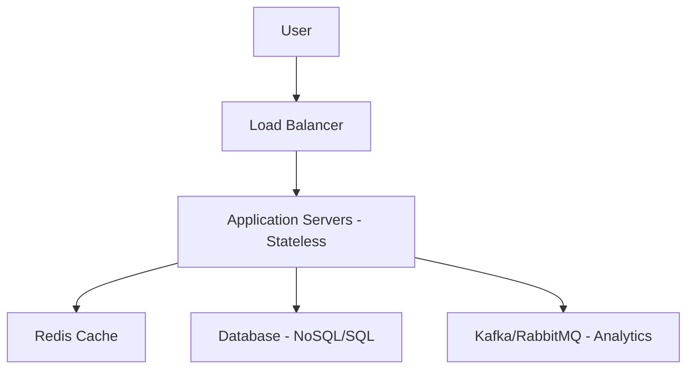

# 🔗 Thiết Kế URL Shortener (Bitly): Từ Base62 Đến Scale 1 Tỷ Links

Thiết kế một dịch vụ rút gọn link không chỉ đơn giản là "băm một chuỗi". Khi phải xử lý 100 triệu URL mới mỗi tháng với tỷ lệ đọc/ghi 200:1, hệ thống phải đối mặt với các thách thức về độ trễ, xung đột (collision) và khả năng mở rộng.

---

## 📊 1. Yêu Cầu Hệ Thống (Requirements)

### Yêu cầu chức năng:
- Rút gọn Long URL thành Short URL.
- Redirect người dùng khi click vào Short URL (HTTP 301/302).
- Hỗ trợ Custom Alias (tùy chỉnh tên link).
- Theo dõi Analytics (click count, địa lý, thiết bị).
- Chính sách hết hạn (Expiration policy).

### Yêu cầu phi chức năng:
- **Availability:** 99.99% uptime.
- **Low Latency:** Redirect dưới 100ms.
- **Scale:** 100M URLs mới/tháng, tỷ lệ Read/Write = 200:1.
- **Storage:** ~60TB cho 120 tỷ URL (dự tính trong 100 năm).

---

## 🏗️ 2. Kiến Trúc Tổng Quan



---

## ⚙️ 3. Giải Thuật Sinh Short Code (Trái Tim Hệ Thống)

### Phương pháp 1: Base62 Encoding với Counter
Sử dụng 62 ký tự `[a-z, A-Z, 0-9]`. Với 7 ký tự, ta có $62^7 \approx 3.5$ tỷ kết hợp.

```javascript
const BASE62_CHARS = '0123456789abcdefghijklmnopqrstuvwxyzABCDEFGHIJKLMNOPQRSTUVWXYZ';

function toBase62(num) {
    let result = '';
    while (num > 0) {
        result = BASE62_CHARS[num % 62] + result;
        num = Math.floor(num / 62);
    }
    return result.padStart(7, '0');
}
```
- **Ưu điểm:** Không xung đột, 100% duy nhất nếu dùng Central Counter (Redis `INCR`).
- **Nhược điểm:** Dễ bị đoán được URL tiếp theo (Sequential).

### Phương pháp 2: MD5 Hashing + Collision Resolution
Băm URL dài bằng MD5, lấy 7 ký tự đầu.
- **Vấn đề:** Xung đột (Collision) cao.
- **Giải pháp:** Nếu trùng, thêm salt (muối) hoặc lấy 7 ký tự tiếp theo trong chuỗi hash cho đến khi tìm được mã duy nhất trong DB.

### Phương pháp 3: Twitter Snowflake Pattern
Dùng 64-bit ID (Timestamp + Machine ID + Sequence) rồi encode sang Base62. Giúp generate ID phân tán mà không cần Central Counter.

---

## 🗄️ 4. Thiết Kế Cơ Sở Dữ Liệu

### Tại sao chọn NoSQL (DynamoDB/Cassandra)?
- Truy xuất Key-Value đơn giản: `short_code` ➔ `long_url`.
- Khả năng ghi cực cao (40-100 URLs/s).
- Dễ dàng mở rộng hàng ngang (Horizontal Scaling).

### Schema (Ví dụ DynamoDB):
```json
{
  "short_code": "aKc3K4b", // Partition Key
  "long_url": "https://example.com/very-long-link",
  "user_id": "user123",
  "created_at": 1640000000,
  "click_count": 12453
}
```

---

## 🚀 5. Chiến Lược Caching (Performance Multiplier)

Áp dụng quy tắc **Pareto (80/20)**: 20% các URL phổ biến tạo ra 80% lưu lượng truy cập.

1. **Lớp Cache (Redis):** Lưu trữ các URL "Hot" với TTL (ví dụ 24h).
2. **Redirect Flow:** 
   - Check Redis ➔ **Hit:** Trả về ngay.
   - **Miss:** Query DB ➔ Lưu vào Redis ➔ Trả về.
3. **HTTP 301 vs 302:**
   - **301 (Permanent):** Trình duyệt cache lại, giảm tải cho server nhưng khó thu thập analytics chính xác.
   - **302 (Temporary):** Server luôn nhận được request, tốt cho việc đếm click.

---

## 📈 6. Scaling & Analytics

### Database Sharding
- **Key-based Sharding:** Dùng `hash(short_code) % NUM_SHARDS` để quyết định dữ liệu nằm ở server nào.
- **Geographic Distribution:** Dùng CDN/Edge Computing để xử lý redirect tại vị trí gần người dùng nhất.

### Analytics Pipeline
Không nên update lượt click trực tiếp vào DB chính (gây nghẽn). 
- **Flow:** Click ➔ Kafka ➔ Background Worker ➔ Aggregated DB (ClickHouse/Elasticsearch).

---

## 🛡️ 7. Bảo Mật & Chống Lạm Dụng
- **Malicious URL Detection:** Tích hợp Google Safe Browsing API để ngăn chặn link lừa đảo.
- **Rate Limiting:** Giới hạn mỗi IP chỉ được tạo tối đa 100 link/giờ để tránh bot spam.
- **Content Filtering:** Blacklist các domain rác hoặc TLD miễn phí thường dùng để phát tán mã độc.

---

## 🏁 Tổng Kết
Thiết kế URL Shortener là bài toán tổng hòa của nhiều kỹ thuật:
- **Hashing/Encoding** để tạo mã ngắn.
- **NoSQL & Sharding** để lưu trữ hàng tỷ bản ghi.
- **Redis Caching** để giảm độ trễ xuống dưới 10ms.
- **Message Queue** để xử lý tracking không đồng bộ.

---
*Tài liệu này được lưu trữ trong kho kiến thức `tin2709-learning` để phục vụ nghiên cứu System Design.*