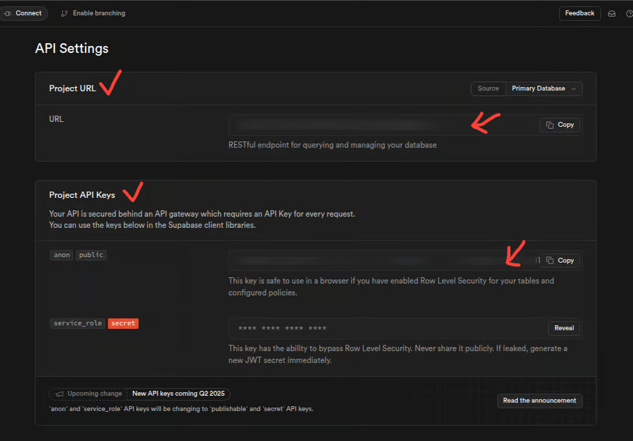
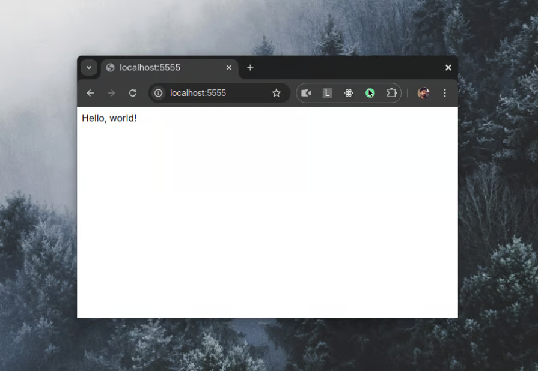

# 1  Xây dựng ứng dụng web chạy trên máy chủ với htmx: Tutorial To-Do App
Sponsor by https://blog.logrocket.com/htmx-server-driven-web-apps/?ref=dailydev

Dự án này là mã nguồn và giải thích dựa trên một hướng dẫn về cách sử dụng thư viện htmx để xây dựng một ứng dụng To-Do đơn giản, chạy trên máy chủ. Nó thể hiện phương pháp tiếp cận "hypermedia-driven" của htmx như một giải pháp thay thế cho các framework JavaScript client-side phức tạp trong một số trường hợp.

## Giới thiệu

Trong bối cảnh phát triển web hiện đại đang dịch chuyển nhanh chóng với các giải pháp phức tạp như Server Components hay các framework lớn (React, Vue, Svelte), sự đơn giản của các thư viện cổ điển như jQuery dường như ít phổ biến hơn. htmx ra đời nhằm thu hẹp khoảng cách này, mang đến cách tiếp cận đơn giản hóa để xây dựng các ứng dụng web "chạy trên máy chủ" (server-driven).

## htmx là gì?

*   **Thư viện JavaScript nhỏ, hướng trình duyệt:** htmx là một thư viện JavaScript gọn nhẹ (~14KB nén gzip), không phụ thuộc.
*   **Mục tiêu:** Xây dựng các ứng dụng web đơn giản, không rườm rà mà logic chính nằm ở phía máy chủ.
*   **Cách hoạt động cốt lõi:** Cho phép bạn thực hiện các yêu cầu AJAX (và nhiều hơn nữa) trực tiếp từ các phần tử HTML thông qua các **thuộc tính tùy chỉnh** (custom attributes).
*   **Phương pháp Hypermedia-driven:** Thay vì trao đổi dữ liệu (JSON, GraphQL) và xử lý UI hoàn toàn ở client, htmx khuyến khích máy chủ trả về các mảnh **siêu phương tiện** (thường là HTML) để client (htmx) chèn hoặc thay thế vào DOM hiện có.
*   **Không phải là phiên bản mới của HTML:** htmx là thư viện **bổ sung** sức mạnh cho HTML, giúp HTML có khả năng tương tác động với backend một cách dễ dàng.

### Ví dụ cơ bản

```html
<button
  hx-get="/path/to/api"
  hx-swap="innerHTML"
  hx-target="#target-container"
>
  Nhấn vào đây
</button>

<div id="target-container">Nội dung ban đầu...</div>
```
Khi nhấn nút, htmx sẽ gửi yêu cầu GET đến `/path/to/api`. Nội dung HTML nhận được từ phản hồi sẽ thay thế `innerHTML` của phần tử có `id="target-container"`.

## Ưu điểm của htmx

*   **Đơn giản:** Không yêu cầu kỹ năng JavaScript nâng cao.
*   **Nhẹ:** Kích thước nhỏ, không phụ thuộc.
*   **Cập nhật UI động:** Sử dụng AJAX để cập nhật một phần trang mà không cần tải lại toàn bộ.
*   **Ưu tiên Server-side:** Giữ logic template và xử lý chính ở máy chủ.
*   **Ít JavaScript ở Client:** Giảm đáng kể lượng mã JS cần viết thủ công.
*   **Nâng cao dần (Progressive Enhancement):** Ứng dụng cơ bản hoạt động với HTML tĩnh, htmx thêm lớp tương tác động.
*   **Hỗ trợ trình duyệt:** Hoạt động trên mọi trình duyệt hỗ trợ AJAX (bao gồm IE 11).
*   **Mở rộng:** Có các extension chính thức và cộng đồng để mở rộng chức năng.

## Nhược điểm của htmx

*   **Phụ thuộc vào Server:** Rất tập trung vào giao tiếp server. Các tác vụ client-side phức tạp (caching, state management cục bộ) cần giải pháp khác.
*   **Đường cong học tập:** Khác biệt với cách làm AJAX truyền thống hoặc framework JS hiện đại.
*   **Debugging:** Chưa có công cụ debugging tích hợp mạnh mẽ như framework lớn.
*   **Thao tác DOM phức tạp:** Các thao tác DOM phức tạp hoặc tùy chỉnh cao có thể vẫn cần JS thuần.
*   **Trải nghiệm cho Dev JS Framework:** Thiếu các khái niệm quen thuộc như component, state management, build tool phức tạp...
*   **Hệ sinh thái nhỏ:** Cộng đồng và thư viện/tooling xung quanh nhỏ hơn so với các framework lớn.
*   **Khả năng mở rộng (Scalability):** Có thể không phù hợp hoặc khó quản lý hơn cho các ứng dụng quy mô rất lớn, phức tạp về UI client-side.

## Có gì mới trong htmx 2.0+

*   API cải tiến.
*   Hỗ trợ các hệ thống module (ESM, AMD, CJS).
*   Xử lý sự kiện đơn giản hơn (`hx-on:`).
*   Hỗ trợ tốt hơn cho Web Components và Shadow DOM.

## Bắt đầu với htmx (Ví dụ To-Do App)

Chúng ta sẽ xây dựng một ứng dụng To-Do đơn giản sử dụng htmx, Express (backend) và Supabase (database).

### Yêu cầu

*   Hiểu biết cơ bản về HTML, JavaScript, HTTP requests, và Web nói chung.
*   Node.js và pnpm (hoặc npm/yarn) đã cài đặt.
*   Một tài khoản Supabase (free tier là đủ).

### Cài đặt và Cấu hình

1.  **Tạo thư mục dự án:**
    ```bash
    mkdir htmx-todo
    cd htmx-todo
    pnpm init -y
    ```

2.  **Cài đặt dependencies:**
    ```bash
    pnpm add htmx.org@2.0.4 express body-parser ejs @supabase/supabase-js
    ```

3.  **Cấu hình Supabase:**

    
    *   Tạo một dự án mới trên Supabase.
    *   Lấy `Project URL` và `anon key` từ phần Settings -> API.
    *   Tạo file `.env` ở thư mục gốc dự án và thêm:
        ```env
        SUPABASE_URL=<Project URL của bạn>
        SUPABASE_KEY=<Anon key của bạn>
        SERVER_HOST=localhost
        SERVER_PORT=5555 # Hoặc cổng nào bạn muốn
        ```
    *   **RẤT QUAN TRỌNG:** Thêm `.env` vào file `.gitignore` để tránh đẩy lên public repo.
    *   Tạo bảng `todos` trong Supabase bằng SQL Editor:
        ```sql
        CREATE TABLE todos (
          id SERIAL PRIMARY KEY,
          task TEXT NOT NULL,
          completed BOOLEAN DEFAULT FALSE,
          created_at TIMESTAMPTZ DEFAULT NOW()
        );
        ```

4.  **Tạo file `server.js`:**
    ```javascript
    // server.js
    import path from 'path';
    import { fileURLToPath } from 'url';
    import express from 'express';
    import bodyParser from 'body-parser';
    import { createClient } from '@supabase/supabase-js';

    const __filename = fileURLToPath(import.meta.url);
    const __dirname = path.dirname(__filename);

    // Lấy biến môi trường (đảm bảo chạy với --env-file=.env)
    const port = process.env.SERVER_PORT || 3000;
    const host = process.env.SERVER_HOST || 'localhost';
    const supabaseUrl = process.env.SUPABASE_URL;
    const supabaseKey = process.env.SUPABASE_KEY;

    const supabase = createClient(supabaseUrl, supabaseKey);

    const app = express();

    // Cấu hình Express
    app.set('view engine', 'ejs'); // Sử dụng EJS cho template
    app.use(bodyParser.urlencoded({ extended: true })); // Parse form data

    // Phục vụ file htmx từ node_modules
    app.get('/js/htmx.min.js', (req, res) => {
      res.sendFile(path.join(__dirname, 'node_modules/htmx.org/dist/htmx.min.js'));
    });

    // --- Các route API CRUD sẽ được thêm vào đây ---

    // Route gốc (để render trang chính và đọc dữ liệu)
    app.get('/', async (req, res) => {
      try {
        const { data: todos, error } = await supabase
          .from('todos')
          .select('*')
          .order('created_at', { ascending: false });

        if (error) throw error;

        res.render('index', {
          todos: todos || [],
          error: null,
        });
      } catch (error) {
        console.error('Error fetching todos:', error);
        res.render('index', {
          todos: [],
          error: 'Failed to load todos',
        });
      }
    });

    // Lắng nghe kết nối
    app.listen(port, () => {
      console.log(`Server running on http://${host}:${port}`);
    });
    ```

5.  **Cập nhật `package.json`:**
    ```json
    {
      "name": "htmx-todo",
      "...": "...",
      "type": "module", // Thêm dòng này để dùng import
      "scripts": {
        "start": "node --env-file=.env server.js",
        "dev": "node --env-file=.env --watch server.js"
      },
      "...": "..."
    }
    ```

6.  **Tạo thư mục `views` và các template EJS:**
    *   Tạo thư mục `views` ở gốc dự án.
    *   Tạo thư mục `partials` bên trong `views`.
    *   Tạo file `views/index.ejs`:
        ```html
        <!DOCTYPE html>
        <html>
          <head>
            <title>Todo App w/ htmx</title>
            <meta charset="utf-8" />
            <meta name="viewport" content="width=device-width" />
            <!-- Sử dụng CDN Tailwind CSS cho đơn giản, hoặc tự thêm CSS của bạn -->
            <script src="https://cdn.tailwindcss.com"></script> 
            <script src="/js/htmx.min.js"></script>
          </head>
          <body class="container mx-auto p-4">
            <h1 class="text-2xl font-bold mb-4">Ứng dụng To-Do với htmx</h1>

            <!-- Form thêm Todo -->
            <form
              hx-post="/todos"
              hx-target="#todo-list"
              hx-swap="outerHTML transition:true"
              hx-on::after-request="this.reset()"
              class="mb-4 flex gap-2"
            >
              <input
                type="text"
                name="task"
                required
                placeholder="Thêm công việc mới..."
                class="border p-2 flex-grow"
              />
              <button type="submit" class="bg-blue-500 text-white p-2 rounded">
                Thêm
              </button>
            </form>

            <!-- Container chứa danh sách Todo -->
            <% if (error) { %>
              <%- include('partials/error', { message: error }) %>
            <% } else{ %>
              <%- include('partials/todo-list', { todos }) %>
            <% } %>

          </body>
        </html>
        ```
    *   Tạo file `views/partials/todo-item.ejs`:
        ```html
        <li id="todo-<%= todo.id %>" class="flex items-center justify-between border-b p-2">
          <form
            hx-put="/todos/<%= todo.id %>"
            hx-target="#todo-<%= todo.id %>"
            hx-swap="outerHTML"
            hx-on:change="this.requestSubmit()" 
            class="flex items-center flex-grow gap-2"
          >
            <!-- Input checkbox để cập nhật trạng thái -->
            <!-- `name="completed"` quan trọng để backend nhận được giá trị -->
            <input 
              type="checkbox" 
              id="todo-item-<%= todo.id %>" 
              name="completed" 
              <%= todo.completed ? 'checked' : '' %>
              class="form-checkbox h-5 w-5 text-blue-600"
            />
            <!-- Input hidden để gửi task (nếu cần cập nhật task) -->
            <input
              type="hidden"
              name="task"
              value="<%= todo.task %>"
            />
            <!-- Label hiển thị task, gạch ngang nếu hoàn thành -->
            <label
              for="todo-item-<%= todo.id %>"
              class="cursor-pointer flex-grow"
              style="text-decoration: <%= todo.completed ? 'line-through' : 'none' %>"
            >
              <%= todo.task %>
            </label>
          </form>
          <!-- Nút xóa -->
          <button
            type="button"
            hx-delete="/todos/<%= todo.id %>"
            hx-target="#todo-list"
            hx-swap="outerHTML transition:true"
            hx-confirm="Bạn có chắc muốn xóa công việc này?"
            class="bg-red-500 text-white p-1 rounded text-sm"
          >
            Xóa
          </button>
        </li>
        ```
    *   Tạo file `views/partials/todo-list.ejs`:
        ```html
        <div id="todo-list">
          <% if (todos && todos.length > 0) { %>
          <ul>
            <% [...todos].forEach(todo => { %> 
              <%- include('todo-item', { todo }) %> 
            <% }) %>
          </ul>
          <% } else { %>
          <div class="text-center text-gray-500">
            <p>Chưa có công việc nào!</p>
          </div>
          <% } %>
        </div>
        ```
    *   Tạo file `views/partials/error.ejs`:
        ```html
        <div class="text-red-500 bg-red-100 border border-red-400 p-3 rounded mb-4">
          <p><%= message %></p>
        </div>
        ```

### Implement API CRUD (Thêm vào `server.js`)

Thêm các route sau vào file `server.js` của bạn, trước phần `app.listen`.

**Tạo (Create - POST /todos):**

```javascript
// server.js
// ... (các import và setup khác) ...

app.post('/todos', async (req, res) => {
  try {
    const { task } = req.body;

    if (!task || task.trim().length === 0) {
      return res.render('partials/error', { message: 'Task là bắt buộc' });
    }

    // Thêm vào database
    const { data: newTodo, error: insertError } = await supabase
      .from('todos')
      .insert([{ task: task.trim() }])
      .select() // Chọn bản ghi vừa thêm để trả về
      .single(); // Lấy một bản ghi duy nhất nếu thành công

    if (insertError) throw insertError;

    // Sau khi thêm, lấy lại toàn bộ danh sách để render lại phần `todo-list`
    const { data: todos, error: fetchError} = await supabase
      .from('todos')
      .select('*')
      .order('created_at', { ascending: false });

    if (fetchError) throw fetchError;

    // Trả về template `todo-list` mới
    res.render('partials/todo-list', { todos });
  } catch (error) {
    console.error('Error creating todo:', error);
    // Trả về template lỗi
    res.render('partials/error', { message: `Lỗi khi thêm: ${error.message || error}` });
  }
});

// ... (các route khác và app.listen) ...
```
*Lưu ý:* Đoạn code gốc trong bài viết chỉ insert rồi fetch lại toàn bộ list. Cách hiệu quả hơn với htmx là chỉ insert và trả về *item* vừa tạo, sau đó dùng `hx-swap="afterbegin"` trên list. Tuy nhiên, theo sát bài viết gốc, chúng ta sẽ fetch và render lại toàn bộ list.

**Đọc (Read - GET /):**

Route này đã có sẵn trong file `server.js` ở phần cài đặt. Nó fetch toàn bộ todos khi trang được tải lần đầu và render `index.ejs`, bao gồm cả `todo-list.ejs`.

**Cập nhật (Update - PUT /todos/:id):**

```javascript
// server.js
// ... (các route khác) ...

app.put('/todos/:id', async (req, res) => {
  try {
    const { id } = req.params;
    const { task, completed } = req.body; // completed sẽ là 'on' hoặc undefined/''

    // Tạo object cập nhật
    const updates = {
      // Cập nhật task nếu có (không cần trong ví dụ này, nhưng để phòng)
      task: task?.trim(), 
      // completed sẽ là true nếu checkbox được check ('on'), false nếu không
      completed: completed === 'on' 
    };

    // Xóa các giá trị undefined khỏi object cập nhật
    Object.keys(updates).forEach(key => 
      updates[key] === undefined && delete updates[key]
    );

    // Cập nhật trong database
    const { error: updateError } = await supabase
      .from('todos')
      .update(updates)
      .eq('id', id);

    if (updateError) throw updateError;

    // Lấy lại bản ghi todo vừa cập nhật để render lại item đó
    const { data: todo, error: fetchError } = await supabase
      .from('todos')
      .select('*')
      .eq('id', id)
      .single();

    if (fetchError) throw fetchError;

    // Trả về template của một item todo
    res.render('partials/todo-item', { todo });
  } catch (error) {
    console.error('Error updating todo:', error);
    res.render('partials/error', { message: 'Lỗi khi cập nhật công việc' });
  }
});

// ... (các route khác và app.listen) ...
```
Lưu ý: Trong template `todo-item.ejs`, chúng ta dùng `hx-on:change="this.requestSubmit()"` trên form. Khi checkbox thay đổi trạng thái, form sẽ tự động submit yêu cầu PUT.

**Xóa (Delete - DELETE /todos/:id):**

```javascript
// server.js
// ... (các route khác) ...

app.delete('/todos/:id', async (req, res) => {
  try {
    const { id } = req.params;

    // Xóa khỏi database
    const { error: deleteError } = await supabase
      .from('todos')
      .delete()
      .eq('id', id);

    if (deleteError) throw deleteError;

    // Lấy lại toàn bộ danh sách còn lại để render lại phần list
    const { data: remainingTodos, error: fetchError } = await supabase
      .from('todos').select('*').order('created_at', { ascending: false });

    if (fetchError) throw fetchError;

    // Trả về template `todo-list` mới.
    // htmx sẽ tự xóa item bị delete nhờ hx-target="#todo-list" và hx-swap="outerHTML".
    // Tuy nhiên, bài viết gốc dùng HX-Retarget, làm cho logic hơi khác.
    // Theo bài viết gốc:
    // res.setHeader('HX-Retarget', '#todo-list'); // Yêu cầu htmx render kết quả vào #todo-list
    res.render('partials/todo-list', { todos: remainingTodos });

    // Cách khác theo htmx thông thường: Nếu hx-target là item bị xóa,
    // trả về response rỗng (hoặc mã 200) để htmx tự xóa phần tử đó.
    // Ví dụ: res.send('') hoặc res.status(200).send('')
    // Nhưng vì hx-target trong template delete button là #todo-list,
    // cách trả về todo-list mới như trên là hợp lý hơn theo bài viết gốc.

  } catch (error) {
    console.error('Error deleting todo:', error);
    res.render('partials/error', { message: 'Lỗi khi xóa công việc' });
  }
});

// ... (app.listen) ...
```
Lưu ý: Bài viết gốc đề cập đến header `HX-Retarget`. Tuy nhiên, với cấu hình `hx-target="#todo-list"` và `hx-swap="outerHTML"` trên nút xóa, việc trả về template `todo-list` mới chứa các item còn lại là đủ để htmx thay thế toàn bộ phần `#todo-list` bằng nội dung mới. Header `HX-Retarget` có thể dùng trong các trường hợp phức tạp hơn khi kết quả trả về cần được chèn vào một nơi khác với `hx-target` đã chỉ định ban đầu.

### Chạy ứng dụng

Mở terminal trong thư mục gốc dự án và chạy:
```bash
pnpm dev
```
Ứng dụng sẽ chạy trên địa chỉ và cổng đã cấu hình trong `.env` (ví dụ: `http://localhost:5555`).



## Các thuộc tính htmx chính được sử dụng

*   `hx-get`, `hx-post`, `hx-put`, `hx-delete`: Chỉ định phương thức HTTP và URL cho yêu cầu AJAX.
*   `hx-target`: Chỉ định phần tử nào trên trang sẽ được cập nhật với nội dung từ phản hồi.
*   `hx-swap`: Chỉ định cách nội dung mới sẽ thay thế nội dung cũ trong phần tử mục tiêu (ví dụ: `innerHTML`, `outerHTML`, `transition:true`).
*   `hx-trigger`: Chỉ định sự kiện nào sẽ kích hoạt yêu cầu (ví dụ: `load`, `click`, `change`). Mặc định là `click` cho hầu hết các phần tử, `change` cho input/select/textarea, `submit` cho form.
*   `hx-confirm`: Hiển thị hộp thoại xác nhận trước khi gửi yêu cầu.
*   `hx-on:`: Bắt các sự kiện của htmx (ví dụ: `hx-on::after-request` để reset form).

## Kết luận
Video: https://blog.logrocket.com/wp-content/uploads/2024/05/2025-04-24-01-49-26-1.mp4?_=1

htmx mang đến một cách tiếp cận khác biệt so với các framework client-side hiện đại. Nó phù hợp cho các ứng dụng nhỏ đến trung bình, nơi mà việc giữ logic render và xử lý chính ở phía server là ưu tiên, và cần thêm các tương tác động đơn giản mà không muốn nhúng sâu vào thế giới JavaScript framework phức tạp. Nếu bạn quen với việc xây dựng ứng dụng dựa trên server-rendered HTML và muốn thêm các chức năng AJAX một cách dễ dàng, htmx là một lựa chọn đáng xem xét.

Hãy thử nghiệm thêm với các tính năng khác của htmx và các extension của nó!

## Dựa trên

Bài viết này dựa trên hướng dẫn "creating server-driven web apps with htmx" (nguồn không được cung cấp trong văn bản gốc).


**Cách sử dụng:**

1.  Lưu nội dung trên vào một file tên `README.md` trong thư mục gốc của dự án.
2.  Thực hiện các bước cài đặt và code theo hướng dẫn trong file README.
3.  Sử dụng Markdown viewer/editor để xem file README đã định dạng.

Chúc bạn thành công!


# 2 Sequelize vs TypeORM: Nên chọn ORM JavaScript nào?
Ngày 14 tháng 5 năm 2025
James Reed
Kỹ sư Cơ sở hạ tầng · Leapcell

## So sánh Sequelize và TypeORM: Hướng dẫn chọn ORM JavaScript

### 1. Giới thiệu

Trong bối cảnh phát triển Web hiện nay, các thao tác với cơ sở dữ liệu là một phần cốt lõi trong việc xây dựng ứng dụng. Để đơn giản hóa quy trình này và nâng cao hiệu quả phát triển, nhiều thư viện thao tác cơ sở dữ liệu đã ra đời. Bài viết này tập trung so sánh hai công cụ ORM (Object-Relational Mapping) JavaScript phổ biến: Sequelize và TypeORM. Cả hai công cụ đều hỗ trợ nhiều hệ quản trị cơ sở dữ liệu và cung cấp các chức năng ORM mạnh mẽ, giúp các nhà phát triển xử lý tương tác cơ sở dữ liệu hiệu quả và trực quan hơn. Chúng tôi sẽ so sánh các đặc điểm của chúng từ nhiều khía cạnh và kết hợp lợi thế của nền tảng triển khai dịch vụ đám mây Leapcell để cung cấp tài liệu tham khảo toàn diện cho việc lựa chọn của các nhà phát triển.

### 2. Giới thiệu về các thư viện và tình trạng cộng đồng

#### 2.1 Giới thiệu về Sequelize

Sequelize là một ORM dựa trên Promise cho Node.js, hỗ trợ nhiều hệ quản trị cơ sở dữ liệu như MySQL, PostgreSQL, SQLite và Microsoft SQL Server. Với khả năng xử lý giao dịch mạnh mẽ, mô hình liên kết linh hoạt và API dễ sử dụng, Sequelize được công nhận rộng rãi trong cộng đồng JavaScript. Trình xây dựng truy vấn (query builder) và các công cụ migration của nó giúp các nhà phát triển quản lý thay đổi schema cơ sở dữ liệu một cách hiệu quả.

#### 2.2 Giới thiệu về TypeORM

TypeORM là một ORM dựa trên decorator, cũng hỗ trợ nhiều hệ quản trị cơ sở dữ liệu. Nó nổi tiếng về tính an toàn kiểu dữ liệu (type safety), cú pháp decorator hiện đại và sự hỗ trợ cộng đồng rộng lớn, đặc biệt được ưa chuộng bởi các nhà phát triển TypeScript. Triết lý thiết kế của TypeORM là "thao tác với cơ sở dữ liệu đơn giản như viết code trong TypeScript", cung cấp khả năng kiểm tra kiểu dữ liệu mạnh mẽ và tổ chức code tốt cho các dự án lớn.

Dưới đây là các ví dụ kết nối cơ bản cho hai ORM:

```javascript
// Ví dụ kết nối Sequelize
const { Sequelize } = require('sequelize');
const sequelize = new Sequelize('database', 'username', 'password', {
  host: 'localhost',
  dialect: 'mysql'
});

// Khi triển khai trên nền tảng Leapcell, có thể dễ dàng cấu hình qua biến môi trường
const sequelize = new Sequelize(
  process.env.DB_NAME,
  process.env.DB_USER,
  process.env.DB_PASSWORD,
  {
    host: process.env.DB_HOST,
    dialect: 'mysql'
  }
);
```

```typescript
// Ví dụ kết nối TypeORM
import { createConnection } from 'typeorm';
createConnection({
  type: 'mysql',
  host: 'localhost',
  port: 3306,
  username: 'username',
  password: 'password',
  database: 'database'
});

// Kết nối có thể được đơn giản hóa thông qua file cấu hình trên nền tảng Leapcell
import { createConnection } from 'typeorm';
import config from './ormconfig'; // Lấy từ trung tâm cấu hình của Leapcell

createConnection(config);
```

### 3. So sánh các chức năng cốt lõi

#### 3.1 Định nghĩa Model

Sequelize định nghĩa các model bằng cách sử dụng các lớp (class) JavaScript và chỉ định kiểu thuộc tính cùng các tùy chọn thông qua các đối tượng cấu hình:

```javascript
const User = sequelize.define('user', {
  username: {
    type: Sequelize.STRING,
    allowNull: false
  },
  birthday: {
    type: Sequelize.DATE
  }
});
```

TypeORM sử dụng cú pháp decorator, giúp việc định nghĩa model trực quan và an toàn kiểu dữ liệu hơn:

```typescript
import { Entity, PrimaryGeneratedColumn, Column } from 'typeorm';

@Entity()
export class User {
  @PrimaryGeneratedColumn()
  id: number;

  @Column()
  username: string;

  @Column()
  birthday: Date;
}
```

#### 3.2 Xây dựng truy vấn

Cả hai ORM đều hỗ trợ xây dựng truy vấn theo chuỗi (chained query building), nhưng cú pháp của chúng khác nhau:

```javascript
// Ví dụ truy vấn Sequelize
User.findAll({
  where: {
    username: 'John Doe'
  },
  attributes: ['username', 'birthday']
});
```

```typescript
// Ví dụ truy vấn TypeORM
import { getRepository } from 'typeorm';

getRepository(User).createQueryBuilder('user')
  .select(['user.username', 'user.birthday'])
  .where('user.username = :username', { username: 'John Doe' })
  .getMany();
```

Trên nền tảng Leapcell, bất kể sử dụng ORM nào, việc phân tích hiệu suất truy vấn theo thời gian thực và tối ưu hóa các thao tác cơ sở dữ liệu có thể đạt được thông qua các công cụ giám sát tích hợp sẵn.

#### 3.3 Ánh xạ quan hệ

Sequelize định nghĩa các quan hệ thông qua các phương thức liên kết model:

```javascript
const Post = sequelize.define('post', { /* ... */ });
User.belongsTo(Post); // Một user thuộc về một post (đây là ví dụ ngược, thường là Post belongsTo User)
Post.hasMany(User); // Một post có nhiều user (cũng là ví dụ ngược, thường là User hasMany Post)

// Ví dụ phổ biến hơn: User có nhiều Post
// const User = sequelize.define('user', { /* ... */ });
// const Post = sequelize.define('post', { /* ...'userId': Sequelize.INTEGER */ });
// User.hasMany(Post);
// Post.belongsTo(User);
```
*Lưu ý: Ví dụ về mối quan hệ trong bản gốc có vẻ bị ngược logic phổ biến (User belongsTo Post, Post hasMany User). Tôi giữ nguyên theo bản gốc nhưng thêm chú thích logic thông thường.*

TypeORM sử dụng decorator để định nghĩa các quan hệ, làm cho code rõ ràng hơn:

```typescript
import { Entity, OneToMany, ManyToOne } from 'typeorm';

@Entity()
export class User {
  @OneToMany(() => Post, post => post.user)
  posts: Post[];
}

@Entity()
export class Post {
  @ManyToOne(() => User, user => user.posts)
  user: User;
}
```

#### 3.4 Migrations

Cả hai ORM đều cung cấp chức năng migration cơ sở dữ liệu để giúp quản lý thay đổi schema cơ sở dữ liệu:

```bash
# Ví dụ migration Sequelize
# Tạo file migration
npx sequelize-cli migration:generate --name=create-users

# Thực thi migration
npx sequelize-cli db:migrate
```

```bash
# Ví dụ migration TypeORM
# Tạo migration
npx typeorm migration:create -n InitialMigration

# Thực thi migration
npx typeorm migration:run
```

Khi triển khai trên nền tảng Leapcell, quy trình triển khai tự động của nó có thể được sử dụng để tích hợp các script migration vào pipeline CI/CD, đạt được việc quản lý thay đổi cơ sở dữ liệu an toàn.

### 4. So sánh hiệu suất

Hiệu suất là một yếu tố cân nhắc quan trọng khi lựa chọn ORM. Chúng tôi so sánh chúng từ ba khía cạnh: hiệu quả truy vấn, sử dụng bộ nhớ và tốc độ thực thi:

#### 4.1 Hiệu quả truy vấn

Trình xây dựng truy vấn của Sequelize linh hoạt nhưng có thể phát sinh chi phí bổ sung khi xử lý các truy vấn phức tạp:

```javascript
// Ví dụ truy vấn phức tạp Sequelize
User.findAll({
  include: [
    {
      model: Post,
      include: [Comment]
    }
  ]
});
```

TypeORM tối ưu hóa truy vấn bằng cách sử dụng hệ thống kiểu, bắt được một số lỗi tại thời điểm compile:

```typescript
// Ví dụ truy vấn phức tạp TypeORM
getRepository(User).createQueryBuilder('user')
  .leftJoinAndSelect('user.posts', 'post')
  .leftJoinAndSelect('post.comments', 'comment')
  .getMany();
```

#### 4.2 Sử dụng bộ nhớ

Khi xử lý lượng lớn dữ liệu, việc serialize và deserialize đối tượng của Sequelize có thể dẫn đến việc sử dụng bộ nhớ cao hơn, trong khi các tối ưu hóa kiểu của TypeORM thường hoạt động tốt hơn.

#### 4.3 Tốc độ thực thi

Do sự khác biệt trong triển khai, TypeORM thường có lợi thế nhỏ về tốc độ thực thi, đặc biệt trong các kịch bản truy vấn phức tạp.

Trên nền tảng Leapcell, các chức năng giám sát tài nguyên có thể được sử dụng để tối ưu hóa hiệu suất cho các kịch bản ứng dụng cụ thể và lựa chọn ORM phù hợp nhất.

### 5. Độ khó học và hỗ trợ cộng đồng

#### 5.1 Độ khó học

Sequelize có thiết kế API trực quan và tài liệu phong phú, phù hợp cho người mới bắt đầu làm quen nhanh chóng:

```javascript
// Ví dụ khởi động nhanh Sequelize
const { Sequelize, DataTypes } = require('sequelize');
const sequelize = new Sequelize('sqlite::memory:');
const User = sequelize.define('user', { username: DataTypes.STRING });
```

TypeORM yêu cầu các nhà phát triển phải quen thuộc với TypeScript và cú pháp decorator, có độ khó học hơi cao hơn nhưng lại mang lại tính an toàn kiểu dữ liệu mạnh mẽ hơn:

```typescript
// Ví dụ khởi động nhanh TypeORM
import { Entity, PrimaryGeneratedColumn, Column } from 'typeorm';

@Entity()
export class User {
  @PrimaryGeneratedColumn()
  id: number;

  @Column()
  username: string;
}
```

#### 5.2 Hỗ trợ cộng đồng

Cả hai đều có cộng đồng hoạt động tích cực, nhưng là một dự án trưởng thành hơn, Sequelize có tài nguyên cộng đồng phong phú hơn. Mặt khác, TypeORM đang phát triển nhanh chóng trong cộng đồng TypeScript.

### 6. Phân tích các trường hợp ứng dụng thực tế

#### 6.1 Trường hợp ứng dụng: Nền tảng mạng xã hội

Khi xử lý các mô hình dữ liệu phức tạp như người dùng (users), bài đăng (posts) và quan hệ theo dõi (follow):

Tính linh hoạt của Sequelize cho phép dễ dàng xử lý các quan hệ nhiều-nhiều:

```javascript
// Ví dụ model mạng xã hội Sequelize
const User = sequelize.define('user', { /* ... */ });
const Post = sequelize.define('post', { /* ... */ });
const Follow = sequelize.define('follow', { /* ... */ });

User.belongsToMany(Post, { through: 'user_posts' }); // Mối quan hệ nhiều-nhiều giữa User và Post (qua bảng user_posts)
Post.belongsToMany(User, { through: 'user_posts' }); // (Đảo ngược)
User.belongsToMany(User, { as: 'follower', through: Follow }); // Quan hệ tự liên kết nhiều-nhiều (theo dõi)
```

Tính an toàn kiểu dữ liệu của TypeORM có thể giảm thiểu hiệu quả lỗi kiểu trong các dự án lớn:

```typescript
// Ví dụ model mạng xã hội TypeORM
import { Entity, OneToMany, ManyToMany, JoinTable } from 'typeorm';

@Entity()
export class User {
  @OneToMany(() => Post, post => post.author)
  posts: Post[]; // Một user có nhiều post (là tác giả)

  @ManyToMany(() => User, user => user.following)
  @JoinTable()
  followers: User[]; // User được theo dõi bởi nhiều user khác (followers)

  @ManyToMany(() => User, user => user.followers)
  following: User[]; // User đang theo dõi nhiều user khác (following)
}

@Entity()
export class Post {
    // ... các thuộc tính khác
    @ManyToOne(() => User, user => user.posts)
    author: User; // Một post thuộc về một user (tác giả)
}
```
*Lưu ý: Đã điều chỉnh ví dụ TypeORM để rõ ràng hơn về quan hệ theo dõi ManyToMany self-referencing.*

#### 6.2 Trường hợp ứng dụng: Nền tảng thương mại điện tử

Khi xử lý các quan hệ giữa sản phẩm (products), đơn hàng (orders) và người dùng (users):

Hỗ trợ giao dịch của Sequelize đảm bảo tính nguyên tố (atomicity) của quy trình xử lý đơn hàng:

```javascript
// Ví dụ model thương mại điện tử Sequelize
const Product = sequelize.define('product', { /* ... */ });
const Order = sequelize.define('order', { /* ... */ });
const OrderProduct = sequelize.define('order_product', { /* ... */ }); // Bảng trung gian cho quan hệ nhiều-nhiều giữa Order và Product

Order.belongsToMany(Product, { through: OrderProduct });
Product.belongsToMany(Order, { through: OrderProduct });
```

Hệ thống kiểu của TypeORM cung cấp khả năng kiểm tra dữ liệu mạnh mẽ hơn:

```typescript
// Ví dụ model thương mại điện tử TypeORM
import { Entity, OneToMany, ManyToOne, PrimaryGeneratedColumn, Column } from 'typeorm';

@Entity()
export class Product {
    @PrimaryGeneratedColumn()
    id: number;

    @Column()
    name: string;

    @OneToMany(() => OrderProduct, orderProduct => orderProduct.product)
    orderProducts: OrderProduct[]; // Một sản phẩm có trong nhiều mục OrderProduct
}

@Entity()
export class Order {
    @PrimaryGeneratedColumn()
    id: number;

    // ... các thuộc tính khác của Order

    @OneToMany(() => OrderProduct, orderProduct => orderProduct.order)
    orderProducts: OrderProduct[]; // Một đơn hàng có nhiều mục OrderProduct
}

@Entity()
export class OrderProduct { // Model cho bảng trung gian (hoặc mục hàng trong đơn)
    @PrimaryGeneratedColumn()
    id: number;

    @Column()
    quantity: number; // Ví dụ: số lượng sản phẩm này trong đơn hàng

    @ManyToOne(() => Product, product => product.orderProducts)
    product: Product; // Mục hàng này thuộc về một sản phẩm

    @ManyToOne(() => Order, order => order.orderProducts)
    order: Order; // Mục hàng này thuộc về một đơn hàng
}
```

Khi triển khai các ứng dụng như vậy trên nền tảng Leapcell, kiến trúc microservices và các chức năng mở rộng tự động của nó có thể được sử dụng để dễ dàng xử lý các kịch bản có độ concurrency cao.

### 7. Bảo mật và bảo trì

#### 7.1 Bảo mật

Cả hai đều cung cấp khả năng chống tấn công SQL injection:

```javascript
// Ví dụ bảo mật Sequelize (sử dụng validation để kiểm tra input)
const User = sequelize.define('user', {
  username: {
    type: Sequelize.STRING,
    allowNull: false,
    validate: {
      len: {
        args: [3, 254],
        msg: 'Username must be between 3 and 254 characters'
      }
    }
  }
});
// Sequelize tự động escape các giá trị trong truy vấn để chống SQL injection
```

```typescript
// Ví dụ bảo mật TypeORM (sử dụng BeforeInsert hook để hash mật khẩu trước khi lưu)
import { Entity, Column, BeforeInsert, PrimaryGeneratedColumn } from 'typeorm';
import { hash } from 'bcryptjs';

@Entity()
export class User {
  @PrimaryGeneratedColumn()
  id: number;

  @Column()
  username: string;

  @Column()
  password: string;

  @BeforeInsert()
  async hashPassword() {
    this.password = await hash(this.password, 10);
  }
}
// TypeORM cũng tự động escape các tham số trong truy vấn
```

#### 7.2 Khả năng bảo trì

Sequelize có tài liệu đầy đủ và API ổn định; thiết kế theo module và hệ thống kiểu của TypeORM giúp code dễ bảo trì hơn. Trên nền tảng Leapcell, các chức năng phân tích code và kiểm thử tự động có thể được sử dụng để nâng cao hơn nữa chất lượng code.

### 8. Kết luận

Tóm lại, Sequelize phù hợp cho các dự án ưu tiên phát triển nhanh, API linh hoạt và hỗ trợ cộng đồng rộng lớn; TypeORM phù hợp hơn cho các dự án TypeScript và các ứng dụng lớn đòi hỏi đảm bảo tính an toàn kiểu dữ liệu mạnh mẽ.

Khi lựa chọn ORM, nên cân nhắc các yêu cầu của dự án, ngăn xếp công nghệ của đội ngũ và khả năng bảo trì dài hạn. Đồng thời, bằng cách tận dụng các lợi thế của nền tảng triển khai dịch vụ đám mây Leapcell, ứng dụng có thể được quản lý và mở rộng quy mô hiệu quả hơn. Bất kể lựa chọn ORM nào, bạn đều có thể có được trải nghiệm phát triển và hiệu suất vận hành xuất sắc.
