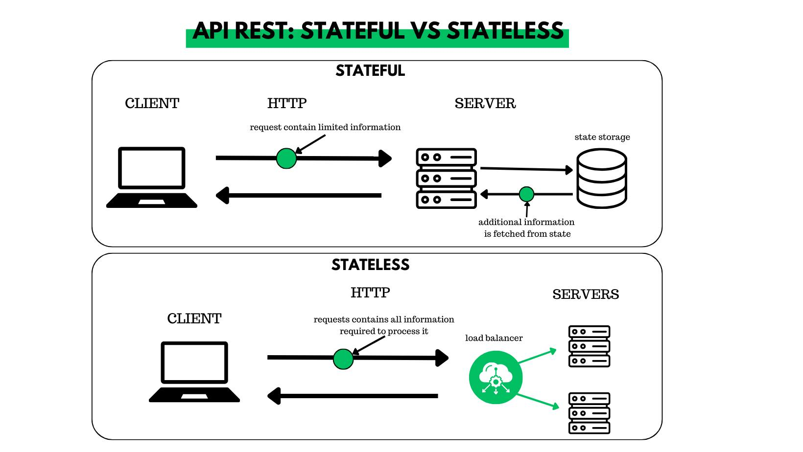

# Kiến trúc Stateful vs. Stateless: So sánh Toàn diện

Trong bối cảnh công nghệ số phát triển nhanh chóng, việc lựa chọn mô hình kiến trúc phù hợp (Stateful - Có trạng thái vs. Stateless - Không trạng thái) là yếu tố then chốt cho sự thành công của ứng dụng. Bài viết này cung cấp cái nhìn sâu sắc về cả hai kiến trúc, giúp bạn đưa ra quyết định sáng suốt.

## Trạng Thái (State) Là Gì?

Trong điện toán và thiết kế hệ thống, **state (trạng thái)** đề cập đến thông tin được lưu trữ về tình trạng của một ứng dụng, quy trình hoặc hệ thống tại một thời điểm cụ thể. Thông tin này ảnh hưởng đến cách hệ thống phản ứng với các tương tác trong tương lai.

### Các Loại Trạng Thái

*   **Trạng Thái Ứng Dụng (Application State):** Thông tin do ứng dụng quản lý (ví dụ: tùy chọn người dùng, màn hình hiện tại, giỏ hàng).
*   **Trạng Thái Phiên (Session State):** Dữ liệu tạm thời lưu trong một phiên người dùng (ví dụ: trạng thái đăng nhập, cài đặt tạm thời).
*   **Trạng Thái Lâu Dài (Persistent State):** Dữ liệu lưu trữ bền vững (Cơ sở dữ liệu, file system) qua nhiều phiên hoặc khởi động lại (ví dụ: hồ sơ người dùng, lịch sử đơn hàng).
*   **Trạng Thái Máy Chủ (Server State):** Dữ liệu lưu trên máy chủ để theo dõi tương tác/tiến trình của client.
*   **Trạng Thái Client (Client State):** Dữ liệu lưu phía client (ví dụ: cookies, localStorage) để quản lý hành vi phiên/ứng dụng.

## Kiến Trúc Stateful (Có Trạng Thái)

Kiến trúc stateful **duy trì trạng thái** của các tương tác người dùng qua nhiều yêu cầu. Máy chủ "ghi nhớ" dữ liệu của client, và các yêu cầu tiếp theo thường được định tuyến đến *cùng một máy chủ* (thường thông qua bộ cân bằng tải với **phiên dính - sticky sessions**).

<!-- Placeholder for Stateful Architecture Diagram -->
<!-- Ví dụ:  -->

### Đặc Điểm Chính

*   Máy chủ duy trì ngữ cảnh (context) của client giữa các yêu cầu.
*   Phiên (session) thường được duy trì liên tục.
*   Bộ cân bằng tải cần sử dụng "phiên dính" (sticky sessions).
*   Thông tin trạng thái thường được lưu trữ *trên máy chủ ứng dụng*.

### Ưu Điểm

1.  **Trải Nghiệm Người Dùng Được Cá Nhân Hóa:**
    *   Hệ thống ghi nhớ tương tác trước đó, cho phép cung cấp nội dung/đề xuất phù hợp (ví dụ: gợi ý sản phẩm dựa trên lịch sử xem/mua hàng).
    *   Tạo ra trải nghiệm hấp dẫn và riêng biệt hơn.

2.  **Giao Dịch Liền Mạch:**
    *   Rất phù hợp cho các quy trình nhiều bước (ví dụ: thanh toán online, đặt vé).
    *   Duy trì ngữ cảnh phiên giúp người dùng không cần nhập lại thông tin, tăng hiệu quả và sự mượt mà.

### Ví Dụ Thực Tế: Giỏ Hàng Trực Tuyến

Giỏ hàng trong hệ thống stateful "nhớ" các mặt hàng người dùng đã thêm, ngay cả khi họ chuyển trang. Thông tin này có thể lưu trong session trên server hoặc cookie/localStorage ở client.

## Kiến Trúc Stateless (Không Trạng Thái)

Kiến trúc stateless **không lưu trữ thông tin trạng thái** của client trên máy chủ giữa các yêu cầu. Mỗi yêu cầu từ client phải chứa *tất cả thông tin cần thiết* để máy chủ xử lý nó một cách độc lập.

<!-- Placeholder for Stateless Architecture Diagram -->
<!-- Ví dụ:  -->

### Đặc Điểm Chính

*   Máy chủ không lưu giữ thông tin client giữa các yêu cầu.
*   Mỗi yêu cầu là độc lập và tự chứa (self-contained).
*   Bất kỳ máy chủ nào cũng có thể xử lý bất kỳ yêu cầu nào (không cần sticky sessions).
*   Trạng thái (nếu cần) thường được quản lý ở phía **client** hoặc trong một **kho lưu trữ trạng thái bên ngoài** (external state store như DB, cache).

### Ưu Điểm

1.  **Khả Năng Mở Rộng Vượt Trội (Scalability):**
    *   Dễ dàng thêm/bớt các bản sao (instance) của dịch vụ mà không cần đồng bộ hóa trạng thái phức tạp.
    *   Lý tưởng cho việc mở rộng theo chiều ngang (horizontal scaling) để xử lý tải thay đổi.

2.  **Khả Năng Chịu Lỗi Nâng Cao (Fault Tolerance/Resilience):**
    *   Nếu một instance bị lỗi, yêu cầu có thể được định tuyến đến một instance khác mà không ảnh hưởng (vì không có trạng thái cục bộ).
    *   Giảm thiểu điểm lỗi đơn (single point of failure).

3.  **Gỡ Lỗi Và Khắc Phục Sự Cố Đơn Giản Hơn:**
    *   Vì mỗi yêu cầu là độc lập, việc tái tạo lỗi dễ dàng hơn (chỉ cần lặp lại yêu cầu với cùng dữ liệu).
    *   Không cần lo lắng về việc trạng thái máy chủ cụ thể gây ra lỗi khó tái tạo.

### Ví Dụ Thực Tế: API RESTful

API RESTful thường được thiết kế theo kiểu stateless. Mỗi yêu cầu HTTP (GET, POST, PUT, DELETE) chứa đủ thông tin (URL, headers, body) để server xử lý mà không cần biết về các yêu cầu trước đó từ cùng client. Trạng thái xác thực thường được xử lý qua token (ví dụ: JWT) gửi kèm mỗi yêu cầu.

## Lựa Chọn Giữa Kiến Trúc Stateful Và Stateless

Quyết định phụ thuộc vào yêu cầu cụ thể của ứng dụng:

### Khi Nào Nên Chọn Kiến Trúc **Stateful**

*   Ứng dụng yêu cầu tương tác người dùng phức tạp, cần duy trì ngữ cảnh qua nhiều bước.
*   Cần cá nhân hóa trải nghiệm người dùng sâu sắc dựa trên lịch sử tương tác.
*   Quy trình giao dịch gồm nhiều bước liên kết chặt chẽ.
*   Ưu tiên trải nghiệm người dùng liền mạch hơn là khả năng mở rộng tối đa.
*   Ví dụ: Game online nhiều người chơi (trạng thái game), ứng dụng chỉnh sửa tài liệu cộng tác thời gian thực, giỏ hàng phức tạp.

### Khi Nào Nên Chọn Kiến Trúc **Stateless**

*   Xây dựng **Microservices**.
*   Ứng dụng yêu cầu **khả năng mở rộng cao** và linh hoạt.
*   Lưu lượng truy cập không thể dự đoán hoặc biến động mạnh.
*   Ưu tiên **khả năng chịu lỗi** và tính sẵn sàng cao.
*   Dễ dàng triển khai và quản lý các instance độc lập.
*   Ví dụ: API công cộng, các dịch vụ web đơn giản, xử lý dữ liệu hàng loạt không cần trạng thái giữa các tác vụ.

## Phương Pháp Tiếp Cận Kết Hợp (Hybrid)

Nhiều ứng dụng hiện đại sử dụng kết hợp cả hai:

*   **Microservices stateless** nhưng sử dụng **kho lưu trữ trạng thái bên ngoài** được chia sẻ (như Redis, Memcached, Database) để lưu trữ dữ liệu phiên hoặc dữ liệu cần thiết khác.
*   Các thành phần **giao diện người dùng (frontend)** có thể là **stateful** (quản lý trạng thái UI cục bộ) trong khi giao tiếp với **backend stateless**.
*   Sử dụng các lớp **bộ nhớ đệm (caching)** để cải thiện hiệu suất, mang lại cảm giác "stateful" trong khi vẫn giữ lợi ích của backend stateless.

## Kết Luận

Cả hai kiến trúc stateful và stateless đều có giá trị riêng.

*   **Stateful** mạnh về **trải nghiệm cá nhân hóa** và xử lý các **tương tác phức tạp, liên tục**.
*   **Stateless** vượt trội về **khả năng mở rộng, khả năng chịu lỗi** và **sự đơn giản** trong vận hành.

Hiểu rõ ưu/nhược điểm của từng loại là chìa khóa để thiết kế hệ thống hiệu quả, linh hoạt và đáp ứng tốt yêu cầu người dùng. Việc lựa chọn đúng đắn, hoặc kết hợp chúng một cách chiến lược, là kỹ năng quan trọng trong kiến trúc phần mềm hiện đại, đặc biệt với sự phát triển của cloud, microservices và hệ thống phân tán.

