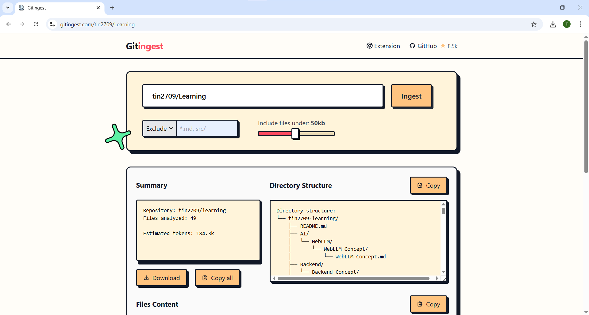

1 https://readme.so/fr/editor : Dùng để thiết kế file readme có thể thực hiện thiết kế cho api và custom cho mẫu thiết kế

2 https://carbon.now.sh/ : Dùng để chụp snap code như extension chụp snap code và cần người dùng copy text hoặc bỏ file vào và export ra ảnh

3 https://devdocs.io/ : Doc cho tất cả khái niệm về developer

4 https://aiktp.com/vi/youtube-summarizer : Tổng hợp nội dung của video youtube và tạo token để dựa vào đó làm nội dung video 

5 https://100tools.io.vn/ : 100 tool gồm chat,...

6 https://quickref.me/ : script cho các ngôn ngữ

7 https://downgit.github.io/#/home : dowload một phần nào đó trong git repo

8 https://app.napkin.ai/ : AI tạo infographic cho nội dung

9 https://tools.ui-layouts.com/background-snippets : tạo shadow, mesh-gradient, clip-path

10 https://svgl.app/ : tạo svg logo bằng react,...

11 https://www.reactbits.dev/ : tạo animation cho react

12 https://dbdiagram.io/d : vẽ ERD 

13 Đổi từ github.com sang gitingest.com: gồm cấu trúc thư mục và nội dung của nó

14 https://www.madewithvibe.com/?ref=dailydev : các tool ai hay sử dụng và các project khác

15 https://blogs.oracle.com/java/ : Blog chính thức của Oracle cung cấp các tài nguyên và cập nhật về Java, với các bài viết và thông tin mới nhất từ nhà phát triển Java.

16 https://www.javacodegeeks.com/category/java : Java Code Geeks: Cộng đồng chia sẻ kinh nghiệm lập trình, thủ thuật và bài tập về Java cho các dev ở nhiều cấp độ.

17 https://javarevisited.blogspot.com/#axzz8rKczfB3Z : Java Revisited: Blog chuyên về Java, cung cấp các bài viết về lý thuyết, kỹ thuật lập
trình và mẹo khi sử dụng Java.

18 https://www.jguru.com/ : jGuru: Diễn đàn nơi bạn có thể trao đổi và tìm hướng giải quyết các vấn đề liên quan đến Java.

19 https://javax0.wordpress.com/ : Java Deep: Blog chuyên nghiên cứu sâu về các tính năng và vấn đề nâng cao trong java

20 https://uihut.com : design resource(có tốn tiền chỉ xem thôi)

21 https://trends.google.com/trends/?geo=VN : coi xem cái gì đang là trend các chủ đề khác nhau

22 https://www.gitportal.org/ : chứa các mã nguồn mở

23 https://templates.dokploy.com/?ref=dailydev : chứa các mã nguồn mở chi tiết

24 https://eliteapp.tech/?ref=producthunt: code chung được với nhau