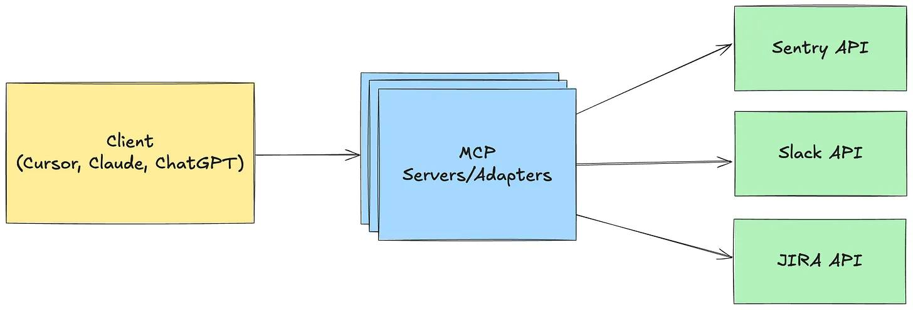

# Hiểu về Model Context Protocol (MCP): Một Giải Thích Đơn Giản

## Giới thiệu

Model Context Protocol (MCP) là một **chuẩn mở (open standard)** được phát triển bởi Anthropic nhằm mục đích chuẩn hóa và tối ưu hóa cách các ứng dụng cung cấp ngữ cảnh (context) cho các Mô hình Ngôn ngữ Lớn (LLMs - Large Language Models) như Claude. Tài liệu này giải thích một cách đơn giản về MCP, cơ chế hoạt động, lợi ích và ứng dụng thực tế của nó.

## MCP là gì?

Hãy tưởng tượng MCP giống như **"cổng USB-C cho các ứng dụng AI"**. Cũng giống như USB-C cung cấp một phương thức kết nối chuẩn hóa giữa các thiết bị và phụ kiện đa dạng, MCP tạo ra một **phương thức chuẩn hóa** để kết nối các mô hình AI với nhiều nguồn dữ liệu và công cụ khác nhau một cách hiệu quả và an toàn.

Về bản chất, MCP là một giao thức mở cho phép các ứng dụng cung cấp thông tin ngữ cảnh cần thiết cho LLMs để chúng hoạt động chính xác và hiệu quả hơn khi tương tác với thế giới bên ngoài mô hình.

## Cơ chế hoạt động của MCP

MCP hoạt động dựa trên kiến trúc **Client-Server**:

1.  **Client (Là Mô hình AI - ví dụ: Claude):** Khi cần thông tin hoặc cần thực hiện một hành động bên ngoài, mô hình AI (Client) sẽ gửi yêu cầu thông qua giao thức MCP.
2.  **Server (Là Nguồn dữ liệu / Công cụ):** Một ứng dụng hoặc dịch vụ bên ngoài đóng vai trò là Server, lắng nghe các yêu cầu MCP. Khi nhận được yêu cầu hợp lệ từ Client, Server sẽ xử lý và phản hồi lại với dữ liệu hoặc kết quả thực thi được yêu cầu.

Thông qua cơ chế chuẩn hóa này, các mô hình AI có thể tương tác liền mạch với nhiều loại Server (cơ sở dữ liệu, API, công cụ nội bộ...) mà không cần phải xây dựng các giải pháp tích hợp riêng lẻ, phức tạp cho từng loại.

## Lợi ích chính của MCP

Việc áp dụng MCP mang lại nhiều lợi ích quan trọng:

*   **Khả năng tương tác cao (High Interoperability):**
    *   Thiết lập một chuẩn chung giúp các mô hình AI dễ dàng kết nối và "nói chuyện" với nhiều nguồn dữ liệu và công cụ đa dạng.
    *   Thúc đẩy một hệ sinh thái AI linh hoạt và đồng nhất hơn, nơi các thành phần có thể dễ dàng tương tác với nhau.
*   **Bảo mật nâng cao (Enhanced Security):**
    *   Giao thức được thiết kế chú trọng đến bảo mật, đảm bảo việc truyền tải dữ liệu giữa mô hình AI và các nguồn bên ngoài diễn ra an toàn.
    *   Kiến trúc client-server cho phép kiểm soát quyền truy cập và bảo vệ dữ liệu nhạy cảm.
*   **Tối ưu hóa hiệu suất (Optimized Performance):**
    *   Chuẩn hóa cách thức truyền và xử lý dữ liệu giúp giảm độ trễ và tăng tốc độ phản hồi của các ứng dụng AI.
    *   Tối ưu hóa luồng thông tin giữa mô hình và các nguồn ngữ cảnh.
*   **Giảm phức tạp trong phát triển (Reduced Development Complexity):**
    *   Nhà phát triển không cần phải viết mã tích hợp riêng cho từng nguồn dữ liệu/công cụ mà mô hình AI cần tương tác.
    *   MCP cung cấp một framework thống nhất, giúp đơn giản hóa và tăng tốc quá trình phát triển, tích hợp ứng dụng AI.

## Ứng dụng của MCP

MCP mở ra nhiều khả năng ứng dụng thực tế cho LLMs:

*   **Kết nối với Cơ sở dữ liệu:** Cho phép mô hình AI (như Claude) truy vấn trực tiếp và an toàn vào các cơ sở dữ liệu (SQL, NoSQL...). Ví dụ: AI có thể trả lời câu hỏi dựa trên dữ liệu bán hàng mới nhất từ database của công ty.
*   **Tích hợp với API:** Đơn giản hóa việc gọi và tương tác với các API bên ngoài (dịch vụ thời tiết, API tài chính, API của các ứng dụng khác...). Ví dụ: AI có thể lấy thông tin chuyến bay mới nhất hoặc đặt hàng qua API.
*   **Truy cập Công cụ Doanh nghiệp:** Kết nối AI với các hệ thống nội bộ quan trọng như CRM (Salesforce), ERP (SAP), hệ thống quản lý nội dung (CMS), công cụ phân tích... Ví dụ: AI có thể tóm tắt thông tin khách hàng từ CRM hoặc tạo báo cáo từ dữ liệu ERP.

## Claude 3.5 Sonnet và Hỗ trợ MCP từ Anthropic

Mô hình **Claude 3.5 Sonnet** của Anthropic được tối ưu hóa để dễ dàng xây dựng các **MCP server**. Điều này cho phép các tổ chức nhanh chóng kết nối các nguồn dữ liệu quan trọng của họ với các ứng dụng AI.

Anthropic cũng cung cấp các tài nguyên hỗ trợ cho MCP:

*   **Thông số kỹ thuật (Specifications)** chi tiết của giao thức MCP.
*   **Bộ công cụ phát triển phần mềm (SDKs)** để xây dựng client và server.
*   Hỗ trợ **MCP server cục bộ** trong ứng dụng Claude Desktop (giúp dễ dàng thử nghiệm và phát triển).
*   **Kho lưu trữ mã nguồn mở** chứa các ví dụ về MCP server.

## Triển khai MCP trong Dự án

Để bắt đầu tích hợp MCP, nhà phát triển có thể sử dụng các tài nguyên do Anthropic cung cấp:

*   **Tệp `.mcp.json`:** Định nghĩa các MCP server có phạm vi trong dự án (project-scoped).
*   **API Key:** Cần thiết để xác thực với các dịch vụ của Anthropic.
*   **Quy tắc ưu tiên Server:** MCP sẽ ưu tiên kết nối theo thứ tự: Server cục bộ (local-scoped) > Server dự án (project-scoped) > Server người dùng (user-scoped).

## Kết luận

Model Context Protocol (MCP) đánh dấu một bước tiến quan trọng hướng tới việc chuẩn hóa và đơn giản hóa cách các mô hình AI tiên tiến tương tác với thế giới dữ liệu và công cụ bên ngoài. Bằng cách cung cấp một "ngôn ngữ chung" an toàn và hiệu quả, MCP giúp:

*   **Giảm rào cản kỹ thuật** cho nhà phát triển khi tích hợp AI.
*   **Tăng cường bảo mật** cho các luồng dữ liệu nhạy cảm.
*   **Mở rộng đáng kể khả năng** của các ứng dụng AI, cho phép chúng truy cập thông tin thời gian thực và thực hiện các hành động phức tạp.

Đối với các doanh nghiệp và nhà phát triển, việc áp dụng MCP mang lại cơ hội xây dựng các giải pháp AI mạnh mẽ, tích hợp sâu hơn vào quy trình hiện có và cuối cùng là cung cấp giá trị lớn hơn cho người dùng cuối. Khi AI tiếp tục phát triển, các giao thức chuẩn hóa như MCP sẽ đóng vai trò ngày càng quan trọng.

---

*Nguồn tham khảo: [MCPs, Simply Explained](https://read.highgrowthengineer.com/p/mcps-simply-explained)*

