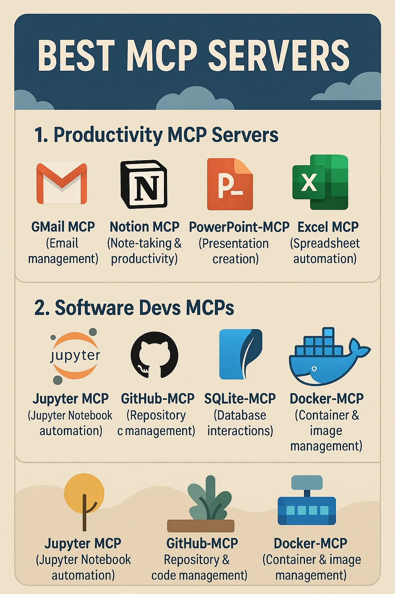
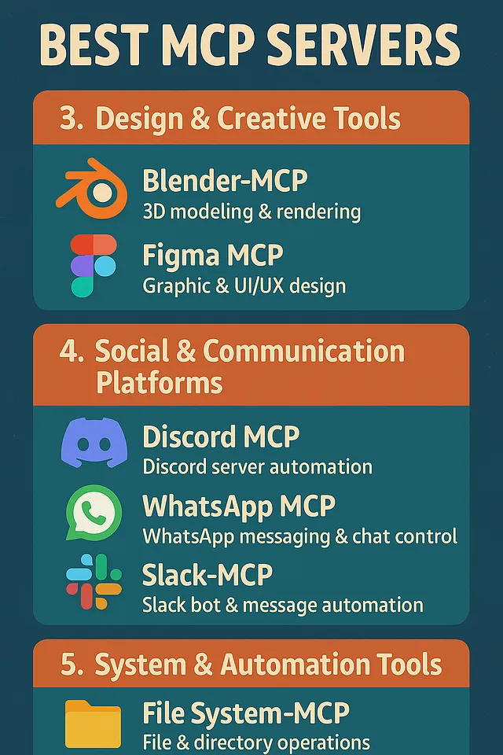

# 1 Best MCP Servers You Should Know: A Curated List

This README provides a list of notable Model Context Protocol (MCP) servers, based on a blog post by Mehul Gupta published on March 31, 2025.

## Introduction

Model Context Protocol (MCP) servers enable AI models (like Large Language Models) to interact with and control external software and services based on user prompts. They bridge the gap between the AI's capabilities and the vast functionalities available in various applications.

An MCP server acts as an intermediary, receiving tool calls from the AI (facilitated by a system aware of the MCP structure) and translating those calls into actions performed on the connected software or service.

This document lists some interesting and useful MCP servers that allow AI to take control of different platforms and tools.

*Note: If you are new to MCP, you might want to refer to resources explaining the Model Context Protocol fundamentals first.*

## Notable MCP Servers

Here is a list of interesting MCP servers mentioned:

*   **Twitter-MCP:** Automate posting and interaction on Twitter using AI. Link Youtube: https://youtu.be/Ng0mj3q_ddQ

*   **LinkedIn-MCP (using Zapier):** Automate posting and actions on LinkedIn, often facilitated through integration platforms like Zapier.Link Youtube: https://youtu.be/Ng0mj3q_ddQ
*   **PyCharm MCP:** Allows AI to control the PyCharm Integrated Development Environment (IDE). Link Youtube: https://youtu.be/YczZTjeB7Jo
*   **Zapier-MCP:** Connects AI to the vast range of web applications supported by Zapier, enabling automation of workflows across multiple services. Link Youtube: https://youtu.be/Ib5Rjg3slls
*   **YouTube MCP server:** Retrieve statistics, trending videos, and other data from YouTube.Link Youtube: https://youtu.be/TmbV1mHXXH4
*   **GMail MCP:** Control email actions such as sending emails, summarizing mail threads, and drafting email bodies.Link Youtube: https://youtu.be/rxKBixN_iD0
*   **Discord MCP:** Integrate AI with Discord servers, enabling actions like creating channels, sending messages, adding reactions, and more.Link Youtube: https://youtu.be/pLOWqz7BxwU
*   **Jupyter MCP:** Control Jupyter Notebooks, allowing AI to write and execute code cells and add markdown. Useful for data scientists. Link Youtube: https://youtu.be/qkoEsqiWDOU
*   **Blender-MCP:** Integrates AI with Blender 3D graphics software, enabling control and automation of 3D rendering tasks via prompts. Typically involves a Blender addon and an MCP server component. Link Youtube: https://youtu.be/7lA-tV2qjOM
*   **GitHub-MCP:** Provides capabilities for repository management, file operations within repositories, and integration with the GitHub API. Requires authentication (e.g., a Personal Access Token). Link Youtube: https://youtu.be/ZoW7ba_VfMQ
*   **File System-MCP:** A server (e.g., implemented in Go) for performing standard file system operations like reading/writing files, creating/listing/deleting directories, moving items, searching, and getting metadata.Link Youtube: https://youtu.be/00i5RMfnQAM
*   **Docker-MCP:** Manage Docker containers, images, volumes, and networks. A community-developed server exists for this purpose.Link Youtube: https://youtu.be/tZBOyPHcAOE
*   **WhatsApp MCP:** Enables sending messages, loading chats, loading contacts, and other interactions with WhatsApp. Note that integration may require several steps.Link Youtube: https://youtu.be/GjrN5ne-t4I
*   **Web Automation MCPs (Puppeteer-MCP, Playwright-MCP):** These servers provide browser automation and web scraping capabilities, allowing AI to control a web browser to perform actions like navigating pages, clicking elements, filling forms, and extracting data. Can act as alternatives for more complex "browser" or "operator" tools.Link Youtube:https://youtu.be/1ZfvOVCKj8g
*   **Database MCPs (SQLite-MCP, Postgres Lite, etc.):** Servers designed for connecting AI to databases, enabling database interactions and queries via natural language.Link Youtube: https://youtu.be/E9PCwRvIA8c
*   **Figma MCP:** Connect AI with Figma, providing graphic designers with AI-assisted features.Link Youtube: https://youtu.be/3nYDUqlA13s
*   **PowerPoint-MCP:** Create and customize presentations in PowerPoint using AI via prompts.Link Youtube: Link Youtube: https://youtu.be/ZoW7ba_VfMQ
*   **Notion MCP:** Connect AI to Notion, the productivity and note-taking application.Link Youtube: https://youtu.be/Kc_A_Ypah2g
*   **Excel MCP:** Allow AI to control and interact with Excel spreadsheets.Link Youtube: https://youtu.be/fZMvDEkX7Oc
*   **Google Calendar (GSuite) MCP:** Integrate with Google Calendar and other GSuite services, allowing AI to schedule tasks and manage events.Link Youtube: https://youtu.be/j6vif13ByrM
*   **Slack-MCP:** Connect a Slack bot to AI via MCP for interacting within Slack workspaces.Link Youtube: https://youtu.be/76HJ6f5ucKs
*   **ElevenLabs MCP:** Integrate AI with ElevenLabs to generate audio outputs from language models.Link Youtube: https://youtu.be/ag0t6SSp7yg

## Using MCP Servers

MCP servers can be used with various Language Models. While demonstrated with models like Claude AI, they can also be integrated with local LLMs using tools like Ollama.

## Creating Custom MCP Servers

It is also possible to create your own custom MCP servers for any specific service or software you wish to integrate AI with.

## Conclusion

The development of MCP servers is expanding the capabilities of AI by allowing models to interface directly with a wide array of external tools and services. This enables more complex and automated workflows driven by AI prompts.

---

*This list is based on a blog post titled "Best MCP Servers You Should Know" by Mehul Gupta, published March 31, 2025.*