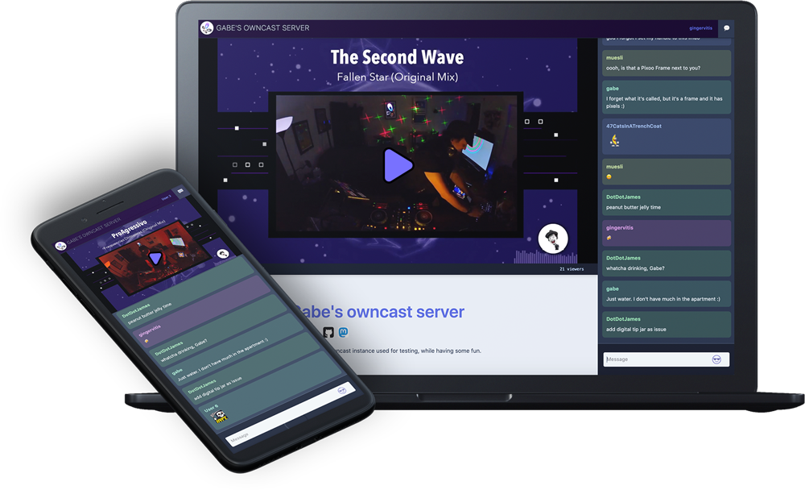

Dựa trên mã nguồn của kho lưu trữ **Owncast**, đây là một dự án mã nguồn mở rất chuyên nghiệp nhằm cung cấp giải pháp livestream tự thân (self-hosted). Dưới đây là phân tích chi tiết về các công nghệ và kỹ thuật chính mà Owncast sử dụng:

### 1. Kiến trúc tổng thể (Architecture)
Owncast được chia làm hai phần chính:
*   **Backend:** Viết bằng ngôn ngữ **Go (Golang)** - Đảm nhiệm xử lý hiệu năng cao, quản lý luồng video và kết nối socket.
*   **Frontend:** Viết bằng **React (Next.js)** và **TypeScript** - Cung cấp giao diện người dùng mượt mà cho người xem và quản trị viên.

### 2. Công nghệ Backend & Kỹ thuật xử lý luồng (Streaming)
Đây là "trái tim" của hệ thống:
*   **RTMP Server:** Sử dụng Go để nhận luồng video từ các phần mềm như OBS qua giao thức RTMP (cổng 1935).
*   **Chuyển mã (Transcoding):** Dựa hoàn toàn vào **FFmpeg**. Owncast gọi các tiến trình FFmpeg để chuyển đổi luồng RTMP đầu vào thành các phân đoạn **HLS (HTTP Live Streaming)** với nhiều độ phân giải khác nhau (Multi-bitrate).
*   **Lưu trữ (Storage):** Hỗ trợ lưu trữ các phân đoạn video (.ts) và playlist (.m3u8) cục bộ hoặc đẩy lên các dịch vụ lưu trữ đám mây tương thích với **S3** (như AWS S3, DigitalOcean Spaces, v.v.).
*   **Cơ sở dữ liệu:** Sử dụng **SQLite** (thông qua thư viện `modernc.org/sqlite` hoặc `go-sqlite3`). Kỹ thuật **sqlc** được dùng để tạo mã Go từ các truy vấn SQL thuần túy, giúp đảm bảo tính an toàn và hiệu năng.

### 3. Hệ thống Chat thời gian thực (Real-time Chat)
*   **WebSockets:** Sử dụng thư viện `gorilla/websocket` để duy trì kết nối hai chiều giữa server và người dùng, cho phép gửi/nhận tin nhắn chat ngay lập tức.
*   **Concurrency (Đồng thời):** Tận dụng tối đa **Goroutines** của Go để xử lý hàng ngàn kết nối chat cùng lúc mà không tốn nhiều tài nguyên.
*   **Rate Limiting:** Áp dụng kỹ thuật giới hạn tần suất (leaky bucket/token bucket) để chống spam chat.

### 4. Khả năng liên kết mạng xã hội phi tập trung (Federation)
Owncast là một phần của **Fediverse**:
*   **ActivityPub:** Đây là kỹ thuật quan trọng nhất giúp Owncast "giao tiếp" được với Mastodon hay Pleroma. Nó sử dụng thư viện `go-fed/activity` để gửi thông báo "Go Live" đến những người theo dõi trên các nền tảng khác.
*   **Webfinger:** Kỹ thuật giúp các máy chủ khác tìm thấy thông tin định danh của người dùng Owncast trong mạng lưới phi tập trung.

### 5. Công nghệ Frontend (UI/UX)
*   **Next.js & React:** Xây dựng giao diện kiểu SPA (Single Page Application) giúp trải nghiệm người xem không bị gián đoạn.
*   **TypeScript:** Tăng độ tin cậy của mã nguồn bằng cách kiểm soát kiểu dữ liệu chặt chẽ.
*   **Video.js:** Thư viện chơi video chính, được tùy chỉnh sâu để hỗ trợ HLS và tối ưu độ trễ (Low Latency).
*   **CSS Modules & SCSS:** Quản lý giao diện một cách khoa học, tránh xung đột CSS.
*   **i18next:** Hỗ trợ đa ngôn ngữ (Internationalization), cho phép cộng đồng đóng góp bản dịch qua Crowdin.

### 6. Quản trị và Bảo mật (Auth & Admin)
*   **IndieAuth:** Một giao thức xác thực dựa trên OAuth2 giúp chủ sở hữu máy chủ đăng nhập an toàn.
*   **OTP (One-Time Password):** Sử dụng mã dùng một lần cho các luồng đăng nhập từ Fediverse.
*   **Webhooks:** Cung cấp hệ thống webhook để tích hợp với các dịch vụ bên thứ ba (như Discord, Slack) khi có sự kiện livestream hoặc chat.

### 7. Quy trình phát triển và Triển khai (DevOps)
*   **Earthly:** Một công cụ build hiện đại (thay thế cho Makefile) giúp đảm bảo quy trình xây dựng ứng dụng đồng nhất trên mọi môi trường.
*   **Docker:** Cung cấp `Dockerfile` để đóng gói toàn bộ ứng dụng (bao gồm cả FFmpeg) vào container, giúp việc cài đặt cực kỳ đơn giản (Quickstart).
*   **Lefthook:** Quản lý Git hooks để tự động kiểm tra lỗi code (linting), định dạng (formatting) trước khi commit.
*   **GitHub Actions:** Hệ thống CI/CD rất đồ sộ với hơn 20 quy trình tự động từ kiểm thử API, kiểm thử trình duyệt (Cypress) đến kiểm tra an ninh (CodeQL).

### Tóm tắt kỹ thuật đặc sắc:
Owncast không chỉ đơn thuần là một trang web video, mà là một **Media Server** thu nhỏ. Kỹ thuật khó nhất mà họ giải quyết được là **tối ưu độ trễ (latency)** trong giao thức HLS và việc **tự động hóa cấu hình FFmpeg** sao cho phù hợp với phần cứng của người dùng (hỗ trợ cả tăng tốc phần cứng như NVIDIA NVENC, Intel QuickSync).

