# 1) Top 12 Kho Mã Nguồn Mở Đáng Chú Ý Năm 2025 cho Lập trình viên Xuất sắc

Nếu bạn là một lập trình viên, việc cập nhật những công cụ mã nguồn mở tốt nhất là cách chắc chắn để tăng năng suất và tạo ra các dự án hiệu quả. Dưới đây là danh sách 12 công cụ mã nguồn mở mang tính đột phá cho nhiều khía cạnh khác nhau của phát triển phần mềm hiện đại—từ tích hợp AI đến xây dựng ứng dụng.

---

### 1. Taipy - Xây dựng ứng dụng web Python về Dữ liệu & AI

Taipy là một thư viện Python mã nguồn mở giúp bạn xây dựng ứng dụng web AI & Dữ liệu, bao gồm GUI hướng dữ liệu và tự động hóa quản lý kịch bản. Nó cung cấp một giải pháp hoàn chỉnh để xây dựng ứng dụng dữ liệu, giúp các nhà phát triển tiết kiệm đáng kể thời gian và giảm độ phức tạp. Taipy kết hợp một công cụ GUI trực quan để thiết kế bảng điều khiển với các khả năng quản lý kịch bản toàn diện, hoàn hảo cho các nhà khoa học dữ liệu và nhà phân tích.

**Các tính năng chính:**

*   Kiểm tra nhiều mô phỏng dữ liệu một cách liền mạch.
*   Xây dựng bảng điều khiển hoàn toàn tùy chỉnh hoàn toàn bằng Python.
*   Trực quan hóa dữ liệu theo thời gian thực.

Mã nguồn mở của Taipy: [https://github.com/Avaiga/taipy](https://github.com/Avaiga/taipy)

---

### 2. Composio - Truy cập +150 công cụ chỉ với một dòng mã

Đối với những người muốn xây dựng ứng dụng AI, bạn biết rằng việc hoàn thành tự động hóa phức tạp là một cơn ác mộng. Bạn phải vượt qua thành công việc kết nối các công cụ bên ngoài như GitHub, Jira, Notion, Discord... với agent AI của mình. Composio giúp việc kết nối hơn 150 công cụ trở nên cực kỳ dễ dàng, từ các công cụ hệ thống đến ứng dụng SaaS và các ứng dụng với mô hình AI để hoàn thành tự động hóa agentic.

**Các tính năng chính:**

*   Quản lý xác thực.
*   Hơn 90 công cụ - Sẵn sàng kết nối.
*   Công cụ RPA mạnh mẽ.

Mã nguồn mở của Composio: [https://github.com/ComposioHQ/composio](https://github.com/ComposioHQ/composio)

---

### 3. Postiz - Lên lịch bài đăng của bạn như một chuyên gia với AI

Postiz là một công cụ mã nguồn mở để tự động hóa và tối ưu hóa việc lên lịch bài đăng trên mạng xã hội. Nó cung cấp một cách đơn giản để quản lý và gỡ lỗi API, cải thiện sự cộng tác và giảm thời gian phát triển. Postiz cung cấp một nền tảng tập trung để quản lý và gỡ lỗi API mà không gặp rắc rối.

**Các tính năng chính:**

*   Phân tích thời gian tối ưu.
*   Tạo Hashtag.
*   Cộng tác nhóm.

Mã nguồn mở của Postiz: [https://github.com/gitroomhq/postiz-app](https://github.com/gitroomhq/postiz-app)

---

### 4. LLMWare - Triển khai & quản lý các mô hình ngôn ngữ lớn một cách dễ dàng

LLMWare cung cấp các công cụ cần thiết để tích hợp, triển khai và giám sát các mô hình ngôn ngữ lớn trong môi trường production. Nó giúp việc tích hợp các mô hình AI trở nên đơn giản, cho phép các nhà phát triển tạo ra các ứng dụng thông minh hơn với nỗ lực tối thiểu. LLMWare tập trung vào việc đơn giản hóa cách các mô hình này tương tác với dữ liệu người dùng.

**Các tính năng chính:**

*   Tối ưu hóa mô hình cho môi trường có tài nguyên hạn chế.
*   Sử dụng bảng điều khiển để giám sát hiệu suất mô hình theo thời gian thực.
*   Triển khai mô hình nhanh chóng với API đơn giản.

Mã nguồn mở của LLMWare: [https://github.com/llmware-ai/llmware](https://github.com/llmware-ai/llmware)

---

### 5. Copilot Kit - Thêm một lớp hỗ trợ AI vào dự án của bạn chỉ với một vài dòng mã

Copilot Kit là một bộ công cụ phát triển mô-đun được thiết kế để tích hợp các trợ lý hỗ trợ AI vào ứng dụng hoặc hệ thống của bạn. Nó nâng cao năng suất bằng cách cung cấp các đề xuất mã hóa theo thời gian thực, giảm lỗi và tăng tốc độ phát triển. Copilot Kit sử dụng các mô hình AI mở để hỗ trợ mã hóa và cung cấp các đề xuất theo thời gian thực.

**Các tính năng chính:**

*   Hỗ trợ đa ngôn ngữ để tùy chỉnh tối ưu.
*   Dễ dàng tích hợp với OpenAI và các mô hình ngôn ngữ lớn khác.
*   Tài liệu toàn diện với các ví dụ tương tác.

Mã nguồn mở của Copilot Kit: [https://github.com/CopilotKit/CopilotKit](https://github.com/CopilotKit/CopilotKit)

---

### 6. Julep AI - Xây dựng quy trình làm việc AI có thể mở rộng trong vài phút

Julep là một framework tối giản nhưng mạnh mẽ để xây dựng các ứng dụng web nhanh và nhẹ. Nó cải thiện độ tin cậy của dữ liệu bằng cách cung cấp giám sát chất lượng, làm cho quy trình làm việc dữ liệu hiệu quả và mạnh mẽ hơn. Julep cung cấp một giao diện thân thiện với người dùng để quản lý, giám sát và cải thiện quy trình làm việc dữ liệu.

**Các tính năng chính:**

*   Hệ thống định tuyến nhẹ và hiệu suất cao.
*   Hỗ trợ tích hợp cho RESTful API.
*   Kiến trúc mở rộng thông qua hệ sinh thái plugin mạnh mẽ.

Mã nguồn mở của Julep AI: [https://github.com/julep-ai/julep](https://github.com/julep-ai/julep)

---

### 7. Traceloop - Gỡ lỗi các ứng dụng phân tán theo thời gian thực

Traceloop là một công cụ gỡ lỗi theo thời gian thực cho các ứng dụng phân tán, cung cấp khả năng hiển thị trực quan dòng dữ liệu rõ ràng. Nó giúp các nhà phát triển giải quyết vấn đề nhanh hơn bằng cách cung cấp khả năng truy xuất theo thời gian thực mà không làm gián đoạn dịch vụ. Traceloop truy xuất các quy trình theo thời gian thực, giúp bạn hiểu điều gì đang xảy ra sai mà không làm gián đoạn dịch vụ.

**Các tính năng chính:**

*   Truy xuất theo thời gian thực của các hệ thống phân tán.
*   Trực quan hóa các tương tác dữ liệu để hiểu rõ hơn.
*   Hỗ trợ nhiều môi trường đám mây để linh hoạt.

Mã nguồn mở của Traceloop: [https://github.com/traceloop/openllmetry](https://github.com/traceloop/openllmetry)

---

### 8. Classiq - Dễ dàng thiết kế và mô phỏng mạch lượng tử

Classiq đơn giản hóa thiết kế mạch lượng tử, cho phép các nhà nghiên cứu và nhà phát triển mô phỏng các hoạt động lượng tử. Các nhà phát triển Python đánh giá cao khả năng tích hợp mạnh mẽ của nó với các thư viện như Scikit-learn và TensorFlow. Nó đơn giản hóa điện toán lượng tử, cho phép các nhà phát triển tạo thuật toán lượng tử mà không cần chuyên môn sâu. Classiq giúp các nhà phát triển thiết kế thuật toán lượng tử mà không cần chuyên môn sâu về lượng tử.

**Các tính năng chính:**

*   Công cụ trực quan để thiết kế mạch lượng tử.
*   Tích hợp với các nền tảng lượng tử lớn để có quy trình làm việc liền mạch.
*   Khả năng mô phỏng và phân tích theo thời gian thực.

Mã nguồn mở của Classiq: [https://github.com/Classiq/classiq-library](https://github.com/Classiq/classiq-library)

---

### 9. ToolJet - Xây dựng ứng dụng kinh doanh tùy chỉnh, nhanh chóng

ToolJet là một nền tảng low-code mã nguồn mở để tạo ứng dụng kinh doanh, tương thích với nhiều cơ sở dữ liệu và API khác nhau. Nó cho phép phát triển nhanh chóng các công cụ nội bộ mà không cần mã hóa rộng rãi, làm cho nó lý tưởng cho những người không phải là nhà phát triển. ToolJet tích hợp với các nguồn dữ liệu khác nhau và cung cấp trình tạo trực quan để tạo giao diện mà không cần viết mã từ đầu.

**Các tính năng chính:**

*   Trình tạo kéo và thả để tạo UI nhanh chóng.
*   Tích hợp API với API bên ngoài để mở rộng chức năng.
*   Kiểm soát truy cập dựa trên vai trò để quản lý người dùng.

Mã nguồn mở của ToolJet: [https://github.com/ToolJet/ToolJet](https://github.com/ToolJet/ToolJet)

---

### 10. Keep - Công cụ đa năng cho việc quản lý cảnh báo/sự kiện ở quy mô lớn

Keep cung cấp một cách an toàn để quản lý bí mật và cấu hình cho các ứng dụng hiện đại. Nó đảm bảo các cảnh báo quan trọng không bao giờ bị bỏ lỡ, cải thiện thời gian phản hồi sự cố và phối hợp nhóm. Keep giúp đảm bảo bạn không bao giờ bỏ lỡ các thông báo quan trọng bằng cách tích hợp với các dịch vụ khác nhau.

**Các tính năng chính:**

*   Mã hóa mạnh mẽ cho dữ liệu nhạy cảm.
*   Tích hợp với các nền tảng đám mây phổ biến.
*   Phiên bản và kiểm tra cấu hình.

Mã nguồn mở của Keep: [https://github.com/keephq/keep](https://github.com/keephq/keep)

---

### 11. Digger - Triển khai cơ sở hạ tầng đám mây nhanh chóng với IaC được đơn giản hóa

Digger đơn giản hóa quy trình làm việc infrastructure-as-code (IaC), cho phép triển khai tài nguyên đám mây nhanh chóng. Nó hợp lý hóa việc triển khai cơ sở hạ tầng, giảm các tác vụ thủ công và tăng tốc quy trình CI/CD. Digger cung cấp khả năng tương thích sẵn có với các nhà cung cấp đám mây lớn.

**Các tính năng chính:**

*   Tích hợp Terraform để tự động hóa cơ sở hạ tầng.
*   Các mẫu được cấu hình sẵn cho các trường hợp sử dụng phổ biến.
*   Công cụ cộng tác cho triển khai dựa trên nhóm.

Mã nguồn mở của Digger: [https://github.com/diggerhq/digger](https://github.com/diggerhq/digger)

---

### 12. Skyvern - Tự động hóa quy trình làm việc dựa trên trình duyệt với LLM và thị giác

Skyvern tự động hóa quy trình làm việc dựa trên trình duyệt bằng cách sử dụng LLM và thị giác máy tính. Nó cung cấp một endpoint API đơn giản để tự động hóa hoàn toàn quy trình làm việc thủ công trên một số lượng lớn các trang web, thay thế các giải pháp tự động hóa dễ hỏng hoặc không đáng tin cậy. Nó dựa vào các prompts ngoài thị giác máy tính và LLM để phân tích cú pháp các mục trong chế độ xem theo thời gian thực, tạo kế hoạch tương tác và tương tác với chúng.

**Các tính năng chính:**

*   Trích xuất dữ liệu tự động từ các trang web.
*   Quy trình làm việc có thể tùy chỉnh bằng AI.
*   Tích hợp với các trình duyệt không đầu để mở rộng quy mô.

Mã nguồn mở của Skyvern: [https://github.com/skyvern-ai/skyvern](https://github.com/skyvern-ai/skyvern)

---

12 công cụ này cung cấp một cái gì đó cho tất cả mọi người, cho dù bạn đang tập trung vào tích hợp AI, phát triển ứng dụng hay tự động hóa quy trình làm việc.

Tuyệt vời! Dưới đây là nội dung được viết lại bằng tiếng Việt, định dạng Markdown cho file `README.md`.

---

# 2  Top 15 Dự Án Low-Code Mã Nguồn Mở có Lượng GitHub Stars Cao Nhất

Sponsor by https://www.nocobase.com/en/blog/top-15-open-source-low-code-projects-with-the-most-github-Stars#number-14amplication

Khám phá các dự án low-code mã nguồn mở phổ biến nhất trên GitHub.

_Bài viết được cập nhật lần cuối vào ngày 17 tháng 2 năm 2025. Chúng tôi thường xuyên cập nhật thông tin để đảm bảo bạn có những hiểu biết mới nhất!_ 😊

Tuần trước, chúng tôi đã xuất bản một bài viết với tiêu đề "Top 12 Công Cụ No-Code Mã Nguồn Mở có Lượng GitHub Stars Cao Nhất", nhận được rất nhiều sự đánh giá cao. Nhiều bạn bè đã bình luận hỏi tại sao các sản phẩm nổi tiếng như n8n và Appsmith không có trong danh sách. Lý do là chúng tôi dựa danh sách này vào thẻ "no-code" trên GitHub, trong khi các sản phẩm này chỉ được gắn thẻ "low-code".

Trong bài viết hôm nay, chúng ta sẽ cùng điểm qua các dự án low-code. Điều quan trọng cần lưu ý là có một số điểm trùng lặp giữa các sản phẩm no-code và low-code (vì các khái niệm này có chia sẻ những điểm tương đồng). Dựa trên bài viết trước, chúng tôi sẽ bổ sung thêm ba chiều đánh giá để đánh giá toàn diện các dự án này:

*   Giấy phép Mã nguồn mở (Open Source License)
*   Số lượng Cộng tác viên Đang hoạt động (Active Contributors)
*   Việc chấp nhận Pull Request từ bên ngoài (Acceptance of External PRs)

Trong quá trình khám phá các dự án low-code mã nguồn mở phổ biến nhất trên GitHub, chúng tôi đã phát hiện ra một số công cụ hấp dẫn.

*   **NocoBase**, với kiến trúc plugin có khả năng mở rộng cao, cho phép các doanh nghiệp nhanh chóng xây dựng và mở rộng các ứng dụng.
*   **Supervision** tập trung vào việc đơn giản hóa quá trình huấn luyện, triển khai và giám sát các mô hình thị giác máy tính, cung cấp các công cụ chú thích dữ liệu và tối ưu hóa mô hình hiệu quả.
*   **Refine** cung cấp quyền kiểm soát hoàn toàn mã React, làm cho nó lý tưởng để xây dựng và duy trì các công cụ nội bộ cấp doanh nghiệp, với sự nhấn mạnh vào bảo mật và tính mô-đun.
*   **n8n** là một công cụ tự động hóa quy trình làm việc mã nguồn mở, đơn giản hóa việc tích hợp hệ thống phức tạp và xử lý dữ liệu thông qua lập trình trực quan.

Những công cụ này cung cấp cho các nhà phát triển nhiều giải pháp khác nhau, giúp họ nhanh chóng tạo ra các ứng dụng mạnh mẽ. Bây giờ, hãy cùng xem xét kỹ hơn các dự án low-code này!

---

### 15. NocoBase

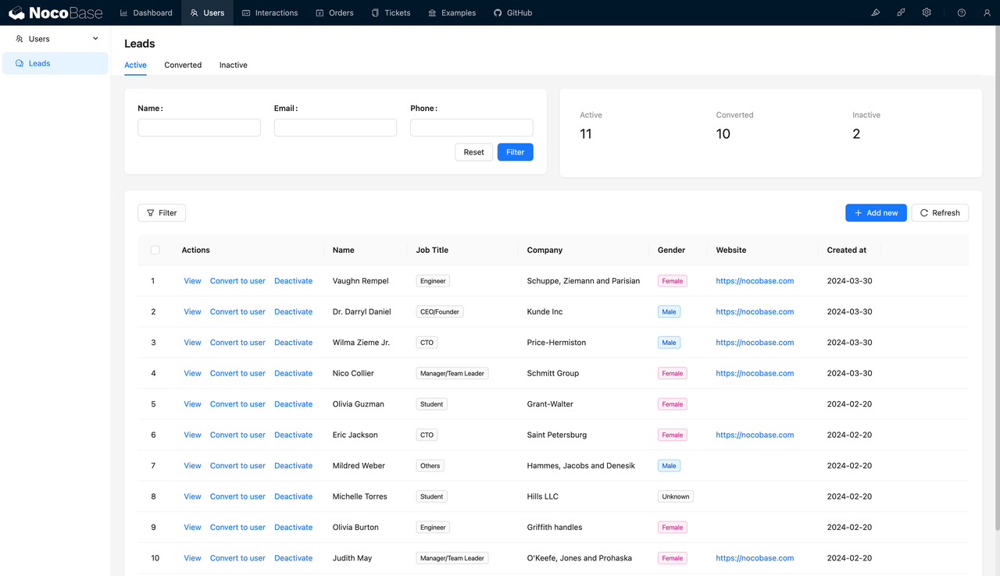
*   **GitHub:** https://github.com/nocobase/nocobase
*   **Số sao GitHub:** 13.5k
*   **Cập nhật GitHub lần cuối:** Hôm nay
*   **Giấy phép Mã nguồn mở:** AGPL-3.0
*   **Cộng tác viên Đang hoạt động:** 85
*   **Chấp nhận PR từ bên ngoài:** Có
*   **Website Chính thức:** https://www.nocobase.com/
*   **Tài liệu:** https://docs.nocobase.com/

**Giới thiệu:**

NocoBase là một nền tảng phát triển no-code và low-code mã nguồn mở, có thể tự lưu trữ (self-hosted). Mặc dù phục vụ như một nền tảng no-code/low-code, NocoBase được thiết kế đặc biệt cho các nhà phát triển. Kiến trúc dựa trên plugin của nó cho phép nhà phát triển dễ dàng thêm và tùy chỉnh các tính năng để đáp ứng nhiều nhu cầu kinh doanh phức tạp.

Với NocoBase, nhà phát triển có thể kết hợp thiết kế dựa trên mô hình dữ liệu với giao diện WYSIWYG trực quan để đạt được quản lý dữ liệu liền mạch và các hoạt động tự động.

**Tính năng:**

*   **Hướng Dữ liệu Mô hình (Data Model Driven):** Khác với các phương pháp truyền thống dựa trên form và bảng, nó sử dụng phương pháp phát triển hướng dữ liệu mô hình, cung cấp khả năng phát triển không giới hạn.
*   **Khả năng Mở rộng Cao (High Scalability):** Tất cả các chức năng được cung cấp thông qua plugin sử dụng kiến trúc microkernel, hỗ trợ triển khai riêng tư.
*   **Giao diện WYSIWYG:** Cung cấp giao diện người dùng trực quan giúp đơn giản hóa việc phát triển các hệ thống phức tạp.
*   **Công nghệ Mã nguồn Mở (Open Source Tech Stack):** Sử dụng các công nghệ phổ biến như Node.js và React, đảm bảo tính minh bạch và kiểm soát.

**Trường hợp Sử dụng:**

NocoBase lý tưởng cho các đội kỹ thuật cần nhanh chóng phát triển và triển khai các hệ thống kinh doanh phức tạp, đặc biệt trong môi trường kinh doanh tập trung vào dữ liệu và có tính năng động cao. Nó đặc biệt phù hợp cho CRM, ERP và quản lý quy trình kinh doanh tùy chỉnh.

👋 **Hãy thử:** [Hướng dẫn NocoBase – Hệ thống Quản lý Tác vụ](https://www.nocobase.com/tutorial/task-management) (Liên kết mẫu, thay thế nếu có link gốc tiếng Việt)

---

### 14. Amplication

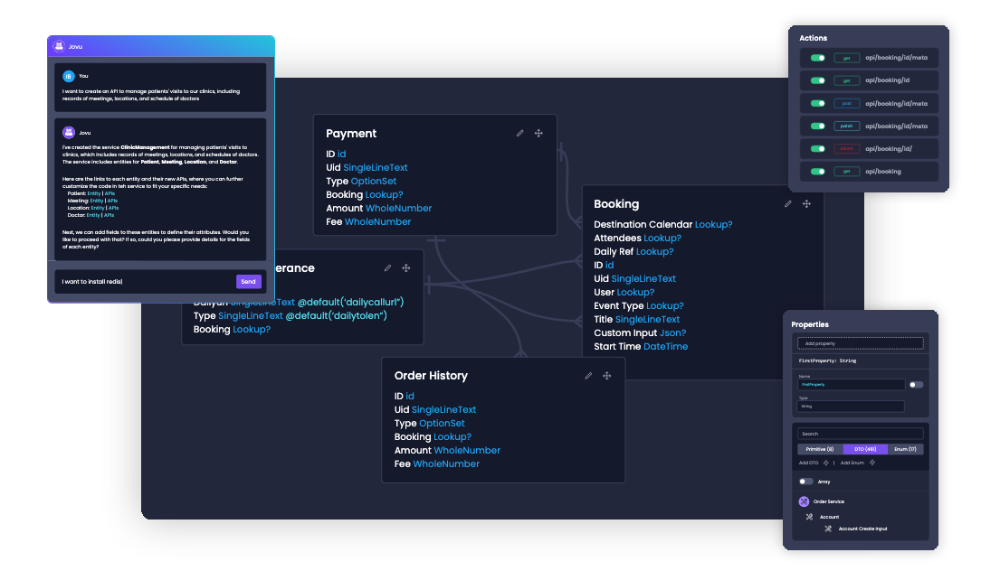

*   **GitHub:** https://github.com/amplication/amplication
*   **Số sao GitHub:** 15.5k
*   **Cập nhật GitHub lần cuối:** Hôm nay
*   **Giấy phép Mã nguồn mở:** Apache 2.0
*   **Cộng tác viên Đang hoạt động:** 259
*   **Chấp nhận PR từ bên ngoài:** Có
*   **Website Chính thức:** https://amplication.com/
*   **Tài liệu:** https://docs.amplication.com/

**Giới thiệu:**

Amplication được thiết kế để hỗ trợ nhà phát triển nhanh chóng xây dựng và triển khai các ứng dụng Node.js sẵn sàng cho môi trường production. Nó tận dụng AI để tự động tạo mã backend và frontend.

Nhà phát triển có thể định nghĩa mô hình dữ liệu và mối quan hệ thông qua giao diện trực quan của nó. Amplication sau đó tự động tạo ra một ứng dụng hoàn chỉnh, sẵn sàng cho production, bao gồm REST API, GraphQL API, xác thực, ủy quyền và giao diện quản trị. Sau khi các mô hình được thiết lập, bạn có thể tùy chỉnh mã được tạo hoặc mở rộng nó bằng mã tùy chỉnh. Nền tảng hỗ trợ triển khai tới các dịch vụ đám mây khác nhau, tạo điều kiện cho việc tích hợp liên tục và đơn giản.

**Tính năng:**

*   **Tạo Mã bằng AI:** Tự động tạo mô hình, API, cấu hình, v.v.
*   **Kiểm soát Mã Hoàn toàn:** Mã được tạo hoàn toàn có thể chỉnh sửa, hỗ trợ cả .NET và Node.js.
*   **Hệ thống Plugin:** Có khả năng mở rộng cao, cho phép sử dụng các plugin do cộng đồng xây dựng hoặc tạo các plugin tùy chỉnh.

**Trường hợp Sử dụng:**

Amplication lý tưởng cho các đội phát triển cần nhanh chóng phát triển các ứng dụng cấp doanh nghiệp, đặc biệt là những ứng dụng yêu cầu chuyển đổi nhanh từ khái niệm sang production trong khi vẫn duy trì bảo mật dữ liệu và tuân thủ nghiêm ngặt.

💡 **Đọc thêm:** [Khám phá RAD: 5 Trường hợp Ứng dụng Tốt nhất](https://www.amplication.com/blog/exploring-rad-5-best-application-cases) (Liên kết mẫu)

---

### 13. Kestra

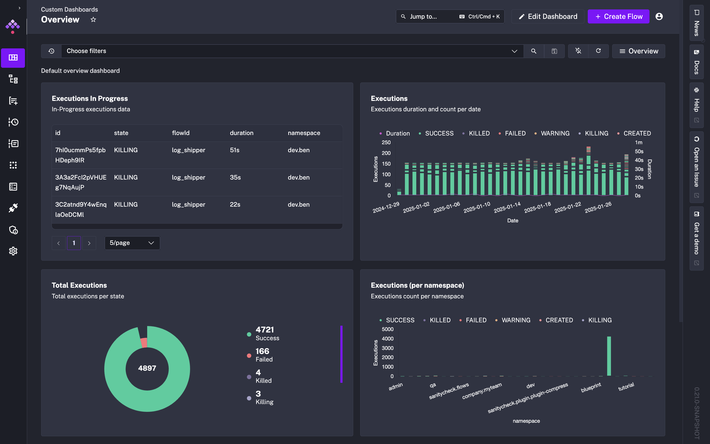

*   **GitHub:** https://github.com/kestra-io/kestra
*   **Số sao GitHub:** 15.9k
*   **Cập nhật GitHub lần cuối:** Hôm nay
*   **Giấy phép Mã nguồn mở:** Apache-2.0
*   **Cộng tác viên Đang hoạt động:** 151
*   **Chấp nhận PR từ bên ngoài:** Có
*   **Website Chính thức:** https://kestra.io/
*   **Tài liệu:** https://kestra.io/docs

**Giới thiệu:**

Kestra là một nền tảng điều phối quy trình làm việc low-code mã nguồn mở được thiết kế để giúp các nhà phát triển và đội dữ liệu dễ dàng xây dựng, lên lịch và quản lý các tác vụ. Nó sử dụng định nghĩa quy trình làm việc dựa trên YAML và cung cấp giao diện web trực quan với tích hợp plugin phong phú và xử lý tác vụ tự động.

Người dùng có thể cấu hình luồng dữ liệu, trình kích hoạt và tác vụ trong giao diện người dùng của Kestra, tận dụng kiến trúc phân tán của nó để xử lý các đường ống dữ liệu và quy trình kinh doanh quy mô lớn. Các quy trình làm việc có thể được tự lưu trữ và hỗ trợ các cuộc gọi API, cho phép các doanh nghiệp linh hoạt mở rộng và quản lý các tác vụ tự động hóa.

**Tính năng:**

*   **Điều phối Quy trình làm việc Low-Code:** Định nghĩa quy trình làm việc bằng YAML với giao diện quản lý trực quan.
*   **Hỗ trợ Plugin Rộng rãi:** Tích hợp với cơ sở dữ liệu, lưu trữ đám mây, API, hàng đợi tin nhắn, v.v.
*   **Cơ chế Kích hoạt Linh hoạt:** Hỗ trợ thực thi theo lịch trình, trình kích hoạt dựa trên sự kiện và các cuộc gọi API.

**Trường hợp Sử dụng:**

Kestra lý tưởng cho các đội kỹ thuật dữ liệu và DevOps, đặc biệt cho các quy trình ETL, xử lý log và điều phối microservices tự động.

---

### 12. Teable

*   **GitHub:** https://github.com/teableio/teable
*   **Số sao GitHub:** 16.5k
*   **Cập nhật GitHub lần cuối:** Hôm nay
*   **Giấy phép Mã nguồn mở:** AGPL-3.0
*   **Cộng tác viên Đang hoạt động:** 29
*   **Chấp nhận PR từ bên ngoài:** Có
*   **Website Chính thức:** https://teable.io/
*   **Tài liệu:** https://help.teable.io/

**Giới thiệu:**

Teable là một nền tảng no-code được thiết kế để giúp các đội nhanh chóng xây dựng và triển khai các ứng dụng cơ sở dữ liệu cấp doanh nghiệp. Với giao diện trực quan giống như bảng tính, nó đơn giản hóa việc quản lý dữ liệu và các quy trình làm việc cộng tác.

**Tính năng:**

*   **Giao diện Giống Bảng tính:** Cho phép người dùng tạo và quản lý cấu trúc dữ liệu phức tạp mà không cần viết mã, cải thiện khả năng cộng tác của đội.
*   **Hiệu suất Cao & Khả năng Mở rộng:** Được xây dựng trên PostgreSQL, có khả năng xử lý hàng triệu dòng dữ liệu trong khi vẫn đảm bảo hiệu suất ổn định.
*   **Bảo mật Dữ liệu & Tính linh hoạt Triển khai:** Hỗ trợ tự lưu trữ, cung cấp cho người dùng toàn quyền kiểm soát dữ liệu của họ trong khi vẫn mang lại sự tiện lợi của triển khai đám mây.

**Trường hợp Sử dụng:**

Teable hoàn hảo cho các đội yêu cầu quản lý dữ liệu hiệu quả và cộng tác thời gian thực, chẳng hạn như hệ thống CRM, quản lý hoạt động sự kiện và hệ thống quản lý nội dung (CMS). Bản chất no-code của nó cho phép người dùng không chuyên về kỹ thuật dễ dàng xây dựng các ứng dụng phù hợp với nhu cầu kinh doanh.

---

### 11. APIJSON

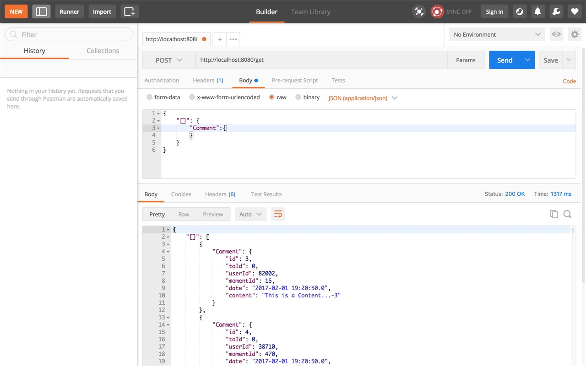

*   **GitHub:** https://github.com/Tencent/APIJSON
*   **Số sao GitHub:** 17.4k
*   **Cập nhật GitHub lần cuối:** 2 ngày trước
*   **Giấy phép Mã nguồn mở:** Apache 2.0
*   **Cộng tác viên Đang hoạt động:** 72
*   **Chấp nhận PR từ bên ngoài:** Có
*   **Website Chính thức:** http://apijson.cn/
*   **Tài liệu:** https://apijsondocs.readthedocs.io/en/latest/

**Giới thiệu:**

APIJSON là một thư viện ORM tự động mã nguồn mở bởi Tencent, cung cấp giao diện backend và tài liệu không cần viết mã, cho phép các nhà phát triển frontend tùy chỉnh dữ liệu và cấu trúc JSON được trả về.

APIJSON không phải là nền tảng low-code truyền thống; nó đơn giản hóa phát triển backend bằng cách tự động tạo API và tài liệu mà không cần viết mã backend. Điều này tuân thủ các nguyên tắc low-code bằng cách giảm lượng mã cần thiết. Tuy nhiên, nó chuyên sâu hơn vào việc đơn giản hóa tương tác cơ sở dữ liệu thông qua JSON, nhắm mục tiêu đến các nhà phát triển frontend.

**Tính năng:**

*   **Triển khai Không Cần Mã:** Tự động hóa các hoạt động CRUD, loại bỏ nhu cầu viết mã backend hoặc tài liệu thủ công.
*   **Bảo mật Cao:** Tự động xác thực quyền và quản lý phiên bản để ngăn chặn tấn công SQL injection.
*   **Tính linh hoạt Mạnh mẽ:** Hỗ trợ nhiều loại truy vấn khác nhau, bao gồm cross-database join và subquery lồng nhau.

**Trường hợp Sử dụng:**

APIJSON phù hợp cho các dự án phân tách frontend và backend vừa và nhỏ, chẳng hạn như các startup, dự án nội bộ và các ứng dụng yêu cầu phát triển và lặp lại nhanh chóng, đặc biệt là những dự án liên quan đến các hoạt động cơ sở dữ liệu phức tạp.

💡 **Đọc thêm:** [Top 11 Công Cụ Nội bộ Mã Nguồn Mở với Số sao GitHub Cao nhất](https://www.nocobase.com/blog/open-source-internal-tools) (Liên kết mẫu)

---

### 10. Amis

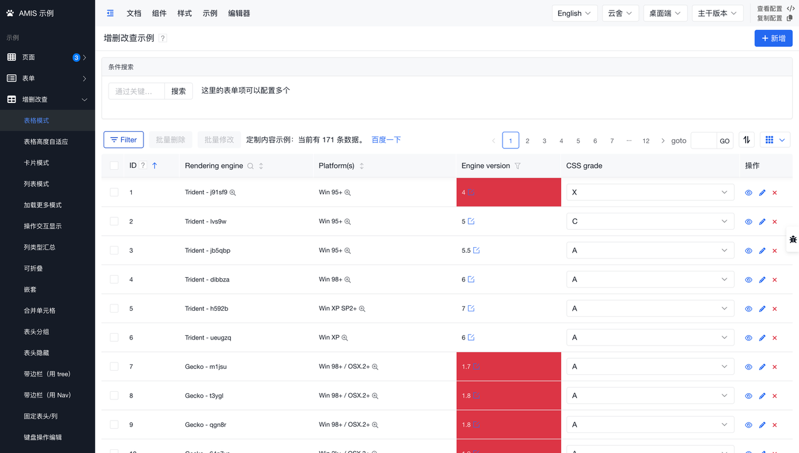

*   **GitHub:** https://github.com/baidu/amis
*   **Số sao GitHub:** 17.8k
*   **Cập nhật GitHub lần cuối:** 3 ngày trước
*   **Giấy phép Mã nguồn mở:** Apache 2.0
*   **Cộng tác viên Đang hoạt động:** 235
*   **Chấp nhận PR từ bên ngoài:** Có
*   **Website Chính thức:** Không có
*   **Tài liệu:** https://baidu.github.io/amis

**Giới thiệu:**

AMIS, được phát triển bởi Baidu, là một framework frontend low-code, nhanh chóng tạo ra các giao diện frontend phức tạp thông qua cấu hình JSON.

Được thiết kế để đơn giản hóa việc phát triển các ứng dụng tập trung vào dữ liệu, AMIS đặc biệt phù hợp với các backend quản trị và hiển thị dữ liệu phức tạp. Nó thể hiện tinh thần của nền tảng low-code bằng cách cho phép phát triển ứng dụng nhanh chóng thông qua cấu hình tối thiểu hoặc không cần mã.

Tuy nhiên, việc thiếu tài liệu bằng tiếng Anh có thể là rào cản đối với các nhà phát triển không nói tiếng Trung.

**Tính năng:**

*   **Điều khiển bằng JSON:** Các trang được tạo thông qua cấu hình JSON, hợp lý hóa phát triển frontend.
*   **Thư viện Thành phần Phong phú:** Bao gồm nhiều thành phần khác nhau như bảng, form và biểu đồ để đáp ứng nhu cầu của các trang phức tạp.
*   **Chỉnh sửa Trực quan:** Hỗ trợ các thao tác trực quan, đơn giản hóa quy trình phát triển.

**Trường hợp Sử dụng:**

AMIS lý tưởng cho các kịch bản yêu cầu phát triển nhanh chóng các ứng dụng frontend phong phú, tương tác, đặc biệt trong lĩnh vực backend quản lý và hiển thị dữ liệu phức tạp.

---

### 9. Node-RED

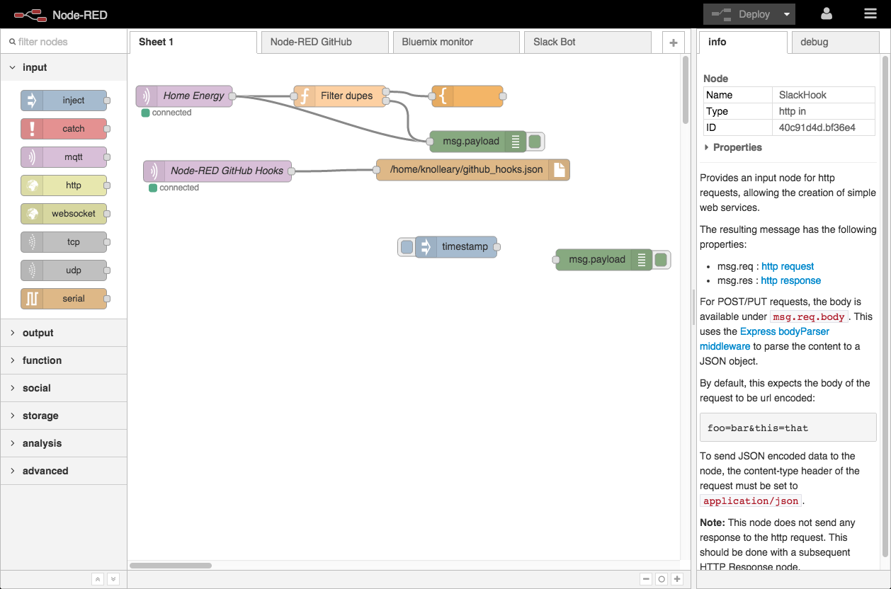

*   **GitHub:** https://github.com/node-red/node-red
*   **Số sao GitHub:** 20.4k
*   **Cập nhật GitHub lần cuối:** 2 ngày trước
*   **Giấy phép Mã nguồn mở:** Apache 2.0
*   **Cộng tác viên Đang hoạt động:** 234
*   **Chấp nhận PR từ bên ngoài:** Có
*   **Website Chính thức:** https://nodered.org/
*   **Tài liệu:** https://nodered.org/docs/

**Giới thiệu:**

Node-RED là một công cụ lập trình low-code dựa trên Node.js, được thiết kế để kết nối các thiết bị phần cứng, API và dịch vụ trực tuyến để tạo các ứng dụng hướng sự kiện.

**Tính năng:**

*   **Trình chỉnh sửa trên Trình duyệt:** Có trình chỉnh sửa luồng dựa trên trình duyệt giúp đơn giản hóa quá trình kết nối và triển khai quy trình làm việc.
*   **Dựa trên Node.js:** Sử dụng mô hình hướng sự kiện của Node.js, làm cho nó phù hợp để chạy trên các thiết bị biên (edge devices) và trong môi trường đám mây.
*   **Hướng cộng đồng:** Hỗ trợ cộng đồng chia sẻ và tái sử dụng các luồng (flows), tự hào có một thư viện module phong phú và kho lưu trữ luồng trực tuyến.

**Trường hợp Sử dụng:**

Node-RED lý tưởng cho các dự án yêu cầu tích hợp nhiều hệ thống và dịch vụ, chẳng hạn như điều khiển thiết bị IoT, quy trình làm việc tự động hóa và các tác vụ xử lý và phân phối dữ liệu khác nhau.

---

### 8. Budibase

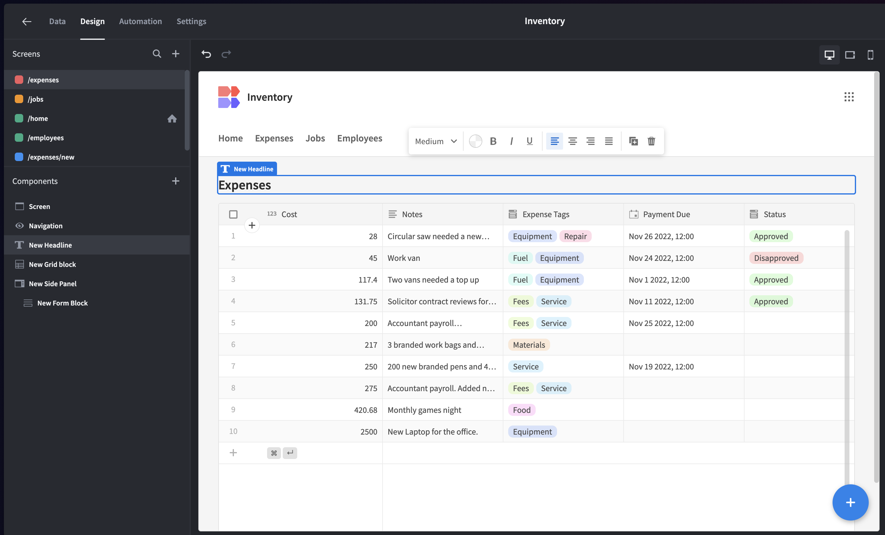

*   **GitHub:** https://github.com/Budibase/budibase
*   **Số sao GitHub:** 23.4k
*   **Cập nhật GitHub lần cuối:** Hôm nay
*   **Giấy phép Mã nguồn mở:** GPLv3
*   **Cộng tác viên Đang hoạt động:** 104
*   **Chấp nhận PR từ bên ngoài:** Có
*   **Website Chính thức:** https://budibase.com/
*   **Tài liệu:** https://docs.budibase.com/docs/

**Giới thiệu:**

Budibase là một nền tảng low-code mã nguồn mở được thiết kế để nhanh chóng xây dựng các công cụ kinh doanh nội bộ. Người dùng có thể tạo các ứng dụng tùy chỉnh dễ dàng bằng cách kéo và thả các thành phần, kết nối cơ sở dữ liệu và tích hợp API - mà không cần viết mã phức tạp.

**Tính năng:**

*   **Trình xây dựng Ứng dụng Trực quan:** Cung cấp giao diện kéo và thả trực quan để nhanh chóng lắp ráp các bảng điều khiển quản lý, form và các ứng dụng khác.
*   **Tích hợp Đa Nguồn Dữ liệu:** Hỗ trợ SQL, NoSQL, REST API, Google Sheets và nhiều hơn nữa để quản lý dữ liệu linh hoạt.
*   **Tự động hóa & Kiểm soát Truy cập:** Tính năng tự động hóa quy trình làm việc tích hợp, cùng với vai trò người dùng và kiểm soát truy cập để đảm bảo bảo mật dữ liệu.

**Trường hợp Sử dụng:**

Budibase lý tưởng cho các đội đang tìm cách nhanh chóng phát triển và triển khai các công cụ nội bộ, chẳng hạn như hệ thống CRM, quy trình phê duyệt, quản lý kho hàng và nền tảng hỗ trợ khách hàng.

---

### 7. Supervision

*   **GitHub:** https://github.com/roboflow/supervision
*   **Số sao GitHub:** 24.9k
*   **Cập nhật GitHub lần cuối:** Hôm nay
*   **Giấy phép Mã nguồn mở:** MIT
*   **Cộng tác viên Đang hoạt động:** 99
*   **Chấp nhận PR từ bên ngoài:** Có
*   **Website Chính thức:** https://supervision.roboflow.com/
*   **Tài liệu:** https://supervision.roboflow.com/0.22.0/how\_to/detect\_and\_annotate/

**Giới thiệu:**

Supervision là một nền tảng được thiết kế để huấn luyện, triển khai và giám sát các mô hình thị giác máy tính, nhằm mục đích tối ưu hóa hiệu suất mô hình và hợp lý hóa quy trình làm việc.

Mặc dù không được quảng bá chặt chẽ như một nền tảng low-code, Supervision tập trung vào việc cung cấp các công cụ để huấn luyện, triển khai và giám sát các mô hình thị giác máy tính, bao gồm các tính năng đơn giản hóa các quy trình như chú thích dữ liệu và huấn luyện mô hình bằng một cú nhấp chuột.

Điều này giúp đơn giản hóa đáng kể quy trình phát triển cho người dùng không có chuyên môn kỹ thuật sâu, phù hợp với một số nguyên tắc của nền tảng low-code bằng cách giảm lượng mã mà người dùng cần xử lý trực tiếp.

**Tính năng:**

*   **Công cụ Chú thích Dữ liệu:** Cung cấp các công cụ gán nhãn hiệu quả để tăng tốc quá trình chuẩn bị dữ liệu.
*   **Huấn luyện và Triển khai Mô hình:** Hỗ trợ huấn luyện và triển khai mô hình bằng một cú nhấp chuột, không yêu cầu kiến thức chuyên sâu về kỹ thuật.
*   **Giám sát và Tối ưu hóa Liên tục:** Giám sát hiệu suất mô hình theo thời gian thực và tự động tối ưu hóa để nâng cao độ chính xác.

**Trường hợp Sử dụng:**

Supervision phù hợp cho các doanh nghiệp và nhà nghiên cứu cần nhanh chóng phát triển và triển khai các ứng dụng thị giác máy tính, đặc biệt trong các lĩnh vực như kiểm soát chất lượng sản phẩm, giám sát an ninh và nâng cao trải nghiệm khách hàng.

---

### 6. Refine

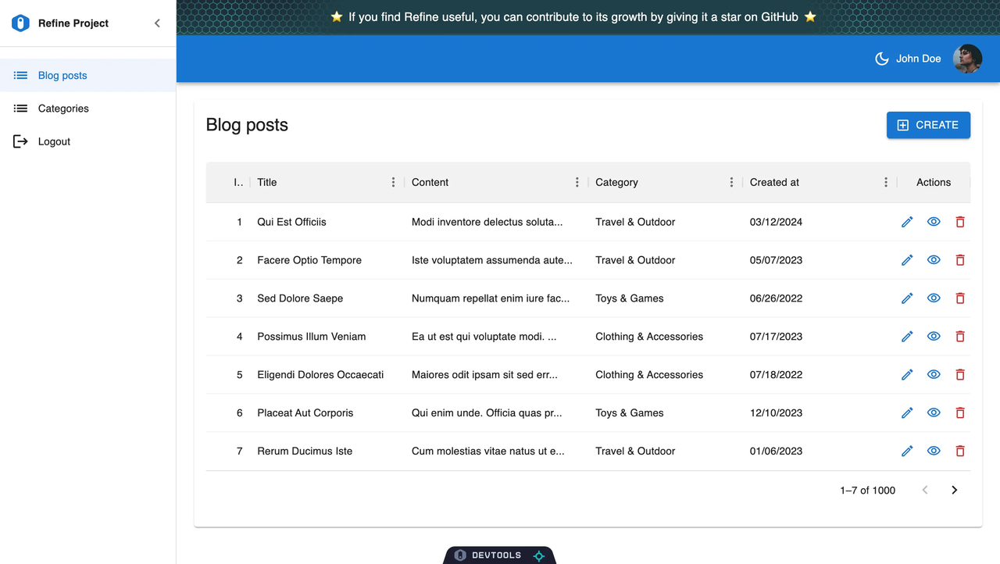

*   **GitHub:** https://github.com/refinedev/refine
*   **Số sao GitHub:** 29.9k
*   **Cập nhật GitHub lần cuối:** 4 ngày trước
*   **Giấy phép Mã nguồn mở:** MIT
*   **Cộng tác viên Đang hoạt động:** 284
*   **Chấp nhận PR từ bên ngoài:** Có
*   **Website Chính thức:** https://refine.dev/
*   **Tài liệu:** https://refine.dev/docs/

**Giới thiệu:**

Refine là một giải pháp thay thế mã nguồn mở cấp doanh nghiệp cho Retool, được thiết kế để xây dựng các công cụ nội bộ dựa trên React, bảng quản lý, bảng điều khiển và ứng dụng B2B. Nó kết hợp lợi ích của low-code và full-code, cung cấp khả năng mở rộng từ startup đến bảo trì lâu dài.

**Tính năng:**

*   **Mã React Thuần túy:** Cung cấp giải pháp mã nguồn mở có thể kiểm soát hoàn toàn, tránh những hạn chế của một "hộp đen".
*   **Bảo mật Cấp Doanh nghiệp:** Hỗ trợ triển khai tự lưu trữ và tích hợp liền mạch với các nhà cung cấp xác thực hiện có, hỗ trợ các mô hình kiểm soát truy cập phức tạp.
*   **Kiến trúc Mô-đun:** Dễ dàng tích hợp với REST và GraphQL API, hỗ trợ nhiều thư viện và framework frontend khác nhau.

**Trường hợp Sử dụng:**

Refine lý tưởng cho các nhà phát triển doanh nghiệp muốn xây dựng và duy trì các ứng dụng nội bộ được tùy chỉnh cao, đặc biệt trong các kịch bản yêu cầu tùy chỉnh mạnh mẽ và tiêu chuẩn bảo mật cao.

💡 **Đọc thêm:** [NocoBase vs Refine: So sánh Chuyên sâu các Công cụ Phát triển CRUD Mã nguồn mở](https://www.nocobase.com/blog/nocobase-vs-refine-an-in-depth-comparison-of-open-source-crud-development-tools) (Liên kết mẫu)

---

### 5. ToolJet

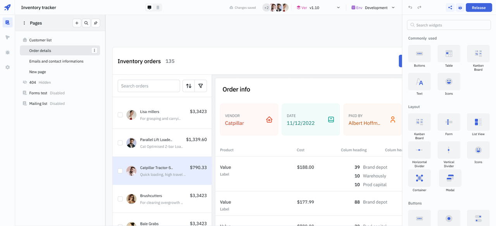

*   **GitHub:** https://github.com/ToolJet/ToolJet
*   **Số sao GitHub:** 34.7k
*   **Cập nhật GitHub lần cuối:** 2 ngày trước
*   **Giấy phép Mã nguồn mở:** AGPL-3.0
*   **Cộng tác viên Đang hoạt động:** 629
*   **Chấp nhận PR từ bên ngoài:** Có
*   **Website Chính thức:** https://www.tooljet.com/
*   **Tài liệu:** https://docs.tooljet.com/docs/

**Giới thiệu:**

ToolJet là một nền tảng low-code mã nguồn mở được thiết kế để xây dựng các ứng dụng kinh doanh. Nó cho phép kết nối tới cơ sở dữ liệu, lưu trữ đám mây, GraphQL và các endpoint API, sử dụng trình xây dựng ứng dụng kéo và thả để tạo ứng dụng.

**Tính năng:**

*   **Nhiều Kết nối Nguồn Dữ liệu:** Hỗ trợ tích hợp liền mạch với hơn 50 ứng dụng, cơ sở dữ liệu và API khác nhau.
*   **Trình xây dựng Ứng dụng Trực quan:** Cung cấp giao diện kéo và thả để đơn giản hóa phát triển frontend.
*   **Tự động hóa Quy trình làm việc:** Cho phép tự động hóa các quy trình kinh doanh thủ công phức tạp, giảm khối lượng công việc cho nhà phát triển.

**Trường hợp Sử dụng:**

ToolJet lý tưởng cho các doanh nghiệp cần nhanh chóng xây dựng và duy trì các công cụ nội bộ tùy chỉnh, đặc biệt phù hợp cho các kịch bản có yêu cầu tích hợp phức tạp.

---

### 4. Flowise

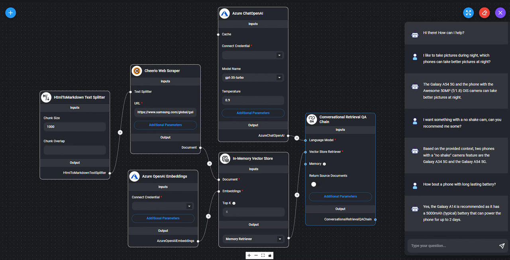

*   **GitHub:** https://github.com/FlowiseAI/Flowise
*   **Số sao GitHub:** 35.2k
*   **Cập nhật GitHub lần cuối:** 4 ngày trước
*   **Giấy phép Mã nguồn mở:** Apache 2.0
*   **Cộng tác viên Đang hoạt động:** 192
*   **Chấp nhận PR từ bên ngoài:** Có
*   **Website Chính thức:** https://flowiseai.com/
*   **Tài liệu:** https://docs.flowiseai.com/

**Giới thiệu:**

Flowise là một công cụ low-code mã nguồn mở được thiết kế đặc biệt để tạo các ứng dụng mô hình ngôn ngữ lớn (LLM) tùy chỉnh. Nó cho phép nhà phát triển xây dựng các quy trình LLM phức tạp và các agent AI thông qua giao diện kéo và thả đơn giản, tăng tốc quá trình phát triển từ prototype đến production.

**Tính năng:**

*   **Lặp lại Nhanh chóng:** Hỗ trợ phương pháp low-code giúp tăng tốc quá trình lặp lại từ thử nghiệm đến production.
*   **Giao diện Kéo và Thả:** Đơn giản hóa quá trình tạo ứng dụng LLM, được hỗ trợ bởi các template và logic tích hợp sẵn.
*   **Tích hợp Đa phương thức:** Tạo điều kiện kết nối tới nhiều nguồn dữ liệu và API khác nhau, chẳng hạn như cơ sở dữ liệu và dịch vụ đám mây.

**Trường hợp Sử dụng:**

Flowise phù hợp cho các doanh nghiệp cần nhanh chóng phát triển và triển khai các ứng dụng tương tác dựa trên AI, chẳng hạn như tự động hóa dịch vụ khách hàng, phân tích dữ liệu thông minh và hệ thống hỗ trợ đa ngôn ngữ.

---

### 3. Appsmith

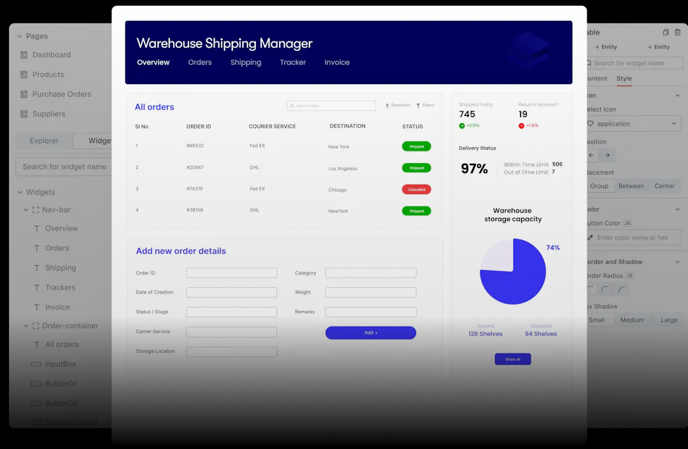

*   **GitHub:** https://github.com/appsmithorg/appsmith
*   **Số sao GitHub:** 35.7k
*   **Cập nhật GitHub lần cuối:** Hôm nay
*   **Giấy phép Mã nguồn mở:** Apache 2.0
*   **Cộng tác viên Đang hoạt động:** 334
*   **Chấp nhận PR từ bên ngoài:** Có
*   **Website Chính thức:** https://www.appsmith.com/
*   **Tài liệu:** https://docs.appsmith.com/

**Giới thiệu:**

Appsmith là một nền tảng mã nguồn mở để xây dựng các công cụ nội bộ, cho phép nhà phát triển nhanh chóng tạo, triển khai và quản lý các công cụ nội bộ doanh nghiệp bằng cách tiếp cận low-code. Nó hỗ trợ kết nối tới bất kỳ cơ sở dữ liệu, công cụ SaaS hoặc API nào và cung cấp các tùy chọn xây dựng giao diện người dùng linh hoạt.

**Tính năng:**

*   **Tích hợp Rộng rãi:** Hỗ trợ hơn 18 tích hợp native, tạo điều kiện kết nối dễ dàng tới các nguồn dữ liệu.
*   **Tùy chọn Phát triển Linh hoạt:** Cung cấp hơn 45 widget có thể tùy chỉnh và trình chỉnh sửa JavaScript tích hợp sẵn để đáp ứng nhu cầu tùy chỉnh phức tạp.
*   **Triển khai và Cộng tác Nhanh chóng:** Appsmith có khả năng xem trước tức thì và triển khai bằng một cú nhấp chuột, cho phép các đội cộng tác và lặp lại trên các ứng dụng nhanh chóng.

**Trường hợp Sử dụng:**

Appsmith lý tưởng cho các doanh nghiệp cần nhanh chóng xây dựng và duy trì các bảng điều khiển quản lý nội bộ, hệ thống CRM, cổng hỗ trợ khách hàng và các ứng dụng backend khác.

💡 **Đọc thêm:** [NocoBase vs. Appsmith: So sánh Chuyên sâu Nền tảng Low-Code Mã nguồn mở nào phù hợp với Bạn?](https://www.nocobase.com/blog/nocobase-vs-appsmith-which-open-source-low-code-platform-is-right-for-you) (Liên kết mẫu)

---

### 2. NocoDB

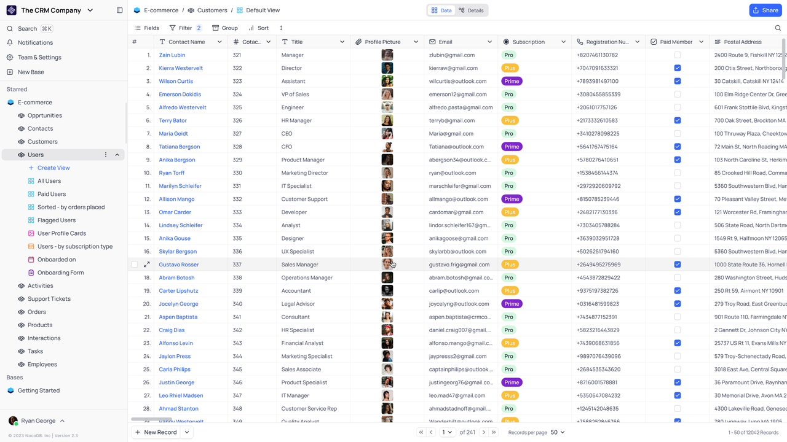

*   **GitHub:** https://github.com/nocodb/nocodb
*   **Số sao GitHub:** 51.9k
*   **Cập nhật GitHub lần cuối:** Trong vòng một ngày
*   **Giấy phép Mã nguồn mở:** AGPL-3.0
*   **Cộng tác viên Đang hoạt động:** 315
*   **Chấp nhận PR từ bên ngoài:** Có
*   **Website Chính thức:** https://nocodb.com/
*   **Tài liệu:** https://docs.nocodb.com/

**Giới thiệu:**

NocoDB là một giải pháp thay thế mã nguồn mở cho Airtable, có khả năng biến bất kỳ cơ sở dữ liệu nào thành một bảng tính thông minh để quản lý dữ liệu và tự động hóa mạnh mẽ.

**Tính năng:**

*   **Chế độ xem Dữ liệu Linh hoạt:** Cung cấp các chế độ xem dạng lưới (grid), kanban, gallery, form và lịch để phù hợp với các nhu cầu trình bày dữ liệu khác nhau.
*   **Khả năng Mở rộng Cao:** Có khả năng xử lý hàng triệu dòng dữ liệu, phù hợp cho các ứng dụng cơ sở dữ liệu quy mô lớn.
*   **Hỗ trợ API Mạnh mẽ:** Cung cấp API thông lượng cao để đảm bảo hoạt động dữ liệu linh hoạt và hiệu quả.

**Trường hợp Sử dụng:**

NocoDB lý tưởng cho các doanh nghiệp yêu cầu các hoạt động tập trung vào dữ liệu, chẳng hạn như CRM, quản lý dự án, quản lý hoạt động và quản lý kho hàng.

💡 **Đọc thêm:** [NocoBase vs NocoDB: So sánh Chuyên sâu các Công cụ No-Code Mã nguồn mở](https://www.nocobase.com/blog/nocobase-vs-nocodb-an-in-depth-comparison-of-open-source-no-code-tools) (Liên kết mẫu)

---

### 1. n8n

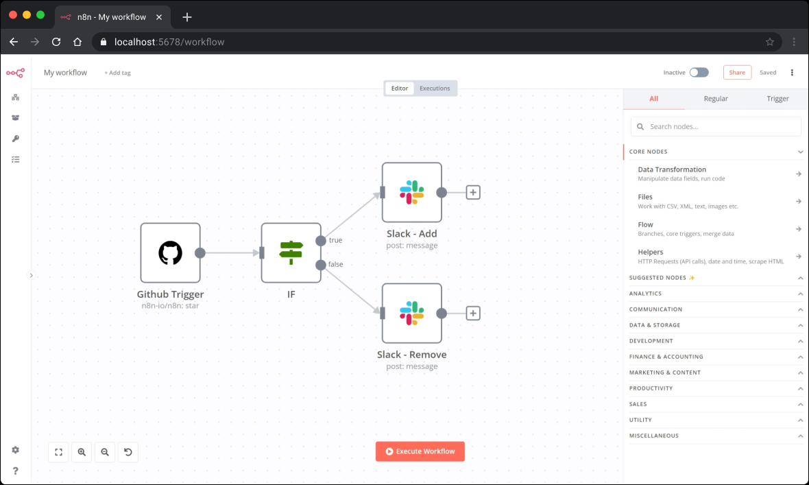

*   **GitHub:** https://github.com/n8n-io/n8n
*   **Số sao GitHub:** 61k
*   **Cập nhật GitHub lần cuối:** Trong vòng một ngày
*   **Giấy phép Mã nguồn mở:** Sustainable Use License
*   **Cộng tác viên Đang hoạt động:** 450
*   **Chấp nhận PR từ bên ngoài:** Có
*   **Website Chính thức:** https://n8n.io/
*   **Tài liệu:** https://docs.n8n.io/

**Giới thiệu:**

n8n là một công cụ tự động hóa quy trình làm việc mã nguồn mở cho phép các đội kỹ thuật kết nối bất kỳ dịch vụ trực tuyến hoặc API nào thông qua giao diện lập trình trực quan. Nó hỗ trợ các quy trình làm việc có thể tùy chỉnh cao để tự động truyền và xử lý dữ liệu, nâng cao hiệu quả và tự động hóa các hoạt động kinh doanh.

**Tính năng:**

*   **Mã nguồn mở và có khả năng mở rộng:** Người dùng có thể tự do sửa đổi và mở rộng chức năng.
*   **Tích hợp Đa dạng:** Hỗ trợ tích hợp với hơn 400 ứng dụng.
*   **Khả năng Tự động hóa Nâng cao:** Cung cấp các tính năng AI phức tạp cho các hoạt động và tương tác dữ liệu phức tạp.

**Trường hợp Sử dụng:**

n8n đặc biệt phù hợp với các doanh nghiệp cần tự động hóa xử lý khối lượng lớn dữ liệu và tích hợp nhiều hệ thống, chẳng hạn như trong tiếp thị tự động, phân tích dữ liệu khách hàng và tối ưu hóa quy trình làm việc nội bộ.

---

