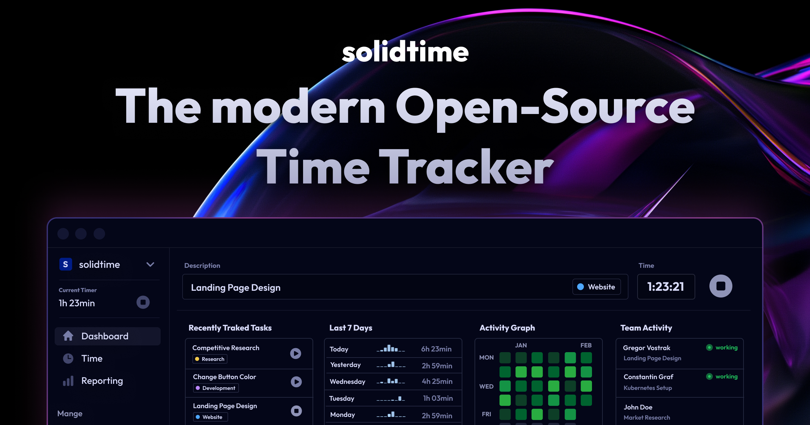

Dựa trên cấu trúc mã nguồn và các tệp cấu hình của dự án **solidtime**, dưới đây là phân tích chi tiết về kiến trúc hệ thống, công nghệ cốt lõi và tư duy thiết kế của đội ngũ phát triển:

---

### 1. Phân tích Công nghệ cốt lõi (Core Tech Stack)

Dự án sử dụng mô hình **Modern Monolith** (Monolith hiện đại) với sự kết hợp chặt chẽ giữa Backend và Frontend:

*   **Backend (PHP 8.3 & Laravel 12):** Sử dụng các tính năng mới nhất của PHP (Strict types, Enums, Constructor Promotion). Laravel đóng vai trò là "trái tim" điều phối mọi hoạt động từ cơ sở dữ liệu đến bảo mật.
*   **Frontend (Vue 3, TypeScript & Inertia.js):** Thay vì xây dựng API tách biệt hoàn toàn cho giao diện web chính, dự án dùng **Inertia.js**. Điều này giúp lập trình viên viết Vue nhưng vẫn tận dụng được hệ thống Routing và Auth mạnh mẽ của Laravel mà không cần dùng Vue Router hay state management (Vuex/Pinia) quá phức tạp.
*   **Admin Panel (Filament v3):** Một framework quản trị cực mạnh cho Laravel. Toàn bộ phần quản lý "Back-office" (Users, Organizations, Failed Jobs) được xây dựng bằng Filament để tiết kiệm thời gian viết UI quản trị.
*   **API Documentation (Scramble):** Tự động tạo tài liệu OpenAPI (Swagger) từ mã nguồn mà không cần viết chú thích thủ công quá nhiều.
*   **Infrastructure & DevOps:**
    *   **FrankenPHP (Octane):** Sử dụng Application Server hiệu năng cao dựa trên Go, giúp Laravel chạy nhanh hơn nhiều so với FPM truyền thống.
    *   **Docker:** Cung cấp môi trường đồng nhất từ local (Sail) đến production.
    *   **Storage:** Hỗ trợ S3 (MinIO cho local) để quản lý tệp tin.

---

### 2. Tư duy kiến trúc (Architectural Thinking)

Dự án thể hiện tư duy **"Enterprise-ready"** ngay từ đầu thông qua các đặc điểm:

*   **Multi-tenancy (Kiến trúc đa khách hàng):** Hệ thống được thiết kế quanh thực thể `Organization`. Một `User` có thể thuộc nhiều tổ chức thông qua bảng trung gian `Member`. Quyền hạn được kiểm soát dựa trên `Role` (Owner, Admin, Manager, Employee).
*   **Action-Oriented Design:** Thay vì viết logic trong Controller, dự án sử dụng các **Actions** (như trong thư mục `app/Actions`). Mỗi Action đảm nhận một nhiệm vụ duy nhất (Single Responsibility), giúp code dễ kiểm thử (Unit Test) và tái sử dụng.
*   **Service Layer Pattern:** Các logic nghiệp vụ phức tạp về tính toán (như `BillableRateService`, `TimeEntryAggregationService`) được tách ra lớp Service. Điều này giúp Controller giữ được sự gọn nhẹ.
*   **Extensibility (Khả năng mở rộng):** Có hệ thống `extensions/` riêng biệt và sử dụng `nwidart/laravel-modules`. Điều này cho phép "cắm" thêm các tính năng như Invoicing (hóa đơn) mà không làm ảnh hưởng đến lõi (Core) của ứng dụng.

---

### 3. Kỹ thuật kĩ thuật chính (Key Engineering Techniques)

*   **Strict Typing & Static Analysis:** Sử dụng **PHPStan (Level 7)** và **TypeScript** giúp phát hiện lỗi ngay khi lập trình, giảm thiểu lỗi Runtime (lỗi khi chạy).
*   **Database Optimization:**
    *   Sử dụng **UUID** thay vì Auto-increment ID để bảo mật và dễ dàng scale dữ liệu.
    *   Tính toán trước dữ liệu (`RecalculateSpentTimeForProject`): Sử dụng **Queue Jobs** để tính toán thời gian đã tiêu tốn, tránh gây tải cho Database khi người dùng xem báo cáo.
*   **Frontend UI/UX:** Sử dụng **Shadcn-Vue** (dựa trên Radix Vue và Tailwind CSS) để đảm bảo UI nhất quán, dễ tùy chỉnh và đạt chuẩn Accessibility.
*   **Testing Rigorous (Kiểm thử nghiêm ngặt):**
    *   **PHPUnit:** Cho logic Backend.
    *   **Playwright:** Cho kiểm thử đầu cuối (E2E), mô phỏng hành vi người dùng thực trên trình duyệt.

---

### 4. Tóm tắt luồng hoạt động (Operational Flow)

1.  **Xác thực & Ngữ cảnh:** Người dùng đăng nhập qua Fortify/Jetstream. Middleware `HandleInertiaRequests` sẽ nạp thông tin về tổ chức hiện tại (`current_team_id`) vào state của Frontend.
2.  **Theo dõi thời gian (Time Tracking):**
    *   Khi người dùng nhấn "Start Timer", một yêu cầu gửi đến `TimeEntryController`.
    *   `TimeEntryService` kiểm tra xem có mục thời gian nào đang chạy không, nếu có thì dừng lại (tùy cấu hình tổ chức) và tạo mục mới.
    *   Dữ liệu được lưu với `start_at` và `end_at` là null (đang chạy).
3.  **Xử lý hậu kỳ:** Khi Timer dừng, một **Job** có thể được đẩy vào hàng đợi để cập nhật lại tổng thời gian đã dùng cho `Project` hoặc `Task` liên quan.
4.  **Báo cáo (Reporting):**
    *   `ReportService` truy vấn dữ liệu thô từ `TimeEntry`.
    *   Sử dụng `TimeEntryAggregationService` để nhóm dữ liệu theo ngày/tuần/tháng/dự án dựa trên múi giờ (Timezone) của người dùng.
    *   Dữ liệu trả về dưới dạng JSON, Vue sẽ dùng **ECharts** để vẽ biểu đồ hoặc cho phép xuất ra CSV/PDF qua `ExportService` (sử dụng Gotenberg).

### Kết luận
**solidtime** là một dự án có tính chuyên môn cao, áp dụng các kỹ thuật lập trình hiện đại nhất của hệ sinh thái PHP/Laravel. Đây là một mẫu hình tốt cho việc xây dựng ứng dụng SaaS (Phần mềm như một dịch vụ) có khả năng tự lưu trữ (Self-hosted) và mở rộng linh hoạt.

