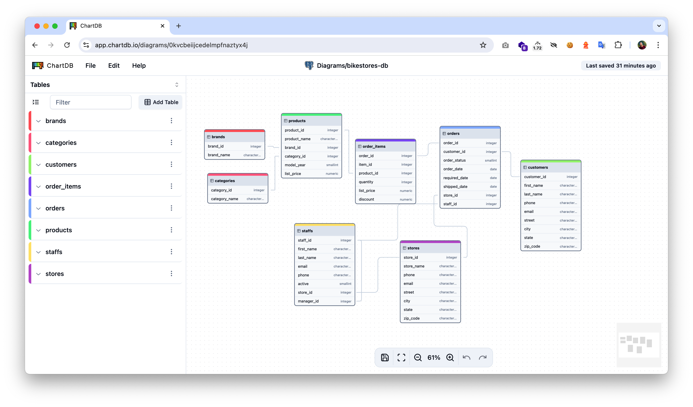

Dựa trên nội dung các tệp tin và cấu trúc kho lưu trữ **ChartDB**, dưới đây là bản phân tích chi tiết bằng tiếng Việt về công nghệ, kiến trúc và cách thức hoạt động của dự án này:

---

### 1. Công nghệ cốt lõi (Core Technologies)

ChartDB là một ứng dụng web hiện đại (Single Page Application - SPA) tập trung vào hiệu suất và trải nghiệm người dùng tương tác cao:

*   **Framework & Ngôn ngữ:** **React 18** kết hợp với **TypeScript**. Việc sử dụng TypeScript giúp quản lý chặt chẽ các kiểu dữ liệu phức tạp của sơ đồ cơ sở dữ liệu (Table, Field, Relationship).
*   **Công cụ xây dựng (Build Tool):** **Vite** – giúp tốc độ phát triển và đóng gói cực nhanh.
*   **Quản lý Sơ đồ (Diagram Engine):** **@xyflow/react** (trước đây là React Flow). Đây là "trái tim" của ứng dụng, cho phép vẽ các node (bảng), edge (mối quan hệ) và xử lý tương tác kéo thả trên canvas.
*   **Xử lý dữ liệu Database:**
    *   **@dbml/core & @dbml/parse:** Dùng để xử lý ngôn ngữ DBML (Database Markup Language), một tiêu chuẩn mở để định nghĩa cấu trúc DB.
    *   **node-sql-parser:** Dùng để phân tích cú pháp các câu lệnh SQL.
*   **Giao diện người dùng (UI/UX):**
    *   **Tailwind CSS:** Framework CSS chính để thiết kế giao diện.
    *   **Shadcn/UI & Radix UI:** Cung cấp các thành phần giao diện (component) chuẩn mực, dễ truy cập (accessible).
    *   **Monaco Editor:** Trình soạn thảo mã nguồn (giống VS Code) được tích hợp để chỉnh sửa SQL/DBML ngay trong ứng dụng.
*   **Lưu trữ cục bộ:** **Dexie.js** (một wrapper cho IndexedDB) giúp lưu trữ các sơ đồ ngay tại trình duyệt của người dùng mà không cần backend.
*   **AI Integration:** Sử dụng **Vercel AI SDK** và **OpenAI** để hỗ trợ chuyển đổi/export giữa các dialect (phương ngữ) SQL khác nhau.

---

### 2. Tư duy kiến trúc (Architectural Thinking)

Kiến trúc của ChartDB được thiết kế theo hướng **Client-side First** (Ưu tiên phía máy khách) và **Privacy-focused** (Tập trung vào quyền riêng tư):

*   **Không cần Backend (Serverless-ish):** Ứng dụng hoạt động hoàn toàn trên trình duyệt. Người dùng không phải nhập mật khẩu database trực tiếp vào app. Thay vào đó, họ chạy một "Smart Query" trên máy của họ và dán kết quả JSON vào app. Điều này đảm bảo an toàn tuyệt đối cho dữ liệu.
*   **Quản lý trạng thái bằng Context API:** Thay vì dùng Redux, dự án chia nhỏ các logic vào nhiều React Contexts (trong thư mục `src/context/`):
    *   `canvas-context`: Quản lý trạng thái bản vẽ.
    *   `history-context`: Xử lý tính năng Undo/Redo.
    *   `storage-context`: Giao tiếp với IndexedDB.
*   **Tính module hóa cao (Modularity):** Các logic về database được tách biệt hoàn toàn trong `src/lib/data/`. Mỗi loại database (PostgreSQL, MySQL, SQLite...) có kịch bản (scripts) và bộ phân tích (importers) riêng.
*   **Tính đa ngôn ngữ (Internationalization):** Sử dụng `i18next` với cấu trúc tệp locale (trong `src/i18n/locales/`) rất rõ ràng, hỗ trợ hàng chục ngôn ngữ bao gồm cả tiếng Việt (`vi.ts`).

---

### 3. Các kỹ thuật chính (Key Techniques)

*   **Smart Query Strategy:** Đây là kỹ thuật độc đáo của ChartDB. Thay vì kết nối trực tiếp (thường gặp lỗi CORS hoặc vấn đề bảo mật), app cung cấp một câu lệnh SQL phức tạp để người dùng chạy trên DB của họ. Câu lệnh này trả về metadata định dạng JSON mà app có thể hiểu và vẽ lại sơ đồ ngay lập tức.
*   **Kỹ thuật Vẽ Edge tự động:** Sử dụng các thuật toán tính toán vị trí để các đường kẻ (mối quan hệ) không bị chồng chéo, tự động điều chỉnh khi người dùng di chuyển các bảng.
*   **AI-Driven Migration:** Sử dụng LLM để đọc cấu trúc sơ đồ hiện tại và chuyển đổi nó sang một phương ngữ SQL khác (ví dụ từ MySQL sang PostgreSQL) một cách thông minh, xử lý được cả các kiểu dữ liệu đặc thù.
*   **Multi-stage Docker Build:** Tối ưu hóa kích thước image Docker bằng cách build mã nguồn Node.js sau đó chuyển kết quả vào một server Nginx gọn nhẹ.

---

### 4. Tóm tắt luồng hoạt động (Workflow Summary)

1.  **Nhập dữ liệu (Import):** Người dùng có 3 cách:
    *   Dán kết quả JSON từ "Smart Query".
    *   Tải lên tệp SQL DDL (Create table...).
    *   Viết/Dán mã DBML.
2.  **Phân tích (Parsing):** Hệ thống sử dụng các bộ Importer trong `src/lib/data/sql-import` để chuyển đổi các đầu vào khác nhau về một mô hình dữ liệu chung (Internal Schema Model).
3.  **Trình diễn (Rendering):** Mô hình dữ liệu này được chuyển thành các Nodes (bảng) và Edges (quan hệ) cho XYFlow để hiển thị trên canvas.
4.  **Tương tác (Interaction):** Người dùng chỉnh sửa bảng, thêm trường, thay đổi màu sắc hoặc nhóm các bảng vào các "Area" (vùng). Mọi hành động được lưu vào `history-stack` để có thể Undo.
5.  **Lưu trữ (Persistence):** Dữ liệu được tự động lưu vào IndexedDB thông qua Dexie để người dùng không bị mất việc khi tắt trình duyệt.
6.  **Xuất dữ liệu (Export):** Người dùng có thể xuất ra:
    *   Hình ảnh (PNG/SVG).
    *   Mã SQL DDL cho các loại DB khác nhau.
    *   Tệp DBML.

ChartDB là một ví dụ điển hình về việc xây dựng một công cụ năng suất (productivity tool) mạnh mẽ, chuyên sâu mà vẫn giữ được sự đơn giản và an toàn nhờ tận dụng tối đa sức mạnh của trình duyệt hiện đại.

