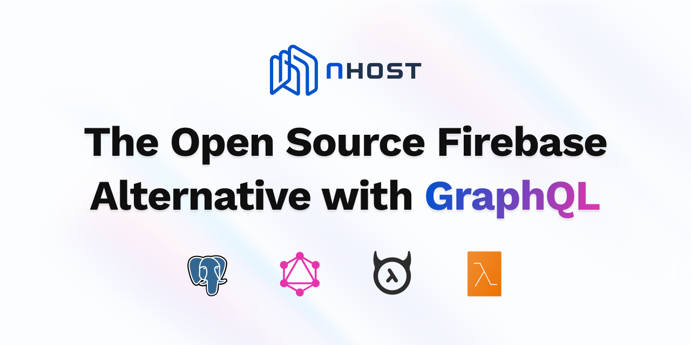

Dựa trên mã nguồn và cấu trúc kho lưu trữ Nhost, dưới đây là phân tích chi tiết về dự án này:

### 1. Công nghệ cốt lõi (Core Technologies)

Nhost được xây dựng như một nền tảng **BaaS (Backend-as-a-Service)** mã nguồn mở, tập trung vào GraphQL. Các thành phần chính bao gồm:

*   **Ngôn ngữ lập trình:**
    *   **Go (Golang):** Dùng để viết CLI, các dịch vụ lõi như `Auth` (xác thực) và `Storage` (lưu trữ). Go được chọn vì hiệu suất cao, khả năng xử lý đồng thời tốt và tạo ra file thực thi nhỏ gọn.
    *   **TypeScript/JavaScript:** Chiếm tỉ trọng lớn nhất (74%), dùng cho `Dashboard` (Next.js), `SDK (nhost-js)` và `Serverless Functions`.
*   **Cơ sở hạ tầng & Dữ liệu:**
    *   **Hasura:** Trái tim của hệ thống, cung cấp Instant GraphQL API tự động dựa trên schema của PostgreSQL.
    *   **PostgreSQL:** Cơ sở dữ liệu quan hệ chính.
    *   **Minio/S3:** Sử dụng cho dịch vụ Storage.
*   **Quản lý môi trường & Build:**
    *   **Nix & Flakes:** Cung cấp môi trường phát triển đồng nhất (reproducible environments) cho tất cả lập trình viên.
    *   **Docker & Docker Compose:** Dùng để đóng gói và chạy toàn bộ stack Nhost ở môi trường local.
    *   **Turbo (Turborepo) & PNPM:** Quản lý Monorepo hiệu quả, tối ưu hóa quá trình build và cache.

### 2. Tư duy kiến trúc (Architectural Mindset)

Kiến trúc của Nhost phản ánh tư duy **"GraphQL-centric BaaS"**:

*   **Unified GraphQL API:** Thay vì nhiều REST endpoints, Nhost hợp nhất Database, Auth và Storage vào một cổng GraphQL duy nhất thông qua Hasura Remote Schemas và Action.
*   **Infrastructure as Code (IaC):** Mọi cấu hình hệ thống được định nghĩa trong file `nhost.toml`. CLI sẽ dựa vào file này để thiết lập môi trường đồng nhất giữa local và cloud.
*   **Decoupled Services (Dịch vụ tách biệt):**
    *   Các dịch vụ `Auth` và `Storage` là các microservices viết bằng Go, giao tiếp với nhau và với Hasura thông qua webhooks hoặc GraphQL.
    *   **Serverless Functions** cho phép mở rộng logic nghiệp vụ mà không cần quản lý server.
*   **Frontend Agnostic:** Nhost không ràng buộc framework frontend. Nó cung cấp SDK mạnh mẽ cho React, Vue, Svelte, Next.js và thậm chí cả Flutter.

### 3. Các kỹ thuật chính (Key Techniques & Mechanisms)

*   **Cơ chế Overlay (Configuration Patching):** Nhost sử dụng JSON patches (trong thư mục `overlays/`) để ghi đè cấu hình cho từng môi trường (local, staging, production) mà không làm thay đổi file cấu hình gốc.
*   **Model Context Protocol (MCP):** Đây là một điểm mới và hiện đại. Nhost tích hợp MCP server để cho phép các AI Assistant (như Claude, Cursor) tương tác trực tiếp với schema, tài liệu và dữ liệu của dự án để hỗ trợ code.
*   **Database Migrations & Metadata:** CLI quản lý các thay đổi DB thông qua Hasura migrations. Kỹ thuật này đảm bảo schema luôn được đồng bộ và có thể quay ngược phiên bản (rollback).
*   **Security by Design:**
    *   Sử dụng **JWT (JSON Web Tokens)** để xác thực.
    *   Tích hợp sẵn các cơ chế như Rate Limiting, Brute Force Protection trong dịch vụ Auth.
    *   Hỗ trợ quét virus cho file tải lên (ClamAV) trong dịch vụ Storage.

### 4. Tóm tắt luồng hoạt động (Workflow Summary)

Luồng làm việc tiêu chuẩn với Nhost theo mã nguồn cung cấp:

1.  **Khởi tạo (Local Development):**
    *   Người dùng chạy `nhost init`. CLI tạo cấu trúc thư mục, file `nhost.toml` và các thư mục migrations.
    *   Chạy `nhost up`: CLI sử dụng Docker Compose để kéo các image (Postgres, Hasura, Auth, Storage) và khởi chạy toàn bộ stack trên máy local.
2.  **Phát triển:**
    *   **Database:** Thay đổi schema trên Hasura Console local -> CLI tự động tạo file migration.
    *   **Logic:** Viết code trong thư mục `functions/`. CLI sẽ hot-reload các hàm này.
    *   **Auth/Storage:** Cấu hình quyền truy cập (Permissions) trong Hasura metadata.
3.  **Đồng bộ & Triển khai (Cloud Deployment):**
    *   Kết nối GitHub với Nhost Cloud.
    *   Khi `git push`, hệ thống CI/CD của Nhost sẽ đọc thư mục `nhost/` (chứa migrations và metadata) để tự động cập nhật hạ tầng cloud giống hệt môi trường local.
4.  **Vận hành:**
    *   Nhost SDK (`@nhost/nhost-js`) được nhúng vào Frontend để thực hiện đăng nhập, truy vấn dữ liệu qua GraphQL và upload file.
    *   Sử dụng `Dashboard` (Next.js) để quản lý người dùng, xem log và theo dõi các chỉ số (metrics) qua Grafana.

**Kết luận:** Nhost là một dự án có kỹ thuật triển khai rất chuyên nghiệp, kết hợp giữa sức mạnh hệ thống của **Go** và sự linh hoạt của **TypeScript**, hỗ trợ tối đa cho lập trình viên thông qua tự động hóa cấu hình và tích hợp AI.

