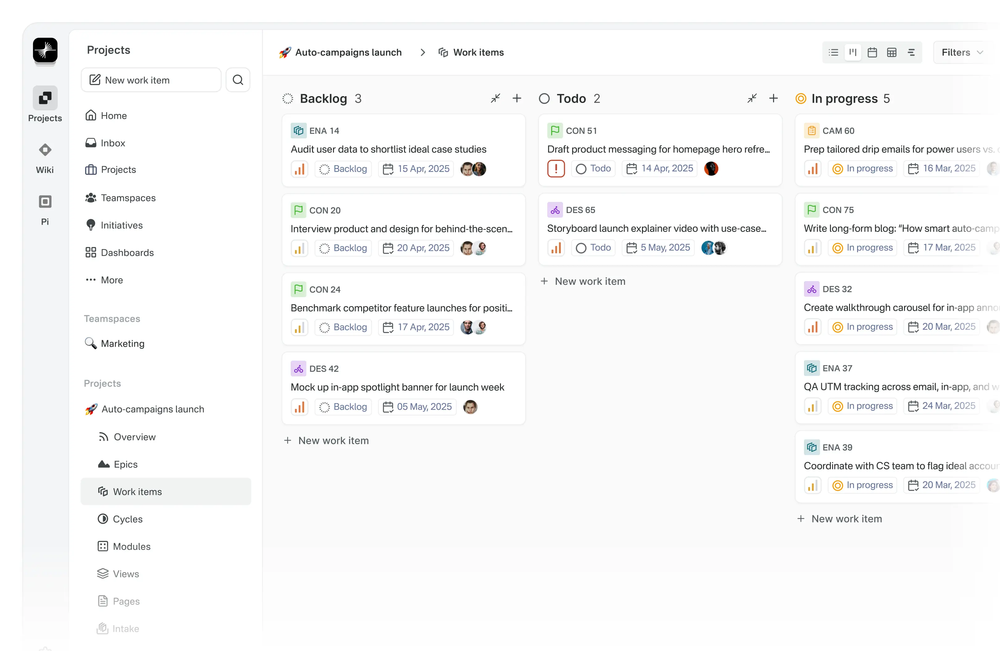

**Plane** là một nền tảng quản lý dự án mã nguồn mở (Open Source) được thiết kế để thay thế cho các công cụ như JIRA, Linear hay Asana. Dựa trên mã nguồn bạn cung cấp, đây là một hệ thống cực kỳ hiện đại với kiến trúc Monorepo và khả năng mở rộng cao.

Dưới đây là chi tiết về các công nghệ và kĩ thuật chính mà Plane sử dụng:

### 1. Kiến trúc tổng thể (Architecture)
Plane sử dụng mô hình **Monorepo** (quản lý nhiều ứng dụng và gói thư viện trong một kho lưu trữ duy nhất), được điều phối bởi **Turborepo** và **PNPM Workspaces**.

*   **Frontend (Apps):**
    *   `apps/web`: Ứng dụng chính cho người dùng, viết bằng **Next.js** (App Router).
    *   `apps/admin`: Trang quản trị hệ thống, sử dụng **React Router 7** (mới chuyển đổi từ Next.js).
    *   `apps/space`: Dành cho các tính năng cộng tác công khai.
*   **Backend:**
    *   `apps/api`: Hệ thống lõi xử lý logic, viết bằng **Python** và framework **Django**.
*   **Real-time Server:**
    *   `apps/live`: Máy chủ xử lý cộng tác thời gian thực (như cùng soạn thảo văn bản).
*   **Packages:** Các thư viện dùng chung như `@plane/ui` (giao diện), `@plane/services` (gọi API), `@plane/shared-state` (quản lý trạng thái).

### 2. Công nghệ Backend (Server-side)
*   **Ngôn ngữ:** **Python**.
*   **Web Framework:** **Django** cùng với **Django REST Framework (DRF)** để xây dựng hệ thống API mạnh mẽ.
*   **Database:** **PostgreSQL** là cơ sở dữ liệu chính.
*   **Caching & Pub/Sub:** **Redis** (sử dụng bản phân nhánh **Valkey**) để tăng tốc truy vấn và quản lý hàng đợi.
*   **Background Tasks (Tác vụ nền):** **Celery** kết hợp với **RabbitMQ** (Message Broker) để xử lý các việc nặng như gửi email, export dữ liệu, hoặc xử lý ảnh.
*   **Storage:** Hỗ trợ lưu trữ tương thích **AWS S3** hoặc **MinIO** (cho bản tự cài đặt - self-host).

### 3. Công nghệ Frontend (Client-side)
*   **Framework:** **React** và **Next.js**.
*   **Ngôn ngữ:** **TypeScript** (chiếm ~75% mã nguồn), đảm bảo an toàn về kiểu dữ liệu.
*   **Quản lý trạng thái (State Management):** Sử dụng **MobX** thay vì Redux. MobX giúp xử lý các phản ứng (reactivity) mượt mà hơn trong các ứng dụng quản lý dữ liệu phức tạp. Ngoài ra còn dùng **SWR** để fetch dữ liệu từ API.
*   **Styling:** **Tailwind CSS**.
*   **Rich Text Editor:** Sử dụng **Tiptap** (dựa trên Prosemirror), cho phép tạo các trình soạn thảo văn bản mạnh mẽ có hỗ trợ AI và tải lên tệp tin.
*   **Drag and Drop:** Sử dụng **Pragmatic Drag and Drop** (của Atlassian), rất quan trọng cho các tính năng như bảng Kanban, sắp xếp thứ tự Issue.

### 4. Kỹ thuật Cộng tác thời gian thực (Real-time & Collaboration)
Đây là một điểm kĩ thuật rất cao của Plane:
*   **Công nghệ:** Sử dụng **Hocuspocus** và **Yjs**.
*   **Cơ chế:** Dựa trên **CRDT (Conflict-free Replicated Data Types)**. Kỹ thuật này cho phép nhiều người dùng cùng sửa một nội dung cùng lúc mà không bị xung đột dữ liệu (giống như Google Docs).

### 5. Hạ tầng và DevOps (Infrastructure)
*   **Containerization:** Sử dụng **Docker** và **Docker Compose** để đóng gói toàn bộ hệ thống (DB, Redis, API, Web, Proxy).
*   **Proxy/Web Server:** Sử dụng **Caddy** hoặc **Nginx** để làm Reverse Proxy và xử lý SSL.
*   **CI/CD:** Hệ thống **GitHub Actions** đồ sộ để tự động kiểm tra mã nguồn (Linting), kiểm tra lỗi (Type check) và đóng gói hình ảnh Docker.
*   **Security:** Có các chính sách nghiêm ngặt về CSRF, Rate Limiting (giới hạn tần suất gọi API), và phân quyền chi tiết (RBAC).

### Tóm tắt đặc điểm nổi bật:
1.  **Tính phản ứng cao:** Nhờ kết hợp MobX ở Frontend và Redis ở Backend, mọi thay đổi trên dự án được cập nhật rất nhanh.
2.  **Khả năng tùy biến giao diện:** Plane có hệ thống Design System riêng (`@plane/ui` và `@plane/propel`) cực kỳ tinh tế, giúp trải nghiệm người dùng không thua kém các phần mềm trả phí.
3.  **Hỗ trợ AI:** Tích hợp sẵn các cổng kết nối với LLM (như OpenAI) để hỗ trợ viết nội dung hoặc tóm tắt công việc.

Đây là một dự án có độ phức tạp cao, sử dụng các công nghệ hàng đầu hiện nay trong hệ sinh thái JavaScript/TypeScript và Python.

