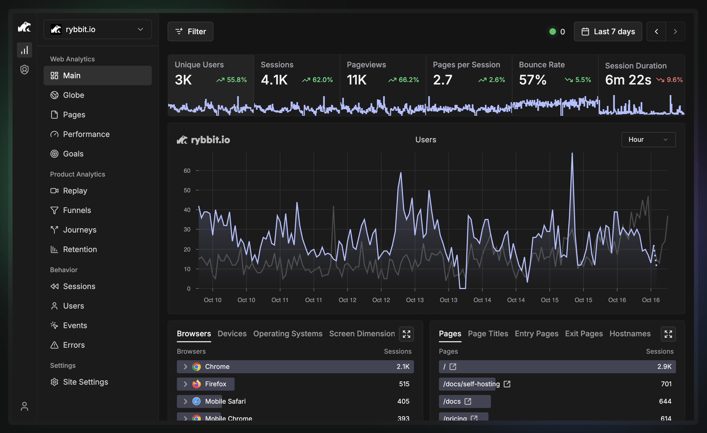

Dựa trên nội dung kho lưu trữ **Rybbit** (phiên bản 2.2.4), dưới đây là tóm tắt chi tiết về công nghệ, kiến trúc và luồng hoạt động của dự án:

### 1. Công nghệ cốt lõi (Tech Stack)

Dự án được xây dựng theo mô hình Monorepo (chia thành `client`, `server`, `shared`, `monitor-agent`).

*   **Frontend (Client):**
    *   **Framework:** Next.js 15 (App Router), React 19, TypeScript.
    *   **Styling:** Tailwind CSS 4, Shadcn UI (Radix UI).
    *   **State Management:** Zustand, Jotai.
    *   **Data Fetching:** Tanstack Query (React Query) v5.
    *   **Visualization:** Nivo (biểu đồ), Mapbox GL / OpenLayers (bản đồ), rrweb (quay phát session replay).
    *   **Utilities:** Luxon (thời gian), Zod (validation), nuqs (quản lý state qua URL).

*   **Backend (Server):**
    *   **Runtime:** Node.js, Fastify (framework tốc độ cao).
    *   **ORM:** Drizzle ORM.
    *   **Authentication:** Better-Auth.
    *   **Validation:** Zod.

*   **Cơ sở dữ liệu (Databases):**
    *   **ClickHouse:** Đóng vai trò hạt nhân, lưu trữ và xử lý dữ liệu phân tích (OLAP) với tốc độ cực nhanh cho hàng triệu sự kiện.
    *   **PostgreSQL (v17):** Lưu trữ dữ liệu quan hệ như thông tin người dùng, tổ chức, cấu hình site và cài đặt monitor (OLTP).
    *   **Redis:** Cấu hình cho caching và quản lý hàng đợi (queues).

*   **Infrastructure:**
    *   **Docker & Docker Compose:** Đóng gói toàn bộ dịch vụ.
    *   **Caddy:** Reverse proxy và tự động quản lý SSL.

### 2. Tư duy kiến trúc & Kỹ thuật chính

*   **Kiến trúc Database lai (Hybrid):** 
    *   Sử dụng song song Postgres cho các tác vụ quản lý (CRUD) và ClickHouse cho các truy vấn phân tích phức tạp. Đây là lựa chọn tối ưu để thay thế Google Analytics ở quy mô lớn.
*   **Privacy-First (Ưu tiên quyền riêng tư):** 
    *   Thiết kế không sử dụng cookie, tuân thủ GDPR. 
    *   Hỗ trợ ẩn IP và muối (salt) ID người dùng để bảo mật danh tính.
*   **Module hóa Monitoring:** 
    *   Có một `monitor-agent` riêng biệt để kiểm tra Uptime (HTTP/TCP) từ nhiều khu vực khác nhau.
*   **API-Driven:** 
    *   Client tương tác với Server hoàn toàn qua REST API. Dự án còn cung cấp một "API Playground" để người dùng thử nghiệm các endpoint.
*   **Xử lý dữ liệu thời gian thực:** 
    *   Tối ưu hóa ClickHouse để cung cấp các báo cáo "Real-time" và "Live User Count".

### 3. Tóm tắt luồng hoạt động (Workflow)

Luồng đi của dữ liệu trong Rybbit có thể chia làm 3 giai đoạn chính:

1.  **Thu thập (Collection):**
    *   Một đoạn mã nhỏ (`script.js` được build từ server) được chèn vào trang web của khách hàng.
    *   Script này tự động thu thập Pageviews, Web Vitals, Errors và gửi về endpoint `/api/event` của backend.
    *   Nếu bật Session Replay, `rrweb` sẽ ghi lại các sự kiện DOM và gửi về server để lưu trữ (thường là lên R2/S3 hoặc ClickHouse).

2.  **Xử lý & Lưu trữ (Ingestion):**
    *   Backend nhận sự kiện, phân tích Metadata (User-Agent để biết trình duyệt, GeoIP để biết vị trí: Country -> Region -> City).
    *   Dữ liệu sau đó được đẩy vào **ClickHouse**.
    *   Hệ thống Uptime Monitor chạy ngầm, thực hiện các check HTTP/TCP và lưu kết quả vào Postgres/ClickHouse để báo cáo sự cố.

3.  **Hiển thị (Visualization):**
    *   Người dùng truy cập Dashboard (Next.js).
    *   Client gửi yêu cầu truy vấn kèm theo các bộ lọc (Filters: thời gian, thiết bị, quốc gia...).
    *   Backend chuyển đổi các bộ lọc này thành câu lệnh SQL tối ưu cho ClickHouse.
    *   Dữ liệu trả về được hiển thị qua các biểu đồ (Nivo), bản đồ nhiệt (Mapbox) hoặc trình phát lại phiên làm việc (Replay Player).

### Điểm nổi bật:
Dự án có khả năng **nhập dữ liệu (Import)** từ các đối thủ như Google Analytics, Plausible, Umami, giúp người dùng chuyển đổi nền tảng dễ dàng. Ngoài ra, tính năng **User Journeys** và **Funnels** được đầu tư mạnh về mặt trực quan hóa dữ liệu.

