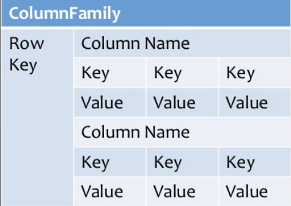
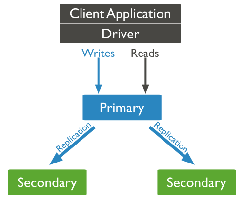
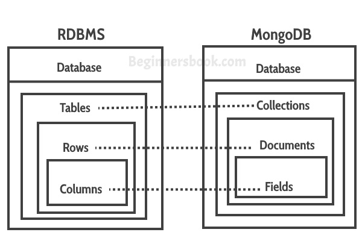

# Kiến thức cơ bản về MongoDB


## Mục lục

*   [Các lệnh MongoDB](mongodb-commands.md)
*   [Thực hành lập trình MongoDB](mongodb-code.md)

<br/>

# 1. Các loại cơ sở dữ liệu NoSQL khác nhau là gì?

NoSQL là một Hệ quản trị cơ sở dữ liệu (DBMS) phi quan hệ, không yêu cầu lược đồ (schema) cố định, tránh các phép nối (join) và dễ dàng mở rộng quy mô. Mục đích của việc sử dụng cơ sở dữ liệu NoSQL là cho các kho lưu trữ dữ liệu phân tán với nhu cầu lưu trữ dữ liệu khổng lồ. NoSQL được sử dụng cho Dữ liệu lớn (Big data) và các ứng dụng web thời gian thực.
**Các loại Cơ sở dữ liệu NoSQL:**

*   Cơ sở dữ liệu tài liệu (Document databases)
*   Kho lưu trữ khóa-giá trị (Key-value stores)
*   Cơ sở dữ liệu hướng cột (Column-oriented databases)
*   Cơ sở dữ liệu đồ thị (Graph databases)

**1. Cơ sở dữ liệu tài liệu:**

Cơ sở dữ liệu tài liệu lưu trữ dữ liệu trong các tài liệu (document) JSON, BSON hoặc XML. Trong cơ sở dữ liệu tài liệu, các tài liệu có thể được lồng vào nhau. Các phần tử cụ thể có thể được đánh chỉ mục (index) để truy vấn nhanh hơn.

Các tài liệu có thể được lưu trữ và truy xuất dưới dạng gần gũi hơn nhiều với các đối tượng dữ liệu được sử dụng trong ứng dụng, điều đó có nghĩa là cần ít sự chuyển đổi hơn để sử dụng dữ liệu trong ứng dụng. Dữ liệu SQL thường phải được lắp ráp và tháo rời khi di chuyển qua lại giữa ứng dụng và bộ nhớ lưu trữ.

**Ví dụ:** Amazon SimpleDB, CouchDB, MongoDB, Riak, Lotus Notes là các hệ thống DBMS hướng tài liệu phổ biến.


**2. Kho lưu trữ khóa-giá trị:**

Dữ liệu được lưu trữ dưới dạng các cặp khóa/giá trị. Nó được thiết kế theo cách để xử lý nhiều dữ liệu và tải nặng. Cơ sở dữ liệu lưu trữ cặp khóa-giá trị lưu trữ dữ liệu dưới dạng bảng băm (hash table), trong đó mỗi khóa là duy nhất và giá trị có thể là JSON, BLOB (Binary Large Objects - Đối tượng nhị phân lớn), chuỗi, v.v.

**Ví dụ:** các kho lưu trữ khóa-giá trị là Redis, Voldemort, Riak và DynamoDB của Amazon.


**3. Cơ sở dữ liệu hướng cột:**

Cơ sở dữ liệu hướng cột hoạt động trên các cột và dựa trên bài báo BigTable của Google. Mỗi cột được xử lý riêng biệt. Các giá trị của cơ sở dữ liệu một cột được lưu trữ liền kề nhau.

Chúng mang lại hiệu năng cao cho các truy vấn tổng hợp (aggregation queries) như SUM, COUNT, AVG, MIN, v.v. vì dữ liệu đã có sẵn trong một cột.

**Ví dụ:** Cơ sở dữ liệu NoSQL dựa trên cột được sử dụng rộng rãi để quản lý kho dữ liệu (data warehouses), kinh doanh thông minh (business intelligence), CRM, danh mục thẻ thư viện. HBase, Cassandra, Hypertable là các ví dụ về cơ sở dữ liệu dựa trên cột.



**4. Cơ sở dữ liệu đồ thị:**

Cơ sở dữ liệu kiểu đồ thị lưu trữ các thực thể (entities) cũng như các mối quan hệ (relations) giữa các thực thể đó. Thực thể được lưu trữ dưới dạng một nút (node) với mối quan hệ là các cạnh (edges). Một cạnh thể hiện mối quan hệ giữa các nút. Mỗi nút và cạnh có một định danh duy nhất.

So với cơ sở dữ liệu quan hệ nơi các bảng được kết nối lỏng lẻo, cơ sở dữ liệu đồ thị có bản chất đa quan hệ (multi-relational). Việc duyệt qua các mối quan hệ rất nhanh vì chúng đã được ghi lại trong DB và không cần phải tính toán chúng.

Cơ sở dữ liệu dựa trên đồ thị chủ yếu được sử dụng cho mạng xã hội, hậu cần (logistics), dữ liệu không gian (spatial data).

**Ví dụ:** Neo4J, Infinite Graph, OrientDB, FlockDB là một số cơ sở dữ liệu dựa trên đồ thị phổ biến.


<div align="right">
    <b><a href="#">↥ trở về đầu trang</a></b>
</div>

# 2 MongoDB là gì?

**MongoDB** là một cơ sở dữ liệu NoSQL hướng tài liệu (document-oriented) được sử dụng để lưu trữ dữ liệu khối lượng lớn. Thay vì sử dụng bảng (table) và hàng (row) như trong các cơ sở dữ liệu quan hệ truyền thống, MongoDB sử dụng các collection (bộ sưu tập) và document (tài liệu). Document bao gồm các cặp khóa-giá trị (key-value pairs) là đơn vị dữ liệu cơ bản trong MongoDB. Collection chứa các tập hợp document và có chức năng tương đương với các bảng trong cơ sở dữ liệu quan hệ.

**Các tính năng chính:**

*   Cơ sở dữ liệu Hướng tài liệu và NoSQL.
*   Hỗ trợ Tổng hợp (Aggregation).
*   Sử dụng định dạng BSON.
*   Sharding (Phân mảnh - Giúp mở rộng theo chiều ngang).
*   Hỗ trợ Truy vấn Đặc biệt (Ad Hoc Queries).
*   Phi Lược đồ (Schema Less).
*   Collection Giới hạn Dung lượng (Capped Collection).
*   Đánh chỉ mục (Indexing - Bất kỳ trường nào trong MongoDB đều có thể được đánh chỉ mục).
*   MongoDB Replica Set (Tập bản sao - Cung cấp tính sẵn sàng cao).
*   Hỗ trợ nhiều Storage Engine (Công cụ lưu trữ).
**Các thành phần chính:**

**1. _id**: Trường `_id` đại diện cho một giá trị duy nhất trong document MongoDB. Trường `_id` giống như khóa chính (primary key) của document. Nếu bạn tạo một document mới mà không có trường `_id`, MongoDB sẽ tự động tạo trường này.

**2. Collection**: Đây là một nhóm các document MongoDB. Một collection tương đương với một bảng được tạo trong bất kỳ Hệ quản trị CSDL quan hệ (RDMS) nào khác như Oracle.

**3. Cursor**: Đây là một con trỏ (pointer) đến tập kết quả (result set) của một truy vấn. Các client có thể lặp qua (iterate) một cursor để truy xuất kết quả.

**4. Database**: Đây là một nơi chứa (container) các collection, giống như trong RDMS nơi nó là nơi chứa các bảng. Mỗi cơ sở dữ liệu có tập tin riêng trên hệ thống tệp. Một máy chủ MongoDB có thể lưu trữ nhiều cơ sở dữ liệu.

**5. Document**: Một bản ghi trong collection MongoDB về cơ bản được gọi là document. Document, đến lượt nó, sẽ bao gồm tên trường và giá trị.

**6. Field**: Một cặp tên-giá trị trong một document. Một document có không hoặc nhiều trường. Các trường tương tự (analogous) như các cột trong cơ sở dữ liệu quan hệ.

**Ví dụ:**

Kết nối MongoDB Cloud bằng MongoDB Compass


**[[Đọc thêm](https://docs.mongodb.com/guides/)]**

<div align="right">
    <b><a href="#">↥ trở về đầu trang</a></b>
</div>

# 3 Chỉ mục (Index) trong MongoDB là gì?

Chỉ mục hỗ trợ việc thực thi truy vấn hiệu quả trong MongoDB. Nếu không có chỉ mục, MongoDB phải thực hiện quét toàn bộ collection (collection scan), tức là quét mọi document trong một collection, để chọn những document khớp với câu lệnh truy vấn. Nếu tồn tại một chỉ mục phù hợp cho một truy vấn, MongoDB có thể sử dụng chỉ mục đó để giới hạn số lượng document mà nó phải kiểm tra (inspect).

Chỉ mục là các cấu trúc dữ liệu đặc biệt lưu trữ một phần nhỏ dữ liệu của collection dưới dạng dễ duyệt qua (traverse). Chỉ mục lưu trữ giá trị của một trường hoặc tập hợp các trường cụ thể, được sắp xếp theo giá trị của trường đó. Thứ tự của các mục nhập chỉ mục hỗ trợ các phép so khớp bằng (equality matches) và các hoạt động truy vấn dựa trên phạm vi (range-based query operations) hiệu quả. Ngoài ra, MongoDB có thể trả về kết quả đã được sắp xếp (sorted results) bằng cách sử dụng thứ tự trong chỉ mục.

**Ví dụ:**

Phương thức `createIndex()` chỉ tạo một chỉ mục nếu một chỉ mục có cùng đặc tả chưa tồn tại. Ví dụ sau (sử dụng Node.js) tạo một chỉ mục đơn khóa (single key) giảm dần trên trường `name`:

```js
collection.createIndex( { name : -1 }, function(err, result) {
   console.log(result);
   callback(result);
}
```
<div align="right">
<b><a href="#">↥ trở về đầu trang</a></b>
</div>

## Các loại Chỉ mục có sẵn trong MongoDB là gì?
MongoDB hỗ trợ các loại chỉ mục sau để chạy truy vấn.
1. Chỉ mục Trường Đơn (Single Field Index):
MongoDB hỗ trợ các chỉ mục do người dùng định nghĩa như chỉ mục trường đơn. Chỉ mục trường đơn được sử dụng để tạo chỉ mục trên một trường duy nhất của một document. Với chỉ mục trường đơn, MongoDB có thể duyệt theo thứ tự tăng dần (ascending) và giảm dần (descending). Theo mặc định, mỗi collection có một chỉ mục trường đơn được tự động tạo trên trường _id, là khóa chính (primary key).

**Example:**

```js
{
  "_id": 1,
  "person": { name: "Alex", surname: "K" },
  "age": 29,
  "city": "New York"
}
```
Chúng ta có thể định nghĩa một chỉ mục trường đơn trên trường age.
```js
db.people.createIndex( {age : 1} ) // creates an ascending index

db.people.createIndex( {age : -1} ) // creates a descending index
```
Với loại chỉ mục này, chúng ta có thể cải thiện tất cả các truy vấn tìm document có điều kiện trên trường age, như sau:

```js
db.people.find( { age : 20 } )
db.people.find( { name : "Alex", age : 30 } )
db.people.find( { age : { $gt : 25} } )
```

**2. Chỉ mục Hợp chất (Compound Index)::**

Chỉ mục hợp chất là chỉ mục trên nhiều trường. Sử dụng cùng collection people, chúng ta có thể tạo một chỉ mục hợp chất kết hợp trường city và age.
```js
db.people.createIndex( {city: 1, age: 1, person.surname: 1  } )
```
Trong trường hợp này, chúng ta đã tạo một chỉ mục hợp chất trong đó mục nhập đầu tiên là giá trị của trường city, thứ hai là giá trị của trường age, và thứ ba là person.surname. Tất cả các trường ở đây được định nghĩa theo thứ tự tăng dần.

Các truy vấn như sau có thể hưởng lợi từ chỉ mục:

```js
db.people.find( { city: "Miami", age: { $gt: 50 } } )
db.people.find( { city: "Boston" } )
db.people.find( { city: "Atlanta", age: {$lt: 25}, "person.surname": "Green" } )
```
**3.Chỉ mục Đa khóa (Multikey Index) :**

Đây là loại chỉ mục dành cho mảng (arrays). Khi tạo chỉ mục trên một mảng, MongoDB sẽ tạo một mục nhập chỉ mục (index entry) cho mọi phần tử (element).


**Example:**

```js
{
   "_id": 1,
   "person": { name: "John", surname: "Brown" },
   "age": 34,
   "city": "New York",
   "hobbies": [ "music", "gardening", "skiing" ]
 }
```
Chỉ mục đa khóa có thể được tạo như sau:
```js
db.people.createIndex( { hobbies: 1} )
```
**4. Chỉ mục Không gian địa lý (Geospatial Index):**

Chỉ mục địa lý (GeoIndex) là một loại chỉ mục đặc biệt cho phép tìm kiếm dựa trên vị trí (location), khoảng cách từ một điểm (distance from a point) và nhiều tính năng khác nhau. Để truy vấn dữ liệu không gian địa lý, MongoDB hỗ trợ hai loại chỉ mục – chỉ mục 2d và chỉ mục 2dsphere. Chỉ mục 2d sử dụng hình học phẳng (planar geometry) khi trả về kết quả và chỉ mục 2dsphere sử dụng hình học cầu (spherical geometry) để trả về kết quả.

**5. Chỉ mục Văn bản (Text Index):**


Đây là một loại chỉ mục khác được MongoDB hỗ trợ. Chỉ mục văn bản hỗ trợ tìm kiếm nội dung chuỗi (string content) trong một collection. Các loại chỉ mục này không lưu trữ các từ dừng cụ thể theo ngôn ngữ (language-specific stop words) (ví dụ: "the", "a", "or"). Chỉ mục văn bản giới hạn các từ trong một collection để chỉ lưu trữ các từ gốc (root words).

**Example:**

Hãy chèn một số document mẫu.

```js
var entries = db.people("blogs").entries;
entries.insert( {
  title : "my blog post",
  text : "i am writing a blog. yay",
  site: "home",
  language: "english" });
entries.insert( {
  title : "my 2nd post",
  text : "this is a new blog i am typing. yay",
  site: "work",
  language: "english" });
entries.insert( {
  title : "knives are Fun",
  text : "this is a new blog i am writing. yay",
  site: "home",
  language: "english" });
```
Hãy định nghĩa và tạo chỉ mục văn bản.
```js
var entries = db.people("blogs").entries;
entries.ensureIndex({title: "text", text: "text"}, { weights: {
    title: 10,
    text: 5
  },
  name: "TextIndex",
  default_language: "english",
  language_override: "language" });
```
Các truy vấn như các ví dụ tiếp theo này sẽ sử dụng chỉ mục:
```js
var entries = db.people("blogs").entries;
entries.find({$text: {$search: "blog"}, site: "home"})
```
**6. Chỉ mục Băm (Hashed Index):**

Chỉ mục Băm (Hashed Index):
MongoDB hỗ trợ phân mảnh dựa trên băm (hash-based sharding) và cung cấp các chỉ mục băm. Các chỉ mục này là giá trị băm (hash) của giá trị trường. Các Shard sử dụng chỉ mục băm và tạo ra một giá trị băm theo giá trị trường để phân tán (spread) các lượt ghi trên các instance được phân mảnh (sharded instances).
<div align="right">
<b><a href="#">↥ trở về đầu trang</a></b>
</div>

# 4 Giải thích các thuộc tính Chỉ mục trong MongoDB?
**1. Chỉ mục TTL (TTL Indexes):**

TTL (Time To Live - Thời gian tồn tại) là một tùy chọn đặc biệt mà chúng ta chỉ có thể áp dụng cho chỉ mục trường đơn để cho phép xóa tự động (automatic deletion) các document sau một thời gian nhất định.
Trong quá trình tạo chỉ mục, chúng ta có thể định nghĩa thời gian hết hạn (expiration time). Sau thời gian đó, tất cả các document cũ hơn thời gian hết hạn sẽ bị xóa khỏi collection. Loại tính năng này rất hữu ích khi chúng ta xử lý dữ liệu không cần tồn tại lâu dài (persist) trong cơ sở dữ liệu 

**Example:**

```js
db.sessionlog.createIndex( { "lastUpdateTime": 1 }, { expireAfterSeconds: 1800 } )
```

Trong trường hợp này, MongoDB sẽ tự động xóa các document khỏi collection sau nửa giờ (1800 giây) kể từ giá trị trong trường lastUpdateTime.

**Hạn chế (Restrictions):**

Chỉ các chỉ mục trường đơn mới có thể có tùy chọn TTL
Chỉ mục trường đơn _id không thể hỗ trợ tùy chọn TTL
Trường được đánh chỉ mục phải là kiểu ngày (date type)
Một collection giới hạn dung lượng (capped collection) không thể có chỉ mục TTL

**2.Chỉ mục Một phần (Partial indexes):**

Chỉ mục một phần là một chỉ mục chỉ chứa một tập hợp con (subset) các giá trị dựa trên một quy tắc lọc (filter rule). Chúng hữu ích trong các trường hợp:
Kích thước chỉ mục (index size) có thể được giảm bớt
Chúng ta muốn đánh chỉ mục các giá trị liên quan (relevant) và được sử dụng nhiều nhất trong các điều kiện truy vấn (query conditions)
Chúng ta muốn đánh chỉ mục các giá trị có tính chọn lọc cao nhất (most selective values) của một trường

**Example:**

```js
db.people.createIndex(
   { "city": 1, "person.surname": 1 },
   { partialFilterExpression: { age : { $lt: 30 } } }
)
```


Chúng ta đã tạo một chỉ mục hợp chất trên city và person.surname nhưng chỉ cho các document có age nhỏ hơn 30.
Để chỉ mục một phần được sử dụng, các truy vấn phải chứa một điều kiện trên trường age.

```js
db.people.find( { city: "New Tork", age: { $eq: 20} } )
```


**3. Chỉ mục Thưa (Sparse indexes):**

Chỉ mục thưa là một tập hợp con của chỉ mục một phần. Chỉ mục thưa chỉ chứa các phần tử cho các document có trường được đánh chỉ mục, ngay cả khi nó là null.
Vì MongoDB là một cơ sở dữ liệu phi lược đồ (schemaless), các document trong một collection có thể có các trường khác nhau, do đó một trường được đánh chỉ mục có thể không có mặt trong một số document.

**Example:**

Để tạo một chỉ mục như vậy, sử dụng tùy chọn sparse:

```js
db.people.createIndex( { city: 1 }, { sparse: true } )
```

Trong trường hợp này, chúng ta giả định có thể có các document trong collection bị thiếu (missing) trường city. Chỉ mục thưa dựa trên sự tồn tại (existence) của một trường trong các document và hữu ích để giảm kích thước của chỉ mục.

**4. Chỉ mục Duy nhất (Unique indexes):**

MongoDB có thể tạo một chỉ mục là duy nhất. Một chỉ mục được định nghĩa theo cách này không thể chứa các mục nhập trùng lặp (duplicate entries).

Ví dụ:
```js
db.people.createIndex( { city: 1 }, { unique: true } )
```

Tính duy nhất cũng có thể được định nghĩa cho các chỉ mục hợp chất.
```js
db.people.createIndex( { city: 1, person.surname: 1}, { unique: true } )
Use code with caution.
```

Theo mặc định, chỉ mục trên _id được tự động tạo là duy nhất.
<div align="right">
<b><a href="#">↥ trở về đầu trang</a></b>
</div>

# 5 MongoDB tạo bao nhiêu chỉ mục theo mặc định cho một collection mới

Theo mặc định, MongoDB tạo một chỉ mục duy nhất (unique index) trên trường _id trong quá trình tạo một collection. Chỉ mục _id ngăn chặn (prevents) client chèn hai document có cùng giá trị cho trường _id.

<div align="right">
<b><a href="#">↥ trở về đầu trang</a></b>
</div>

## 6. Có thể tạo chỉ mục trên trường mảng trong MongoDB không?
Có, Để đánh chỉ mục một trường chứa giá trị mảng (array value), MongoDB tạo một khóa chỉ mục (index key) cho mỗi phần tử trong mảng. Chỉ mục đa khóa (Multikey indexes) có thể được xây dựng trên các mảng chứa cả giá trị vô hướng (scalar values) (ví dụ: chuỗi, số) và các document lồng nhau (nested documents). MongoDB tự động tạo chỉ mục đa khóa nếu bất kỳ trường nào được đánh chỉ mục là một mảng.

**Syntax:**

```js
db.collection.createIndex( { <field>: < 1 or -1 > } )
```
Ví dụ, xem xét một collection inventory chứa các document sau:
```js
{ _id: 10, type: "food", item: "aaa", ratings: [ 5, 8, 9 ] }
{ _id: 11, type: "food", item: "bbb", ratings: [ 5, 9 ] }
{ _id: 12, type: "food", item: "ccc", ratings: [ 9, 5, 8, 4, 7 ] }
```
Collection có một chỉ mục đa khóa trên trường ratings:
```js
db.inventory.createIndex( { ratings: 1 } )
```
Truy vấn sau tìm kiếm các document nơi trường ratings là mảng [ 5, 9 ]:

```js
db.inventory.find( { ratings: [ 5, 9 ] } )
```
MongoDB có thể sử dụng chỉ mục đa khóa để tìm các document có số 5 ở bất kỳ vị trí nào (at any position) trong mảng ratings. Sau đó, MongoDB truy xuất các document này và lọc (filters) các document có mảng ratings bằng với mảng truy vấn [ 5, 9 ].
<div align="right">
<b><a href="#">↥ trở về đầu trang</a></b>
</div>

## 7. Tại sao Profiler được dùng trong MongoDB?
Trình phân tích cơ sở dữ liệu (database profiler) ghi lại thông tin dữ liệu (captures data information) về các thao tác đọc và ghi (read and write operations), các thao tác con trỏ (cursor operations) và các lệnh cơ sở dữ liệu (database commands). Trình phân tích cơ sở dữ liệu ghi dữ liệu vào collection system.profile, là một collection giới hạn dung lượng (capped collection).
Trình phân tích cơ sở dữ liệu thu thập thông tin chi tiết (detailed information) về các Lệnh Cơ sở dữ liệu được thực thi đối với một instance mongod đang chạy. Điều này bao gồm các hoạt động CRUD cũng như các lệnh cấu hình và quản trị (configuration and administration commands).

Profiler has 3 profiling levels.

* **Level 0** - Profiler sẽ không ghi lại (log) bất kỳ dữ liệu nào
* **Level 1** - Profiler sẽ chỉ ghi lại các thao tác chậm (slow operations) vượt quá một ngưỡng (threshold) nào đó
* **Level 2** - Profiler sẽ ghi lại tất cả các thao tác

**1. Để lấy mức độ profiling hiện tại.**

```bash
db.getProfilingLevel()  

// Output
0
```

**2. Để kiểm tra trạng thái profiling hiện tại:**

```bash
db.getProfilingStatus()

```

**3. Để đặt mức độ profiling:**

```bash
db.setProfilingLevel(1, 40)

// Output
{ "was" : 0, "slowms" : 100, "ok" : 1 }
```

<div align="right">
    <b><a href="#">↥ back to top</a></b>
</div>

## 8 Làm cách nào để xóa thuộc tính khỏi Đối tượng MongoDB?
**$unset:**

Toán tử $unset xóa (deletes) một trường cụ thể. Nếu trường không tồn tại, thì $unset không làm gì cả (does nothing). Khi được sử dụng với $ để khớp với một phần tử mảng (match an array element), $unset thay thế phần tử khớp bằng null thay vì xóa phần tử khớp khỏi mảng. Hành vi này giữ nguyên kích thước mảng (consistent the array size) và vị trí phần tử (element positions).

syntax:

```js
{ $unset: { <field1>: "", ... } }
```

**Example:**

Xóa thuộc tính properties.service khỏi tất cả các bản ghi trong collection này.

```js
db.collection.update(
    {},
    {
        $unset : {
            "properties.service" : 1
        }
    },
    {
        multi: true
    }
);
```

Để xác minh chúng đã bị xóa, bạn có thể sử dụng:

```js
db.collection.find(
    {
        "properties.service" : {
            $exists : true
         }
    }
).count(true);
```

<div align="right">
    <b><a href="#">↥ back to top</a></b>
</div>

## 9 "Namespace" trong MongoDB là gì

MongoDB lưu trữ các đối tượng BSON (Binary Interchange and Structure Object Notation - Ký hiệu Đối tượng và Cấu trúc Trao đổi Nhị phân) trong collection. Sự nối chuỗi (concatenation) của tên collection và tên cơ sở dữ liệu được gọi là namespace (không gian tên).

<div align="right">
    <b><a href="#">↥ back to top</a></b>
</div>

## 10 Replication (Sao chép) trong Mongodb là gì

Replication tồn tại chủ yếu để cung cấp tính dư thừa dữ liệu (data redundancy) và tính sẵn sàng cao (high availability). Nó duy trì độ bền (durability) của dữ liệu bằng cách giữ nhiều bản sao (multiple copies) hoặc replica của dữ liệu đó trên các máy chủ cô lập vật lý (physically isolated servers). Replication cho phép tăng tính sẵn sàng của dữ liệu (increase data availability) bằng cách tạo nhiều bản sao dữ liệu trên các máy chủ. Điều này đặc biệt hữu ích nếu một máy chủ gặp sự cố (server crashes) hoặc lỗi phần cứng (hardware failure).

Với MongoDB, replication được thực hiện thông qua một Replica Set (Tập bản sao). Các thao tác ghi (Writer operations) được gửi đến máy chủ chính (primary server - node), máy chủ này sẽ áp dụng các thao tác trên các máy chủ phụ (secondary servers), sao chép (replicating) dữ liệu. Nếu máy chủ chính bị lỗi (fails) (do sự cố hoặc lỗi hệ thống), một trong các máy chủ phụ sẽ tiếp quản (takes over) và trở thành nút chính mới thông qua bầu chọn (election). Nếu máy chủ đó trở lại trực tuyến (comes back online), nó sẽ trở thành máy chủ phụ sau khi phục hồi hoàn toàn (fully recovers), hỗ trợ (aiding) nút chính mới.
<div align="right">
<b><a href="#">↥ trở về đầu trang</a></b>
</div>

## 10.1 Replica Set (Tập bản sao) trong MongoDB là gì

Đó là một nhóm các tiến trình mongo (group of mongo processes) duy trì cùng một tập dữ liệu (maintain same data set). Replica set cung cấp tính dư thừa (redundancy) và tính sẵn sàng cao (high availability), và là cơ sở (basis) cho tất cả các triển khai sản xuất (production deployments). Một replica set chứa một nút chính (primary node) và nhiều nút phụ (secondary nodes).
Nút chính nhận tất cả các thao tác ghi (write operations). Một replica set chỉ có thể có một nút chính có khả năng xác nhận ghi (confirming writes) với write concern { w: "majority" }; mặc dù trong một số trường hợp, một instance mongod khác có thể tạm thời tin rằng (transiently believe) mình cũng là primary.

Các nút phụ sao chép oplog của primary (replicate the primary's oplog) và áp dụng các thao tác (apply the operations) vào tập dữ liệu của chúng sao cho tập dữ liệu của các nút phụ phản ánh (reflect) tập dữ liệu của primary. Nếu primary không khả dụng (unavailable), một secondary đủ điều kiện (eligible secondary) sẽ tổ chức bầu chọn (hold an election) để tự bầu mình (elect itself) làm primary mới.

<div align="right">
<b><a href="#">↥ trở về đầu trang</a></b>
</div>

## 11 MongoDB đảm bảo tính sẵn sàng cao như thế nào?

Tính sẵn sàng cao (High Availability - HA) đề cập đến việc cải thiện tính sẵn sàng của hệ thống và ứng dụng bằng cách giảm thiểu thời gian ngừng hoạt động (minimizing the downtime) gây ra bởi các hoạt động bảo trì định kỳ (routine maintenance operations - có kế hoạch) và các sự cố hệ thống đột ngột (sudden system crashes - không có kế hoạch).

Replica Set:

Cơ chế replica set của MongoDB có hai mục đích chính:
Một là để dự phòng dữ liệu (data redundancy) nhằm phục hồi lỗi (failure recovery). Khi phần cứng bị lỗi, hoặc nút bị hỏng (node is down) vì lý do khác, bạn có thể sử dụng bản sao (replica) để phục hồi.

Mục đích khác là để phân tách đọc-ghi (read-write splitting). Nó định tuyến (routes) các yêu cầu đọc đến bản sao để giảm áp lực đọc (reading pressure) trên nút chính.

MongoDB tự động duy trì (automatically maintains) các replica set, nhiều bản sao dữ liệu được phân tán trên các máy chủ, tủ rack và trung tâm dữ liệu (distributed across servers, racks and data centers). Replica set giúp ngăn chặn thời gian ngừng hoạt động của cơ sở dữ liệu (prevent database downtime) bằng cách sử dụng sao chép gốc (native replication) và chuyển đổi dự phòng tự động (automatic failover).

Một replica set bao gồm nhiều thành viên replica set (replica set members). Tại bất kỳ thời điểm nào, một thành viên hoạt động như thành viên chính (primary member), và các thành viên khác hoạt động như thành viên phụ (secondary members). Nếu thành viên chính bị lỗi vì bất kỳ lý do gì (ví dụ: lỗi phần cứng), một trong các thành viên phụ sẽ tự động được bầu (automatically elected) làm primary và bắt đầu xử lý tất cả các lượt đọc và ghi (process all reads and writes).
<div align="right">
<b><a href="#">↥ trở về đầu trang</a></b>
</div>

## 12 Document MongoDB nhúng (Embedded) là gì

Một Document MongoDB nhúng, hoặc lồng nhau (nested), là một document bình thường được lồng vào bên trong một document khác trong một collection MongoDB. Việc nhúng dữ liệu được kết nối (Embedding connected data) vào một document duy nhất có thể giảm số lượng thao tác đọc (reduce the number of read operations) cần thiết để lấy dữ liệu. Nói chung, chúng ta nên cấu trúc lược đồ (structure our schema) của mình sao cho ứng dụng nhận được tất cả thông tin cần thiết (receives all of its required information) trong một thao tác đọc duy nhất (single read operation).

Ví dụ (Example):

Trong mô hình dữ liệu chuẩn hóa (normalized data model), các document địa chỉ chứa tham chiếu (reference) đến document người bảo trợ (patron document).

**Example:**

Trong mô hình dữ liệu chuẩn hóa (normalized data model), các document địa chỉ chứa tham chiếu (reference) đến document người bảo trợ (patron document).


```js
// patron document
{
   _id: "joe",
   name: "Joe Bookreader"
}

// address documents
{
   patron_id: "joe", // reference to patron document
   street: "123 Fake Street",
   city: "Faketon",
   state: "MA",
   zip: "12345"
}

{
   patron_id: "joe",
   street: "1 Some Other Street",
   city: "Boston",
   state: "MA",
   zip: "12345"
}
```

Các document nhúng đặc biệt hữu ích khi tồn tại mối quan hệ một-nhiều (one-to-many relationship) giữa các document. Trong ví dụ trên, chúng ta thấy rằng một khách hàng duy nhất có nhiều địa chỉ liên kết với anh ta. Cấu trúc document lồng nhau (nested document structure) giúp dễ dàng truy xuất thông tin địa chỉ hoàn chỉnh (retrieve complete address information) về khách hàng này chỉ bằng một truy vấn duy nhất (single query).
<div align="right">
<b><a href="#">↥ trở về đầu trang</a></b>
</div>

## 13 Làm thế nào bạn có thể đạt được mối quan hệ khóa chính - khóa ngoại trong MongoDB?

Mối quan hệ khóa chính - khóa ngoại có thể đạt được bằng cách nhúng một document vào bên trong một document khác (embedding one document inside the another). Ví dụ, một document phòng ban có thể chứa (các) document nhân viên của nó.
<div align="right">
<b><a href="#">↥ trở về đầu trang</a></b>
</div>

## 13.1 Khi nào chúng ta nên nhúng một document vào trong một document khác trong MongoDB

Bạn nên xem xét việc nhúng document cho:

Mối quan hệ "chứa" (contains relationships) giữa các thực thể

Mối quan hệ một-nhiều (One-to-many relationships)

Lý do hiệu năng (Performance reasons)
<div align="right">
<b><a href="#">↥ trở về đầu trang</a></b>
</div>

## 14 Sự khác biệt giữa MongoDB và SQL-SERVER là gì

|Base of Comparison  | MS SQL Server      | MongoDB             |
|--------------------|--------------------|---------------------|
|Storage Model       |RDBMS               |Hướng tài liệu (Document-Oriented)    |
|Joins               |Yes                 |No                   |
|Transaction         |ACID                |Giao dịch ACID đa document với cô lập snapshot |
|Agile practices     |No                  |Yes                  |
|Data Schema         |Fixed               |Dynamic              |
|Scalability         |Vertical            |Horizontal           |
|Map Reduce          |No                  |Yes                  |
|Language            |SQL query language  |JSON Query Language  |
|Secondary index     |Yes                 |Yes                  |
|Triggers            |Yes                 |Yes                  |
|Foreign Keys        |Yes                 |No                   |
|Concurrency         |Yes                 |yes                  |
|XML Support         |Yes                 |No                   |



<div align="right">
<b><a href="#">↥ trở về đầu trang</a></b>
</div>

## 15 How can you achieve transaction and locking in MongoDB?

Trong MongoDB (4.2), một thao tác trên một document đơn lẻ là nguyên tử (atomic). Đối với các tình huống yêu cầu tính nguyên tử của các thao tác đọc và ghi trên nhiều document (trong một hoặc nhiều collection), MongoDB hỗ trợ các giao dịch đa document (multi-document transactions). Với các giao dịch phân tán (distributed transactions), giao dịch có thể được sử dụng trên nhiều hoạt động, collection, cơ sở dữ liệu, document và shard.

MongoDB cho phép nhiều client đọc và ghi cùng một dữ liệu. Để đảm bảo tính nhất quán (ensure consistency), nó sử dụng khóa (locking) và các biện pháp kiểm soát đồng thời (concurrency control measures) khác để ngăn chặn nhiều client sửa đổi cùng một phần dữ liệu đồng thời (modifying the same piece of data simultaneously).

MongoDB sử dụng khóa đa mức độ chi tiết (multi-granularity locking) cho phép các hoạt động khóa ở cấp độ toàn cục (global), cơ sở dữ liệu (database) hoặc collection, và cho phép các storage engine riêng lẻ triển khai kiểm soát đồng thời riêng của chúng dưới cấp độ collection (ví dụ: ở cấp độ document trong WiredTiger). MongoDB sử dụng khóa đọc-ghi (reader-writer locks) cho phép những người đọc đồng thời (concurrent readers) truy cập được chia sẻ (shared access) vào một tài nguyên, chẳng hạn như cơ sở dữ liệu hoặc collection.

Các chế độ khóa được biểu thị như sau:
|Lock Mode   |Description                 |
|------------|----------------------------|
|R           |Represents Shared (S) lock. |
|W           |Represents Exclusive (X) lock.|
|r           |Represents Intent Shared (IS) lock.|
|w           |Represents Intent Exclusive (IX) lock.|

Ví dụ (Example):

Ví dụ sau đây làm nổi bật các thành phần chính của API giao dịch

```js
const client = new MongoClient(uri);
await client.connect();

// Prereq: Create collections.

await client.db('mydb1').collection('foo').insertOne({ abc: 0 }, { w: 'majority' });

await client.db('mydb2').collection('bar').insertOne({ xyz: 0 }, { w: 'majority' });

// Step 1: Start a Client Session
const session = client.startSession();

// Step 2: Optional. Define options to use for the transaction
const transactionOptions = {
  readPreference: 'primary',
  readConcern: { level: 'local' },
  writeConcern: { w: 'majority' }
};

// Step 3: Use withTransaction to start a transaction, execute the callback, and commit (or abort on error)
// Note: The callback for withTransaction MUST be async and/or return a Promise.
try {
  await session.withTransaction(async () => {
    const coll1 = client.db('mydb1').collection('foo');
    const coll2 = client.db('mydb2').collection('bar');

    // Important:: You must pass the session to the operations

    await coll1.insertOne({ abc: 1 }, { session });
    await coll2.insertOne({ xyz: 999 }, { session });
  }, transactionOptions);
} finally {
   await session.endSession();
   await client.close();
}
```

<div align="right">
    <b><a href="#">↥ back to top</a></b>
</div>

## 16 Khi nào nên sử dụng MongoDB thay vì MySQL?

**1. MongoDB:**

MongoDB là một trong những cơ sở dữ liệu hướng tài liệu (document-oriented databases) phổ biến nhất thuộc nhóm cơ sở dữ liệu NoSQL. Nó sử dụng định dạng cặp khóa-giá trị (key-value pairs), ở đây được gọi là kho lưu trữ tài liệu (document store). Kho lưu trữ tài liệu trong MongoDB được tạo và lưu trữ trong các tệp BSON, thực tế là một phiên bản sửa đổi một chút của tệp JSON và do đó tất cả JS đều được hỗ trợ.

Nó cung cấp hiệu quả (efficiency) và độ tin cậy (reliability) cao hơn, từ đó có thể đáp ứng yêu cầu về dung lượng lưu trữ và tốc độ của bạn. Việc triển khai không lược đồ (schema-free implementation) của MongoDB loại bỏ các điều kiện tiên quyết của việc xác định một cấu trúc cố định. Các mô hình này cho phép biểu diễn mối quan hệ phân cấp (hierarchical relationships representation) và tạo điều kiện (facilitate) cho khả năng thay đổi cấu trúc của bản ghi.

Ưu điểm (Pros):
MongoDB có độ trễ (latency) thấp hơn cho mỗi truy vấn & tốn ít thời gian CPU hơn cho mỗi truy vấn vì nó thực hiện ít công việc hơn (ví dụ: không có phép nối (joins), giao dịch (transactions)). Kết quả là, nó có thể xử lý tải (load) cao hơn về số lượng truy vấn mỗi giây (queries per second).
MongoDB dễ phân mảnh (shard - sử dụng trong cụm) hơn vì nó không phải lo lắng về giao dịch và tính nhất quán (consistency).
MongoDB có tốc độ ghi (write speed) nhanh hơn vì nó không phải lo lắng về giao dịch hoặc quay lui (rollbacks) (và do đó không phải lo lắng về khóa (locking)).

Nó hỗ trợ nhiều Tính năng như sửa chữa tự động (automatic repair), phân phối dữ liệu dễ dàng hơn (easier data distribution) và mô hình dữ liệu đơn giản hơn (simpler data models) làm cho yêu cầu quản trị và tinh chỉnh (administration and tuning requirements) ít hơn (lesser) trong NoSQL.
Cơ sở dữ liệu NoSQL rẻ và mã nguồn mở (cheap and open source).
Cơ sở dữ liệu NoSQL hỗ trợ lưu vào bộ nhớ đệm trong bộ nhớ hệ thống (caching in system memory) vì vậy nó tăng hiệu suất đầu ra dữ liệu (increases data output performance).

Nhược điểm (Cons):

MongoDB không hỗ trợ giao dịch.
Nói chung, MongoDB tạo ra nhiều công việc hơn (ví dụ: chi phí CPU cao hơn) cho máy chủ client. Ví dụ, để nối (join) dữ liệu, người ta phải đưa ra nhiều truy vấn và thực hiện nối dữ liệu phía client.
Không có Thủ tục lưu trữ (Stored Procedures) trong mongo dB (cơ sở dữ liệu NoSQL).

Lý do sử dụng Cơ sở dữ liệu NoSQL:

Lưu trữ khối lượng lớn dữ liệu không có cấu trúc: Cơ sở dữ liệu NoSQL không giới hạn (limit) các loại dữ liệu có thể lưu trữ. Thêm vào đó, bạn có thể thêm các loại mới khi nhu cầu kinh doanh thay đổi.

Sử dụng điện toán đám mây và lưu trữ đám mây: Lưu trữ dựa trên đám mây (Cloud-based storage) là một giải pháp tuyệt vời, nhưng nó yêu cầu dữ liệu phải dễ dàng trải rộng (easily spread) trên nhiều máy chủ để mở rộng quy mô (scaling). Sử dụng phần cứng giá cả phải chăng tại chỗ (affordable hardware on-site) để thử nghiệm và sau đó cho sản xuất trên đám mây là điều mà cơ sở dữ liệu NoSQL được thiết kế cho.

Phát triển nhanh chóng (Rapid development): Nếu bạn đang phát triển bằng các phương pháp luận linh hoạt hiện đại (modern agile methodologies), cơ sở dữ liệu quan hệ sẽ làm bạn chậm lại (slow you down). Cơ sở dữ liệu NoSQL không yêu cầu mức độ chuẩn bị (level of preparation) thường cần thiết cho cơ sở dữ liệu quan hệ.

**2. MySQL:**

MySQL là một hệ quản trị cơ sở dữ liệu quan hệ (RDBMS) mã nguồn mở phổ biến được phát triển, phân phối và hỗ trợ bởi Oracle Corporation. MySQL lưu trữ dữ liệu trong các bảng (tables) và sử dụng ngôn ngữ truy vấn cấu trúc (SQL) để truy cập cơ sở dữ liệu. Nó sử dụng Ngôn ngữ Truy vấn Cấu trúc SQL để truy cập và truyền (transfer) dữ liệu và các lệnh như 'SELECT', 'UPDATE', 'INSERT' và 'DELETE' để quản lý (manage) nó.

Thông tin liên quan (Related information) được lưu trữ trong các bảng khác nhau nhưng khái niệm về các phép toán JOIN đơn giản hóa quá trình tương quan hóa (correlating) nó và thực hiện truy vấn trên nhiều bảng và giảm thiểu khả năng trùng lặp dữ liệu (data duplication). Nó tuân theo mô hình ACID (Atomic, Consistent, Isolated and Durable - Nguyên tử, Nhất quán, Cô lập và Bền vững). Điều này có nghĩa là một khi giao dịch hoàn tất (transaction is complete), dữ liệu vẫn nhất quán và ổn định trên đĩa (data remains consistent and stable on the disc), có thể bao gồm các vị trí bộ nhớ riêng biệt.

Ưu điểm (Pros):

Cơ sở dữ liệu SQL là cơ sở dữ liệu dựa trên bảng.
Lưu trữ dữ liệu theo hàng và cột (rows and columns)
Mỗi hàng chứa một phiên bản dữ liệu duy nhất (unique instance of data) cho các danh mục được xác định bởi các cột.
Cung cấp cơ sở khóa chính (primary key), để nhận dạng duy nhất các hàng.

Nhược điểm (Cons):

Người dùng phải mở rộng quy mô cơ sở dữ liệu quan hệ trên các máy chủ mạnh mẽ, đắt tiền và khó xử lý (difficult to handle). Để mở rộng quy mô cơ sở dữ liệu quan hệ, nó phải được phân phối (distributed) trên nhiều máy chủ. Xử lý bảng trên các máy chủ khác nhau rất khó khăn.

Trong SQL server, dữ liệu phải vừa với các bảng bằng mọi cách (data has to fit into tables anyhow). Nếu dữ liệu của bạn không vừa với các bảng, thì bạn cần thiết kế cấu trúc cơ sở dữ liệu của mình sẽ phức tạp và lại khó xử lý.
<div align="right">
<b><a href="#">↥ trở về đầu trang</a></b>
</div>