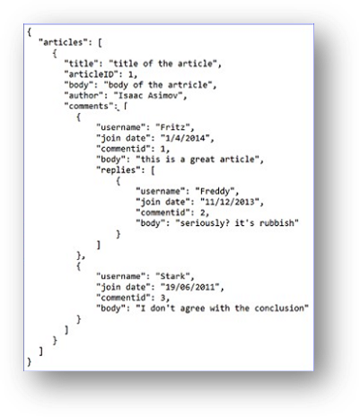
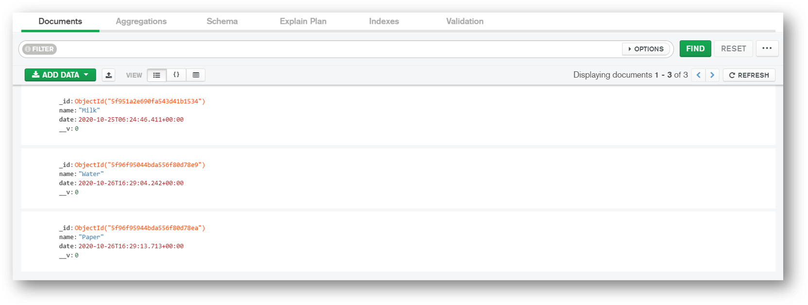

# Kiến thức cơ bản về MongoDB


## Mục lục

*   [Các lệnh MongoDB](mongodb-commands.md)
*   [Thực hành lập trình MongoDB](mongodb-code.md)

<br/>

# 1. Các loại cơ sở dữ liệu NoSQL khác nhau là gì?

NoSQL là một Hệ quản trị cơ sở dữ liệu (DBMS) phi quan hệ, không yêu cầu lược đồ (schema) cố định, tránh các phép nối (join) và dễ dàng mở rộng quy mô. Mục đích của việc sử dụng cơ sở dữ liệu NoSQL là cho các kho lưu trữ dữ liệu phân tán với nhu cầu lưu trữ dữ liệu khổng lồ. NoSQL được sử dụng cho Dữ liệu lớn (Big data) và các ứng dụng web thời gian thực.
**Các loại Cơ sở dữ liệu NoSQL:**

*   Cơ sở dữ liệu tài liệu (Document databases)
*   Kho lưu trữ khóa-giá trị (Key-value stores)
*   Cơ sở dữ liệu hướng cột (Column-oriented databases)
*   Cơ sở dữ liệu đồ thị (Graph databases)

**1. Cơ sở dữ liệu tài liệu:**

Cơ sở dữ liệu tài liệu lưu trữ dữ liệu trong các tài liệu (document) JSON, BSON hoặc XML. Trong cơ sở dữ liệu tài liệu, các tài liệu có thể được lồng vào nhau. Các phần tử cụ thể có thể được đánh chỉ mục (index) để truy vấn nhanh hơn.

Các tài liệu có thể được lưu trữ và truy xuất dưới dạng gần gũi hơn nhiều với các đối tượng dữ liệu được sử dụng trong ứng dụng, điều đó có nghĩa là cần ít sự chuyển đổi hơn để sử dụng dữ liệu trong ứng dụng. Dữ liệu SQL thường phải được lắp ráp và tháo rời khi di chuyển qua lại giữa ứng dụng và bộ nhớ lưu trữ.

**Ví dụ:** Amazon SimpleDB, CouchDB, MongoDB, Riak, Lotus Notes là các hệ thống DBMS hướng tài liệu phổ biến.



**2. Kho lưu trữ khóa-giá trị:**

Dữ liệu được lưu trữ dưới dạng các cặp khóa/giá trị. Nó được thiết kế theo cách để xử lý nhiều dữ liệu và tải nặng. Cơ sở dữ liệu lưu trữ cặp khóa-giá trị lưu trữ dữ liệu dưới dạng bảng băm (hash table), trong đó mỗi khóa là duy nhất và giá trị có thể là JSON, BLOB (Binary Large Objects - Đối tượng nhị phân lớn), chuỗi, v.v.

**Ví dụ:** các kho lưu trữ khóa-giá trị là Redis, Voldemort, Riak và DynamoDB của Amazon.


**3. Cơ sở dữ liệu hướng cột:**

Cơ sở dữ liệu hướng cột hoạt động trên các cột và dựa trên bài báo BigTable của Google. Mỗi cột được xử lý riêng biệt. Các giá trị của cơ sở dữ liệu một cột được lưu trữ liền kề nhau.

Chúng mang lại hiệu năng cao cho các truy vấn tổng hợp (aggregation queries) như SUM, COUNT, AVG, MIN, v.v. vì dữ liệu đã có sẵn trong một cột.

**Ví dụ:** Cơ sở dữ liệu NoSQL dựa trên cột được sử dụng rộng rãi để quản lý kho dữ liệu (data warehouses), kinh doanh thông minh (business intelligence), CRM, danh mục thẻ thư viện. HBase, Cassandra, Hypertable là các ví dụ về cơ sở dữ liệu dựa trên cột.


**4. Cơ sở dữ liệu đồ thị:**

Cơ sở dữ liệu kiểu đồ thị lưu trữ các thực thể (entities) cũng như các mối quan hệ (relations) giữa các thực thể đó. Thực thể được lưu trữ dưới dạng một nút (node) với mối quan hệ là các cạnh (edges). Một cạnh thể hiện mối quan hệ giữa các nút. Mỗi nút và cạnh có một định danh duy nhất.

So với cơ sở dữ liệu quan hệ nơi các bảng được kết nối lỏng lẻo, cơ sở dữ liệu đồ thị có bản chất đa quan hệ (multi-relational). Việc duyệt qua các mối quan hệ rất nhanh vì chúng đã được ghi lại trong DB và không cần phải tính toán chúng.

Cơ sở dữ liệu dựa trên đồ thị chủ yếu được sử dụng cho mạng xã hội, hậu cần (logistics), dữ liệu không gian (spatial data).

**Ví dụ:** Neo4J, Infinite Graph, OrientDB, FlockDB là một số cơ sở dữ liệu dựa trên đồ thị phổ biến.


<div align="right">
    <b><a href="#">↥ trở về đầu trang</a></b>
</div>

# 2 MongoDB là gì?

**MongoDB** là một cơ sở dữ liệu NoSQL hướng tài liệu (document-oriented) được sử dụng để lưu trữ dữ liệu khối lượng lớn. Thay vì sử dụng bảng (table) và hàng (row) như trong các cơ sở dữ liệu quan hệ truyền thống, MongoDB sử dụng các collection (bộ sưu tập) và document (tài liệu). Document bao gồm các cặp khóa-giá trị (key-value pairs) là đơn vị dữ liệu cơ bản trong MongoDB. Collection chứa các tập hợp document và có chức năng tương đương với các bảng trong cơ sở dữ liệu quan hệ.

**Các tính năng chính:**

*   Cơ sở dữ liệu Hướng tài liệu và NoSQL.
*   Hỗ trợ Tổng hợp (Aggregation).
*   Sử dụng định dạng BSON.
*   Sharding (Phân mảnh - Giúp mở rộng theo chiều ngang).
*   Hỗ trợ Truy vấn Đặc biệt (Ad Hoc Queries).
*   Phi Lược đồ (Schema Less).
*   Collection Giới hạn Dung lượng (Capped Collection).
*   Đánh chỉ mục (Indexing - Bất kỳ trường nào trong MongoDB đều có thể được đánh chỉ mục).
*   MongoDB Replica Set (Tập bản sao - Cung cấp tính sẵn sàng cao).
*   Hỗ trợ nhiều Storage Engine (Công cụ lưu trữ).
**Các thành phần chính:**

**1. _id**: Trường `_id` đại diện cho một giá trị duy nhất trong document MongoDB. Trường `_id` giống như khóa chính (primary key) của document. Nếu bạn tạo một document mới mà không có trường `_id`, MongoDB sẽ tự động tạo trường này.

**2. Collection**: Đây là một nhóm các document MongoDB. Một collection tương đương với một bảng được tạo trong bất kỳ Hệ quản trị CSDL quan hệ (RDMS) nào khác như Oracle.

**3. Cursor**: Đây là một con trỏ (pointer) đến tập kết quả (result set) của một truy vấn. Các client có thể lặp qua (iterate) một cursor để truy xuất kết quả.

**4. Database**: Đây là một nơi chứa (container) các collection, giống như trong RDMS nơi nó là nơi chứa các bảng. Mỗi cơ sở dữ liệu có tập tin riêng trên hệ thống tệp. Một máy chủ MongoDB có thể lưu trữ nhiều cơ sở dữ liệu.

**5. Document**: Một bản ghi trong collection MongoDB về cơ bản được gọi là document. Document, đến lượt nó, sẽ bao gồm tên trường và giá trị.

**6. Field**: Một cặp tên-giá trị trong một document. Một document có không hoặc nhiều trường. Các trường tương tự (analogous) như các cột trong cơ sở dữ liệu quan hệ.

**Ví dụ:**

Kết nối MongoDB Cloud bằng MongoDB Compass



**[[Đọc thêm](https://docs.mongodb.com/guides/)]**

<div align="right">
    <b><a href="#">↥ trở về đầu trang</a></b>
</div>

# 3 Chỉ mục (Index) trong MongoDB là gì?

Chỉ mục hỗ trợ việc thực thi truy vấn hiệu quả trong MongoDB. Nếu không có chỉ mục, MongoDB phải thực hiện quét toàn bộ collection (collection scan), tức là quét mọi document trong một collection, để chọn những document khớp với câu lệnh truy vấn. Nếu tồn tại một chỉ mục phù hợp cho một truy vấn, MongoDB có thể sử dụng chỉ mục đó để giới hạn số lượng document mà nó phải kiểm tra (inspect).

Chỉ mục là các cấu trúc dữ liệu đặc biệt lưu trữ một phần nhỏ dữ liệu của collection dưới dạng dễ duyệt qua (traverse). Chỉ mục lưu trữ giá trị của một trường hoặc tập hợp các trường cụ thể, được sắp xếp theo giá trị của trường đó. Thứ tự của các mục nhập chỉ mục hỗ trợ các phép so khớp bằng (equality matches) và các hoạt động truy vấn dựa trên phạm vi (range-based query operations) hiệu quả. Ngoài ra, MongoDB có thể trả về kết quả đã được sắp xếp (sorted results) bằng cách sử dụng thứ tự trong chỉ mục.

**Ví dụ:**

Phương thức `createIndex()` chỉ tạo một chỉ mục nếu một chỉ mục có cùng đặc tả chưa tồn tại. Ví dụ sau (sử dụng Node.js) tạo một chỉ mục đơn khóa (single key) giảm dần trên trường `name`:

```js
collection.createIndex( { name : -1 }, function(err, result) {
   console.log(result);
   callback(result);
}
```
<div align="right">
<b><a href="#">↥ trở về đầu trang</a></b>
</div>

## Các loại Chỉ mục có sẵn trong MongoDB là gì?
MongoDB hỗ trợ các loại chỉ mục sau để chạy truy vấn.
1. Chỉ mục Trường Đơn (Single Field Index):
MongoDB hỗ trợ các chỉ mục do người dùng định nghĩa như chỉ mục trường đơn. Chỉ mục trường đơn được sử dụng để tạo chỉ mục trên một trường duy nhất của một document. Với chỉ mục trường đơn, MongoDB có thể duyệt theo thứ tự tăng dần (ascending) và giảm dần (descending). Theo mặc định, mỗi collection có một chỉ mục trường đơn được tự động tạo trên trường _id, là khóa chính (primary key).

**Example:**

```js
{
  "_id": 1,
  "person": { name: "Alex", surname: "K" },
  "age": 29,
  "city": "New York"
}
```
Chúng ta có thể định nghĩa một chỉ mục trường đơn trên trường age.
```js
db.people.createIndex( {age : 1} ) // creates an ascending index

db.people.createIndex( {age : -1} ) // creates a descending index
```
Với loại chỉ mục này, chúng ta có thể cải thiện tất cả các truy vấn tìm document có điều kiện trên trường age, như sau:

```js
db.people.find( { age : 20 } )
db.people.find( { name : "Alex", age : 30 } )
db.people.find( { age : { $gt : 25} } )
```

**2. Chỉ mục Hợp chất (Compound Index)::**

Chỉ mục hợp chất là chỉ mục trên nhiều trường. Sử dụng cùng collection people, chúng ta có thể tạo một chỉ mục hợp chất kết hợp trường city và age.
```js
db.people.createIndex( {city: 1, age: 1, person.surname: 1  } )
```
Trong trường hợp này, chúng ta đã tạo một chỉ mục hợp chất trong đó mục nhập đầu tiên là giá trị của trường city, thứ hai là giá trị của trường age, và thứ ba là person.surname. Tất cả các trường ở đây được định nghĩa theo thứ tự tăng dần.

Các truy vấn như sau có thể hưởng lợi từ chỉ mục:

```js
db.people.find( { city: "Miami", age: { $gt: 50 } } )
db.people.find( { city: "Boston" } )
db.people.find( { city: "Atlanta", age: {$lt: 25}, "person.surname": "Green" } )
```
**3.Chỉ mục Đa khóa (Multikey Index) :**

Đây là loại chỉ mục dành cho mảng (arrays). Khi tạo chỉ mục trên một mảng, MongoDB sẽ tạo một mục nhập chỉ mục (index entry) cho mọi phần tử (element).


**Example:**

```js
{
   "_id": 1,
   "person": { name: "John", surname: "Brown" },
   "age": 34,
   "city": "New York",
   "hobbies": [ "music", "gardening", "skiing" ]
 }
```
Chỉ mục đa khóa có thể được tạo như sau:
```js
db.people.createIndex( { hobbies: 1} )
```
**4. Chỉ mục Không gian địa lý (Geospatial Index):**

Chỉ mục địa lý (GeoIndex) là một loại chỉ mục đặc biệt cho phép tìm kiếm dựa trên vị trí (location), khoảng cách từ một điểm (distance from a point) và nhiều tính năng khác nhau. Để truy vấn dữ liệu không gian địa lý, MongoDB hỗ trợ hai loại chỉ mục – chỉ mục 2d và chỉ mục 2dsphere. Chỉ mục 2d sử dụng hình học phẳng (planar geometry) khi trả về kết quả và chỉ mục 2dsphere sử dụng hình học cầu (spherical geometry) để trả về kết quả.

**5. Chỉ mục Văn bản (Text Index):**


Đây là một loại chỉ mục khác được MongoDB hỗ trợ. Chỉ mục văn bản hỗ trợ tìm kiếm nội dung chuỗi (string content) trong một collection. Các loại chỉ mục này không lưu trữ các từ dừng cụ thể theo ngôn ngữ (language-specific stop words) (ví dụ: "the", "a", "or"). Chỉ mục văn bản giới hạn các từ trong một collection để chỉ lưu trữ các từ gốc (root words).

**Example:**

Hãy chèn một số document mẫu.

```js
var entries = db.people("blogs").entries;
entries.insert( {
  title : "my blog post",
  text : "i am writing a blog. yay",
  site: "home",
  language: "english" });
entries.insert( {
  title : "my 2nd post",
  text : "this is a new blog i am typing. yay",
  site: "work",
  language: "english" });
entries.insert( {
  title : "knives are Fun",
  text : "this is a new blog i am writing. yay",
  site: "home",
  language: "english" });
```
Hãy định nghĩa và tạo chỉ mục văn bản.
```js
var entries = db.people("blogs").entries;
entries.ensureIndex({title: "text", text: "text"}, { weights: {
    title: 10,
    text: 5
  },
  name: "TextIndex",
  default_language: "english",
  language_override: "language" });
```
Các truy vấn như các ví dụ tiếp theo này sẽ sử dụng chỉ mục:
```js
var entries = db.people("blogs").entries;
entries.find({$text: {$search: "blog"}, site: "home"})
```
**6. Chỉ mục Băm (Hashed Index):**

Chỉ mục Băm (Hashed Index):
MongoDB hỗ trợ phân mảnh dựa trên băm (hash-based sharding) và cung cấp các chỉ mục băm. Các chỉ mục này là giá trị băm (hash) của giá trị trường. Các Shard sử dụng chỉ mục băm và tạo ra một giá trị băm theo giá trị trường để phân tán (spread) các lượt ghi trên các instance được phân mảnh (sharded instances).
<div align="right">
<b><a href="#">↥ trở về đầu trang</a></b>
</div>

# 4 Giải thích các thuộc tính Chỉ mục trong MongoDB?
**1. Chỉ mục TTL (TTL Indexes):**

TTL (Time To Live - Thời gian tồn tại) là một tùy chọn đặc biệt mà chúng ta chỉ có thể áp dụng cho chỉ mục trường đơn để cho phép xóa tự động (automatic deletion) các document sau một thời gian nhất định.
Trong quá trình tạo chỉ mục, chúng ta có thể định nghĩa thời gian hết hạn (expiration time). Sau thời gian đó, tất cả các document cũ hơn thời gian hết hạn sẽ bị xóa khỏi collection. Loại tính năng này rất hữu ích khi chúng ta xử lý dữ liệu không cần tồn tại lâu dài (persist) trong cơ sở dữ liệu 

**Example:**

```js
db.sessionlog.createIndex( { "lastUpdateTime": 1 }, { expireAfterSeconds: 1800 } )
```

Trong trường hợp này, MongoDB sẽ tự động xóa các document khỏi collection sau nửa giờ (1800 giây) kể từ giá trị trong trường lastUpdateTime.

**Hạn chế (Restrictions):**

Chỉ các chỉ mục trường đơn mới có thể có tùy chọn TTL
Chỉ mục trường đơn _id không thể hỗ trợ tùy chọn TTL
Trường được đánh chỉ mục phải là kiểu ngày (date type)
Một collection giới hạn dung lượng (capped collection) không thể có chỉ mục TTL

**2.Chỉ mục Một phần (Partial indexes):**

Chỉ mục một phần là một chỉ mục chỉ chứa một tập hợp con (subset) các giá trị dựa trên một quy tắc lọc (filter rule). Chúng hữu ích trong các trường hợp:
Kích thước chỉ mục (index size) có thể được giảm bớt
Chúng ta muốn đánh chỉ mục các giá trị liên quan (relevant) và được sử dụng nhiều nhất trong các điều kiện truy vấn (query conditions)
Chúng ta muốn đánh chỉ mục các giá trị có tính chọn lọc cao nhất (most selective values) của một trường

**Example:**

```js
db.people.createIndex(
   { "city": 1, "person.surname": 1 },
   { partialFilterExpression: { age : { $lt: 30 } } }
)
```


Chúng ta đã tạo một chỉ mục hợp chất trên city và person.surname nhưng chỉ cho các document có age nhỏ hơn 30.
Để chỉ mục một phần được sử dụng, các truy vấn phải chứa một điều kiện trên trường age.

```js
db.people.find( { city: "New Tork", age: { $eq: 20} } )
```


**3. Chỉ mục Thưa (Sparse indexes):**

Chỉ mục thưa là một tập hợp con của chỉ mục một phần. Chỉ mục thưa chỉ chứa các phần tử cho các document có trường được đánh chỉ mục, ngay cả khi nó là null.
Vì MongoDB là một cơ sở dữ liệu phi lược đồ (schemaless), các document trong một collection có thể có các trường khác nhau, do đó một trường được đánh chỉ mục có thể không có mặt trong một số document.

**Example:**

Để tạo một chỉ mục như vậy, sử dụng tùy chọn sparse:

```js
db.people.createIndex( { city: 1 }, { sparse: true } )
```

Trong trường hợp này, chúng ta giả định có thể có các document trong collection bị thiếu (missing) trường city. Chỉ mục thưa dựa trên sự tồn tại (existence) của một trường trong các document và hữu ích để giảm kích thước của chỉ mục.

**4. Chỉ mục Duy nhất (Unique indexes):**

MongoDB có thể tạo một chỉ mục là duy nhất. Một chỉ mục được định nghĩa theo cách này không thể chứa các mục nhập trùng lặp (duplicate entries).

Ví dụ:
```js
db.people.createIndex( { city: 1 }, { unique: true } )
```

Tính duy nhất cũng có thể được định nghĩa cho các chỉ mục hợp chất.
```js
db.people.createIndex( { city: 1, person.surname: 1}, { unique: true } )
Use code with caution.
```

Theo mặc định, chỉ mục trên _id được tự động tạo là duy nhất.
<div align="right">
<b><a href="#">↥ trở về đầu trang</a></b>
</div>

# 5 MongoDB tạo bao nhiêu chỉ mục theo mặc định cho một collection mới

Theo mặc định, MongoDB tạo một chỉ mục duy nhất (unique index) trên trường _id trong quá trình tạo một collection. Chỉ mục _id ngăn chặn (prevents) client chèn hai document có cùng giá trị cho trường _id.

<div align="right">
<b><a href="#">↥ trở về đầu trang</a></b>
</div>

## 6. Có thể tạo chỉ mục trên trường mảng trong MongoDB không?
Có, Để đánh chỉ mục một trường chứa giá trị mảng (array value), MongoDB tạo một khóa chỉ mục (index key) cho mỗi phần tử trong mảng. Chỉ mục đa khóa (Multikey indexes) có thể được xây dựng trên các mảng chứa cả giá trị vô hướng (scalar values) (ví dụ: chuỗi, số) và các document lồng nhau (nested documents). MongoDB tự động tạo chỉ mục đa khóa nếu bất kỳ trường nào được đánh chỉ mục là một mảng.

**Syntax:**

```js
db.collection.createIndex( { <field>: < 1 or -1 > } )
```
Ví dụ, xem xét một collection inventory chứa các document sau:
```js
{ _id: 10, type: "food", item: "aaa", ratings: [ 5, 8, 9 ] }
{ _id: 11, type: "food", item: "bbb", ratings: [ 5, 9 ] }
{ _id: 12, type: "food", item: "ccc", ratings: [ 9, 5, 8, 4, 7 ] }
```
Collection có một chỉ mục đa khóa trên trường ratings:
```js
db.inventory.createIndex( { ratings: 1 } )
```
Truy vấn sau tìm kiếm các document nơi trường ratings là mảng [ 5, 9 ]:

```js
db.inventory.find( { ratings: [ 5, 9 ] } )
```
MongoDB có thể sử dụng chỉ mục đa khóa để tìm các document có số 5 ở bất kỳ vị trí nào (at any position) trong mảng ratings. Sau đó, MongoDB truy xuất các document này và lọc (filters) các document có mảng ratings bằng với mảng truy vấn [ 5, 9 ].
<div align="right">
<b><a href="#">↥ trở về đầu trang</a></b>
</div>