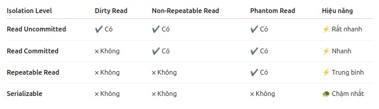
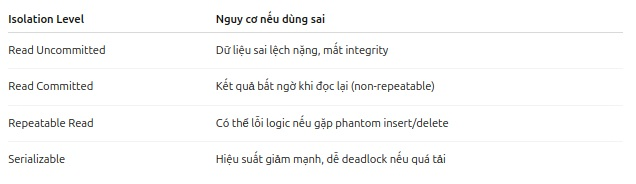

#  1 So Sánh Các Mức Isolation trong Giao Dịch Database

Khi làm việc với giao dịch trong cơ sở dữ liệu, **Isolation Level** xác định mức độ mà các giao dịch có thể nhìn thấy sự thay đổi của nhau. Dưới đây là sự so sánh giữa các mức độ isolation phổ biến, cùng với ứng dụng thực tế và hậu quả khi chọn sai mức độ.

---

## Các Mức Isolation trong Giao Dịch

### 1. **Read Uncommitted**

- **Định nghĩa**: Mọi thứ đều được đọc, kể cả dữ liệu chưa commit (chưa xác nhận).
- **Hậu quả**:
  - **Dirty Read**: Bạn có thể đọc được dữ liệu mà giao dịch khác chưa commit, và nếu giao dịch đó rollback, dữ liệu bạn đã đọc là sai.
- **Ứng dụng**: 
  - **Hiếm khi dùng**. Thường chỉ dùng cho các thống kê không quan trọng hoặc các tình huống không cần tính chính xác cao.
  - **Rất nhanh**, nhưng rất nguy hiểm vì dữ liệu dễ bị sai lệch.
  
---

### 2. **Read Committed** (Mặc định trong SQL Server, PostgreSQL)

- **Định nghĩa**: Chỉ đọc được dữ liệu đã commit.
- **Hậu quả**:
  - **Non-Repeatable Read**: Nếu bạn đọc cùng một bản ghi hai lần trong cùng một giao dịch, dữ liệu có thể thay đổi bởi giao dịch khác.
- **Ứng dụng**: 
  - **Phổ biến nhất** trong các hệ thống OLTP (giao dịch nhanh).
  - Thường được sử dụng trong các tình huống giao dịch cơ bản mà không yêu cầu mức độ cô lập cao.
  
---

### 3. **Repeatable Read** (Mặc định trong MySQL InnoDB)

- **Định nghĩa**: Đảm bảo rằng mỗi lần đọc cùng một bản ghi, dữ liệu sẽ không bị thay đổi (dữ liệu là ổn định).
- **Hậu quả**:
  - **Phantom Read**: Có thể gặp phải hiện tượng khi bạn query cùng điều kiện nhưng số lượng bản ghi khác nhau, vì giao dịch khác đã thêm/xóa bản ghi.
- **Ứng dụng**: 
  - Dành cho các nghiệp vụ cần đảm bảo tính ổn định của dữ liệu trong suốt quá trình giao dịch.
  - Ví dụ: hệ thống quản lý kho, tài chính.

---

### 4. **Serializable**

- **Định nghĩa**: Giao dịch phải hoạt động như thể chúng chạy tuần tự (một giao dịch hoàn thành xong mới đến giao dịch tiếp theo).
- **Hậu quả**: 
  - **Không có Dirty Read, Non-Repeatable Read, Phantom Read**.
  - Chậm nhất vì phải **lock** nhiều tài nguyên.
- **Ứng dụng**:
  - **Cần độ chính xác tuyệt đối** như trong các hệ thống ngân hàng, kiểm toán, và các ứng dụng yêu cầu tính toàn vẹn dữ liệu cao.

---

## Các Loại Lỗi trong Giao Dịch

- **Dirty Read**: Đọc dữ liệu chưa commit từ một giao dịch khác. Nếu giao dịch đó rollback, dữ liệu bạn đã đọc là sai.
- **Non-Repeatable Read**: Khi bạn đọc lại cùng một bản ghi trong cùng một giao dịch nhưng giá trị dữ liệu đã thay đổi do giao dịch khác commit.
- **Phantom Read**: Khi bạn thực hiện query hai lần cùng điều kiện, nhưng số lượng bản ghi trả về khác nhau vì giao dịch khác đã thay đổi (thêm/xóa) dữ liệu.

---

## Hậu Quả Khi Chọn Sai Isolation Level

- **Chọn sai mức độ isolation** có thể dẫn đến các lỗi nghiêm trọng trong ứng dụng như:
  - **Dữ liệu không chính xác**: Ví dụ, bạn có thể đọc dữ liệu sai hoặc không đồng bộ trong các giao dịch.
  - **Hiệu năng bị ảnh hưởng**: Một số mức độ isolation như `Serializable` có thể gây tắc nghẽn tài nguyên và giảm hiệu suất hệ thống.
  - **Khả năng cạnh tranh dữ liệu (Data Conflicts)**: Lỗi khi nhiều giao dịch cùng thao tác trên dữ liệu mà không có sự kiểm soát chính xác.

---

## Kết luận

- **Read Uncommitted**: Thường không được sử dụng trong các ứng dụng thực tế vì nguy cơ dữ liệu sai rất cao.
- **Read Committed**: Dùng cho các hệ thống OLTP nhanh, nhưng có thể gặp phải non-repeatable read.
- **Repeatable Read**: Phù hợp với các nghiệp vụ yêu cầu tính ổn định giữa các lần đọc, nhưng vẫn có thể gặp phải phantom read.
- **Serializable**: Dùng cho các tình huống cần độ chính xác tuyệt đối, nhưng có thể làm chậm hệ thống.

Lựa chọn mức độ isolation phù hợp là rất quan trọng để đảm bảo cả hiệu năng và tính chính xác của hệ thống.
