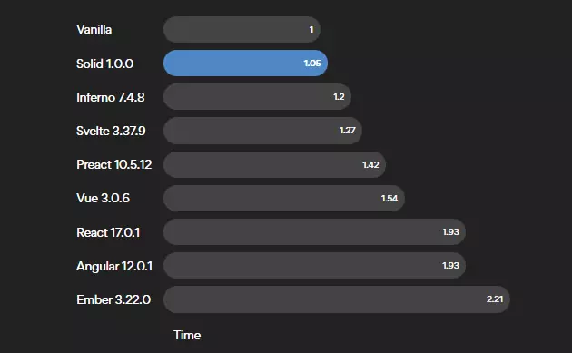
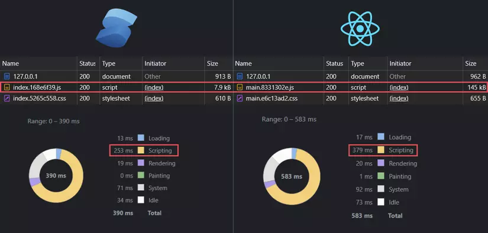
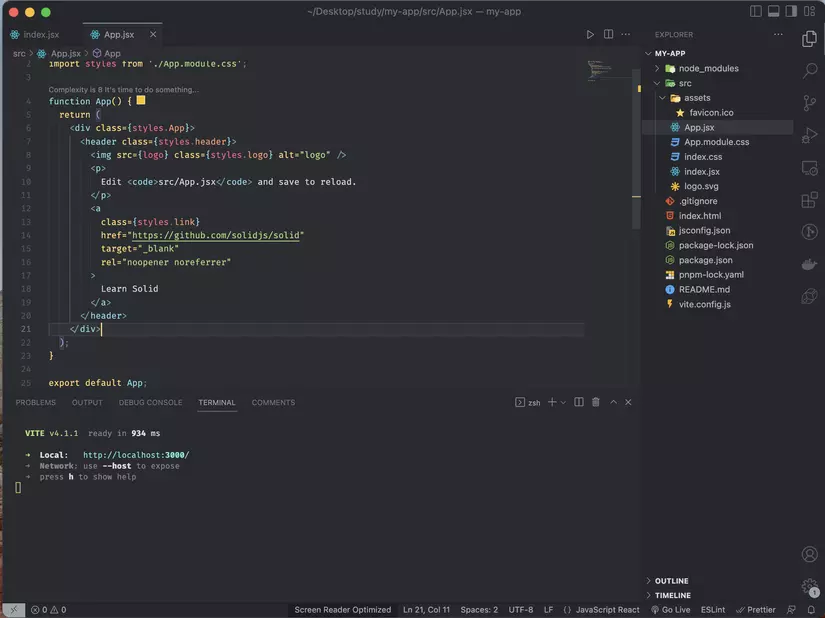
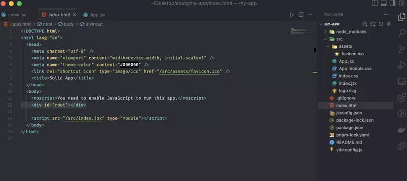

# 1  Tìm Hiểu Cơ Bản về SolidJS và Ứng Dụng

Chào các bạn, trong series này chúng ta sẽ bắt tay cùng tìm hiểu cơ bản về SolidJS và các tính năng của công nghệ này.
Sau đó chúng ta sẽ tìm hiểu về tính ứng dụng của SolidJS thông qua một vài ví dụ cơ bản nhé.

*Nhân dịp đầu năm mới Quý Mão – 2023 mình chúc tất cả các bạn đang xem bài viết này có thật nhiều sức khỏe và luôn giữ cho mình một tinh thần đam mê học hỏi và nhiệt huyết với công nghệ nhé 🎉*

## Giới thiệu

Nếu bạn là một nhà phát triển Web muốn tìm kiếm một công cụ mạnh mẽ để xây dựng các ứng dụng Web, hoặc đơn giản bạn chỉ muốn tìm hiểu về các công nghệ mới nhất hiện nay, chúng ta hãy cùng khám phá SolidJS ngay hôm nay!

Đây là một Javascript UI Library mới rất linh hoạt và mạnh mẽ, được thiết kế để giúp các lập trình viên Front-End tạo ra những ứng dụng Web tốc độ cao ⚡️ và dễ dàng quản lý. Chúng ta sẽ tìm hiểu về tính năng, ưu điểm và lợi ích của công nghệ này, và tìm hiểu làm thế nào bạn có thể sử dụng nó để xây dựng những ứng dụng Web thật tuyệt vời!

## SOLID + JS = SOLIDJS 🤔

Không biết các bạn có giống như mình khi lần đầu tiên nhìn vào cái tên SolidJS thì đều liên tưởng ngay đến nguyên tắc SOLID không nhỉ?

Theo như chia sẻ từ tác giả (Ryan Carniato – US) vào buổi sáng ban mai ngày sinh nhật của tác giả, khi anh ấy thức dậy thì bỗng nhiên anh cảm nhận được một vầng hào quang và mặt trời chân lý chiếu qua tim mách bảo rằng:

*Này Ryan, hãy theo đuổi và tạo ra một Javascript UI Library thật nhanh, thật mạnh nhưng vẫn rất linh hoạt để thỏa mãn đam mê trong cậu giống như Elon Musk đã từng tạo ra chiếc Tesla Model 3 gây sốt toàn cầu ấy………….. và thế là SolidJS ra đời.* Có lẽ vì cái tên SOLID cũng đã thể hiện phần nào sự tập trung của tác giả khi muốn tạo ra 1 công nghệ có các tính chất chắc chắn, mạnh mẽ và cũng rất linh hoạt (như viên sỏi chẳng hạn)
*(P/S: câu chuyện trên mình có thêm ít mắm ít muối vào nhé 🤪)*

Dự án của anh đã open source từ tháng 4 năm 2018 (ý tưởng được ấp ủ và phát triển từ 2016) và đã release phiên bản stable lần đầu vào 29/04/2021.

Đến nay SolidJS đã release stable v1.6 và đang được tài trở bởi nhiều tên tuổi lớn trong làng công nghệ như: Vercel, CloudFlare, JetBrains, Netlify…

## Tính năng chung

Cùng mình điểm danh những tính năng cơ bản của SolidJS nhé, Let’s go:

*   Là 1 thư viện Javascript tạo nên giao diện người dùng, SolidJS trực tiếp cập nhật thay đổi UI trên **native DOM** (không dùng Virtual DOM như một vài Javascript UI Library/ Framework khác).
*   Cung cấp **cơ chế Reactive** chịu trách nhiệm cho việc theo dõi và tự động cập nhật thay đổi UI khi State hoặc Props thay đổi.
*   **Reactivity Primitives** gồm 3 thành phần cốt lõi là **Signal, Memo và Effect** (mình sẽ đi sâu vào các khái niệm này ở tập sau của series nhé ^^).
*   Áp dụng **mô hình Component Based** tạo nên các UI có khả năng tái sử dụng vô cùng linh hoạt với độ trễ thấp.
*   SolidJS sử dụng **JSX**: JavaScript XML là một cú pháp mở rộng cho phép lập trình viên viết HTML trong SolidJS dễ dàng (giống như ReactJS).
*   Hỗ trợ và cung cấp các **Lifecycle Methods** giúp anh em dev dễ dàng handle được các case xử lý data, logic, UI trong quá trình code.
*   **Custom Hook**: các bạn có thể tự tạo ra một hook mới với chức năng riêng biệt của nó. Việc này giúp tách phần code logic ra khỏi UI giúp code tường minh, dễ quản lý hơn, tránh lặp lại code và tái sử dụng.
*   Hỗ trợ **Typescript**, điều này cho phép các lập trình viên dễ dàng lựa chọn giữa Javascript thuần hoặc Typescript tùy thuộc vào dự án và yêu cầu.
*   Hỗ trợ **SSR (Server Side Rendering)** cho phép tải trang nhanh hơn và tăng tốc độ tải trang…
*   **Small size**: SolidJS có kích thước nhỏ, giúp tải trang nhanh và giảm thiểu tốn kém về tài nguyên.
*   **Easy to learn**: SolidJS vô cùng dễ tiếp cận và nếu như bạn đã có kinh nghiệm với ReactJS thì mình tin rằng việc tiếp cận với SolidJS sẽ vô cùng đơn giản 🤩.

## Tại sao mình lại chọn SolidJS thay vì…..

Điều khiến mình thích thú khi sử dụng SolidJS thay vì sử dụng ReactJS, VueJS, Svelte hay Angular đơn giản vì đây là 1 công nghệ mới 😆

Nói chứ ngoài việc là công nghệ mới ra thì SolidJS đem đến cho mình trải nghiệm rất tốt khi sử dụng lần đầu vì học và tiếp cận công nghệ này cực kì nhanh và dễ dàng.

Kể cả bạn có là newbie khi mới tiếp cận các Library/Framework Front-End thì mình cam đoan rằng bạn chỉ cần có kiến thức nền tảng về HTML/CSS và Javascript là đã có thể dễ dàng học SolidJS.
*(Mình sẽ có thêm bài viết chia sẻ kỹ hơn cho các bạn mới bước chân vào ngành Front-End và chưa biết nên chọn học công nghệ nào hay phải học như thế nào nhé ^^)*

Bên cạnh đấy SolidJS cũng được cung cấp đầy đủ các thư viện để hỗ trợ về Routing, Store Management hay Component UI Library và các function hỗ trợ từ chính SolidJS cung cấp khá đầy đủ không thua kém gì nhiều so với các ông lớn như ReactJS hay VueJS…

Điều khiến mình hứng thú tiếp theo trong quá trình tìm tòi, học hỏi SolidJS là về **Performance cực kỳ bá đạo** mà SolidJS mang lại.

Theo bạn đâu là UI Library/Framework nhanh nhất? Vue, React, Inferno, Svelte, lit-html… Có rất nhiều thư viện đã được đề xuất và mỗi loại đều có điểm số Benchmarks tốt của riêng nó.

Với cá nhân mình thì mình tin tưởng và dựa vào tiêu chuẩn đánh giá từ **JS Frameworks Benchmark**.
Link so sánh Performance UI Library/ Framework theo phiên bản Chrome 109 – OSX mới nhất: [JS Framework Benchmark](https://krausest.github.io/js-framework-benchmark/current.html) (Lưu ý: Link gốc trong bài viết của bạn có thể đã cũ, mình đã cập nhật link tới phiên bản "current" để có dữ liệu mới nhất).



Mình sẽ so sánh cụ thể trường hợp về scripting performance và bundle size giữa SolidJS vs ReactJS (công nghệ đang được đông đảo công ty và lập trình viên sử dụng nhé).
*Bạn có thể tham khảo thêm so sánh chi tiết tại các bài viết như: [SolidJS vs React - Webtips](https://www.webtips.dev/solidjs-vs-react) hoặc trực tiếp trên bảng benchmark.*



## Đã có ưu thì phải có…. nhược điểm 👀

*   **Cộng đồng nhỏ** và chưa nhiều sự kết nối với nhau chắc chắn là một nhược điểm của SolidJS ở thời điểm hiện tại.
*   Các **thư viện hỗ trợ** đi kèm đều có sẵn và sử dụng được nhưng **chưa có sự đa dạng** giúp người dùng có sự lựa chọn và so sánh trong quá trình sử dụng.
*   Tất nhiên với mỗi công nghệ mới đa phần đều mang lại ít nhiều cho người dùng lo ngại về rủi ro, các vấn đề như bug hay rò rỉ thông tin bla bla bla… điều này là không thể tránh khỏi 🔥.
*   Ở **Việt Nam** thì SolidJS vẫn thực sự còn **rất mới mẻ** với đại đa số lập trình viên ^^.

---

Hy vọng bài viết này sẽ là điểm khởi đầu tốt cho hành trình khám phá SolidJS của các bạn!


1.  🖥️ Khởi tạo project SolidJS (sử dụng Vite)
2.  🎬 Vọc vạch về JSX – Javascript XML trong SolidJS
3.  🚛 Cách hoạt động cơ bản của ứng dụng SolidJS

---

## 🖥️ Khởi tạo project SolidJS (sử dụng Vite)

Trong phần này, mình sẽ hướng dẫn các bạn tạo một project SolidJS sử dụng Vite với JavaScript thuần.

📝 **Note:** Vite là một Frontend Build Tool giúp thực hiện việc khởi tạo và setup các project FE nhanh chóng và dễ dàng ⚡️ (Vite được tạo ra bởi cha đẻ của VueJS – Evan You).

Các template chính thức của SolidJS có thể tìm thấy tại: [https://github.com/solidjs/templates](https://github.com/solidjs/templates)

### Các bước thực hiện:

1.  **Tạo mới ứng dụng từ Solid template (JavaScript):**
    ```bash
    npx degit solidjs/templates/js my-app
    ```
    *Nếu bạn muốn bắt đầu tạo project với TypeScript, hãy thay đổi câu lệnh thành:*
    ```bash
    npx degit solidjs/templates/ts my-app
    ```

2.  **Di chuyển đến thư mục ứng dụng đã tạo:**
    ```bash
    cd my-app
    ```

3.  **Cài đặt các thành phần cần thiết để start ứng dụng:**
    ```bash
    npm i # hoặc yarn install hoặc pnpm install
    ```

4.  **Chạy ứng dụng trên môi trường dev:**
    ```bash
    npm run dev
    ```

Sau khi chạy lệnh `npm run dev` thành công, bạn có thể truy cập vào đường dẫn `http://localhost:3000/` để xem kết quả.

*(Bạn có thể chèn hình ảnh kết quả chạy thành công ở đây nếu muốn)*

### Cấu trúc thư mục:

Nếu bạn đã từng học qua ReactJS và có biết đến câu thần chú `create-react-app` thì sẽ thấy cấu trúc source code, syntax của SolidJS quen thuộc đúng không nào?

Đúng vậy bạn không nhầm đâu, cả ReactJS lẫn SolidJS đều khá giống nhau đấy kkk 😂



## 🎬 Vọc vạch về JSX – Javascript XML trong SolidJS

Hãy cùng mình xem 1 ví dụ bên dưới nhé:

```javascript
import { render } from "solid-js/web";

const HelloEveryone = () => {
  return <div>Hello everyone, my name is Pate Kem.</div>;
};

render(() => <HelloEveryone />, document.getElementById("root"));
```

Trong ví dụ trên, bạn hãy chú ý đến hàm `HelloEveryone`. Nó trực tiếp trả về một thẻ `<div>Hello everyone, my name is Pate Kem.</div>`.

Mỗi ứng dụng SolidJS sẽ bao gồm các chức năng được gọi là **thành phần (Components)**.

Đó là sự kết hợp giữa HTML và JavaScript được gọi là **JSX (JavaScript XML)**. Solid sẽ vận chuyển chúng đi qua một trình biên dịch để biến các thẻ này thành các nút DOM (DOM nodes) thực sự hiển thị lên giao diện.

JSX cho phép bạn sử dụng hầu hết các phần tử HTML, và nó cũng cho phép bạn tạo ra các phần tử mới. Khi chúng ta đã khai báo hàm `HelloEveryone`, chúng ta có thể sử dụng nó làm thẻ `<HelloEveryone />` trong chính ứng dụng của mình (hay còn gọi là Component).

---

## 🚛 Cách hoạt động cơ bản của ứng dụng SolidJS

Mình sẽ dùng lại code mẫu ở trên để miêu tả cụ thể cách thức hoạt động đơn giản của nó nhé.

```javascript
import { render } from "solid-js/web";

const HelloEveryone = () => {
  return <div>Hello everyone, my name is Pate Kem.</div>;
};

render(() => <HelloEveryone />, document.getElementById("root"));
```

Ở đây chúng ta sẽ thấy được hàm `render` có cú pháp (syntax) tương tự như hàm `render` trong ReactJS 👀.

Đây là hàm chức năng chính của SolidJS để kết xuất (render) các Components, sau đó thể hiện chúng trên giao diện ứng dụng (DOM – Document Object Model).

Chúng ta cần cung cấp 2 đối số cho hàm `render`:

1.  **Một Component (hoặc một hàm trả về JSX) đóng gói mã ứng dụng:** Trong ví dụ này là `() => <HelloEveryone />`.
2.  **Một phần tử HTML hiện có trong DOM để gắn (mount) ứng dụng vào:** Trong ví dụ này là `document.getElementById("root")`.

```javascript
render(
  () => <HelloEveryone />, // đối số 1: Component cần render
  document.getElementById("root") // đối số 2: Element để mount vào
);
```

Các bạn hãy mở file `index.jsx` (hoặc `src/index.jsx`) và file `index.html` (trong thư mục `public` hoặc thư mục gốc tùy cấu hình Vite) trong source vừa tạo. Bạn sẽ thấy thẻ `<div id="root"></div>` trong `index.html`. Đó chính là nơi ứng dụng SolidJS của bạn sẽ được render ra.



### SolidJS biên dịch JSX như thế nào?

Dựa theo đoạn code trên, nó sẽ được SolidJS biên dịch thành các biểu thức DOM thực, trông nó sẽ giống như sau (đây là một ví dụ minh họa, mã thực tế có thể phức tạp hơn tùy vào các tối ưu của Solid):

```javascript
import { template, render, createComponent } from "solid-js/web";

// Solid tạo một template HTML
const _tmpl = template(`<div>Hello everyone, my name is Pate Kem.</div>`, 2);

const HelloEveryone = () => {
  // Component chỉ clone template này, không chạy lại toàn bộ hàm
  return _tmpl.cloneNode(true);
};

// Hàm render sử dụng createComponent để xử lý component và props
render(
  () => createComponent(HelloEveryone, {}), // Truyền component và props (nếu có)
  document.getElementById("root")
);
```

**Lưu ý:** Solid Playground ([https://playground.solidjs.com/](https://playground.solidjs.com/)) là một công cụ khá thú vị. Nó cho phép bạn thấy được SolidJS có nhiều cách khác nhau để render:
*   **CSR – Client Side Rendering:** Render phía client (mặc định).
*   **SSR – Server Side Rendering:** Render phía server.
*   **Client Side Rendering with Hydration:** Render phía server sau đó "hydrate" trên client.

---
*(Kết thúc tập này tại đây, hẹn gặp lại các bạn ở tập tiếp theo!)*
```

**Ghi chú:**

*   Mình đã cố gắng giữ nguyên giọng văn và các biểu tượng cảm xúc của bạn.
*   Đã thêm các khối code `bash` và `javascript` để dễ đọc hơn.
*   Đã làm rõ hơn một chút về vị trí của `index.html`.
*   Mã biên dịch ví dụ được đơn giản hóa để dễ hiểu, thực tế mã biên dịch của Solid có thể phức tạp và tối ưu hơn nhiều.
*   Đã thêm link tới Solid Playground.

Bạn có thể tùy chỉnh thêm các phần hình ảnh hoặc chi tiết hơn nếu muốn!