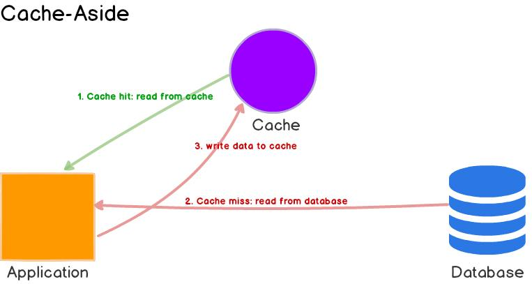
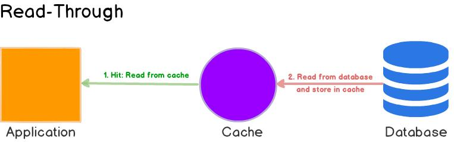

# 6 Chiến Lược Cache Để Tối Ưu Hóa Hiệu Suất Cơ Sở Dữ Liệu

## Giới thiệu

Trong phát triển phần mềm hiện đại, cơ sở dữ liệu (CSDL) thường trở thành điểm nghẽn (bottleneck) khi ứng dụng phải xử lý lượng truy cập lớn. Việc triển khai chiến lược bộ nhớ đệm (cache) hiệu quả là một phương pháp quan trọng để giảm tải cho CSDL, cải thiện đáng kể thời gian phản hồi của ứng dụng và nâng cao trải nghiệm người dùng.

Tài liệu này giới thiệu 6 chiến lược cache phổ biến, được chia thành hai nhóm chính: **Chiến lược đọc dữ liệu** và **Chiến lược ghi dữ liệu**.

---

## CHIẾN LƯỢC ĐỌC DỮ LIỆU

Các chiến lược này tập trung vào việc tối ưu hóa cách ứng dụng lấy dữ liệu từ cache hoặc CSDL.

### 1. Cache-Aside (Lazy Loading - Tải Lười)

Đây là chiến lược cache phổ biến và trực quan nhất. Ứng dụng quản lý trực tiếp việc tương tác với cache và CSDL.

*   **Cách hoạt động:**
    1.  Ứng dụng cần dữ liệu và trước tiên kiểm tra trong **cache**.
    2.  **Cache Hit (Tìm thấy):** Nếu dữ liệu có trong cache, ứng dụng lấy dữ liệu trực tiếp từ cache và trả về.
    3.  **Cache Miss (Không tìm thấy):** Nếu dữ liệu không có trong cache, ứng dụng truy vấn **CSDL**.
    4.  Ứng dụng nhận dữ liệu từ CSDL, lưu một bản sao vào **cache** cho lần truy cập sau.
    5.  Ứng dụng trả về dữ liệu cho client.

*   **Ưu điểm:**
    *   Chỉ cache những dữ liệu thực sự được yêu cầu, tránh lãng phí bộ nhớ cache.
    *   Tương đối dễ triển khai và logic dễ hiểu.
    *   Khả năng phục hồi tốt: Nếu cache bị lỗi, ứng dụng vẫn có thể hoạt động (dù chậm hơn) bằng cách truy cập trực tiếp CSDL.

*   **Nhược điểm:**
    *   **Độ trễ Cache Miss:** Lần đầu tiên truy cập dữ liệu (hoặc sau khi cache hết hạn) sẽ chậm hơn vì cần cả truy vấn CSDL và ghi vào cache.
    *   **Tính nhất quán dữ liệu:** Dữ liệu trong cache có thể trở nên lỗi thời (stale) nếu dữ liệu gốc trong CSDL thay đổi mà cache chưa được cập nhật hoặc vô hiệu hóa. Cần cơ chế xử lý dữ liệu lỗi thời (ví dụ: TTL - Time To Live, hoặc vô hiệu hóa cache khi có cập nhật CSDL).
    *   Mã nguồn ứng dụng chứa logic liên quan đến cache.

### 2. Read-Through

Trong chiến lược này, cache hoạt động như một lớp trung gian chính mà ứng dụng tương tác. Cache tự chịu trách nhiệm tải dữ liệu từ CSDL khi cần.

*   **Cách hoạt động:**
    1.  Ứng dụng **luôn yêu cầu** dữ liệu từ **cache**.
    2.  **Cache Hit:** Nếu dữ liệu có trong cache, cache trả về dữ liệu cho ứng dụng.
    3.  **Cache Miss:** Nếu dữ liệu không có trong cache, **cache tự động** truy vấn **CSDL** để lấy dữ liệu.
    4.  Cache lưu dữ liệu lấy được từ CSDL vào chính nó.
    5.  Cache trả về dữ liệu cho ứng dụng.

*   **Ưu điểm:**
    *   **Đơn giản hóa mã nguồn ứng dụng:** Ứng dụng không cần biết về CSDL, chỉ cần tương tác với cache. Logic tải dữ liệu được đóng gói trong cache provider.
    *   Tách biệt rõ ràng giữa logic ứng dụng và logic cache/CSDL.

*   **Nhược điểm:**
    *   **Độ trễ Cache Miss:** Tương tự Cache-Aside, lần truy cập đầu tiên sẽ chậm hơn.
    *   Thường yêu cầu cache provider hỗ trợ tính năng này (ví dụ: các thư viện hoặc dịch vụ cache chuyên dụng).
    *   Cần xử lý tính nhất quán dữ liệu tương tự Cache-Aside.

### 3. Refresh-Ahead

Chiến lược này cố gắng giảm độ trễ cache miss bằng cách chủ động làm mới dữ liệu trong cache *trước khi* nó hết hạn.

*   **Cách hoạt động:**
    1.  Dữ liệu được lưu trong cache với một TTL (Time To Live).
    2.  Khi một mục dữ liệu sắp hết hạn (ví dụ: còn 20% thời gian TTL), cache **tự động và không đồng bộ** (asynchronously) bắt đầu quá trình làm mới dữ liệu từ CSDL.
    3.  Trong khi quá trình làm mới đang diễn ra, cache vẫn phục vụ phiên bản dữ liệu cũ (chưa hết hạn) cho các yêu cầu đến.
    4.  Khi dữ liệu mới được lấy về, cache cập nhật mục dữ liệu với giá trị mới và đặt lại TTL.

*   **Ưu điểm:**
    *   **Giảm thiểu độ trễ:** Người dùng ít khi gặp phải tình trạng cache miss vì dữ liệu thường được làm mới trước khi hết hạn.
    *   Cải thiện đáng kể trải nghiệm người dùng, đặc biệt với dữ liệu được truy cập thường xuyên.

*   **Nhược điểm:**
    *   **Phức tạp hơn:** Việc triển khai logic làm mới tự động đòi hỏi cơ chế phức tạp hơn.
    *   **Tiêu tốn tài nguyên:** Có thể làm mới dữ liệu không cần thiết nếu dữ liệu đó không còn được truy cập gần thời điểm hết hạn, gây lãng phí tài nguyên tính toán và truy vấn CSDL.
    *   Cần dự đoán được khi nào dữ liệu cần được làm mới.

---

## CHIẾN LƯỢC GHI DỮ LIỆU

Các chiến lược này tập trung vào việc làm thế nào để cập nhật dữ liệu trong cả cache và CSDL khi có thao tác ghi (write, update, delete).

### 4. Write-Through

Dữ liệu được ghi **đồng thời** vào cả cache và CSDL. Thao tác ghi chỉ được coi là thành công khi cả hai nơi đều ghi xong.

*   **Cách hoạt động:**
    1.  Ứng dụng gửi yêu cầu ghi dữ liệu.
    2.  Dữ liệu được ghi vào **cache**.
    3.  **Ngay lập tức**, dữ liệu cũng được ghi vào **CSDL**.
    4.  Sau khi cả hai thao tác ghi hoàn tất, ứng dụng nhận được phản hồi thành công.

*   **Ưu điểm:**
    *   **Tính nhất quán cao:** Dữ liệu trong cache và CSDL luôn đồng bộ sau mỗi thao tác ghi thành công.
    *   **Độ tin cậy:** Giảm nguy cơ mất dữ liệu vì dữ liệu được ghi vào CSDL ngay lập tức.

*   **Nhược điểm:**
    *   **Tăng độ trễ ghi:** Thao tác ghi phải chờ cả hai nơi hoàn thành, làm tăng thời gian phản hồi cho các yêu cầu ghi.
    *   Có thể gây áp lực lên CSDL nếu có lượng ghi lớn, vì mỗi thao tác ghi của ứng dụng đều dẫn đến một thao tác ghi vào CSDL.

### 5. Write-Behind (Write-Back)

Dữ liệu được ghi vào cache trước, và việc ghi vào CSDL được thực hiện **không đồng bộ** sau đó.

*   **Cách hoạt động:**
    1.  Ứng dụng gửi yêu cầu ghi dữ liệu.
    2.  Dữ liệu được ghi vào **cache**.
    3.  Ứng dụng **nhận phản hồi thành công ngay lập tức**.
    4.  Cache (hoặc một tiến trình riêng) sẽ ghi dữ liệu này vào **CSDL** sau một khoảng thời gian trễ nhất định hoặc khi một lượng dữ liệu nhất định đã được tích lũy (batching).

*   **Ưu điểm:**
    *   **Tối ưu hóa hiệu suất ghi:** Độ trễ ghi từ phía ứng dụng rất thấp.
    *   **Giảm tải cho CSDL:** Có thể gộp nhiều thao tác ghi nhỏ thành một thao tác ghi lớn vào CSDL (batching), giảm số lượng truy vấn.
    *   Phù hợp với ứng dụng có tần suất ghi cao.

*   **Nhược điểm:**
    *   **Nguy cơ mất dữ liệu:** Nếu cache gặp sự cố (ví dụ: crash) trước khi dữ liệu kịp ghi vào CSDL, dữ liệu đó sẽ bị mất.
    *   **Phức tạp hơn:** Cần cơ chế đáng tin cậy để quản lý hàng đợi ghi và xử lý lỗi khi ghi vào CSDL thất bại.
    *   Có độ trễ nhỏ giữa thời điểm ứng dụng ghi và thời điểm dữ liệu thực sự có trong CSDL (ảnh hưởng đến tính nhất quán tức thời).

### 6. Write-Around

Dữ liệu được ghi **trực tiếp** vào CSDL, **bỏ qua cache**. Cache chỉ được cập nhật khi có yêu cầu đọc dữ liệu đó sau này (thông qua Cache-Aside hoặc Read-Through).

*   **Cách hoạt động:**
    1.  Ứng dụng gửi yêu cầu ghi dữ liệu.
    2.  Dữ liệu được ghi trực tiếp vào **CSDL**.
    3.  Cache **không** được cập nhật trong thao tác ghi này.
    4.  Khi có yêu cầu đọc dữ liệu này lần đầu tiên, sẽ xảy ra cache miss, và dữ liệu sẽ được tải từ CSDL vào cache (theo cơ chế đọc như Cache-Aside).

*   **Ưu điểm:**
    *   **Tránh làm đầy cache:** Ngăn chặn việc cache bị lấp đầy bởi dữ liệu được ghi thường xuyên nhưng ít khi được đọc lại ngay sau đó.
    *   **Đơn giản:** Logic ghi đơn giản, chỉ cần tương tác với CSDL.
    *   Phù hợp với các trường hợp ghi log, lưu trữ lịch sử hàng loạt mà không cần đọc lại ngay.

*   **Nhược điểm:**
    *   **Cache Miss khi đọc sau ghi:** Bất kỳ yêu cầu đọc nào đối với dữ liệu vừa được ghi sẽ dẫn đến cache miss, làm tăng độ trễ cho lần đọc đầu tiên.
    *   Không tối ưu nếu ứng dụng thường xuyên đọc lại dữ liệu ngay sau khi ghi.

---

## Lựa Chọn Chiến Lược Cache Phù Hợp

Không có chiến lược nào là tốt nhất cho mọi trường hợp. Việc lựa chọn phụ thuộc vào các yếu tố cụ thể của ứng dụng:

*   **Mô hình truy cập dữ liệu:**
    *   **Tỷ lệ Đọc/Ghi:** Ứng dụng đọc nhiều, ghi ít? Hay ghi nhiều, đọc ít?
    *   Dữ liệu có được đọc lại ngay sau khi ghi không?
    *   Dữ liệu có được truy cập thường xuyên không?
*   **Yêu cầu về tính nhất quán (Consistency):**
    *   Mức độ chấp nhận dữ liệu lỗi thời (stale data) là bao nhiêu? Có yêu cầu dữ liệu luôn phải mới nhất không?
*   **Yêu cầu về hiệu suất (Performance):**
    *   Độ trễ tối đa cho phép đối với thao tác đọc và ghi là bao nhiêu?
*   **Khả năng chịu lỗi (Fault Tolerance):**
    *   Mức độ chấp nhận rủi ro mất dữ liệu (đối với Write-Behind) là bao nhiêu?
    *   Hệ thống cần hoạt động như thế nào khi cache gặp sự cố?
*   **Độ phức tạp:**
    *   Mức độ phức tạp trong triển khai và bảo trì mà đội ngũ có thể chấp nhận.

**Kết hợp chiến lược:** Thường thì các ứng dụng phức tạp sẽ kết hợp nhiều chiến lược. Ví dụ:
*   **Cache-Aside (Đọc) + Write-Through (Ghi):** Phổ biến, cân bằng giữa hiệu suất đọc và tính nhất quán khi ghi.
*   **Cache-Aside (Đọc) + Write-Behind (Ghi):** Tối ưu cho ứng dụng đọc nhiều và ghi cũng nhiều, chấp nhận rủi ro mất dữ liệu nhỏ để đổi lấy hiệu suất ghi cao.
*   **Read-Through (Đọc) + Write-Around (Ghi):** Phù hợp khi dữ liệu ghi ít khi được đọc lại ngay.

---

## Kết Luận

Cache là một công cụ mạnh mẽ để cải thiện hiệu suất ứng dụng và bảo vệ cơ sở dữ liệu khỏi quá tải. Hiểu rõ các ưu và nhược điểm của từng chiến lược cache (Cache-Aside, Read-Through, Refresh-Ahead, Write-Through, Write-Behind, Write-Around) là bước đầu tiên để đưa ra lựa chọn đúng đắn.

Việc lựa chọn và triển khai chiến lược cache phù hợp, đôi khi là sự kết hợp của nhiều chiến lược, sẽ giúp xây dựng các ứng dụng nhanh hơn, đáng tin cậy hơn và có khả năng mở rộng tốt hơn. Tuy nhiên, cần nhớ rằng cache không phải là giải pháp vạn năng. Thiết kế CSDL tốt, tối ưu hóa truy vấn SQL, và kiến trúc hệ thống tổng thể vẫn là những yếu tố nền tảng không thể thiếu.

---

*Nguồn tham khảo: [6 Cache Strategies To Save Your Database's Performance]
(https://blog.devtrovert.com/p/6-cache-strategies-to-save-your-databases)*

