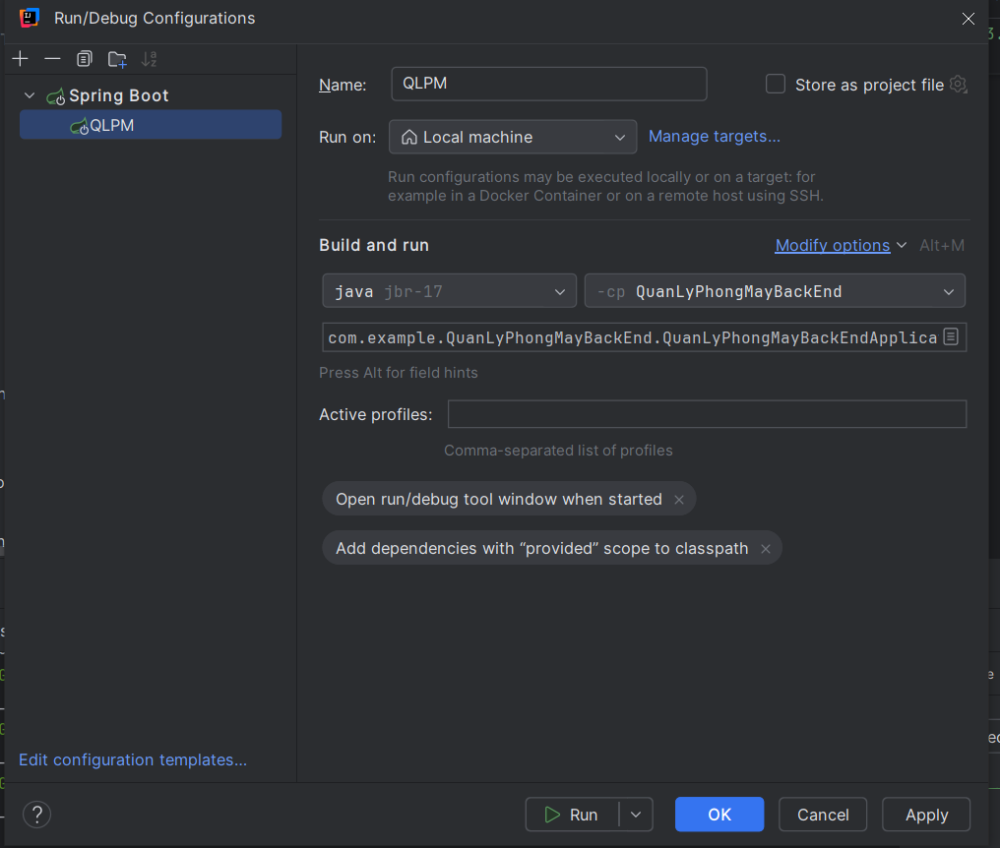
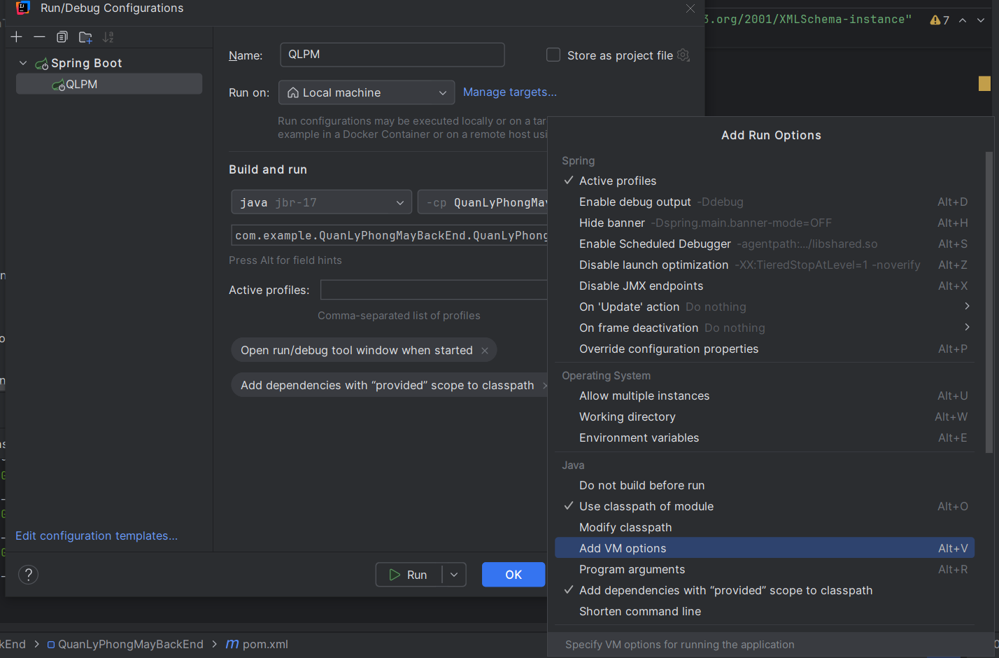

# 1 Tích hợp Glowroot APM vào Ứng dụng Spring Boot

Glowroot là một công cụ giám sát hiệu năng ứng dụng (APM - Application Performance Monitoring) mã nguồn mở, nhẹ và dễ sử dụng cho Java. Nó giúp bạn theo dõi hiệu năng, tìm ra các điểm tắc nghẽn và phân tích lỗi trong ứng dụng của mình.

Hướng dẫn này mô tả cách tích hợp **Glowroot Agent** vào dự án Spring Boot.

## Yêu cầu tiên quyết

1.  **Java Development Kit (JDK):** Đã cài đặt phiên bản JDK phù hợp với dự án Spring Boot của bạn (ví dụ: Java 17 như trong `pom.xml` của bạn).
2.  **Dự án Spring Boot:** Một dự án Spring Boot đang hoạt động.
3.  **Glowroot Agent:** Tệp `glowroot-agent-x.y.z-dist.zip` đã được tải về.

## Bước 1: Tải và Giải nén Glowroot Agent

1.  Truy cập trang chủ Glowroot: [https://glowroot.org/](https://glowroot.org/)
2.  Tải về tệp `glowroot-agent-x.y.z-dist.zip` (thay `x.y.z` bằng phiên bản mới nhất, ví dụ: 0.14.0).
3.  Giải nén tệp zip này vào một vị trí cố định trên máy tính hoặc máy chủ của bạn.
    *   Ví dụ: Giải nén vào `F:\Dowload1\` sẽ tạo ra thư mục `F:\Dowload1\glowroot-0.14.0-dist\`.
4.  **Quan trọng:** Ghi nhớ đường dẫn đầy đủ đến tệp `glowroot.jar` bên trong thư mục vừa giải nén. Dựa trên ví dụ của bạn, đường dẫn sẽ là:
    ```
    F:\Dowload1\glowroot-0.14.0-dist\glowroot\glowroot.jar
    ```
    *(Lưu ý: Tùy thuộc vào hệ điều hành, bạn có thể cần dùng dấu `/` thay vì `\`: `F:/Dowload1/glowroot-0.14.0-dist/glowroot/glowroot.jar`)*

## Bước 2: Cấu hình JVM để sử dụng Glowroot Agent

Cách chính để tích hợp Glowroot Agent là thêm tham số `-javaagent` vào lệnh khởi chạy máy ảo Java (JVM) của ứng dụng Spring Boot. Cách thực hiện phụ thuộc vào môi trường bạn chạy ứng dụng:

### Cách 1: Chạy từ IDE (Ví dụ: IntelliJ IDEA - Khuyến nghị khi phát triển)

1.  Mở IntelliJ IDEA và đi đến `Run` -> `Edit Configurations...`.
2.  Chọn cấu hình chạy (Run Configuration) cho ứng dụng Spring Boot của bạn (ví dụ: `QLPM`).
3.  Tìm đến phần "Build and run". Nhấp vào liên kết **"Modify options"** ở góc trên bên phải.




4.  Trong menu xổ xuống, chọn **"Add VM options"**.



5.  Một ô nhập liệu mới có tên **"VM options"** sẽ xuất hiện.

6.  Dán đường dẫn `-javaagent` vào ô "VM options":
    ```
    -javaagent:F:/Dowload1/glowroot-0.14.0-dist/glowroot/glowroot.jar
    ```
    *(Hoặc sử dụng dấu `\` nếu cần: `-javaagent:F:\Dowload1\glowroot-0.14.0-dist\glowroot\glowroot.jar`)*
7.  **Quan trọng:** Đảm bảo bạn đã chọn **JDK phiên bản 17** (hoặc phiên bản tương thích với Glowroot và dự án của bạn) trong phần "java XX SDK of ..." của cấu hình này. **Không sử dụng Java 23 với Glowroot 0.14.x.**
8.  Nhấn **"Apply"** hoặc **"OK"**.

*(Đối với Eclipse/VS Code: Tìm phần thiết lập "VM arguments" hoặc "JVM arguments" trong cấu hình chạy và thêm dòng `-javaagent:...` tương tự.)*

### Cách 2: Chạy bằng File JAR thực thi (`java -jar ...` - Khi triển khai)

1.  Mở terminal hoặc command prompt.
2.  Sử dụng lệnh sau, thay thế đường dẫn và tên file JAR:
    ```bash
    java -javaagent:F:/Dowload1/glowroot-0.14.0-dist/glowroot/glowroot.jar -jar your-spring-boot-app.jar
    ```
    *   Ví dụ:
        ```bash
        java -javaagent:F:/Dowload1/glowroot-0.14.0-dist/glowroot/glowroot.jar -jar QuanLyPhongMayBackEnd-0.0.1-SNAPSHOT.jar
        ```

### Cách 3: Chạy bằng Maven Plugin (`mvn spring-boot:run`)

1.  Thêm cấu hình `jvmArguments` vào `spring-boot-maven-plugin` trong file `pom.xml`:
    ```xml
    <build>
        <plugins>
            <plugin>
                <groupId>org.springframework.boot</groupId>
                <artifactId>spring-boot-maven-plugin</artifactId>
                <configuration>
                    <jvmArguments>
                        -javaagent:F:/Dowload1/glowroot-0.14.0-dist/glowroot/glowroot.jar
                    </jvmArguments>
                </configuration>
            </plugin>
        </plugins>
    </build>
    ```

### Cách 4: Chạy bằng Gradle Plugin (`gradle bootRun`)

1.  Thêm cấu hình `jvmArgs` vào task `bootRun` trong file `build.gradle` (Groovy):
    ```gradle
    bootRun {
        jvmArgs = ["-javaagent:F:/Dowload1/glowroot-0.14.0-dist/glowroot/glowroot.jar"]
    }
    ```
2.  Hoặc trong file `build.gradle.kts` (Kotlin):
    ```kotlin
    tasks.withType<org.springframework.boot.gradle.tasks.run.BootRun> {
        jvmArgs = listOf("-javaagent:F:/Dowload1/glowroot-0.14.0-dist/glowroot/glowroot.jar")
    }
    ```

### Cách 5: Chạy trong Docker Container

1.  **Sao chép Agent vào Image:** Trong `Dockerfile`, thêm lệnh `COPY` để đưa thư mục Glowroot vào image:
    ```dockerfile
    # Giả sử thư mục glowroot-0.14.0-dist nằm cùng cấp Dockerfile
    COPY glowroot-0.14.0-dist/glowroot /app/glowroot
    ```
2.  **Thêm `-javaagent` vào Lệnh Khởi chạy:** Sửa đổi `ENTRYPOINT` hoặc `CMD` để bao gồm tham số `-javaagent` trỏ đến đường dẫn *bên trong container*:
    ```dockerfile
    ENTRYPOINT ["java", "-javaagent:/app/glowroot/glowroot.jar", "-jar", "/app/your-spring-boot-app.jar"]
    ```

## Bước 3: Khởi chạy Ứng dụng và Truy cập Giao diện Glowroot

1.  Chạy ứng dụng Spring Boot của bạn bằng phương pháp đã được cấu hình ở Bước 2.
2.  Kiểm tra console log khi ứng dụng khởi động. Bạn sẽ thấy một vài dòng thông báo từ Glowroot nếu agent được gắn thành công.
3.  Mở trình duyệt web và truy cập vào địa chỉ:
    ```
    http://localhost:4000
    ```
    *(Nếu ứng dụng chạy trên máy khác, thay `localhost` bằng địa chỉ IP hoặc hostname của máy đó).*

## Bước 4: Khám phá Dữ liệu Giám sát

Giao diện web của Glowroot sẽ hiển thị. Bạn có thể bắt đầu khám phá các thông tin về:

*   Thời gian phản hồi (Response time)
*   Thông lượng (Throughput)
*   Chi tiết các giao dịch/request web (Transactions)
*   Các truy vấn cơ sở dữ liệu (Queries / SQL)
*   Thông tin JVM (Memory, Threads, GC)
*   Và nhiều thông tin khác...

## Lưu ý Quan trọng / Troubleshooting

*   **Phiên bản Java:** Đảm bảo phiên bản Java bạn dùng để *chạy* ứng dụng khớp với phiên bản được Glowroot Agent hỗ trợ và phiên bản cấu hình trong dự án của bạn. Ví dụ: Sử dụng Java 17 để chạy nếu `pom.xml` chỉ định Java 17 và bạn đang dùng Glowroot 0.14.x. Tránh dùng các phiên bản Java quá mới (như 23) nếu agent chưa hỗ trợ chính thức.
*   **Đường dẫn Agent:** Kiểm tra kỹ đường dẫn đến `glowroot.jar` trong tham số `-javaagent`.
*   **Cổng 4000:** Đảm bảo không có ứng dụng nào khác đang sử dụng cổng 4000 trên máy của bạn.
*   **Log Khởi động:** Luôn kiểm tra log console khi khởi động để xác nhận Glowroot agent đã được load.
