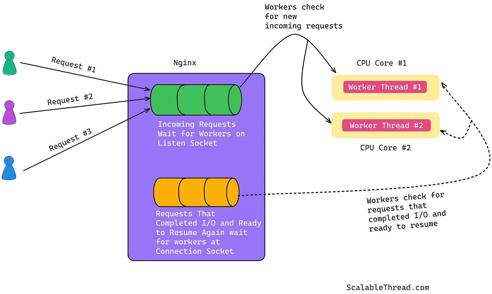

# 1 Cách Nginx Xử Lý Hàng Nghìn Yêu Cầu Đồng Thời: Kiến Trúc Không Chặn Hướng Sự Kiện

Tài liệu này giải thích cách Nginx xử lý hiệu quả một lượng lớn lưu lượng truy cập web đồng thời, tập trung vào kiến trúc không chặn và hướng sự kiện (non-blocking, event-driven) độc đáo của nó.

## Vấn Đề: Xử Lý Đồng Thời Trong Web Server Truyền Thống

Các máy chủ web truyền thống thường xử lý các yêu cầu đồng thời bằng cách tạo ra một tiến trình (process) hoặc một luồng (thread) riêng biệt cho mỗi kết nối mới.

**Quy trình xử lý truyền thống:**

1.  **Tiếp nhận kết nối:** Máy chủ lắng nghe yêu cầu mới.
2.  **Tạo tiến trình/luồng:** Khi có yêu cầu, máy chủ tạo một tiến trình/luồng mới và gán yêu cầu cho nó.
3.  **Chờ đợi và chặn (Blocking):** Tiến trình/luồng này sẽ bị **chặn** (dừng lại và chờ đợi) trong khi thực hiện các hoạt động I/O (Input/Output) như đọc/ghi đĩa hoặc giao tiếp mạng. Việc này lãng phí tài nguyên CPU và bộ nhớ vì tiến trình không làm gì khác trong lúc chờ.
4.  **Kết thúc tiến trình/luồng:** Sau khi yêu cầu hoàn tất, tiến trình/luồng có thể chờ đợi yêu cầu tiếp theo (keep-alive) hoặc bị hủy bỏ. Việc tạo và hủy liên tục này tốn thêm tài nguyên.

**Hạn chế:**

*   **Lãng phí tài nguyên:** Tiến trình/luồng bị chặn không sử dụng CPU hiệu quả.
*   **Chi phí tạo/hủy:** Việc tạo và hủy tiến trình/luồng liên tục tốn kém tài nguyên.
*   **Context Switching:** Việc hệ điều hành chuyển đổi qua lại giữa nhiều tiến trình/luồng (context switching) gây ra độ trễ và tiêu tốn CPU.
*   **Giới hạn bộ nhớ:** Mỗi tiến trình/luồng tiêu tốn một lượng bộ nhớ đáng kể.

## Giải Pháp Của Nginx: Kiến Trúc Hướng Sự Kiện

Nginx áp dụng một cách tiếp cận hoàn toàn khác, dựa trên mô hình không chặn và hướng sự kiện.

### Kiến trúc Nginx

Nginx bao gồm các thành phần chính:

1.  **Tiến trình Master:**
    *   Đọc và xác thực cấu hình.
    *   Tạo và quản lý các tiến trình con.
2.  **Bộ tải Cache (Cache Loader):**
    *   Chạy một lần khi khởi động để tải cache từ đĩa vào bộ nhớ.
3.  **Trình quản lý Cache (Cache Manager):**
    *   Chạy định kỳ để dọn dẹp cache, đảm bảo kích thước cache nằm trong giới hạn cấu hình.
4.  **Tiến trình Worker (Worker Processes):**
    *   **Đây là thành phần xử lý chính!**
    *   Số lượng worker thường được cấu hình bằng số lõi CPU.
    *   Mỗi worker xử lý đồng thời **hàng nghìn** kết nối mạng, đọc/ghi đĩa và giao tiếp với các máy chủ backend.

### Phương Pháp Hướng Sự Kiện (Event-Driven)

Thay vì tạo một tiến trình/luồng cho mỗi yêu cầu, Nginx hoạt động như sau:

1.  **Khởi tạo Workers:** Tiến trình Master tạo ra một số lượng **cố định** các tiến trình Worker khi khởi động.
2.  **Lắng nghe Sự kiện:** Mỗi Worker sử dụng các cơ chế hiệu quả của hệ điều hành (như `epoll` trên Linux, `kqueue` trên BSD) để lắng nghe và quản lý **nhiều sự kiện** (kết nối mới, dữ liệu sẵn sàng để đọc/ghi) trên nhiều kết nối cùng một lúc.
3.  **Xử Lý Không Chặn:**
    *   Khi một Worker nhận yêu cầu, nó bắt đầu xử lý.
    *   Nếu yêu cầu cần thực hiện một thao tác I/O (ví dụ: đọc file từ đĩa, gửi yêu cầu đến backend), Worker **không chờ đợi**. Thay vào đó, nó đăng ký sự kiện "khi nào I/O hoàn thành" với hệ điều hành và **chuyển sang xử lý các sự kiện khác** từ các kết nối khác hoặc chấp nhận kết nối mới.
4.  **Tiếp tục Xử lý:** Khi thao tác I/O hoàn thành, hệ điều hành thông báo cho Worker thông qua một sự kiện. Worker nhận được sự kiện này sẽ tiếp tục xử lý yêu cầu đã bị tạm dừng trước đó.

### Tại Sao Nhanh Hơn?

*   **Ít Tiến Trình Hơn:** Chỉ có một số lượng nhỏ, cố định các tiến trình Worker (thường bằng số lõi CPU).
*   **Giảm Context Switching:** Vì số lượng tiến trình ít và mỗi worker thường gắn với một lõi CPU, chi phí chuyển đổi ngữ cảnh (context switching) giảm đáng kể so với mô hình một tiến trình/luồng cho mỗi yêu cầu.
*   **Không Lãng Phí Tài Nguyên:** Worker không bao giờ bị chặn chờ I/O. Khi một yêu cầu đang chờ, Worker sẽ làm việc khác. Điều này tận dụng tối đa CPU.
*   **Tiết Kiệm Bộ Nhớ:** Không cần cấp phát bộ nhớ riêng cho hàng nghìn tiến trình/luồng.
*   **Khả Năng Mở Rộng Cao:** Một Worker đơn lẻ có thể quản lý hàng nghìn kết nối đồng thời một cách hiệu quả.

## Lợi Ích Của Mô Hình Hướng Sự Kiện

*   **Sử dụng tài nguyên hiệu quả:** Tiêu thụ ít CPU và bộ nhớ hơn đáng kể.
*   **Giảm thiểu Context Switching:** Tăng hiệu suất tổng thể.
*   **Tận dụng CPU tối đa:** Worker luôn bận rộn xử lý các sự kiện thay vì chờ đợi.
*   **Khả năng mở rộng vượt trội:** Xử lý hàng nghìn, thậm chí hàng trăm nghìn kết nối đồng thời trên phần cứng thông thường.

## Cấu Hình Nginx Tối Ưu

Để tận dụng tối đa kiến trúc của Nginx, hãy xem xét các chỉ thị cấu hình sau (`nginx.conf`):

*   `worker_processes auto;` hoặc `worker_processes [số_lõi_CPU];`: Đặt số lượng tiến trình worker bằng số lõi CPU có sẵn. `auto` là lựa chọn phổ biến và thường là tối ưu.
*   `worker_connections [số_kết_nối];`: Xác định số lượng kết nối tối đa mà *mỗi* tiến trình worker có thể xử lý đồng thời (ví dụ: `1024`, `2048`, `4096`...). Tổng số kết nối tối đa = `worker_processes * worker_connections`.
*   `events { use epoll; multi_accept on; }`: (Trên Linux) Sử dụng cơ chế `epoll` hiệu quả và cho phép worker chấp nhận nhiều kết nối cùng lúc.
*   `keepalive_timeout [giây];`: Điều chỉnh thời gian giữ kết nối mở khi không có hoạt động (keep-alive) để tái sử dụng kết nối, giảm độ trễ thiết lập kết nối mới.
*   `gzip on;`: Bật nén Gzip để giảm băng thông mạng cần thiết.
*   Tối ưu hóa kích thước bộ đệm (buffers) như `client_body_buffer_size`, `proxy_buffers`, `fastcgi_buffers`... tùy thuộc vào ứng dụng cụ thể.

## Kết Luận

Kiến trúc hướng sự kiện, không chặn của Nginx là một cuộc cách mạng so với các máy chủ web truyền thống. Bằng cách sử dụng một số lượng cố định các tiến trình worker hiệu quả và cơ chế quản lý sự kiện non-blocking, Nginx có thể xử lý hàng nghìn kết nối đồng thời với hiệu suất vượt trội và sử dụng tài nguyên tối thiểu. Điều này làm cho Nginx trở thành lựa chọn hàng đầu cho các trang web có lưu lượng truy cập cao, API gateway, reverse proxy, và nhiều ứng dụng web hiệu suất cao khác.

---

*Nguồn tham khảo: [How Nginx Handles Thousands of Concurrent Connections](https://newsletter.scalablethread.com/p/how-nginx-handles-thousands-of-concurrent)*
