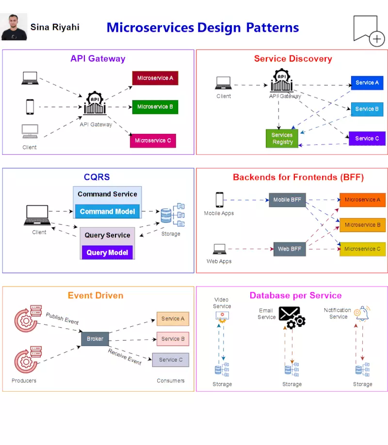

# Microservices Design Patterns: Hướng dẫn & Ứng dụng Thực Tế

Tài liệu này tổng hợp các design pattern phổ biến trong kiến trúc microservices, giúp hiểu rõ hơn về cách thiết kế và xây dựng các hệ thống phân tán hiệu quả.

Dựa trên nội dung và hình ảnh gốc của **Sina Riyahi**, được chia sẻ tại MayFest2025.

**Nguồn tham khảo:** [https://www.linkedin.com/posts/sina-riyahi_microservices-design-patterns-microservices-activity-7326863427832823808-wC7i?utm_source=social_share_send&utm_medium=member_desktop_web&rcm=ACoAABcd9xkB6w57Mmsqti43xtrqzUIgxeAfmT8](https://www.linkedin.com/posts/sina-riyahi_microservices-design-patterns-microservices-activity-7326863427832823808-wC7i?utm_source=social_share_send&utm_medium=member_desktop_web&rcm=ACoAABcd9xkB6w57Mmsqti43xtrqzUIgxeAfmT8)

---

## Các Design Pattern Phổ Biến

Dưới đây là mô tả chi tiết về 6 pattern thường gặp:

### 1. API Gateway Pattern

🧩 **Mô tả:**
API Gateway đóng vai trò như một điểm vào duy nhất cho tất cả các request từ client. Nó định tuyến request tới các microservice phù hợp, có thể thực hiện các tác vụ như xác thực, ủy quyền, giới hạn tốc độ (throttling), tổng hợp dữ liệu (aggregation), caching... trước khi chuyển tiếp hoặc trả về phản hồi.

✅ **Ưu điểm:**
*   Ẩn kiến trúc bên trong khỏi client, giúp client chỉ cần tương tác với một điểm duy nhất.
*   Cho phép xử lý bảo mật, logging, throttling tập trung tại một nơi.
*   Tối ưu hiệu năng với caching, aggregation data từ nhiều service.
*   Giúp service nội bộ đơn giản hơn, không cần xử lý các vấn đề cross-cutting concern.

❌ **Nhược điểm:**
*   Là một Single Point of Failure (SPoF) nếu không được triển khai với High Availability.
*   Có thể trở nên phức tạp khi cần tích hợp nhiều policy hoặc logic đặc thù cho từng loại request/client.
*   Thêm độ trễ nhỏ do request phải đi qua Gateway.

📦 **Use case thực tế:**
*   **Netflix:** Sử dụng API Gateway (Zuul, sau này là Spring Cloud Gateway) để điều hướng lưu lượng người dùng đến hàng trăm microservice khác nhau, xử lý xác thực, giới hạn tốc độ...
*   **Ứng dụng Mobile/Web:** Cần một điểm vào duy nhất để đồng bộ hóa các request từ các nền tảng client khác nhau.

### 2. Service Discovery Pattern

🧩 **Mô tả:**
Trong môi trường microservices động, các service có thể được scale up/down hoặc di chuyển liên tục. Service Discovery cho phép các microservice tự động đăng ký thông tin vị trí (địa chỉ IP, port) của mình với một Service Registry và tìm kiếm các service khác thông qua Registry này thay vì cấu hình thủ công địa chỉ tĩnh.

✅ **Ưu điểm:**
*   Giảm đáng kể cấu hình thủ công giữa các service và client khi địa chỉ thay đổi.
*   Cho phép tự động scale up/down các instance service mà không cần cấu hình lại các service gọi đến nó.
*   Tăng tính linh hoạt và khả năng chịu lỗi khi các instance service bị thay thế.

❌ **Nhược điểm:**
*   Cần triển khai và quản lý thêm một hoặc nhiều instance của service registry (như Eureka, Consul, etcd, Zookeeper).
*   Hệ thống có thể bị ảnh hưởng hoặc ngừng hoạt động khi service registry không sẵn sàng hoặc gặp sự cố.
*   Cần có cơ chế health check để Registry biết được service instance nào còn hoạt động.

📦 **Use case thực tế:**
*   **Kubernetes:** Tự động gán DNS (Service Discovery) cho mỗi pod và service, cho phép các pod tìm thấy nhau bằng tên thay vì địa chỉ IP.
*   **Hệ thống Backend lớn:** Với hàng trăm service cần scale linh hoạt, Service Discovery là bắt buộc để quản lý các kết nối.

### 3. CQRS (Command Query Responsibility Segregation)

🧩 **Mô tả:**
CQRS là một pattern kiến trúc tách biệt rõ ràng logic xử lý các thao tác ghi dữ liệu (Commands - tạo, cập nhật, xóa) và logic xử lý các thao tác đọc dữ liệu (Queries - truy vấn). Thông thường, hai mô hình này sẽ sử dụng các database hoặc schema tối ưu khác nhau.

✅ **Ưu điểm:**
*   Tối ưu hóa hiệu suất độc lập cho luồng đọc (có thể dùng DB cache, denormalized view) và luồng ghi (có thể dùng DB tối ưu cho transaction).
*   Cho phép scale độc lập từng phần (ví dụ: luồng đọc cần scale nhiều hơn luồng ghi).
*   Mô hình đọc và ghi có thể đơn giản hơn do không cần thỏa hiệp cho cả hai mục đích.
*   Phù hợp với kiến trúc Event Sourcing.

❌ **Nhược điểm:**
*   Phức tạp hơn đáng kể so với mô hình CRUD truyền thống (một model cho cả đọc và ghi).
*   Cần có cơ chế đồng bộ hóa trạng thái giữa mô hình ghi và mô hình đọc (thường là thông qua message queue và event).
*   Độ trễ (eventual consistency) có thể xảy ra giữa lúc ghi và lúc dữ liệu được cập nhật ở mô hình đọc.

📦 **Use case thực tế:**
*   **Hệ thống đặt vé:** Luồng ghi (đặt vé, hủy vé) có thể rất nhiều và cần xử lý nhanh, trong khi luồng đọc (tìm kiếm chuyến bay, xem thông tin vé) cũng rất nhiều và cần phản hồi nhanh. CQRS giúp tối ưu riêng từng luồng.
*   **Hệ thống quản lý đơn hàng lớn như Amazon:** Số lượng đơn hàng ghi vào hệ thống lớn, nhưng số lượng truy vấn thông tin đơn hàng từ khách hàng và nhân viên còn lớn hơn nhiều. CQRS giúp scale riêng luồng đọc.

### 4. Backends for Frontends (BFF)

🧩 **Mô tả:**
Thay vì có một backend API Gateway duy nhất phục vụ tất cả các loại client (web, mobile iOS, mobile Android, desktop...), pattern BFF đề xuất mỗi loại frontend nên có một backend riêng biệt được thiết kế và tối ưu hóa cho nhu cầu cụ thể của frontend đó.

✅ **Ưu điểm:**
*   Tối ưu cấu trúc dữ liệu và API trả về chính xác theo nhu cầu của từng loại frontend, tránh trả về thừa hoặc thiếu dữ liệu.
*   Tăng tốc độ phản hồi cho từng nền tảng do backend đã tổng hợp và xử lý dữ liệu phù hợp.
*   Frontend team có thể độc lập phát triển và triển khai backend của riêng mình.
*   Giảm gánh nặng xử lý dữ liệu ở phía client.

❌ **Nhược điểm:**
*   Tốn công bảo trì nhiều backend codebases khác nhau.
*   Dễ xảy ra trùng lặp logic xử lý nếu không có chiến lược chia sẻ code hoặc module phù hợp giữa các BFF.
*   Cần quản lý thêm nhiều deployment unit.

📦 **Use case thực tế:**
*   **Spotify:** Sử dụng mô hình BFF cho các client desktop, mobile, web để cung cấp trải nghiệm người dùng được tối ưu hóa trên từng nền tảng.
*   **Hệ thống Đa nền tảng:** Khi ứng dụng có nhiều giao diện người dùng khác nhau (ví dụ: ứng dụng admin web, ứng dụng người dùng mobile) và mỗi giao diện có nhu cầu dữ liệu và luồng xử lý rất khác biệt.

### 5. Event-Driven Pattern

🧩 **Mô tả:**
Trong kiến trúc này, các service không gọi trực tiếp lẫn nhau mà giao tiếp thông qua các sự kiện (event). Khi một service thực hiện một hành động quan trọng, nó sẽ phát ra một event vào một message broker (như Kafka, RabbitMQ, ActiveMQ...). Các service khác quan tâm đến event đó sẽ đăng ký lắng nghe và xử lý nó một cách bất đồng bộ.

✅ **Ưu điểm:**
*   Giảm đáng kể độ phụ thuộc (coupling) giữa các service, các service chỉ cần biết format của event chứ không cần biết ai sẽ xử lý nó.
*   Dễ dàng mở rộng (scale) hệ thống bằng cách thêm các consumer mới xử lý cùng loại event.
*   Hệ thống có khả năng phản ứng (reactive) tốt hơn với các thay đổi trạng thái.
*   Cho phép xử lý bất đồng bộ, cải thiện hiệu năng tổng thể.

❌ **Nhược điểm:**
*   Khó debug và theo dõi luồng xử lý do không có đường đi tuần tự rõ ràng giữa các service.
*   Phức tạp trong việc đảm bảo tính đúng đắn của dữ liệu (eventual consistency) và xử lý các trường hợp thất bại (ví dụ: message duplication, failed consumer).
*   Cần triển khai và quản lý hạ tầng message broker.

📦 **Use case thực tế:**
*   **Hệ thống Thanh toán / E-commerce:** Khi đơn hàng được tạo thành công (Event: `OrderCreated`), các service khác có thể phản ứng lại (Gửi email xác nhận, Cập nhật kho hàng, Gửi thông báo cho bên vận chuyển...).
*   **Uber:** Sử dụng kiến trúc event-driven để xử lý việc điều phối xe, cập nhật vị trí theo thời gian thực, xử lý yêu cầu chuyến đi...

### 6. Database per Service Pattern

🧩 **Mô tả:**
Mỗi microservice sở hữu database riêng của nó. Không có service nào khác được phép truy cập trực tiếp vào database của service khác. Việc giao tiếp và chia sẻ dữ liệu giữa các service phải được thực hiện thông qua API hoặc Events.

✅ **Ưu điểm:**
*   Tăng tính độc lập cao cho mỗi service, cho phép team phát triển lựa chọn công nghệ database phù hợp nhất (SQL, NoSQL) và scale database độc lập.
*   Giảm coupling giữa các service và các team phụ trách service đó. Thay đổi schema database của một service không ảnh hưởng trực tiếp đến service khác.
*   Đơn giản hóa việc quản lý dữ liệu bên trong từng service.

❌ **Nhược điểm:**
*   Khó khăn khi cần thực hiện các truy vấn yêu cầu join dữ liệu từ nhiều service khác nhau (cần các giải pháp như API Composition, CQRS Query Side, Data Lake).
*   Cần có các cơ chế phức tạp hơn để duy trì tính nhất quán dữ liệu giữa các service trong các workflow phức tạp (ví dụ: Saga Pattern).
*   Tăng chi phí vận hành do quản lý nhiều database instance riêng biệt.

📦 **Use case thực tế:**
*   **Hệ thống lớn như Shopify:** Mỗi domain chính (orders, users, inventory, payments...) có database riêng biệt để đảm bảo tính độc lập và khả năng scale của từng phần.
*   **Hệ thống Đa quốc gia:** Cần tách vùng lưu trữ dữ liệu theo quốc gia để đáp ứng yêu cầu về luật định hoặc tối ưu hiệu năng theo địa lý.

---

## Kết Luận

Việc lựa chọn và áp dụng các design pattern phù hợp là chìa khóa để xây dựng các hệ thống microservices mạnh mẽ, linh hoạt và dễ bảo trì. Mỗi pattern đều có ưu nhược điểm riêng và cần được cân nhắc dựa trên ngữ cảnh cụ thể của dự án.

| Pattern                  | Ưu điểm nổi bật                                  | Điểm cần cân nhắc                                 |
| :----------------------- | :----------------------------------------------- | :------------------------------------------------ |
| **API Gateway**          | Tập trung điều phối, bảo mật, caching, logging  | SPoF nếu không dùng High Availability, phức tạp    |
| **Service Discovery**    | Tự động scale, tránh cấu hình thủ công           | Cần service registry, health check, tiềm ẩn lỗi registry |
| **CQRS**                 | Scale riêng đọc/ghi, tối ưu hiệu năng            | Phức tạp hơn CRUD, cần đồng bộ dữ liệu, eventual consistency |
| **BFF**                  | Tối ưu cho từng frontend, độc lập phát triển    | Dễ trùng lặp logic, tốn công bảo trì nhiều backend |
| **Event Driven**         | Không đồng bộ, giảm coupling, mở rộng linh hoạt | Khó debug, phức tạp xử lý thất bại/nhất quán dữ liệu |
| **Database per Service** | Độc lập cao, scale riêng DB theo nhu cầu        | Thiếu join trực tiếp, phức tạp đồng bộ giữa các DB |

Hiểu rõ các pattern này sẽ giúp bạn đưa ra quyết định thiết kế sáng suốt hơn khi làm việc với kiến trúc microservices.